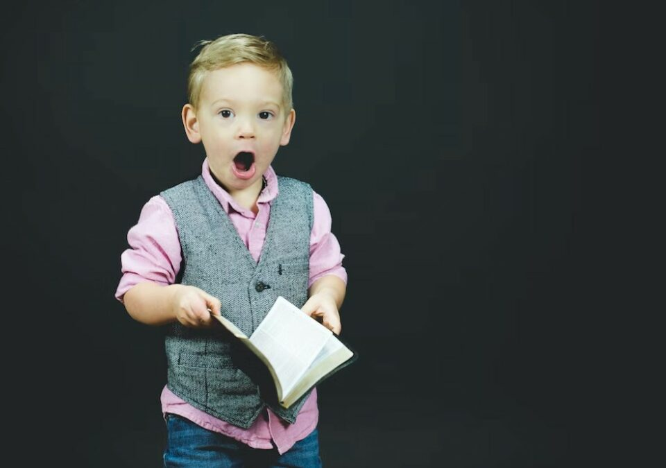
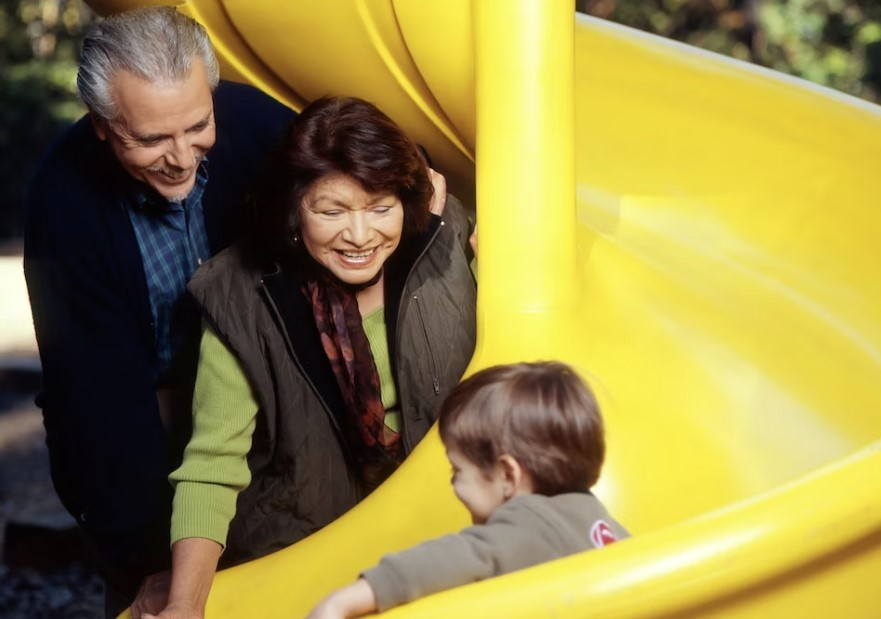
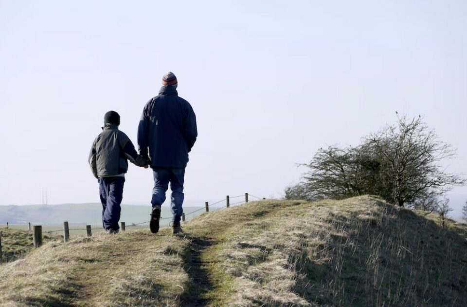
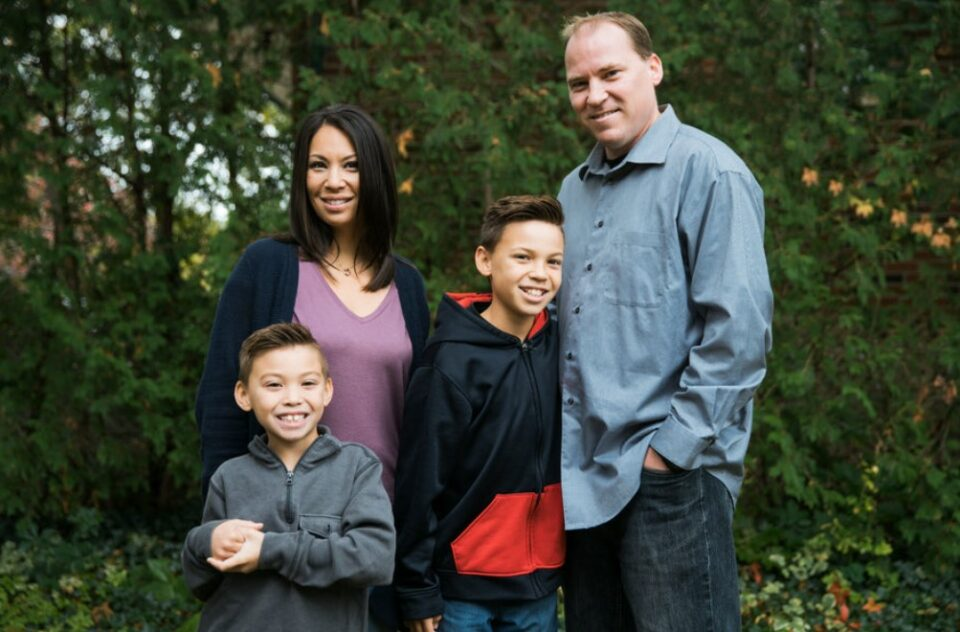

This article has been written and researched by our expert Loveable through a precise methodology. [Learn more about our methodology](https://avada.io/loveable/our-methodological.html)

[Loveable](https://avada.io/loveable/) > [Blog](https://avada.io/loveable/blog/) > [Family](https://avada.io/loveable/family/)

# Embracing Fatherhood as an Older Dad: Things You Need to Know 

Written by [Rose Bryne](https://avada.io/loveable/author/rose/) Last Updated on August 18, 2023

- [How old is considered an “Older Dad”?](https://avada.io/loveable/blog/older-dad/#wp-block-heading-2-3)
- [10 Pros and Cons of Being an Older Dad](https://avada.io/loveable/blog/older-dad/#wp-block-heading-2-6)
    - [6 Pros of Being an Older Dad](https://avada.io/loveable/blog/older-dad/#wp-block-heading-3-7) 
        - [1\. You’re Better Prepared](https://avada.io/loveable/blog/older-dad/#wp-block-heading-4-8)
        - [2\. Financially Stable](https://avada.io/loveable/blog/older-dad/#wp-block-heading-4-11)
        - [3\. Increased Intelligence](https://avada.io/loveable/blog/older-dad/#wp-block-heading-4-13)
        - [4\. Patience and Wisdom](https://avada.io/loveable/blog/older-dad/#wp-block-heading-4-17)
        - [5\. They may have more time for children.](https://avada.io/loveable/blog/older-dad/#wp-block-heading-4-20)
        - [6\. Parenting Memories](https://avada.io/loveable/blog/older-dad/#wp-block-heading-4-24) 
    - [4 Cons of Being an Older Dad](https://avada.io/loveable/blog/older-dad/#wp-block-heading-3-26)
        - [1\. Health Problems](https://avada.io/loveable/blog/older-dad/#wp-block-heading-4-27)
        - [2\. Lack of Energy](https://avada.io/loveable/blog/older-dad/#wp-block-heading-4-30)
        - [3\. Limitations In Physical Health](https://avada.io/loveable/blog/older-dad/#wp-block-heading-4-33) 
        - [4\. Diseases And Neurological Issues](https://avada.io/loveable/blog/older-dad/#wp-block-heading-4-36)
- [7 Rules to Become a Good Older Dad](https://avada.io/loveable/blog/older-dad/#wp-block-heading-2-38)
    - [1\. One is One, but Two is Four](https://avada.io/loveable/blog/older-dad/#wp-block-heading-3-39)
    - [2\. Understand Your Limitation](https://avada.io/loveable/blog/older-dad/#wp-block-heading-3-44) 
    - [3\. Be Confident!](https://avada.io/loveable/blog/older-dad/#wp-block-heading-3-47)
    - [4\. Mindfulness](https://avada.io/loveable/blog/older-dad/#wp-block-heading-3-51)
    - [5\. Be Your Children’s Role Model](https://avada.io/loveable/blog/older-dad/#wp-block-heading-3-54)
    - [6\. Discipline with love](https://avada.io/loveable/blog/older-dad/#wp-block-heading-3-59)
    - [7\. Father’s Jobs is an Endless Road](https://avada.io/loveable/blog/older-dad/#wp-block-heading-3-63) 
- [Final Thoughts](https://avada.io/loveable/blog/older-dad/#wp-block-heading-2-68)

Entering fatherhood in the later stages of life may seem intimidating, but it also holds the promise of a fulfilling and enriching journey. As an older dad, you may have unique considerations to take into account, such as potential health concerns, [financial stability](https://avada.io/loveable/tricks-to-save-money-amazon/), and generational differences. However, with the right mindset and some practical tips and insights, you can embrace fatherhood and navigate this exciting chapter in your life.

In this article, we’ll delve into the challenges and joys of being an **older dad**, offering advice on everything from preparing for fatherhood to building a strong relationship with your child. Whether you’re approaching fatherhood for the first time or adding to your family, we hope this article will provide you with valuable information and support. So, let’s dig deep into it and find out what it means to be an older dad.

## How old is considered an “Older Dad”?

The definition of an “older dad” can vary depending on the context and individual perspectives. Generally, advanced paternal age is typically considered to be [40 years](https://avada.io/loveable/40th-birthday-gifts-men/) or older at the time of a child’s birth. However, this definition may vary depending on a particular region’s cultural and societal norms. 

Additionally, it’s worth noting that advanced paternal age is associated with certain health risks and may increase the likelihood of certain genetic disorders in offspring.

## 10 Pros and Cons of Being an Older Dad

### 6 Pros of Being an Older Dad 

#### 1\. You’re Better Prepared

While age alone does not determine emotional maturity, older dads may be better emotionally prepared for fatherhood due to their life experiences and perspective. They may have had more time to reflect on their goals and values and to establish a stable career and financial situation. This can result in a greater sense of security and readiness to take on the responsibilities of parenthood.

#### 2\. Financially Stable

By the time most gentlemen approach their forties or fifties, they have usually laid a solid foundation for their careers and attained a greater level of financial stability. This is the natural progression for men in many cultures as they embark on their career journey in their twenties and thirties, gradually climbing the ladder of success until they reach their forties and fifties, where they often sit comfortably at the peak of their professions, enjoying a steady and predictable income.

#### 3\. Increased Intelligence

There’s no crystal ball to predict a child’s intelligence, but research indicates that offspring born to seasoned fathers may have an intellectual edge. What is the reason behind this intriguing phenomenon? It’s suggested that as men age, their sperm accumulates advantageous mutations that could positively impact their offspring’s cognitive abilities and verbal skills.

It’s worth noting that there are other possible explanations for this link, such as the fact that older dads often have more established careers and higher levels of education. This can create an environment that stimulates the intellectual curiosity in their children. 

#### 4\. Patience and Wisdom

It’s commonly believed that older dads may have more patience and wisdom than their younger counterparts. With age often comes a greater understanding of the world and a broader perspective on life. Older dads may have more experience in dealing with difficult situations and be better equipped to handle the challenges of parenting. 

Additionally, they may have already gone through the ups and downs of parenthood with their older children, giving them a greater sense of calm and confidence when raising younger kids.

#### 5\. They may have more time for children.

As dads get older, they may find themselves with more time to devote to their children. With work responsibilities potentially winding down and a greater sense of life perspective, older dads can prioritize quality time with their kids. 

This can mean engaging in activities that foster learning, playing games together, or simply having meaningful conversations. By making the most of their time with their children, older dads can create a strong bond that will last a lifetime.

#### 6\. Parenting Memories 

Did you know that your parenting memories can be accessed better depending on when you had your last child? It’s true! A study conducted by the University of Southern California in 2016 found that being an older mom can actually benefit your mental state later in life. The study examined over 800 women aged between 41 and 92 and discovered that those who had their last baby after the age of 35 had better cognition and verbal memory later in life than those who became parents at a young age.

### 4 Cons of Being an Older Dad

#### 1\. Health Problems

As mature gentlemen age, they become increasingly susceptible to health ailments that could have adverse effects on their ability to remain active and engaged in their progeny’s lives. Certain typical health concerns that may confront senior fathers include Chronic Diseases, Arthritis, Sleep Disorders, and Cognitive Decline.

#### 2\. Lack of Energy

As men age, they may experience a decrease in energy levels, which can be particularly challenging for older dads. Compared to younger dads, older fathers may find it more difficult to keep up with the energy demands of their children and may struggle to engage in active and energetic play. 

This lack of energy can also impact the overall quality of their interactions with their children, making it harder for them to connect and engage in meaningful ways.

#### 3\. Limitations In Physical Health 

As men get older, they may encounter physical changes that can affect their ability to keep up with their children. Men who are 40 years old or older may experience a decrease in energy and stamina due to these changes. Some of the typical changes include Decreased Metabolism, Decreased Testosterone, Sleep Disturbances, Decreased Cardiovascular Fitness, and Increased Risk of Chronic Diseases. 

#### 4\. Diseases And Neurological Issues

As fathers age like a fine wine, their offspring may be at a slightly higher risk for certain rare ailments and neurological concerns. Studies have found that as men age, there is a higher risk of genetic mutations occurring in their sperm, which can potentially lead to these health problems in their offspring. While the overall risk is still relatively low, it’s important for older fathers and their partners to be aware of these potential risks and to consider genetic testing and counseling before planning a pregnancy.

## 7 Rules to Become a Good Older Dad

### 1\. One is One, but Two is Four

When you have more than one child, it’s recommended to square the number of children rather than simply adding them up. The challenges of raising two children under the age of 2 can be significantly different from raising just one child.

As an older dad, the importance of this rule became apparent to him as he realized that he needed to be more mindful of his energy and resources. Though younger dads may have more energy to spare, this rule is still important to keep in mind when raising multiple children. 

For instance, when there is only one child, the parent could focus solely on them, but with two, there are two sets of needs to be met, and the parent’s energy is divided accordingly.

### 2\. Understand Your Limitation 

Embracing the joys of fatherhood as the years go by can be a challenge, as your body may not be as spry as it once was. But fear not, older dads! By understanding and addressing the changes in your physical health, you can ensure that you’ll be able to keep up with your energetic little ones and cherish every precious moment with them.

This might involve adjusting your diet and daily habits, seeking medical attention when needed, and finding ways to conserve your energy. By understanding your health limitations, you can make sure you’re using your time and energy wisely and being there for your kids as they grow up. 

### 3\. Be Confident!

Confidence is key, regardless of age or life circumstances. As an older dad, it’s important to maintain a sense of self-assurance and belief in oneself. 

This can be especially challenging when faced with physical or health limitations, but it’s important to remember that age does not define one’s worth or abilities. Practicing self-care, such as exercise and mindfulness, can help boost confidence and improve overall well-being.

### 4\. Mindfulness

As a child, people used to tell us to “mind what you’re doing.” Nowadays, this expression is not as commonly used, but being mindful is still a crucial aspect of healthy parenting, especially with older dads. 

By listening to your thoughts and staying present at the moment, you can prevent yourself from overreacting to potential mishaps with your children. Instead, you should focus on the joy and laughter they bring, which will help you become a better dad.

### 5\. Be Your Children’s Role Model

Fathers serve as role models to their children, even though sometimes they don’t realize it. This role is not outside the scope of an older dad.

When a father spends quality time with his daughter, she learns the value of being respected by boys and gains an understanding of what qualities to seek in a future partner. 

Fathers also teach their sons and daughters important life lessons, such as honesty, humility, and responsibility, through their own actions and behaviors.

### 6\. Discipline with love

All parents, from old to young, must learn to teach their children with reasonable discipline. 

Children require positive guidance and discipline, which should not be used as a punishment but rather to establish appropriate boundaries. 

Dads can help their children understand the outcomes of their actions and recognize good behavior. Fathers who discipline their children in a gentle and equitable manner demonstrate their love for them.

### 7\. Father’s Jobs is an Endless Road 

As children spread their wings and soar into adulthood, they still turn to their fathers for a guiding light. Whether it’s picking a path, forging a career, or tying the knot and starting a family, fathers remain a vital presence in their children’s journey.

Their words of wisdom and unwavering support can help their children navigate the twists and turns of life and build a foundation for their own families filled with love and happiness.

**_Check Out_**: [Cheap But Thoughtful Gifts For Dad](https://avada.io/loveable/cheap-gifts-dad/)

## Final Thoughts

Remember that being an **older dad** has its advantages and challenges. By staying mindful of your limitations and prioritizing your health, you can still be an engaged and positive role model for your children. Through positive guidance, discipline, and continued support, you can continue to play an essential part in their lives even as they grow and build their own families. Embrace fatherhood with love, patience, and a willingness to learn and adapt.

- [How old is considered an “Older Dad”?](https://avada.io/loveable/blog/older-dad/#wp-block-heading-2-3)
- [10 Pros and Cons of Being an Older Dad](https://avada.io/loveable/blog/older-dad/#wp-block-heading-2-6)
    - [6 Pros of Being an Older Dad](https://avada.io/loveable/blog/older-dad/#wp-block-heading-3-7) 
        - [1\. You’re Better Prepared](https://avada.io/loveable/blog/older-dad/#wp-block-heading-4-8)
        - [2\. Financially Stable](https://avada.io/loveable/blog/older-dad/#wp-block-heading-4-11)
        - [3\. Increased Intelligence](https://avada.io/loveable/blog/older-dad/#wp-block-heading-4-13)
        - [4\. Patience and Wisdom](https://avada.io/loveable/blog/older-dad/#wp-block-heading-4-17)
        - [5\. They may have more time for children.](https://avada.io/loveable/blog/older-dad/#wp-block-heading-4-20)
        - [6\. Parenting Memories](https://avada.io/loveable/blog/older-dad/#wp-block-heading-4-24) 
    - [4 Cons of Being an Older Dad](https://avada.io/loveable/blog/older-dad/#wp-block-heading-3-26)
        - [1\. Health Problems](https://avada.io/loveable/blog/older-dad/#wp-block-heading-4-27)
        - [2\. Lack of Energy](https://avada.io/loveable/blog/older-dad/#wp-block-heading-4-30)
        - [3\. Limitations In Physical Health](https://avada.io/loveable/blog/older-dad/#wp-block-heading-4-33) 
        - [4\. Diseases And Neurological Issues](https://avada.io/loveable/blog/older-dad/#wp-block-heading-4-36)
- [7 Rules to Become a Good Older Dad](https://avada.io/loveable/blog/older-dad/#wp-block-heading-2-38)
    - [1\. One is One, but Two is Four](https://avada.io/loveable/blog/older-dad/#wp-block-heading-3-39)
    - [2\. Understand Your Limitation](https://avada.io/loveable/blog/older-dad/#wp-block-heading-3-44) 
    - [3\. Be Confident!](https://avada.io/loveable/blog/older-dad/#wp-block-heading-3-47)
    - [4\. Mindfulness](https://avada.io/loveable/blog/older-dad/#wp-block-heading-3-51)
    - [5\. Be Your Children’s Role Model](https://avada.io/loveable/blog/older-dad/#wp-block-heading-3-54)
    - [6\. Discipline with love](https://avada.io/loveable/blog/older-dad/#wp-block-heading-3-59)
    - [7\. Father’s Jobs is an Endless Road](https://avada.io/loveable/blog/older-dad/#wp-block-heading-3-63) 
- [Final Thoughts](https://avada.io/loveable/blog/older-dad/#wp-block-heading-2-68)

### [Rose Bryne](https://avada.io/loveable/author/rose/)

Hi, I'm Rose! I love animals and spending time with kids. At Loveable, I help people find unique gifts for special occasions like Valentine's Day, housewarmings, and graduations. I enjoy finding gifts for kids, teens, and animal lovers that match their interests and personalities. Making gift-giving a pleasant experience is my priority. Let me assist you in finding the perfect gift!

- [Twitter](https://twitter.com/intent/tweet)
- [Facebook](https://www.facebook.com/sharer/sharer.php)
- [instagram](https://avada.io/loveable/blog/older-dad/)
- [pinterest](https://www.pinterest.com/loveablellc/)

## Related Posts

[### 30 Best 4 Year Old Birthday Party Ideas For A Memorable Celebration](https://avada.io/loveable/blog/4-year-old-birthday-party-ideas/) 

[

### 16th Birthday Party Ideas to Make an Unforgettable Day

](https://avada.io/loveable/blog/16th-birthday-party-ideas/)

[

### 150+ Inspirational Birthday Quotes to Spread Joy on Special Day

](https://avada.io/loveable/blog/inspirational-birthday-quotes/)

[

### 160+ Birthday Wishes for Wife to Express Eternal Love

](https://avada.io/loveable/blog/birthday-wishes-for-wife/)

[### 90+ Heart Touching Birthday Wishes for Niece to Make Her Day Extra Special](https://avada.io/loveable/blog/birthday-wishes-for-niece/)
