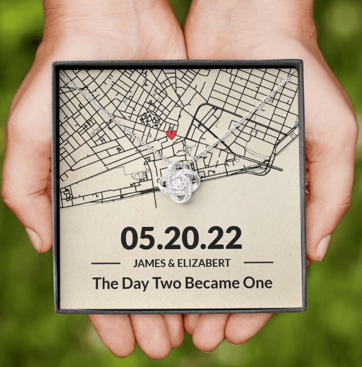

This article has been written and researched by our expert Loveable through a precise methodology. [Learn more about our methodology](https://avada.io/loveable/our-methodological.html)

[Loveable](https://avada.io/loveable/) > [Blog](https://avada.io/loveable/blog/) > [Relationship](https://avada.io/loveable/relationship/)

# Embracing the Unspoken: 90 Best Love Paragraphs For Her 2023

Written by [Luna Miller](https://avada.io/loveable/author/luna/) Last Updated on August 22, 2023

- [Cute Love Paragraphs For Her To Brighten Her Day](https://avada.io/loveable/blog/love-paragraphs-for-her/#wp-block-heading-2-3)
- [Romantic Paragraphs For Her To Make A Deep Connection](https://avada.io/loveable/blog/love-paragraphs-for-her/#wp-block-heading-2-15)
- [Funny Love Paragraphs For Her To Make Her Laugh](https://avada.io/loveable/blog/love-paragraphs-for-her/#wp-block-heading-2-27)
- [Short Love Paragraphs For Her To Show Your Love](https://avada.io/loveable/blog/love-paragraphs-for-her/#wp-block-heading-2-39) 
- [Long Love Paragraphs For Her To Let Her Know Feelings](https://avada.io/loveable/blog/love-paragraphs-for-her/#wp-block-heading-2-51)
- [Sweet Paragraphs For Your Girlfriend to Strengthen Your Relationship](https://avada.io/loveable/blog/love-paragraphs-for-her/#wp-block-heading-2-64) 
- [Deep Love Paragraphs For Her To Sharing Heartfelt Love](https://avada.io/loveable/blog/love-paragraphs-for-her/#wp-block-heading-2-76) 
- [Emotional love paragraphs for her to rekindle the love](https://avada.io/loveable/blog/love-paragraphs-for-her/#wp-block-heading-2-88)
- [Good morning paragraphs that make her day special](https://avada.io/loveable/blog/love-paragraphs-for-her/#wp-block-heading-2-100) 
- [Romantic gifts that make her fall in love](https://avada.io/loveable/blog/love-paragraphs-for-her/#wp-block-heading-2-112)
    - [The Day Two Became One Necklace](https://avada.io/loveable/blog/love-paragraphs-for-her/#wp-block-heading-3-113)
    - [I Was Born To Love You Wooden Sign](https://avada.io/loveable/blog/love-paragraphs-for-her/#wp-block-heading-3-116)
    - [Vinyl Record Song Lyrics Custom](https://avada.io/loveable/blog/love-paragraphs-for-her/#wp-block-heading-3-119)
    - [When It Began With Map Key Holder](https://avada.io/loveable/blog/love-paragraphs-for-her/#wp-block-heading-3-122)
    - [Melody Of Love Acrylic Plaque](https://avada.io/loveable/blog/love-paragraphs-for-her/#wp-block-heading-3-126)
    - [10 Reasons Why I Love You Led Light](https://avada.io/loveable/blog/love-paragraphs-for-her/#wp-block-heading-3-130)
- [Final Thought](https://avada.io/loveable/blog/love-paragraphs-for-her/#wp-block-heading-2-137)

Love is a complicated emotion that is difficult to express in words. While many of us strive to express our emotions with great gestures or impassioned speeches, sometimes, the unspoken moments truly capture the core of our love. It’s how we hold hands, gaze into one other’s eyes, and laugh together as if nothing else matters. These unspoken expressions of love are frequently the most powerful because they speak to our profound bond with our partners.

If you’re looking for a meaningful and sincere method to show your love, this post of **90 finest love paragraphs for her in 2023** is what you really need right now. Each paragraph is written emotionally to capture the essence of love. These paragraphs can help you discover the appropriate words to convey your sentiments, from deep professions of love to simple yet powerful statements of devotion. Therefore, whether you want to sweep her off her feet or just remind her how much she means to you, embrace the unsaid with our collection of love paragraphs and watch your love story blossom.

## **Cute Love Paragraphs For Her To Brighten Her Day**

1. Is it already dark there? It is already dark here. There are a large number of stars in the sky. The sky always amazes me. It seems to be limitless without any boundaries. You have a strange resemblance to this sky. You amaze me like this beautiful sky, and my feelings for you have no limitations. I am simply unable to put limits or boundaries on my love for you. It keeps on increasing.
2. The rising sun always brightens my morning. The cool, soothing breeze in the evening cools my thoughts. The singing birds bring untold joy to my heart. However, nothing makes me feel complete like seeing your beautiful face. I love you and will always love you.
3. I want you to know that you are essential in my life. You’re the reason I do everything. When I get up in the morning, I feel so grateful for every second I have with you and have here on earth. You give my life meaning. You give my days such joy. And you are the reason I smile. Thank you for being with me and for joining me on this journey through life. Your love is everything to me.
4. When you came into my life, I left all my past behind me. I just love this newly found love that makes me feel like a baby again, my sugar I adore you so much.
5. I must be the luckiest man in the world to have such a special person for their love. When I am next to you, I am always pinching myself to confirm that what I see is real. You are everything that I ever needed in this life, and I cannot imagine life without you. I love you, darling.
6. A day that is void of your voice is to mean an incomplete one. For with your voice comes soul-melting laughter, which is all I need to have a great and happy day. I hope mine makes you feel the same way. 
7. The sun is rising in the sky, but to me, the day doesn’t start until you’ve risen out of bed. You’re the only source of light and warmth I need, lighting up my life with your smile and warming me with your mere presence. Now that you’ve gotten up and read this, my day has indeed started. Thank you!
8. You’re my best friend. The person I can tell all my secrets to, the first person I want to talk to when I wake up, and the last person I want to talk to before I drift off to sleep. When something good happens to me, you’re the first person I want to tell. When I’m troubled by something or if I get bad news, you’re the one I go to for comfort and support. But you’re so much more to me than a friend; you’re the love of my life. You’re my friend, my lover, my comfort, and my strength. I am so lucky to have you. I just wanted you to know how happy I am to have you in my life.
9. The doctor took an x-ray of my heart and I almost fainted. He asked me what had happened with a scared look on his face. I told him, don’t worry, I gave my heart to you. That’s why it is missing.
10. Watching you walk across a room is the greatest gift. The way you move is so graceful and effortless. The way you smile makes me feel at peace. Knowing you’re walking towards me is a feeling so hard to describe. It’s like coming home, a comfort; only the home is coming to me. I will never know such love, such peace, as you. You’re my home.

## **Romantic Paragraphs For Her To Make A Deep Connection**

1. You have been working so hard lately, and I do not want you to think that any of that work goes unnoticed. You are, without a doubt, the most incredible woman I have ever met, and the strength that you have and the challenges you face and defeat every day are honestly awe-inspiring. I hope you never feel unappreciated for all that you do for everyone around you and also us. You truly are the glue that holds everything together, and the world is better off because you are in it.
2. You and I have been together for a long time now, but there has yet to be a day that passes by in which I find myself not thinking about how lucky I am to have you in my life. You are everything I could have ever asked for in a partner. The stars really did align for you and me to be together in the most perfect circumstances. I guess all of the wishings on those stars that I must have done as a kid paid off the first time your eyes met mine and I knew we were destined to be together forever.
3. Whenever you are in a bad place in your life, just remember that you have someone out there who roots for your happiness. That person is me.
4. Your love inspires me to aim for the top in my career. It pushes me on and challenges me to take charge and to bring home results of sweet-smelling savor!
5. Anytime I want to tell you how much you mean to me. I find it hard to capture the essence of your value in mere words. Yet, my heart won’t let me rest until I speak out its desire. The best way I can say it is that you are, to me, a diamond discovered in the most unexpected place. Do you know what is done with such a treasure? It is cherished and esteemed above any other item of an endowment. That is how I value you, my priceless jewel.
6. Comparing the before and after years of my life with you, I must confess that I am one of the luckiest gents alive to be in a relationship with a lady with a heart of gold. You don’t even have to believe it; you are too modest to accept that you are special. But that doesn’t stop me from screaming my good luck to the hearing of the whole world.
7. As the dew of the morning, your love brings refreshment to my soul. As the night can’t have enough of the stars, so my life depends on the light of your love to shine. I belong to you, sweetheart.
8. I will have to walk in your shoes as a woman, to understand the weight of your sacrifice to keep our home running. It’s impossible for me to know all that you go through for us. But bear in mind that I am ever grateful to you as my loving wife and the mother of our home. Anything you want, baby, I am ready to do for your happiness.
9. Between you and I, there’s love nestled comfortably, gloriously beaming its light of tender affection on our young hearts, and urging us to stick to the goodness it reveals in us.
10. I am convinced that my achievement so far in life would have been a fairy tale without your unwavering support for my radical dreams. Thanks for all that you have done for me, angel.

## **Funny Love Paragraphs For Her To Make Her Laugh**

1. If you were Romeo and I were Juliet; our story would have been slightly different than the original one written by Shakespeare. We wouldn’t have died for each other in the end – we would have lived for each other even after the end. I love you.
2. Your smile can be compared to a flower. Your voice can be compared to a cuckoo, Your innocence to a child, But in stupidity, you have no comparison, You’re the best!
3. Mathematicians would have been correct if “You plus me” equals “Perfect Love.” Isn’t that what we are? Thanks for being mine.
4. I think you are suffering from a lack of vitamin ‘Me’.I love you with all my belly. I would say heart, but my belly is bigger.
5. People always tell me there is plenty of fish in the sea. But who wants to date a fish, after all?
6. There’s just one thing about you I want to change. – Your last name!
7. Love is like wetting your pants. Everyone else sees it, but only you can feel it. Thank you for peeing in my pants.
8. I just had a really bad day. I always feel better after seeing a pretty girl smile. Would you please smile for me?
9. You are in my heart, my mind, and my entire body. In fact, my doctor says that you must be a parasite! The brain is the most impressive organ in our whole body. From the day you are born, it works 24 hours a day, 365 days a year, right up until you fall in love. Love is when I walk to the other side of the classroom to sharpen my pen so that I can you. Only to realize that I am holding a pen. 
10. I have had an awful day, and it always makes me feel better to see a pretty girl smile. So, would you smile for me?

## **Short Love Paragraphs For Her To Show Your Love** 

1. You are my wife, friend, and the closest companion in a world built on love—you are my light when there is darkness, my joy in times of sadness, and my energy in times of weakness. My sweet love, I adore you, and that is the truth.
2. My love for you runs so deep in my veins. There is no single moment that I am not thinking of you. All I think of are the special moments that we spent together. You are my world, my future, my everything.
3. How can I go a day without singing? I love you, the love of my life, the girl who has been the reason for my happiness. If fate had not made you the joy of my life, then there wouldn’t be a point in living my life. I am saying I am nothing without you in my life. I love you so much.
4. I keep loving you every single day because you are the one for me. My love keeps growing stronger every second and I can’t explain how happy I am. Will you please explain what you did to my heart I can’t stop thinking of you!
5. You make me want to be a better man. I love you for loving me the way I am. You have shown me that I am worthy of love and have given me a lovely family. I will keep the end of my bargain by being the best partner in the world for you.
6. I smile because you smile. I laugh when I see you happy. Your tears shatter my heart. I want you to smile often because that beautiful smile looks so good on you. Whatever it takes, I am here to add to your happiness.
7. Not reminiscing about you or your love for me all day long is just impossible, when all I can think of is how much you mean to me and how I can love you more than ever before. Yes, you! I can’t do without loving you, because, for me loving you is like breathing. I love you so much more.
8. You have inspired me to be the best version of myself that I can possibly be and I hope that I can somehow repay you for everything that you have done for me. Without you, I would be a completely different person. You have taught me so much about life and because of you, I truly know what love is.
9. I love your attention to detail. It shows how compassionate and generous you are. You make sure that everyone is comfortable and happy. You have made me the luckiest man on earth.
10. The sun is rising in the sky, but to me, the day doesn’t start until you’ve risen out of bed. You’re the only source of light and warmth I need, lighting up my life with your smile and warming me with your mere presence. Now that you’ve gotten up and read this, my day has truly started. Thank you!

## **Long Love Paragraphs For Her To Let Her Know Feelings**

1. Sometimes when I look at the ocean or an especially large mountain range, I feel overwhelmed and small, but in a good way. It’s comforting to know there’s something out there bigger than I am. Something large and enduring that has lasted through the ages. Through harsh weather, storms and droughts, through changes in history and climate, the ocean keeps on rolling and the mountains keep on standing tall. When I think of you and our love and how I feel about you, I feel the same way. My love for you doesn’t make me feel small though, it makes me feel powerful and new. I look at you and I know that I will love you forever, through storms and droughts, through all the changes that will undoubtedly come our way. I will love you forever. There’s no changing that.
2. If I know one thing for certain, it is this – you always have my back. My best friend, my lover, my secret keeper, and my partner in crime. You are a perfect mix of naughty and nice. You keep things interesting with your mischievous pranks and practical jokes. You always keep me on my toes, wondering what’s next! There is never a dull day with you. Thank you for coming into my life.
3. Just when I had given up on life and love – I met you. You changed everything. I love your innocent and trusting nature. You made me realize that the world is not black or white. They are shades of gray and all the other colors in the rainbow too. I will forever cherish you for bringing sunshine and joy into my life and teaching me to cherish every moment of life. To enjoy early morning sunrises, walks by the beach, or lazy Sunday afternoons instead of chasing intangible things. I love you with every ounce of my soul, forever and ever.
4. You have always been my biggest supporter and fan. You’ve always had my back and in your eyes, I can do nothing wrong, which has built my confidence throughout my life. Thank you, darling, for loving me unconditionally and forever! You have made me the man I am today and I will always love you with all my heart. People say they would love to have a wife that would do anything for her husband. I have that in you and I appreciate all that you do and have always done in my life. You will be the love in my heart for eternity.
5. I never show what you mean to me as often as I should. I am trying to change that. I fall short of words to express what a blessing you have been to me. You have been my constant support through some of the toughest times in life. Your unwavering faith in my abilities and vision is the reason for my success today. You stood behind me and made immense sacrifices for us. You never get enough credit for this. I want you to know you are the reason for everything I have today. Without you, all my success and wealth are meaningless. Now that we have worked so hard for what we always wanted – it is time for us to sit back and enjoy life. Let’s plan a trip around the world and do all the things we missed out on. Will you go on an adventure of a lifetime with me?
6. I wanted to take the time to tell you just how much you mean to me. You’ve become a rock in my life, something solid and secure I can lean on. Knowing you’re by my side makes me so eternally grateful; I can hardly put it into words. I had felt happiness before, but nothing prepared me for the happiness I feel when I’m with you. I don’t know what I said or did that made me lucky enough to deserve you, but I will spend the rest of my life trying to be the best man I can be so that you can be proud. Thank you for all that you do and have done for me. You have taught me what it is to love. You’ve shown me how beautiful life can be.
7. When you feel weak, I am here to be strong for you. When you are strong, I’m here to lift you up and make you stronger. When you are sad, I am here to bring a smile to your face. And when you are happy, I am here to enjoy every minute of it. Because you do all these things for me. When I am weak, you give me strength. When I am sad, you can make me smile every time. I am so grateful for you and our life together. I have found my perfect partner. I am here for you. I will always be here and you will always have my heart.
8. They say the heart wants what it wants and there’s no logic to such things. It’s a little crazy, my love for you. Sometimes it makes me so happy and giddy, it’s like I’m a little boy or on some drug. You make me feel like I can do anything and I am so happy to be with you. Thank you for being the wonderful, amazing person that you are. You surprise me every day and you warm my heart every night. I am the person I am today because you’ve loved me and helped me, love. You are amazing.
9. There are moments when we’re together, when I wish I could make time stop. I often think to myself, that I could easily stay in this moment forever. Just being with you, sitting with you, touching your cheek and stroking your hair. Your head on my shoulder is everything to me. Every moment I spend with you is the best moment of my life. I love you, and I will go on loving you through all the moments we share together from now until forever.
10. I hope you know how much you mean to me. You are such an important part of my life. In fact, you are the center of my life. Everything I do is for us and I hope you know that I am always trying to do the right thing that will make our relationship stronger. You have inspired me to be the best version of myself that I can possibly be and I hope that I can somehow repay you for everything that you have done for me. Without you, I would be a completely different person. You have taught me so much about life and because of you, I truly know what love is.

_**Related**_: [How To Write A Love Letter to Your Love](https://avada.io/loveable/write-a-love-letter/)

## **Sweet Paragraphs For Your Girlfriend to Strengthen Your Relationship** 

1. When I first saw you, I was attracted by your beautiful face and charming smile. But it was the beauty of your heart that I fell for. I found an angel in you that is more amazing than what’s visible from the outside.
2. A day that is void of your voice is, to me, an incomplete one. For with your voice comes soul-melting laughter, which is all I need to have a great and happy day. I hope mine makes you feel the same way. Good morning my Cherie.
3. You are the best thing that ever happened in my life. I will forever treasure you. Go the extra mile just to see yourself happy. I will forever be yours. I love you.
4. I realized being in love with you is a life changer and then quickly grabbed the opportunity to become the luckiest guy on earth. In your eyes, I see the great joy that will continue to reign in my life forever. You are my joy, the only true love I have among the world’s ladies. I will never stop loving you for the rest of my life.
5.  Your powerful smile makes me wonder about the kind of person you are because no matter how sad I am, your smile makes me smile.
6. By your side is where I belong. With you, I can break boundaries and make mountains move. There’s so much energy to be drawn from you, sweetheart. Doing life with you is all that makes sense to me. I can’t ask for anything else but your love. I will love you forever.
7. My love for you has no beginning and no end. It is cyclical, like life. It is ever-flowing, like the oceans. It is as boundless as the sky and as vast as the universe. When I see your face, I see my past, my present, my future. When I hold your hand, I feel everything inside of me expand. You are my everything. 
8. I am nothing special; just a common man with common thoughts, and I’ve led a common life. There are no monuments dedicated to me and my name will soon be forgotten. But in one respect, I have succeeded as gloriously as anyone who’s ever lived: I’ve loved another with all my heart and soul; and to me, this has always been enough.
9. Permit me to say that I am completely in love with you. Maybe it took me a while to say it, but I can’t suck it in any longer. My life hasn’t been the same ever since the day I met you. I am greedy, I know. I just want more of you. I want everything about you.
10. You are my opposite. It’s funny the way we are very different yet complement each other perfectly. Our differences don’t keep our love from flowing perfectly. Indeed, you were created to complete me. No other person can do it. I love you with every part of my being.

## **Deep Love Paragraphs For Her To Sharing Heartfelt Love** 

1. Everything you do…the way you eat, the way you smile, the way my name rolls off of your tongue…all that is what keeps me going. It gives me so much joy to watch you be you. I would never give my attention to anyone else because I love giving it to you. The day when you were born, it was raining. Actually, it wasn’t raining itself, but heaven was crying for losing the most beautiful angel!
2. Even when we know that nothing in this world is eternal, I know deep down that you and I will live together till eternity. I will love you forever, and I will never fall out of love with you. I am always here to be your lover until the end of time.
3. I thank God for making it possible for us to cross the path right from the beginning because that was where my life gained so much impact on your love.
4. I can create another odyssey describing my love for you. You have such a profound influence on my life that I cannot erase the memories of you even if I live for a million years. I am lucky to be part of your life. I will love you till my last breath!
5. I just wanted to let you know how much I appreciate having you in my life. For helping me through the bad times and being there to help me celebrate the good times, I cherish all of the moments that we share together. There aren’t enough words in the dictionary for me to tell you how glad I am to have you in my life. I am so lucky to have you by my side. Everything you do for me never goes unnoticed.
6. Life offers many choices to make, but loving you is the only thing I wish to do. I want to spend my entire existence showing you how much you have impacted my life. Hand-in-hand, I will prove to you that my life is better with you in it. For the sake of your love, I am ready to face whatever it takes to make you smile at all times. I will love you until I am no more because your love is my greatest wealth.
7. Love is not something that you can express in words. Love is something that is expressed by actions and felt with the heart. I don’t know how much loved I make you feel but trust me, dear, you are the most precious thing in my life. I love you!
8. My most beloved woman. Without you, I do not exist. I need you and you alone to survive the storms of life. You are such a perfect woman for me. I could barely meet someone better than you. You’re the meaning of a great experience, and I can’t love you less.
9. My world feels dark when you’re not here. Even when I’m out under a cloudless sky, it feels like there’s a haze over everything. Before you, the world was filled with so many lights, streetlights, stars, the moon, and the sun. Now it feels like you are the brightest light in my life. It would explain why I feel so warm around you, how you provide me with the energy and the strength to persevere through my darkest hours. You also shine brilliantly enough that I know I’ll always be able to find my way back to you.
10. One paragraph is not enough for me to tell you just how much you mean to me. It would take me thousands of pages to tell you just how much I love you. If I spent the rest of eternity writing, I still would not accurately portray how amazing you are and all of the reasons why I love you.

## **Emotional love paragraphs for her to rekindle the love**

1. In love alphabets, ‘U’ and ‘I’ were placed close to each other because Without U (You), I (am) nothing. I find my purpose in your sight, and I exist for your love forever.
2. I have for the first time found what I can truly love—I have found you. You are my sympathy—my better self—my good angel; I am bound to you with a strong attachment. I think you are good, gifted, lovely: a fervent, a solemn passion is conceived in my heart; it leans to you, draws you to my center and spring of life, wraps my existence about you—and, kindling in pure, powerful flame, fuses you and me in one. 
3. You are my strength. You are not only the sails that steer my ship, but you are also the waves below that carry me. Without you, I would cease to have a backbone, as you are the entire foundation holding me up. I could never think of a day where you are not with me. I imagine if that day came, I would become weak. I would crumble into a coward. But together, we are strong. We are unstoppable. That is why I love you.
4. Sweetheart, I wanted to write you a love letter. I know it’s a little silly but I thought I’d try anyway. It’s just that I feel so much when I’m with you that I try to put it in words, so that you know how I feel about you. You are such a gift to me. Having you in my life is such a blessing.
5. You are my happiness, my heart desire, my everlasting flame, the one that makes my heart beat fast. My love, my queen, I cannot think for a second without you in my mind. I cherish you, princess of beauty.
6. Whenever I’m with you, I’m different but in a good way. I smile and laugh more, and I don’t have to pretend that everything is okay. With you, I can drop the facade and just feel and express everything genuinely. I no longer feel hurt and alone; and instead, I feel safe and loved. You’re so easy to talk to, to open up to. And in turn, everything you say resonates with me like no other. You have shown me that there is one person who can love me for who I am in this world filled with apathy. I appreciate you being here because, with you, I’m different. With you, I’m happy.
7. They say pictures are worth a thousand words, but I can only say three words when I look at your picture: I love you.
8. A girl like you with a heart of gold deserves all the good things in this life, and I am prepared to go the extra mile to see you have these in your life; I know you would do the same for me even more, that’s a fact. When I look into your eyes, I am connected to your soul; all I see is profound love. I see a reminder of why I must work hard to give you everything you will ever need. You have made me a complete person. Thank you, my love.
9. You have always been my biggest supporter and fan. You’ve always had my back, and in your eyes, I can do nothing wrong, which has built my confidence throughout my life. Thank you, darling, for loving me unconditionally and forever! You have made me the man I am today, and I will always love you with all my heart. People say they would love to have a wife that would do anything for her husband. I have that in you, and I appreciate everything you do and have always done in my life. You will be the love in my heart to eternity.
10. I just wanted to take this opportunity to say thank you. Thank you for everything you’ve done for me. Thank you for loving me and accepting me unconditionally and providing me with undivided love and attention. You’ve been there for me through everything. Thank you for helping me grow into the man I have become.

## **Good morning paragraphs that make her day special** 

1. Living away from you is not easy. There isn’t a moment when I do not think about you, honey, and I can’t wait to see you and the dog. I miss you. Have a good day, and I hope the days pass away quickly so I can be in your arms again.
2. To the amazing person reading this, you are the reason behind my smiles, and words are inadequate to express how much you mean to me. I hope you have a beautiful day filled with laughter and joy.
3. Monday blues? Nope! They’re a myth. Every day is a weekend when you are around. I wake up each morning looking forward to being next to you, holding your hands, and listening to your laughter and unending stories.
4. I wish I were whispering sweet things to your ears and tickling you right now rather than writing you this paragraph. I love you, babe, and I miss the love moments with you. Have a lovely day with your pals.
5. I never believed in soulmates until I met you, honey. Every word and action of yours makes me believe that God had created you to be with me. Let’s make this time we have on Earth a fruitful one. Have a blessed morning and a fantastic day.
6. I am undoubtedly your biggest fan and cheerleader. And I promise never to stop loving you. Good Morning, my baby doll!
7. You are the light of my heart, the joy of my life, and the first thought on my mind. Good Morning, my darling!
8. The mere thought of being with you brightens up my morning. Good Morning, my lady!
9. When you get this sweet kiss, do not forget to send me one back immediately. Have a beautiful morning, my love!
10. My heart skips a beat every time I see your perfect smile. Hoping that you will send me a selfie to show your charming smile. Good Morning, my beautiful girl!

## **Romantic gifts that make her fall in love**

### **[The Day Two Became One Necklace](https://loveable.us/products/the-day-two-became-one-personalized-map-necklace-silver-jewelry-best-birthday-gift-for-her-for-wife-on-anniversary-304ihpnpje497?variant=44461132120296)**

This The Day Two Became One Necklace is the perfect symbol of your unique journey together. Immortalize a cherished moment, making it the ultimate expression of your unwavering love and devotion. It’s more than just a gift, it’s a love story encapsulated in a piece of exquisite jewelry

### [**I Was Born To Love You Wooden Sign**](https://loveable.us/products/i-was-born-to-love-you-custom-lyrics-and-song-personalized-round-wooden-sign-best-anniversary-gifts-for-couple-husband-wife-parents-boyfriend-girlfriend-210ihplnrw377?variant=43988944126184)

Show your undying love with our ‘I Was Born To Love You’ Custom Lyrics and Song Personalized Round Wooden Sign. This beautifully handcrafted piece is an embodiment of your unique love story. It’s personalized with your chosen song lyrics that resonate with your relationship, making it a meaningful memento. The perfect anniversary gift to express your deepest feelings, it’s a testament to your enduring affection.

### [**Vinyl Record Song Lyrics Custom**](https://loveable.us/products/vinyl-record-song-lyrics-custom-wall-art-square-canvas-for-music-loving-husband-or-wife-sustainable-gift-208ihpthca116?variant=43796644266216)

Capture your love in a timeless classic with our Vinyl Record Song Lyrics Custom Wall Art Square Canvas. This unique gift is perfect for the music-loving wife in your life. Personalized with your favorite song lyrics, it’s a celebration of the rhythm of your love. Not only a piece of wall art, but it’s also a sustainable gift that encapsulates the melody of your shared memories.

### [**When It Began With Map Key Holder**](https://loveable.us/products/when-it-began-with-map-personalized-wooden-key-holder-hanger-best-gifts-for-her-him-dad-mom-family-grandparents-210ihpnpkh445?variant=44014160216296)

Keep your keys organized in style with our “When It Began With Map” Personalized Wooden Key Holder Hanger. This exquisitely crafted key holder is more than just a practical accessory; it’s a heartfelt reminder of cherished memories.

With a carefully engraved world map design, this key holder tells a story – the story of where your journey began. Whether it’s the place, you met your soulmate, where your children were born, or a memorable family vacation destination, this key holder commemorates those significant moments that shaped your life.

### [**Melody Of Love Acrylic Plaque**](https://loveable.us/products/forever-after-all-personalized-upload-photo-acrylic-plaque-best-gift-for-himher-for-husbandwife-anniversary-gift-best-hom-decor-305ihpnpap573?variant=44523148804328)

Celebrate your love story with our Forever After All Personalized Upload Photo Acrylic Plaque – a heartwarming keepsake that captures your most cherished memories and turns them into a stunning piece of home decor.

Make your loved one feel special and cherished with a gift that speaks volumes about your bond. Bring your memories to life and celebrate your forever after all with this exceptional personalized acrylic plaque.

### **[10 Reasons Why I Love You Led Light](https://loveable.us/products/10-reasons-why-i-love-you-custom-your-own-unique-reasons-3d-led-light-best-gift-for-family-couple-birthday-303ihpnpll314?variant=44336837132520)**

Express your love in a truly unique and captivating way with our “10 Reasons Why I Love You” Custom 3D LED Light. This exquisite piece of art is more than just a gift; it’s a heartfelt expression of love and appreciation for your cherished family members, and significant other.

Don’t settle for ordinary gifts; make your loved ones feel extraordinary with a personalized keepsake that celebrates the essence of your relationship. Order your “10 Reasons Why I Love You” Custom 3D LED Light today and illuminate the path to deeper connections and lasting memories.

**_See More:_**

- Best [Birthday Gifts For Her](https://avada.io/loveable/birthday-gifts-her/)

- Best [Simple Valentines Gifts For Her](https://avada.io/loveable/simple-valentines-gifts-her/)

## **Final Thought**

**Embracing the Unspoken: 90 Best Love Paragraphs For Her 2023** is a collection that speaks to the heart of what it means to love someone deeply. It serves as a reminder that love is more than simply words; it is also about unspoken gestures and moments. What does it take in a relationship to genuinely accept the unspoken? How can we express love in ways that go beyond words? This collection of love paragraphs can help us address these questions. But it’s not only about what we say; it’s also about what we do. These moments genuinely speak to the heart, from modest gestures like breakfast in bed to large romantic gestures.

- [Cute Love Paragraphs For Her To Brighten Her Day](https://avada.io/loveable/blog/love-paragraphs-for-her/#wp-block-heading-2-3)
- [Romantic Paragraphs For Her To Make A Deep Connection](https://avada.io/loveable/blog/love-paragraphs-for-her/#wp-block-heading-2-15)
- [Funny Love Paragraphs For Her To Make Her Laugh](https://avada.io/loveable/blog/love-paragraphs-for-her/#wp-block-heading-2-27)
- [Short Love Paragraphs For Her To Show Your Love](https://avada.io/loveable/blog/love-paragraphs-for-her/#wp-block-heading-2-39) 
- [Long Love Paragraphs For Her To Let Her Know Feelings](https://avada.io/loveable/blog/love-paragraphs-for-her/#wp-block-heading-2-51)
- [Sweet Paragraphs For Your Girlfriend to Strengthen Your Relationship](https://avada.io/loveable/blog/love-paragraphs-for-her/#wp-block-heading-2-64) 
- [Deep Love Paragraphs For Her To Sharing Heartfelt Love](https://avada.io/loveable/blog/love-paragraphs-for-her/#wp-block-heading-2-76) 
- [Emotional love paragraphs for her to rekindle the love](https://avada.io/loveable/blog/love-paragraphs-for-her/#wp-block-heading-2-88)
- [Good morning paragraphs that make her day special](https://avada.io/loveable/blog/love-paragraphs-for-her/#wp-block-heading-2-100) 
- [Romantic gifts that make her fall in love](https://avada.io/loveable/blog/love-paragraphs-for-her/#wp-block-heading-2-112)
    - [The Day Two Became One Necklace](https://avada.io/loveable/blog/love-paragraphs-for-her/#wp-block-heading-3-113)
    - [I Was Born To Love You Wooden Sign](https://avada.io/loveable/blog/love-paragraphs-for-her/#wp-block-heading-3-116)
    - [Vinyl Record Song Lyrics Custom](https://avada.io/loveable/blog/love-paragraphs-for-her/#wp-block-heading-3-119)
    - [When It Began With Map Key Holder](https://avada.io/loveable/blog/love-paragraphs-for-her/#wp-block-heading-3-122)
    - [Melody Of Love Acrylic Plaque](https://avada.io/loveable/blog/love-paragraphs-for-her/#wp-block-heading-3-126)
    - [10 Reasons Why I Love You Led Light](https://avada.io/loveable/blog/love-paragraphs-for-her/#wp-block-heading-3-130)
- [Final Thought](https://avada.io/loveable/blog/love-paragraphs-for-her/#wp-block-heading-2-137)

### [Luna Miller](https://avada.io/loveable/author/luna/)

I'm Luna Miller, a helpful employee at Loveable. I excel at giving great advice on birthday gifts. I love suggesting memorable experiences like concerts, spas, and getaways. As a reliable and supportive colleague, I'm always there to assist.

- [Twitter](https://twitter.com/intent/tweet)
- [Facebook](https://www.facebook.com/sharer/sharer.php)
- [instagram](https://avada.io/loveable/blog/love-paragraphs-for-her/)
- [pinterest](https://www.pinterest.com/loveablellc/)

## Related Posts

[

### 35 Unforgettable Exciting Adult Birthday Party Ideas

](https://avada.io/loveable/blog/adult-birthday-party-ideas/)

[

### 42 Best 21st Birthday Outfits to Rock the Party

](https://avada.io/loveable/blog/21st-birthday-outfits/)

[

### 50+ Happy 40th Anniversary Quotes, Messages, and Wishes

](https://avada.io/loveable/blog/happy-40th-anniversary-quotes/)

[

### 100+ Heartwarming Happy 30th Anniversary Quotes, Messages, and Wishes

](https://avada.io/loveable/blog/happy-30th-anniversary-quotes/)

[

### 120+ Heartfelt Thank You Messages for The Birthday Wishes

](https://avada.io/loveable/blog/thank-you-messages-birthday-wishes/)
