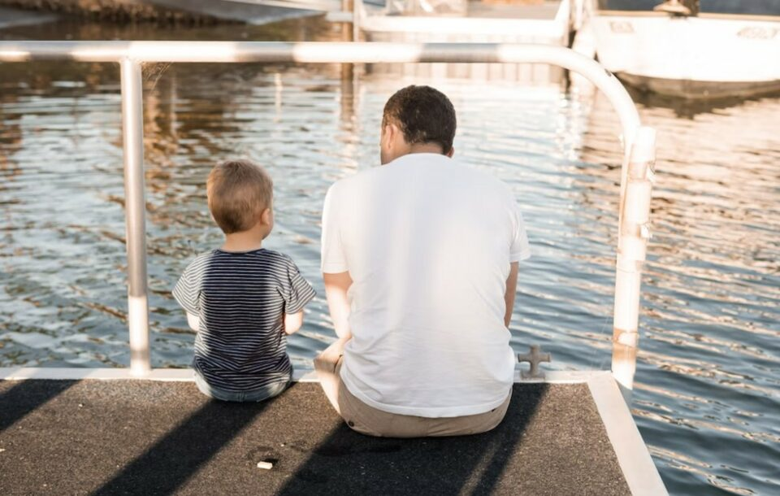
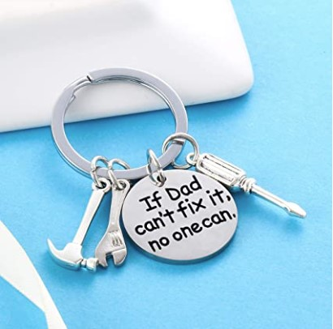
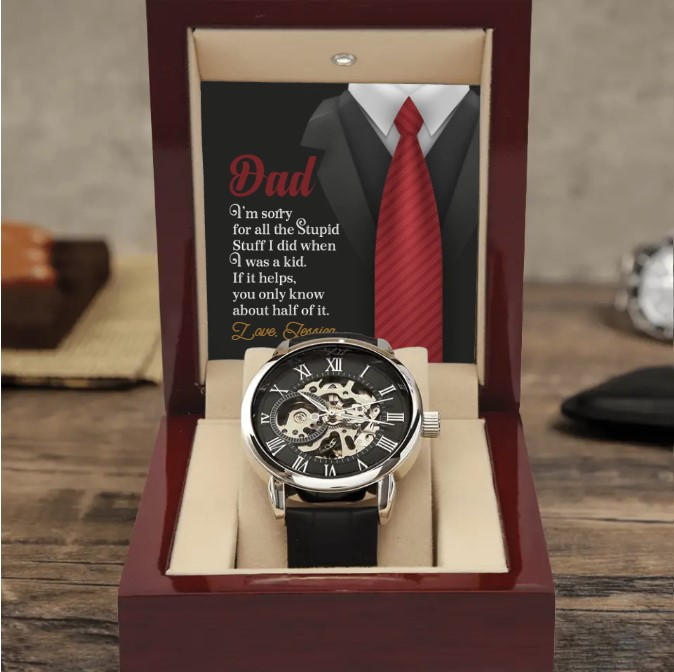

This article has been written and researched by our expert Loveable through a precise methodology. [Learn more about our methodology](https://avada.io/loveable/our-methodological.html)

[Loveable](https://avada.io/loveable/) > [Blog](https://avada.io/loveable/blog/) > [Family](https://avada.io/loveable/family/)

# Father-Son Relationship: Exploring a Special Bond Of Creation

Written by [Rose Bryne](https://avada.io/loveable/author/rose/) Last Updated on August 17, 2023

- [The Importance of Father-Son Relationship](https://avada.io/loveable/blog/father-son-relationship/#wp-block-heading-2-3)
    - [1\. Emotional Development](https://avada.io/loveable/blog/father-son-relationship/#wp-block-heading-3-6) 
    - [2\. Son Learns From His Father](https://avada.io/loveable/blog/father-son-relationship/#wp-block-heading-3-8) 
    - [3\. Father Directly Affects Son’s Relationships](https://avada.io/loveable/blog/father-son-relationship/#wp-block-heading-3-10)
    - [4\. Father Teaches His Son True Masculinity](https://avada.io/loveable/blog/father-son-relationship/#wp-block-heading-3-13)
    - [5\. Father Creates Good Childhood Memories](https://avada.io/loveable/blog/father-son-relationship/#wp-block-heading-3-15) 
    - [6\. Father Gives Good Advice To His Son](https://avada.io/loveable/blog/father-son-relationship/#wp-block-heading-3-18)
- [Why Is The Father-Son Relationship Tough Sometimes?](https://avada.io/loveable/blog/father-son-relationship/#wp-block-heading-2-20)
    - [Different personalities and interests](https://avada.io/loveable/blog/father-son-relationship/#wp-block-heading-3-22)
    - [Generational gaps](https://avada.io/loveable/blog/father-son-relationship/#wp-block-heading-3-26)
    - [Unrealistic expectations](https://avada.io/loveable/blog/father-son-relationship/#wp-block-heading-3-28)
    - [Lack of communication](https://avada.io/loveable/blog/father-son-relationship/#wp-block-heading-3-30)
    - [Past hurts](https://avada.io/loveable/blog/father-son-relationship/#wp-block-heading-3-33)
- [What are the 5 stages of a father-son relationship?](https://avada.io/loveable/blog/father-son-relationship/#wp-block-heading-2-35)
    - [1st Stage: Idolize](https://avada.io/loveable/blog/father-son-relationship/#wp-block-heading-3-36)
    - [2nd Stage: Discord](https://avada.io/loveable/blog/father-son-relationship/#wp-block-heading-3-39)
    - [3rd Stage: Evolving](https://avada.io/loveable/blog/father-son-relationship/#wp-block-heading-3-41)
    - [4th Stage: Acceptance](https://avada.io/loveable/blog/father-son-relationship/#wp-block-heading-3-43)
    - [5th Stage: Legacy](https://avada.io/loveable/blog/father-son-relationship/#wp-block-heading-3-46)
- [How to Strengthen a Father-Son Relationship: 10 Ways](https://avada.io/loveable/blog/father-son-relationship/#wp-block-heading-2-48) 
    - [1\. Do some outdoor activities together](https://avada.io/loveable/blog/father-son-relationship/#wp-block-heading-3-49)
    - [2\. Talks about memories](https://avada.io/loveable/blog/father-son-relationship/#wp-block-heading-3-52) 
    - [3\. Share Interests](https://avada.io/loveable/blog/father-son-relationship/#wp-block-heading-3-55)
    - [4\. Always Listening](https://avada.io/loveable/blog/father-son-relationship/#wp-block-heading-3-57) 
    - [5\. Men Conversation](https://avada.io/loveable/blog/father-son-relationship/#wp-block-heading-3-59) 
    - [6\. Do a “Project” together.](https://avada.io/loveable/blog/father-son-relationship/#wp-block-heading-3-62) 
    - [7\. Set a Good Example](https://avada.io/loveable/blog/father-son-relationship/#wp-block-heading-3-65)
    - [8\. Talk about Girls](https://avada.io/loveable/blog/father-son-relationship/#wp-block-heading-3-69)
    - [9\. Share about Each Other day in the meal.](https://avada.io/loveable/blog/father-son-relationship/#wp-block-heading-3-72)
    - [10\. Never forget each other important days.](https://avada.io/loveable/blog/father-son-relationship/#wp-block-heading-3-76) 
- [7 Best Gifts for Fathers That Sure to Strengthen Father-Son Relationships](https://avada.io/loveable/blog/father-son-relationship/#wp-block-heading-2-78) 
- [Famous Quotes About Father-Son Relationship](https://avada.io/loveable/blog/father-son-relationship/#wp-block-heading-2-104)
- [Final Thoughts](https://avada.io/loveable/blog/father-son-relationship/#wp-block-heading-2-116)

The relationship between a father and son is a special bond that has been studied and admired for generations. From early childhood to adulthood, this bond is integral to a son’s development and shapes his values, beliefs, and behaviors. The **father-son relationship** is complex, encompassing a wide range of emotions, experiences, and expectations.

We will find out the unique aspects of the father-son bond in this article, including its impact on personal growth, mental health, and social development. We will also discuss some of the challenges that can arise in this relationship and offer practical strategies for fostering a strong and healthy connection between fathers and their sons. So, let’s dig deep into it!

## The Importance of Father-Son Relationship

Anyone can have a child, but being a good father takes a whole life. The father-son relationship is a crucial aspect of a young boy’s life as it significantly shapes his development and overall well-being. Here are some reasons why the father-son relationship is important

### 1\. Emotional Development 

Just like mothers, fathers play a [crucial role](https://avada.io/loveable/roles-of-father-in-family/) in fostering a child’s emotional well-being. Kids turn to their fathers to establish rules and boundaries, as well as to feel [secure both physically and emotionally](https://avada.io/loveable/parenting-with-depression/). Children are motivated to develop and become more resilient when fathers are actively involved. Research indicates that when fathers show affection and offer support, it positively impacts a child’s cognitive and social growth. This, in turn, cultivates a sense of self-confidence and general well-being.

### 2\. Son Learns From His Father 

A son learns a lot from his father. Fathers play a crucial role in shaping their children’s lives, especially their sons. Fathers are the first male role models for their sons and teach them important [life lessons](https://avada.io/loveable/lessons-from-dad/) that carry them throughout their lives. They teach their sons about responsibility, hard work, perseverance, and the importance of family. Sons often learn how to be a man from their fathers, and their lessons can be passed down from generation to generation. It is important for fathers to be present in their sons’ lives and to take an active role in their upbringing.

### 3\. Father Directly Affects Son’s Relationships

A father’s influence can directly affect his son’s relationships. Research has shown that boys who have a positive relationship with their fathers are more likely to have healthy relationships with women as they grow up. Sons who have an absent or negative relationship with their father may struggle with intimacy, communication, and trust in their relationships. Fathers who model respectful and loving behaviors towards their partners and children can teach their sons how to treat others with love and respect. All in all, a strong and positive relationship with a father can set a solid foundation for a son’s future relationships.

### 4\. Father Teaches His Son True Masculinity

Fathers can teach their sons about true masculinity, which is not defined by physical strength or aggressiveness, but by qualities such as emotional intelligence, empathy, and kindness. A father who models these qualities can teach his son that being a man means being strong enough to show vulnerability and care for others. This can help his son develop a healthy sense of self-worth and self-esteem. Fathers who encourage their sons to express their emotions healthily and communicate effectively can help their sons build strong relationships and navigate life’s challenges. 

### 5\. Father Creates Good Childhood Memories 

Creating good childhood memories is an important responsibility for a father. These memories can shape a child’s life and contribute to their overall well-being. Fathers can create good memories by spending quality time with their sons when they are young, engaging in fun and meaningful activities, and showing them love and affection. They can also create traditions and routines that their children can look forward to and cherish for years to come.

### 6\. Father Gives Good Advice To His Son

A good father can give his son valuable advice to help him navigate different aspects of life. Fathers can provide guidance on various topics, such as relationships, careers, personal growth, and decision-making. They can share their own experiences and wisdom, provide a listening ear, and offer practical solutions.

## Why Is The Father-Son Relationship Tough Sometimes?

The father-son relationship can be tough for various reasons, depending on individual circumstances. If you and your father find it hard to talk to each other, then you should consider the following reasons. 

### Different personalities and interests

Fathers and sons can have vastly different personalities and interests, making it challenging to connect and relate to one another. For example, a father who is an introverted bookworm may struggle to bond with his son, who is a boisterous athlete. 

Not having the same interests is a common situation between father and son, but what is more remarkable here is that many fathers (or sons) do not even respect each other’s interests. This will easily lead to a lack of communication in the long run.

### Generational gaps

Fathers and sons often come from different generations and may have different perspectives on life, values, and priorities. These generational differences can lead to conflicts and misunderstandings. Here is the main reason why most men can get on well with their dads

### Unrealistic expectations

People hurt each other with too high expectations; in father and son relationship, that’s not an exception. Sometimes fathers have high expectations for their sons, whether it’s in terms of academic or career achievements or in terms of conforming to certain ideals of masculinity. When sons feel like they can’t meet these expectations, it can create tension in the relationship.

### Lack of communication

Communication is key in any relationship, and when fathers and sons struggle to communicate effectively, it can lead to misunderstandings and resentment. As I mentioned above, a lack of communication may result from a generation gap or differences in the hobby.

### Past hurts

Past hurts or traumas can sometimes create tension in the father-son relationship. For example, if a father was absent or abusive during a son’s childhood, it may be challenging to repair the relationship later in life. The truth is that it’s very hard to let things go!

## What are the 5 stages of a father-son relationship?

### 1st Stage: Idolize

In childhood, sons often hold their fathers in high regard, believing that they are capable of anything. This admiration is frequently expressed through a son’s emulation of his father’s actions, such as walking, talking, or wearing his clothes or shoes. During this developmental stage, a son desires nothing more than to gain his father’s approval and acceptance, striving to please him in every way possible.

### 2nd Stage: Discord

During adolescence, sons frequently encounter a period of conflict with their fathers, where disagreements become a prominent theme in their relationship. As teens, they may reject their father’s expectations, values, and guidance and instead adopt more unconventional beliefs and practices that often create friction between them. Depending on the intensity of their differences, the son may harbor feelings of resentment or even fear toward their father, which can persist well into the son’s early twenties.

### 3rd Stage: Evolving

During the transition to young adulthood, the relationship between a father and son undergoes a process of evolution. Although emotional distance and disregard for each other may still be present, the conscious efforts to differentiate oneself from one’s father, which are so typical in the discord phase, begin to resemble competition. Competing with one’s father can be seen as one of the most subtle but highest forms of admiration. As Mark Twain once stated, “When I was a fourteen-year-old boy, my father was so uninformed that I could barely tolerate his presence. However, when I turned twenty-one, I was astonished to discover how much he had learned in just seven years.”

### 4th Stage: Acceptance

In their thirties and forties, adult sons progress towards acceptance in their relationship with their fathers. They begin to pardon past mistakes, acknowledge strengths, and even admire qualities previously incompatible with their youthful “know-it-all” attitude. Differences are accepted, and fathers and sons often develop friendships, share interests, and discuss opinions without heated arguments. The son may even face difficulties as a father with his own son.

### 5th Stage: Legacy

In their fifties, older adult sons embody a legacy of their father’s positive and negative impact. The passage of time softens the pain of past memories, and admiration and respect often replace them, recognizing the difficulty of being a father. However, older adult sons who have yet to resolve any lingering issues with their elderly or deceased fathers may find those issues arising in their relationships with their teenage or young adult sons. If their fathers are still living, an ironic role reversal may occur, with the older adult sons taking on the responsibility of caring for their aging fathers. As the saying goes, “Perhaps the best revenge is to live long enough to be a problem to your children.”

## How to Strengthen a Father-Son Relationship: 10 Ways 

### 1\. Do some outdoor activities together

If you find yourself too occupied to embark on exciting adventures or vacations, don’t fret. Accomplish daily tasks around the house as a team, or simply take a leisurely stroll in the park. As a father with a toddler son, consider visiting an amusement park or playground to play together.

**_Related_**: [Father’s Day Fun: 50+ Unique and Memorable Father’s Day Activities](https://avada.io/loveable/father-day-activities/)

### 2\. Talks about memories 

Take some time to share your life experiences with your son. Recall and recount stories from your childhood, highlighting the fun and joyous moments. Discuss your habits and key life events that have shaped who you are today. This can foster a stronger bond between you and your son.

### 3\. Share Interests

There may be times when the relationship between a father and son feels strained, particularly if their interests seem diametrically opposed. However, it’s usually possible to identify a shared interest with some effort. Engaging in these shared interests provides an opportunity to find common ground while enjoying quality time together.

### 4\. Always Listening 

To create a strong and lasting relationship with their sons, fathers must learn how to listen without judgment and resist the urge to fix things too quickly. Creating a safe environment where sons feel comfortable opening up is crucial. Fathers can achieve this by actively listening to their sons during shared activities like fishing, attending a sports event, or going on a road trip. 

### 5\. Men Conversation 

Children are frequently exposed to negative messages, creating feelings of inadequacy in our sons. These messages can come from many sources, including commercials on television that depict unrealistic standards of physical appearance. As our sons grow up, they face various complex issues that require careful consideration and discussion. To help them navigate these challenges, fathers should engage in regular conversations about these important topics. You can talk about sex, relationship, and money,…

### 6\. Do a “Project” together. 

Engaging in a project that’s larger than oneself can be a magical experience for a boy. It can also strengthen the bond between father and son, especially when the project is big and visible.

Fathers and sons can work together on various projects like building planter boxes, landscaping the backyard, constructing a vacation cabin, volunteering for Habitat for Humanity, or embarking on a summer biking adventure. No matter the project, the shared experience of tackling something significant can create a lasting connection and memories they will cherish and talk about for years.

### 7\. Set a Good Example

Developing a strong bond with your son can be achieved through various means. It is worth noting that sons learn about what it means to be a man by observing their fathers, whether we realize it or not. A father’s influence on their son’s personal growth may be subtle, but it is undoubtedly significant.

As sons observe their fathers interact with others, including their partners, they learn about crucial aspects such as respect (or disrespect), how men engage with others, and how to handle conflicts and differences. Acknowledging that a father’s influence on their son is incomparable should motivate fathers to reflect more deeply on their relationship with their sons and take their responsibility as role models seriously.

### 8\. Talk about Girls

When it comes to talking about girls with your son, it’s important to have an open and honest conversation. Start by asking your son what he thinks about girls and if he has any questions or concerns.

Listen to what your son says and offer guidance and advice based on your own experiences. Help your son understand that treating girls with respect and kindness is important, and always seek consent before physically acting. You may also want to talk to your son about healthy relationships and what they look like. Encourage your son to communicate openly and honestly with his partner and always prioritize mutual respect and trust.

### 9\. Share about Each Other day in the meal.

A great way for fathers and sons to connect and bond is by sharing about their day over a meal. Whether it’s breakfast, lunch, or dinner, sitting down together and discussing what’s been going on in each other’s lives can create a sense of closeness and understanding.

During the meal, fathers can ask their sons about their day, what they did at school, their feelings, and their interest. Sons can also ask their fathers about their work, interesting experiences, or how they’re feeling.

### 10\. Never forget each other important days. 

Remembering and acknowledging important days in your father’s life, such as birthdays, Father’s Day, and other special occasions, is crucial. Recognizing and celebrating these events can show your father that he is loved and appreciated and can help strengthen your relationship with him. So, make sure to mark these days on your calendar and plan something special for your father to make him feel special and valued. And don’t ever forget a [heartfelt gift for father](https://avada.io/loveable/personalized-gifts-dad/) on his days. 

## 7 Best Gifts for Fathers That Sure to Strengthen Father-Son Relationships 

As mentioned above, the bond between a father and his son is a crucial one that can profoundly impact a child’s life. It’s important to nurture this relationship and find ways to strengthen it as your father gets older. Giving a gift to your dad can be a great way to bond and show him how much you care. 

1. [Bullet Tumbler Cup For Best Dad Ever](https://loveable.ai/products/best-dad-ever-camouflage-20oz-bullet-tumbler-cup-best-gift-for-dad-on-birthdays-fathers-day-veterans-day-302ihpnptu288?variant=44327732838632)

Giving your dad the Best Dad Ever Camouflage – Amazing Bullet Tumbler Cup on Father’s Day is a great way to make the occasion memorable. This item is more than just a useful daily accessory; it’s also a heartfelt gesture showing your love and care for them. 

The tumbler is made of safe and durable stainless steel with non-toxic and anti-rust properties. You can choose from three different sizes – 12oz, 16oz, and 36oz – to find the perfect fit for your dad’s needs. The novelty design will be a conversation starter and a constant reminder of your thoughtful gift.

2. [Cool Keyring For Dad Who Can Fix Anything](https://www.amazon.com/Keychain-Daughter-Christmas-Keyring-Fathers/dp/B07RSJDZS5?ie=UTF8&tag=loveable06-20&th=1) 

  
Giving your dad this “Best Dad Ever” Camouflage – Amazing Bullet Tumbler Cup will surely make his Father’s day memorable. Not only is it a practical gift, but it is also a thoughtful way to show your dad how much you care about him. Additionally, this gift can also be given to your stepdad to honor him as a hero in your heart. 

Made of stainless steel, this tumbler is both safe and durable. Its non-toxic and anti-rust properties make it an excellent choice for daily use. You can choose from three sizes – 12oz, 16oz, and 36oz – to find the perfect fit for your dad’s needs. The novelty design will also make it a gift he won’t forget to bring with him.

3. [Wooden Plaque for the Best Dad in The World](https://loveable.ai/products/best-dad-in-the-world-custom-photo-wooden-plaque-3-layers-best-gift-for-parents-on-mother-fathers-day-birthday-301ihplnwp054?variant=44265689415912&utm_source=avada&ranking=&utm_source=&utm_campaign=best-fathers-day-gifts-from-son-to-celebrate-his-birthday) 

Looking for a unique way to show your appreciation for the amazing father in your life? Consider gifting him a custom photo wooden plaque, proudly proclaiming him as the “Best dad in the world.” Each order is crafted from beautiful natural wood and can be personalized to include a photo of your choosing. This thoughtful gift will make a special addition to any dad’s home decor, and he will cherish it for years to come.

4. [Personalized Canvas For Your Superhero Dad](https://loveable.ai/products/papa-youre-my-superhero-and-my-biggest-life-blessing-personalized-photo-canvas-poster-best-birthday-gift-ideas-for-papa-dad-207hnthca377?variant=43436716785896&ranking=&utm_source=&utm_campaign=__trashed-4)

For many children, their father is their ultimate hero, not because of supernatural abilities like flight or control over elements, but because of the incredible things they do for their family. As a son, show appreciation for your dad by gifting him a special canvas on his birthday and wishing him all the best things in life. Tell him he is truly amazing for all he does for your family.

In addition, our canvas is made of high-quality printing technology, ensuring that the color will not fade and will be vivid. 

5. [Personalized Men’s Luxury Watch For Dad](https://loveable.ai/products/sorry-dad-for-what-i-did-when-i-was-young-personalized-men-luxury-watch-genuine-mens-openwork-watch-best-funny-gifts-for-dad-210ihpunwa199?variant=43954543984872&ranking=&utm_source=&utm_campaign=__trashed-4)

Don’t miss out on this incredible gift, even if you have a significant financial burden. It’s hard to imagine anyone not loving this luxurious wristwatch, complete with a real leather band that’s splash-resistant and reinforced mineral glass for enhanced durability. The innovative skeleton dial design offers a captivating view of the watch’s inner workings. As your dad’s son, consider giving him this exceptional gift for his next birthday. He’ll surely appreciate it.

6. [Unique Whiskey Decanter For Dad](https://www.amazon.com/Gifts-Dad-Daughter-Son-Christmas/dp/B09DSD6P53/?th=1) 

If your dad is a fan of whiskey, then you should definitely not miss this product. This gift is truly designed for men who appreciate the finer things in life. It’s a well-known fact that many men enjoy keeping their own personal whiskey collection on display in their home bar. This unique whiskey decanter gift set would make a fantastic addition to any such collection. As his son, why not honor him on his birthday by giving him this special present?

7. [Electric Muscle Massager Gift For Father](https://www.amazon.com/Handheld-Electric-Intensity-Percussion-Attachments/dp/B08TLWYKLS/?ie=UTF8&tag=loveable06-20)

Find a really practical gift for your father. The OLsky Massage Gun Deep Tissue is a high-intensity percussion massage device that alleviates pain. The massage gun has ten attachments and 30 different speed levels with a touchscreen interface that can control. The gun is built to handle high lateral loads and operates quietly with little resonant reflected oscillation. The device appears to be durable and well-built despite its smooth plastic exterior.  This will be a great gift to help your dad relax after a tiring day at work.

## Famous Quotes About Father-Son Relationship

1. “With sons and fathers, there’s an inexplicable connection and imprint that your father leaves on you.” by Brad Pitt. 

2. “Until you have a son of your own, you will never know the joy, the love beyond feeling that resonates in the heart of a father as he looks upon his son.” by Kent Nerburn

3. “The fact my relationship with my son is so good makes me forgiving of my father and also appreciative.” by Anthony Kiedis.

4. “You can tell what was the best year of your father’s life because they seem to freeze that clothing style and ride it out.” by Jerry Seinfeld.

5. “My father raised us to step toward trouble rather than to step away from it.” Justin Trudeau.

6. “My father taught me a good lesson: Don’t get too low when things go wrong. And don’t get too high when things are good.” by Robert Parish.

7. “Becoming a dad is one thing—being a dad is many things.” by Steve Chapman.

8. “My dad’s definition of success is when you look at your son and daughter, and realize they turned out better than you.” by Joe Biden.

9. “Life doesn’t come with an instruction book—that’s why we have fathers.” by H. Jackson Browne.

10. “Every father should remember one day his son will follow his example, not his advice.” by Charles F. Kettering.

## Final Thoughts

In conclusion, the **father-son relationship** is a unique and special bond that can significantly impact a son’s development and growth. It is a complex relationship that can bring great joy, love, support, challenges, and obstacles. By exploring and nurturing this relationship, fathers and sons can provide each other with a sense of security, stability, and love that can help them go through the ups and downs of life. 

- [The Importance of Father-Son Relationship](https://avada.io/loveable/blog/father-son-relationship/#wp-block-heading-2-3)
    - [1\. Emotional Development](https://avada.io/loveable/blog/father-son-relationship/#wp-block-heading-3-6) 
    - [2\. Son Learns From His Father](https://avada.io/loveable/blog/father-son-relationship/#wp-block-heading-3-8) 
    - [3\. Father Directly Affects Son’s Relationships](https://avada.io/loveable/blog/father-son-relationship/#wp-block-heading-3-10)
    - [4\. Father Teaches His Son True Masculinity](https://avada.io/loveable/blog/father-son-relationship/#wp-block-heading-3-13)
    - [5\. Father Creates Good Childhood Memories](https://avada.io/loveable/blog/father-son-relationship/#wp-block-heading-3-15) 
    - [6\. Father Gives Good Advice To His Son](https://avada.io/loveable/blog/father-son-relationship/#wp-block-heading-3-18)
- [Why Is The Father-Son Relationship Tough Sometimes?](https://avada.io/loveable/blog/father-son-relationship/#wp-block-heading-2-20)
    - [Different personalities and interests](https://avada.io/loveable/blog/father-son-relationship/#wp-block-heading-3-22)
    - [Generational gaps](https://avada.io/loveable/blog/father-son-relationship/#wp-block-heading-3-26)
    - [Unrealistic expectations](https://avada.io/loveable/blog/father-son-relationship/#wp-block-heading-3-28)
    - [Lack of communication](https://avada.io/loveable/blog/father-son-relationship/#wp-block-heading-3-30)
    - [Past hurts](https://avada.io/loveable/blog/father-son-relationship/#wp-block-heading-3-33)
- [What are the 5 stages of a father-son relationship?](https://avada.io/loveable/blog/father-son-relationship/#wp-block-heading-2-35)
    - [1st Stage: Idolize](https://avada.io/loveable/blog/father-son-relationship/#wp-block-heading-3-36)
    - [2nd Stage: Discord](https://avada.io/loveable/blog/father-son-relationship/#wp-block-heading-3-39)
    - [3rd Stage: Evolving](https://avada.io/loveable/blog/father-son-relationship/#wp-block-heading-3-41)
    - [4th Stage: Acceptance](https://avada.io/loveable/blog/father-son-relationship/#wp-block-heading-3-43)
    - [5th Stage: Legacy](https://avada.io/loveable/blog/father-son-relationship/#wp-block-heading-3-46)
- [How to Strengthen a Father-Son Relationship: 10 Ways](https://avada.io/loveable/blog/father-son-relationship/#wp-block-heading-2-48) 
    - [1\. Do some outdoor activities together](https://avada.io/loveable/blog/father-son-relationship/#wp-block-heading-3-49)
    - [2\. Talks about memories](https://avada.io/loveable/blog/father-son-relationship/#wp-block-heading-3-52) 
    - [3\. Share Interests](https://avada.io/loveable/blog/father-son-relationship/#wp-block-heading-3-55)
    - [4\. Always Listening](https://avada.io/loveable/blog/father-son-relationship/#wp-block-heading-3-57) 
    - [5\. Men Conversation](https://avada.io/loveable/blog/father-son-relationship/#wp-block-heading-3-59) 
    - [6\. Do a “Project” together.](https://avada.io/loveable/blog/father-son-relationship/#wp-block-heading-3-62) 
    - [7\. Set a Good Example](https://avada.io/loveable/blog/father-son-relationship/#wp-block-heading-3-65)
    - [8\. Talk about Girls](https://avada.io/loveable/blog/father-son-relationship/#wp-block-heading-3-69)
    - [9\. Share about Each Other day in the meal.](https://avada.io/loveable/blog/father-son-relationship/#wp-block-heading-3-72)
    - [10\. Never forget each other important days.](https://avada.io/loveable/blog/father-son-relationship/#wp-block-heading-3-76) 
- [7 Best Gifts for Fathers That Sure to Strengthen Father-Son Relationships](https://avada.io/loveable/blog/father-son-relationship/#wp-block-heading-2-78) 
- [Famous Quotes About Father-Son Relationship](https://avada.io/loveable/blog/father-son-relationship/#wp-block-heading-2-104)
- [Final Thoughts](https://avada.io/loveable/blog/father-son-relationship/#wp-block-heading-2-116)

### [Rose Bryne](https://avada.io/loveable/author/rose/)

Hi, I'm Rose! I love animals and spending time with kids. At Loveable, I help people find unique gifts for special occasions like Valentine's Day, housewarmings, and graduations. I enjoy finding gifts for kids, teens, and animal lovers that match their interests and personalities. Making gift-giving a pleasant experience is my priority. Let me assist you in finding the perfect gift!

- [Twitter](https://twitter.com/intent/tweet)
- [Facebook](https://www.facebook.com/sharer/sharer.php)
- [instagram](https://avada.io/loveable/blog/father-son-relationship/)
- [pinterest](https://www.pinterest.com/loveablellc/)

## Related Posts

[### 30 Best 4 Year Old Birthday Party Ideas For A Memorable Celebration](https://avada.io/loveable/blog/4-year-old-birthday-party-ideas/) 

[

### 16th Birthday Party Ideas to Make an Unforgettable Day

](https://avada.io/loveable/blog/16th-birthday-party-ideas/)

[

### 150+ Inspirational Birthday Quotes to Spread Joy on Special Day

](https://avada.io/loveable/blog/inspirational-birthday-quotes/)

[

### 160+ Birthday Wishes for Wife to Express Eternal Love

](https://avada.io/loveable/blog/birthday-wishes-for-wife/)

[### 90+ Heart Touching Birthday Wishes for Niece to Make Her Day Extra Special](https://avada.io/loveable/blog/birthday-wishes-for-niece/)
