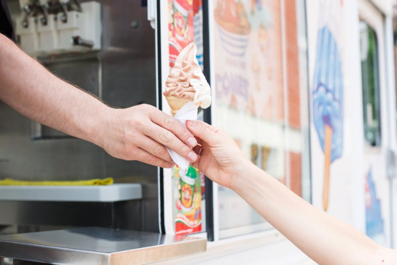

This article has been written and researched by our expert Loveable through a precise methodology. [Learn more about our methodology](https://avada.io/loveable/our-methodological.html)

[Loveable](https://avada.io/loveable/) > [Blog](https://avada.io/loveable/blog/) > [Family](https://avada.io/loveable/family/)

# Father’s Day Fun: 50+ Unique and Memorable Father’s Day Activities

Written by [Rose Bryne](https://avada.io/loveable/author/rose/) Last Updated on August 17, 2023

- [1\. Give him ice cream.](https://avada.io/loveable/blog/father-day-activities/#wp-block-heading-2-4)
- [2\. Assist Dad with washing the car.](https://avada.io/loveable/blog/father-day-activities/#wp-block-heading-2-7)
- [3\. Take him to a live music performance.](https://avada.io/loveable/blog/father-day-activities/#wp-block-heading-2-10)
- [4\. Take the family on a bike trip.](https://avada.io/loveable/blog/father-day-activities/#wp-block-heading-2-12)
- [5\. Hold a concert](https://avada.io/loveable/blog/father-day-activities/#wp-block-heading-2-15)
- [6\. Plan a pottery class.](https://avada.io/loveable/blog/father-day-activities/#wp-block-heading-2-18)
- [7\. Break something in a rage room.](https://avada.io/loveable/blog/father-day-activities/#wp-block-heading-2-20)
- [8\. Bring him shopping.](https://avada.io/loveable/blog/father-day-activities/#wp-block-heading-2-23)
- [9\. Experiment with axe throwing.](https://avada.io/loveable/blog/father-day-activities/#wp-block-heading-2-26)
- [10\. Visit a bowling alley.](https://avada.io/loveable/blog/father-day-activities/#wp-block-heading-2-28)
- [11\. Make a pillow fort.](https://avada.io/loveable/blog/father-day-activities/#wp-block-heading-2-31)
- [12\. In an escape room, you must solve a mystery.](https://avada.io/loveable/blog/father-day-activities/#wp-block-heading-2-33)
- [13\. Collaborate on a puzzle.](https://avada.io/loveable/blog/father-day-activities/#wp-block-heading-2-35)
- [14\. Visit an amusement park.](https://avada.io/loveable/blog/father-day-activities/#wp-block-heading-2-38)
- [15\. Try skydiving.](https://avada.io/loveable/blog/father-day-activities/#wp-block-heading-2-40)
- [16\. Take part in a mud run.](https://avada.io/loveable/blog/father-day-activities/#wp-block-heading-2-43)
- [17\. Attend a rock climbing lesson.](https://avada.io/loveable/blog/father-day-activities/#wp-block-heading-2-46)
- [18\. Engage the services of a private chef.](https://avada.io/loveable/blog/father-day-activities/#wp-block-heading-2-49)
- [19\. Make plans to paint.](https://avada.io/loveable/blog/father-day-activities/#wp-block-heading-2-51)
- [20\. Go on a road trip.](https://avada.io/loveable/blog/father-day-activities/#wp-block-heading-2-54)
- [21\. Make a fresh dessert for him.](https://avada.io/loveable/blog/father-day-activities/#wp-block-heading-2-58)
- [22\. Surprising him with a test drive in a race vehicle.](https://avada.io/loveable/blog/father-day-activities/#wp-block-heading-2-60)
- [23\. Make a campfire.](https://avada.io/loveable/blog/father-day-activities/#wp-block-heading-2-63)
- [24\. Garden alongside him.](https://avada.io/loveable/blog/father-day-activities/#wp-block-heading-2-66)
- [25\. Invite him to a pick-up basketball game.](https://avada.io/loveable/blog/father-day-activities/#wp-block-heading-2-68)
- [26\. Investigate your ancestors’ backgrounds.](https://avada.io/loveable/blog/father-day-activities/#wp-block-heading-2-71)
- [27\. Make a family fitness plan.](https://avada.io/loveable/blog/father-day-activities/#wp-block-heading-2-73)
- [28\. Enroll in an online cooking class.](https://avada.io/loveable/blog/father-day-activities/#wp-block-heading-2-76)
- [29\. Enjoy a family gaming night](https://avada.io/loveable/blog/father-day-activities/#wp-block-heading-2-79) 
- [30\. Sing all day on karaoke](https://avada.io/loveable/blog/father-day-activities/#wp-block-heading-2-81) 
- [31\. Organize a wine tasting.](https://avada.io/loveable/blog/father-day-activities/#wp-block-heading-2-84)
- [32\. Make crafts together.](https://avada.io/loveable/blog/father-day-activities/#wp-block-heading-2-87)
- [33\. Prepare a backyard picnic.](https://avada.io/loveable/blog/father-day-activities/#wp-block-heading-2-89)
- [34\. Treat him to a spa day.](https://avada.io/loveable/blog/father-day-activities/#wp-block-heading-2-91)
- [35\. Start the grill.](https://avada.io/loveable/blog/father-day-activities/#wp-block-heading-2-94)
- [36\. Go to the golf course.](https://avada.io/loveable/blog/father-day-activities/#wp-block-heading-2-98)
- [37\. Take a hike.](https://avada.io/loveable/blog/father-day-activities/#wp-block-heading-2-100)
- [38\. Organize a beer tasting.](https://avada.io/loveable/blog/father-day-activities/#wp-block-heading-2-103)
- [39\. Make plans for an outdoor movie night.](https://avada.io/loveable/blog/father-day-activities/#wp-block-heading-2-105)
- [40\. Visit a campground.](https://avada.io/loveable/blog/father-day-activities/#wp-block-heading-2-108)
- [41\. Let Should Grow Something Together.](https://avada.io/loveable/blog/father-day-activities/#wp-block-heading-2-111)
- [42\. Contribute to His Collection.](https://avada.io/loveable/blog/father-day-activities/#wp-block-heading-2-113)
- [43\. Hire His Ideal Vehicle.](https://avada.io/loveable/blog/father-day-activities/#wp-block-heading-2-115)
- [44\. Create a playlist for Dad.](https://avada.io/loveable/blog/father-day-activities/#wp-block-heading-2-118)
- [45\. Go Bird Observing.](https://avada.io/loveable/blog/father-day-activities/#wp-block-heading-2-121)
- [46\. Make a Float Trip Plan.](https://avada.io/loveable/blog/father-day-activities/#wp-block-heading-2-123)
- [47\. Create a scrapbook.](https://avada.io/loveable/blog/father-day-activities/#wp-block-heading-2-126)
- [48\. Video-Chat With Close Relatives.](https://avada.io/loveable/blog/father-day-activities/#wp-block-heading-2-128)
- [49\. Do a Pizza Tour.](https://avada.io/loveable/blog/father-day-activities/#wp-block-heading-2-130)
- [50\. Go on a Bargain Hunt.](https://avada.io/loveable/blog/father-day-activities/#wp-block-heading-2-133)
- [51\. Make a kite.](https://avada.io/loveable/blog/father-day-activities/#wp-block-heading-2-135)
- [52\. Take a fishing trip.](https://avada.io/loveable/blog/father-day-activities/#wp-block-heading-2-138)
- [53\. Take some ridiculous selfies.](https://avada.io/loveable/blog/father-day-activities/#wp-block-heading-2-142)
- [Final Thought](https://avada.io/loveable/blog/father-day-activities/#wp-block-heading-2-144)

Father’s day is coming soon – a special occasion to celebrate the role of fathers and father figures in our lives. Whether we all know how the role of a father is important in a family, but just because of spending much time on work for a living, we often forget to say thank you to him. At this time, why not take the opportunity to create some unique and unforgettable memories with your dad? With Father’s Day just around the corner, there is no better time to show your dad just how much he means to you.

Spending quality time with your dad and creating unforgettable memories can be one of the best ways to celebrate Father’s Day. Planning out some fun and meaningful activities can show your dad how much you care and make this day truly special. The activities you choose should be personalized to your dad’s personality and interests, making the day more enjoyable for both of you.

Countless ways to spend Father’s Day can be tailored to fit any personality or interest. Taking advantage of time being together will demonstrate how big love each other for the other half and close up this relationship. So, if you are looking for some inspiration to make this Father’s Day truly special, look no further than this list of 50+ unique and memorable **Father’s Day activities.**

## **1\. Give him ice cream.**

A tasty ice cream dessert shared with your father is a simple yet nice way to honor Father’s Day. Take him to his favorite ice cream shop or build a handmade sundae bar for a fun and sweet bonding moment. Nothing beats a fresh and creamy scoop of ice cream on a hot summer day, whether he likes classic flavors or unusual combinations.

## **2\. Assist Dad with washing the car.**

Not only is it a practical activity that can make his ride look new again, but it’s also an opportunity to bond with Dad. This is a perfect activity for a sunny day to make his car shine. You can make it a competition to see who can get their section of the car the cleanest, or simply enjoy each other’s company while working together. You can play any other game with the sprinkler to be wet together with him.

## **3\. Take him to a live music performance.**

Take your dad to a live music performance this Father’s Day and have an amazing experience. Spend quality time with your father and make memories that will last a lifetime to show him how much you care. Whether he is into rock, jazz, or classical music, there will undoubtedly be a performance or event that piques his interest. Several outdoor locations host concerts throughout the summer, providing a perfect opportunity to soak up some rays while listening to music. 

## **4\. Take the family on a bike trip.**

Not only is it a great way to get some exercise and fresh air, but it’s also an opportunity to bond with your dad while exploring new sights. Nature around your house is very amazing; have you been ready to enjoy them? Whether you ride in a park, along a river route, or in the countryside, you can take in beautiful views and fresh air, which will be a promising activity to leave with memorable memories. Make sure to pack enough water and snacks to keep everyone energized during the bike ride.

## **5\. Hold a concert**

Whether it’s a small gathering with family and friends or a larger event, creating a musical performance can bring people together to enjoy the beauty of music. From setting up a stage to selecting a playlist, there are many ways to personalize the experience and make it special for your dad. There will be nothing happier than seeing his baby perform a gratitude song to express his sincerity. Your dad will undoubtedly feel proud and cherished seeing you perform a special song just for him.

## **6\. Plan a pottery class.**

This is the greatest activity if you want to make something handcrafted for Father’s Day. Not only will you both be able to express your creativity, but you will also have the opportunity to acquire new skills and create something beautiful together. The choices are unlimited, whether you want to construct a functional or aesthetic object. You and your father may create a lasting memory that represents your deep love for one other with the help of a qualified educator.

## **7\. Break something in a rage room.**

Consider taking your dad to a rage room where you can both let loose and break things with various tools and objects. This exciting and unconventional activity will create lasting memories and bring a sense of release from stress and tension. Before heading in, be sure to review and follow all safety guidelines to ensure a safe and enjoyable experience.

## **8\. Bring him shopping.**

Not only women but men also want to be beautiful. Who doesn’t, right? A great outfit can boost his confidence so much, let’s update his wardrobe. Shopping may be a fun way to spend time together and create new memories. Don’t forget to give him glowing reviews, and on that day, put him a priority to be the most handsome man in the world.

## **9\. Experiment with axe throwing.**

A type of serious activity has become popular for people looking for a new pastime only enjoyed by real men – Axe throwing. Many locations provide axe-throwing sessions with experienced instructors to guide you through the process, allowing you to feel confident and safe while having fun. Otherwise, you make a special playground in the backyard. 

## **10\. Visit a bowling alley.**

The idea is to take your family somewhere to enjoy joyful moments together. Bowling is a good idea because you can split your family into 2 teams to compete. It doesn’t matter if you’re a pro or a novice; the experience will surely bring laughter and bonding moments.

## **11\. Make a pillow fort.**

It may be the dream of every boy when they are youth that having a fort in the house is amazing and no one can invade this private space. Collect all the necessary materials, like pillows and blankets, and let your imagination run wild. Personalize the fort with your favorite decorations and create a comfy atmosphere to relax in together. Let’s bring him back childhood memories and enjoy some nostalgic fun.

## **12\. In an escape room, you must solve a mystery.**

Immerse yourself in a thrilling adventure with your dad by visiting an escape room. This activity is designed to test your problem-solving skills and teamwork as you race against the clock to solve [puzzles](https://avada.io/loveable/gift-puzzle-lovers/) and riddles. A type of exciting game in the list of Father’s day activities to push logical thinking skills as well as consistency.

## **13\. Collaborate on a puzzle.**

Collaborating with your dad on a puzzle is a fun and engaging activity that allows you to work together and create lasting memories. As you solve the puzzle, you can share stories and enjoy each other’s company while also sharpening your cognitive abilities. Your dad will appreciate your interest in challenging yourself and working together to achieve a common goal.

## **14\. Visit an amusement park.**

Going to a museum is an excellent way to spend quality time with your dad and broaden your knowledge. Whether you’re interested in art, history, science, or culture, a museum is out there for you; by exploring together, you can learn about new things and share your thoughts and opinions on the exhibits. Some museums also offer interactive displays and workshops, allowing you to get hands-on and engage with the content. 

## **15\. Try skydiving.**

Make sure that you and your dad are physically and mentally fit before taking on the challenge. The rush of jumping out of a plane and experiencing the feeling of free fall together is an unforgettable experience that will create a strong bond between you both. With the help of experienced instructors and top-of-the-line equipment, you can feel secure and confident during the entire process. Remember that skydiving can be expensive and may not be suitable for everyone’s budget.

## **16\. Take part in a mud run.**

Contrary to popular belief, participating in a mud run is not all about getting dirty. Instead, it can be an enjoyable way to spend the day with your dad. If your father is competitive, he will love navigating the obstacle course filled with mud. This activity is both fun and challenging, and it’s a great opportunity to see how far you and your dad can push yourselves physically.

## **17\. Attend a rock climbing lesson.**

Rock climbing is getting increasingly popular nowadays, so taking a class with your dad isn’t hard. Rock climbing requires concentration, focus, and teamwork, which makes it a great activity for building trust and communication with your dad. It’s a chance to show your strength and determination and make your dad proud of the person you’ve become.

## **18\. Engage the services of a private chef.**

If you can afford it, consider bringing a private chef to your home. This can be a fantastic opportunity to spend quality time with your dad while indulging in a mouth-watering meal. A private chef allows you to create a personalized menu that caters to your tastes, and you may even have the opportunity to learn cooking tips and techniques. So, let’s prepare some delectable dishes and relish them together.

## **19\. Make plans to paint.**

Painting is an artful and calming activity that can be appreciated by individuals of any age. It is a chance to connect with your father while creating something unique together. Whether you choose to paint on a canvas or transform a piece of furniture or other household objects, this is a fun way to experiment with different colors and styles to make something new and exciting.

## **20\. Go on a road trip.**

Let’s go to new destinations, experience new foods, and make lasting memories along the way. A road trip will be a fun way to spend quality time with your father, whether you initially have a specific destination or are simply seeking to hit the open road and see where it takes you. Remember to bring something to drink!

**_Related_**: [25 Best Road Trip Games to Play in The Car Family](https://avada.io/loveable/road-trip-games-play-in-car/)

## **21\. Make a fresh dessert for him.**

The best way to someone’s heart is through the stomach, sure. The sweetness of your dessert will be a thoughtful and sweet gesture to show him how much you appreciate him. Don’t worry, even if it is the first time, you can search on the course on the Internet to satisfy him in some way or invite him to make it together. It is a time for family.

## **22\. Surprising him with a test drive in a race vehicle.**

Action films like “Fast and Furious” have had a significant influence on popular culture, particularly in the world of car racing and car culture. If your dad is a fan of fast cars and thrilling adventures, surprising him with a test drive in a race vehicle could be an exciting and unforgettable experience. This experience will allow your dad to feel the rush of speed and excitement that can only be seen on a screen.

## **23\. Make a campfire.**

Building a campfire is a great way to spend quality time with your dad and strengthen your bond. Sitting around the warm flames can create a comfortable environment for sharing stories and secrets, and can lead to lasting memories. It’s a simple activity that can bring you closer together.

## **24\. Garden alongside him.**

The green of nature is always the best type of medicine to cure someone’s mental health in both mind and soul. [Gardening](https://avada.io/loveable/gardening-activities-ideas/) is a wonderful way to connect with your dad and spend time in the great outdoors. Regardless of the size of your garden, planting and nurturing flowers, vegetables, or herbs together can be a fulfilling experience that yields a sense of accomplishment and well-being.

## **25\. Invite him to a pick-up basketball game.**

If your father is fond of sports, why not invite him to a casual basketball game? It’s an enjoyable way to bond and stay active together, with the added bonus of friendly competition. You could also ask some of your buddies to join in and turn it into a group activity that everyone can relish. 

## **26\. Investigate your ancestors’ backgrounds.**

Nowadays, many young people don’t seem to show much interest in their family roots, which is unfortunate. However, exploring your family’s heritage can be a captivating and rewarding way to strengthen your relationship with your dad. You can delve into your family tree, uncover intriguing tales about your ancestors, and trace your lineage back several generations.

## **27\. Make a family fitness plan.**

Creating a family fitness plan can be a great way to encourage each other to stay active and reach their fitness goals. You could even make it fun and challenge your dad to a push-up contest to see who can do the most. Regular exercise can improve your overall health and well-being while spending quality time with your loved ones.

## **28\. Enroll in an online cooking class.**

These days, it is convenient to access a variety of online classes that cater to the needs of learners. If your dad enjoys cooking or desires to enhance his cooking abilities, joining an online cooking class as a team can be a pleasant and enlightening experience. The objective is to prepare a warm meal for the entire family while working together.

## **29\. Enjoy a family gaming night** 

If your dad enjoys playing games, having a family gaming night can be a fun way to bond and have a good time. You can plan ahead and choose a night when everyone is free, and maybe even plan for an overnight gaming session. There are plenty of games to choose from, like board games or video games, and you can even play games that allow you to get to know each other better, like “truth or dare”.

## **30\. Sing all day on karaoke** 

Relieving stress by singing is a great way to feel refreshed anytime. If you and your dad share a love for music, spending a day singing on a karaoke machine can be a great bonding activity. It’s a fun and entertaining way to spend time together and show off your favorite songs. To make the most of your karaoke day, it’s a good idea to prepare a playlist of your favorite tunes ahead of time.

## **31\. Organize a wine tasting.**

If your dad is a wine enthusiast, organizing a wine tasting can be a fun and sophisticated way to spend quality time together. You can gather different types of wine and pair them with complementary snacks to create a complete tasting experience. This activity is not only enjoyable but also educational, as you can learn more about the history and production process of different wines. To provide a thorough tasting experience, gather several varieties of wine and combine them with complimentary appetizers. 

## **32\. Make crafts together.**

Participating in a craft project with your father may be a great opportunity to bond and develop your creative sides. Whether you’re both experienced crafters or new to the hobby, producing something together may be both gratifying and pleasant. The options are limitless! The key thing is to pick a project that both of you find intriguing and pleasurable, and to work together to bring it to life as a team.

## **33\. Prepare a backyard picnic.**

Start by locating an area in your backyard large enough to accommodate a blanket, table, chairs, and food. Arrange the meal by preparing finger foods such as sandwiches, fresh fruits, and salads. A Barbeque party is the ideal option for you. Bring along some portable speakers to listen to your dad’s favorite music or simply enjoy the sounds of nature. Amazingly, your dad can see all his family gathering to romp. 

## **34\. Treat him to a spa day.**

Arrange a massage at a nearby spa or get high-quality skincare for the time you will spend at home with your father. Dads deserve to be pampered, and [self-care](https://avada.io/loveable/healthy-lifestyle-habits/) is never unnecessary. A spa day for your father might be a fantastic way to show him how much you care while also allowing him to rest and refresh. Don’t forget to set the mood with music, nice lit candles, and a glass of wine.

## **35\. Start the grill.**

All meals are valuable if we can share them with our family. A BBQ party, on the other hand, is always seen as the ideal option for strengthening relationships among family members. Beginning the grill may be a fun and tasty way to spend time with your father, especially if he likes cooking and being outside. Whether with charcoal or gas, grilling can be a terrific way to experiment with different types of meats, veggies, and seasonings. Now, light the grill and prepare to enjoy a delectable feast with your father!

**_Related_**: [Best Father’s Day Grill Gifts For Your Master Dad](https://avada.io/loveable/fathers-day-grill-gifts/)

## **36\. Go to the golf course.**

Playing golf can be expensive and luxurious, but treating your dad to a day at the golf course on Father’s Day can be a great idea. It’s a perfect opportunity to spend some quality time together while enjoying the outdoors and engaging in a shared interest. To make it happen, you can reserve a tee time at a nearby golf course, rent or bring your own clubs, and play a full 18 holes.

## **37\. Take a hike.**

Hiking with your father may be a pleasant and healthy way for you to spend time together in nature. Several hiking paths in parks and wilderness regions range from easy to difficult hikes. Before you go, ensure you have the necessary equipment, such as adequate shoes, a bag with water and food, and a map or GPS device. Enjoy the beauty and animals, and don’t forget to record your memories by taking pictures.

## **38\. Organize a beer tasting.**

Apart from wine, serving dad a cool pint of his favorite nice cold beer is a pleasant and exciting pastime on Father’s day. You may prepare a selection of beers from local and worldwide brewers and set up a beer-tasting station in your lawn or living room. Suggest that you have some appetizers and a sports match he enjoys. 

## **39\. Make plans for an outdoor movie night.**

Set up a projector and a screen in your garden and invite your father and other family members or friends. You may select a classic or beloved film or create a themed night with a genre or series of his favorite films. You may enhance the experience by providing food, blankets, and comfortable seating arrangements. Sitting together to talk, chill, and watch a movie beneath the stars is amazing.

## **40\. Visit a campground.**

Going camping has to be on the list of Father’s day activities to enjoy the beauty of nature and get away from the bustle and hustle of the smoky city. You can organize a [camping](https://avada.io/loveable/summer-camping-activities/) adventure in a nearby location or a local camping ground. Don’t forget to bring all the essential camping equipment, including a tent and sleeping bags or blankets. Spend your days exploring nature while your evenings can be spent gathered around a campfire, sharing stories, and toasting marshmallows.

## **41\. Let Should Grow Something Together.**

Let’s look at some significant Father’s Day activities. Start simply by growing herbs or veggies in a pot. Gardening is not only an enjoyable and satisfying pastime but can also teach vital lessons about patience, responsibility, and the significance of environmental stewardship. Furthermore, the rewards of your effort can be shared in excellent home-cooked meals.

## **42\. Contribute to His Collection.**

Contributing to your father’s collection is a terrific way to show him you care. To begin, you must determine what is in his collection in order to design a strategy and budget. Take the time to select a unique and thoughtful addition to your collection, whether he collects stamps, coins, or vinyl records. This demonstrates that you value his hobbies and have made an effort to discover something he would treasure.

## **43\. Hire His Ideal Vehicle.**

Consider hiring your father’s dream automobile or motorbike for a day or weekend as a unique and thrilling Father’s Day activity. Whether he’s always wanted to ride a luxurious classic car, giving him the opportunity to do so might be a wonderfully memorable present. Arrange a reservation ahead of time and create a pleasant route for him to enjoy his journey to the utmost. Isn’t it fantastic to take all of his family members somewhere lovely in his dream car?

## **44\. Create a playlist for Dad.**

Who doesn’t love music? Music is a spiritual gift that contributes significantly to the color and vitality of life. Because not everyone has the same musical tastes, the playlist is tailored to each individual’s preferences. Begin by thinking about your father’s favorite artists and genres and any songs that hold special value for him. You might incorporate songs from his childhood or introduce him to new music that you believe he would love.

## **45\. Go Bird Observing.**

It’s time for you and your father to discover what nature has to offer. You may go bird watching at local parks, nature reserves, wildlife areas and even in your backyard prepared with binoculars, a birding handbook, and a checklist of bird species to search for. It’s a wonderful opportunity to spend time in nature, get some fresh air, and network with others who share a love of the beauty and diversity of birds.

## **46\. Make a Float Trip Plan.**

Before going on a float trip with your father, consider the weather forecast. Plan a journey along a nearby river or stream, taking in the scenery while floating in a canoe, kayak, or inner tube. It’s preferable if the weather is sunny, but don’t forget to pack sunscreen to protect yourself from UV rays. You may even bring a camera with you to capture memories of your experience.

## **47\. Create a scrapbook.**

Making a scrapbook together is a wonderful and emotional way to honor Father’s Day. Collecting old photographs, ticket stubs, postcards, and other mementos might result in a unique and customized souvenir. Spend some time with your father to travel down memory lane and put together the scrapbook. This activity is unique because you may continue to add memories to the scrapbook over time, making it thicker and more meaningful.

## **48\. Video-Chat With Close Relatives.**

Connecting with close relatives through video chat is one way to spend Father’s Day. Seek out relatives with whom you haven’t spoken in a long time; this may be a terrific opportunity to catch up and exchange experiences. Several social platforms are available nowadays to set up video conferences, such as Facebook, Skype, and Instagram, and have a virtual family reunions.

## **49\. Do a Pizza Tour.**

Planning a route to explore your city or town’s best pizza places or discovering a new area is an excellent idea to have fun with your dad while indulging in a shared love of pizza. You can savor diverse types of pizzas, from traditional Margherita to extraordinary toppings like BBQ chicken. This experience is an excellent chance to spend quality time with your father while exploring new places and flavors.

## **50\. Go on a Bargain Hunt.**

An intriguing pastime that males have seldom seen done, yet it’s worth attempting as a new experience. Visit shops and markets to locate one-of-a-kind things and excellent bargains. You may spend the day perusing the aisles, looking for gems, bargaining over pricing, and discovering unexpected items. It’s a fun and budget-friendly activity that allows you to bond over a common interest while also stimulating yourself to believe you’ve found a good deal.

## **51\. Make a kite.**

Let’s return to our childhood time together on Father’s day with the kite in the field. To design your own unique kite, gather simple things from around your house, such as paper, sticks, string, and embellishments. You and he may try different patterns and colors to make your kite stand out and show off your talent.

## **52\. Take a fishing trip.**

Take your father fishing in nearby fall water or river to experience the eco-friendly environment. The most valuable memories will be spent casting lines, catching fish, and enjoying each other’s company. It’s a tranquil and soothing way to spend time with your father and make new memories that will last a lifetime.

_**Related**_: [33 Best Fishing Gifts for Dad That Will Be Appreciated By Him](https://avada.io/loveable/fishing-gifts-dad/)

## **53\. Take some ridiculous selfies.**

Taking ridiculous selfies with your dad can be fun and silly to celebrate Father’s Day. Prepare for some funny items and weird poses to take some unforgettable photos together. Selfies are always a good choice for relaxing, especially for the young; It’s a chance to let loose and has some laughs with your dad.

## **Final Thought**

How long have you don’t spend time with your father to show off love to him? It would be really heartless if you don’t care about his feelings at all; the man is always a solid support for the family, wholeheartedly for the family as sometimes undervalued emotionally. This coming Father’s Day is a great chance – a special occasion to celebrate the important role of fathers in life.

This article guides **Father’s Day Fun: 50+ Unique and Memorable Father’s Day Activities** to lead you to have perfect times with Dad together. Father’s Day is all about telling your dad how much you appreciate him and spending quality time with him. Whatever you choose, the most important thing is creating memories you and he will cherish. It’s not about the activity you select, but about the connection you make and the gratitude you show. After all, on Father’s Day, quality time and memorable experiences truly matter.

- [1\. Give him ice cream.](https://avada.io/loveable/blog/father-day-activities/#wp-block-heading-2-4)
- [2\. Assist Dad with washing the car.](https://avada.io/loveable/blog/father-day-activities/#wp-block-heading-2-7)
- [3\. Take him to a live music performance.](https://avada.io/loveable/blog/father-day-activities/#wp-block-heading-2-10)
- [4\. Take the family on a bike trip.](https://avada.io/loveable/blog/father-day-activities/#wp-block-heading-2-12)
- [5\. Hold a concert](https://avada.io/loveable/blog/father-day-activities/#wp-block-heading-2-15)
- [6\. Plan a pottery class.](https://avada.io/loveable/blog/father-day-activities/#wp-block-heading-2-18)
- [7\. Break something in a rage room.](https://avada.io/loveable/blog/father-day-activities/#wp-block-heading-2-20)
- [8\. Bring him shopping.](https://avada.io/loveable/blog/father-day-activities/#wp-block-heading-2-23)
- [9\. Experiment with axe throwing.](https://avada.io/loveable/blog/father-day-activities/#wp-block-heading-2-26)
- [10\. Visit a bowling alley.](https://avada.io/loveable/blog/father-day-activities/#wp-block-heading-2-28)
- [11\. Make a pillow fort.](https://avada.io/loveable/blog/father-day-activities/#wp-block-heading-2-31)
- [12\. In an escape room, you must solve a mystery.](https://avada.io/loveable/blog/father-day-activities/#wp-block-heading-2-33)
- [13\. Collaborate on a puzzle.](https://avada.io/loveable/blog/father-day-activities/#wp-block-heading-2-35)
- [14\. Visit an amusement park.](https://avada.io/loveable/blog/father-day-activities/#wp-block-heading-2-38)
- [15\. Try skydiving.](https://avada.io/loveable/blog/father-day-activities/#wp-block-heading-2-40)
- [16\. Take part in a mud run.](https://avada.io/loveable/blog/father-day-activities/#wp-block-heading-2-43)
- [17\. Attend a rock climbing lesson.](https://avada.io/loveable/blog/father-day-activities/#wp-block-heading-2-46)
- [18\. Engage the services of a private chef.](https://avada.io/loveable/blog/father-day-activities/#wp-block-heading-2-49)
- [19\. Make plans to paint.](https://avada.io/loveable/blog/father-day-activities/#wp-block-heading-2-51)
- [20\. Go on a road trip.](https://avada.io/loveable/blog/father-day-activities/#wp-block-heading-2-54)
- [21\. Make a fresh dessert for him.](https://avada.io/loveable/blog/father-day-activities/#wp-block-heading-2-58)
- [22\. Surprising him with a test drive in a race vehicle.](https://avada.io/loveable/blog/father-day-activities/#wp-block-heading-2-60)
- [23\. Make a campfire.](https://avada.io/loveable/blog/father-day-activities/#wp-block-heading-2-63)
- [24\. Garden alongside him.](https://avada.io/loveable/blog/father-day-activities/#wp-block-heading-2-66)
- [25\. Invite him to a pick-up basketball game.](https://avada.io/loveable/blog/father-day-activities/#wp-block-heading-2-68)
- [26\. Investigate your ancestors’ backgrounds.](https://avada.io/loveable/blog/father-day-activities/#wp-block-heading-2-71)
- [27\. Make a family fitness plan.](https://avada.io/loveable/blog/father-day-activities/#wp-block-heading-2-73)
- [28\. Enroll in an online cooking class.](https://avada.io/loveable/blog/father-day-activities/#wp-block-heading-2-76)
- [29\. Enjoy a family gaming night](https://avada.io/loveable/blog/father-day-activities/#wp-block-heading-2-79) 
- [30\. Sing all day on karaoke](https://avada.io/loveable/blog/father-day-activities/#wp-block-heading-2-81) 
- [31\. Organize a wine tasting.](https://avada.io/loveable/blog/father-day-activities/#wp-block-heading-2-84)
- [32\. Make crafts together.](https://avada.io/loveable/blog/father-day-activities/#wp-block-heading-2-87)
- [33\. Prepare a backyard picnic.](https://avada.io/loveable/blog/father-day-activities/#wp-block-heading-2-89)
- [34\. Treat him to a spa day.](https://avada.io/loveable/blog/father-day-activities/#wp-block-heading-2-91)
- [35\. Start the grill.](https://avada.io/loveable/blog/father-day-activities/#wp-block-heading-2-94)
- [36\. Go to the golf course.](https://avada.io/loveable/blog/father-day-activities/#wp-block-heading-2-98)
- [37\. Take a hike.](https://avada.io/loveable/blog/father-day-activities/#wp-block-heading-2-100)
- [38\. Organize a beer tasting.](https://avada.io/loveable/blog/father-day-activities/#wp-block-heading-2-103)
- [39\. Make plans for an outdoor movie night.](https://avada.io/loveable/blog/father-day-activities/#wp-block-heading-2-105)
- [40\. Visit a campground.](https://avada.io/loveable/blog/father-day-activities/#wp-block-heading-2-108)
- [41\. Let Should Grow Something Together.](https://avada.io/loveable/blog/father-day-activities/#wp-block-heading-2-111)
- [42\. Contribute to His Collection.](https://avada.io/loveable/blog/father-day-activities/#wp-block-heading-2-113)
- [43\. Hire His Ideal Vehicle.](https://avada.io/loveable/blog/father-day-activities/#wp-block-heading-2-115)
- [44\. Create a playlist for Dad.](https://avada.io/loveable/blog/father-day-activities/#wp-block-heading-2-118)
- [45\. Go Bird Observing.](https://avada.io/loveable/blog/father-day-activities/#wp-block-heading-2-121)
- [46\. Make a Float Trip Plan.](https://avada.io/loveable/blog/father-day-activities/#wp-block-heading-2-123)
- [47\. Create a scrapbook.](https://avada.io/loveable/blog/father-day-activities/#wp-block-heading-2-126)
- [48\. Video-Chat With Close Relatives.](https://avada.io/loveable/blog/father-day-activities/#wp-block-heading-2-128)
- [49\. Do a Pizza Tour.](https://avada.io/loveable/blog/father-day-activities/#wp-block-heading-2-130)
- [50\. Go on a Bargain Hunt.](https://avada.io/loveable/blog/father-day-activities/#wp-block-heading-2-133)
- [51\. Make a kite.](https://avada.io/loveable/blog/father-day-activities/#wp-block-heading-2-135)
- [52\. Take a fishing trip.](https://avada.io/loveable/blog/father-day-activities/#wp-block-heading-2-138)
- [53\. Take some ridiculous selfies.](https://avada.io/loveable/blog/father-day-activities/#wp-block-heading-2-142)
- [Final Thought](https://avada.io/loveable/blog/father-day-activities/#wp-block-heading-2-144)

### [Rose Bryne](https://avada.io/loveable/author/rose/)

Hi, I'm Rose! I love animals and spending time with kids. At Loveable, I help people find unique gifts for special occasions like Valentine's Day, housewarmings, and graduations. I enjoy finding gifts for kids, teens, and animal lovers that match their interests and personalities. Making gift-giving a pleasant experience is my priority. Let me assist you in finding the perfect gift!

- [Twitter](https://twitter.com/intent/tweet)
- [Facebook](https://www.facebook.com/sharer/sharer.php)
- [instagram](https://avada.io/loveable/blog/father-day-activities/)
- [pinterest](https://www.pinterest.com/loveablellc/)

## Related Posts

[### 30 Best 4 Year Old Birthday Party Ideas For A Memorable Celebration](https://avada.io/loveable/blog/4-year-old-birthday-party-ideas/) 

[

### 16th Birthday Party Ideas to Make an Unforgettable Day

](https://avada.io/loveable/blog/16th-birthday-party-ideas/)

[

### 150+ Inspirational Birthday Quotes to Spread Joy on Special Day

](https://avada.io/loveable/blog/inspirational-birthday-quotes/)

[

### 160+ Birthday Wishes for Wife to Express Eternal Love

](https://avada.io/loveable/blog/birthday-wishes-for-wife/)

[### 90+ Heart Touching Birthday Wishes for Niece to Make Her Day Extra Special](https://avada.io/loveable/blog/birthday-wishes-for-niece/)
