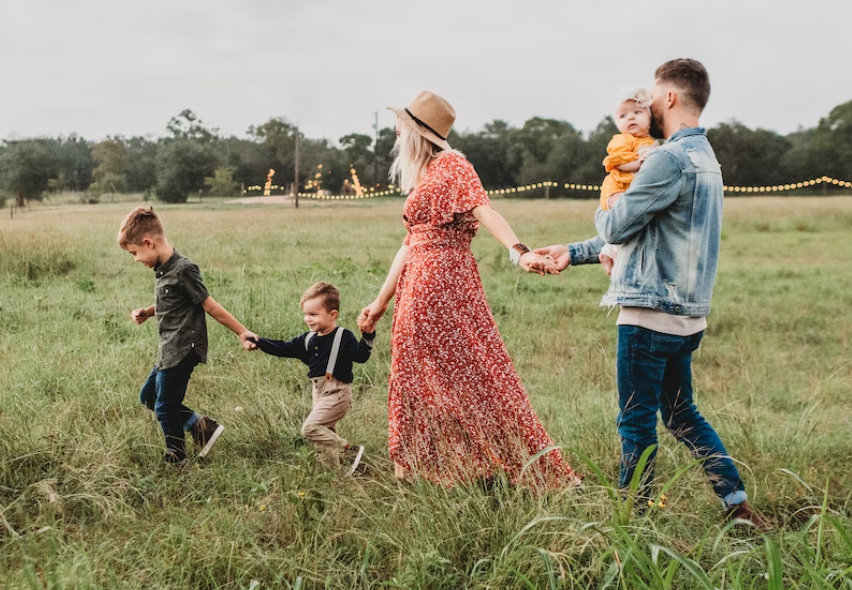
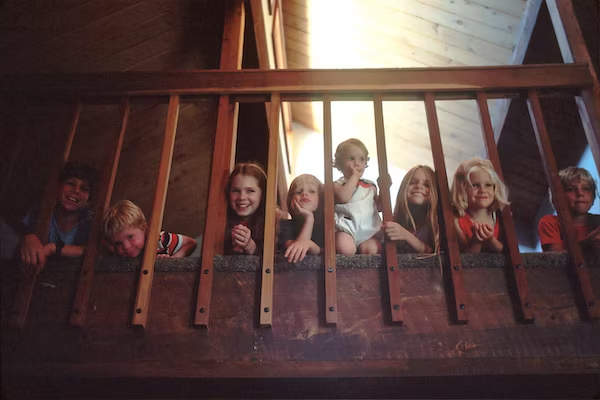

This article has been written and researched by our expert Loveable through a precise methodology. [Learn more about our methodology](https://avada.io/loveable/our-methodological.html)

[Loveable](https://avada.io/loveable/) > [Blog](https://avada.io/loveable/blog/) > [Parenting](https://avada.io/loveable/parenting/)

# Free-Range Parenting And All Things You Need To Know: Tips And Benefits 

Written by [Benjamin Collins](https://avada.io/loveable/author/benjamin/) Last Updated on August 28, 2023

- [4 Main Principles of Free-Range Parenting](https://avada.io/loveable/blog/free-range-parenting/#wp-block-heading-2-3) 
- [Pros and Cons of Free-Range Parenting Style](https://avada.io/loveable/blog/free-range-parenting/#wp-block-heading-2-18) 
- [5 Tips for Practicing Free-Range Parenting](https://avada.io/loveable/blog/free-range-parenting/#wp-block-heading-2-35)
- [Bottom Line](https://avada.io/loveable/blog/free-range-parenting/#wp-block-heading-2-52) 

A parenting approach called “**Free-Range Parenting**” has drawn lots of attention at a time when concerns about helicopter parenting and overprotection are prevalent. According to proponents of free-range parenting, children should be given more flexibility and autonomy to explore their surroundings with a sense of responsibility and freedom. It places a strong emphasis on striking a balance between giving kids the support and resources they need and letting them use their own initiative to learn valuable life lessons. 

The main tenets of free-range parenting will be covered in this article, along with helpful advice on how to use it and some noteworthy advantages it can have for kids’ growth. Read to learn more about free-range parenting and its potential benefits for developing independent and self-assured people, whether you’re a parent, a guardian, or you’re just curious about alternative parenting strategies.

## **4 Main Principles of Free-Range Parenting** 

The principles of Free-Range Parenting encompass a set of values and beliefs that guide parents in raising independent, self-reliant children. By embracing these principles, it seeks to create an environment where children can develop independence, confidence, and a sense of responsibility while fostering their natural curiosity and love for exploration. Let’s explore these four key principles in detail:

1. **Embracing Unstructured Play**

Free-Range Parents advocate for unscheduled activities that allow children to engage in unstructured play. Instead of a rigid schedule filled with organized lessons and extracurricular activities, free-range kids are encouraged to spend their time exploring and engaging in spontaneous play. 

For instance, rather than adhering to strict rules in a supervised baseball game, free-range children are encouraged to participate in pick-up games with their neighborhood friends, fostering their creativity and social skills.

2. **Nature as a Playground**

Free-Range Parenting emphasizes the importance of outdoor play in natural settings. Encouraging children to be outside, away from electronic devices, is seen as a way to foster their imagination and connection with the environment. 

Whether exploring the garden, building forts, or going on nature walks, free-range parents recognize the value of unstructured play in nature for their child’s physical, emotional, and cognitive development.

3. **Gradual Independence**

Free-Range Parents believe in allowing children to earn their independence gradually. They provide opportunities for their children to take on age-appropriate responsibilities and make decisions on their own. 

By gradually increasing freedom and responsibility, free-range parents empower their children to develop confidence, resilience, and problem-solving skills. This approach highlights the belief that children are capable of accomplishing challenging tasks and trying new things independently.

4. **Overcoming Fear-Based Parenting**

Free-Range Parents choose not to parent out of fear. While safety measures, such as wearing a helmet while biking, are enforced, free-range parents also acknowledge that accidents can happen anywhere. They understand that by shielding their children from all [potential risks](https://research.uoregon.edu/manage/research-integrity-compliance/human-subjects-research/examples-potential-risks-subjects), they may hinder their growth and development. 

Instead, they allow their children to engage in activities like playground play and new experiences, recognizing that occasional setbacks or minor injuries are part of the learning process and contribute to their overall development.

## Pros and Cons of Free-Range Parenting Style 

1. **Benefits of Free-Range Parenting**

The practice of “free-range parenting” has a number of advantages that advance kids’ overall well-being and development. Among the many benefits of this parenting approach are the following:

- **Greater Independence and Self-Belief**: Free-range parenting style on age-appropriate duties and making their own judgments are encouraged by parenting. Children gain a sense of self-reliance and confidence in their skills by being given freedom and gradually expanding their independence. They develop a strong feeling of self-efficacy that can positively affect their personal and professional lives as they learn to trust their judgment, problem-solve, and overcome obstacles on their own.

- **Better Adaptability and Resilience**: Free-Range Through parenting, kids are exposed to a range of experiences and given a chance to confront and conquer obstacles. Children learn important resiliency, perseverance, and flexibility lessons from facing setbacks, dangers, and even minor injuries. Throughout their life, they acquire the abilities to overcome challenges, accept change, and recover from hardship. Their resiliency gives them the skills they need to handle the challenges of adulthood and succeed in a constantly shifting environment.

- **Improved Emotional Intelligence and Social Skills**: Children learn to negotiate, cooperate, and communicate through impromptu games and activities. They acquire critical social abilities like empathy, conflict resolution, and cooperation. Allowing kids to freely explore their surroundings and interact with a variety of contexts encourages the development of emotional intelligence, enabling them to understand, control their own emotions and relate to others with empathy and understanding.

- **Creativity and Imagination Stimulated**: This style encourages kids to play freely, spend time outside, and use their natural imagination and creativity. Children can explore, invent, and learn without being restricted by adult-led activities or excessive screen time. As a result, youngsters develop innovative approaches to problems and novel situations, problem-solving abilities and a feeling of wonder.

- **Benefits for Health and Well-Being**: Parents may encourage kids to play outside and explore their surroundings by encouraging an active lifestyle. Regular physical activity benefits kids’ physical health by fostering the growth of their motor abilities, strength, and general fitness. Additionally, being outside has been connected to a host of advantages for mental health, including lowered stress levels and improved cognitive performance.

2. **Criticisms of Free-Range Parenting**

Despite having its benefits, free-range parenting is also criticized from a number of angles. Here are some typical objections to this parenting style:

- **Safety Issues**: Concerns regarding children’s safety are among the main issues against free-range parenting. Critics contend that allowing kids more freedom and independence could put them in danger or at risk. They contend that without continual supervision, kids could be more prone to mishaps, injuries, or run-ins with strangers. This argument emphasizes the necessity to balance encouraging independence with safeguarding the security and welfare of children.

- **Age Appropriateness**: Some people claim that giving young kids too much independence and responsibility without sufficient supervision runs the risk of overwhelming them or putting them in situations they are not yet developmentally capable of handling. They emphasize the significance of setting age-appropriate limits and progressively introducing freedom based on a child’s aptitudes and level of development.

- **Lack of organization and Boundaries**: According to some detractors, Free-Range Parenting may cause a lack of organization and boundaries in a child’s life. They claim that a child’s ability to acquire self-control, time management skills, and a sense of responsibility may be hampered by the lack of a planned schedule or adult-led activities. From critics, a more balanced approach that includes both unstructured play and structured activities can offer a child a well-rounded environment for development.

- **Privilege and Accessibility**: Detractors often question if free-range parenting is available to all families. They contend that families who have resources, such as access to safe areas, outdoor spaces, and community support, may find this parenting style to be more attainable. Families in underprivileged or metropolitan locations can find it difficult to give their kids the same amount of independence and outdoor activities, which could exacerbate differences in child development possibilities.

**_Check Out_**: [Navigating Long-Distance Parenting](https://avada.io/loveable/navigating-long-distance-parenting/): Tips for Staying Connected with Your Child

## **5 Tips for Practicing Free-Range Parenting**

Free-Range tips for finding the ideal balance between allowing children to be independent and ensuring they are secure and well-cared for is an essential part of parenting. To execute this parenting strategy successfully, consider the following advice:

1. **Be knowledgeable about the laws**

Despite your well-meaning efforts to teach your child independence, things can go wrong if it is actually illegal to leave your [10-year-old](https://avada.io/loveable/gifts-10-year-olds/) alone at home with the family dog. Mercedes Samudio, a licensed clinical social worker and a parent coach, advises being aware of the laws in your state regarding the age at which a child may stay home alone or perform certain tasks that you may think they are ready for.

2. **Establish the rules**

Once you are familiar with legal requirements for parenting in your state, it is important to establish rules and expectations that will govern behavior within your household. It is crucial to recognize that while you may genuinely want to give your child more responsibility, they may not yet have the maturity to adhere to your set boundaries.

For instance, if your 8-year-old wants to play in the backyard with friends on the next street, discuss how they will safely get there and back, remind them to call home upon arrival and inquire about their understanding of when to return. If your child can answer these questions satisfactorily, they are ready for independence. 

3. **Provide space and support**

While you allow your children to explore and have some freedom, you need to be available in case they need guidance or encounter difficulties. Let your children make choices about their activities, expect them to entertain themselves at the park while you engage in your own activities, and walk home with them, allowing them to choose the route. 

Encourage them to handle their own conflicts with friends, teachers, or coaches. When they seek guidance, ask for their thoughts first. If appropriate, support their choices even if they differ from yours. Redirect them if necessary, but use these moments as opportunities to foster decision-making skills and self-reflection. By parenting in this manner, there is no need to be fearful.

4. **Educate and inform your children**

While youthful innocence and a fearless outlook on the world have their merits, it is still essential for parents to prepare their children for the realities of life when teaching independence.

For example, teach them to never approach or enter a car if a suspicious stranger asks for help finding a lost pet. They should run in the opposite direction of the car, giving them a head start and the ability to call for help.

5. **Trust your instincts**

Ultimately, regardless of whether you embrace free-range parenting, the best advice for any parent is to trust their own intuition and beliefs. Each family has the responsibility to define their own values. 

As life is unpredictable, it is up to each individual to make decisions based on their belief system and conscience. Living with regret later in life is the worst outcome, so making choices aligned with your convictions is crucial.

## **Bottom Line** 

To conclude, **Free-Range Parenting** gives a unique method for developing independent, self-sufficient kids. This parenting approach encourages essential life skills, creativity, resilience, and social development by allowing for unstructured play, encouraging outside exploration, and gradually offering freedom. The sense of free-range parenting necessitates careful consideration of a child’s specific requirements and a balanced strategy that prioritizes safety precautions, notwithstanding critics’ concerns about age appropriateness and safety. 

You can start by reading thoroughly our article above, which can equip your child to explore the world with confidence, curiosity, and the capacity to embrace challenges and chances for growth by paying attention to the advice given and modifying it to your situation. In the end, free-range parenting can develop well-rounded individuals who are ready for life’s complexity while developing their intrinsic sense of justice.

- [4 Main Principles of Free-Range Parenting](https://avada.io/loveable/blog/free-range-parenting/#wp-block-heading-2-3) 
- [Pros and Cons of Free-Range Parenting Style](https://avada.io/loveable/blog/free-range-parenting/#wp-block-heading-2-18) 
- [5 Tips for Practicing Free-Range Parenting](https://avada.io/loveable/blog/free-range-parenting/#wp-block-heading-2-35)
- [Bottom Line](https://avada.io/loveable/blog/free-range-parenting/#wp-block-heading-2-52) 

### [Benjamin Collins](https://avada.io/loveable/author/benjamin/)

I'm Benjamin Collins, a gift ideas creator at Loveable. We specialize in unique and personalized gifts for any occasion. With my honed skills, I recommend gifts tailored to the recipient's personality and interests, whether it's Halloween, Christmas, or any other celebration.

- [Twitter](https://twitter.com/intent/tweet)
- [Facebook](https://www.facebook.com/sharer/sharer.php)
- [instagram](https://avada.io/loveable/blog/free-range-parenting/)
- [pinterest](https://www.pinterest.com/loveablellc/)

## Related Posts

[

### 79 Heartfelt Missing Mom Quotes for Expressing Love and Longing

](https://avada.io/loveable/blog/missing-mom-quotes/)

[

### Parenting with Depression: Strategies for Coping, Seeking Help, and Building Resilience

](https://avada.io/loveable/blog/parenting-with-depression/)

[

### 100 Empowering Single Mom Quotes: Inspirational Words for Strong Mothers

](https://avada.io/loveable/blog/single-mom-quotes/)

[

### 99+ Heartfelt Quotes And Wishes: Happy Anniversary to Mom and Dad!

](https://avada.io/loveable/blog/quotes-happy-anniversary-mom-dad/)

[

### 5 Ways to Foster a Positive Parent-Teacher Relationship

](https://avada.io/loveable/blog/parent-teacher-relationship/)
