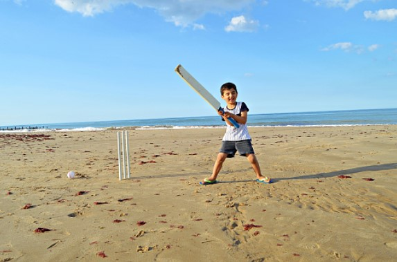
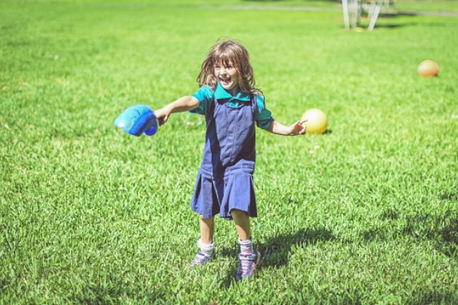
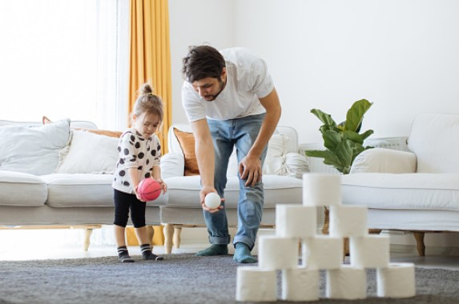
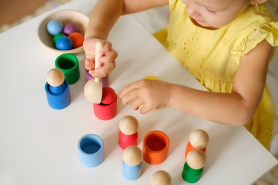

This article has been written and researched by our expert Loveable through a precise methodology. [Learn more about our methodology](https://avada.io/loveable/our-methodological.html)

[Loveable](https://avada.io/loveable/) > [Blog](https://avada.io/loveable/blog/) > [Parenting](https://avada.io/loveable/parenting/)

# Fun and Active: 15 Games to Play with a Ball for Kids 

Written by [Benjamin Collins](https://avada.io/loveable/author/benjamin/) Last Updated on August 28, 2023

- [10 Games to Play with a Ball for Kids](https://avada.io/loveable/blog/games-to-play-with-a-ball/#wp-block-heading-2-3)
    - [1\. Hit the Bat](https://avada.io/loveable/blog/games-to-play-with-a-ball/#wp-block-heading-3-4)
    - [2\. Keep Away Ball Game](https://avada.io/loveable/blog/games-to-play-with-a-ball/#wp-block-heading-3-7)
    - [3\. Silent Ball](https://avada.io/loveable/blog/games-to-play-with-a-ball/#wp-block-heading-3-9)
    - [4\. Kickball](https://avada.io/loveable/blog/games-to-play-with-a-ball/#wp-block-heading-3-11)
    - [5\. Hot Potato](https://avada.io/loveable/blog/games-to-play-with-a-ball/#wp-block-heading-3-14)
    - [6\. Toss The Ball](https://avada.io/loveable/blog/games-to-play-with-a-ball/#wp-block-heading-3-16) 
    - [7\. Bowling](https://avada.io/loveable/blog/games-to-play-with-a-ball/#wp-block-heading-3-18)
    - [8\. Break The Pyramid](https://avada.io/loveable/blog/games-to-play-with-a-ball/#wp-block-heading-3-21)
    - [9\. Tennis](https://avada.io/loveable/blog/games-to-play-with-a-ball/#wp-block-heading-3-23)
    - [10\. Cricket](https://avada.io/loveable/blog/games-to-play-with-a-ball/#wp-block-heading-3-26)
- [What to Do with a Ball Inside? 5 Creative Ideas](https://avada.io/loveable/blog/games-to-play-with-a-ball/#wp-block-heading-2-29)
    - [1\. Paintball](https://avada.io/loveable/blog/games-to-play-with-a-ball/#wp-block-heading-3-30)
    - [2\. Stair Ball](https://avada.io/loveable/blog/games-to-play-with-a-ball/#wp-block-heading-3-32)
    - [3\. Indoor Croquet](https://avada.io/loveable/blog/games-to-play-with-a-ball/#wp-block-heading-3-35)
    - [4\. Catch and Roll](https://avada.io/loveable/blog/games-to-play-with-a-ball/#wp-block-heading-3-37)
    - [5\. Fairground Ball Toss](https://avada.io/loveable/blog/games-to-play-with-a-ball/#wp-block-heading-3-39)
- [Bottom Line](https://avada.io/loveable/blog/games-to-play-with-a-ball/#wp-block-heading-2-43) 

Are you seeking for some activities to keep your kids active and engaged while also having fun? You probably think about **Games to Play with a Ball** to make fun with your kids. Balls are a kind of popular toy because of their multifunction you can create many activity games with them. There are several ball games to play, ranging from classics like soccer and basketball to lesser-known but enjoyable diversions.

Playing ball games is a great idea to keep children active while also improving their coordination and motor skills. Whatever the game is, the kids will have many joyful times while having physical activities to improve their health. No parent wants their children to stick face on the screen all the time as a couch potato, right! So, let’s inspire them and pull them up, grab a ball and get ready to have some fun!

## **10 Games to Play with a Ball for Kids**

### **1\. Hit the Bat**

With a bat, players need to strike the ball and then sprint around the field at some spot and back. It’s an excellent game for youngsters to play since it improves hand-eye coordination and agility. The thrill of attempting to strike the ball and racing to the finish line will keep children excited for hours. So, “Hit the Bat” fans, get ready to hit that ball and run like the wind!

### **2\. Keep Away Ball Game**

An active game involves trying to keep a ball away from one or more players. Players must keep the ball while preventing other players from gaining possession of it. With simple rules and countless variants, the Keep Away Ball Game is a classic that will keep youngsters of all ages entertained for hours.

### **3\. Silent Ball**

To play, players will sit in a circle and silently throw a ball to each other. A player is out if he or she loses the ball, speaks, or makes a noise. The winner is the last player standing. Silent Ball is an excellent game for teaching children to listen while also encouraging them to have fun while playing quietly. 

### **4\. Kickball**

Kickball is a traditional game similar to baseball, except it is played with a huge rubber ball that is kicked rather than struck with a bat. It may be played in a number of places and can be tailored to the participants’ skill level and age range.

### **5\. Hot Potato**

In this game, participants will pass a small item, such as a ball or beanbag, as rapidly as possible around a circle of participants while music is playing. The player holding the item is eliminated when the music finishes. The game will continue until just one player remains.  

### **6\. Toss The Ball** 

The game starts with one person tossing the ball to another member of the group. After then, the ball is passed to the third player, and so on. Everyone keeps off the ground as long as possible. If the ball hits the ground, the game is reset to the beginning. 

### **7\. Bowling**

You don’t even have to go to a bowling alley to enjoy it! You only need a ball and a few empty plastic bottles. Set the bottles up in a triangular configuration, exactly like traditional bowling pins, then take turns rolling the ball towards them to try to knock them down. It’s time to gather all of your used water bottles (or anything else that can substitute the bowling pins) in your home. Kids may paint the bottles to make them seem like bowling pins. You can also give your kid some [bowling gifts](https://avada.io/loveable/bowling-gifts/) that they’ll love.

### **8\. Break The Pyramid**

Break the Pyramid is a fun ball game in which you use a ball to knock down a pyramid of cups. The pyramid may be made out of plastic cups or any other type of container that can be stacked on top of each other. You need to knock down the pyramid as quickly as possible to win the game. 

### **9\. Tennis**

This game allows players to play singles (one-on-one) or doubles (two-on-two). It’s an excellent way to get the kids outside and moving. Tennis may be learned young, with smaller rackets and slower-moving balls. Tennis is a fun and fascinating game for kids of all ages because it combines physical exercise and strategy.

### **10\. Cricket**

Two teams with a certain number of players will bat and field alternately. The batting team seeks to score runs by striking the ball to the middle of two sets of wickets. Meanwhile, the fielding team has to catch the ball or strike the wickets with the ball. 

**Related**: Best [Gifts For Outdoorsy Kids](https://avada.io/loveable/gifts-outdoorsy-kids/) Who Love Adventure

## **What to Do with a Ball Inside? 5 Creative Ideas**

### **1\. Paintball**

Paintball is an outdoor game but you can design them as an indoor game to make it safe for kids. Register for a play paintball room or create one in your house. You can replace the paint gun with a water gun to reduce the effort of cleaning up after the game is over.

### **2\. Stair Ball**

Stair Ball is a fun indoor game that mixes basketball and handball features. The goal is to toss the ball up the steps and catch it on the way down while your opponent tries to intercept or grab the ball before it lands. So, grab a ball and head to the stairs if you’re searching for a fun way to remain active indoors!

### **3\. Indoor Croquet**

The game is played by hitting balls with mallets through the wickets. The player who hits all the balls through all the wickets and finishes the course first wins. It is an excellent choice for rainy days or when you’re confined to your home.

### **4\. Catch and Roll**

The game begins with one person rolling the ball to the other, who catches it and then rolls it back. The game continues this way, with the participants attempting to keep the ball going smoothly between them. Catch and Roll is a simple entertaining game for everyone to relax in their leisure time.

### **5\. Fairground Ball Toss**

Fairground Ball Toss is a great indoor party game to think about if you’re searching for a fun party game. It is an indoor game that both kids and adults may enjoy. Tossing balls into small buckets or cups from a distance, with the goal of getting as many balls in as possible. 

**_Check Out:_** Perfect [Educational Games And Toys For Kids](https://avada.io/loveable/educational-games-and-toys-kids/)

## **Bottom Line** 

Look no further for ways to have fun with your kids during boring days, just check out this list of **Fun and Active: 15 Games to Play with a Ball for Kids**. These activities may be tailored to your requirements everywhere, so don’t worry, even if you just have a little interior area. Some are best played with a group of friends, while others may be enjoyed alone or with a parent.

These activities are promised to give you much entertaining time while they may also help your child develop vital physical and social abilities. They’ll enjoy some exercise and fresh air while learning about collaboration, communication, and sportsmanship. So grab a ball and get ready to have a good time!

- [10 Games to Play with a Ball for Kids](https://avada.io/loveable/blog/games-to-play-with-a-ball/#wp-block-heading-2-3)
    - [1\. Hit the Bat](https://avada.io/loveable/blog/games-to-play-with-a-ball/#wp-block-heading-3-4)
    - [2\. Keep Away Ball Game](https://avada.io/loveable/blog/games-to-play-with-a-ball/#wp-block-heading-3-7)
    - [3\. Silent Ball](https://avada.io/loveable/blog/games-to-play-with-a-ball/#wp-block-heading-3-9)
    - [4\. Kickball](https://avada.io/loveable/blog/games-to-play-with-a-ball/#wp-block-heading-3-11)
    - [5\. Hot Potato](https://avada.io/loveable/blog/games-to-play-with-a-ball/#wp-block-heading-3-14)
    - [6\. Toss The Ball](https://avada.io/loveable/blog/games-to-play-with-a-ball/#wp-block-heading-3-16) 
    - [7\. Bowling](https://avada.io/loveable/blog/games-to-play-with-a-ball/#wp-block-heading-3-18)
    - [8\. Break The Pyramid](https://avada.io/loveable/blog/games-to-play-with-a-ball/#wp-block-heading-3-21)
    - [9\. Tennis](https://avada.io/loveable/blog/games-to-play-with-a-ball/#wp-block-heading-3-23)
    - [10\. Cricket](https://avada.io/loveable/blog/games-to-play-with-a-ball/#wp-block-heading-3-26)
- [What to Do with a Ball Inside? 5 Creative Ideas](https://avada.io/loveable/blog/games-to-play-with-a-ball/#wp-block-heading-2-29)
    - [1\. Paintball](https://avada.io/loveable/blog/games-to-play-with-a-ball/#wp-block-heading-3-30)
    - [2\. Stair Ball](https://avada.io/loveable/blog/games-to-play-with-a-ball/#wp-block-heading-3-32)
    - [3\. Indoor Croquet](https://avada.io/loveable/blog/games-to-play-with-a-ball/#wp-block-heading-3-35)
    - [4\. Catch and Roll](https://avada.io/loveable/blog/games-to-play-with-a-ball/#wp-block-heading-3-37)
    - [5\. Fairground Ball Toss](https://avada.io/loveable/blog/games-to-play-with-a-ball/#wp-block-heading-3-39)
- [Bottom Line](https://avada.io/loveable/blog/games-to-play-with-a-ball/#wp-block-heading-2-43) 

### [Benjamin Collins](https://avada.io/loveable/author/benjamin/)

I'm Benjamin Collins, a gift ideas creator at Loveable. We specialize in unique and personalized gifts for any occasion. With my honed skills, I recommend gifts tailored to the recipient's personality and interests, whether it's Halloween, Christmas, or any other celebration.

- [Twitter](https://twitter.com/intent/tweet)
- [Facebook](https://www.facebook.com/sharer/sharer.php)
- [instagram](https://avada.io/loveable/blog/games-to-play-with-a-ball/)
- [pinterest](https://www.pinterest.com/loveablellc/)

## Related Posts

[

### 79 Heartfelt Missing Mom Quotes for Expressing Love and Longing

](https://avada.io/loveable/blog/missing-mom-quotes/)

[

### Parenting with Depression: Strategies for Coping, Seeking Help, and Building Resilience

](https://avada.io/loveable/blog/parenting-with-depression/)

[

### 100 Empowering Single Mom Quotes: Inspirational Words for Strong Mothers

](https://avada.io/loveable/blog/single-mom-quotes/)

[

### 99+ Heartfelt Quotes And Wishes: Happy Anniversary to Mom and Dad!

](https://avada.io/loveable/blog/quotes-happy-anniversary-mom-dad/)

[

### 5 Ways to Foster a Positive Parent-Teacher Relationship

](https://avada.io/loveable/blog/parent-teacher-relationship/)
