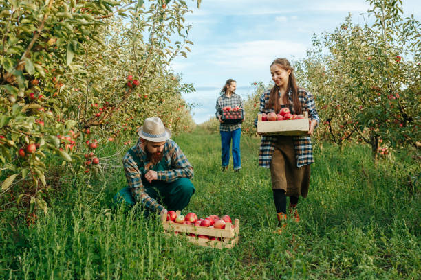
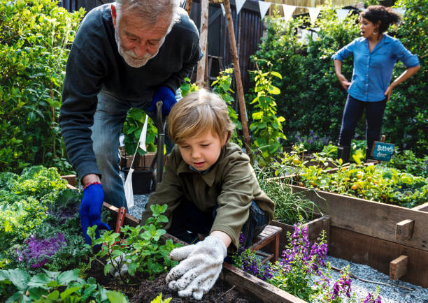
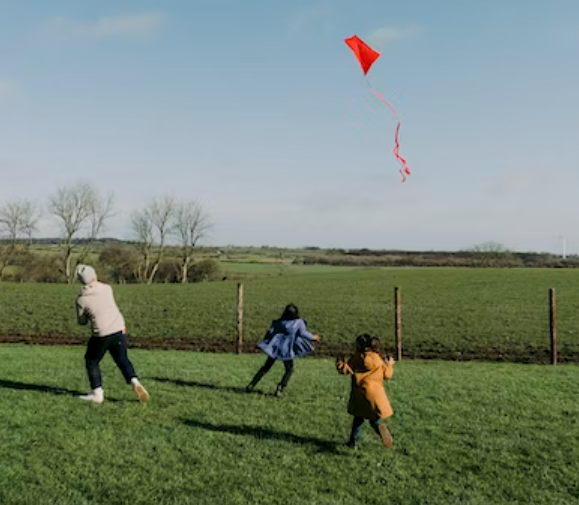
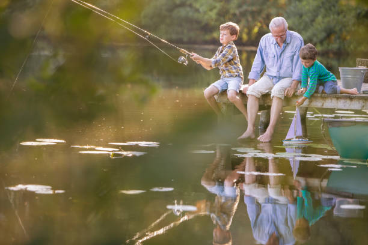

This article has been written and researched by our expert Loveable through a precise methodology. [Learn more about our methodology](https://avada.io/loveable/our-methodological.html)

[Loveable](https://avada.io/loveable/) > [Blog](https://avada.io/loveable/blog/) > [Family](https://avada.io/loveable/family/)

# Fun for the Whole Family: 26 Family Outdoor Activities to Enjoy Together

Written by [Rose Bryne](https://avada.io/loveable/author/rose/) Last Updated on August 23, 2023

- [13 Outdoor Activities That Are Good For The Family](https://avada.io/loveable/blog/family-outdoor-activities/#wp-block-heading-2-3)
- [10 Fun Activity For Family To Do Outside](https://avada.io/loveable/blog/family-outdoor-activities/#wp-block-heading-2-50)
- [Bottom Line](https://avada.io/loveable/blog/family-outdoor-activities/#wp-block-heading-2-96) 

Spending time for **family outdoor activities** has a ton of advantages, and there is a ton of scientific evidence to support that assertion. According to studies, letting kids spend time outside can help them avoid developing short-sightedness. A whole new set of advantages arise from spending time outdoors as a family, including the advantages of connecting and forming lifelong memories. It can improve everyone’s physical health as well as bring the family closer together.

However, it can occasionally be challenging to come up with entertaining activities to do – and getting kids of various ages to take part in just one thing may seem challenging. It is either a member’s personal habit or, occasionally, it can be too difficult to decide what to do as a family. So if you are looking for some of the greatest choices for **family outdoor activities,** check on these 26 **Family Outdoor Activities** to Enjoy Together to have fun for the whole family. 

## **13 Outdoor Activities That Are Good For The Family**

1. **Park Your Car Under a Shady Tree and Enjoy a Good Book.**

Parking your car under a shaded tree and spending some quality family time together while reading a nice book is one of the best tips or pieces of advice we can provide you. If you want to read a book, you can think about choosing a cozy and tranquil place to sit. Avoiding direct sunlight in hot weather and taking in the tranquility of nature may be beneficial.

Pick up a couple of books from your library or personal library, then take a few refreshments and snacks with you and choose an area under a tree that is shaded. Take turns reading to everyone else if all of your children aren’t yet old enough to read. It will both enhance their knowledge and enhance their mental wellness.

_Related_: [Road Trip Games In Car](https://avada.io/loveable/road-trip-games-play-in-car/)

2. **Take a Hike**

Hiking is a wonderful way to enhance one’s physical and emotional well-being, connect with nature, discover new locations, and spend time with loved ones. Hiking enables one to appreciate nature’s beauty and establish a connection with it. It offers a chance to unplug from the digital world and spend time in the present with the people you love most – your family. It will undoubtedly be a memorable family outing that strengthens ties.

Choose a local path and go for a pleasant walk, depending on your kids’ hiking skills. Select a flat area with a short distance if you want to make it simple. Increase length and height for a greater challenge. Bring a healthy snack and lots of water with you.

3. **Take a Picnic in the Park** 

A traditional picnic is fun at any time. To choose healthy snacks that won’t make a mess, go grocery shopping as a family in advance. For the entire brigade, you could also cook some simple sandwiches. An area of grass in the backyard or even a nearby park will still be appealing. Your kids will be enthusiastic about spending time together as a group simply because of the novelty of dining outside.

You still need to keep in mind a few things.  Make a decision regarding the food you wish to cook and carry, such as salads, sandwiches, fruits, or snacks. Additionally, bring a set of chairs or a picnic blanket to sit on. Water, utensils, napkins, and garbage bags should all be brought. And once you are done, do not forget to pick up your waste and properly dispose of it.

4. **Nature Scavenger Hunt**

Going on a nature treasure hunt is a fun approach to discovering and appreciating the beauty of the natural world with your family. Think about including an expiring time or a point system to the scavenger hunt to make it more thrilling. Bring a bag or a basket to collect your natural treasures as well. Take pictures of your discoveries and take in the splendor of nature as a group.

Ask your parents or older siblings to create a list of typical natural items found in your area. The choices are unlimited: acorns, worms, various kinds of leaves, a bunny rabbit, a spiderweb, a pinecone, etc. Aim for 15 to 25 based on how determined you feel, then head outside with a group of friends and try to complete as many items as you can.

5. **Friendly Family Competitions**

Set aside an entire day for a fun outdoor family competition! Split the family in half, and then start the games. A hula hoop competition, obstacle course, basketball free-throw rivals, tug-of-war, and rapid sprints are a few examples. This is a fantastic technique to promote exercise.

Play in a video game challenge or a tournament of vintage board games. Another excellent option is to challenge family members to prepare their finest foods and conduct a taste test. Create a list of things to find around the house or neighborhood and see who can discover them quickly to make it simpler. Keep in mind that the competition should be amicable and stress-free because the main objectives are to have fun and [spend time together as a family](https://avada.io/loveable/family-reunion-activities/).

6. **Collect Rocks and Then Paint Them**

With friends and family or by yourself, gathering rocks and painting them may be a creative and enjoyable activity. Pick out a few suitable rocks as a family, subsequently set up a store in the lawn, and acrylic paint them. Use a spray-on sealer as soon as the paint has been set to protect the design. The rocks can be positioned wherever you like, whether in your garden or yard. 

 Going outside and gathering rocks of various sizes and shapes is the first thing you should do. So that the paint sticks well, make sure the rocks are clean and smooth. Paint the rocks in the patterns you like with a brush or paint marker. You can draw anything you like, including abstract patterns, flowers, and animals. Ensure that your designs are engaging and original.

7. **Fruit-Picking**

It’s practically time to pick in the spring, summer, and fall! In the fall, visit neighboring orchards or pumpkin patches. In the summer, grab some empty pints and visit a nearby farm to pick blueberries or strawberries. You might choose a “pick your own” veggie garden instead of fruit. Select a Christmas tree with a friend in the winter.

The different fruits ripen at various times of the year, so keep that in mind when you organize your family’s fruit-picking excursion. Strawberries, blueberries, apples, peaches, and cherries are a few common fruits that families like to choose together. Make sure to ask local farms or orchards when they allow fruit picking and what kinds of fruits they have available. In general, picking fruit may be enjoyable and rewarding for the entire family. Just remember to prepare ahead of time, dress appropriately, and adhere to any instructions or rules given by the farm or orchard.

8. **Volunteer at a Local Park**

If you’re fortunate enough to live close to a state park, inquire beforehand about if your family can “shadow” a ranger for the day. As an alternative, you may find out if the park provides volunteer opportunities. Not only will it benefit your family, but it may also improve the lives of others. The children can also learn how to behave well in the future.

For instance, some parks set aside days to pick up invasive species or repaint fences. Whatever you decide to do, this is a great teaching opportunity to emphasize the importance of giving back to the community and protecting the environment. You could offer to donate some clothing or other items that would be useful to them.

**_Related_**: [Volunteer Activities](https://avada.io/loveable/volunteer-activities/)

9. **Plan a Walk** 

Set out a day and time each week to take a short stroll around your neighborhood or in a nearby park if you want to get your family outside more frequently in general. In addition to encouraging regular exercise, consistency will help establish a habit and guarantee that everyone in the family can participate.

To accommodate everyone’s schedules, pick a regular day and time each week.  In order to know how long the walk will take you and where you want to go, plan your route in advance. You may get some exercise and have an opportunity to enjoy quality time with your family while taking in the beauty of your area by organizing a weekly family stroll.

10. **Visit an Animal Rescue Center**

A great way to support animals in need is to take your family to an animal rescue facility.  A refuge for wild cats, birds, or even horses is a type of animal rescue institution that is found in many areas. In addition to getting your family outside, visiting one of these facilities offers a chance to learn about the endangered species being saved.

These facilities work to give animals who have been mistreated, abandoned, or in danger of being put to death shelter, care, and rehabilitation. You may find out more about the animals and the effort involved in caring for them by visiting an animal rescue facility. If you want to expand your family, you may also think about adopting a pet from the center.

11. **Go Stargazing**

Take the whole family to a place with little or no light pollution if it’s a clear night. Bring some blankets and lie on your back to see the stars. You can count them, identify large stars and clusters, or even try to spot passing comets. For better luck, perform the latter during a shower of meteors, like the Perseids or Leonids.

For the family members, this is certainly a terrific way to unwind and de-stress, and it’s also informative because you can learn about the stars, constellations, and planets by looking at them. Overall, taking in the wonders of the cosmos while stargazing on a clear night is a wonderful way to think, appreciate, and be in awe of them.

12. **Gardening Together** 

There are few things more enjoyable than seeing a garden blossom into life. Opt for several kinds of plants as a family, prepare a plot of ground (or use a raised bed), and then plant your bounty. Additionally, gardens are a great way for children of all ages to learn about responsibility, and you are able to continue working on the task for many years and months to come. Even just knowing how to recognize different kinds of plants is an ongoing skill that will never run out!

Plan what you want to grow in your [garden](https://avada.io/loveable/gardening-activities-ideas/) while sitting down with your family. Be mindful of everyone’s preferences and areas of interest, and select plants that are suited to your region’s climate and growth circumstances.

13. **Squirt Gun Fight**

Splattering around with water in the sweltering summer heat is the most reviving feeling there is. Squirt guns and water balloons can be added to the mix to boost the ante. Blow up as many balloons as you can as a family, then have fun! It can help you improve your physical health as well as be a fun and cool summertime family activity. 

Another option is to chase each other around the yard while wearing a pair of super soakers. You could even split up into two teams, say, kids versus adults, and have a nice brawl. Remind yourself that this is merely a family outdoor activity and avoid being too aggressive or competitive, just have fun with it and enjoy it as a whole.

## **10 Fun Activity For Family To Do Outside**

1. **Fly Kites.**

Flying kites is an excellent family tradition because they are energetic, full of energy, and don’t require batteries. It might be an enjoyable outdoor activity that you can do with your family and friends. Enjoying the stunning surroundings of the outside sight from the park will make for a memorable time for you and your family members.

Ensure the day is windy enough to maintain the kite in the air. As soon as the kite is in the air, take turns flying it while taking pleasure in watching it soar high in the sky. Additionally, you can make it a fun activity by dressing up your kite before flying it and bringing snacks and drinks to enjoy while you take turns flying the kites.

2. **Play Wiffleball or Kickball**

A wonderful way to spend time with family and get some physical activity is to play kickball or wiffleball. Both games are capable of being played in a restricted space and are simple to set up. Kickball is identical to baseball yet is played with a huge rubber ball that is kicked in lieu of being struck with a bat. Wiffleball is played with a ball made of plastic and a bat and is safer than traditional baseball. Whatever you decide, make sure you enjoy yourself and the time with your loved ones!

3. **Catching Insects**

It can be entertaining and educational to catch insects as a family. As this is which insects are most likely to be found, you can start by searching for a park, forest, or garden with a lot of vegetation. Observe the insects you catch carefully, taking note of their colors, shapes, and behaviors. Learning about the many insect species in your area can be done at this time.

You should keep a few suggestions in mind. Bring a collecting jar, a net, and a field book with you to help you recognize the insects you gather, and make sure to dress and walk appropriately.  Above all, keep in mind to enjoy yourself and the time you spend with your family when catching bugs.

4. **Beachcombers**

Everyone in the family enjoys spending the day at the beach. Finding seashells, exploring tidewaters, surfing and swimming, or engaging in beach activities like Frisbee, volleyball, and flag football are just a few of the outdoor pursuits that are ideal for the beach. Other excellent options include making sandcastles, having a picnic, and going for long walks.

 Coming to the beach is also good for all the preparation, preparation, packing, and possibly the lengthy journey. As you might be already aware, being in a natural setting, like the beach, has healing effects that enhance one’s overall health and well-being. You can engage in a variety of activities at the beach, including beach volleyball, island hopping, kayaking, and surfing. Without even realizing it, you’re becoming physically strong and healthy, and the kids just enjoy themselves.

5. **Water Slip and Slide**

Family outings on slips & slides can be enjoyable and reasonably priced during the summer. Spend the afternoon slipping and sliding around after creating your own slip-and-slide together.

Before utilizing the slide, test it out by carefully sliding down a tiny portion of it to ensure it is both safe and sufficiently slippery.

 When it’s ready to be used, give it an appropriate run before jumping upon it to slide the entire length of it. To prevent any mishaps or injuries, remember to observe safety precautions like dressing appropriately and rotating.

6. **Family Fishing Day**

In order to find a local watering hole and pack the fishing equipment, bait, and some refreshments, kids will enjoy learning how to bait their hooks and cast their lines even if they don’t catch anything. If you hook a thing, bring in the big one and record the moment on camera or film. Undoubtedly, it will leave a lasting impression.

Get your family pumped up for the vacation by explaining your plans to them. Even better, you may prepare them by teaching them some fundamental fishing techniques. Spend as much time as possible with your family when fishing because it is a tranquil and relaxing pastime. On this day of family fishing, make memories and start new customs!

7. **Photography** 

Spend the day outside, capturing the splendor of nature with a camera. Visit a wildlife reserve, stroll through your city, or discover farm life, then take pictures of what you see. These photos can be developed later and made into a lovely memory book for everyone to enjoy.

Always make sure the location you choose fits your family’s overall style. Anyplace your family frequently visits is OK, including a park or a shopping center. Or simply take a photo every time your family leaves the house. Share the photo you just took with your loved ones after you think it’s perfect. You may print it off and frame it, send it through email, or share it on social media to preserve memorable moments!

8. **Meal at Farmer Market** 

Eating fresh, in-season vegetables, supporting regional farmers, and spending time with your family may all be accomplished by organizing dinners around the farmer’s market. The whole family will benefit from the educational and seasonal activity of visiting a farmer’s market. Browse the distinctive stalls and select wholesome, regional ingredients to bring home. Divide your family into teams once you get home, and have each of them prepare a meal using the groceries you bought. 

You can harvest bushels of strawberries, blueberries, and blackberries to utilize in delectable dishes and desserts by asking nearby farms about their timetables for collecting berries. To reduce trash, do not forget to bring reusable bags and containers to the farmer’s market before going home to keep the farm green forever!

9. **Canoe Trip**

A family canoe excursion can be a wonderful way to spend time together and take in the outdoors. Canoe expeditions can be protracted journeys along meandering rivers, but they are a top family outing for those seeking the ideal summer balance of action and relaxation. The majority of river cruises might take many hours to accomplish, so be sure to schedule the entire day.

Choose a location with a family-friendly atmosphere and tranquil waves. You may either lease canoes or make a financial commitment to buy them, depending on how frequently you intend to go on canoe journeys. Everyone in the family should be familiar with certain fundamental canoeing techniques, such as paddle strokes, canoe steering, and what to do if the canoe capsizes.

10. **Have Fun With Bubbles**

Bubbles are a kid’s favorite, so this may be one of the greatest family activities to do together! Find a simple DIY bubble recipe and make your own. Take your mixture outside and experiment with different bubble wands to create bubbles of all different shapes and sizes. See who can create the biggest, most durable, or most captivating bubble. What crazy shapes take the form of your bubbles as they drift away?

To see who can blow the biggest or longest-lasting bubble, you can compete with family members in a bubble-blowing contest. Create your own bubble solution using dish soap and water, and then play around with other additives like corn syrup or glycerin to observe how they impact the bubbles.

11. **Forage for Craft Materials**

It can be enjoyable and rewarding to go foraging for crafting supplies. Kids inherently understand the power of a good DIY project, which is frequently rediscovered in maturity. Get ultra-sustainable by getting your materials from a nearby park – or even your own backyard – instead of going to the closest craft store.

Choose objects like pebbles or other natural materials that have already contributed to their respective ecosystems, such as fallen branches or leaves. If you and your family live close to the shore, you can gather seashells and driftwood to make crafts with a beach theme. Always remember to preserve the environment and avoid disturbing any wildlife’s habitats when foraging for supplies.

12. **Swimming** 

In the sweltering summer, going for a swim with your family is never a bad idea. There is nothing more reviving than finding the closest natural body to the ocean and jumping in! Visit an ocean, river, lake, or pond to beat the scorching sun and stay active while you kick and splash around (under supervision!).

A terrific way to spend time with your family while staying active is to go swimming. It’s a fantastic method to stay cool on a hot day as well. To ensure that everyone has a safe and happy time at the lake, the ocean, or the pool, just abide by all the safety rules and regulations. Keep in mind to use sunscreen, drink plenty of water, and never swim alone.

13. **Rock Hunting** 

Spending time with your family while collecting rocks may be joyful and fun! Rock collecting is an ongoing activity. This frequent practice, known as “rockhounding,” is an activity in amateur geology that aids children in developing a fundamental understanding of the earth. Additionally, polished rocks can be used to create incredibly lovely (and environmentally friendly) gifts and decor.

A durable bag or container, a pair of gloves, a rock hammer, and other gear are essential for collecting rocks. Spend some time sorting and organizing your rocks when you’ve finished collecting. You might even wish to put them on display in a certain room of your house. Most importantly, enjoy your time exploring and finding new pebbles with your family!

**_Related_**: [Ideas For Celebrating Birthday With Family](https://avada.io/loveable/celebrating-birthday-with-family/)

## **Bottom Line** 

Depending on your hobbies and where you are, there are a variety of **family outdoor activities** that you may do as a family. And if you’re unsure about where to go or what to do with your family while you’re gone, carefully reading the article can help you find the right solution. 

We hope the above activities will encourage you to gather the entire family for some fun and family bonding with family outdoor activities. There are no restrictions on the type of fun you may have outdoors when you have a large family. These are memories that your children will treasure as adults as well as recollections that you will treasure as a parent. 

- [13 Outdoor Activities That Are Good For The Family](https://avada.io/loveable/blog/family-outdoor-activities/#wp-block-heading-2-3)
- [10 Fun Activity For Family To Do Outside](https://avada.io/loveable/blog/family-outdoor-activities/#wp-block-heading-2-50)
- [Bottom Line](https://avada.io/loveable/blog/family-outdoor-activities/#wp-block-heading-2-96) 

### [Rose Bryne](https://avada.io/loveable/author/rose/)

Hi, I'm Rose! I love animals and spending time with kids. At Loveable, I help people find unique gifts for special occasions like Valentine's Day, housewarmings, and graduations. I enjoy finding gifts for kids, teens, and animal lovers that match their interests and personalities. Making gift-giving a pleasant experience is my priority. Let me assist you in finding the perfect gift!

- [Twitter](https://twitter.com/intent/tweet)
- [Facebook](https://www.facebook.com/sharer/sharer.php)
- [instagram](https://avada.io/loveable/blog/family-outdoor-activities/)
- [pinterest](https://www.pinterest.com/loveablellc/)

## Related Posts

[### 30 Best 4 Year Old Birthday Party Ideas For A Memorable Celebration](https://avada.io/loveable/blog/4-year-old-birthday-party-ideas/) 

[

### 16th Birthday Party Ideas to Make an Unforgettable Day

](https://avada.io/loveable/blog/16th-birthday-party-ideas/)

[

### 150+ Inspirational Birthday Quotes to Spread Joy on Special Day

](https://avada.io/loveable/blog/inspirational-birthday-quotes/)

[

### 160+ Birthday Wishes for Wife to Express Eternal Love

](https://avada.io/loveable/blog/birthday-wishes-for-wife/)

[### 90+ Heart Touching Birthday Wishes for Niece to Make Her Day Extra Special](https://avada.io/loveable/blog/birthday-wishes-for-niece/)
