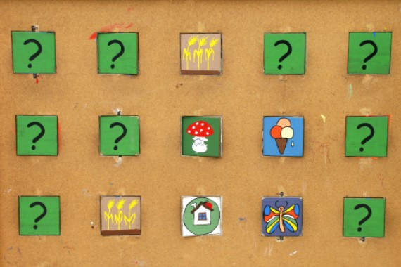
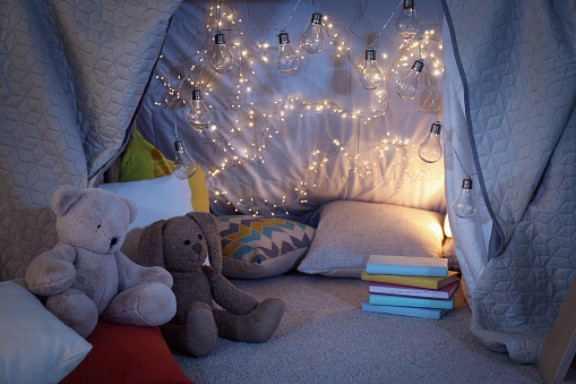

This article has been written and researched by our expert Loveable through a precise methodology. [Learn more about our methodology](https://avada.io/loveable/our-methodological.html)

[Loveable](https://avada.io/loveable/) > [Blog](https://avada.io/loveable/blog/) > [Family](https://avada.io/loveable/family/)

# Fun Indoor Games: 29 Exciting Ways to Entertain at Home For All Ages

Written by [Rose Bryne](https://avada.io/loveable/author/rose/) Last Updated on August 22, 2023

- [10 Indoor Games for Kids to Improve Their Skills and Health](https://avada.io/loveable/blog/fun-indoor-games/#wp-block-heading-2-4) 
    - [1\. Memory Game](https://avada.io/loveable/blog/fun-indoor-games/#wp-block-heading-3-5)
    - [2\. Hopscotch](https://avada.io/loveable/blog/fun-indoor-games/#wp-block-heading-3-8)
    - [3\. Land-Air-Sea](https://avada.io/loveable/blog/fun-indoor-games/#wp-block-heading-3-10)
    - [4\. Treasure Hunt](https://avada.io/loveable/blog/fun-indoor-games/#wp-block-heading-3-12)
    - [5\. Puzzles](https://avada.io/loveable/blog/fun-indoor-games/#wp-block-heading-3-15)
    - [6\. Balance Beam](https://avada.io/loveable/blog/fun-indoor-games/#wp-block-heading-3-17)
    - [7\. Listening Game](https://avada.io/loveable/blog/fun-indoor-games/#wp-block-heading-3-19)
    - [8\. Basketball](https://avada.io/loveable/blog/fun-indoor-games/#wp-block-heading-3-22)
    - [9\. Touch-and-Feel Box](https://avada.io/loveable/blog/fun-indoor-games/#wp-block-heading-3-24)
    - [10\. Hot Potato](https://avada.io/loveable/blog/fun-indoor-games/#wp-block-heading-3-27)
- [5 Indoor Activities For Kids That Are Both Fun and Creative](https://avada.io/loveable/blog/fun-indoor-games/#wp-block-heading-2-29) 
    - [1\. Bubble-Making](https://avada.io/loveable/blog/fun-indoor-games/#wp-block-heading-3-30)
    - [2\. Origami](https://avada.io/loveable/blog/fun-indoor-games/#wp-block-heading-3-33) 
    - [3\. Paint Things](https://avada.io/loveable/blog/fun-indoor-games/#wp-block-heading-3-35) 
    - [4\. Blanket Fort](https://avada.io/loveable/blog/fun-indoor-games/#wp-block-heading-3-37)
    - [5\. Play with Clay](https://avada.io/loveable/blog/fun-indoor-games/#wp-block-heading-3-40) 
- [5 Indoor Games for Kids to Play with Their Friends and Siblings](https://avada.io/loveable/blog/fun-indoor-games/#wp-block-heading-2-42) 
    - [1\. Online Party](https://avada.io/loveable/blog/fun-indoor-games/#wp-block-heading-3-43) 
    - [2\. DIY Bowling at Home](https://avada.io/loveable/blog/fun-indoor-games/#wp-block-heading-3-45) 
    - [3\. Family Board Games](https://avada.io/loveable/blog/fun-indoor-games/#wp-block-heading-3-48) 
    - [4\. Tape Shape Game](https://avada.io/loveable/blog/fun-indoor-games/#wp-block-heading-3-50)
    - [5\. Sticky Spider Web](https://avada.io/loveable/blog/fun-indoor-games/#wp-block-heading-3-52)
- [9 Fun Indoor Games for Adults or Teenagers](https://avada.io/loveable/blog/fun-indoor-games/#wp-block-heading-2-54) 
    - [1\. Truth or Dare](https://avada.io/loveable/blog/fun-indoor-games/#wp-block-heading-3-55) 
    - [2\. Sheet Mime](https://avada.io/loveable/blog/fun-indoor-games/#wp-block-heading-3-58)
    - [3\. Beer Pong](https://avada.io/loveable/blog/fun-indoor-games/#wp-block-heading-3-61)
    - [4\. Chocolate Game](https://avada.io/loveable/blog/fun-indoor-games/#wp-block-heading-3-63)
    - [5\. Mail Call](https://avada.io/loveable/blog/fun-indoor-games/#wp-block-heading-3-66)
    - [6\. Never Have I Ever](https://avada.io/loveable/blog/fun-indoor-games/#wp-block-heading-3-68)
    - [7\. Straight Face](https://avada.io/loveable/blog/fun-indoor-games/#wp-block-heading-3-70)
    - [8\. Telephone Game](https://avada.io/loveable/blog/fun-indoor-games/#wp-block-heading-3-73) 
    - [9\. Paper Tower](https://avada.io/loveable/blog/fun-indoor-games/#wp-block-heading-3-75)
- [Bottom Line](https://avada.io/loveable/blog/fun-indoor-games/#wp-block-heading-2-77) 

Stuck at Home with Nothing to do? Don’t think that there is nothing to do in your home. It’s just because you don’t get that the indoor world can be expanded bigger than you can imagine. Sit down and think about what you can do; otherwise, you can refer to this Blog as a guide.

Whether you’re looking for a way to entertain your kids, have a fun night with friends, or just need a break from the outside world, indoor games are the perfect choice. But don’t settle for the same old games you’ve played a million times before. With these **Fun Indoor Games: 29 Exciting Ways to Entertain at Home For All Ages**, you’ll be sure to keep everyone entertained for hours. And what’s more? These games are designed to satisfy for all ages, so it’s believed that players can have a good time together.

So prepare for some space and a snack indoors to have a great time with these **Fun Indoor Games**. Who knows, you could discover a new favorite game.

## **10 Indoor Games for Kids to Improve Their Skills and Health** 

### **1\. Memory Game**

A [memory game](https://avada.io/loveable/memory-help-games/) is a popular game to develop memory and concentration skills. It’s simple to set up, so making it an excellent indoor game for playdates. All you need to play the game is a deck of cards with matching pairs of things. Put the cards face down on a table and require each player to take turns flipping over two cards. Those who can match the cards will get points.

### **2\. Hopscotch**

Hopscotch is a popular game that improves both balance and cognitive ability. Hopscotch may also be played inside with little equipment, making it a practical and accessible game for children to enjoy at home. It may also be tailored to different ability levels, making it appropriate for Kids of all ages.

### **3\. Land-Air-Sea**

Players stand in a circle and take turns yelling out a word or phrase from one of three categories: land, air, or sea. The catch is that the following player must pronounce a word from a new category immediately, and they cannot repeat any prior terms. Players are eliminated from the game if they pause or respond incorrectly. 

### **4\. Treasure Hunt**

A tiny toy or trinket, a bag of chocolates, or a particular gift might all be considered treasures. Ensure the clues are age-appropriate and not too tough to answer before scattering them around the house. You may even make the quest more difficult by tagging each clue with puzzles or physical obstacles. 

### **5\. Puzzles**

When it comes to mind games, jigsaw puzzles cannot be ignored. Puzzles can assist players in enhancing their problem-solving abilities as well as their memory recall. Working on puzzles with others helps foster collaboration and communication skills. You can make it unique by designing special photo puzzles ( wedding photos, Family photos, etc)

### **6\. Balance Beam**

Allow the children to take turns walking on the balance beam, making it more difficult by adding hazards such as cones or stuffed animals to avoid. It’s a terrific way to get some exercise on a rainy day or during the winter months when outside activity isn’t possible.

### **7\. Listening Game**

It is highly recommended for those who are learning a second language. Let’s make a competition to check who has better linguistic skills. This game improves listening skills to detail. The game may be played with any number of participants and tailored to various age groups and skill levels. 

### **8\. Basketball**

It’s an outdoor game, but you can still design it as an indoor game with a modest space. If your height isn’t enough to play real basketball, make it easy for everyone takes turns throwing the sock ball into the bucket. It is an enjoyable approach to increasing physical fitness and burning calories.

### **9\. Touch-and-Feel Box**

The game entails filling a box with numerous objects of varied textures and forms, blindfolding the participant, and then asking them to guess what they are experiencing. Players can take turns blindfolding themselves and guessing the things in the box. The game can be made more difficult by having a greater selection of objects with more subtle changes in texture and shape. 

### **10\. Hot Potato**

The game’s goal is to pass a tiny item, such as a ball or beanbag, as rapidly as possible around a circle of participants while music is playing. The player holding the item is eliminated when the music finishes. The game will continue until just one player remains. 

## **5 Indoor Activities For Kids That Are Both Fun and Creative** 

### **1\. Bubble-Making**

Let youngsters feel the texture of the bubbles and watch them float in the air; this activity is a great terrific sensory experience. Children may create various bubble shapes and sizes with their imagination; Meanwhile, they will be very excited to snap and pop them. 

### **2\. Origami** 

It’s known that origami is a popular art of paper folding that originated in Japan. Children may make various forms with only a piece of paper ( we have origami paper for that, but any kind of paper can be used). It may be a calming pastime for children. After they have learned the fundamentals, they can progress to more difficult crafts. 

### **3\. Paint Things** 

Check out whether kids have the potential to be professional painters or not. You may give the kids a subject to paint, such as painting their favorite animal or producing a self-portrait. It’s also an ideal opportunity to spend quality time with your children while encouraging their interest in painting. Who knows that maybe they will become a Picasso in the future.

### **4\. Blanket Fort**

It’s a big dream of most children. They want to have their own kingdom as a King/Queen. It’s definitely inspired by cartoon films. It only needs blankets and pillows to drape them over. Make a multi-room fort or use string lights for a comfortable touch if you want to get creative with the design. They may spend hours simply relaxing in their warm retreat after it’s completed. 

### **5\. Play with Clay** 

Clay has been a common game for kids to improve their creativity; It’s even recognized as a lesson in school. Clay is a flexible material that can be shaped into an infinite number of forms, allowing youngsters to express themselves artistically. They can sculpt anything they want ( animals, plants, and even their favorite food). 

## **5 Indoor Games for Kids to Play with Their Friends and Siblings** 

### **1\. Online Party** 

There are several ways to throw an online party through social media platforms (such as Facebook, Twitter, Instagram, and Skype). You may organize games such as quiz contests, scavenger hunts, and dance parties. While an online party may not be the same as an in-person party, it may still be a fun and memorable event for children to share with their friends and siblings.

### **2\. DIY Bowling at Home** 

It’s time to gather all your reuse water bottles in your house ( or anything that can replace the bowling pins). Kids may paint to customize the bottles to appear like bowling pins. Then, create a “lane” with enough room for the ball to move toward the pins. 

### **3\. Family Board Games** 

Gather your family and choose a board game that everyone will enjoy. There are plenty of options to choose from, so you don’t have to worry about what to play. It will be better if you prepare [Gifts for Board Game Lovers](https://avada.io/loveable/gifts-board-game-lovers/). So, choose a game, gather your family, and enjoy a fun-filled game night together. 

### **4\. Tape Shape Game**

The goal of the game is to use different colored tapes to make a variety of forms within a certain time restriction. It’s an excellent method to hone your hand-eye coordination for your children.

### **5\. Sticky Spider Web**

A sticky Spider Web involves making a spider web with tape on a wall or door. Children must throw or put little balls or items onto the web without touching the tape. Kids will like the challenge of tossing things on the web, trying for them to stick.

## **9 Fun Indoor Games for Adults or Teenagers** 

### **1\. Truth or Dare** 

No need to talk more about this amazing game. It would be silly if we forgot about this common game in order to understand each other more and more. Players take turns answering a question accurately or doing a dare in the game. The questions and dares may vary from stupid and humorous to intimate and embarrassing, making for an interesting and sometimes hilarious encounter. 

Related: [Truth or Dare Questions](https://avada.io/loveable/truth-or-dare-questions/)

### **2\. Sheet Mime**

Organize the members into two teams. A large piece of fabric will be required for each squad. Each pair will have one person hold the sheet over their partner, who will then act out a word or phrase while hiding under the sheet. The other team members must figure out what the player is doing. 

### **3\. Beer Pong**

The game requires two teams standing at opposing sides of a table, each carrying cups filled with beer. In this game, the target is their opponents’ cups and participants come up with plans to throw mini balls into them. If a ball lands inside the cup, the opponent must drink the beer in that cup. While the game requires the use of alcoholic beverages, it can be adapted to include non-alcoholic beverages.

### **4\. Chocolate Game**

Participants sit in a circle and roll a dice to see who wins. If they roll a 6, they put on a hat, scarf, and gloves before cutting a piece of chocolate from a wrapped bar in the center of the circle with a knife and fork. The game goes on until the chocolate bar is gone, and whoever eats their piece first wins!

### **5\. Mail Call**

Players in Mail Call sit in a circle, with one person standing in the center without a chair. They scream out a descriptor, such as “wearing yellow,” and everyone who fits that description, including the one in the center, must rise up and find a new seat. The person who is left without a seat is the new caller.

### **6\. Never Have I Ever**

Never Have I Ever is a timeless party game that will have everyone laughing and telling memories. The game may be highly revealing and frequently results in amusing and fascinating talks.

### **7\. Straight Face**

Straight Face is a game that puts players’ ability to maintain a straight face in the face of delightfully embarrassing scenarios to the test. Players take turns drawing a card and must maintain a straight face while playing out the situation depicted on the card.  

### **8\. Telephone Game** 

First, a person will whisper a phrase or message to another one. The person who received the message then whispers it to the person next to them, and so on, until the message reaches the final person. The message is frequently delivered by the last individual, who differs greatly from the first! 

### **9\. Paper Tower**

Teams are given a limited number of sheets of paper and a limited period of time to construct the largest free-standing tower possible in this game. They are not permitted to use sticky materials. The team whose tower is the tallest at the end of the time restriction wins! 

## **Bottom Line** 

After reading this Blog, you will realize that spending a day indoors is not that bad. There are many ideas to meet your needs, whether alone or with friends. Let’s seek laughter through **Fun Indoor Games** to spice up your boring day at home. 

No reason to be bored at home with these **Fun Indoor Games: 29 Exciting Ways to Entertain at Home For All Ages!** There’s something for everyone, from traditional board games to imaginative DIY activities. These indoor games can keep you busy for hours, whether locked indoors on a rainy day or just searching for something entertaining to do at home. So, gather your friends and family and prepare for a full day to spend quality time together!

- [10 Indoor Games for Kids to Improve Their Skills and Health](https://avada.io/loveable/blog/fun-indoor-games/#wp-block-heading-2-4) 
    - [1\. Memory Game](https://avada.io/loveable/blog/fun-indoor-games/#wp-block-heading-3-5)
    - [2\. Hopscotch](https://avada.io/loveable/blog/fun-indoor-games/#wp-block-heading-3-8)
    - [3\. Land-Air-Sea](https://avada.io/loveable/blog/fun-indoor-games/#wp-block-heading-3-10)
    - [4\. Treasure Hunt](https://avada.io/loveable/blog/fun-indoor-games/#wp-block-heading-3-12)
    - [5\. Puzzles](https://avada.io/loveable/blog/fun-indoor-games/#wp-block-heading-3-15)
    - [6\. Balance Beam](https://avada.io/loveable/blog/fun-indoor-games/#wp-block-heading-3-17)
    - [7\. Listening Game](https://avada.io/loveable/blog/fun-indoor-games/#wp-block-heading-3-19)
    - [8\. Basketball](https://avada.io/loveable/blog/fun-indoor-games/#wp-block-heading-3-22)
    - [9\. Touch-and-Feel Box](https://avada.io/loveable/blog/fun-indoor-games/#wp-block-heading-3-24)
    - [10\. Hot Potato](https://avada.io/loveable/blog/fun-indoor-games/#wp-block-heading-3-27)
- [5 Indoor Activities For Kids That Are Both Fun and Creative](https://avada.io/loveable/blog/fun-indoor-games/#wp-block-heading-2-29) 
    - [1\. Bubble-Making](https://avada.io/loveable/blog/fun-indoor-games/#wp-block-heading-3-30)
    - [2\. Origami](https://avada.io/loveable/blog/fun-indoor-games/#wp-block-heading-3-33) 
    - [3\. Paint Things](https://avada.io/loveable/blog/fun-indoor-games/#wp-block-heading-3-35) 
    - [4\. Blanket Fort](https://avada.io/loveable/blog/fun-indoor-games/#wp-block-heading-3-37)
    - [5\. Play with Clay](https://avada.io/loveable/blog/fun-indoor-games/#wp-block-heading-3-40) 
- [5 Indoor Games for Kids to Play with Their Friends and Siblings](https://avada.io/loveable/blog/fun-indoor-games/#wp-block-heading-2-42) 
    - [1\. Online Party](https://avada.io/loveable/blog/fun-indoor-games/#wp-block-heading-3-43) 
    - [2\. DIY Bowling at Home](https://avada.io/loveable/blog/fun-indoor-games/#wp-block-heading-3-45) 
    - [3\. Family Board Games](https://avada.io/loveable/blog/fun-indoor-games/#wp-block-heading-3-48) 
    - [4\. Tape Shape Game](https://avada.io/loveable/blog/fun-indoor-games/#wp-block-heading-3-50)
    - [5\. Sticky Spider Web](https://avada.io/loveable/blog/fun-indoor-games/#wp-block-heading-3-52)
- [9 Fun Indoor Games for Adults or Teenagers](https://avada.io/loveable/blog/fun-indoor-games/#wp-block-heading-2-54) 
    - [1\. Truth or Dare](https://avada.io/loveable/blog/fun-indoor-games/#wp-block-heading-3-55) 
    - [2\. Sheet Mime](https://avada.io/loveable/blog/fun-indoor-games/#wp-block-heading-3-58)
    - [3\. Beer Pong](https://avada.io/loveable/blog/fun-indoor-games/#wp-block-heading-3-61)
    - [4\. Chocolate Game](https://avada.io/loveable/blog/fun-indoor-games/#wp-block-heading-3-63)
    - [5\. Mail Call](https://avada.io/loveable/blog/fun-indoor-games/#wp-block-heading-3-66)
    - [6\. Never Have I Ever](https://avada.io/loveable/blog/fun-indoor-games/#wp-block-heading-3-68)
    - [7\. Straight Face](https://avada.io/loveable/blog/fun-indoor-games/#wp-block-heading-3-70)
    - [8\. Telephone Game](https://avada.io/loveable/blog/fun-indoor-games/#wp-block-heading-3-73) 
    - [9\. Paper Tower](https://avada.io/loveable/blog/fun-indoor-games/#wp-block-heading-3-75)
- [Bottom Line](https://avada.io/loveable/blog/fun-indoor-games/#wp-block-heading-2-77) 

### [Rose Bryne](https://avada.io/loveable/author/rose/)

Hi, I'm Rose! I love animals and spending time with kids. At Loveable, I help people find unique gifts for special occasions like Valentine's Day, housewarmings, and graduations. I enjoy finding gifts for kids, teens, and animal lovers that match their interests and personalities. Making gift-giving a pleasant experience is my priority. Let me assist you in finding the perfect gift!

- [Twitter](https://twitter.com/intent/tweet)
- [Facebook](https://www.facebook.com/sharer/sharer.php)
- [instagram](https://avada.io/loveable/blog/fun-indoor-games/)
- [pinterest](https://www.pinterest.com/loveablellc/)

## Related Posts

[### 30 Best 4 Year Old Birthday Party Ideas For A Memorable Celebration](https://avada.io/loveable/blog/4-year-old-birthday-party-ideas/) 

[

### 16th Birthday Party Ideas to Make an Unforgettable Day

](https://avada.io/loveable/blog/16th-birthday-party-ideas/)

[

### 150+ Inspirational Birthday Quotes to Spread Joy on Special Day

](https://avada.io/loveable/blog/inspirational-birthday-quotes/)

[

### 160+ Birthday Wishes for Wife to Express Eternal Love

](https://avada.io/loveable/blog/birthday-wishes-for-wife/)

[### 90+ Heart Touching Birthday Wishes for Niece to Make Her Day Extra Special](https://avada.io/loveable/blog/birthday-wishes-for-niece/)
