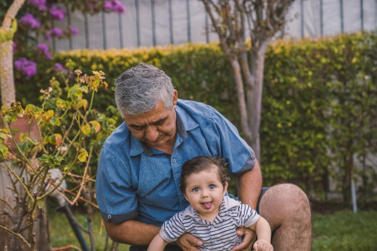

This article has been written and researched by our expert Loveable through a precise methodology. [Learn more about our methodology](https://avada.io/loveable/our-methodological.html)

[Loveable](https://avada.io/loveable/) > [Blog](https://avada.io/loveable/blog/) > [Family](https://avada.io/loveable/family/)

# Grandparenting for Modern Times: 10 Essential Advice for Being Grandparent In 2023

Written by [Rose Bryne](https://avada.io/loveable/author/rose/) Last Updated on August 18, 2023

- [Why is being a grandparent so special?](https://avada.io/loveable/blog/advice-being-grandparent/#wp-block-heading-2-4)
- [10 Tips for Being the Best Grandparents](https://avada.io/loveable/blog/advice-being-grandparent/#wp-block-heading-2-17) 
    - [Only Give What You Can](https://avada.io/loveable/blog/advice-being-grandparent/#wp-block-heading-3-18) 
    - [Be Clear about Finance Problems](https://avada.io/loveable/blog/advice-being-grandparent/#wp-block-heading-3-21) 
    - [Always Keep in Touch](https://avada.io/loveable/blog/advice-being-grandparent/#wp-block-heading-3-23)  
    - [Enjoy, and don’t be pressured](https://avada.io/loveable/blog/advice-being-grandparent/#wp-block-heading-3-25)
    - [Be Patient With New Parents.](https://avada.io/loveable/blog/advice-being-grandparent/#wp-block-heading-3-29)
    - [Stepback and Watch Them](https://avada.io/loveable/blog/advice-being-grandparent/#wp-block-heading-3-31)  
    - [Don’t Let The Kids Eat Too Many Sweets](https://avada.io/loveable/blog/advice-being-grandparent/#wp-block-heading-3-33)
    - [Let Bonding Happen Naturally](https://avada.io/loveable/blog/advice-being-grandparent/#wp-block-heading-3-36)
    - [Follow Your Grandchild’s Rules](https://avada.io/loveable/blog/advice-being-grandparent/#wp-block-heading-3-38)
    - [Speak Up When You Need Help](https://avada.io/loveable/blog/advice-being-grandparent/#wp-block-heading-3-41)
- [Bottom Line](https://avada.io/loveable/blog/advice-being-grandparent/#wp-block-heading-2-44) 

In the extended family, the role of grandparents is undeniable because it directly affects youths’ awareness. Right from childhood is the time when children form their personality, so it is extremely important to teach them properly during this time. A little mistake and carelessness can lead to potential consequences. So as a grandparent, what will you do for your babies?  

**Being grandparents** is an interesting time filled with love, pleasure, and anticipation. Nevertheless, as the year 2023 approaches, the responsibility of being grandparents has changed and grown beyond just indulging the grandchildren with snacks and gifts. Grandparents are playing a more active and significant part in their grandchildren’s lives in today’s culture.

Whether you’re a first-time grandparent or an experienced pro, it’s important to grasp the shifting dynamics of grandparenting in the current day. The position of grandparents has taken on new dimensions as technology has advanced, life expectancy has expanded, and family structures have shifted. It’s essential always to update the newest trends and best practices. Therefore, whether you’re a tech-savvy grandmother or prefer more conventional techniques, keep reading to find out what you can do to be the best grandparents in 2023.

## **Why is being a grandparent so special?**

What makes the relationship between grandparents and grandkids so special? This bond is genuinely one-of-a-kind and indestructible, from the special moments of laughing to the extra dosage of affection. The moment one becomes a grandmother is considered one of the best times in the list of amazing events in life. Some of the reasons why having grandkids is such a unique and valuable experience are listed below:

- Create a unique bond with your child in a new way.
- Get a special name from your grandkids.
- Be there to step in if needed.
- Watch your grandkids grow.
- It’s like having a parenting do-over.
- Enjoy sleepovers with your grandkids.
- Learn new things from your grandkids.
- Share and teach your passions with your grandkids.
- Bring on the animated films and enjoy them together.
- Experience the pure joy of your grandkids.

## **10 Tips for Being the Best Grandparents** 

### **Only Give What You Can** 

Be realistic, although you want to show off love to your babies. While it’s reasonable to want to pamper children, keep in mind that you are retired, and your financial condition may not allow it. Look back at your finance to make sure that what you do is affordable. Not overextending yourself financially, you will be providing a good example for your grandchildren on the value of financial responsibility.

### **Be Clear about Finance Problems** 

Grandparents often don’t have so much money that they can freely pay for their kids. If you’re having financial difficulties, inform your children that you cannot pay as much financial help as you’d want. Conversely, if you are willing and able to assist monetarily, make it plain what you can provide and when. Transparency in money may help minimize misunderstandings and decrease stress for all parties involved.

### **Always Keep in Touch**  

Nowadays, young couples tend to live far from their home as a nuclear family. There are several methods to stay in touch. Set up frequent video or phone chats to make idle chat on new things in their life through many social media platforms (Facebook, Twitter, Skype, etc). Sending greeting words, images, or videos might help to strengthen your friendship. Remember that communication is a two-way connection, so encourage your grandchildren to contact you as well. 

### **Enjoy, and don’t be pressured**

10 Tips for Being the Best Grandparents 

Enjoy the moment being together, and don’t stress yourself out trying to have wonderful experiences. Being yourself; Even if it’s simply a casual activity, kids will value the time spent with you. Don’t feel obligated to organize extravagant trips or purchase expensive presents to demonstrate your affection. Concentrate on connecting with each other and enjoying each other’s company.

### **Be Patient With New Parents.**

Let them make their own decisions without being pushy or criticizing. Instead, when being requested, provide advice and support while respecting their parenting choices. It’s also essential to remember that being a new parent may be stressful and taxing, so be patient and understanding if they don’t always have time to interact with you as much as you want.

### **Stepback and Watch Them**  

Although you may have many experiences as a parent, keep in mind that every family is distinct, and what used to be effective for you doesn’t suit the new generation. Rather than delivering unwanted counsel, watch and appreciate your children’s parenting style. If they ask for your opinion, provide it calmly and politely, and be prepared to back down in case they reject it.

### **Don’t Let The Kids Eat Too Many Sweets**

It’s hard to reject when kids whine and ask for candy. However, excess sugar can cause health concerns as well as behavioral ones. As an exemplary grandparent, you can’t destroy kids’ health. Instead, look for healthful meals and keep the sugary sweets for special occasions. Encourage your grandchildren to try different fruits and vegetables, and include them in meal planning and preparation.

### **Let Bonding Happen Naturally**

Don’t try too hard to gain love because love must come from both sides. It’s not as easy as you can imagine. Remember that it will take your sincerity to create a solid relationship, but it is one of the most gratifying aspects of becoming a grandmother. Let them actively approach you and express interest in their life instead of investigating them.

### **Follow Your Grandchild’s Rules**

As mentioned, every family has its own method of education, so it’s impolite to break their authority. If the parents schedule a regular bedtime for kids, for example, don’t allow your grandchild to remain up past that hour. It is also important to follow any dietary restrictions or limitations imposed by the parents. Respecting the regulations of your grandchild’s parents that show your support. 

### **Speak Up When You Need Help**

Speak out and ask for support whenever you need a break or just a little help. Your grandchildren’s parents may not always recognize you need help, so don’t be hesitant to tell them when you need it. Remember that you don’t always need a babysitter every time; asking for assistance when you need it may actually enhance your link with your family.

Anyway, gifts are still the best choice to show off love. Searching for the ideal present to commemorate becoming a new grandparent? Check out our selection of the [New Grandparents Gifts](https://avada.io/loveable/gifts-new-grandparents/). These presents, from personal keepsakes to practical goods, are guaranteed to make any new grandparent feel unique and valued. 

## **Bottom Line** 

Being a grandparent is a wonderful experience that brings you so much joy. The first moment you hold your grandchild in your arms will last forever. Grandparenting allows you to experience the joys of parenting without the stress and hard labor. But, have you ever searched for how to be a modern grandparent?

The **10 Essential Tips for Being Grandparent In 2023** are simple yet powerful. By following these tips, you may build a deep link with your grandchildren and appreciate memorable times with them. Thus, enjoy the joys of grandparenting and make the best memorable memories with your grandkids. Besides, don’t forget to get some gifts to surprise your little friend!

- [Why is being a grandparent so special?](https://avada.io/loveable/blog/advice-being-grandparent/#wp-block-heading-2-4)
- [10 Tips for Being the Best Grandparents](https://avada.io/loveable/blog/advice-being-grandparent/#wp-block-heading-2-17) 
    - [Only Give What You Can](https://avada.io/loveable/blog/advice-being-grandparent/#wp-block-heading-3-18) 
    - [Be Clear about Finance Problems](https://avada.io/loveable/blog/advice-being-grandparent/#wp-block-heading-3-21) 
    - [Always Keep in Touch](https://avada.io/loveable/blog/advice-being-grandparent/#wp-block-heading-3-23)  
    - [Enjoy, and don’t be pressured](https://avada.io/loveable/blog/advice-being-grandparent/#wp-block-heading-3-25)
    - [Be Patient With New Parents.](https://avada.io/loveable/blog/advice-being-grandparent/#wp-block-heading-3-29)
    - [Stepback and Watch Them](https://avada.io/loveable/blog/advice-being-grandparent/#wp-block-heading-3-31)  
    - [Don’t Let The Kids Eat Too Many Sweets](https://avada.io/loveable/blog/advice-being-grandparent/#wp-block-heading-3-33)
    - [Let Bonding Happen Naturally](https://avada.io/loveable/blog/advice-being-grandparent/#wp-block-heading-3-36)
    - [Follow Your Grandchild’s Rules](https://avada.io/loveable/blog/advice-being-grandparent/#wp-block-heading-3-38)
    - [Speak Up When You Need Help](https://avada.io/loveable/blog/advice-being-grandparent/#wp-block-heading-3-41)
- [Bottom Line](https://avada.io/loveable/blog/advice-being-grandparent/#wp-block-heading-2-44) 

### [Rose Bryne](https://avada.io/loveable/author/rose/)

Hi, I'm Rose! I love animals and spending time with kids. At Loveable, I help people find unique gifts for special occasions like Valentine's Day, housewarmings, and graduations. I enjoy finding gifts for kids, teens, and animal lovers that match their interests and personalities. Making gift-giving a pleasant experience is my priority. Let me assist you in finding the perfect gift!

- [Twitter](https://twitter.com/intent/tweet)
- [Facebook](https://www.facebook.com/sharer/sharer.php)
- [instagram](https://avada.io/loveable/blog/advice-being-grandparent/)
- [pinterest](https://www.pinterest.com/loveablellc/)

## Related Posts

[### 30 Best 4 Year Old Birthday Party Ideas For A Memorable Celebration](https://avada.io/loveable/blog/4-year-old-birthday-party-ideas/) 

[

### 16th Birthday Party Ideas to Make an Unforgettable Day

](https://avada.io/loveable/blog/16th-birthday-party-ideas/)

[

### 150+ Inspirational Birthday Quotes to Spread Joy on Special Day

](https://avada.io/loveable/blog/inspirational-birthday-quotes/)

[

### 160+ Birthday Wishes for Wife to Express Eternal Love

](https://avada.io/loveable/blog/birthday-wishes-for-wife/)

[### 90+ Heart Touching Birthday Wishes for Niece to Make Her Day Extra Special](https://avada.io/loveable/blog/birthday-wishes-for-niece/)
