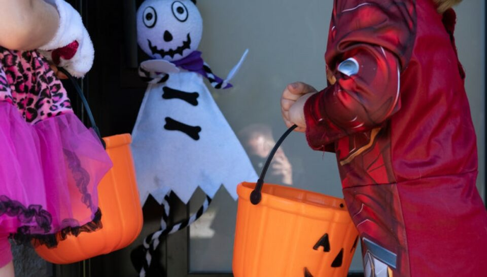
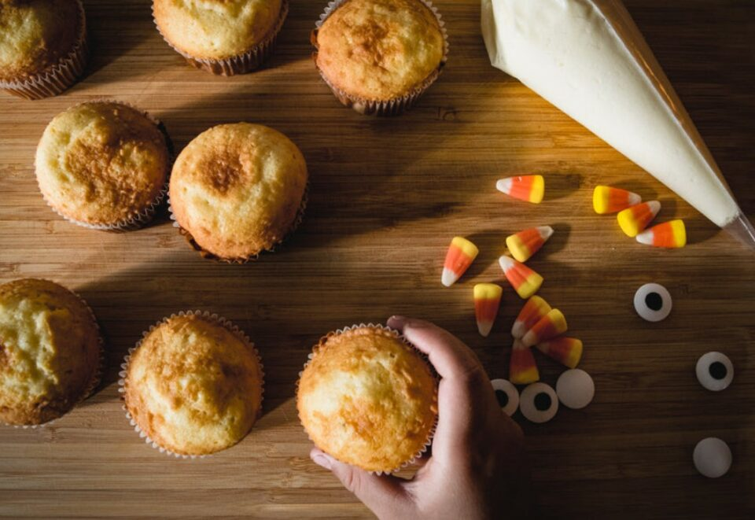
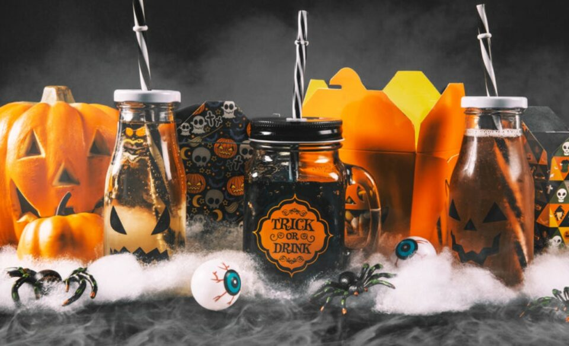
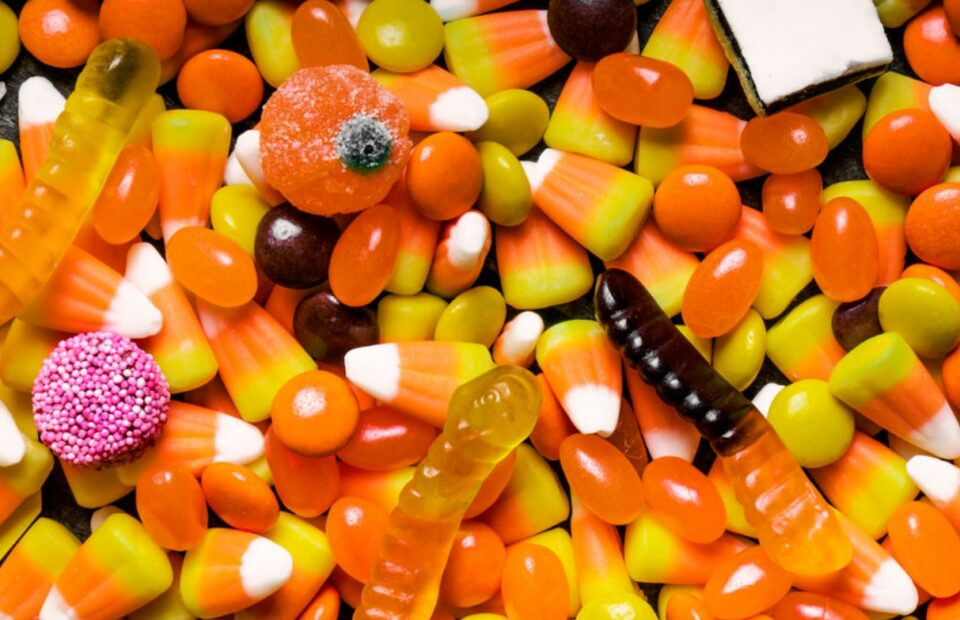
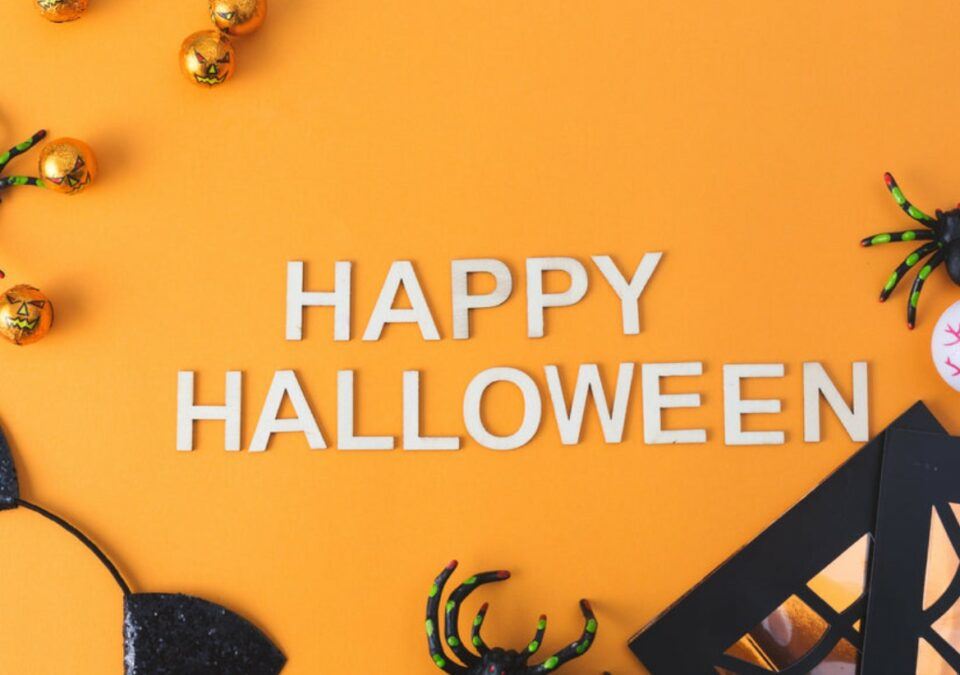
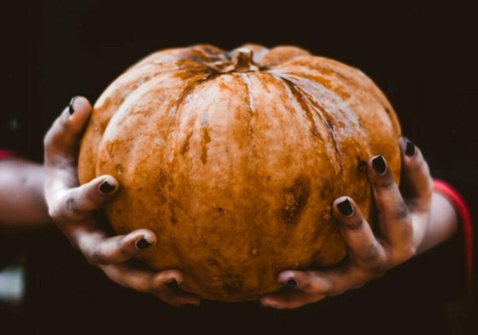

This article has been written and researched by our expert Loveable through a precise methodology. [Learn more about our methodology](https://avada.io/loveable/our-methodological.html)

[Loveable](https://avada.io/loveable/) > [Blog](https://avada.io/loveable/blog/) > [Holiday](https://avada.io/loveable/holiday/)

# Halfway to Halloween: Celebrating the Spookiest Time of the Year in June

Written by [Blake Simpson](https://avada.io/loveable/author/blake/) Last Updated on August 24, 2023

- [The Origins of Halfway to Halloween](https://avada.io/loveable/blog/halfway-to-halloween/#wp-block-heading-2-4)
- [Why Celebrate Halfway to Halloween in June?](https://avada.io/loveable/blog/halfway-to-halloween/#wp-block-heading-2-9)
- [5 Common Halfway to Halloween Traditions and Activities](https://avada.io/loveable/blog/halfway-to-halloween/#wp-block-heading-2-16)
    - [Costume Parties and Contests](https://avada.io/loveable/blog/halfway-to-halloween/#wp-block-heading-3-17)
    - [Haunted House Attractions and Tours](https://avada.io/loveable/blog/halfway-to-halloween/#wp-block-heading-3-20) 
    - [Halloween-Themed Movie Screenings and Marathons](https://avada.io/loveable/blog/halfway-to-halloween/#wp-block-heading-3-22) 
    - [Crafting and DIY Projects](https://avada.io/loveable/blog/halfway-to-halloween/#wp-block-heading-3-25) 
    - [Trick-or-Treating and Candy Exchanges](https://avada.io/loveable/blog/halfway-to-halloween/#wp-block-heading-3-27) 
- [Halfway to Halloween Decorations and Themes](https://avada.io/loveable/blog/halfway-to-halloween/#wp-block-heading-2-30)
    - [Spooky Summer Garden](https://avada.io/loveable/blog/halfway-to-halloween/#wp-block-heading-3-32) 
    - [Beachy Haunted Paradise](https://avada.io/loveable/blog/halfway-to-halloween/#wp-block-heading-3-34) 
    - [Wicked Picnic](https://avada.io/loveable/blog/halfway-to-halloween/#wp-block-heading-3-37) 
    - [Summer Carnival of Shadows](https://avada.io/loveable/blog/halfway-to-halloween/#wp-block-heading-3-41) 
    - [Moonlit Beach Bonfire](https://avada.io/loveable/blog/halfway-to-halloween/#wp-block-heading-3-44) 
- [Some Halfway to Halloween Community Events You May Like](https://avada.io/loveable/blog/halfway-to-halloween/#wp-block-heading-2-47) 
    - [“Halfway to Halloween” Parades](https://avada.io/loveable/blog/halfway-to-halloween/#wp-block-heading-3-50) 
    - [Haunted House Tours](https://avada.io/loveable/blog/halfway-to-halloween/#wp-block-heading-3-52)
    - [Costume Contests and Fashion Shows](https://avada.io/loveable/blog/halfway-to-halloween/#wp-block-heading-3-54) 
    - [Community Trick-or-Treating Events](https://avada.io/loveable/blog/halfway-to-halloween/#wp-block-heading-3-56)
    - [Charity Fundraisers and Volunteer Events](https://avada.io/loveable/blog/halfway-to-halloween/#wp-block-heading-3-58)
- [Halfway to Halloween FAQs](https://avada.io/loveable/blog/halfway-to-halloween/#wp-block-heading-2-61)
    - [Q1: Can I dress up in costumes for “Halfway to Halloween”?](https://avada.io/loveable/blog/halfway-to-halloween/#wp-block-heading-3-63)
    - [Q2: Are there any specific foods or treats associated with “Halfway to Halloween”?](https://avada.io/loveable/blog/halfway-to-halloween/#wp-block-heading-3-65)
    - [Q3: Can I host a “Halfway to Halloween” event for friends and family?](https://avada.io/loveable/blog/halfway-to-halloween/#wp-block-heading-3-67)
    - [Q4: Can “Halfway to Halloween” be celebrated outside of the United States?](https://avada.io/loveable/blog/halfway-to-halloween/#wp-block-heading-3-69)
    - [Q5: How can I make “Halfway to Halloween” memorable?](https://avada.io/loveable/blog/halfway-to-halloween/#wp-block-heading-3-71)
- [Bottom Line](https://avada.io/loveable/blog/halfway-to-halloween/#wp-block-heading-2-73) 

Picture a warm summer day, with the sun shining and flowers blooming all around. It feels far from the spooky, chilly vibes of Halloween, doesn’t it? But here’s the twist: imagine celebrating Halloween right in the middle of June. That’s what **“Halfway to Halloween”** is all about. 

It’s a peculiar and fascinating trend where Halloween lovers defy the calendar and bring the magic of Halloween to a surprising time of year. So, come with us as we explore this enchanting phenomenon. We’ll dive into the world where summer and spookiness mix, where the boundaries between seasons blur, and where you can experience the thrills of Halloween no matter what the calendar says. 

Get ready for a journey that bends time and invites us all to embrace the spookiest time of the year, even in the middle of summer.

## **The Origins of Halfway to Halloween**

The concept of “Halfway to Halloween” emerged from the deep-rooted traditions and history of Halloween itself. Halloween, originally rooted in ancient Celtic festivals like Samhain, has long been a celebration to honor the departed and ward off evil spirits. It has evolved into a beloved holiday, brimming with costumes, [spooky decorations](https://avada.io/loveable/halloween-party-decorations/), and the joy of trick-or-treating.

However, for passionate Halloween enthusiasts, waiting an entire year for the next October 31st became a challenge. The desire to experience the magic of Halloween more frequently sparked the idea of “Halfway to Halloween.” By celebrating Halloween in June, halfway through the year, these enthusiasts found a way to satisfy their craving for the eerie and fantastical elements of the holiday.

While it’s challenging to pinpoint the exact origins of this trend, “Halfway to Halloween” gained momentum through the enthusiastic Halloween community, particularly on social media platforms and online forums. As the concept spread, more and more people embraced the idea of celebrating Halloween in June, infusing their [unique traditions](https://avada.io/loveable/blog/halloween-traditions/) and events into the occasion.

## **Why Celebrate Halfway to Halloween in June?**

The question may arise: Why celebrate Halloween in June when its traditional date is on October 31st? The answer lies in the excitement and anticipation that Halloween brings and the unique opportunities it presents when celebrated halfway through the year.

- **Anticipation and Excitement**: By celebrating Halloween in June, enthusiasts can extend the joy of the holiday beyond its standard timeframe. It offers a chance to relish in the eerie atmosphere, dress up in costumes, and engage in spooky activities when Halloween feels distant.

- **Unique Events and Experiences**: “Halfway to Halloween” opens doors to various unique events and experiences that may not be available during the actual Halloween season. Since June is an unconventional time to celebrate Halloween, it encourages creative and innovative celebrations, such as outdoor haunted attractions, themed parties, and immersive experiences that blend the essence of summer with the spookiness of Halloween.

- **Escaping the Traditional Holiday Season**: Celebrating Halloween in June provides an opportunity to break away from the traditional holiday season dominated by end-of-year festivities. It offers a refreshing change of pace, allowing people to enjoy Halloween-themed activities and decorations without the crowded calendar and competing holiday events.

It keeps the spirit of Halloween alive throughout the year and offers a unique chance for Halloween enthusiasts to indulge in their love for all things creepy, even when the leaves haven’t started to fall.

## **5 Common Halfway to Halloween Traditions and Activities**

### **Costume Parties and Contests**

Embrace the spirit of “Halfway to Halloween” by hosting or attending costume parties and contests. Encourage guests to dress up in their favorite Halloween attire, whether it’s a classic monster, a mythical creature, or a unique character of their own creation. Award prizes for the most creative, spooky, or [humorous costumes](https://avada.io/loveable/funny-halloween-costumes/) to make the celebration even more exciting.

### **Haunted House Attractions and Tours** 

Seek out local haunted house attractions or organize haunted house tours specifically designed for the “Halfway to Halloween” celebration. Explore eerie corridors, encounter chilling scares, and immerse yourself in the world of the supernatural. These experiences can provide thrills and chills reminiscent of the Halloween season, offering a unique twist during the summer months.

### **Halloween-Themed Movie Screenings and Marathons** 

Gather friends and family for movie nights or marathons featuring Halloween-themed films. From beloved classics to spine-tingling horror movies, there is a vast selection to choose from. Create a cozy atmosphere with dim lighting, snacks, and Halloween decorations to enhance the movie-watching experience.

### **Crafting and DIY Projects** 

Tap into your creative side by engaging in [Halloween-themed crafting](https://avada.io/loveable/blog/easy-halloween-craft-ideas/) and DIY projects. Create handmade decorations, carve pumpkins, design spooky masks, or assemble your own haunted house props. The “Halfway to Halloween” celebration is an ideal time to unleash your artistic skills and bring the macabre beauty of Halloween to life.

### **Trick-or-Treating and Candy Exchanges** 

Recapture the joy of trick-or-treating by organizing a “Halfway to Halloween” candy exchange with friends, family, or neighbors. Dress up in costumes, go door-to-door, and share treats and goodies. It’s a fun and nostalgic way to relive the tradition of collecting sweets, even outside the traditional Halloween season.

These traditions and activities provide a taste of the Halloween experience during the “Halfway to Halloween” celebration. Whether it’s through dressing up, exploring haunted attractions, watching spooky movies, engaging in creative projects, or indulging in sweet treats, these activities allow Halloween enthusiasts to embrace the eerie enchantment of the holiday, no matter the time of year.

## **Halfway to Halloween Decorations and Themes**

When it comes to decorating for “Halfway to Halloween,” the possibilities are endless. You can infuse your space with a unique blend of Halloween vibes and summertime elements. Here are some ideas for decorations and themes to create an enchanting atmosphere.

### **Spooky Summer Garden** 

Imagine strolling through a [Spooky Summer Garden](https://www.finegardening.com/article/a-perfectly-spooky-garden), where vibrant flowers mingle with ghostly apparitions. Hang eerie lanterns from the branches, place skeletal figures among the blossoms, and scatter delicate spider webs for that extra touch of spookiness. Let the scent of flowers mix with the chill of Halloween, creating a unique ambiance that will mesmerize your guests.

### **Beachy Haunted Paradise** 

Embrace the beauty of the beach while adding a touch of the supernatural with a Beachy Haunted Paradise theme. Incorporate seashells, driftwood, and fishing netting into your decor, intertwining them with ghostly figures and skull-shaped [beach towels](https://avada.io/loveable/personalized-beach-towels/). 

Set up a haunted tiki bar, complete with [spooky cocktails](https://avada.io/loveable/blog/halloween-drinks/), and play haunting ocean sounds in the background. Your guests will feel transported to a mystical shoreline where the eerie and the relaxing intertwine.

### **Wicked Picnic** 

Plan a wickedly delightful picnic with a Halloween twist. Lay out a picnic blanket adorned with black and orange cushions, and set the scene with skull-shaped plates, bat-shaped cutlery, and ghostly napkins. 

Hang string lights or lanterns in nearby trees, casting a magical glow over your gathering. Scatter fake spiders or pumpkins around the area, adding that perfect touch of spookiness to your al fresco affair.

### **Summer Carnival of Shadows** 

Step right up to the Summer Carnival of Shadows, where the excitement of summer fun collides with the intrigue of a haunted carnival. 

Hang black and white striped curtains, set up a fortune-teller booth with tarot cards and crystal balls, and display creepy carnival masks. Serve popcorn in black and orange striped boxes, and offer twisted, circus-inspired treats that will leave your guests both intrigued and delightfully spooked.

### **Moonlit Beach Bonfire** 

Picture a Moonlit Beach Bonfire, where the warmth of the fire is only rivaled by the mystery of the night sky. Arrange cozy seating around the crackling flames and hang paper lanterns or floating candles above. 

Use white sheets or fabric to create ghostly figures swaying in the moonlight and play haunting music to add to the ambiance. It’s the perfect setting to share [ghost stories](https://avada.io/loveable/blog/best-halloween-stories/) and create memorable memories with friends and loved ones.

## **Some Halfway to Halloween Community Events You May Like** 

The “Halfway to Halloween” celebration isn’t just about individual festivities—it’s also a fantastic opportunity to connect with like-minded individuals and participate in community events. 

### **“Halfway to Halloween” Parades** 

Organize a lively parade where community members can showcase their creativity and embrace the spirit of Halloween in June. Encourage participants to dress up in their favorite costumes and decorated floats, and march through the streets, spreading joy and spookiness. 

### **Haunted House Tours**

Collaborate with local enthusiasts, haunted attractions, or historical sites to organize “Halfway to Halloween” haunted house tours. Offer guided tours through elaborately decorated spaces, where visitors can experience chilling scares and learn about the history of haunted locations in the area. This not only provides entertainment but also promotes local businesses and fosters community engagement.

### **Costume Contests and Fashion Shows** 

Host a costume contest or a Halloween-themed fashion show, inviting participants of all ages to showcase their imaginative costumes. Encourage creativity and award prizes for the most original, scariest, or funniest costumes. It’s a fantastic way to engage the community and appreciate the artistry that goes into creating Halloween ensembles.

### **Community Trick-or-Treating Events**

Bring back the joy of trick-or-treating by organizing community-wide “Halfway to Halloween” trick-or-treating events. Coordinate with local businesses, neighborhood associations, or community centers to create a safe and interesting environment for children and families to collect treats. 

### **Charity Fundraisers and Volunteer Events**

Use the “Halfway to Halloween” celebration as an opportunity to give back to the community. Organize charity fundraisers or volunteer events focused on Halloween-themed activities. For example, you can host a spooky-themed bake sale, donate funds or supplies to local shelters or organizations, or organize a volunteer-driven haunted house for a good cause. 

**You may also like:** _Best [Spook-tacular Halloween Gifts For Teens](https://avada.io/loveable/halloween-gifts-teens/) On This This Holiday_

## **Halfway to Halloween FAQs**

### **Q1: Can I dress up in costumes for “Halfway to Halloween”?**

A1: Absolutely! Dressing up in costumes is a popular way to celebrate “Halfway to Halloween.” Embrace your creativity and wear your favorite Halloween costume or try out a new one.

### **Q2: Are there any specific foods or treats associated with “Halfway to Halloween”?**

A2: There are no specific foods or treats exclusively tied to “Halfway to Halloween.” However, you can enjoy Halloween-themed treats such as pumpkin-flavored desserts, candy apples, or any spooky-inspired dishes of your choice.

### **Q3: Can I host a “Halfway to Halloween” event for friends and family?**

A3: Yes, hosting a “Halfway to Halloween” event is a fantastic idea. You can invite friends and family over for a themed gathering, incorporating decorations, activities, and Halloween-inspired food and drinks.

### **Q4: Can “Halfway to Halloween” be celebrated outside of the United States?**

A4: Absolutely! While Halloween is often associated with the United States, “Halfway to Halloween” celebrations can be enjoyed worldwide. People from different countries can embrace the holiday spirit and create their own unique traditions and events.

### **Q5: How can I make “Halfway to Halloween” memorable?**

A5: To make “Halfway to Halloween” memorable, embrace the spirit of the holiday. Get creative with decorations, costumes, and themed activities. Share the experience with loved ones and create lasting memories that celebrate the joy of Halloween all year round.

## **Bottom Line** 

**Halfway to Halloween** is a beloved celebration that allows Halloween enthusiasts to embrace the spookiness of the holiday in June. It brings together individuals and communities to indulge in costumes, decorations, and themed activities, fostering a sense of camaraderie and creativity. This unique event showcases the enduring appeal of Halloween and offers an opportunity for double the excitement each year.

- [The Origins of Halfway to Halloween](https://avada.io/loveable/blog/halfway-to-halloween/#wp-block-heading-2-4)
- [Why Celebrate Halfway to Halloween in June?](https://avada.io/loveable/blog/halfway-to-halloween/#wp-block-heading-2-9)
- [5 Common Halfway to Halloween Traditions and Activities](https://avada.io/loveable/blog/halfway-to-halloween/#wp-block-heading-2-16)
    - [Costume Parties and Contests](https://avada.io/loveable/blog/halfway-to-halloween/#wp-block-heading-3-17)
    - [Haunted House Attractions and Tours](https://avada.io/loveable/blog/halfway-to-halloween/#wp-block-heading-3-20) 
    - [Halloween-Themed Movie Screenings and Marathons](https://avada.io/loveable/blog/halfway-to-halloween/#wp-block-heading-3-22) 
    - [Crafting and DIY Projects](https://avada.io/loveable/blog/halfway-to-halloween/#wp-block-heading-3-25) 
    - [Trick-or-Treating and Candy Exchanges](https://avada.io/loveable/blog/halfway-to-halloween/#wp-block-heading-3-27) 
- [Halfway to Halloween Decorations and Themes](https://avada.io/loveable/blog/halfway-to-halloween/#wp-block-heading-2-30)
    - [Spooky Summer Garden](https://avada.io/loveable/blog/halfway-to-halloween/#wp-block-heading-3-32) 
    - [Beachy Haunted Paradise](https://avada.io/loveable/blog/halfway-to-halloween/#wp-block-heading-3-34) 
    - [Wicked Picnic](https://avada.io/loveable/blog/halfway-to-halloween/#wp-block-heading-3-37) 
    - [Summer Carnival of Shadows](https://avada.io/loveable/blog/halfway-to-halloween/#wp-block-heading-3-41) 
    - [Moonlit Beach Bonfire](https://avada.io/loveable/blog/halfway-to-halloween/#wp-block-heading-3-44) 
- [Some Halfway to Halloween Community Events You May Like](https://avada.io/loveable/blog/halfway-to-halloween/#wp-block-heading-2-47) 
    - [“Halfway to Halloween” Parades](https://avada.io/loveable/blog/halfway-to-halloween/#wp-block-heading-3-50) 
    - [Haunted House Tours](https://avada.io/loveable/blog/halfway-to-halloween/#wp-block-heading-3-52)
    - [Costume Contests and Fashion Shows](https://avada.io/loveable/blog/halfway-to-halloween/#wp-block-heading-3-54) 
    - [Community Trick-or-Treating Events](https://avada.io/loveable/blog/halfway-to-halloween/#wp-block-heading-3-56)
    - [Charity Fundraisers and Volunteer Events](https://avada.io/loveable/blog/halfway-to-halloween/#wp-block-heading-3-58)
- [Halfway to Halloween FAQs](https://avada.io/loveable/blog/halfway-to-halloween/#wp-block-heading-2-61)
    - [Q1: Can I dress up in costumes for “Halfway to Halloween”?](https://avada.io/loveable/blog/halfway-to-halloween/#wp-block-heading-3-63)
    - [Q2: Are there any specific foods or treats associated with “Halfway to Halloween”?](https://avada.io/loveable/blog/halfway-to-halloween/#wp-block-heading-3-65)
    - [Q3: Can I host a “Halfway to Halloween” event for friends and family?](https://avada.io/loveable/blog/halfway-to-halloween/#wp-block-heading-3-67)
    - [Q4: Can “Halfway to Halloween” be celebrated outside of the United States?](https://avada.io/loveable/blog/halfway-to-halloween/#wp-block-heading-3-69)
    - [Q5: How can I make “Halfway to Halloween” memorable?](https://avada.io/loveable/blog/halfway-to-halloween/#wp-block-heading-3-71)
- [Bottom Line](https://avada.io/loveable/blog/halfway-to-halloween/#wp-block-heading-2-73) 

### [Blake Simpson](https://avada.io/loveable/author/blake/)

Hi, I'm Blake from Loveable. I help people find perfect gifts for occasions like anniversaries and weddings. I also write a blog about holidays, sharing insights to make them more meaningful. Let's create unforgettable moments together!

- [Twitter](https://twitter.com/intent/tweet)
- [Facebook](https://www.facebook.com/sharer/sharer.php)
- [instagram](https://avada.io/loveable/blog/halfway-to-halloween/)
- [pinterest](https://www.pinterest.com/loveablellc/)

## Related Posts

[### 120+ Christian Birthday Wishes To Spread Your Love](https://avada.io/loveable/blog/christian-birthday-wishes/) 

[

### 35 Best 70th Birthday Ideas To Celebrate The Special Milestone

](https://avada.io/loveable/blog/70th-birthday-ideas/)

[

### 50 Best 30th Birthday Decorations for a Remarkable Birthday Bash

](https://avada.io/loveable/blog/30th-birthday-decorations/)

[

### 40 Delicious Vegan Christmas Desserts to Delight Your Palate

](https://avada.io/loveable/blog/vegan-christmas-desserts/)

[

### 60 Christmas Team Building Activities to Boost Workplace Spirit

](https://avada.io/loveable/blog/christmas-team-building-activities/)
