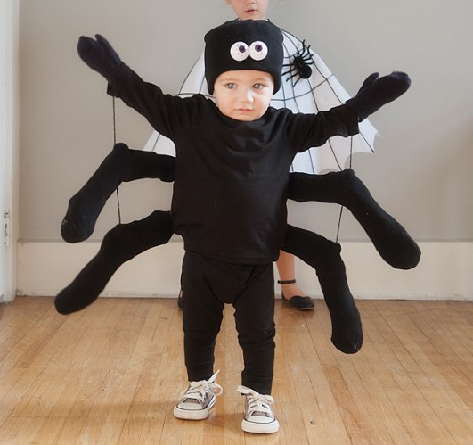

This article has been written and researched by our expert Loveable through a precise methodology. [Learn more about our methodology](https://avada.io/loveable/our-methodological.html)

[Loveable](https://avada.io/loveable/) > [Blog](https://avada.io/loveable/blog/) > [Holiday](https://avada.io/loveable/holiday/)

# Halloween Animals: Spooky Creatures, Costume And Decoration Ideas

Written by [Blake Simpson](https://avada.io/loveable/author/blake/) Last Updated on August 29, 2023

- [Halloween Animal Costume Ideas](https://avada.io/loveable/blog/halloween-animals/#wp-block-heading-2-3)
    - [1\. Fierce Feline](https://avada.io/loveable/blog/halloween-animals/#wp-block-heading-3-4)
    - [2\. Bewitching Bat](https://avada.io/loveable/blog/halloween-animals/#wp-block-heading-3-8)
    - [3\. Halloween Animal Mystical Owl](https://avada.io/loveable/blog/halloween-animals/#wp-block-heading-3-12)
    - [4\. Wicked Werewolf](https://avada.io/loveable/blog/halloween-animals/#wp-block-heading-3-17)
    - [5\. Halloween Animal Playful Panda](https://avada.io/loveable/blog/halloween-animals/#wp-block-heading-3-22)
    - [6\. Enchanting Unicorn](https://avada.io/loveable/blog/halloween-animals/#wp-block-heading-3-26)
    - [7\. Spooky Spider](https://avada.io/loveable/blog/halloween-animals/#wp-block-heading-3-31)
- [Creative Halloween Animal Decorations](https://avada.io/loveable/blog/halloween-animals/#wp-block-heading-2-35)
    - [1\. Spider Web Delights](https://avada.io/loveable/blog/halloween-animals/#wp-block-heading-3-36)
    - [2\. Halloween Animal Bewitching Owl Accents](https://avada.io/loveable/blog/halloween-animals/#wp-block-heading-3-39)
    - [3\. Bat-tastic Shadows](https://avada.io/loveable/blog/halloween-animals/#wp-block-heading-3-42)
    - [4\. Halloween Animal Enigmatic Cat Silhouettes](https://avada.io/loveable/blog/halloween-animals/#wp-block-heading-3-45)
    - [5\. Creature-inspired Pumpkins](https://avada.io/loveable/blog/halloween-animals/#wp-block-heading-3-48)
- [Halloween Animal Facts and Trivia](https://avada.io/loveable/blog/halloween-animals/#wp-block-heading-2-51)
    - [Bats and their Nightly Feats](https://avada.io/loveable/blog/halloween-animals/#wp-block-heading-3-53)
    - [Enigmatic Black Cats](https://avada.io/loveable/blog/halloween-animals/#wp-block-heading-3-56)
    - [Owls and their Wise Presence](https://avada.io/loveable/blog/halloween-animals/#wp-block-heading-3-58)
    - [Creepy Crawlies: Spiders and Their Webs](https://avada.io/loveable/blog/halloween-animals/#wp-block-heading-3-61)
    - [Wolves and their Haunting Howls](https://avada.io/loveable/blog/halloween-animals/#wp-block-heading-3-63) 
- [Halloween Animals, In Conclusion](https://avada.io/loveable/blog/halloween-animals/#wp-block-heading-2-66)

Welcome to the fascinating world of **Halloween Animals**! This guide is your gateway to a realm where spooky creatures, [mesmerizing Halloween costumes](https://avada.io/loveable/coolest-halloween-costumes/), and enchanting decorations come together to create an unforgettable Halloween experience. Halloween is a time filled with mystery and magic, urging us to embrace the supernatural and celebrate the creatures that both intrigue and give us a little fright. In this comprehensive guide, we invite you on an exciting journey through the realm of Halloween Animals, where your imagination can run wild and the spirit of the season comes to life.

Let’s dive into the first part of our exploration: the captivating world of Halloween animal costumes. Get ready to discover the incredible power of transformation as you [become a majestic black cat](https://avada.io/loveable/halloween-cat-costume-for-adults/), a haunting vampire bat, or an enigmatic owl. Each costume idea allows you to embody the essence of these creatures, tapping into their mythical allure and embracing their mysterious energy. Whether you choose to slip into a sleek black jumpsuit and paint your face with intricate cat features or spread your wings as a nocturnal bat, these costumes will transport you deep into the heart of Halloween magic.

## **Halloween Animal Costume Ideas**

### **1\. Fierce Feline**

Transform into a sleek and mysterious black cat this Halloween. Slip into a form-fitting black jumpsuit or dress that accentuates your feline grace. Paint a cute black nose and whiskers on your face using [face paint](https://avada.io/loveable/blog/halloween-face-paint-ideas/) or makeup. Complete the look by wearing a pointy cat ears headband or attaching faux fur ears to a headband. Don’t forget to add a swishy tail and slip into some sleek black shoes or boots. With your confident stride and mesmerizing gaze, you’ll embody the essence of a fierce feline prowling through the night.

**Check out:** [Cat Costume for Women](https://www.amazon.com/kids-cat-costumes-girls/s?k=kids+cat+costumes+for+girls)

### **2\. Bewitching Bat**

Embrace the darkness and take flight as a bewitching bat this Halloween. Start with an all-black ensemble, whether it’s a dress or a black top paired with black pants or leggings. Attach bat wings to your arms using elastic straps or harnesses to give the illusion of soaring through the night sky. Add some mystical touches with dark, smoky eye makeup, and accentuate your look with a pair of fangs to showcase your vampire bat persona. With your mysterious aura and haunting presence, you’ll captivate everyone around you.

**Check out:** [Bat Costume](https://www.amazon.com/cozy-bat-costume/s?k=cozy+bat+costume)

### **3\. Halloween Animal Mystical Owl**

Unleash your inner wisdom and grace with an enchanting owl-inspired costume. Begin with earth-toned clothes, such as shades of brown, beige, or green. You can layer a loose, flowy top or dress over leggings or tights. 

Enhance your look by wearing an owl mask or headpiece featuring intricate feathers and realistic eyes. Add feather accessories, such as a feathered necklace or wristbands, to evoke the magical spirit of these nocturnal creatures. With your air of mystery and elegance, you’ll capture the attention of all who encounter you.

**Check Out:** [Owl Costume](https://www.amazon.com/owl-costume/s?k=owl+costume)

### **4\. Wicked Werewolf**

Embody the untamed and ferocious spirit of a werewolf this Halloween. Start by wearing a pair of torn jeans or ripped clothing for a rugged look. Pair it with a shredded top or flannel shirt to emphasize your transformation. 

Apply makeup to create a hairy face, using shades of brown, gray, and black to mimic the appearance of fur. Complete your costume by wearing wolf ears and a snarling wolf mask. With your fierce gaze and primal energy, you’ll embody the power of the wolf and strike fear into the hearts of onlookers.

**Check Out:** [Wolf Costume](https://www.amazon.com/werewolf-costume/s?k=werewolf+costume)

### **5\. Halloween Animal Playful Panda**

Channel your adorable side with a playful panda costume. Start by wearing black and white attire, such as a black dress or a white top paired with black leggings or pants. Enhance your look by applying panda-inspired makeup with black eyeliner to create a cute button nose and some rosy cheeks. For the finishing touch, wear a panda mask or headband with cute panda ears. You can also add a black-and-white faux fur tail and accessorize with bamboo-themed accessories. With your charming demeanor and irresistible cuteness, you’ll be the life of the Halloween party.

**Check Out:** [Panda Costume](https://www.amazon.com/panda-costume/s?k=panda+costume)

### **6\. Enchanting Unicorn**

Begin by wearing pastel-colored clothes, such as a flowing dress or a sparkly top with a fluffy tulle skirt. Apply shimmery pastel makeup to your face and add a touch of glitter to accentuate your ethereal look. Create a unicorn horn using a cone-shaped headpiece or craft one with glittery foam or paper. 

Style your hair in loose waves or braids, and add rainbow-colored extensions or ribbons for a flowing mane effect. Complete your costume with rainbow accessories, [Halloween hairstyle](https://avada.io/loveable/blog/halloween-hairstyles/) and sparkly shoes. With your graceful presence and mystical charm, you’ll transport everyone to a realm of enchantment.

**Check Out:** [Unicorn Costume](https://www.amazon.com/unicorn-costume/s?k=unicorn+costume)

### **7\. Spooky Spider**

Embody the eerie elegance of a spider with a spooky spider costume. Start with a black outfit such as a black dress, top, or jumpsuit. Get creative by using fabric paint or white fabric markers to draw a spiderweb design on your clothing. Add spider legs or a spider headpiece to complete the creepy crawly look. Apply dark, smokey [eye makeup](https://avada.io/loveable/blog/halloween-eyeliner/) and draw on spider web-inspired patterns on your face for an extra touch of spookiness. With your haunting allure and mysterious movements, you’ll weave an atmosphere of intrigue and fascination wherever you go.

**Check out:** [Spider Costume](http://halloween%20spider%20costume)

## **Creative Halloween Animal Decorations**

### **1\. Spider Web Delights**

Transform your space into a haunted spider’s lair with intricate spider webs. Stretch faux spider webs across corners, [doorways](https://avada.io/loveable/blog/halloween-door-decorations/), and furniture, giving your home an eerie touch. Add plastic spiders for a spooky effect and hang large spider decorations from ceilings or walls. Your guests will feel a shiver down their spines as they enter your web-filled domain.

### **2\. Halloween Animal Bewitching Owl Accents**

Invite the wisdom and mystique of owls into your Halloween decor. Place owl figurines on shelves, mantels, or as table centerpieces. Look for owl-shaped candle holders, or opt for LED owl lights to add a touch of enchantment. Hang owl ornaments from branches or incorporate them into your wreaths. These majestic creatures will lend an air of mystery to your Halloween ambiance.

### **3\. Bat-tastic Shadows**

Create a spine-chilling atmosphere with bat-inspired decorations. Cut out bat silhouettes from black paper or cardstock, and stick them on walls, windows, or mirrors. Hang a swarm of paper bats from the ceiling using fishing line, allowing them to flutter in the breeze. Add bat-shaped lights or lanterns to cast eerie shadows. The sight of these creatures lurking in the darkness will send a delightful shiver down your guests’ spines.

### **4\. Halloween Animal Enigmatic Cat Silhouettes**

Embrace the enigmatic allure of black cats with silhouette decorations. Cut out cat shapes from black paper or cardstock and tape them to windows or walls. Place cat-shaped luminaries in your yard or along pathways, illuminating their mysterious presence. For an extra touch, add glowing cat eyes in bushes or trees to evoke a sense of otherworldly charm. These feline shadows will add a touch of magic to your Halloween decor.

### **5\. Creature-inspired Pumpkins**

Give your [pumpkin-carving](https://avada.io/loveable/blog/halloween-pumpkin/) skills a Halloween animal twist. Carve pumpkin designs inspired by black cats, owls, bats, or any other creature that captures your imagination. Use stencils or create your own templates to bring these animals to life on your pumpkins. Display them on your doorstep, windowsills, or as part of a spooky pumpkin patch in your Halloween display.

## **Halloween Animal Facts and Trivia**

Prepare to be fascinated as we uncover intriguing Halloween animal facts and trivia. Explore the captivating world of animals associated with Halloween and discover interesting tidbits about their behaviors, symbolism, and folklore. Let’s delve into some bewitching facts

### **Bats and their Nightly Feats**

Did you know that bats play a vital role in our ecosystem? Many species of bats are nocturnal, using echolocation to navigate and find their prey. Contrary to popular belief, bats are not blind. In fact, they have excellent eyesight, which helps them locate their favorite meals of insects and fruits. Bats are associated with Halloween due to their reputation as creatures of the night and their symbolic link to vampires in folklore.

### **Enigmatic Black Cats**

Black cats have been both feared and revered throughout history. In many cultures, they are considered a symbol of mystery and magic. During Halloween, black cats are often associated with witchcraft and superstitions. Contrary to superstitions, black cats bring good luck in many cultures, and they are cherished as beloved companions. These sleek and mysterious creatures have become an iconic symbol of Halloween.

### **Owls and their Wise Presence**

Owls have long been associated with wisdom and foresight. They possess incredible hearing and silent flight, making them skilled nocturnal hunters. Owls’ ability to rotate their heads up to 270 degrees adds to their air of mystery. In some cultures, hearing an owl’s hoot is believed to foretell a visit from spirits. Their presence during Halloween adds an aura of enchantment to the night.

### **Creepy Crawlies: Spiders and Their Webs**

Spiders are skilled weavers and architects, creating intricate and captivating webs to capture their prey. Halloween spider webs are often depicted as symbols of mystery and spooky aesthetics. Spiders themselves have a rich history in folklore, associated with witchcraft and transformation. Despite their eerie reputation, spiders play a vital role in maintaining the balance of insect populations in our ecosystems.

### **Wolves and their Haunting Howls** 

Wolves have long been regarded as majestic and powerful creatures. Their haunting howls echo through the night, evoking a sense of mystery and wilderness. In Halloween folklore, werewolves, humans who transform into wolves during the full moon, capture the imagination. Wolves symbolize the untamed spirit and the primal forces of nature, making them an intriguing addition to Halloween themes.

**_Related_:** Best [_Halloween Face Paint Ideas_](https://avada.io/loveable/halloween-face-paint-ideas/) for Every Style

## **Halloween Animals, In Conclusion**

In the realm of **Halloween Animals**, we discover a captivating world filled with mystery and enchantment. From the sleek black cats to the haunting owls, bats, spiders, and more, these creatures add a touch of magic to the Halloween season. Whether we embrace their essence through costumes, adorn our spaces with bewitching decorations, or explore their symbolism and folklore, Halloween Animals ignite our imagination and invite us to celebrate the wonders of the supernatural. So, let us immerse ourselves in this enchanting realm, embrace the spirit of Halloween Animals, and embark on a journey of fascination and wonder. Happy Halloween!

- [Halloween Animal Costume Ideas](https://avada.io/loveable/blog/halloween-animals/#wp-block-heading-2-3)
    - [1\. Fierce Feline](https://avada.io/loveable/blog/halloween-animals/#wp-block-heading-3-4)
    - [2\. Bewitching Bat](https://avada.io/loveable/blog/halloween-animals/#wp-block-heading-3-8)
    - [3\. Halloween Animal Mystical Owl](https://avada.io/loveable/blog/halloween-animals/#wp-block-heading-3-12)
    - [4\. Wicked Werewolf](https://avada.io/loveable/blog/halloween-animals/#wp-block-heading-3-17)
    - [5\. Halloween Animal Playful Panda](https://avada.io/loveable/blog/halloween-animals/#wp-block-heading-3-22)
    - [6\. Enchanting Unicorn](https://avada.io/loveable/blog/halloween-animals/#wp-block-heading-3-26)
    - [7\. Spooky Spider](https://avada.io/loveable/blog/halloween-animals/#wp-block-heading-3-31)
- [Creative Halloween Animal Decorations](https://avada.io/loveable/blog/halloween-animals/#wp-block-heading-2-35)
    - [1\. Spider Web Delights](https://avada.io/loveable/blog/halloween-animals/#wp-block-heading-3-36)
    - [2\. Halloween Animal Bewitching Owl Accents](https://avada.io/loveable/blog/halloween-animals/#wp-block-heading-3-39)
    - [3\. Bat-tastic Shadows](https://avada.io/loveable/blog/halloween-animals/#wp-block-heading-3-42)
    - [4\. Halloween Animal Enigmatic Cat Silhouettes](https://avada.io/loveable/blog/halloween-animals/#wp-block-heading-3-45)
    - [5\. Creature-inspired Pumpkins](https://avada.io/loveable/blog/halloween-animals/#wp-block-heading-3-48)
- [Halloween Animal Facts and Trivia](https://avada.io/loveable/blog/halloween-animals/#wp-block-heading-2-51)
    - [Bats and their Nightly Feats](https://avada.io/loveable/blog/halloween-animals/#wp-block-heading-3-53)
    - [Enigmatic Black Cats](https://avada.io/loveable/blog/halloween-animals/#wp-block-heading-3-56)
    - [Owls and their Wise Presence](https://avada.io/loveable/blog/halloween-animals/#wp-block-heading-3-58)
    - [Creepy Crawlies: Spiders and Their Webs](https://avada.io/loveable/blog/halloween-animals/#wp-block-heading-3-61)
    - [Wolves and their Haunting Howls](https://avada.io/loveable/blog/halloween-animals/#wp-block-heading-3-63) 
- [Halloween Animals, In Conclusion](https://avada.io/loveable/blog/halloween-animals/#wp-block-heading-2-66)

### [Blake Simpson](https://avada.io/loveable/author/blake/)

Hi, I'm Blake from Loveable. I help people find perfect gifts for occasions like anniversaries and weddings. I also write a blog about holidays, sharing insights to make them more meaningful. Let's create unforgettable moments together!

- [Twitter](https://twitter.com/intent/tweet)
- [Facebook](https://www.facebook.com/sharer/sharer.php)
- [instagram](https://avada.io/loveable/blog/halloween-animals/)
- [pinterest](https://www.pinterest.com/loveablellc/)

## Related Posts

[### 120+ Christian Birthday Wishes To Spread Your Love](https://avada.io/loveable/blog/christian-birthday-wishes/) 

[

### 35 Best 70th Birthday Ideas To Celebrate The Special Milestone

](https://avada.io/loveable/blog/70th-birthday-ideas/)

[

### 50 Best 30th Birthday Decorations for a Remarkable Birthday Bash

](https://avada.io/loveable/blog/30th-birthday-decorations/)

[

### 40 Delicious Vegan Christmas Desserts to Delight Your Palate

](https://avada.io/loveable/blog/vegan-christmas-desserts/)

[

### 60 Christmas Team Building Activities to Boost Workplace Spirit

](https://avada.io/loveable/blog/christmas-team-building-activities/)
