This article has been written and researched by our expert Loveable through a precise methodology. [Learn more about our methodology](https://avada.io/loveable/our-methodological.html)

[Loveable](https://avada.io/loveable/) > [Blog](https://avada.io/loveable/blog/) > [Holiday](https://avada.io/loveable/holiday/)

# Halloween in Japan – Everything You Need to Know

Written by [Blake Simpson](https://avada.io/loveable/author/blake/) Last Updated on August 24, 2023

- [Does Japan Celebrate Halloween?](https://avada.io/loveable/blog/halloween-in-japan/#wp-block-heading-2-4)
- [How Did Halloween Start in Japan?](https://avada.io/loveable/blog/halloween-in-japan/#wp-block-heading-2-9)
- [How to Spend Halloween in Japan](https://avada.io/loveable/blog/halloween-in-japan/#wp-block-heading-2-14)
- [Traditional Japanese Ghost and Spirit Beliefs](https://avada.io/loveable/blog/halloween-in-japan/#wp-block-heading-2-19)
- [Where to Buy Halloween Costumes in Japan?](https://avada.io/loveable/blog/halloween-in-japan/#wp-block-heading-2-27)
- [The Best Halloween Parties in Japan](https://avada.io/loveable/blog/halloween-in-japan/#wp-block-heading-2-34)
    - [Shibuya Crossing](https://avada.io/loveable/blog/halloween-in-japan/#wp-block-heading-3-36)
    - [Kawasaki Halloween Parade](https://avada.io/loveable/blog/halloween-in-japan/#wp-block-heading-3-41)
    - [Tokyo Disney Resort or Universal Studio Japan](https://avada.io/loveable/blog/halloween-in-japan/#wp-block-heading-3-45)
    - [Universal Studio Japan](https://avada.io/loveable/blog/halloween-in-japan/#wp-block-heading-3-49)
- [What to Eat at Halloween in Japan](https://avada.io/loveable/blog/halloween-in-japan/#wp-block-heading-2-54)
- [Halloween in Japan: What’s Different?](https://avada.io/loveable/blog/halloween-in-japan/#wp-block-heading-2-59)
    - [Tradition of trick-or-treating](https://avada.io/loveable/blog/halloween-in-japan/#wp-block-heading-3-61)
    - [Carved pumpkins](https://avada.io/loveable/blog/halloween-in-japan/#wp-block-heading-3-65)
    - [Japanese Halloween trains](https://avada.io/loveable/blog/halloween-in-japan/#wp-block-heading-3-69)
- [To Wrap up,](https://avada.io/loveable/blog/halloween-in-japan/#wp-block-heading-2-74)

Every year on October 31st, people worldwide participate in Halloween, a festive occasion where individuals dress up in frightening costumes and have a fantastic time. Japan, like other countries, embraces this tradition, and Halloween has gained immense popularity, especially since the inaugural Halloween party organized by Disneyland Tokyo in 2000. Nowadays, it stands as one of the largest events, commemorated annually on October 31st.

In Japan, Halloween exhibits some unique characteristics compared to other nations. While costumes and parties hold significant importance, the customary practice of trick-or-treating and various other [Halloween traditions](https://avada.io/loveable/blog/halloween-traditions/) are not widely observed. Instead, **Halloween in Japan** primarily resonates with adults who enjoy dressing up and engaging in revelry. 

However, numerous stores offer exclusive editions of their products and adorn their establishments with vibrant [Halloween decorations](https://avada.io/loveable/cool-halloween-decorations/). This article aims to provide insights on how you can make the most of Halloween in Japan! Keep reading!

## **Does Japan Celebrate Halloween?**

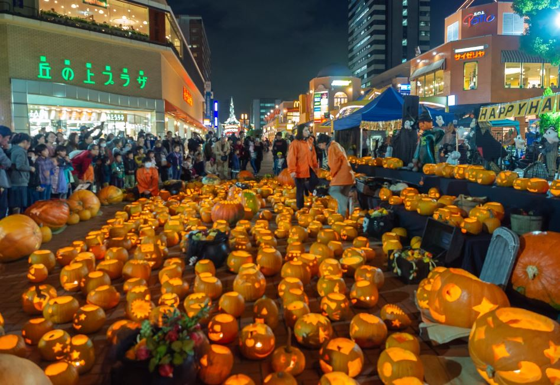

Yes, [Japan](https://avada.io/loveable/japanese-gifts/) does celebrate Halloween, although the way it is celebrated differs from other countries. Halloween has gained popularity in Japan over the years and has become a notable event on October 31st.

In Japan, Halloween is often associated with costume parties and dressing up in spooky attire. It is more popular among adults who enjoy embracing the festive spirit and attending Halloween-themed events. 

However, some aspects of Halloween commonly observed in other countries, such as trick-or-treating, may not be as prevalent in Japan. Instead, the focus is more on the visual aspects of the holiday, with stores offering limited edition Halloween-themed merchandise and colorful decorations adorning the streets.

## **How Did Halloween Start in Japan?**

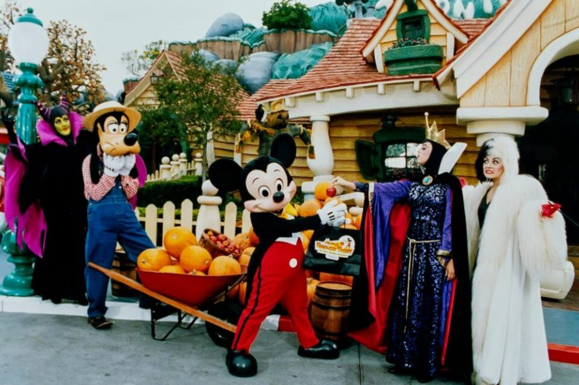

Halloween originated in Japan as a result of the influence of Western culture and the increasing popularity of American media. The introduction of Halloween in Japan can be traced back to the year 2000 when Disneyland Tokyo organized the first Halloween party. 

The event gained significant attention and gradually spread throughout the country, capturing the interest of the Japanese people. Over time, Halloween evolved into a vibrant and celebrated occasion, with costume parties, themed events, and decorations becoming prominent features. 

The enthusiasm for Halloween in Japan continues to grow, driven by the appeal of dressing up. It embraces the spooky atmosphere, and enjoying the festive spirit of the holiday.

## **How to Spend Halloween in Japan**

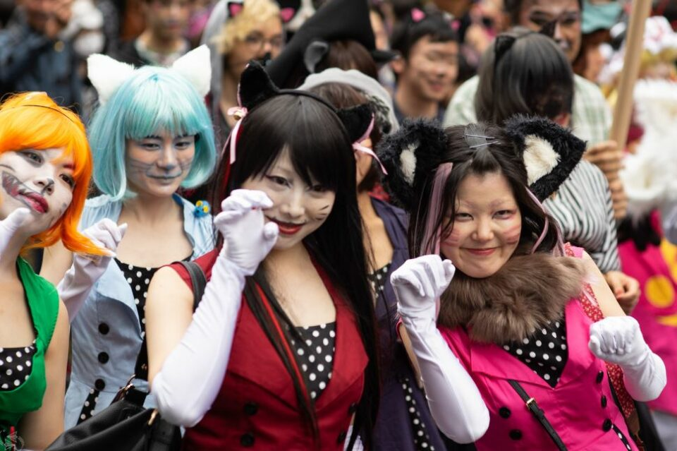

In Japan, Halloween is predominantly celebrated by adults who enjoy dressing up in costumes. While October 31st is the primary date for parties, various events are organized throughout September and October. Tokyo, Osaka, and Kanagawa are the main cities that host Halloween events, encompassing parties, flash mobs, and parades.

Halloween in Japan is typically spent with family or friends. Some individuals opt to hold home parties and invite their acquaintances. However, most people venture out and partake in parties held at nightclubs, bars, theme parks, or outdoor settings. The act of donning elaborate-themed costumes is a major highlight of these celebrations. And some individuals go all out by coordinating their clothing with matching accessories.

In educational institutions, particularly kindergartens and elementary schools, special events are frequently organized for children. These events often involve activities such as drawing Halloween-themed pictures, creating adorable costumes, or hosting parties featuring homemade treats and decorations.

## **Traditional Japanese Ghost and Spirit Beliefs**

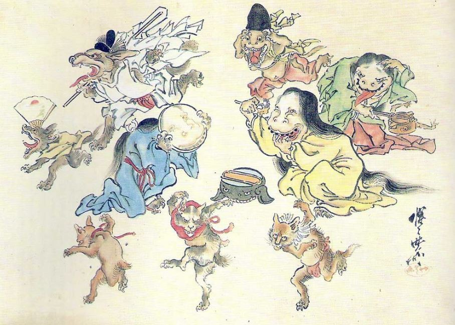

Traditional [Japanese folklore](https://en.wikipedia.org/wiki/Japanese_folklore#:~:text=Japanese%20folklore%20encompasses%20the%20informally,is%20used%20to%20describe%20folklore.) is replete with captivating tales of yokai, supernatural creatures, and yurei, vengeful spirits. These beliefs have been ingrained in Japanese culture for centuries. They inspire a fascination with the supernatural and contribute to the eerie themes often associated with Halloween.

Yokai, which translates to “bewitching apparitions,” encompasses a wide range of supernatural beings. From mischievous kitsune (fox spirits) to the iconic kappa (water-dwelling creatures), yokai are depicted as both playful and menacing entities. Yurei, on the other hand, represents restless spirits, often seeking vengeance or resolution for their untimely demise.

The presence of yokai and yurei in Japanese folklore aligns well with the spooky ambiance of Halloween. The rich and diverse pantheon of supernatural creatures provides ample inspiration for costumes and storytelling during Halloween festivities.

Before the introduction of Halloween itself, Japan already had its own traditions and festivals that exhibited Halloween-like elements. For example, the Obon festival, held in the summer, is a time when spirits are believed to return to the human realm. Families pay respects to their ancestors, light lanterns, and participate in Bon Odori dances. 

Additionally, Setsubun, celebrated in February, involves warding off evil spirits by throwing roasted soybeans and shouting “Oni wa soto, fuku wa uchi” (Out with demons, in with fortune).

These pre-existing traditions, with their supernatural themes and practices, resonate with the spirit of Halloween. They showcase the enduring fascination with the supernatural and the honoring of spirits, both of which contribute to the festive atmosphere surrounding Halloween in Japan today.

## **Where to Buy Halloween Costumes in Japan?**

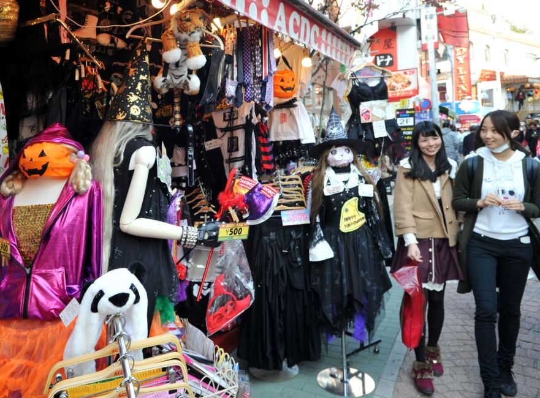

A wide variety of costumes can be observed during Halloween celebrations. Some individuals opt for traditional ensembles such as witches, wizards, ghosts, or mummies, while others prefer to showcase their love for manga or anime by dressing up as their favorite characters. 

Famous figures from TV shows, movies, and games like Minions, Super Mario, and Star Wars are also commonly depicted in costumes. It is worth noting that certain Halloween outfits tend to prioritize cuteness (kawaii) rather than scariness. Particularly in areas like Akihabara in Tokyo, known for its otaku culture, anime characters dominate the costume landscape, overshadowing traditional monsters.

Daiso and Donki (Don Quijote) are well-known stores where people can find a wide array of Halloween merchandise at affordable prices. Don Quijote, in particular, offers a diverse range of Halloween costumes both in-store and online. Tokyu Hands and Loft are additional retailers that offer various Halloween costumes and accessories. 

These stores also provide Halloween-themed makeup items to perfect your spooky appearance.

**_Related_**: [Baddie Halloween Costumes](https://avada.io/loveable/baddie-halloween-costumes/): Various Ideas From Maleficent to The Joker, Explore Iconic Looks

## **The Best Halloween Parties in Japan**

The primary cities that host Halloween events, encompassing parties, flash mobs, and parades, are Tokyo, Osaka, and Kanagawa.

### **Shibuya Crossing**

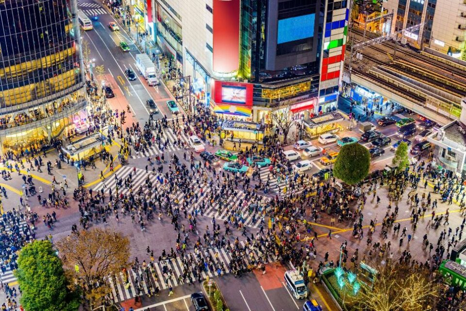

Tokyo, in particular, has witnessed a surge in Halloween’s popularity, particularly among young adults who congregate in public spaces like Shibuya Crossing to flaunt their costumes. A significant number of people gather at the crossing to partake in the festivities and revelry. It is a common sight to witness friends capturing memorable moments in photographs while donning astonishing costumes. 

Some opt to venture into nightclubs for parties, while others simply roam the area, immersing themselves in the vibrant atmosphere. The costumes worn during these celebrations range from impressive portrayals of [popular anime](https://avada.io/loveable/gifts-anime-lovers/) or manga characters to eerie monsters and more. 

Notably, recent years have been eventful, with television shows reporting on the lively chaos that ensues. Since a truck overturning incident in 2018, the Shibuya Crossing has been designated an alcohol-free zone during Halloween, necessitating caution in keeping alcoholic beverages out of sight.

### **Kawasaki Halloween Parade**

The Kawasaki Halloween Parade stands as one of Japan’s prominent Halloween events, having been organized in Kawasaki since the late 1990s and garnering immense popularity. With over 2,500 participants marching in the parade, the event attracts a substantial crowd of [Halloween enthusiasts](https://avada.io/loveable/gifts-halloween-lovers/), exceeding 100,000 partygoers each year. 

The city of Kawasaki adopts a festive ambiance during the Halloween Parade, with the entire month of October adorned with captivating decorations. In addition to the parade, various festivities take place, including movie marathons and fairs, further enhancing the celebratory atmosphere.

### **Tokyo Disney Resort or Universal Studio Japan**

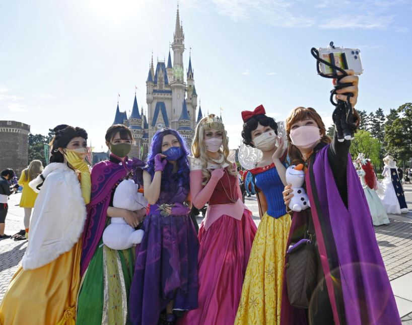

For a unique Halloween experience with your kids or partner, consider participating in special events or parades held at renowned theme parks like Tokyo Disney Resort or Universal Studio Japan. Tokyo Disney Resort, situated in Chiba Prefecture, holds the distinction of being Japan’s most visited theme park and offers thrilling activities suitable for all age groups. 

Disney’s Halloween festivities span from mid-September to the end of October, enchanting visitors with Halloween-themed parades, captivating shows, and other exciting events. As night falls, Disney’s beloved characters undergo spooky transformations, haunting the streets of Tokyo Disneyland and Tokyo DisneySea. Additionally, exclusive [Halloween-inspired food](https://avada.io/loveable/halloween-food-ideas/) items and merchandise are available, adding to the seasonal allure of the park.

### **Universal Studio Japan**

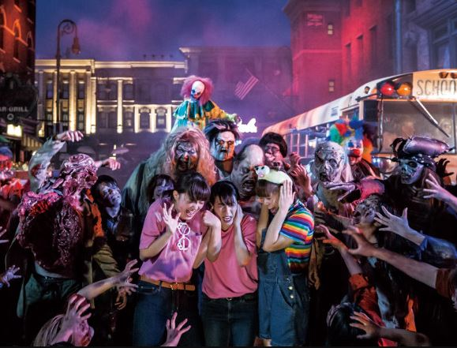

Situated in Osaka, Universal Studio Japan (USJ) is a well-known theme park that offers a thrilling experience, particularly suited for adults seeking an exhilarating adventure. One of the highlights is the Halloween Horror Nights season, featuring a range of spine-chilling events. 

Witness the Zombie de Dance and Street Zombies as terrifying undead creatures dominate the park’s streets. Brace yourself as these zombies relentlessly chase and frighten unsuspecting visitors. Moreover, popular rides and attractions, including Space Fantasy the Ride, undergo Halloween transformations, immersing guests in a captivatingly eerie atmosphere. 

Universal Studio Japan promises an unforgettable and adrenaline-pumping Halloween experience for those seeking a more intense thrill.

## **What to Eat at Halloween in Japan**

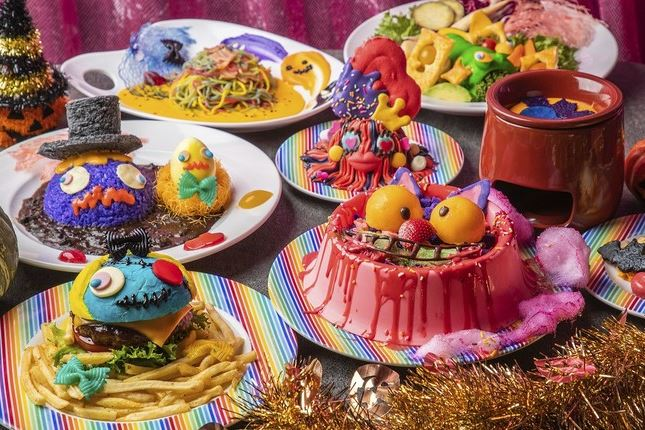

In Japan, pumpkins are primarily regarded as food items rather than mere decorations for Halloween. Their naturally sweet flavor lends itself well to various dishes, ranging from traditional Japanese cuisine to delectable sweets. Japanese pumpkins can be easily found at grocery stores at affordable prices. But if you’re specifically seeking an orange variety for carving, be prepared to pay a higher cost.

During the Halloween season, numerous shops seize the opportunity to release new products, catering to the competitive market. Many individuals are willing to splurge on these special limited-edition items. Whether it’s for hosting a party or indulging in a luxurious meal at home. 

It presents an ideal time for shops to launch themed products, resulting in an array of enticing Halloween treats such as cakes and sweets. Pumpkin tarts and pumpkin soup are particularly popular choices. And they can be relatively easy to prepare at home using simple ingredients.

## **Halloween in Japan: What’s Different?**

Just like any other cultural practice, Japan approaches Halloween differently compared to its own country. This is particularly noticeable if you come from the US, where Halloween holds significant importance. Before joining in the festivities in Japan, it’s worth noting a few aspects that differ.

### **Tradition of trick-or-treating**

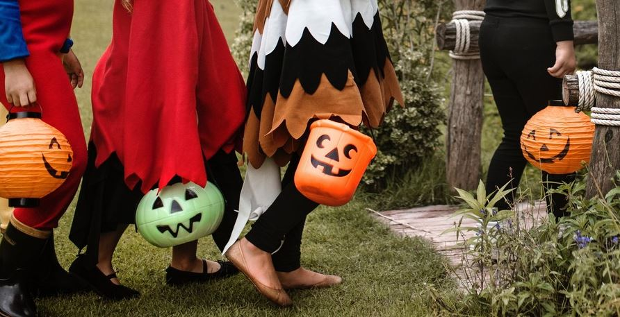

The tradition of trick-or-treating is not widely observed here. While Japan is undoubtedly one of the safest places to engage in such activities, it simply isn’t customary. 

The Japanese value the principle of avoiding any trouble or inconvenience to others. In fact, this concept is deeply ingrained in their culture, with a specific term, “meiwaku o kakeru” (迷惑をかける), emphasizing the avoidance of causing inconvenience to others. Therefore, it is important to be cautious and refrain from knocking on strangers’ doors. Otherwise, it will likely result in a mixture of confusion and concern.

### **Carved pumpkins**

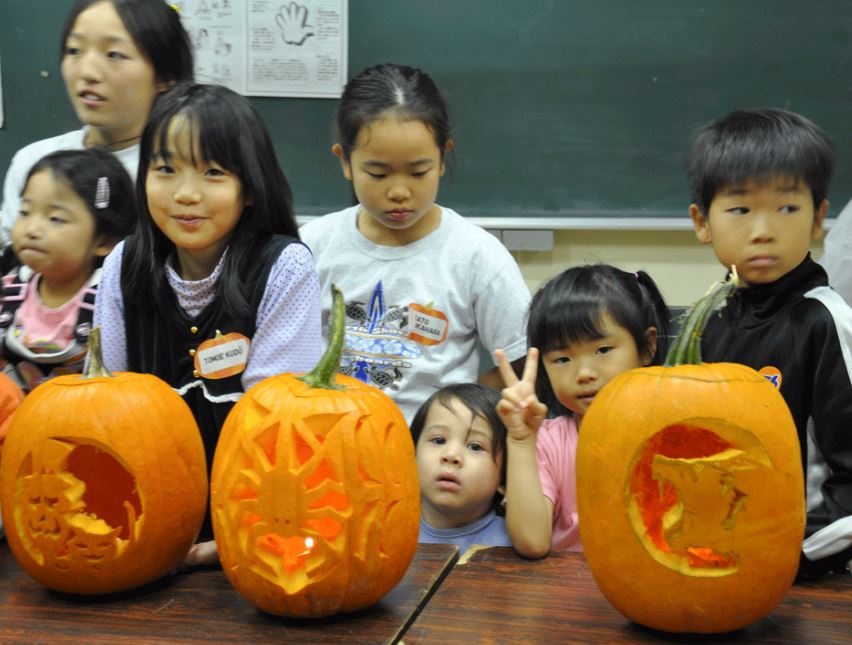

In Japan, carved pumpkins do not hold as much significance as they do in other countries. Since pumpkins are not a staple crop in Japan, the idea of carving them might seem unfamiliar, which is understandable. However, you might come across pumpkin painting as an alternative. 

While it may not be as common as pumpkin carving in countries like the USA or the UK, it adds an additional level of creativity to Halloween celebrations. If you’re interested, visiting local Aeon stores can be a treat. They often showcase impressive pumpkin displays in their Halloween-themed shop decorations.

### **Japanese Halloween trains**

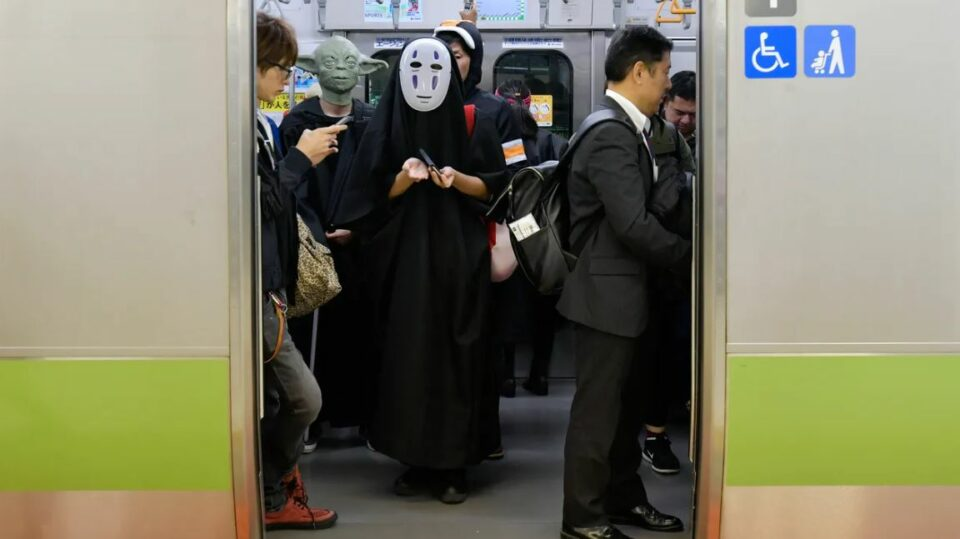

During Halloween, Japanese trains undergo a remarkable transformation. Normally known for their tranquility and calm, they become some of the wildest and most fashionable settings for celebrations.

This trend originated in the 1990s when groups of American expatriates began organizing Halloween parties on trains, albeit leaving behind significant cleanup tasks afterward. Presently, Halloween trains are more efficiently managed and even have dedicated websites where individuals can register to join in the fun.

Witnessing trains packed with zombies, vampires, and other frightening characters merrily commuting and reveling is a rare spectacle. It becomes even more peculiar when regular commuters find themselves standing amidst these extraordinary passengers.

## **To Wrap up,**

**Halloween in Japan** presents a unique blend of traditions and cultural adaptations. While it may differ from the grandeur of celebrations in other countries, Japan has embraced the essence of Halloween in its own distinctive way. 

From adult-focused costume parties and themed events in major cities to special activities for children in schools, the Japanese Halloween experience offers a fascinating cultural perspective. It’s important to be aware of certain customs, such as the absence of trick-or-treating and the preference for pumpkin painting over carving. 

Moreover, the sight of Halloween-themed trains filled with costumed passengers adds an exciting and unusual twist to the festivities. Overall, Halloween in Japan offers an intriguing blend of creativity, cultural nuances, and a touch of spookiness that sets it apart.

- [Does Japan Celebrate Halloween?](https://avada.io/loveable/blog/halloween-in-japan/#wp-block-heading-2-4)
- [How Did Halloween Start in Japan?](https://avada.io/loveable/blog/halloween-in-japan/#wp-block-heading-2-9)
- [How to Spend Halloween in Japan](https://avada.io/loveable/blog/halloween-in-japan/#wp-block-heading-2-14)
- [Traditional Japanese Ghost and Spirit Beliefs](https://avada.io/loveable/blog/halloween-in-japan/#wp-block-heading-2-19)
- [Where to Buy Halloween Costumes in Japan?](https://avada.io/loveable/blog/halloween-in-japan/#wp-block-heading-2-27)
- [The Best Halloween Parties in Japan](https://avada.io/loveable/blog/halloween-in-japan/#wp-block-heading-2-34)
    - [Shibuya Crossing](https://avada.io/loveable/blog/halloween-in-japan/#wp-block-heading-3-36)
    - [Kawasaki Halloween Parade](https://avada.io/loveable/blog/halloween-in-japan/#wp-block-heading-3-41)
    - [Tokyo Disney Resort or Universal Studio Japan](https://avada.io/loveable/blog/halloween-in-japan/#wp-block-heading-3-45)
    - [Universal Studio Japan](https://avada.io/loveable/blog/halloween-in-japan/#wp-block-heading-3-49)
- [What to Eat at Halloween in Japan](https://avada.io/loveable/blog/halloween-in-japan/#wp-block-heading-2-54)
- [Halloween in Japan: What’s Different?](https://avada.io/loveable/blog/halloween-in-japan/#wp-block-heading-2-59)
    - [Tradition of trick-or-treating](https://avada.io/loveable/blog/halloween-in-japan/#wp-block-heading-3-61)
    - [Carved pumpkins](https://avada.io/loveable/blog/halloween-in-japan/#wp-block-heading-3-65)
    - [Japanese Halloween trains](https://avada.io/loveable/blog/halloween-in-japan/#wp-block-heading-3-69)
- [To Wrap up,](https://avada.io/loveable/blog/halloween-in-japan/#wp-block-heading-2-74)

### [Blake Simpson](https://avada.io/loveable/author/blake/)

Hi, I'm Blake from Loveable. I help people find perfect gifts for occasions like anniversaries and weddings. I also write a blog about holidays, sharing insights to make them more meaningful. Let's create unforgettable moments together!

- [Twitter](https://twitter.com/intent/tweet)
- [Facebook](https://www.facebook.com/sharer/sharer.php)
- [instagram](https://avada.io/loveable/blog/halloween-in-japan/)
- [pinterest](https://www.pinterest.com/loveablellc/)

## Related Posts

[### 120+ Christian Birthday Wishes To Spread Your Love](https://avada.io/loveable/blog/christian-birthday-wishes/) 

[

### 35 Best 70th Birthday Ideas To Celebrate The Special Milestone

](https://avada.io/loveable/blog/70th-birthday-ideas/)

[

### 50 Best 30th Birthday Decorations for a Remarkable Birthday Bash

](https://avada.io/loveable/blog/30th-birthday-decorations/)

[

### 40 Delicious Vegan Christmas Desserts to Delight Your Palate

](https://avada.io/loveable/blog/vegan-christmas-desserts/)

[

### 60 Christmas Team Building Activities to Boost Workplace Spirit

](https://avada.io/loveable/blog/christmas-team-building-activities/)
