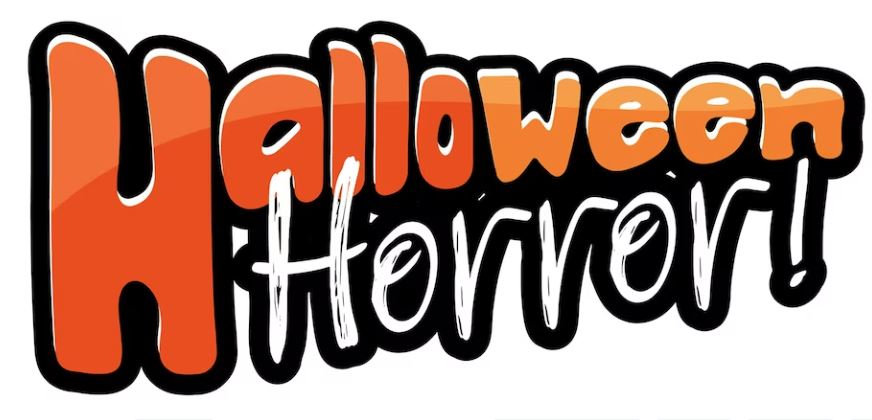

This article has been written and researched by our expert Loveable through a precise methodology. [Learn more about our methodology](https://avada.io/loveable/our-methodological.html)

[Loveable](https://avada.io/loveable/) > [Blog](https://avada.io/loveable/blog/) > [Holiday](https://avada.io/loveable/holiday/)

# Halloween Phrases, Sayings, and Quotes for Trick-or-Treating Fun in 2023

Written by [Blake Simpson](https://avada.io/loveable/author/blake/) Last Updated on September 12, 2023

- [Spooky quotes to set the mood](https://avada.io/loveable/blog/halloween-phrases-sayings-and-quotes/#wp-block-heading-2-4)
    - [Other quotes](https://avada.io/loveable/blog/halloween-phrases-sayings-and-quotes/#wp-block-heading-3-14)
    - [More…](https://avada.io/loveable/blog/halloween-phrases-sayings-and-quotes/#wp-block-heading-3-29)
- [Halloween phrases to greet guests](https://avada.io/loveable/blog/halloween-phrases-sayings-and-quotes/#wp-block-heading-2-40)
- [Scary Halloween Sayings](https://avada.io/loveable/blog/halloween-phrases-sayings-and-quotes/#wp-block-heading-2-65)
    - [Other sayings](https://avada.io/loveable/blog/halloween-phrases-sayings-and-quotes/#wp-block-heading-3-80)
- [Funny Halloween Phrases](https://avada.io/loveable/blog/halloween-phrases-sayings-and-quotes/#wp-block-heading-2-91)
- [Sweet Halloween Sayings](https://avada.io/loveable/blog/halloween-phrases-sayings-and-quotes/#wp-block-heading-2-120)
    - [More…](https://avada.io/loveable/blog/halloween-phrases-sayings-and-quotes/#wp-block-heading-3-139)
- [Final Words,](https://avada.io/loveable/blog/halloween-phrases-sayings-and-quotes/#wp-block-heading-2-157)

If you can’t wait to unleash your autumn-themed mats, towering twelve-foot skeletons, and eerie cemetery-themed lawn decorations even before the first leaves of fall, then creating the ultimate homemade costume and generously distributing king-sized candy bars to trick-or-treaters isn’t just a festive occasion, it’s your true passion. 

Quotations play a crucial role in Instagram [Halloween captions](https://avada.io/loveable/blog/halloween-captions/), photo books, treat bags, cards, and more. As the undeniable ruler of the Halloween season, you have a multitude of spooky tasks ahead. 

That’s why we’ve gathered [delightful Halloween quotes](https://avada.io/loveable/blog/halloween-quotes/) and amusing Halloween phrases for you to incorporate into your October endeavors!

## **Spooky quotes to set the mood**

If you’re seeking inspiration beyond mere Halloween catchphrases, explore the realms of literature, theater, and even [Halloween movies](https://avada.io/loveable/blog/best-halloween-movies/). Delve into these captivating sources to find a wealth of ideas that will elevate your Halloween experience. 

To help you on your quest, we’ve compiled a selection of entertaining quotes that evoke the eerie essence of the season. Get ready to feel a chill run down your spine as you immerse yourself in these Halloween-related quotes, adding an extra touch of thrill to your celebrations.

- Deep into the darkness peering, long I stood there, wondering, fearing, doubting, dreaming dreams no mortal ever dared to dream before.

The initial lines of Edgar Allan Poe’s “The Raven” are exquisite, evocative, and hauntingly atmospheric. The poem’s profound sense of existential dread and yearning for a lost love lends itself perfectly to establishing the eerie ambiance of Halloween. Allow these captivating verses to set the mood and immerse yourself in the spirit of the season.

- I would like, if I may, to take you on a strange journey.

During Halloween parties, it’s a common delight for many to indulge in watching and enthusiastically singing along to “The Rocky Horror Picture Show.” To warmly greet your guests at your own Halloween gathering, consider using this quote from the show.

- Where there is no imagination, there is no horror.

This precious jewel emerges from the brilliant mind and skillful pen of the mastermind behind Sherlock Holmes, Sir Arthur Conan Doyle. With his profound understanding of how to [ignite the imagination](https://avada.io/loveable/blog/halloween-drawing-ideas/) and craft an ambiance of suspense and enigma using a handful of carefully selected words, Doyle is an unrivaled authority in the realm of stirring storytelling.

### **Other quotes**

- Double, double toil and trouble; fire burn and cauldron bubble.

The timeless opening lines of William Shakespeare’s renowned play “Macbeth” not only establish the tone for the entire play but also shape our perception of the archetypal “witches.” Three enigmatic women huddled around a simmering cauldron filled with an enigmatic concoction – undeniably evoking a sense of witchcraft and sorcery. These iconic lines serve as a potent introduction that immerses us in a world of mystique and intrigue.

- A person should always choose a costume that is in direct contrast to her own personality.

Feeling uncertain about your Halloween costume choice? Seek some free guidance from Lucy Van Pelt, as depicted in the timeless classic “It’s The Great Pumpkin, Charlie Brown.”

- By the pricking of my thumbs, something wicked this way comes.

In yet another exceptional line from Shakespeare’s “Macbeth,” the master wordsmith proves his unparalleled ability to send a spine-tingling sensation cascading through your being. Shakespeare’s skill in crafting words that elicit a delicious shiver is truly remarkable.

- It’s as much fun to scare as to be scared.

The words of the legendary horror film actor Vincent Price perfectly encapsulate the essence of why Halloween is a delightful holiday for both children and adults alike.

- Shadows of a thousand years rise again unseen, and voices whisper in the trees, “Tonight is Halloween.”

Looking to kick off the festivities with something more evocative than a standard “Happy Halloween”? Channel the poetic words of Dexter Kozen and let these lines flow from your lips, casting a spell of enchantment and intrigue.

- When black cats prowl and pumpkins gleam, may luck be yours on Halloween

These captivating lines, penned by an anonymous author, truly encapsulate the essence of Halloween and shed light on the enchantment that surrounds this bewitching holiday.

### **More…**

- There is a child in every one of us who is still a trick-or-treater looking for a brightly-lit front porch. 

Although Halloween brings joy to adults as well, author Robert Brault is right in suggesting that there’s a particular reason why children tend to revel in Halloween even more.

- Darkness falls across the land, the Midnight Hour is close at hand.

When it comes to Vincent Price, he famously uttered this iconic quote from the timeless Halloween anthem, “Thriller” by Michael Jackson.

- Abandon hope all ye who enter here

As Dante Alighieri himself placed this quote as the inscription on the gate of hell, why not embrace its ominous power by using it to welcome guests this Halloween? Consider placing it on a sign above your [Halloween door](https://avada.io/loveable/blog/halloween-door-decorations/), casting an eerie and intriguing aura to those who dare to enter.

- I’m a homicidal maniac, they look just like everyone else

Wednesday Addams is undeniably an icon, making her an excellent choice for a Halloween costume. As you embody her character, be sure to master some of her “killer” lines, such as this unforgettable one.

- We came, we saw, we kicked its ass.

When it comes to Halloween festivities, incorporating a touch of “Ghostbusters” is always a winning choice. Whether it’s watching the iconic movie, playing the catchy theme song, or even donning the attire of one of the beloved heroes, you can’t go wrong. This particular line comes from the witty Dr. Peter Venkman, brilliantly portrayed by Bill Murray.

## **Halloween phrases to greet guests**

Searching for alternative responses to the classic “Trick or Treat” calls? If you’re seeking different Halloween phrases to use instead of just saying “Happy Halloween,” give these suggestions a try.

Planning to host a Halloween party for grown-ups? Welcome your guests at the entrance in your most impressive costume while using these Halloween catchphrases.

- Have a spookily good Halloween!
- Ghostly Greetings!
- Eat, drink, and be scary!
- Halloween is a real treat
- Happy Haunting!
- Wishing you a night full of frights and a bag full of delights!
- Stop in for a spell.
- Witches and mummies and ghosts, oh my!
- We’ll have a spooky good time.
- Sit for a spell and enjoy a brew!
- It’s the most frightful time of the year!
- I put a spell on you.
- Enter if you dare, foolish mortals.
- Have a fang-tastic night
- Have a bootiful Halloween!
- Welcome to your nightmare.
- Pick your poison. (when offering drinks or snacks)
- I witch you a Happy Halloween
- May tonight be the darkest, scariest night of the year!
- Boo to you from our crew
- Drink up, witches!

## **Scary Halloween Sayings**

Whether you’re looking to add an eerie touch to your party invitations, create a spine-tingling atmosphere, or simply indulge in the macabre spirit of the season, these scary sayings are sure to invoke a sense of fear and excitement. 

So, gather your courage and delve into the darkness as we unveil a compilation of unsettling words that will leave you haunted long after the moon sets on All Hallows’ Eve.

- “There is something at work in my soul, which I do not understand.” —Mary Shelley, Frankenstein
- “Hell is empty and all the devils are here.” —William Shakespeare
- “Never trust anything that can think for itself if you can’t see where it keeps its brain.” —J.K. Rowling
- “The universe is full of magical things patiently waiting for our wits to grow sharper.” —Eden Phillpots
- “Believe nothing you hear, and only half of what you see.” —Edgar Allen Poe
- “Where there is no imagination, there is no horror.” —Arthur Conan Doyle
- “I am all in a sea of wonders. I doubt; I fear; I think strange things, which I dare not confess to my own soul.” —Bram Stoker
- “It’s all just a bunch of hocus pocus!” —Max, Hocus Pocus
- “We make up horrors to help us cope with the real ones.” —Stephen King
- “I love Halloween, and I love that feeling: the cold air, the spooky dangers lurking around the corner.” —Evan Peters

### **Other sayings**

- “Something wicked this way comes.” —William Shakespeare
- “It’s Halloween, everyone’s entitled to one good scare.” —Brackett
- “I would like, if I may, to take you on a strange journey.” —The Criminologist, The Rocky Horror Picture Show
- “It’s as much fun to scare as to be scared.” —Vincent Price
- “When black cats prowl and pumpkins gleam, may luck be yours on Halloween.” —Unknown
- “Be afraid … Be very afraid.” —Ronnie, The Fly
- “There is something haunting in the light of the moon.” —Joseph Conrad
- “Werewolves howl. Phantoms prowl. Halloween’s upon us now.” —Richelle E. Goodrich
- “Trick or treat, bag of sweets, ghosts are walking down the street.” —Unknown
- “Shadows of a thousand years rise again unseen. Voices whisper in the trees, ‘Tonight is Halloween!'” —Dexter Kozen

## **Funny Halloween Phrases**

- Werewolves are fur real
- Vampires drive me batty
- Vampires know how to have a bloody good time
- Ghouls just want to have fun
- Join our Coven 
- Hope all the candies don’t go to waste
- Zombies love a girl with brains
- If you’ve got it, haunt it
- Ghosts were people too
- It’s a boo-tiful night for Halloween
- Ghastly greetings
- Witches welcome
- Got treats?
- Happy Howl-oween!
- I want my mummy
- Ghosts don’t give a sheet
- A real witch in disguise
- Let the ghoul times roll
- I’m just here for the boo’s
- Teamwork makes the scream work
- May our best witches go with you!
- If you’ve never carved a pumpkin, you don’t know Jack
- I boo believe in ghosts
- A haunting we will go
- Vampires party all night
- I love Halloween so much, it’s scary
- Let’s have a skele-ton of fun!

## **Sweet Halloween Sayings**

- “I’m so glad I live in a world where there are Octobers.” —L. M. Montgomery
- “For some of us, Halloween is everyday.” —Tim Burton
- “I’ll stop wearing black when they make a darker color.” —Wednesday Addams, The Addams Family
- “Clothes make a statement. Costumes tell a story.”—Mason Cooley
- “The cobwebs in my house just became my decorations!” —Unknown 
- “Some people are born for Halloween, and some are just counting the days until Christmas.” —Stephen Graham Jones
- “When black cats prowl and pumpkins gleam, may luck be yours on Halloween.” —Unknown
- “The farther we’ve gotten from the magic and mystery of our past, the more we’ve come to need Halloween.” —Paula Guran
- “I witch you a Happy Halloween.” —Unknown
- “Magic is really very simple, all you’ve got to do is want something and then let yourself have it.” –Aggie Cromwell, Halloweentown
- “Wishing you a spook-tacular Halloween!” —Unknown 
- “A mask tells us more than a face.” —Oscar Wilde
- “Hope you don’t have a scare in the world this Halloween!” —Unknown
- “A grandmother pretends she doesn’t know who you are on Halloween.” —Emma Bombeck
- “During the day, I don’t believe in ghosts. At night, I’m a little more open-minded.” —Unknown
- “Keep calm and scary on.” —Unknown 

### **More…**

- “October brings crisp, cool nights and Halloween frights.” —Unknown
- “May your candy supply last you well into the Christmas season.” —Unknown
- “Eat, drink and be scary!” —Unknown
- “The only thing we have to fear is fear itself…and spiders.” —Unknown
- “Halloween is the only time I can easily convince others that my children are monsters.” —Unknown 
- “Wishing you a spooky good October and a fang-tastic Halloween!” —Unknown
- “If the broom fits, ride it!” —Unknown
- “A candy a day keeps the monsters away.” —Unknown 
- “There is a child in every one of us who is still a trick-or-treater looking for a brightly-lit front porch.” —Robert Brault
- “On Halloween, you get to become anything that you want to be.” —Ava Dellaria
- “We have had our summer evenings, now for October eves!” —Humbert Wolfe
- “This witch can be bribed with chocolate.” —Unknown
- “Have you come to sing pumpkin carols?” —Linus, It’s the Great Pumpkin, Charlie Brown
- “Ghosts and goblins come to play on October’s final day!” —Rusty Fischer

**_See More_**:

- 99 [Halloween Pickup Lines](https://avada.io/loveable/blog/halloween-pickup-lines/)

- 17 [_Halloween Symbols_](https://avada.io/loveable/halloween-symbols-explained/) Explained in Detail – Unveiling the Mysteries

## **Final Words,**

As we conclude this compilation of **Halloween phrases, sayings, and quotes**, we hope you’ve found inspiration and excitement for the upcoming trick-or-treating festivities. From classic lines by literary masters like Shakespeare and Poe to memorable quotes from movies and iconic characters, these words are here to add a touch of enchantment and a spine-tingling atmosphere to your Halloween celebrations.

Whether you’re seeking the perfect Instagram caption, a greeting for your Halloween party, or simply looking to immerse yourself in the spirit of the holiday, these phrases offer a delightful range of options. 

Remember to embrace the cultural diversity of Halloween by exploring how different countries and cultures celebrate, enriching your understanding and fostering connections!

- [Spooky quotes to set the mood](https://avada.io/loveable/blog/halloween-phrases-sayings-and-quotes/#wp-block-heading-2-4)
    - [Other quotes](https://avada.io/loveable/blog/halloween-phrases-sayings-and-quotes/#wp-block-heading-3-14)
    - [More…](https://avada.io/loveable/blog/halloween-phrases-sayings-and-quotes/#wp-block-heading-3-29)
- [Halloween phrases to greet guests](https://avada.io/loveable/blog/halloween-phrases-sayings-and-quotes/#wp-block-heading-2-40)
- [Scary Halloween Sayings](https://avada.io/loveable/blog/halloween-phrases-sayings-and-quotes/#wp-block-heading-2-65)
    - [Other sayings](https://avada.io/loveable/blog/halloween-phrases-sayings-and-quotes/#wp-block-heading-3-80)
- [Funny Halloween Phrases](https://avada.io/loveable/blog/halloween-phrases-sayings-and-quotes/#wp-block-heading-2-91)
- [Sweet Halloween Sayings](https://avada.io/loveable/blog/halloween-phrases-sayings-and-quotes/#wp-block-heading-2-120)
    - [More…](https://avada.io/loveable/blog/halloween-phrases-sayings-and-quotes/#wp-block-heading-3-139)
- [Final Words,](https://avada.io/loveable/blog/halloween-phrases-sayings-and-quotes/#wp-block-heading-2-157)

### [Blake Simpson](https://avada.io/loveable/author/blake/)

Hi, I'm Blake from Loveable. I help people find perfect gifts for occasions like anniversaries and weddings. I also write a blog about holidays, sharing insights to make them more meaningful. Let's create unforgettable moments together!

- [Twitter](https://twitter.com/intent/tweet)
- [Facebook](https://www.facebook.com/sharer/sharer.php)
- [instagram](https://avada.io/loveable/blog/halloween-phrases-sayings-and-quotes/)
- [pinterest](https://www.pinterest.com/loveablellc/)

## Related Posts

[### 120+ Christian Birthday Wishes To Spread Your Love](https://avada.io/loveable/blog/christian-birthday-wishes/) 

[

### 35 Best 70th Birthday Ideas To Celebrate The Special Milestone

](https://avada.io/loveable/blog/70th-birthday-ideas/)

[

### 50 Best 30th Birthday Decorations for a Remarkable Birthday Bash

](https://avada.io/loveable/blog/30th-birthday-decorations/)

[

### 40 Delicious Vegan Christmas Desserts to Delight Your Palate

](https://avada.io/loveable/blog/vegan-christmas-desserts/)

[

### 60 Christmas Team Building Activities to Boost Workplace Spirit

](https://avada.io/loveable/blog/christmas-team-building-activities/)
