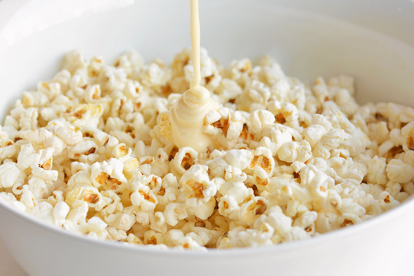
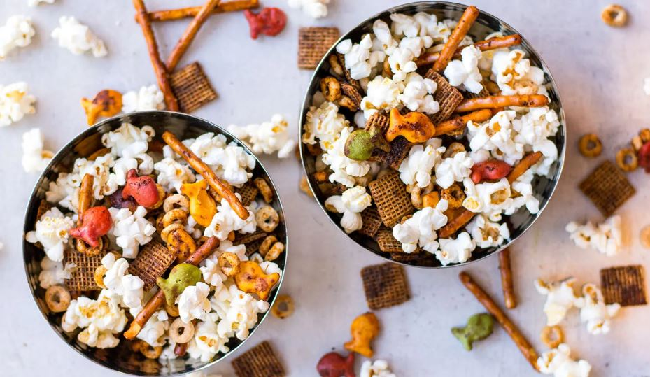

This article has been written and researched by our expert Loveable through a precise methodology. [Learn more about our methodology](https://avada.io/loveable/our-methodological.html)

[Loveable](https://avada.io/loveable/) > [Blog](https://avada.io/loveable/blog/) > [Holiday](https://avada.io/loveable/holiday/)

# Halloween Popcorn Balls: How to Make A Fun and Festive Treat

Written by [Blake Simpson](https://avada.io/loveable/author/blake/) Last Updated on September 19, 2023

- [Halloween Popcorn Balls are a Festive Treat](https://avada.io/loveable/blog/halloween-popcorn-balls/#wp-block-heading-2-3)
- [Ingredients for Halloween Popcorn Balls](https://avada.io/loveable/blog/halloween-popcorn-balls/#wp-block-heading-2-7)
- [How to Make Halloween Popcorn Balls](https://avada.io/loveable/blog/halloween-popcorn-balls/#wp-block-heading-2-15)
- [Some Variation Ideas for Halloween Popcorn Balls](https://avada.io/loveable/blog/halloween-popcorn-balls/#wp-block-heading-2-42)
- [How to Decorate Halloween Popcorn Balls](https://avada.io/loveable/blog/halloween-popcorn-balls/#wp-block-heading-2-53)
- [Storage Tips](https://avada.io/loveable/blog/halloween-popcorn-balls/#wp-block-heading-2-63)
- [In Conclusion,](https://avada.io/loveable/blog/halloween-popcorn-balls/#wp-block-heading-2-72)

**Halloween Popcorn Balls** are a delightful blend of traditional popcorn, mini candy corn, and seasonal sprinkles, perfect for [popcorn lovers](https://avada.io/loveable/gifts-for-popcorn-lovers/), creating a spooktacular treat that perfectly captures the essence of the Halloween season! If you’re in search of a fun and easy Halloween-inspired delicacy, look no further than these festive popcorn balls.

Crafting these Halloween Popcorn Balls is a relatively simple process, though it does involve boiling sugar. It’s best to have the little ones join in the fun once the mixture has cooled sufficiently to handle. Rest assured, rolling and decorating these charming popcorn balls will provide endless entertainment for the entire family!

## **Halloween Popcorn Balls are a Festive Treat**

Halloween popcorn balls are the epitome of a festive treat, offering a delightful combination of flavors and a touch of spookiness. What makes them truly special is the fun and creative aspect of making them. From the moment you start mixing the ingredients to rolling and decorating the popcorn balls, it’s a joyful experience that allows your imagination to run wild. 

You can add colorful sprinkles and mini candy eyes or even shape them into spooky designs. The process brings out the inner artist in everyone, as you transform plain popcorn into whimsical and delicious creations. Whether you’re making them with friends, or family, or for a Halloween party, the creative journey of crafting these popcorn balls is guaranteed to bring laughter and smiles to all.

## **Ingredients for Halloween Popcorn Balls**

**1\. Popcorn (popped and unsalted)**

**2\. Marshmallows (regular or flavored)**

**3\. Butter or margarine**

**4\. Optional additions (e.g., food coloring, candy, sprinkles)**

To create delightful Halloween popcorn balls, you’ll need a handful of key ingredients. Start with popped and unsalted popcorn as the base. Next, gather regular or flavored marshmallows, which act as the binding agent for the popcorn balls. Butter or margarine adds a rich and smooth texture to the mixture. 

For an extra touch of creativity, consider optional additions like food coloring to make the popcorn balls vibrant, along with candies or sprinkles to enhance the Halloween theme. These simple yet essential ingredients come together to create a delicious and visually appealing treat that embodies the spirit of Halloween.

## **How to Make Halloween Popcorn Balls**

Creating Halloween Popcorn Balls is a delightful process that involves several steps. Here’s a breakdown of each step in detail:

**1\. Popping the popcorn**

   – Pop a sufficient amount of popcorn according to your desired quantity of popcorn balls.

   – Ensure the popcorn is unsalted for better flavor balance.

**2\. Preparing the marshmallow mixture**

   – In a large microwave-safe bowl, melt butter or margarine.

   – Add regular or flavored marshmallows to the melted butter.

   – Microwave the mixture in short intervals, stirring in between until the marshmallows are completely melted and smooth.

**3\. Combining popcorn and marshmallow mixture**

   – Pour the melted marshmallow mixture over the popped popcorn.

   – Using a spatula or greased hands, gently fold and stir the popcorn, ensuring it is evenly coated with the marshmallow mixture.

   – Continue mixing until all the popcorn is well coated.

**4\. Shaping the popcorn balls**

   – Allow the mixture to cool slightly until it is safe to handle but still pliable.

   – Grease your hands with butter or cooking spray to prevent sticking.

   – Take a handful of the coated popcorn and shape it into a ball, compressing it firmly.

   – Repeat the process with the remaining mixture to form popcorn balls of the desired size.

**5\. Adding optional decorations**

   – If desired, incorporate additional decorations to enhance the Halloween theme. This could include food coloring to tint the popcorn balls or adding small candies, sprinkles, or edible eyes to create spooky designs.

   – Gently press the decorations onto the popcorn balls while they are still sticky from the marshmallow mixture.

[Check out the video of the tutorial!](https://www.youtube.com/watch?v=Ed_IxgEi-v0)

## **Some Variation Ideas for Halloween Popcorn Balls**

- Using colored candy melts for Halloween-themed popcorn balls
- Adding candy eyeballs or Halloween-themed sprinkles
- Incorporating seasonal flavors like pumpkin spice or cinnamon

When it comes to making Halloween popcorn balls, there is no shortage of variation ideas to add creativity and flavor to your treats. Consider these exciting suggestions:

For Halloween-themed popcorn balls, try using colored candy melts. Melt candy melts in vibrant shades like orange, purple, or green and drizzle them over the popcorn balls for a visually striking appearance. You can also dip the popcorn balls partially in the melted candy for a more immersive color experience.

To enhance the spooky factor, add candy eyeballs or Halloween-themed sprinkles. Press candy eyeballs onto the popcorn balls to give them an eerie look. Sprinkling Halloween-themed sprinkles over the popcorn balls adds a festive touch, texture, and flavor.

For a taste of the season, incorporate seasonal flavors like pumpkin spice or cinnamon. Mix pumpkin spice or cinnamon into the melted marshmallow mixture to infuse the popcorn balls with warm and aromatic flavors. For an extra touch, dust the finished popcorn balls with a sprinkle of pumpkin spice or cinnamon sugar.

These variation ideas allow you to personalize your Halloween popcorn balls, making them unique and enjoyable for Halloween celebrations. Let your creativity soar as you experiment with different flavors, decorations, and colors to create delicious and festive treats that everyone will love.

**_Related_**: Best [Halloween Candy Gifts](https://avada.io/loveable/halloween-candy-gifts/) For Everyone Who You Love

## **How to Decorate Halloween Popcorn Balls**

By incorporating these decorating ideas, you can transform your Halloween popcorn balls into a captivating centerpiece for your festive gathering. Get creative and have fun adding that extra flair to make your Halloween treats truly memorable.

**1\. Displaying the popcorn balls on a festive platter**

Choose a Halloween-themed platter or tray and arrange the popcorn balls in an attractive pattern. You can add decorative accents like Halloween-themed napkins, faux spiderwebs, or even small plastic spiders to create a spooky presentation.

**2\. Using decorative wrappers or treat bags**

Wrap each popcorn ball individually in colorful cellophane wrappers or Halloween-themed treat bags. You can tie them with festive ribbons, twist ties, or even attach small Halloween-themed trinkets for an extra touch of decoration.

**3\. Serving alongside other Halloween treats**

To make your Halloween popcorn balls stand out, serve them alongside other Halloween treats. Create a spread that includes mini cupcakes, candy apples, or pumpkin-shaped cookies. Use decorative serving trays or tiered stands to present the treats in an appealing and visually enticing way.

**_Related_**: Creepy and Cute [Halloween Cookie Ideas](https://avada.io/loveable/halloween-cookie-ideas/) to Delight Your Senses

## **Storage Tips**

- Store Halloween popcorn balls in an airtight container to maintain freshness.

- Place a wax or parchment paper sheet between each popcorn ball to prevent sticking.

- Store the container in a cool, dry place away from direct sunlight.

- Avoid storing popcorn balls in the refrigerator, as the moisture can make them lose their crispness.

- If you’ve decorated the popcorn balls with perishable items like candy eyes, consuming them within a day or two to maintain their quality is best.

- For longer storage, consider freezing the popcorn balls. Wrap each individual popcorn ball tightly in plastic wrap or place them in a freezer-safe container or bag. Thaw them at room temperature before serving.

- Before serving stored popcorn balls, you can freshen them up by placing them in a preheated oven at a low temperature for a few minutes to regain their crunchiness.

## **In Conclusion,**

**Halloween popcorn balls** are a delightful and festive treat that can add a touch of spooky fun to your Halloween celebrations. Their combination of popcorn, marshmallows, and creative variations offers a tasty and enjoyable snacking experience for both kids and adults alike. 

Whether you choose to incorporate colorful candy melts, add decorative elements like candy eyeballs or sprinkles, or experiment with seasonal flavors, the possibilities are endless for making these treats truly unique. 

Additionally, by following storage tips such as using airtight containers and keeping them in a cool, dry place, you can ensure that your Halloween popcorn balls stay fresh and enjoyable for longer. So, gather your loved ones, get creative in the kitchen, and enjoy making these fun and festive treats that will bring joy to your Halloween festivities.

- [Halloween Popcorn Balls are a Festive Treat](https://avada.io/loveable/blog/halloween-popcorn-balls/#wp-block-heading-2-3)
- [Ingredients for Halloween Popcorn Balls](https://avada.io/loveable/blog/halloween-popcorn-balls/#wp-block-heading-2-7)
- [How to Make Halloween Popcorn Balls](https://avada.io/loveable/blog/halloween-popcorn-balls/#wp-block-heading-2-15)
- [Some Variation Ideas for Halloween Popcorn Balls](https://avada.io/loveable/blog/halloween-popcorn-balls/#wp-block-heading-2-42)
- [How to Decorate Halloween Popcorn Balls](https://avada.io/loveable/blog/halloween-popcorn-balls/#wp-block-heading-2-53)
- [Storage Tips](https://avada.io/loveable/blog/halloween-popcorn-balls/#wp-block-heading-2-63)
- [In Conclusion,](https://avada.io/loveable/blog/halloween-popcorn-balls/#wp-block-heading-2-72)

### [Blake Simpson](https://avada.io/loveable/author/blake/)

Hi, I'm Blake from Loveable. I help people find perfect gifts for occasions like anniversaries and weddings. I also write a blog about holidays, sharing insights to make them more meaningful. Let's create unforgettable moments together!

- [Twitter](https://twitter.com/intent/tweet)
- [Facebook](https://www.facebook.com/sharer/sharer.php)
- [instagram](https://avada.io/loveable/blog/halloween-popcorn-balls/)
- [pinterest](https://www.pinterest.com/loveablellc/)

## Related Posts

[### 120+ Christian Birthday Wishes To Spread Your Love](https://avada.io/loveable/blog/christian-birthday-wishes/) 

[

### 35 Best 70th Birthday Ideas To Celebrate The Special Milestone

](https://avada.io/loveable/blog/70th-birthday-ideas/)

[

### 50 Best 30th Birthday Decorations for a Remarkable Birthday Bash

](https://avada.io/loveable/blog/30th-birthday-decorations/)

[

### 40 Delicious Vegan Christmas Desserts to Delight Your Palate

](https://avada.io/loveable/blog/vegan-christmas-desserts/)

[

### 60 Christmas Team Building Activities to Boost Workplace Spirit

](https://avada.io/loveable/blog/christmas-team-building-activities/)
