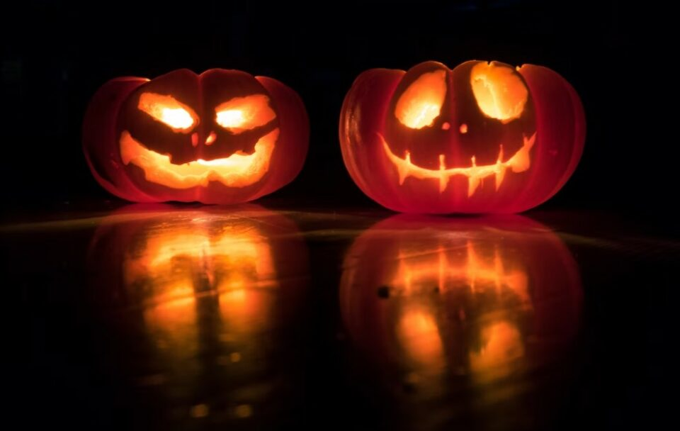
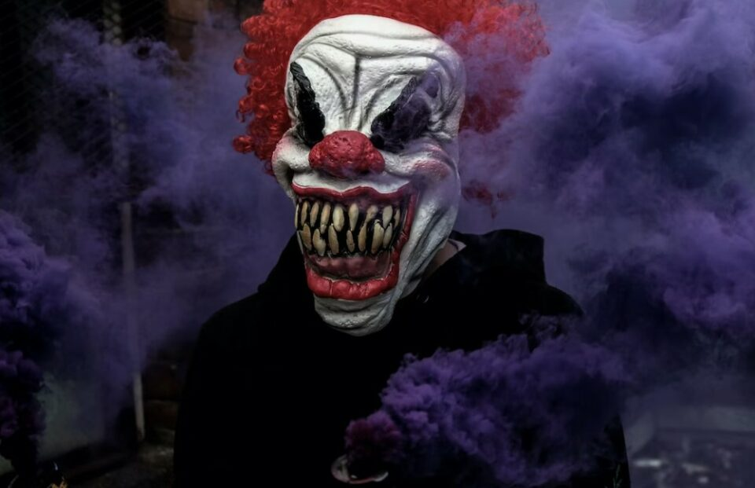
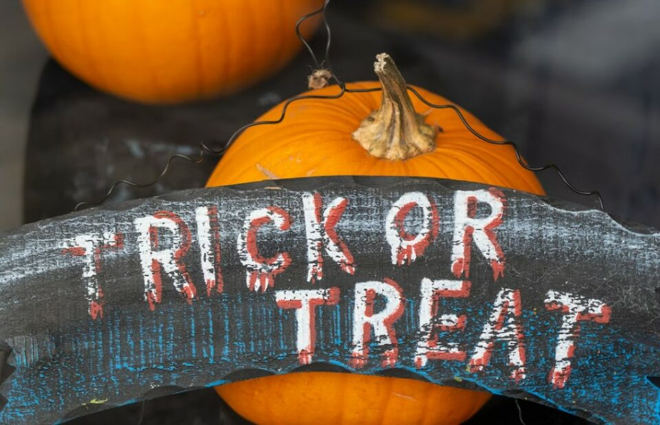
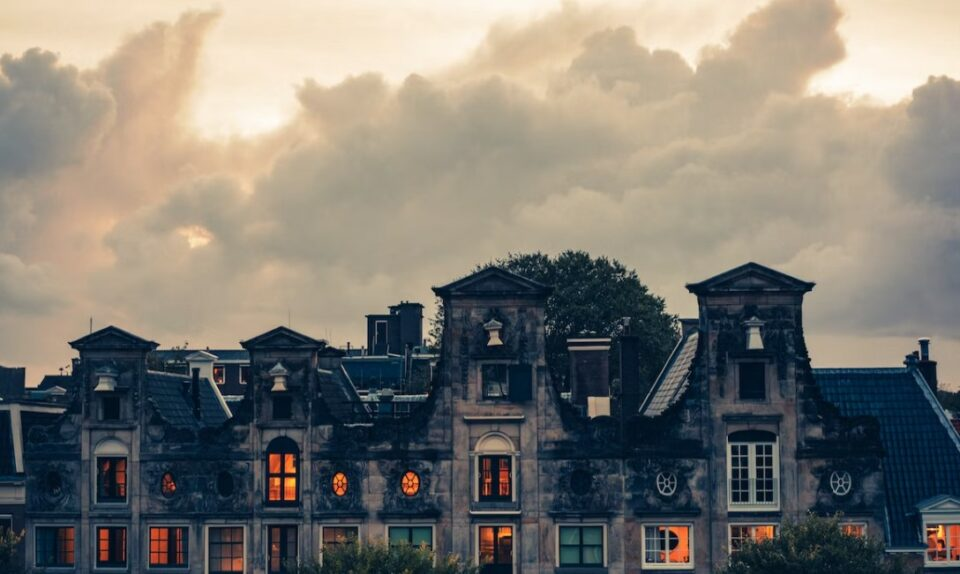
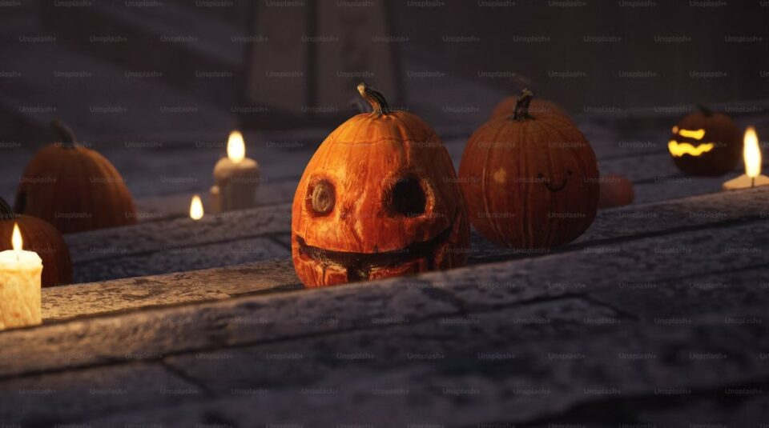

This article has been written and researched by our expert Loveable through a precise methodology. [Learn more about our methodology](https://avada.io/loveable/our-methodological.html)

[Loveable](https://avada.io/loveable/) > [Blog](https://avada.io/loveable/blog/) > [Holiday](https://avada.io/loveable/holiday/)

# Halloween Traditions And Everything You Need to Know 2023

Written by [Blake Simpson](https://avada.io/loveable/author/blake/) Last Updated on August 30, 2023

- [Historical Background of Halloween Traditions](https://avada.io/loveable/blog/halloween-traditions/#wp-block-heading-2-4)
    - [Origins in the ancient Celtic festival of Samhain](https://avada.io/loveable/blog/halloween-traditions/#wp-block-heading-3-6)
    - [Influence of Christian holiday All Saints’ Day (All Hallows’ Eve)](https://avada.io/loveable/blog/halloween-traditions/#wp-block-heading-3-12)
    - [Evolution of Halloween in North America](https://avada.io/loveable/blog/halloween-traditions/#wp-block-heading-3-16)
- [5 Common Traditional Halloween Activities](https://avada.io/loveable/blog/halloween-traditions/#wp-block-heading-2-20)
    - [Costume Parties](https://avada.io/loveable/blog/halloween-traditions/#wp-block-heading-3-22)
    - [Trick-or-Treating](https://avada.io/loveable/blog/halloween-traditions/#wp-block-heading-3-28)
    - [Pumpkin Carving](https://avada.io/loveable/blog/halloween-traditions/#wp-block-heading-3-33)
    - [Haunted Houses and Ghost Tours](https://avada.io/loveable/blog/halloween-traditions/#wp-block-heading-3-37)
    - [Telling Scary Stories](https://avada.io/loveable/blog/halloween-traditions/#wp-block-heading-3-41)
- [Halloween Tradition: Regional and Cultural Variations](https://avada.io/loveable/blog/halloween-traditions/#wp-block-heading-2-45)
    - [Halloween traditions around the world](https://avada.io/loveable/blog/halloween-traditions/#wp-block-heading-3-47)
    - [Cultural Integration and Adoption of Halloween](https://avada.io/loveable/blog/halloween-traditions/#wp-block-heading-3-56)
- [Halloween Traditions: Modern Halloween Trends](https://avada.io/loveable/blog/halloween-traditions/#wp-block-heading-2-62)
    - [Halloween-themed Events and Festivals](https://avada.io/loveable/blog/halloween-traditions/#wp-block-heading-3-64)
    - [Alternative Celebrations](https://avada.io/loveable/blog/halloween-traditions/#wp-block-heading-3-68)
    - [Impact of Social Media on Halloween](https://avada.io/loveable/blog/halloween-traditions/#wp-block-heading-3-71)
- [Halloween Traditions, In Conclusion](https://avada.io/loveable/blog/halloween-traditions/#wp-block-heading-2-75)

Are you ready to immerse yourself in the enchanting world of Halloween? As the year comes to a close, it’s time to gear up for the spookiest night of the year. From ancient customs to modern celebrations, Halloween is a time when the line between the living and the supernatural blurs. In this article, we will delve into the fascinating traditions that have shaped Halloween and explore everything you need to know to make the most of this bewitching holiday in 2023.

Halloween, also known as All Hallows’ Eve, traces its roots back to the ancient Celtic festival of Samhain. On this night, the boundary between the living and the dead was believed to be at its thinnest, allowing spirits to roam the earth. Today, Halloween has evolved into a vibrant celebration filled with [cool Halloween costumes](https://avada.io/loveable/coolest-halloween-costumes/), jack-o’-lanterns, and trick-or-treating. Discover the origins of these customs and how they have transformed over time as we unlock the secrets behind Halloween’s enduring allure.

But what lies beyond the familiar traditions and [symbols of Halloween](https://avada.io/loveable/blog/halloween-symbols-explained/)? Join us as we explore the lesser-known aspects of this mystical holiday. Uncover the eerie tales and ghostly legends that have captured the imaginations of generations. From haunted locations to spine-chilling rituals, we’ll shed light on the darker side of Halloween. So, grab your broomsticks and prepare for an unforgettable journey into the realm of **Halloween traditions**, where ancient folklore meets modern festivities in an enchanting blend.

## **Historical Background of Halloween Traditions**

Halloween, with its modern-day festivities and customs, has deep historical roots that can be traced back to ancient traditions and cultural practices. Understanding the historical background of Halloween provides insight into the evolution of this beloved holiday and the diverse influences that have shaped its current form.

### **Origins in the ancient Celtic festival of Samhain**

Samhain, pronounced “sow-in,” was an ancient Celtic festival celebrated by the Celts in Ireland, Scotland, and parts of Britain.

Samhain marked the end of the harvest season and the beginning of winter, symbolizing the transition from light to darkness.

The Celts believed that during Samhain, the boundary between the living and the spirit world was at its thinnest, allowing spirits, both benevolent and malevolent, to cross over into the human realm.

Rituals and bonfires were lit to ward off evil spirits and provide protection for the community.

### **Influence of Christian holiday All Saints’ Day (All Hallows’ Eve)**

In the 7th century, the Catholic Church designated November 1st as All Saints’ Day, also known as All Hallows’ Day, to honor all saints and martyrs. All Hallows’ Day was preceded by All Hallows’ Eve, which eventually became known as Halloween.

The Church incorporated some of the traditions and practices of Samhain into the Christian observance, blending Celtic and Christian beliefs.

Elements such as bonfires, feasting, and dressing up in costumes persisted, albeit with a Christian influence.

### **Evolution of Halloween in North America**

Halloween was brought to North America by Irish and Scottish immigrants in the 19th century, who carried with them their traditions and customs.

These immigrants introduced the practice of carving turnips or potatoes with eerie faces, representing spirits, as part of Halloween celebrations. In North America, the availability of pumpkins, which were larger and easier to [carve a pumpkin](https://avada.io/loveable/blog/halloween-pumpkin/), led to the popularization of the jack-o’-lantern tradition.

Over time, Halloween in North America became a community-centered holiday, emphasizing activities such as trick-or-treating, parties, and festive decorations.

## **5 Common Traditional Halloween Activities**

Halloween is a time of vibrant celebration, marked by a variety of traditional activities that have become synonymous with the holiday. These time-honored customs add to the enchantment and excitement of Halloween, creating a sense of camaraderie and playful indulgence for both children and adults.

### **Costume Parties**

**Importance of costumes in Halloween celebrations:** Costumes allow individuals to transform themselves into fantastical beings, mythical creatures, [iconic cartoon characters](https://avada.io/loveable/blog/famous-halloween-cartoon-characters/), or even spooky entities. They embody the spirit of Halloween by encouraging creativity, self-expression, and a temporary escape from reality.

**Popular costume themes and characters:** From classic choices like witches, vampires, ghosts, and superheroes to contemporary trends inspired by movies, TV shows, and popular culture, the range of costume options is vast. Individuals have the freedom to choose costumes that reflect their imagination and personal interests.

**Costume contests and prizes**: Costume parties often feature contests that showcase the best, most creative, or scariest costumes. Prizes and recognition are awarded to those who captivate the crowd with their exceptional attire.

**_Related_:** _35 Best [Cheap Halloween Costumes](https://avada.io/loveable/cheap-halloween-costumes/) for Anyone_

### **Trick-or-Treating**

Trick-or-treating involves children going from house to house, typically in their neighborhoods, dressed in costumes and asking for treats by saying, “Trick or treat!” It is a cherished Halloween activity that combines elements of playfulness, community engagement, and sweet indulgence.

**Preparation and planning for trick-or-treating:** Children and their families prepare for trick-or-treating by selecting or making costumes, often incorporating popular characters or themes. They may also decorate bags or buckets to hold their collected treats. Families may coordinate routes, ensuring a safe and enjoyable experience for children.

**Safety tips for children and parents:** Safety is paramount during trick-or-treating. Parents accompany young children, and precautions such as staying in well-lit areas, using sidewalks, and approaching only houses with lights on are essential. Checking treats for safety and potential allergens is also advised.

### **Pumpkin Carving**

**Origins of carving pumpkins for Halloween:** Carving pumpkins into eerie faces, known as jack-o’-lanterns, traces back to Irish folklore. Originally, turnips or potatoes were carved to ward off spirits. The use of pumpkins became popular in North America due to their abundance and ease of carving.

**Steps involved in pumpkin carving:** Pumpkin carving involves selecting a ripe pumpkin, cutting off the top, scooping out the seeds and pulp, and carving a design onto the pumpkin’s flesh. Common designs include [spooky Halloween faces](https://avada.io/loveable/blog/halloween-face-paint-ideas/), intricate patterns, or scenes depicting Halloween themes.

**Symbolism and significance of jack-o’-lanterns:** Jack-o’-lanterns, with their flickering candlelight or LED glow, are believed to ward off evil spirits or act as beacons to guide lost souls. They serve as decorative symbols, adding an atmospheric and festive touch to Halloween celebrations.

### **Haunted Houses and Ghost Tours**

**Overview of haunted attractions during Halloween:** Haunted houses, mazes, and ghost tours are immersive experiences designed to evoke fear, suspense, and excitement. They offer a thrilling adventure for those seeking a spine-tingling encounter with the supernatural.

**Types of haunted houses and ghost tours:** Haunted attractions range from professionally designed haunted houses with elaborate sets and actors to local community events that transform ordinary spaces into chilling environments. Ghost tours often explore haunted locations, sharing historical anecdotes and spooky tales.

**The psychological appeal of being scared for fun:** Haunted houses and ghost tours tap into the human fascination with fear and the adrenaline rush it provides. Participants willingly subject themselves to controlled frights, seeking an exhilarating experience and a temporary escape from reality.

### **Telling Scary Stories**

Halloween is a time of year when things get a little extra creepy, from the costumes to the haunted houses. Many people enjoy sharing spooky stories about ghosts, monsters, and eerie creatures to embrace the spooky spirit. In Sleepy Hollow, New York, where the famous writer Washington Irving was born, there’s a special event where attendees can listen to a dramatic reading of his story, The Legend of Sleepy Hollow. 

This classic tale of the Headless Horseman and Ichabod Crane is brought to life by talented actors who know how to make it even creepier. If you’re feeling particularly brave, you and your friends can gather in the dark or around a bonfire in the woods to share scary stories or maybe even have a marathon of spooky Halloween movies.

_**Related**_: 20 Best [_Halloween Stories_](https://avada.io/loveable/best-halloween-stories/): Unveiling Tales of Spooky Delights and Chilling Thrills

## **Halloween Tradition: Regional and Cultural Variations**

While Halloween is widely celebrated, its traditions and customs often exhibit fascinating regional and cultural variations. Across different countries and communities, unique practices and beliefs intertwine with the core elements of Halloween, enriching the tapestry of this beloved holiday.

### **Halloween traditions around the world**

Differences in how Halloween is celebrated globally: In various countries, Halloween takes on distinct forms influenced by local traditions and folklore. From ancient festivals to religious observances, the cultural context shapes the manner in which Halloween is embraced.

Unique customs and rituals in different countries:

- **Mexico:** Dia de los Muertos (Day of the Dead) combines indigenous Aztec traditions with Catholicism, honoring deceased loved ones with vibrant altars, colorful decorations, and special foods.
- **Ireland:** The birthplace of Halloween, Ireland celebrates the holiday with ancient traditions, including lighting bonfires, telling ghost stories, and attending lively festivals.
- **Philippines:** Pangangaluluwa involves children going door-to-door, singing for prayers and alms to aid souls in purgatory.
- **China:** The Hungry Ghost Festival honors ancestors and restless spirits with offerings, burning joss paper, and theatrical performances.
- **Japan:** Obon, a [Buddhist festival](https://en.wikipedia.org/wiki/List_of_Buddhist_festivals), is a time to honor ancestors and welcome their spirits back through rituals, dances, and the lighting of lanterns.

### **Cultural Integration and Adoption of Halloween**

Influence of diverse cultures on Halloween traditions: As communities become more multicultural, Halloween celebrations often incorporate elements from various cultures, blending traditions and creating unique hybrid festivities.Examples of multicultural celebrations:

- **United States:** In diverse neighborhoods, Halloween becomes a fusion of traditions, with costumes representing a range of cultural icons and celebrations incorporating music, dances, and foods from different ethnic backgrounds.
- **Canada**: Canadian Halloween celebrations showcase the country’s multicultural fabric, incorporating customs from indigenous communities, European settlers, and immigrant groups.

The regional and cultural variations of Halloween highlight the dynamic nature of this holiday, as it adapts and evolves within different societies. These diverse expressions add depth and richness to the celebration, fostering cross-cultural understanding and appreciation.

As Halloween continues to captivate hearts worldwide, it serves as a reminder of the shared human fascination with the mysterious, the supernatural, and the festive. Whether steeped in ancient customs or influenced by contemporary cultural exchanges, Halloween traditions reflect our collective desire to connect with the extraordinary, embrace the imaginative, and celebrate the spirit of community and joy.

## **Halloween Traditions: Modern Halloween Trends**

As times change and cultural influences evolve, Halloween continues to evolve as well, giving rise to modern trends that shape the way the holiday is celebrated. These emerging trends reflect the contemporary spirit of Halloween, incorporating new activities, events, and social phenomena that captivate the imagination and engage individuals of all ages.

### **Halloween-themed Events and Festivals**

Rise of large-scale Halloween events: In recent years, Halloween-themed events have grown in popularity, ranging from massive parties and parades to immersive experiences that transport participants into fantastical worlds of horror and fantasy.

Notable Halloween festivals around the world: Celebrations like the West Hollywood Halloween Carnaval, the Village Halloween Parade in New York City, and the Kawasaki Halloween Parade in Japan attract thousands of attendees and showcase elaborate costumes, performances, and themed floats.

### **Alternative Celebrations**

Trunk-or-treat events: Trunk-or-treat offers a safer alternative to traditional trick-or-treating. Participants decorate car trunks or designated areas, distributing candies and treats to children in a controlled environment, often within a community gathering.

Harvest festivals and fall-themed gatherings: Many communities organize harvest festivals or fall-themed events that celebrate the season, incorporating elements such as hayrides, corn mazes, pumpkin patches, and local produce markets.

### **Impact of Social Media on Halloween**

Influence of online platforms in shaping Halloween trends: Social media platforms like Instagram, TikTok, and YouTube have significantly influenced Halloween celebrations. Users share costume ideas, makeup tutorials, [home decorations](https://avada.io/loveable/blog/decorated-halloween-homes/), and DIY projects, inspiring others and promoting creativity.

Popular Halloween hashtags and challenges: Hashtags such as #Halloween, #DIYHalloween, and #HalloweenMakeup trend during the Halloween season, encouraging users to participate in challenges and share their Halloween-themed content, fostering a sense of community and creative exchange.

These modern Halloween trends reflect the ever-changing landscape of the holiday, adapting to contemporary preferences, safety concerns, and technological advancements. As society continues to evolve, Halloween remains a dynamic celebration, embracing new traditions while retaining its timeless essence of fun, imagination, and communal joy.

## **Halloween Traditions, In Conclusion**

**Halloween traditions** have a rich history and continue to evolve in the modern era. From ancient Celtic roots to the integration of cultural variations worldwide, Halloween remains a beloved holiday celebrated with enthusiasm. Traditional activities like costume parties, trick-or-treating, pumpkin carving, and haunted experiences create joy and bring people together. 

Additionally, modern trends such as large-scale events, alternative celebrations, and the influence of social media add new dimensions to the celebration. By embracing the past while embracing innovation, Halloween maintains its magical allure, fostering creativity, community, and a sense of wonder for all who partake. 

- [Historical Background of Halloween Traditions](https://avada.io/loveable/blog/halloween-traditions/#wp-block-heading-2-4)
    - [Origins in the ancient Celtic festival of Samhain](https://avada.io/loveable/blog/halloween-traditions/#wp-block-heading-3-6)
    - [Influence of Christian holiday All Saints’ Day (All Hallows’ Eve)](https://avada.io/loveable/blog/halloween-traditions/#wp-block-heading-3-12)
    - [Evolution of Halloween in North America](https://avada.io/loveable/blog/halloween-traditions/#wp-block-heading-3-16)
- [5 Common Traditional Halloween Activities](https://avada.io/loveable/blog/halloween-traditions/#wp-block-heading-2-20)
    - [Costume Parties](https://avada.io/loveable/blog/halloween-traditions/#wp-block-heading-3-22)
    - [Trick-or-Treating](https://avada.io/loveable/blog/halloween-traditions/#wp-block-heading-3-28)
    - [Pumpkin Carving](https://avada.io/loveable/blog/halloween-traditions/#wp-block-heading-3-33)
    - [Haunted Houses and Ghost Tours](https://avada.io/loveable/blog/halloween-traditions/#wp-block-heading-3-37)
    - [Telling Scary Stories](https://avada.io/loveable/blog/halloween-traditions/#wp-block-heading-3-41)
- [Halloween Tradition: Regional and Cultural Variations](https://avada.io/loveable/blog/halloween-traditions/#wp-block-heading-2-45)
    - [Halloween traditions around the world](https://avada.io/loveable/blog/halloween-traditions/#wp-block-heading-3-47)
    - [Cultural Integration and Adoption of Halloween](https://avada.io/loveable/blog/halloween-traditions/#wp-block-heading-3-56)
- [Halloween Traditions: Modern Halloween Trends](https://avada.io/loveable/blog/halloween-traditions/#wp-block-heading-2-62)
    - [Halloween-themed Events and Festivals](https://avada.io/loveable/blog/halloween-traditions/#wp-block-heading-3-64)
    - [Alternative Celebrations](https://avada.io/loveable/blog/halloween-traditions/#wp-block-heading-3-68)
    - [Impact of Social Media on Halloween](https://avada.io/loveable/blog/halloween-traditions/#wp-block-heading-3-71)
- [Halloween Traditions, In Conclusion](https://avada.io/loveable/blog/halloween-traditions/#wp-block-heading-2-75)

### [Blake Simpson](https://avada.io/loveable/author/blake/)

Hi, I'm Blake from Loveable. I help people find perfect gifts for occasions like anniversaries and weddings. I also write a blog about holidays, sharing insights to make them more meaningful. Let's create unforgettable moments together!

- [Twitter](https://twitter.com/intent/tweet)
- [Facebook](https://www.facebook.com/sharer/sharer.php)
- [instagram](https://avada.io/loveable/blog/halloween-traditions/)
- [pinterest](https://www.pinterest.com/loveablellc/)

## Related Posts

[### 120+ Christian Birthday Wishes To Spread Your Love](https://avada.io/loveable/blog/christian-birthday-wishes/) 

[

### 35 Best 70th Birthday Ideas To Celebrate The Special Milestone

](https://avada.io/loveable/blog/70th-birthday-ideas/)

[

### 50 Best 30th Birthday Decorations for a Remarkable Birthday Bash

](https://avada.io/loveable/blog/30th-birthday-decorations/)

[

### 40 Delicious Vegan Christmas Desserts to Delight Your Palate

](https://avada.io/loveable/blog/vegan-christmas-desserts/)

[

### 60 Christmas Team Building Activities to Boost Workplace Spirit

](https://avada.io/loveable/blog/christmas-team-building-activities/)
