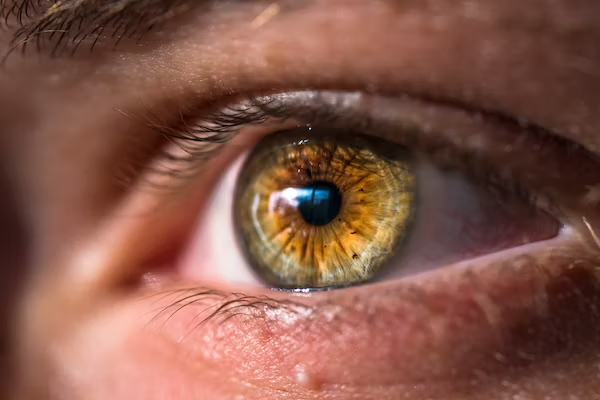
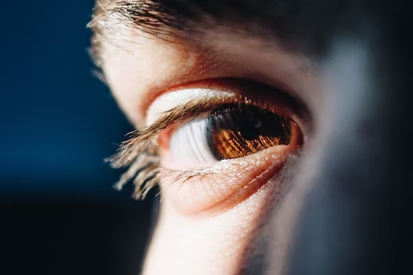
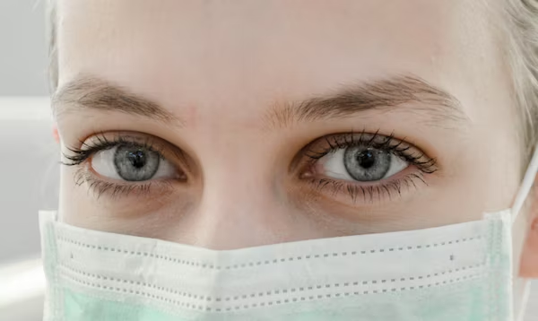
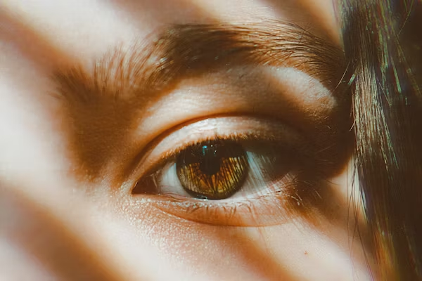

This article has been written and researched by our expert Loveable through a precise methodology. [Learn more about our methodology](https://avada.io/loveable/our-methodological.html)

[Loveable](https://avada.io/loveable/) > [Blog](https://avada.io/loveable/blog/) > [Relationship](https://avada.io/loveable/relationship/)

# Hazel Eyes And Things You Need To Know 

Written by [Luna Miller](https://avada.io/loveable/author/luna/) Last Updated on August 23, 2023

- [Are Hazel Eyes Rare?](https://avada.io/loveable/blog/hazel-eyes/#wp-block-heading-2-3)
- [How Can You Tell If Someone Has Hazel Eyes?](https://avada.io/loveable/blog/hazel-eyes/#wp-block-heading-2-7)
- [What Causes Hazel Eyes?](https://avada.io/loveable/blog/hazel-eyes/#wp-block-heading-2-10)
    - [Genes](https://avada.io/loveable/blog/hazel-eyes/#wp-block-heading-3-13)
    - [Light and Sunlight](https://avada.io/loveable/blog/hazel-eyes/#wp-block-heading-3-16)
    - [Health and Medical Conditions](https://avada.io/loveable/blog/hazel-eyes/#wp-block-heading-3-19)
- [What Do Hazel Eyes Mean Genetically?](https://avada.io/loveable/blog/hazel-eyes/#wp-block-heading-2-22)
- [What Causes Hazel Eyes To Change Color?](https://avada.io/loveable/blog/hazel-eyes/#wp-block-heading-2-27)
    - [Lighting](https://avada.io/loveable/blog/hazel-eyes/#wp-block-heading-3-29)
    - [Mood](https://avada.io/loveable/blog/hazel-eyes/#wp-block-heading-3-31)
- [What Color Hair Goes With Hazel Eyes?](https://avada.io/loveable/blog/hazel-eyes/#wp-block-heading-2-34)
- [Bottom Line](https://avada.io/loveable/blog/hazel-eyes/#wp-block-heading-2-40)

With their distinctive color combination and alluring appeal, hazel eyes have always captivated people. Their eye color is distinctive and adaptable due to the blend of brown and green pigments that define them. This blog delves into the fascinating world of hazel eyes, examining their genetic makeup, historical roots, and fascinating characteristics that make them so seductive. Understanding the history and meaning of hazel eyes might help you enjoy them even more, whether you have them personally or are just drawn to their beauty.

Since hazel eyes can vary their look depending on the lighting and colors around them, they are frequently thought of as intriguing and enigmatic. Hazel eyes have a chameleon-like aspect that adds to their attraction and has given rise to many myths and legends. We will also explore the potential health effects of hazel eyes, which include their propensity for developing specific eye diseases and their distinct visual advantages. We wish to shed light on their alluring character and offer a thorough comprehension of these alluring eye colors by revealing **the mysteries of hazel eyes**.

## **Are Hazel Eyes Rare?**

Despite the fact that the exact occurrence varies across various populations, hazel eyes are generally thought to be somewhat uncommon. Hazel eyes are governed by a number of hereditary elements that influence their pigment and color variations, as opposed to brown or blue eyes, which have a more expected distribution. 

Only approximately 5–8% of people in the world are thought to have hazel eyes. Hazel eyes are unusual, which adds to their allure and intrigue, making them extremely sought-after and adored. Their intriguing and enigmatic nature is enhanced by their distinctive color combination, which ranges from green and brown to platinum and amber.

## **How Can You Tell If Someone Has Hazel Eyes?**

Hazel eyes come in a variety of hues and variances, making it an interesting task to identify them. Hazel eyes typically contain a predominantly brown hue with specks or amber, green, or gold streaks. Depending on the surrounding surroundings and lighting, they may appear to change color. Observing the color variations within someone’s irises is one technique to tell if they have hazel eyes. Look for a blending of brown and green hues, along with any indications of gold or amber. 

Hazel eyes also frequently have a distinct and alluring depth and a particular brilliance that makes them stand out from other eye hues. It’s crucial to remember that hazel eyes tend to be really distinctive and may not fall under a particular group. As a result, the easiest approach to determine whether a person has hazel eyes is to look at the mesmerizing combination of colors and constantly shifting appearance that makes them so alluring.

## **What Causes Hazel Eyes?**

A variety of elements impact hazel eyes’ fascinating color combination, which adds to their distinctive appearance. These elements comprise genetics, exposure to light, and specific medical disorders:

### **Genes**

Hazel eyes, among other eye colors, are significantly influenced by genes. The creation of melanin within the iris, the colorful portion of the eye, is influenced by no fewer than 16 different genes. The pigmentation and the color of the eyes are governed by melanin. Eumelanin and pheomelanin are often found in conjunction in hazel eyes. 

When eumelanin is in high concentrations, brown eyes develop, whereas eumelanin which is more evenly distributed, can generate blue eyes. On the other hand, those with hazel eyes tend to have higher levels of pheomelanin, which gives the eyes a yellow tinge. Hazel eyes are distinguished by a mesmerizing blend of brown, green, and occasionally yellow colors due to the variable quantity and distribution of these pigments inside the iris.

### **Light and Sunlight**

The appearance of hazel eyes might change depending on the lighting. Hazel eyes may look lighter or darker in direct sunshine due to the brightness and quality of the light, which is different from other lighting conditions. Thanks to this effect, even those with lighter or darker eye pigmentation may appear to have hazel eyes. For instance, those with naturally darker colored eyes could find that the sun’s brilliant beams give them a hazel appearance.

Hazel eyes are already incredibly alluring, but their ability to change as they respond to light adds a further element of fascination. Hazel eyes can appear to morph throughout the day as the brightness and angle of the light change, exhibiting many hues and nuanced tones. This trait lends hazel eyes a captivating aspect since they may adjust and display a variety of tones that draw interest and pique curiosity.

### **Health and Medical Conditions**

In addition, some medical diseases can alter the color of the eyes, possibly producing hazel eyes. Weiss’ heterochromic iridocyclitis, an inflammatory ailment that can affect the iris’ color, is one such condition. The iris of people with this disorder may become paler or darker due to inflammation, changing their eye color, and even turning them hazel.

People who have hazel eyes may have eyes with a higher percentage of brown pigmentation than others, or their eyes may be more green. Hazel eyes are captivating because of their variety, which makes every pair special.

## **What Do Hazel Eyes Mean Genetically?**

Genetically, the generation and dispersion of pigmentation in the iris are regulated by a complex interplay of numerous genes, which causes hazel eyes. The striking combination of colors seen in hazel eyes is the result of a special combination of genetic variables.

It is known that at least 16 distinct genes, including those responsible for melanin formation, affect eye color. Hazel eyes have a distinctive appearance that is influenced by the quantity and distribution of two forms of melanin, eumelanin and pheomelanin. When eumelanin is in high concentrations, brown eyes develop, whereas eumelanin, which is more evenly distributed, can generate blue eyes; on the other hand, pheomelanin gives the iris a golden color.

Both eumelanin and a substance known as pheomelanin are found in the hazel eyes of individuals, but in varied amounts and locations across the iris. This results in the stunning mix of brown, green, and occasionally yellow tones that characterize hazel eyes. The complexity of the genetic variables involved in establishing eye color is demonstrated by the ongoing research into the precise genetic differences that cause hazel eyes.

## **What Causes Hazel Eyes To Change Color?**

Hazel eyes’ propensity to change color can be ascribed to a number of things, including lighting and mood. The distinctive quality of hazel eyes is that they can take on many hues and colors depending on the surroundings.

### **Lighting**

The color variance of hazel eyes is significantly influenced by lighting. Hazel eyes can change from brighter to darker colors in response to varying light levels and wavelengths. Hazel eyes can appear more bright and bring out green or brown tones when exposed to sunlight in particular.

### **Mood**

Hazel eyes can also change color in response to many emotional states, including excitement, mood, and even tears. This variation is due to the pupil’s expansion or contraction, which can modify how light reacts with the chemicals in the iris and provide the appearance of a change in eye color.

Hazel eyes’ intriguing and constantly changing characteristics are a result of the complicated interaction among lighting, mental state, and the exquisite pigmentation of the eye. Hazel eyes are captivating due to their adaptability, which draws adoration and fascination.

## **What Color Hair Goes With Hazel Eyes?**

Hazel eyes provide a versatile palette that can match a variety of hair hues with their distinctive combination of brown, green, and occasionally yellow tones. The best hair color to compliment hazel eyes is determined by various elements, such as skin tone and individual preference. Rich brown hair hues, like chestnut, auburn, or caramel, go nicely with those with warm tones in their hazel eyes. These warm hair colors can highlight the shimmering gold and amber specks in hazel eyes, resulting in a unified and complementing appearance.

In contrast, people with cooler overtones in their hazel-colored eyes can experiment with cool brown, ash brown, or even blonde tones in their hair. The olive and gray tones in hazel eyes can be highlighted by these cooler hair hues, giving them a more vivid and stunning appearance. 

Ultimately, choosing a hair color is a personal decision that can be affected by personal preference and current fashions. When choosing a hair color that highlights and compliments the alluring beauty of hazel eyes, it is vital to take into account things like skin tone, the darker shades in hazel eyes, and personal tastes.

**See More:** [Halloween Eyeliner](https://avada.io/loveable/halloween-eyeliner/): Create Effortless Halloween Looks Primarily Using Eyeliner

## **Bottom Line**

In summary, learning more about **hazel eyes** opens up a fascinating voyage of genetic subtleties, variations in color, and the influence of light and moods. It is easier to appreciate the elements that make hazel eyes so alluring when you are aware of what makes them so. This investigation illuminates the distinctive characteristics that render hazel eyes so alluring and sought-after, whether you’re blessed with them personally or just appreciate them.

We get a thorough grasp of hazel eyes by identifying the genetic effects, color-changing propensities, and probable health problem correlations. Hazel eyes are a great wonder because of their rarity, adaptability, and capacity to mesmerize with their constantly shifting tones. So let hazel eyes’ attraction continue to arouse curiosity and adoration while embracing their enchanting mystery.

- [Are Hazel Eyes Rare?](https://avada.io/loveable/blog/hazel-eyes/#wp-block-heading-2-3)
- [How Can You Tell If Someone Has Hazel Eyes?](https://avada.io/loveable/blog/hazel-eyes/#wp-block-heading-2-7)
- [What Causes Hazel Eyes?](https://avada.io/loveable/blog/hazel-eyes/#wp-block-heading-2-10)
    - [Genes](https://avada.io/loveable/blog/hazel-eyes/#wp-block-heading-3-13)
    - [Light and Sunlight](https://avada.io/loveable/blog/hazel-eyes/#wp-block-heading-3-16)
    - [Health and Medical Conditions](https://avada.io/loveable/blog/hazel-eyes/#wp-block-heading-3-19)
- [What Do Hazel Eyes Mean Genetically?](https://avada.io/loveable/blog/hazel-eyes/#wp-block-heading-2-22)
- [What Causes Hazel Eyes To Change Color?](https://avada.io/loveable/blog/hazel-eyes/#wp-block-heading-2-27)
    - [Lighting](https://avada.io/loveable/blog/hazel-eyes/#wp-block-heading-3-29)
    - [Mood](https://avada.io/loveable/blog/hazel-eyes/#wp-block-heading-3-31)
- [What Color Hair Goes With Hazel Eyes?](https://avada.io/loveable/blog/hazel-eyes/#wp-block-heading-2-34)
- [Bottom Line](https://avada.io/loveable/blog/hazel-eyes/#wp-block-heading-2-40)

### [Luna Miller](https://avada.io/loveable/author/luna/)

I'm Luna Miller, a helpful employee at Loveable. I excel at giving great advice on birthday gifts. I love suggesting memorable experiences like concerts, spas, and getaways. As a reliable and supportive colleague, I'm always there to assist.

- [Twitter](https://twitter.com/intent/tweet)
- [Facebook](https://www.facebook.com/sharer/sharer.php)
- [instagram](https://avada.io/loveable/blog/hazel-eyes/)
- [pinterest](https://www.pinterest.com/loveablellc/)

## Related Posts

[

### 35 Unforgettable Exciting Adult Birthday Party Ideas

](https://avada.io/loveable/blog/adult-birthday-party-ideas/)

[

### 42 Best 21st Birthday Outfits to Rock the Party

](https://avada.io/loveable/blog/21st-birthday-outfits/)

[

### 50+ Happy 40th Anniversary Quotes, Messages, and Wishes

](https://avada.io/loveable/blog/happy-40th-anniversary-quotes/)

[

### 100+ Heartwarming Happy 30th Anniversary Quotes, Messages, and Wishes

](https://avada.io/loveable/blog/happy-30th-anniversary-quotes/)

[

### 120+ Heartfelt Thank You Messages for The Birthday Wishes

](https://avada.io/loveable/blog/thank-you-messages-birthday-wishes/)
