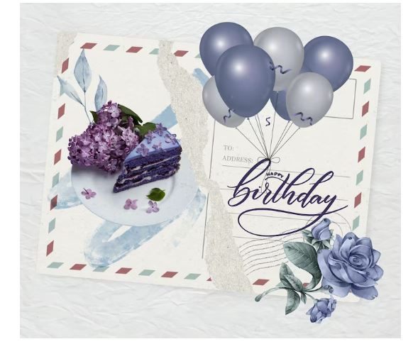

This article has been written and researched by our expert Loveable through a precise methodology. [Learn more about our methodology](https://avada.io/loveable/our-methodological.html)

[Loveable](https://avada.io/loveable/) > [Blog](https://avada.io/loveable/blog/) > [Relationship](https://avada.io/loveable/relationship/)

# Heartfelt Birthday Message for a Wonderful Coworker

Written by [Luna Miller](https://avada.io/loveable/author/luna/) Last Updated on August 24, 2023

- [What Is The Most Suitable Approach To Extend A Birthday Message For Coworkers?](https://avada.io/loveable/blog/birthday-message-for-coworker/#wp-block-heading-2-3) 
    - [1\. A birthday group ecard](https://avada.io/loveable/blog/birthday-message-for-coworker/#wp-block-heading-3-5)
    - [2\. A Birthday email](https://avada.io/loveable/blog/birthday-message-for-coworker/#wp-block-heading-3-10)
    - [3\. A birthday gift](https://avada.io/loveable/blog/birthday-message-for-coworker/#wp-block-heading-3-15)
    - [4\. A birthday party](https://avada.io/loveable/blog/birthday-message-for-coworker/#wp-block-heading-3-20)
- [Short and Simple Happy Birthday Message for Coworkers](https://avada.io/loveable/blog/birthday-message-for-coworker/#wp-block-heading-2-26)
- [Thoughtful and Heartfelt Birthday Wishes for Colleagues](https://avada.io/loveable/blog/birthday-message-for-coworker/#wp-block-heading-2-43)
- [Funny Birthday Message for Coworkers](https://avada.io/loveable/blog/birthday-message-for-coworker/#wp-block-heading-2-60)
- [Happy Birthday Messages for Your Boss](https://avada.io/loveable/blog/birthday-message-for-coworker/#wp-block-heading-2-77)
- [Birthday Wishes for Remote Coworker](https://avada.io/loveable/blog/birthday-message-for-coworker/#wp-block-heading-2-94)
- [Career-Oriented Employee Birthday Wishes](https://avada.io/loveable/blog/birthday-message-for-coworker/#wp-block-heading-2-111)
- [5 Perfect Birthday Gifts for Your Wonderful Coworker](https://avada.io/loveable/blog/birthday-message-for-coworker/#wp-block-heading-2-128)
    - [1\. Coworker Leaving Mug – Best Coworker Ever!](https://avada.io/loveable/blog/birthday-message-for-coworker/#wp-block-heading-3-129)
    - [2\. Work Made Us Coworkers Friends White Wine Tumbler](https://avada.io/loveable/blog/birthday-message-for-coworker/#wp-block-heading-3-133)
    - [3\. Crazy Psycho Sh\*t Made Us Friends Personalized Keychain](https://avada.io/loveable/blog/birthday-message-for-coworker/#wp-block-heading-3-137)
    - [4\. The Night Sky – The Day You Were Born Personalized 3D LED Light](https://avada.io/loveable/blog/birthday-message-for-coworker/#wp-block-heading-3-141)
    - [5\. A Truly Great Coworker is Hard to Find Custom Name 20oz Tumbler](https://avada.io/loveable/blog/birthday-message-for-coworker/#wp-block-heading-3-145)
- [To Wrap Up,](https://avada.io/loveable/blog/birthday-message-for-coworker/#wp-block-heading-2-152)

Finding the perfect **birthday message for coworkers** is a heartwarming way to show appreciation and celebrate their special day. Whether they are a supportive colleague, a work best friend, or an exceptional team player, expressing your warm wishes through a thoughtful birthday message can make their day even more memorable. 

Join us as we share heartfelt birthday messages crafted with care and affection, specially tailored for the wonderful coworker in your life. Let’s make their birthday a truly extraordinary and joyous occasion.

## **What Is The Most Suitable Approach To Extend A Birthday Message For Coworkers?** 

Well, not all birthday celebrations are one-size-fits-all. Depending on your relationship with the coworker, office culture, budget, and time constraints, there are various ways to express your best wishes and celebrate their special day. Here are some thoughtful and creative suggestions that will leave a lasting impression:

### **1\. A birthday group ecard**

Sending a birthday card from the whole team can be a heartfelt memento for a coworker’s birthday. Encapsulate the best moments of working together with meaningful greetings and messages, making them feel appreciated as an awesome teammate. 

Consider using a digital platform like GreetPool to create a collaborative e-card effortlessly. Skip the trip to the store and choose from hundreds of card designs with just a few clicks. Add GIFs, stickers, and images of your choice to personalize it further. 

The recipient will receive this bundle of joy at a scheduled time set by you, making it a delightful surprise.

### **2\. A Birthday email**

A birthday email announcing a coworker’s birthday is an excellent way to spread joy and celebrate with the team. By sending out an email to everyone, you can ensure that all colleagues are aware of the occasion and can join in on the celebrations. 

When crafting the email, it’s essential to strike a balance between professionalism and friendliness. While you want to keep the tone professional, don’t be afraid to include some personal touches, such as acknowledging your colleague’s achievements or including details about a planned celebration or gift. 

The thoughtful email will make the birthday celebrant feel valued and special, knowing that their colleagues are celebrating their special day.

### **3\. A birthday gift**

Thoughtful [birthday gifts for a coworker](https://avada.io/loveable/co-worker-birthday-gift/) show care and appreciation, and giving one is a great way to make them feel special. It’s important to choose a gift that reflects their interests or personality and also shows that you have put some thought into it. 

If you’re unsure what to get, you can always ask other colleagues for suggestions or do some research online. A simple yet thoughtful gift such as a book related to their hobbies, a personalized item, or a mug with an inspiring birthday message for coworkers can make a lasting impression. 

You can also consider pooling together with other colleagues to purchase a group gift, which will show your coworker how much they are valued by the entire team. Whatever you choose, make sure to accompany it with a heartfelt birthday message or card to make your coworker feel special on their big day.

### **4\. A birthday party**

Hosting a fantastic birthday party is a great way to celebrate a coworker’s special day. Whether it’s a small gathering in a café or restaurant, or a lunch party at the office, a well-planned celebration can bring joy and create lasting memories. 

When organizing the party, consider their preferences, and make sure to include elements that they enjoy. Whether it’s their favorite food, music, or activities, tailoring the party to their tastes will make it even more special. In case the team has remote coworkers, you can arrange a virtual Zoom party to bring everyone together and share birthday messages with the colleague. 

You may also enjoy playing some virtual games and taking part in enjoyable activities as a team. The party will not only make the birthday celebrant feel cherished but also strengthen the bond among coworkers.

Remember, the best way to wish a coworker happy birthday is to make them feel special and cherished, creating lasting memories for this significant day. By personalizing your wishes and considering their preferences and interests, you can make their 60th birthday a celebration to remember.

## **Short and Simple Happy Birthday Message for Coworkers**

- Happy birthday! Wishing you a day filled with joy and laughter.
- Have an amazing birthday! May this year be your best one yet.
- Happy birthday, coworker! Here’s to another fantastic year ahead.
- Wishing you all the best on your special day. Happy birthday!
- Cheers to another year of greatness! Happy birthday!
- Happy birthday, and may all your dreams come true.
- Sending you warm birthday wishes. Have a fantastic day!
- Happy birthday, coworker! May this year be filled with success and happiness.
- Here’s to a coworker who makes the workplace brighter. Have a wonderful birthday!
- Wishing you a day as fantastic as you are. Happy birthday!
- Happy birthday! Thank you for being an incredible colleague.
- May your birthday be as awesome as you are. Enjoy your special day!
- Happy birthday, and may the year ahead be full of blessings.
- Cheers to you on your birthday! Keep shining bright!
- Happy birthday, coworker! Make the most of your special day.

## **Thoughtful and Heartfelt Birthday Wishes for Colleagues**

- Happy birthday to a colleague who brings so much positivity and warmth to the workplace. Wishing you a day as bright and wonderful as you are!
- May your birthday be filled with joy, laughter, and all the things that make you smile. You’re not just a great colleague but also an amazing friend.
- Wishing a fantastic birthday to someone whose dedication and hard work inspire us all. Your presence makes our workplace a better and happier one.
- Happy birthday to the glue that holds our team together. Your kindness and support are truly appreciated.
- May this birthday mark the beginning of a year filled with growth, success, and all the achievements you deserve. You’re a valued colleague and an exceptional individual.
- On your special day, I want to express my gratitude for your friendship and support. Happy birthday, and here’s to many more years of working together!
- Your passion and enthusiasm for your work are truly inspiring. May this birthday bring you the recognition and appreciation you so rightfully deserve.
- Happy birthday to a colleague who never fails to lend a helping hand and brighten our days with your cheerful spirit. Your positivity is contagious!
- As you celebrate another year of life, know that you’ve made a significant impact on everyone around you. Wishing you a birthday filled with love and appreciation.
- Your professionalism and dedication to your work are commendable. May your birthday be a celebration of your many accomplishments.
- Happy birthday to a colleague who is always ready to go the extra mile to achieve excellence. Your commitment to excellence is truly remarkable.
- Your presence in the workplace makes every day more enjoyable. Wishing you a birthday filled with laughter and cherished moments.
- Here’s to a colleague who makes teamwork a pleasure and the workplace a vibrant and inclusive space. Happy birthday!
- Your kindness and thoughtfulness brighten even the toughest workdays. Wishing you a birthday filled with love and happiness.
- On your birthday, I want to express my gratitude for your support and camaraderie. You’re not just a colleague; you’re family.

## **Funny Birthday Message for Coworkers**

- Happy birthday to a colleague who makes every day at the office feel like a party! Just remember, work hard, party harder!
- Another year older, but don’t worry, you’re not the oldest one in the office yet. Keep running, and you might outrun those grey hairs!
- Congratulations on surviving another year at this crazy workplace! You deserve an award for your patience and sense of humor.
- Happy birthday! Remember, age is just a number, and so is your office extension. Cheers to another year of forgetting where you parked your desk!
- Birthdays are like deadlines – they keep coming around too quickly! But at least you get cake instead of another report to complete. Enjoy your sweet day!
- Here’s to a colleague who’s like fine wine – getting better with age and leaving a lasting impression on everyone they meet!
- Happy birthday to someone who knows how to balance work and play – mainly because they’re always sneaking in some fun during office hours!
- Congratulations on leveling up in the game of life! But don’t worry; you don’t have to face any boss battles today. It’s your special day!
- Age is just a number, and office politics are just annoying distractions. So let’s forget both and focus on celebrating your birthday in style!
- Happy birthday to a coworker who brightens the office with their smile and lights up the breakroom with their terrible jokes!
- They say wisdom comes with age, but in your case, it seems to have gotten lost along the way. But hey, who needs wisdom when you have charm and wit?
- Happy birthday to someone who’s survived another year of office drama, coffee spills, and never-ending meetings. You’re a true office warrior!
- Congratulations on reaching another milestone! Now that you’re a year older, we expect your dad jokes to reach peak dad levels!
- Birthdays are nature’s way of telling us to eat more cake and forget about our deadlines – at least for today. Enjoy your well-deserved break!
- Another year older means you’re becoming a true office legend. Just don’t let that “legendary” status go to your head – we still need you to do actual work!

## **Happy Birthday Messages for Your Boss**

- Happy birthday to a remarkable boss! Your leadership, guidance, and support have been invaluable to us all. May your day be filled with joy and success.
- Wishing the best boss ever a very happy birthday! You inspire us to do our best every day, and we are grateful for your mentorship.
- Happy birthday, boss! Your dedication and hard work are truly commendable. May this year be filled with new achievements and exciting opportunities.
- Here’s to a boss who leads with wisdom and kindness. Your encouragement and belief in our abilities have made a significant difference in our careers. Happy birthday!
- It’s a privilege to work under your guidance. Happy birthday, boss! May you have a day as fantastic as you are.
- Wishing you a birthday filled with laughter, joy, and all the things that make you happy. Happy birthday, boss! Thank you for being a great leader and role model.
- Happy birthday to an exceptional boss who brings out the best in all of us. Your passion and dedication are truly inspiring.
- You make the workplace a better and brighter place. Happy birthday, boss! May your special day be as extraordinary as you are.
- To our fantastic boss, happy birthday! Your vision and determination motivate us to strive for greatness. Here’s to many more successful years ahead.
- Happy birthday to the most understanding and supportive boss. Your encouragement has helped us grow both professionally and personally.
- Wishing you a birthday filled with happiness, good health, and all the success you deserve. Happy birthday, boss!
- Happy birthday to a boss who leads with integrity and fairness. Your leadership style is truly inspiring, and we are grateful for the opportunities you provide.
- To a boss who knows how to balance hard work and a good sense of humor – happy birthday! May your day be filled with laughter and joy.
- Happy birthday to a boss who not only commands respect but also earns admiration and appreciation from their team. You are truly one of a kind.
- Here’s to a boss who is not just a leader but also a friend and mentor. Happy birthday! May your special day be filled with love and warmth.

## **Birthday Wishes for Remote Coworker**

- Happy birthday! Even from afar, your presence brightens our virtual meetings and makes working together a pleasure. Have a fantastic day!
- Wishing you a birthday filled with virtual hugs, online celebrations, and all the love we can send your way. You’re a valued member of the team, even from a distance.
- Happy birthday to our amazing remote coworker! Despite the physical distance, your dedication and hard work bring us closer as a team. Enjoy your special day!
- Although we can’t celebrate in person, know that we’re raising a virtual toast to you on your birthday! Thank you for being an essential part of our remote team.
- Sending birthday cheers through the internet wires! May your day be filled with laughter, happiness, and virtual cake!
- Happy birthday to a remote superstar! Your contributions are felt across the miles, and we appreciate everything you do for the team.
- Distance can’t dampen the joy of celebrating your birthday. Wishing you a day filled with virtual high-fives and warm wishes from the entire remote team.
- On your special day, we’re sending you virtual confetti, good vibes, and a whole lot of appreciation for being an outstanding remote coworker.
- Happy birthday to our remote collaborator extraordinaire! Your talents and dedication know no bounds, and we’re lucky to have you on our team.
- Even though we’re miles apart, we’re united in celebrating your birthday! Here’s to a remote coworker who makes the team stronger and more connected.
- Distance can’t stop us from celebrating the remarkable person you are. Happy birthday, and thank you for being an integral part of our remote work family.
- Wishing our remote rockstar a birthday filled with virtual cheers, video calls with loved ones, and all the happiness you deserve.
- Happy birthday! Although we can’t gather around the office cake, know that we’re all thinking of you and sending our warmest wishes from afar.
- Distance may separate us physically, but your contributions to the team bridge the gap. Have an incredible birthday, remote superstar!
- Here’s to a remote coworker who continues to shine, no matter where they are. Your dedication and talent are appreciated more than words can express. Happy birthday!

## **Career-Oriented Employee Birthday Wishes**

- Happy birthday to a highly valued member of our team! Your dedication and hard work inspire us all to reach new heights in our careers.
- Wishing you a birthday filled with success and achievements. Your commitment to excellence makes you a shining star in our workplace.
- Happy birthday to a true professional! Your passion for your work is evident in everything you do, and we are lucky to have you on our team.
- May this birthday mark the beginning of an exciting chapter in your career. Here’s to many more accomplishments and opportunities coming your way.
- As you celebrate your special day, know that your contributions have not gone unnoticed. Your skills and talents make a significant impact on our team’s success.
- Happy birthday to a dedicated and ambitious employee! Your work ethic and drive inspire us to do our best every day.
- Wishing you a birthday filled with career milestones and personal growth. You are an invaluable asset to our organization.
- Here’s to a colleague who consistently goes above and beyond in their job. Your dedication is an inspiration to us all. Happy birthday!
- May this birthday be a stepping stone to greater achievements in your career. Keep aiming high and reaching for your goals.
- Happy birthday to a team player who always strives for excellence. Your positive attitude and willingness to take on challenges make you a true asset to our workplace.
- As you celebrate another year of life, know that your contributions to the team have made a lasting impact. Keep excelling in your career and beyond.
- Wishing you a birthday filled with opportunities and moments to showcase your skills. Your career journey is bound to be extraordinary.
- Happy birthday to a go-getter who is never afraid to take on new challenges. Your fearlessness in your career inspires us all.
- Here’s to a colleague who consistently demonstrates professionalism and a strong work ethic. Your dedication is commendable. Happy birthday!
- May this birthday be a reminder of how far you’ve come in your career and how much potential lies ahead. Keep striving for greatness.

## 5 Perfect Birthday Gifts for Your Wonderful Coworker

### **[1\. Coworker Leaving Mug – Best Coworker Ever!](https://loveable.ai/products/coworker-leaving-mug-work-wife-gift-best-coworker-ever-funny-work-mug-funny-gifts-for-coworkers-friends-cute-birthday-gift-211ihpnpmu515?variant=44082353537256)**

Celebrate your wonderful coworker with a heartfelt gift that will leave a lasting impression! Our “Coworker Leaving Mug” is a perfect present to show appreciation to your work wife or best coworker ever. 

With a touch of humor, this funny work mug is an ideal token of friendship and camaraderie. Express your gratitude and cherish the memories shared with this cute birthday gift, available at Loveable.ai.

### **[2\. Work Made Us Coworkers Friends White Wine Tumbler](https://loveable.ai/products/work-made-us-coworkers-friends-white-wine-tumbler-2-sides-best-gifts-for-coworkers-on-christmas-birthday-211ihpnptu512?v&variant=44080497033448)**

Toast to your cherished friendship with your coworkers with our “Work Made Us Coworkers Friends White Wine Tumbler.” This delightful gift is a perfect way to celebrate birthdays or Christmas with your colleagues. 

The tumbler features two sides, commemorating the bond you’ve formed as coworkers and friends. Raise a glass and create memories with this thoughtful present, exclusively from Loveable.ai.

### **[3\. Crazy Psycho Sh\*t Made Us Friends Personalized Keychain](https://loveable.ai/products/crazy-psycho-shit-made-us-friends-personalized-keychain-for-coworkers-on-christmas-211ihpnpkc517?variant=44098000912616)**

Celebrate the unique and unforgettable bond with your coworkers this Christmas with our “Crazy Psycho Sh\*t Made Us Friends Personalized Keychain.” Customize this delightful keychain to bring a smile to your colleague’s face. 

Perfect for adding a touch of humor to your workplace friendships, this keychain is a thoughtful and humorous Christmas gift from Loveable.ai.

### **[4\. The Night Sky – The Day You Were Born Personalized 3D LED Light](https://loveable.ai/products/the-night-sky-the-day-you-were-born-personalized-3d-led-light-multiple-colors-best-gifts-for-family-on-birthdays-302ihplnll251?variant=44325334679784)**

Celebrate your coworker’s birthday with a gift that’s out of this world! Our “The Night Sky – The Day You Were Born Personalized 3D LED Light” captures the stars’ alignment on their special day. 

Choose from multiple colors and create a unique, mesmerizing light display to cherish and commemorate their birthday. A perfect gift for family members, exclusively available at Loveable.ai.

### **[5\. A Truly Great Coworker is Hard to Find Custom Name 20oz Tumbler](https://loveable.ai/products/a-truly-great-coworker-is-hard-to-find-custom-name-20oz-tumbler-best-gift-for-coworkers-301ihpbntu064?variant=44268522930408)**

Show your appreciation for your extraordinary coworker with our “A Truly Great Coworker is Hard to Find Custom Name 20oz Tumbler.” Personalize this thoughtful gift with their name and a heartfelt birthday message for coworkers. 

This tumbler is the best gift to acknowledge their hard work and friendship, reminding them of their value in your workplace. Exclusively designed by Loveable.ai for the best coworkers in your life.

**_See More:_**

- Best [Thank You Gifts For Coworkers](https://avada.io/loveable/thank-you-gifts-coworkers/)

- Meaningful [Going Away Gifts for Coworker](https://avada.io/loveable/going-away-gifts-coworker/)

## **To Wrap Up,**

In conclusion, a heartfelt **birthday message for coworkers** is a beautiful gesture that can brighten their day and strengthen the bonds of friendship and camaraderie in the workplace. Taking a moment to express your genuine appreciation and well-wishes can create a positive and uplifting atmosphere for the celebrant. 

Whether you choose a message filled with humor, career-oriented wishes, or heartfelt sentiments, the essence of showing that you care will undoubtedly leave a lasting impact. As we celebrate the wonderful coworker in our lives, let us continue to foster a supportive and nurturing work environment, where friendship and teamwork thrive. 

Happy birthday to all the exceptional coworkers out there, making our work days brighter and our goals more achievable!

- [What Is The Most Suitable Approach To Extend A Birthday Message For Coworkers?](https://avada.io/loveable/blog/birthday-message-for-coworker/#wp-block-heading-2-3) 
    - [1\. A birthday group ecard](https://avada.io/loveable/blog/birthday-message-for-coworker/#wp-block-heading-3-5)
    - [2\. A Birthday email](https://avada.io/loveable/blog/birthday-message-for-coworker/#wp-block-heading-3-10)
    - [3\. A birthday gift](https://avada.io/loveable/blog/birthday-message-for-coworker/#wp-block-heading-3-15)
    - [4\. A birthday party](https://avada.io/loveable/blog/birthday-message-for-coworker/#wp-block-heading-3-20)
- [Short and Simple Happy Birthday Message for Coworkers](https://avada.io/loveable/blog/birthday-message-for-coworker/#wp-block-heading-2-26)
- [Thoughtful and Heartfelt Birthday Wishes for Colleagues](https://avada.io/loveable/blog/birthday-message-for-coworker/#wp-block-heading-2-43)
- [Funny Birthday Message for Coworkers](https://avada.io/loveable/blog/birthday-message-for-coworker/#wp-block-heading-2-60)
- [Happy Birthday Messages for Your Boss](https://avada.io/loveable/blog/birthday-message-for-coworker/#wp-block-heading-2-77)
- [Birthday Wishes for Remote Coworker](https://avada.io/loveable/blog/birthday-message-for-coworker/#wp-block-heading-2-94)
- [Career-Oriented Employee Birthday Wishes](https://avada.io/loveable/blog/birthday-message-for-coworker/#wp-block-heading-2-111)
- [5 Perfect Birthday Gifts for Your Wonderful Coworker](https://avada.io/loveable/blog/birthday-message-for-coworker/#wp-block-heading-2-128)
    - [1\. Coworker Leaving Mug – Best Coworker Ever!](https://avada.io/loveable/blog/birthday-message-for-coworker/#wp-block-heading-3-129)
    - [2\. Work Made Us Coworkers Friends White Wine Tumbler](https://avada.io/loveable/blog/birthday-message-for-coworker/#wp-block-heading-3-133)
    - [3\. Crazy Psycho Sh\*t Made Us Friends Personalized Keychain](https://avada.io/loveable/blog/birthday-message-for-coworker/#wp-block-heading-3-137)
    - [4\. The Night Sky – The Day You Were Born Personalized 3D LED Light](https://avada.io/loveable/blog/birthday-message-for-coworker/#wp-block-heading-3-141)
    - [5\. A Truly Great Coworker is Hard to Find Custom Name 20oz Tumbler](https://avada.io/loveable/blog/birthday-message-for-coworker/#wp-block-heading-3-145)
- [To Wrap Up,](https://avada.io/loveable/blog/birthday-message-for-coworker/#wp-block-heading-2-152)

### [Luna Miller](https://avada.io/loveable/author/luna/)

I'm Luna Miller, a helpful employee at Loveable. I excel at giving great advice on birthday gifts. I love suggesting memorable experiences like concerts, spas, and getaways. As a reliable and supportive colleague, I'm always there to assist.

- [Twitter](https://twitter.com/intent/tweet)
- [Facebook](https://www.facebook.com/sharer/sharer.php)
- [instagram](https://avada.io/loveable/blog/birthday-message-for-coworker/)
- [pinterest](https://www.pinterest.com/loveablellc/)

## Related Posts

[

### 35 Unforgettable Exciting Adult Birthday Party Ideas

](https://avada.io/loveable/blog/adult-birthday-party-ideas/)

[

### 42 Best 21st Birthday Outfits to Rock the Party

](https://avada.io/loveable/blog/21st-birthday-outfits/)

[

### 50+ Happy 40th Anniversary Quotes, Messages, and Wishes

](https://avada.io/loveable/blog/happy-40th-anniversary-quotes/)

[

### 100+ Heartwarming Happy 30th Anniversary Quotes, Messages, and Wishes

](https://avada.io/loveable/blog/happy-30th-anniversary-quotes/)

[

### 120+ Heartfelt Thank You Messages for The Birthday Wishes

](https://avada.io/loveable/blog/thank-you-messages-birthday-wishes/)
