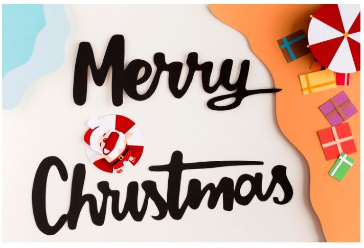
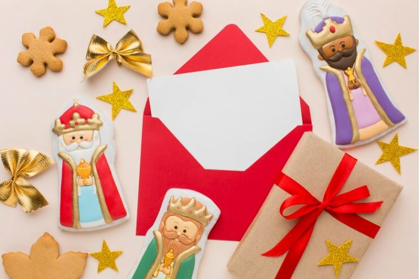
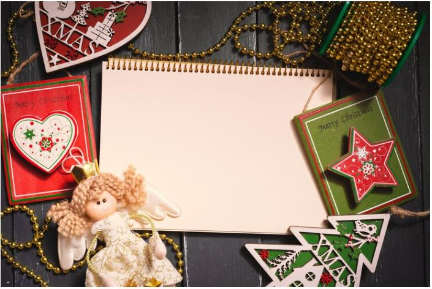

This article has been written and researched by our expert Loveable through a precise methodology. [Learn more about our methodology](https://avada.io/loveable/our-methodological.html)

[Loveable](https://avada.io/loveable/) > [Blog](https://avada.io/loveable/blog/) > [Holiday](https://avada.io/loveable/holiday/)

# Heartwarming Christmas Card Messages to Spread Joy and Love

Written by [Blake Simpson](https://avada.io/loveable/author/blake/) Last Updated on August 21, 2023

- [Meaningful Christmas Card Messages for Family and Friends](https://avada.io/loveable/blog/christmas-card-messages/#wp-block-heading-2-3)
- [Funny Chrismas Card Messages That Make the Humor](https://avada.io/loveable/blog/christmas-card-messages/#wp-block-heading-2-22)
- [Meaningful Religious Christmas Card Messages](https://avada.io/loveable/blog/christmas-card-messages/#wp-block-heading-2-42)
- [Romantic Christmas Card Messages for Couples](https://avada.io/loveable/blog/christmas-card-messages/#wp-block-heading-2-62)
- [Christmas Wishes for Long-Distance Friends](https://avada.io/loveable/blog/christmas-card-messages/#wp-block-heading-2-77)
- [Short and Simple Holiday Greetings](https://avada.io/loveable/blog/christmas-card-messages/#wp-block-heading-2-92)
- [Christmas Card Messages for Your Boss](https://avada.io/loveable/blog/christmas-card-messages/#wp-block-heading-2-108)
- [Christmas Card Messages for Coworkers](https://avada.io/loveable/blog/christmas-card-messages/#wp-block-heading-2-123)
- [In Conclusion,](https://avada.io/loveable/blog/christmas-card-messages/#wp-block-heading-2-140)

The festive season is upon us, and what better way to celebrate than by spreading joy and love through heartwarming **Christmas card messages**? As the snowflakes gently blanket the world outside, our hearts warm with the spirit of giving, gratitude, and togetherness. This year, let your holiday greetings go beyond the ordinary and let your words touch the hearts of your loved ones in a truly special way. 

Whether you’re reconnecting with old friends, reaching out to family members afar, or simply brightening someone’s day, these heartfelt messages are sure to capture the true essence of Christmas. Join us as we explore a collection of touching Christmas card messages that will not only warm your recipient’s heart but also remind us of all of the magic that this season brings.

## **Meaningful Christmas Card Messages for Family and Friends**

From expressing gratitude to sharing blessings, let these carefully curated messages inspire you to create heartfelt connections and make this Christmas truly special for all those you hold dear.

1\. Wishing you a Christmas filled with love, laughter, and cherished moments with your loved ones. May your heart be as warm as the holiday lights that adorn this festive season.

2\. As we gather around the tree and exchange gifts, may the true gift of Christmas – the gift of love – shine brightly in your life. Merry Christmas!

3\. May the melody of Christmas carols bring joy to your heart and the spirit of giving fill your soul with happiness. Have a wonderful and blessed holiday season.

4\. This Christmas, may you be surrounded by the warmth of family, the embrace of friends, and the comfort of cherished memories. Sending you love and festive wishes.

5\. May the magic of Christmas fill your home with peace, your heart with hope, and your life with endless possibilities. Happy holidays!

6\. Wishing you a season of kindness, a world of laughter, and a heart full of gratitude. May your Christmas be as beautiful as the spirit it represents.

7\. In the quiet moments of reflection this Christmas, may you find renewed hope, strength, and the promise of brighter days ahead.

8\. Let the joy of giving be your true gift this Christmas, for it is in giving that we receive the most precious blessings. Merry Christmas and a Happy New Year!

9\. As the snowflakes fall gently outside, may the love in your heart fall gently upon all those you hold dear. Sending warm wishes for a magical Christmas.

10\. May your holiday season be wrapped in the love of family and friends, adorned with laughter, and sprinkled with moments of pure happiness. Have a Merry Christmas!

11\. This Christmas, may your home be filled with the laughter of loved ones, the aroma of delicious feasts, and the warmth of memories that last a lifetime.

12\. In the midst of all the festivities, may you find time for reflection and gratitude, remembering the true reason for the season. Wishing you a meaningful and blessed Christmas.

13\. As the bells jingle and the lights sparkle, may your heart be filled with the joy and wonder of a child on Christmas morning. Happy holidays!

14\. May the spirit of Christmas bring you peace, the gladness of Christmas give you hope, and the love of Christmas grant you endless happiness.

15\. During this season of giving, may your heart overflow with compassion and kindness, spreading the magic of Christmas wherever you go.

## **Funny Chrismas Card Messages That Make the Humor**

Get ready to add a touch of humor to your holiday greetings with our collection of funny Christmas card messages! Laughter is a wonderful gift to share during this festive season, and these lighthearted messages are sure to bring smiles to the faces of your friends, family, and loved ones.

From playful puns to witty observations, these funny messages will add a cheerful twist to your Christmas cards and spread joy in the most delightful way. You should also check out some best [funny Christmas gifts for men](https://avada.io/loveable/funny-Christmas-gifts-men/) or women to create memorable memories.

1\. “Santa, please bring me patience. And I need it now!”

2\. “I’m on the ‘Nice’ list, but I’ve been working on the ‘Naughty’ side too – just for balance!”

3\. “This Christmas, calories don’t count. Pass the cookies, please!”

4\. “Rudolph got a nose job, and now he’s all shiny and bright. Is he trying to steal the spotlight?”

5\. “The elves are threatening to go on strike – they want hazard pay for working in a snowstorm!”

6\. “I put myself on the ‘Nice’ list, but my credit card company begs to differ.”

7\. “May your days be merry and your WiFi be strong.”

8\. “I tried to make a gingerbread house, but it turned into a gingerbread disaster. Still counts as art, right?”

9\. “Christmas cheer level: Buddy the Elf after four cups of coffee!”

10\. “Remember, the best way to spread holiday cheer is to sing loudly off-key for all to hear.”

11\. “If you can’t wrap your presents well, wrap them in glitter. It’s the gift that keeps on giving (and giving).”

12\. “I’m dreaming of a white Christmas… but if the white runs out, I’ll take red wine.”

13\. “Tinsel is like glitter that went to private school – it still gets everywhere, but it knows how to behave.”

14\. “Dear Santa, I’ve been good all year… except when I was naughty – which was way more fun.”

15\. “Who needs mistletoe when you’ve got good old-fashioned social awkwardness?”

## **Meaningful Religious Christmas Card Messages**

Celebrate the true spirit of Christmas with our collection of heartfelt religious Christmas card messages. This season is not only about the twinkling lights and festive decorations; it’s a time to reflect on the miraculous birth of Jesus Christ and the profound message of love and hope that He brings. 

These religious messages are a beautiful way to share the significance of Christmas with your friends, family, and loved ones. From sharing blessings to spreading the faith, these messages are designed to uplift and inspire, reminding us all of the timeless beauty of the Christmas story.

1\. “May the miracle of Christ’s birth fill your heart with joy, your soul with peace, and your life with love.”

2\. “As we celebrate the birth of Jesus, may His light guide your path and His love fill your heart.”

3\. “Wishing you a blessed Christmas filled with the love and presence of Jesus.”

4\. “May the blessings of Christ’s peace be with you today and always.”

5\. “This Christmas, may the grace of God’s gift shine upon you and your family.”

6\. “In the midst of the holiday rush, may you find time to reflect on the greatest gift of all – Jesus Christ.”

7\. “May the joy of the angels, the wonder of the shepherds, and the love of the Savior be with you this Christmas.”

8\. “As we celebrate the birth of Jesus, may His love be a guiding star in your life’s journey.”

9\. “During this season of hope, may you experience the true joy that comes from knowing Christ.”

10\. “May the message of Christmas fill your heart with faith, your home with hope, and your world with love.”

11\. “Let the story of Jesus’ birth remind us of the boundless love that God has for each and every one of us.”

12\. “May the blessings of Christ’s birth bring comfort, peace, and happiness to your holiday season.”

13\. “Wishing you a Christmas filled with the warmth of faith, the light of hope, and the love of family and friends.”

14\. “May the newborn King bring you the gift of salvation and the promise of eternal life.”

15\. “As we celebrate the birth of our Savior, may His presence bring you comfort and His teachings guide your way.”

## **Romantic Christmas Card Messages** **for Couples**

As the holiday season blankets the world in a cozy embrace, it’s the perfect time to infuse a touch of romance into your Christmas greetings. Love and warmth fill the air, and what better way to express your feelings than through heartfelt and romantic messages? 

1\. “Under the mistletoe or beneath the twinkling stars, every moment with you is a cherished gift. Merry Christmas, my love.”

2\. “May our love be the star that guides us through this beautiful holiday season and beyond. Wishing you a Merry Christmas, my dear.”

3\. “In your arms, every day feels like Christmas morning. Here’s to a season of love, joy, and endless cuddles.”

4\. “This Christmas, I’m grateful for the greatest gift of all – your love. Wishing you a magical and romantic holiday season.”

5\. “As snowflakes gently fall, so do my feelings for you – pure, beautiful, and without end. Merry Christmas, my love.”

6\. “Just like the ornaments on the tree, you add sparkle and beauty to my life. Here’s to a holiday season filled with love and joy.”

7\. “As we exchange gifts this Christmas, know that you are the greatest gift I could ever receive. Wishing you all my love and a wonderful holiday.”

8\. “In the glow of the holiday lights, I am reminded of the light you bring into my life. Merry Christmas, my shining star.”

9\. “This holiday season, my heart is wrapped in the warmth of your love. May our days be merry, our nights cozy, and our love everlasting.”

10\. “The only thing I wish for this Christmas is to be wrapped in your arms and surrounded by your love. Merry Christmas, my love.”

11\. “You and me – a perfect blend of warmth, love, and holiday magic. Wishing you a Christmas filled with romance and joy.”

12\. “The magic of Christmas is even more enchanting when shared with you. Here’s to making memories and cherishing moments together.”

## **Christmas Wishes for Long-Distance Friends**

The holiday season is a time of togetherness and connection, but sometimes distance can keep us physically apart from our cherished friends. Sending warm Christmas wishes to your long-distance friends is a beautiful way to bridge the gap and let them know they’re always in your thoughts. 

1\. “Even though we’re miles apart, my heart feels closer to you than ever during this special season. Merry Christmas, dear friend.”

2\. “Distance may separate us, but the warmth of our friendship keeps us close. Wishing you a joyful and memorable Christmas.”

3\. “Though we’re not sharing the same roof this Christmas, know that you’re always in my heart and thoughts. Sending you love and holiday cheer.”

4\. “Here’s to making new memories next year, but until then, cherish the memories we’ve already created. Wishing you a Merry Christmas from afar.”

5\. “Through the miles and beyond the distance, our friendship shines bright like a guiding star. Have a wonderful and festive Christmas, my dear friend.”

6\. “No matter the miles that lie between us, our friendship is a gift I cherish every day. May your Christmas be as amazing as you are.”

7\. “Even though we can’t be together in person, our spirits are united by the joy of the season. Merry Christmas to my long-distance confidant.”

8\. “Though we’re apart, our friendship continues to light up my life. Here’s to a Christmas filled with happiness and the promise of future reunions.”

9\. “Wishing you a Christmas wrapped in love and sprinkled with joy, even from across the miles. Cheers to our enduring friendship.”

10\. “The magic of Christmas knows no distance when it comes to true friends like us. May your holiday season be filled with laughter and love.”

11\. “May the spirit of Christmas bring you comfort, happiness, and the knowledge that you’re missed and cherished, no matter the miles.”

12\. “While we’re apart this Christmas, our friendship remains close at heart. Sending you warm wishes and virtual hugs across the miles.”

## **Short and Simple Holiday Greetings**

In the hustle and bustle of the holiday season, sometimes a simple and heartfelt greeting can convey the warmth and joy of the festivities. Whether you’re sending a message to a friend, family member, coworker, or anyone dear to your heart, these short and sweet holiday greetings are perfect for spreading cheer and best wishes. 

Embrace the spirit of simplicity as you share your heartfelt sentiments with these concise and meaningful messages.

1\. “Wishing you a Merry Christmas and a Happy New Year!”

2\. “Warmest wishes for a joy-filled holiday season.”

3\. “Sending holiday cheer and love your way.”

4\. “May your days be merry and bright!”

5\. “Wishing you happiness and laughter this holiday season.”

6\. “Cheers to a festive and wonderful holiday!”

7\. “May your heart be light and your days be merry.”

8\. “Joy, love, and peace to you this holiday season.”

9\. “Wishing you a season of blessings and joy.”

10\. “May your holidays be as special as you are.”

11\. “Thinking of you and sending warm holiday wishes.”

12\. “Wishing you a magical and joyful Christmas.”

## **Christmas Card Messages for Your Boss**

Sending holiday greetings to your boss is a thoughtful way to show appreciation and maintain a positive professional relationship. A well-crafted Christmas card message can convey your gratitude for their leadership, extend warm wishes for the festive season, and reflect your professionalism. 

1\. “Wishing you a joyous holiday season filled with well-deserved relaxation and happiness. Thank you for your guidance and leadership.”

2\. “May this Christmas bring you moments of joy and reflection, surrounded by loved ones. Your mentorship and support mean a lot to me.”

3\. “Sending warm holiday wishes to an exceptional boss. May the New Year bring you continued success and fulfillment.”

4\. “As the year draws to a close, I want to express my appreciation for your leadership and wish you a peaceful and joyful Christmas.”

5\. “May the holiday season bring you rest, laughter, and cherished moments with family and friends. Your guidance has been invaluable to me.”

6\. “Wishing you a Christmas filled with happiness and gratitude for the successes of the past year. Your vision has inspired us all.”

7\. “May the holiday spirit surround you, bringing peace and contentment. Thank you for your dedication and support throughout the year.”

8\. “Here’s to a relaxing and joyful Christmas, dear boss. Your leadership has made a positive impact, and I look forward to the year ahead.”

9\. “Warmest wishes for a festive and rejuvenating holiday season. Your guidance and encouragement have been the highlight of my year.”

10\. “As the holidays arrive, I want to extend my gratitude for your leadership and wish you a joyful and relaxing Christmas.”

11\. “May the holiday season bring you well-deserved rest and the company of loved ones. Thank you for your continued inspiration and guidance.”

12\. “Wishing you a holiday season filled with laughter, good company, and moments of reflection. Your leadership has made a significant difference.”

## **Christmas Card Messages for Coworkers**

The holiday season is a perfect opportunity to strengthen bonds and show appreciation for the colleagues who make your work environment special. Sharing festive greetings with your coworkers can foster a sense of camaraderie and goodwill. 

Whether you’re expressing gratitude for their collaboration or simply spreading holiday cheer, these Christmas card messages for coworkers are a great way to extend warm wishes and make your workplace feel more like a festive community.

1\. “Wishing you a joyful holiday season filled with laughter and good times, both in and out of the office!”

2\. “May your holidays be as bright as your smile, and your New Year be filled with fresh opportunities.”

3\. “In the spirit of the season, here’s to continued teamwork and shared successes in the coming year.”

4\. “Warmest wishes for a Merry Christmas and a Happy New Year to a colleague who brightens up the workplace.”

5\. “May your holidays be stress-free and your work-life balance be on point. Enjoy a well-deserved break!”

6\. “As we celebrate the season, I want to express my appreciation for your dedication and wish you a wonderful Christmas.”

7\. “May the holiday magic inspire us to work together even more harmoniously in the coming year. Wishing you joy and fulfillment.”

8\. “Your hard work and positive attitude are gifts to our team. Here’s to a holiday season filled with gratitude and relaxation.”

9\. “Wishing you a Christmas full of happy moments and a New Year brimming with professional growth.”

10\. “Sending warm holiday wishes to a coworker who makes the office a better place. May your Christmas be merry and bright.”

11\. “Here’s to another year of shared accomplishments and successful collaborations. Have a fantastic holiday season!”

12\. “May your holiday season be wrapped in the joy of the season, and may you find time to relax and rejuvenate.”

**_Check Out:_** Best [Personalized Christmas Cards](https://avada.io/loveable/personalized-christmas-cards/)

## **In Conclusion,**

As the tinsel is carefully hung and the lights twinkle merrily, let us remember that the most precious gifts we can give this Christmas are the words that come straight from our hearts. In a world often filled with hustle and bustle, taking a moment to pen down a thoughtful message can create a lasting impact, fostering connections and spreading the spirit of love and joy. 

Whether your Christmas cards travel across miles or are exchanged right at home, the sentiment they carry has the power to bridge gaps, mend relationships, and make cherished memories. So, this holiday season, let’s unwrap the true magic of Christmas by sharing these heartwarming **Christmas card messages** and embracing the warmth they bring to every corner of our lives.

- [Meaningful Christmas Card Messages for Family and Friends](https://avada.io/loveable/blog/christmas-card-messages/#wp-block-heading-2-3)
- [Funny Chrismas Card Messages That Make the Humor](https://avada.io/loveable/blog/christmas-card-messages/#wp-block-heading-2-22)
- [Meaningful Religious Christmas Card Messages](https://avada.io/loveable/blog/christmas-card-messages/#wp-block-heading-2-42)
- [Romantic Christmas Card Messages for Couples](https://avada.io/loveable/blog/christmas-card-messages/#wp-block-heading-2-62)
- [Christmas Wishes for Long-Distance Friends](https://avada.io/loveable/blog/christmas-card-messages/#wp-block-heading-2-77)
- [Short and Simple Holiday Greetings](https://avada.io/loveable/blog/christmas-card-messages/#wp-block-heading-2-92)
- [Christmas Card Messages for Your Boss](https://avada.io/loveable/blog/christmas-card-messages/#wp-block-heading-2-108)
- [Christmas Card Messages for Coworkers](https://avada.io/loveable/blog/christmas-card-messages/#wp-block-heading-2-123)
- [In Conclusion,](https://avada.io/loveable/blog/christmas-card-messages/#wp-block-heading-2-140)

### [Blake Simpson](https://avada.io/loveable/author/blake/)

Hi, I'm Blake from Loveable. I help people find perfect gifts for occasions like anniversaries and weddings. I also write a blog about holidays, sharing insights to make them more meaningful. Let's create unforgettable moments together!

- [Twitter](https://twitter.com/intent/tweet)
- [Facebook](https://www.facebook.com/sharer/sharer.php)
- [instagram](https://avada.io/loveable/blog/christmas-card-messages/)
- [pinterest](https://www.pinterest.com/loveablellc/)

## Related Posts

[### 120+ Christian Birthday Wishes To Spread Your Love](https://avada.io/loveable/blog/christian-birthday-wishes/) 

[

### 35 Best 70th Birthday Ideas To Celebrate The Special Milestone

](https://avada.io/loveable/blog/70th-birthday-ideas/)

[

### 50 Best 30th Birthday Decorations for a Remarkable Birthday Bash

](https://avada.io/loveable/blog/30th-birthday-decorations/)

[

### 40 Delicious Vegan Christmas Desserts to Delight Your Palate

](https://avada.io/loveable/blog/vegan-christmas-desserts/)

[

### 60 Christmas Team Building Activities to Boost Workplace Spirit

](https://avada.io/loveable/blog/christmas-team-building-activities/)
