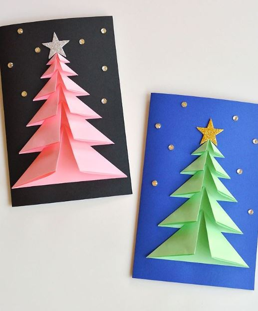

This article has been written and researched by our expert Loveable through a precise methodology. [Learn more about our methodology](https://avada.io/loveable/our-methodological.html)

[Loveable](https://avada.io/loveable/) > [Blog](https://avada.io/loveable/blog/) > [Holiday](https://avada.io/loveable/holiday/)

# Heartwarming DIY Christmas Card Ideas for Family and Friends

Written by [Blake Simpson](https://avada.io/loveable/author/blake/) Last Updated on September 07, 2023

- [Heartwarming DIY Christmas Card Ideas for Family and Friends](https://avada.io/loveable/blog/christmas-card-ideas/#wp-block-heading-2-3)
    - [3-D Christmas Tree Card](https://avada.io/loveable/blog/christmas-card-ideas/#wp-block-heading-3-4)
    - [Handwritten Christmas Card](https://avada.io/loveable/blog/christmas-card-ideas/#wp-block-heading-3-8)
    - [Abstract Colorful Christmas Card](https://avada.io/loveable/blog/christmas-card-ideas/#wp-block-heading-3-12)
    - [Cotton Ball Snowman Card](https://avada.io/loveable/blog/christmas-card-ideas/#wp-block-heading-3-17)
    - [Papercut Holiday Cards](https://avada.io/loveable/blog/christmas-card-ideas/#wp-block-heading-3-21)
    - [Homemade Watercolor Christmas Cards](https://avada.io/loveable/blog/christmas-card-ideas/#wp-block-heading-3-25)
    - [Hand Lettered Holiday Cards](https://avada.io/loveable/blog/christmas-card-ideas/#wp-block-heading-3-29)
    - [Watercolor Christmas Wreath Cards](https://avada.io/loveable/blog/christmas-card-ideas/#wp-block-heading-3-33)
    - [Printable holiday cards](https://avada.io/loveable/blog/christmas-card-ideas/#wp-block-heading-3-37)
    - [Magic Trick Christmas Card](https://avada.io/loveable/blog/christmas-card-ideas/#wp-block-heading-3-41)
    - [Washi Tape Christmas Tree Card](https://avada.io/loveable/blog/christmas-card-ideas/#wp-block-heading-3-45)
    - [Snow Globe Shaker Card](https://avada.io/loveable/blog/christmas-card-ideas/#wp-block-heading-3-49)
    - [Paint Chip Christmas Card](https://avada.io/loveable/blog/christmas-card-ideas/#wp-block-heading-3-53)
    - [Button Snowman Card](https://avada.io/loveable/blog/christmas-card-ideas/#wp-block-heading-3-57)
    - [Eraser Stamp Holiday Card](https://avada.io/loveable/blog/christmas-card-ideas/#wp-block-heading-3-61)
    - [Mini Wreath Holiday Cards](https://avada.io/loveable/blog/christmas-card-ideas/#wp-block-heading-3-65)
    - [Snowman Christmas Card](https://avada.io/loveable/blog/christmas-card-ideas/#wp-block-heading-3-69)
    - [Watercolor card](https://avada.io/loveable/blog/christmas-card-ideas/#wp-block-heading-3-73)
    - [Christmas card ornament](https://avada.io/loveable/blog/christmas-card-ideas/#wp-block-heading-3-77)
    - [Beaded Christmas card](https://avada.io/loveable/blog/christmas-card-ideas/#wp-block-heading-3-81)
    - [‘Merry & Bright’ card](https://avada.io/loveable/blog/christmas-card-ideas/#wp-block-heading-3-85)
    - [Stitched Christmas Card](https://avada.io/loveable/blog/christmas-card-ideas/#wp-block-heading-3-89)
    - [Paper Strips Christmas Tree Card](https://avada.io/loveable/blog/christmas-card-ideas/#wp-block-heading-3-93)
    - [Paper Cut Wreath Christmas Card](https://avada.io/loveable/blog/christmas-card-ideas/#wp-block-heading-3-97)
    - [Pop-Up Rudolph Christmas Card](https://avada.io/loveable/blog/christmas-card-ideas/#wp-block-heading-3-101)
    - [Paper Doll Family Christmas Card](https://avada.io/loveable/blog/christmas-card-ideas/#wp-block-heading-3-105)
    - [Paper Quilling Christmas Tree Card](https://avada.io/loveable/blog/christmas-card-ideas/#wp-block-heading-3-109)
    - [Pom Pom Christmas Card](https://avada.io/loveable/blog/christmas-card-ideas/#wp-block-heading-3-113)
    - [Paper Cut Christmas Card](https://avada.io/loveable/blog/christmas-card-ideas/#wp-block-heading-3-117)
    - [Gift Box Christmas Card](https://avada.io/loveable/blog/christmas-card-ideas/#wp-block-heading-3-121)
- [5 Best Ideas for Christmas Cards](https://avada.io/loveable/blog/christmas-card-ideas/#wp-block-heading-2-125)
    - [Hello Cards with Envelopes](https://avada.io/loveable/blog/christmas-card-ideas/#wp-block-heading-3-126)
    - [Holiday Cards Boxed with Envelopes](https://avada.io/loveable/blog/christmas-card-ideas/#wp-block-heading-3-130)
    - [Boxed Christmas Cards Assortment](https://avada.io/loveable/blog/christmas-card-ideas/#wp-block-heading-3-133)
    - [Paper Love Pop Up Christmas Card](https://avada.io/loveable/blog/christmas-card-ideas/#wp-block-heading-3-137)
    - [Street All Together Christmas Cards](https://avada.io/loveable/blog/christmas-card-ideas/#wp-block-heading-3-141)
- [Wrapping Up,](https://avada.io/loveable/blog/christmas-card-ideas/#wp-block-heading-2-145)

Get ready to spread the holiday cheer with a heartfelt touch! This season, dive into the enchanting world of DIY Christmas cards that are more than just paper and glitter – they’re a labor of love.

Whether you’re a crafting connoisseur or just starting out, our collection of heartwarming **DIY Christmas card ideas** is here to inspire you. Join us as we unwrap a sleigh full of creativity and guide you through crafting personalized greetings that will warm the hearts of your cherished family and friends. Let’s make this festive season unforgettable, one handmade card at a time!

## **Heartwarming DIY Christmas Card Ideas for Family and Friends**

### **3-D Christmas Tree Card**

Three-dimensional cards never fail to captivate, and your self-made creation will undoubtedly leave an even greater impression! Crafting the trees is a simple process: cut varying-sized paper squares, fold them into triangles, and then expertly assemble them with glue. Elevate your design by incorporating a gemstone pattern to adorn the stars – a personal touch that adds to the overall charm of your masterpiece!

[How to make 3-D Christmas Tree Card!](https://onelittleproject.com/christmas-tree-card/)

### **Handwritten Christmas Card**

Infusing a handwritten feel adds a charming element, but penning fifteen cards can be quite a time-intensive task. An alternative approach is to pen a single festive phrase, scan it, and subsequently imprint it onto your design or photographs across numerous cards. This technique allows for efficiency without compromising the personalized touch.

[How to make a Handwritten Christmas Card!](https://almostmakesperfect.com/how-to-make-your-own-handwritten-holiday-card/)

### **Abstract Colorful Christmas Card**

Each brushstroke and hue converge to craft an abstract symphony, capturing the essence of the holiday season uniquely.

Creating these intricate cards is an engaging process that allows both young and old to channel their inner artist. Set your imagination free as you embark on an enjoyable coloring adventure that yields a personalized masterpiece, perfect for sharing warm wishes and spreading holiday joy.

[How to make Abstract Colorful Christmas Card!](https://www.easypeasyandfun.com/abstract-colorful-homemade-christmas-card/)

### **Cotton Ball Snowman Card**

Looking for creative Christmas card ideas? Meet our adorable snowman creation! These cards radiate not only cuteness and individuality but also a warm and cozy ambiance. Customize the snowman’s body with your family photos and add a playful touch by attaching cotton balls to mimic the look of snow.

[How to make Cotton Ball Snowman Card!](https://www.easypeasyandfun.com/cotton-ball-snowman-craft/)

### **Papercut Holiday Cards**

Crafting these stunning jewel-toned greeting cards provides just as much enjoyment as receiving them. Take your pick from a pair of distinct downloadable templates featuring designs conveying “Happy Holidays” and “Peace.”

[How to make Papercut Holiday Cards!](https://liagriffith.com/papercut-christmas-wreath-cards/?sscid=81k7_c82j2)

### **Homemade Watercolor Christmas Cards**

Creating these exquisite watercolor cards is a breeze, even if you don’t perceive yourself as artistically inclined. Experiment with unconventional holiday hues, such as soft blue or delicate pink, for a unique twist.

[How to make Homemade Watercolor Christmas Cards!](https://persialou.com/homemade-watercolor-christmas-cards-at/)

### **Hand Lettered Holiday Cards**

While these holiday cards are available as printables, they possess an intimate touch due to their hand-lettered design and watercolor appearance. With a selection of four distinctive designs, you also have the option to create complementary gift tags for a coordinated ensemble.

[How to make Hand Lettered Holiday Cards!](https://www.lemonthistle.com/free-printable-holiday-cards-tags/)

### **Watercolor Christmas Wreath Cards**

Believe that watercolor is beyond your capabilities? This delightful and uncomplicated DIY endeavor presents an ideal chance to challenge that notion. You can even enhance the appeal by adding an adorable coordinating detail to the interior of your envelopes.

[How to make Watercolor Christmas Wreath Cards!](https://lovelyindeed.com/diy-watercolor-holiday-cards-envelope-liners/)

### **Printable holiday cards**

Tired of waiting for your photo cards to arrive by mail? Why not add a personal touch to your holiday greetings this year? Embrace a touch of nostalgia and creativity with our retro-inspired printable holiday card template. Skip the anticipation and enjoy the satisfaction of crafting your own personalized cards right from the comfort of your home.

[How to make Printable holiday cards!](https://abeautifulmess.com/print-your-own-holiday-cards-free-template-included/)

### **Magic Trick Christmas Card**

Picture the wonder on the faces of the children belonging to your family and friends as they experience the magic firsthand. With a gentle pull of the line drawing of Santa Claus, watch as his colors transform before your eyes, magically transitioning from a simple sketch to a vibrant display of red and white. It’s an enchanting spectacle that captures the spirit of the season in an unforgettable way.

[How to make Magic Trick Christmas Card!](https://www.hellowonderful.co/post/DIY-MAGIC-TRICK-CHRISTMAS-CARD/)

### **Washi Tape Christmas Tree Card**

Embark on a joyful crafting journey this holiday season with our Washi Tape Christmas Tree Card, a delightful project that promises both simplicity and creativity. Immerse yourself in the world of DIY greetings and experience the satisfaction of crafting your very own [personalized Christmas cards](https://avada.io/loveable/personalized-christmas-cards/), showcasing your artistic flair in just a matter of minutes.

[How to make Washi Tape Christmas Tree Card!](http://www.omiyageblogs.ca/2013/11/simple-christmas-cards.html)

### **Snow Globe Shaker Card**

This is a delightful and personalized way to spread joy and warmth to your loved ones. Transform your ordinary Christmas greetings into captivating mini winter wonderlands that capture the essence of the season.

[How to make Snow Globe Shaker Card!](https://mayholicraft.wordpress.com/2014/09/12/waffle-flower-snow-globe-shaker-cards/)

### **Paint Chip Christmas Card**

Give new life to old paint chips this holiday season and embark on a creative journey that transforms discarded materials into a joyful masterpiece. Using a splash of imagination, repurpose these paint chips into a colorful array of charming Christmas trees, breathing life into your greetings and sending heartfelt wishes to your cherished loved ones.

[How to Make Paint Chip Christmas Card!](http://onelittleproject.com/paint-chip-christmas-cards/)

### **Button Snowman Card**

Elevate your Christmas card ideas with the endearing Button Snowman Card, a delightful creation that exudes holiday cheer through a charming snowman crafted entirely from colorful buttons. 

[How to make Button Snowman Card!](http://deedeecampbell.blogspot.com/2012/12/3-button-snowman-card-and-christmas.html)

### **Eraser Stamp Holiday Card**

If you’re in search of a rewarding and engaging craft project that brings the family together, look no further. These charming cards provide an avenue for endless fun and imaginative exploration, making them the perfect choice for crafting memorable holiday greetings.

[How to make Eraser Stamp Holiday Card!](https://liagriffith.com/eraser-stamp-holiday-card-for-kids/?sscid=81k7_c86ah)

### **Mini Wreath Holiday Cards**

Every card becomes a testament to the beauty of simplicity and the power of a thoughtful gesture. The fragrance of rosemary and the rustic charm of boxwood convey more than just words – they convey a sense of tradition, comfort, and joy that are synonymous with the holiday season.

[How to make Mini Wreath Holiday Cards!](http://www.frolic-blog.com/2011/11/miniwreathholidaycards/)

### **Snowman Christmas Card**

Snowmen stand as an emblematic and timeless Christmas symbol, evoking visions of snowy days shared with loved ones, not to mention the beloved Frosty character. If the nostalgia and warmth linked to snowmen resonate with you, you might want to replicate the charm of this adorable card design.

[How to make Snowman Christmas Card!](https://thekingstonhome.com/blog/how-to-assemble-intricate-layered-die-cuts-with-xyron/)

### **Watercolor card**

If you’ve never thought of yourself as an artist, you’ll be pleasantly surprised to discover that you can create your own watercolor holiday cards. The process is much simpler than you imagine, particularly when following this step-by-step tutorial.

[How to make a Watercolor card!](https://www.smilingcolors.com/easy-watercolor-holiday-cards/)

### **Christmas card ornament**

Why settle for the usual run-of-the-mill Christmas cards when you can embark on a delightful crafting journey to create DIY Christmas card ornaments? Not only will this inventive approach bring a unique and personalized touch to your holiday greetings, but it also unveils a charming surprise for your friends and family.

[How to make Christmas card ornament!](https://www.abbottsathome.com/diy-christmas-card-ornaments/)

### **Beaded Christmas card**

You may recall those enchanting tiny beads that fascinated you in your childhood days. Now, envision unlocking their potential beyond bracelet-making. Picture fashioning a captivating beaded wreath that graces the front of a joyous holiday card. It’s a wonderful way to infuse creativity into your holiday greetings and explore unique Christmas card ideas.

[How to make a Beaded Christmas card!](https://www.craftmehappy.com/2017/12/mini-hama-bead-wreath-christmas-card.html)

### **‘Merry & Bright’ card**

The subtle touch of faux wood veneer imparts a cozy and rustic feel, while a wreath adorned with luscious berries and a collection of other carefully chosen festive embellishments further enhance the card’s enchanting appeal. A harmonious fusion of elements ensures that this card captures the joyful spirit of the holidays truly captivatingly.

[How to make ‘Merry & Bright’ card!](http://www.sprinkledwithglitter.com/blog/merry-and-bright-faux-wood-veneer)

### **Stitched Christmas Card**

Elevate your seasonal greetings with our exquisite hand-stitched holiday cards, carefully crafted using vibrant embroidery floss. Each card boasts a meticulous touch of artisanal stitching, creating an enchanting and visually captivating design that is certain to leave a lasting impression on your fortunate recipients. 

[How to make Stitched Christmas Card!](https://www.womansday.com/home/crafts-projects/how-to/a5256/christmas-craft-stitched-cards-111778/)

### **Paper Strips Christmas Tree Card**

If you find leftover scrap paper and are pondering ways to repurpose it, here’s a delightful solution: fashion charming Christmas tree cards using those very paper strips. Embrace your creativity as you transform discarded materials into these cleverly crafted greetings, spreading holiday cheer in an eco-friendly and imaginative manner.

[How to make Paper Strips Christmas Tree Card!](https://www.easypeasyandfun.com/paper-strips-tree-christmas-card/)

### **Paper Cut Wreath Christmas Card**

Crafting this unique card is a joyful experience that not only brings out your artistic flair but also infuses your greetings with a personal touch. As each element of the wreath comes together, it symbolizes unity, harmony, and the spirit of the season – a truly heartfelt representation of the peace we all cherish during this time of year.

[How to make Paper Cut Wreath Christmas Card!](https://amyoneillblog.com/2015/10/21/wreath-of-silver-peace-fms209/)

### **Pop-Up Rudolph Christmas Card**

Unleash the joy of creation for young minds with this enchanting pop-up Rudolph card that brings a 3D reindeer to life. The experience becomes even more delightful when you offer them buttons to adorn the antlers, transforming crafting into a delightful adventure of imagination and hands-on fun.

[How to make Pop-Up Rudolph Christmas Card!](https://www.redtedart.com/pop-up-reindeer-card/)

### **Paper Doll Family Christmas Card**

Bringing a touch of nostalgia to the holiday season, the Paper Doll Family Christmas Card reimagines a beloved classic from your childhood. Embark on a journey down memory lane as we blend the timeless charm of paper dolls with the warmth of festive greetings.

[How to make Paper Doll Family Christmas Card!](https://www.deliacreates.com/paper-doll-family-christmas-card/)

### **Paper Quilling Christmas Tree Card**

Engage in the delightful art of paper quilling with this Christmas card project, an enjoyable endeavor suitable for both young ones and grown-ups alike. The culmination of your efforts yields a creation so captivating that your recipient will be compelled to preserve it as a cherished keepsake for years to come.

[How to make Paper Quilling Christmas Tree Card!](https://artsycraftsymom.com/quilling-christmas-tree-card/)

### **Pom Pom Christmas Card**

Elevate your Christmas card’s charm by incorporating playful pom poms into its design. Transform these fluffy embellishments into a reindeer, a Christmas tree, or a wreath, adorning the front of your card with whimsical holiday motifs that are sure to bring smiles and festive cheer.

[How to make Pom Pom Christmas Card!](https://www.thejoysharing.com/2019/12/pom-pom-christmas-diy-cards.html)

### **Paper Cut Christmas Card**

Channeling the creative essence of Persia Lou, this paper-cut Christmas card boasts a design that truly stands out. While a cutting machine is a must for replicating this cool and intricate pattern, the final masterpiece that emerges is a testament to your dedication – an investment that yields immeasurable satisfaction, particularly if you’re an avid year-round crafter seeking to infuse every season with your artistic spirit.

[How to make a Paper Cut Christmas Card!](https://persialou.com/diy-paper-cut-christmas-cards-free-svg-cut-files/)

### **Gift Box Christmas Card**

Transform old papers into charming gift box motifs by skillfully cutting out square shapes. Elevate these mini gift boxes by adorning them with the sparkle of gems, the charm of buttons, and the creative touch of washi tape, resulting in a delightful Christmas card that exudes the joy of giving and receiving.

[How to make Gift Box Christmas Card!](https://www.thejoysharing.com/2020/12/gift-box-card.html)

## **5** **Best Ideas for Christmas Cards**

### [**Hello Cards with Envelopes**](https://www.amazon.com/Occasion-Assorted-Blank-Inside-Cards/dp/B01MZYXNYZ/)

This comprehensive set includes 48 charming cards, each measuring 4×6 inches, and adorned with six distinct modern designs. Crafted from premium white cardstock paper, these cards provide a luxurious canvas for your words, ensuring they leave a lasting impression on friends, family, teachers, and students alike.

The included envelopes not only add a touch of elegance but also enhance the anticipation of receiving your heartfelt message. Let these Christmas card ideas bear the promise of a meaningful connection and a cherished keepsake.

### [**Holiday Cards Boxed with Envelopes**](https://www.amazon.com/Papyrus-Polar-Holiday-Envelopes-20-Count/dp/B07FCR6V52/)

Capture the spirit of the season with these festive Christmas cards from Papyrus, adorned with a charming polar bear playfully brought to life through shimmering glitter and elegant foil accents. Each card is a testament to the art of celebration, offering a unique and enchanting touch to your holiday greetings.

### [**Boxed Christmas Cards Assortment**](https://www.amazon.com/Hallmark-Kinkade-Christmas-Assortment-Envelopes/dp/B01LXE6MV0/)

Experience the charm of the holiday season with our thoughtfully curated boxed set of nostalgic Christmas cards – a heartwarming way to extend warm wishes to your cherished friends and family.

Embrace the timeless beauty of three distinct designs, each graced with the iconic Thomas Kinkade touch, showcasing picturesque snowy houses. You’ll find heartfelt [Christmas card messages](https://avada.io/loveable/christmas-card-messages/) in this collection that perfectly capture the season’s essence. 

### [**Paper Love Pop Up Christmas Card**](https://www.amazon.com/Frndly-Christmas-Handcrafted-Greeting-Eco-Friendly/dp/B0BF2W5J73/)

While closed, it presents a sleek and compact appearance. Yet, upon opening, a captivating 3D pop-up scene of a beautifully designed “Bird House” Christmas theme emerges, intricately crafted to surprise and enchant your friends and family.

This delightful card serves as a heartwarming gesture of love during the holiday season. Its interior features a separate blank message tag, allowing you to compose a personalized note without ever needing to touch your pen to the card itself. This ensures that your heartfelt message remains distinct and undisturbed, preserving the intricate beauty of the 3D pop-up design.

### [**Street All Together Christmas Cards**](https://www.amazon.com/Together-Christmas-Holiday-Matching-Envelopes/dp/B07WVS2WN8/)

Included in this set are 25 holiday cards, thoughtfully paired with blank white envelopes. The cards themselves measure 4 5/8″ x 6 1/4″ when folded, offering a convenient size that is both accommodating and easy to handle. Each card is meticulously scored for effortless folding and is compatible with standard postage, ensuring seamless mailing.

What sets these cards apart is their unique and vibrant design, exclusive to Canopy Street. This one-of-a-kind Christmas holiday motif brings a burst of color and joy that is sure to delight recipients. 

## **Wrapping Up,**

In the spirit of the season, these **heartwarming DIY Christmas card ideas** offer a delightful way to express your love and warm wishes to family and friends. By infusing your creativity and personal touch into each card, you not only spread holiday cheer but also create cherished memories that will be displayed and treasured for years to come. 

Embrace the joy of crafting and sharing these homemade greetings, and let the magic of the holidays shine through every heartfelt design.

- [Heartwarming DIY Christmas Card Ideas for Family and Friends](https://avada.io/loveable/blog/christmas-card-ideas/#wp-block-heading-2-3)
    - [3-D Christmas Tree Card](https://avada.io/loveable/blog/christmas-card-ideas/#wp-block-heading-3-4)
    - [Handwritten Christmas Card](https://avada.io/loveable/blog/christmas-card-ideas/#wp-block-heading-3-8)
    - [Abstract Colorful Christmas Card](https://avada.io/loveable/blog/christmas-card-ideas/#wp-block-heading-3-12)
    - [Cotton Ball Snowman Card](https://avada.io/loveable/blog/christmas-card-ideas/#wp-block-heading-3-17)
    - [Papercut Holiday Cards](https://avada.io/loveable/blog/christmas-card-ideas/#wp-block-heading-3-21)
    - [Homemade Watercolor Christmas Cards](https://avada.io/loveable/blog/christmas-card-ideas/#wp-block-heading-3-25)
    - [Hand Lettered Holiday Cards](https://avada.io/loveable/blog/christmas-card-ideas/#wp-block-heading-3-29)
    - [Watercolor Christmas Wreath Cards](https://avada.io/loveable/blog/christmas-card-ideas/#wp-block-heading-3-33)
    - [Printable holiday cards](https://avada.io/loveable/blog/christmas-card-ideas/#wp-block-heading-3-37)
    - [Magic Trick Christmas Card](https://avada.io/loveable/blog/christmas-card-ideas/#wp-block-heading-3-41)
    - [Washi Tape Christmas Tree Card](https://avada.io/loveable/blog/christmas-card-ideas/#wp-block-heading-3-45)
    - [Snow Globe Shaker Card](https://avada.io/loveable/blog/christmas-card-ideas/#wp-block-heading-3-49)
    - [Paint Chip Christmas Card](https://avada.io/loveable/blog/christmas-card-ideas/#wp-block-heading-3-53)
    - [Button Snowman Card](https://avada.io/loveable/blog/christmas-card-ideas/#wp-block-heading-3-57)
    - [Eraser Stamp Holiday Card](https://avada.io/loveable/blog/christmas-card-ideas/#wp-block-heading-3-61)
    - [Mini Wreath Holiday Cards](https://avada.io/loveable/blog/christmas-card-ideas/#wp-block-heading-3-65)
    - [Snowman Christmas Card](https://avada.io/loveable/blog/christmas-card-ideas/#wp-block-heading-3-69)
    - [Watercolor card](https://avada.io/loveable/blog/christmas-card-ideas/#wp-block-heading-3-73)
    - [Christmas card ornament](https://avada.io/loveable/blog/christmas-card-ideas/#wp-block-heading-3-77)
    - [Beaded Christmas card](https://avada.io/loveable/blog/christmas-card-ideas/#wp-block-heading-3-81)
    - [‘Merry & Bright’ card](https://avada.io/loveable/blog/christmas-card-ideas/#wp-block-heading-3-85)
    - [Stitched Christmas Card](https://avada.io/loveable/blog/christmas-card-ideas/#wp-block-heading-3-89)
    - [Paper Strips Christmas Tree Card](https://avada.io/loveable/blog/christmas-card-ideas/#wp-block-heading-3-93)
    - [Paper Cut Wreath Christmas Card](https://avada.io/loveable/blog/christmas-card-ideas/#wp-block-heading-3-97)
    - [Pop-Up Rudolph Christmas Card](https://avada.io/loveable/blog/christmas-card-ideas/#wp-block-heading-3-101)
    - [Paper Doll Family Christmas Card](https://avada.io/loveable/blog/christmas-card-ideas/#wp-block-heading-3-105)
    - [Paper Quilling Christmas Tree Card](https://avada.io/loveable/blog/christmas-card-ideas/#wp-block-heading-3-109)
    - [Pom Pom Christmas Card](https://avada.io/loveable/blog/christmas-card-ideas/#wp-block-heading-3-113)
    - [Paper Cut Christmas Card](https://avada.io/loveable/blog/christmas-card-ideas/#wp-block-heading-3-117)
    - [Gift Box Christmas Card](https://avada.io/loveable/blog/christmas-card-ideas/#wp-block-heading-3-121)
- [5 Best Ideas for Christmas Cards](https://avada.io/loveable/blog/christmas-card-ideas/#wp-block-heading-2-125)
    - [Hello Cards with Envelopes](https://avada.io/loveable/blog/christmas-card-ideas/#wp-block-heading-3-126)
    - [Holiday Cards Boxed with Envelopes](https://avada.io/loveable/blog/christmas-card-ideas/#wp-block-heading-3-130)
    - [Boxed Christmas Cards Assortment](https://avada.io/loveable/blog/christmas-card-ideas/#wp-block-heading-3-133)
    - [Paper Love Pop Up Christmas Card](https://avada.io/loveable/blog/christmas-card-ideas/#wp-block-heading-3-137)
    - [Street All Together Christmas Cards](https://avada.io/loveable/blog/christmas-card-ideas/#wp-block-heading-3-141)
- [Wrapping Up,](https://avada.io/loveable/blog/christmas-card-ideas/#wp-block-heading-2-145)

### [Blake Simpson](https://avada.io/loveable/author/blake/)

Hi, I'm Blake from Loveable. I help people find perfect gifts for occasions like anniversaries and weddings. I also write a blog about holidays, sharing insights to make them more meaningful. Let's create unforgettable moments together!

- [Twitter](https://twitter.com/intent/tweet)
- [Facebook](https://www.facebook.com/sharer/sharer.php)
- [instagram](https://avada.io/loveable/blog/christmas-card-ideas/)
- [pinterest](https://www.pinterest.com/loveablellc/)

## Related Posts

[### 120+ Christian Birthday Wishes To Spread Your Love](https://avada.io/loveable/blog/christian-birthday-wishes/) 

[

### 35 Best 70th Birthday Ideas To Celebrate The Special Milestone

](https://avada.io/loveable/blog/70th-birthday-ideas/)

[

### 50 Best 30th Birthday Decorations for a Remarkable Birthday Bash

](https://avada.io/loveable/blog/30th-birthday-decorations/)

[

### 40 Delicious Vegan Christmas Desserts to Delight Your Palate

](https://avada.io/loveable/blog/vegan-christmas-desserts/)

[

### 60 Christmas Team Building Activities to Boost Workplace Spirit

](https://avada.io/loveable/blog/christmas-team-building-activities/)
