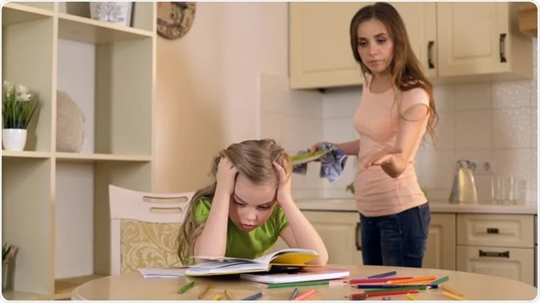

This article has been written and researched by our expert Loveable through a precise methodology. [Learn more about our methodology](https://avada.io/loveable/our-methodological.html)

[Loveable](https://avada.io/loveable/) > [Blog](https://avada.io/loveable/blog/) > [Parenting](https://avada.io/loveable/parenting/)

# Helicopter Parenting: Understanding the Pros, Cons, and Impact on Children

Written by [Benjamin Collins](https://avada.io/loveable/author/benjamin/) Last Updated on August 28, 2023

- [The Example of Helicopter Parenting](https://avada.io/loveable/blog/helicopter-parenting/#wp-block-heading-2-2) 
- [What Results in Helicopter Parenting?](https://avada.io/loveable/blog/helicopter-parenting/#wp-block-heading-2-7) 
- [The Advantages of Helicopter Parenting](https://avada.io/loveable/blog/helicopter-parenting/#wp-block-heading-2-15) 
- [The Drawbacks of Helicopter Parenting](https://avada.io/loveable/blog/helicopter-parenting/#wp-block-heading-2-24) 
- [Bottom Line](https://avada.io/loveable/blog/helicopter-parenting/#wp-block-heading-2-37) 

A kind of extremely engaged and overprotective parenting known as “_helicopter parenting_” involves parents closely supervising their children’s actions and choices. In today’s world, **helicopter parenting** is more and more common. Helicopter parents have the best of intentions when they try to shield their kids from danger, offer constant supervision, and guarantee their success in all facets of life. It is essential for parents and society as a whole to comprehend the effects of helicopter parenting on children. This article will help parents to establish a balance that encourages their children’s growth, well-being, and ultimate independence.

##   
The Example of Helicopter Parenting 

Imagine you are a college student who has just moved into the dorms for the first time. As you start unpacking and settling into your new space, your parent, who exhibits helicopter parenting tendencies, constantly calls and texts you. They ask about every detail of your day, from what you ate for breakfast to who your new friends are. 

As the days go by, your parents continue to check in on you excessively, often calling multiple times a day to inquire about your schedule, classes, and assignments. They want to ensure you are attending all your lectures in all ways, such as contacting your professors to discuss your academic progress without your knowledge. While their intentions may come from a place of love and concern, you begin to feel suffocated and unable to make your own decisions. Despite being a capable and responsible young adult, you find yourself constantly seeking their approval and second-guessing your choices.

This example highlights the detrimental effects of helicopter parenting, where a parent’s excessive involvement and constant monitoring can hinder a young adult’s ability to develop autonomy, [decision-making skills](https://zety.com/blog/decision-making-skills-resume), and self-confidence.

## What Results in Helicopter Parenting? 

Helicopter parenting can result from a combination of factors, including societal influences, parental fears, and personal parenting styles. Here are some common factors that contribute to the emergence of helicopter parenting:

- **Fear of potential dangers**: In today’s world, parents are exposed to constant news and information about potential risks and dangers that their children may face. This fear can lead parents to adopt a hyper-vigilant approach, constantly monitoring their children’s activities to ensure their safety.

- **High expectations and pressure for success**: Parents may feel intense pressure to raise high-achieving children who excel academically, athletically, or socially. They believe that by closely supervising and directing their children’s every move, they can maximize their chances of success.

- **Cultural and societal norms**: Some cultural and societal norms emphasize the importance of parental involvement and achievement. Parents may feel compelled to engage in helicopter parenting to meet these perceived expectations and to secure their children’s future.

- **Lack of trust in children’s abilities**: Helicopter parents may struggle to trust their children’s judgment and decision-making skills. They may believe that their children are incapable of handling challenges or making sound choices independently, leading them to take on a more intrusive role.

It is important to note that while these factors contribute to the development of helicopter parenting, each family’s situation is unique, and the motivations behind such parenting styles can vary. Understanding the underlying factors can help parents and caregivers reflect on their own parenting approach and make conscious decisions to find a balance between involvement and allowing children to develop independence.

## The Advantages of Helicopter Parenting 

Helicopter parenting is believed to offer certain advantages. Here are some potential benefits associated with helicopter parenting:

- **Safety and protection**: Helicopter parents prioritize their children’s safety and well-being. By closely monitoring their activities, they can help prevent potential dangers and ensure their children’s physical security.

- **Emotional support**: Helicopter parents are highly involved in their children’s lives, offering emotional support and reassurance. Their constant presence and involvement can create a sense of security and comfort, fostering a strong parent-child bond.

- **Development of discipline and responsibility**: The high level of involvement and guidance from helicopter parents can instill discipline and a sense of responsibility in their children. They may set clear expectations, establish routines, and enforce rules, which can promote self-discipline and accountability.

- **Skill development**: Helicopter parents often provide their children with numerous opportunities for skill development. They may enroll them in various extracurricular activities, classes, and lessons, fostering the acquisition of new talents and enhancing their overall skill set.

- **Confidence and self-esteem**: Helicopter parents frequently praise and validate their children’s achievements. This consistent positive reinforcement can contribute to developing confidence and self-esteem, as children feel supported and encouraged in their endeavors.

**_Check Out:_** 4 [Types Of Parenting Styles](https://avada.io/loveable/types-of-parenting-styles/) And Effects On Children | According To Psychologists

## The Drawbacks of Helicopter Parenting 

Despite its well-intentioned nature, helicopter parenting has several disadvantages that can negatively impact children’s development. Here are some of the common drawbacks associated with helicopter parenting:

- **Lack of autonomy and independence**: Helicopter parents’ constant involvement can impede a child’s ability to make decisions, solve problems, and develop a sense of independence. They may struggle with decision-making, assertiveness, and taking responsibility for their actions.

- **Reduced resilience and coping skills**: Helicopter parenting often shields children from experiencing failure, disappointment, or challenges. As a result, children may lack the resilience and problem-solving skills necessary to navigate setbacks and adapt to difficult situations later in life.

- **Limited risk-taking and exploration**: Helicopter parenting discourages children from taking risks and exploring new experiences. The fear of potential harm or failure can restrict their personal growth, creativity, and self-discovery opportunities.

- **Strained parent-child relationship**: The constant monitoring and intervention of helicopter parents can create tension and strain in the parent-child relationship. Children may feel smothered, controlled, or unable to express their own opinions and desires, leading to a breakdown in communication and trust.

- **Difficulty in problem-solving and decision-making**: Helicopter parenting can hinder a child’s ability to develop essential problem-solving and decision-making skills. They may struggle to think critically, assess risks, and make choices independently, as they are accustomed to relying on their parents for guidance.

- **Impaired social skills**: Overly involved parents may inadvertently hinder the development of their child’s social skills. With limited opportunities for independent social interactions, children may struggle with forming and maintaining relationships, resolving conflicts, and developing effective communication skills.

Understanding these disadvantages can help parents and caregivers reflect on their parenting style and find a balance that allows children to develop essential life skills, autonomy, and resilience. Encouraging age-appropriate independence, fostering open communication, and providing opportunities for growth and self-discovery are crucial for healthy child development.

**_See More:_**

- [Free-Range Parenting](https://avada.io/loveable/blog/free-range-parenting/) And All Things You Need To Know

- [Parenting with Depression](https://avada.io/loveable/blog/parenting-with-depression/): Strategies for Coping, Seeking Help

## Bottom Line 

While **helicopter parenting** can provide safety, academic support, and emotional reassurance, it also hinders autonomy, resilience, and social skills. The impact of helicopter parenting can manifest in reduced self-confidence, limited decision-making abilities, and heightened anxiety. Recognizing these effects empowers parents to strike a balance that nurtures independence, fosters open communication, and promotes acquiring essential life skills. 

Parents can guide their children toward healthy growth and development by fostering a supportive and empowering environment, preparing them for a successful and fulfilling future. And by understanding the pros, cons, and impact of helicopter parenting, parents can make informed choices that support their children’s holistic development and pave the way for a successful and fulfilling future.

- [The Example of Helicopter Parenting](https://avada.io/loveable/blog/helicopter-parenting/#wp-block-heading-2-2) 
- [What Results in Helicopter Parenting?](https://avada.io/loveable/blog/helicopter-parenting/#wp-block-heading-2-7) 
- [The Advantages of Helicopter Parenting](https://avada.io/loveable/blog/helicopter-parenting/#wp-block-heading-2-15) 
- [The Drawbacks of Helicopter Parenting](https://avada.io/loveable/blog/helicopter-parenting/#wp-block-heading-2-24) 
- [Bottom Line](https://avada.io/loveable/blog/helicopter-parenting/#wp-block-heading-2-37) 

### [Benjamin Collins](https://avada.io/loveable/author/benjamin/)

I'm Benjamin Collins, a gift ideas creator at Loveable. We specialize in unique and personalized gifts for any occasion. With my honed skills, I recommend gifts tailored to the recipient's personality and interests, whether it's Halloween, Christmas, or any other celebration.

- [Twitter](https://twitter.com/intent/tweet)
- [Facebook](https://www.facebook.com/sharer/sharer.php)
- [instagram](https://avada.io/loveable/blog/helicopter-parenting/)
- [pinterest](https://www.pinterest.com/loveablellc/)

## Related Posts

[

### 79 Heartfelt Missing Mom Quotes for Expressing Love and Longing

](https://avada.io/loveable/blog/missing-mom-quotes/)

[

### Parenting with Depression: Strategies for Coping, Seeking Help, and Building Resilience

](https://avada.io/loveable/blog/parenting-with-depression/)

[

### 100 Empowering Single Mom Quotes: Inspirational Words for Strong Mothers

](https://avada.io/loveable/blog/single-mom-quotes/)

[

### 99+ Heartfelt Quotes And Wishes: Happy Anniversary to Mom and Dad!

](https://avada.io/loveable/blog/quotes-happy-anniversary-mom-dad/)

[

### 5 Ways to Foster a Positive Parent-Teacher Relationship

](https://avada.io/loveable/blog/parent-teacher-relationship/)
