This article has been written and researched by our expert Loveable through a precise methodology. [Learn more about our methodology](https://avada.io/loveable/our-methodological.html)

[Loveable](https://avada.io/loveable/) > [Blog](https://avada.io/loveable/blog/) > [Holiday](https://avada.io/loveable/holiday/)

# Hosting a Memorable Mother’s Day Brunch: Tips And Recipes

Written by [Blake Simpson](https://avada.io/loveable/author/blake/) Last Updated on August 22, 2023

- [Tips for Hosting a Mother’s Day Brunch](https://avada.io/loveable/blog/memorable-mother-day-brunch/#wp-block-heading-2-3)
    - [Prepare in advance](https://avada.io/loveable/blog/memorable-mother-day-brunch/#wp-block-heading-3-4)
    - [Set the table](https://avada.io/loveable/blog/memorable-mother-day-brunch/#wp-block-heading-3-7)
    - [Plan a varied menu](https://avada.io/loveable/blog/memorable-mother-day-brunch/#wp-block-heading-3-10) 
    - [Keep the basic dish](https://avada.io/loveable/blog/memorable-mother-day-brunch/#wp-block-heading-3-13)
    - [Don’t forget the beverage](https://avada.io/loveable/blog/memorable-mother-day-brunch/#wp-block-heading-3-16)
    - [Make it decorative](https://avada.io/loveable/blog/memorable-mother-day-brunch/#wp-block-heading-3-19)
    - [Finish with the sweet](https://avada.io/loveable/blog/memorable-mother-day-brunch/#wp-block-heading-3-22)
- [Delicious Brunch Recipe Ideas for Mother’s Day](https://avada.io/loveable/blog/memorable-mother-day-brunch/#wp-block-heading-2-25)
    - [Bacon, Egg and Cheese Toast Bowls](https://avada.io/loveable/blog/memorable-mother-day-brunch/#wp-block-heading-3-26)
    - [Pancake Cake with Berries](https://avada.io/loveable/blog/memorable-mother-day-brunch/#wp-block-heading-3-30)
    - [Italian Cinnamon Rolls](https://avada.io/loveable/blog/memorable-mother-day-brunch/#wp-block-heading-3-34)
    - [Strawberry Corn Cakes](https://avada.io/loveable/blog/memorable-mother-day-brunch/#wp-block-heading-3-38)
    - [Sheet Pan Mother’s Day Brunch](https://avada.io/loveable/blog/memorable-mother-day-brunch/#wp-block-heading-3-42)
    - [French Toast](https://avada.io/loveable/blog/memorable-mother-day-brunch/#wp-block-heading-3-46)
    - [Special Banana Cake](https://avada.io/loveable/blog/memorable-mother-day-brunch/#wp-block-heading-3-50)
    - [Peach Ginger Bellini](https://avada.io/loveable/blog/memorable-mother-day-brunch/#wp-block-heading-3-54)
    - [Baked Challah French Toast](https://avada.io/loveable/blog/memorable-mother-day-brunch/#wp-block-heading-3-58)
    - [Dutch Baby Pancake with Raspberry-Orange Coulis](https://avada.io/loveable/blog/memorable-mother-day-brunch/#wp-block-heading-3-62)
    - [Green Salad with Brown Butter Walnut Vinaigrette](https://avada.io/loveable/blog/memorable-mother-day-brunch/#wp-block-heading-3-66)
    - [Country Ham Biscuits and Scallion-Pimento Cheese](https://avada.io/loveable/blog/memorable-mother-day-brunch/#wp-block-heading-3-70)
    - [Shrikhand and Pooris](https://avada.io/loveable/blog/memorable-mother-day-brunch/#wp-block-heading-3-74)
    - [Almond Flour Buckwheat Waffles](https://avada.io/loveable/blog/memorable-mother-day-brunch/#wp-block-heading-3-78)
    - [Green Healthy Frittata](https://avada.io/loveable/blog/memorable-mother-day-brunch/#wp-block-heading-3-82)
    - [Healthy Breakfast Casserole](https://avada.io/loveable/blog/memorable-mother-day-brunch/#wp-block-heading-3-86)
    - [Healthy Egg Salad](https://avada.io/loveable/blog/memorable-mother-day-brunch/#wp-block-heading-3-90)
    - [Rainbow Kale Salad with Carrot Ginger Dressing](https://avada.io/loveable/blog/memorable-mother-day-brunch/#wp-block-heading-3-94)
- [Conclusion](https://avada.io/loveable/blog/memorable-mother-day-brunch/#wp-block-heading-2-99)

A well-liked method to honor the important mother in your own life and the contributions that she gives to both your life and the world is by hosting an unforgettable **Mother’s Day brunch**. It’s fun and special to spice things up a bit, even though you can always get her flowers, [a sweet card](https://avada.io/loveable/what-to-write-in-valentines-card/), or some [indulgent chocolate](https://avada.io/loveable/valentines-day-chocolate-gifts/) to help commemorate the day. And mothers worldwide love nothing more than spending time with their children and extended families, particularly when they become older and the passage of time seems to slow down while the rest of the world appears to be speeding up. 

Fortunately, throwing a brunch is the ideal way to accomplish it in style. Moms value the unique occasions they spend with their families and kids. The good news is that hosting a brunch is the ideal way to accomplish it with flair. Therefore, these suggestions should at least help you get started. Of course, your brunch can be as elaborate or as simple as you like. You may save time, and money and enjoy [Mother’s Day](https://avada.io/loveable/personalized-mothers-day-gifts/) by planning ahead a little bit before the event with these Tips and Recipes for **hosting a memorable Mother’s Day brunch**.

## Tips for Hosting a Mother’s Day Brunch

### Prepare in advance

The best hosts anticipate guests’ needs to reduce stress, and everything needs to be prepared thoroughly to be successfully completed. Make these necessary lists to get started: customers, menus, and food purchases. Once you’ve mastered the fundamentals, don’t hesitate to ask for assistance or delegate tasks. When it relates to the presentation of food and serving, keep things straightforward, and don’t forget to have fun!

Choosing who to invite, where to have the brunch, and when to host it are the initial steps in preparing a Mother’s Day brunch. The location might also influence whether you want to dress up or keep it simple. As the day is all about your mother, try to take the path you think she would prefer. And every step you make should be concerned with the main character – the mother.

### Set the table

Making a unique tablescape for your mother’s special day might show her that you paid close attention to the little details. You may certainly include her preferences into a lovely tablescape, whether she prefers florals, neutral tones, stunning pinks, gold and sequins, or neutrals and neutral tones. Better still, you can complete this the evening before to avoid having to get up earlier than necessary to bother about the decorations. 

If you make unique cards for places for every one of your guests, you can follow these instructions. Place some candles and a floral arrangement on the table to give it that extra special touch. You can accomplish this without going to a florist if you want to. Look in your backyard or a nearby field of wildflowers, and decorate it according to your mother’s preferences.

### Plan a varied menu 

You should [serve cocktails](https://avada.io/loveable/cocktail-gifts/), coffee, tea, and juice for your brunch. These include alcoholic and non-alcoholic beverages that should be prepared for kids and adults who don’t want to indulge. Build up a mimosa bar if you’d appreciate it if guests mix their own concoctions so that everyone may sample everything.

Brunch ought to be flavorful, sweet, and filling. It might be difficult and time-consuming to plan a dinner. Use, for instance, a ready-made menu you can find online. Create a list of things to buy, schedule your morning, and be ready! Remember to prepare baked products like croissants, quiches, and other dishes in advance. Additionally, ensure that every taste is represented on the menu so clients can choose from a varied menu. 

### Keep the basic dish

Even though it’s a brunch for Mother’s Day, some staple dishes need to be served so that diners of all tastes can choose what they want to eat. Don’t forget to add some green color to the table with vegetable or pumpkin soup to make an interesting first impression on the customers. Some possible options include meat, pork, and grilled beef with several pieces of bread.

You can try combining savory and sweet brunch favorites like doughnuts, fried eggs, and hash browns to satisfy everyone’s desires. Make sure everyone is satisfied and receives what they want by offering a variety of pancake toppings, such as jam, honey, maple syrup, and melted butter, and arrange everything buffet-style.

### Don’t forget the beverage

Brunch is a good time to indulge in a little booze, especially on Mother’s Day! Set the ingredients on a table so your guests can prepare their own, or serve champagne and orange juice for delectable mimosas. But keep in mind to offer a variety of drinks for both individuals who can [consume alcohol](https://avada.io/loveable/alcohol-gifts/) and those who can only have soda or other standard drinks.

Pick juice wine with a low alcohol content if you want to avoid everybody at the brunch party going crazy after drinking it. You can look for some inexpensive wine or, if your money permits, try some high-end beverages from well-known brands. And don’t forget to prepare juice or soda for anyone who has the capacity to consume alcohol. That can be a plus point for your Mother’s Day brunch.

### Make it decorative

It all comes down to Mom, especially when it comes to decor. Think about what she enjoys and strive to provide that. Flowers are a wonderful addition to any space, and if your mum is particularly frilly, you may make them the focal point of your design plan. Place petals of blossoms on the tables, decorate with painted rocks that resemble flowers, and add bows or lace for decoration.

You can strategically position printed phrases across the space to help you communicate your thoughts and extol the virtues of your mother. You can include small details like miniature toy horses on the table or create adorable little “books” with statements about how wonderful mothers are if your mom is passionate about anything, such as reading or horses. 

### Finish with the sweet

We each have a sweet tooth, let’s face it, and there is no better way to sate that sweet tooth than with baked goodies from mom’s preferred neighborhood bakery. Pick up some goodies and keep enjoying your favorite wines from the lovely brunch bar spread you’ve previously put out.

As many sweets as you can make because you never know who might have a sweet tooth. It can range from cakes like cheesecake, tiramisu, or doughnuts, and you can also make some sweet milk or sweets to rehydrate your clients’ palates. You can purchase all of these at a bakery or a confectionary, but remember first to ask the mother what she prefers. And that you have completed hosting a memorable Mother’s Day Brunch.

## Delicious Brunch Recipe Ideas for Mother’s Day

### Bacon, Egg and Cheese Toast Bowls

The toast bowl is the greatest invention since bread. Additionally, they make the ideal carrier for eggs and bacon. But don’t limit yourself to breakfast; they’re also delicious for lunch when stuffed with chicken or tuna salad.

Get the Recipe: [Bacon, Egg and Cheese Toast Bowls](https://www.foodnetwork.com/recipes/food-network-kitchen/bacon-egg-and-cheese-toast-bowls-3696467)

### Pancake Cake with Berries

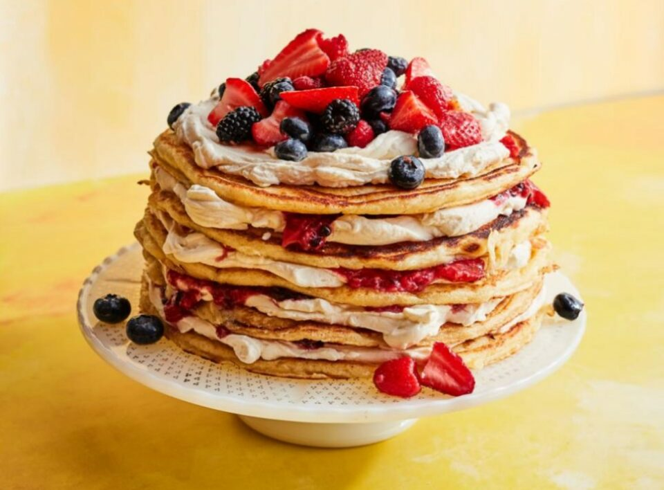

A default option when deciding what should be on the table. Pancakes can be dressed up and stacked high with buttermilk with, whipped cream and sliced strawberries to serve as a breakfast-for-dessert dish since they are technically cakes. Or perhaps a dessert-for-breakfast delight would be even better! The chance of overmixing is decreased by whisking the dry and wet components separately before joining them, which contributes to creating soft and fluffy pancakes.

Get the Recipe: [Pancake Cake with Berries](https://www.foodnetwork.com/recipes/food-network-kitchen/pancake-cake-with-berries-10033306)

### Italian Cinnamon Rolls

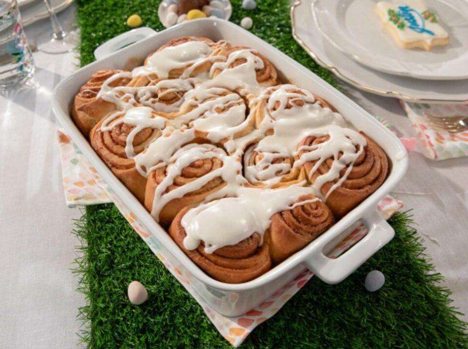

A go-to-choice when considering what to be at the table. Giada adds citrus zest and anise seed to traditional cinnamon buns for an Italian twist that gives the breakfast favorite a faint licorice flavor. A pro suggestion is to prepare the dough in advance (up to two days) to ensure a stress-free breakfast.

Get the Recipe: [Italian Cinnamon Rolls](https://www.foodnetwork.com/recipes/giada-de-laurentiis/italian-cinnamon-rolls-5659526)

### Strawberry Corn Cakes

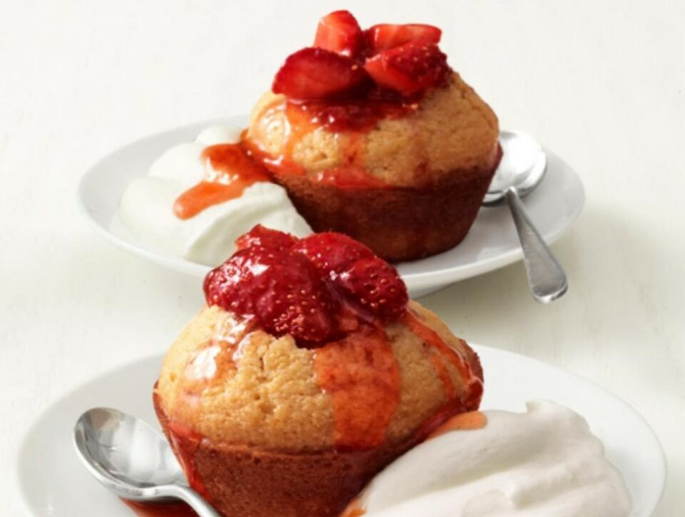

Give the pre-made corn muffin mix a significant upgrade: For an effortless breakfast, brunch, or dessert treat, combine strawberry filling with vanilla and lemon zest in the batter. Best served with nice and outstanding decoration with cute little stuff. 

Get the recipe: [Strawberry Corn Cakes](https://www.foodnetwork.com/recipes/food-network-kitchen/strawberry-corn-cakes-recipe-2107602)

### Sheet Pan Mother’s Day Brunch

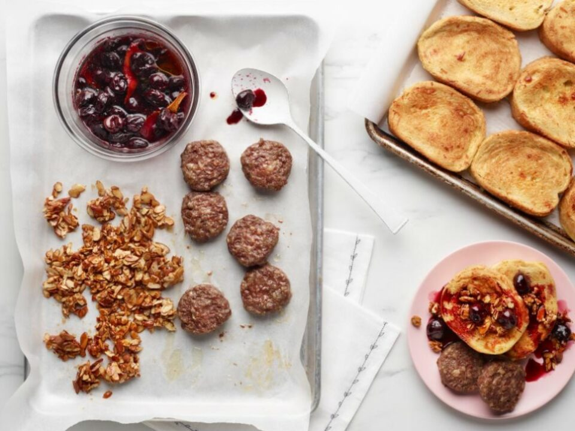

Cooking a complete brunch on two sheets of parchment paper means you’ll have sausage, French toast, and a fruit topping all done at once and very few dishes to clean up. Your mother will feel a great sense of care when she knows that you do concern about her health and made her healthy food. 

Get the recipe: [Sheet Pan Mother’s Day Brunch](https://www.foodnetwork.com/recipes/food-network-kitchen/sheet-pan-mothers-day-brunch-4694277)

### French Toast

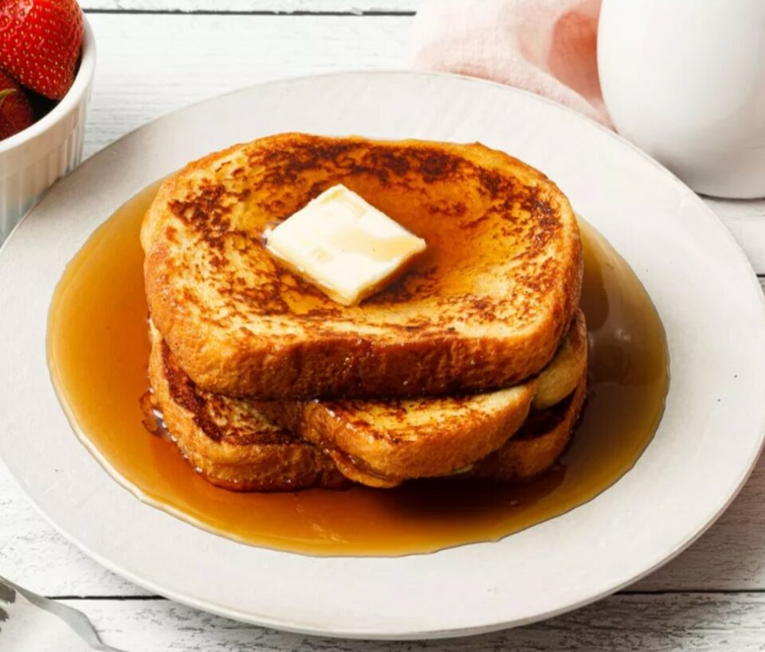

There are only six ingredients required for this traditional French toast recipe, plus any desired toppings. Although French toast is designed to be made with white bread slices, you may use almost any kind of bread that you have on hand. Additional brownie points if the slices look like they might use a second life and are a little stale.

Get the Recipe: [French Toast](https://www.southernliving.com/recipes/french-toast)

### Special Banana Cake

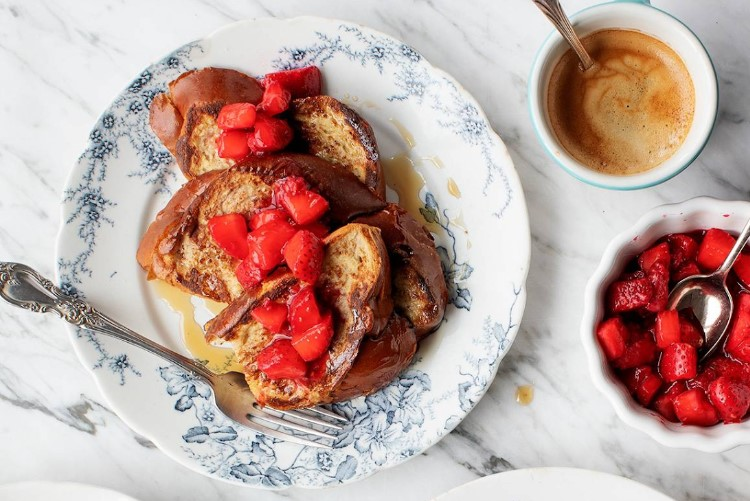

Soft, flavorful, and bursting with wonderful banana flavor, these pancakes feature a recipe for bananas. They are healthier than the typical pancake and also happen to be vegan because you can prepare them with a mixture of whole wheat pastry flour and oat flour. This is not only a tasty but easy dish to make.

Get the recipe: [Special Banana Cake](https://www.loveandlemons.com/vegan-banana-pancakes/)

### Peach Ginger Bellini

Don’t you think Mom deserves a drink on her special day? A traditional Italian cocktail called a Bellini is created with sparkling wine and peach puree. By including ginger syrup, you can give this variation a twist. Since there isn’t a lot of alcohol in it, drinking isn’t too difficult for women.

Get the Recipe: [Peach Ginger Bellini](https://www.foodnetwork.com/recipes/tyler-florence/peach-ginger-bellini-recipe-1948157)

### Baked Challah French Toast

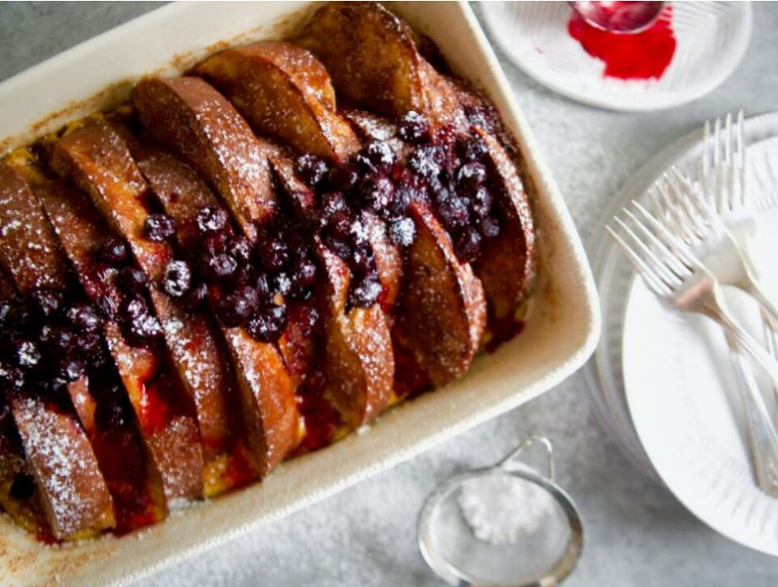

The go-ahead for Molly The most straightforward brunch main dish is French toast casserole. The challah loaf immerses up a savory custard instantaneously, so all you have to do to make a dish that appears to have taken all day to prepare is to throw the casserole in the oven before serving and whip up a quick blueberry syrup using frozen blueberries and lemon juice.

Get the recipe: [Baked Challah French Toast](https://www.foodnetwork.com/recipes/baked-challah-french-toast-5526035)

### Dutch Baby Pancake with Raspberry-Orange Coulis

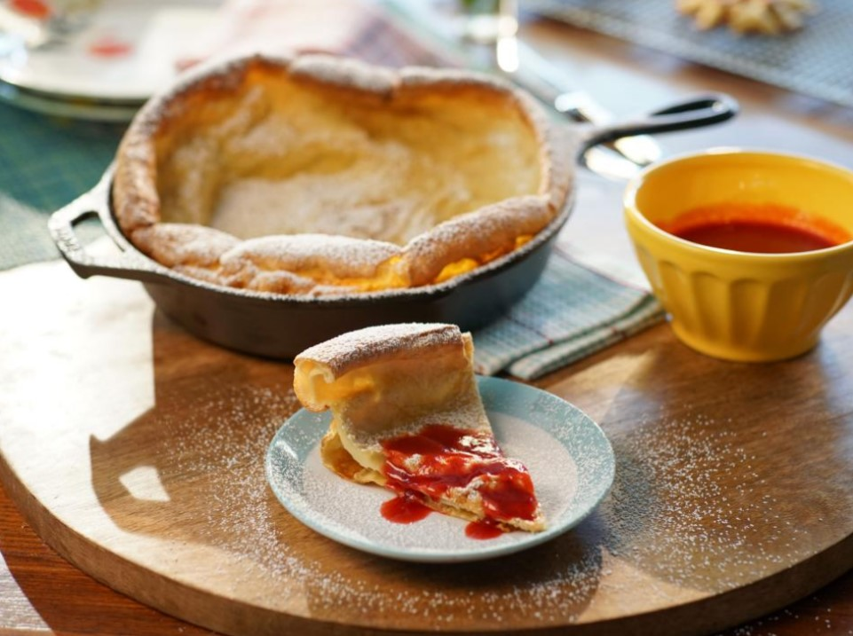

Dutch babies, which are ideal for Mother’s Day breakfast and resemble a cross between a popover and a pancake, are often prepared in a heated skillet. The result is stunning and has the same wow value as a huge, puffed-up souffle with essentially no more work.

Get the Recipe: [Dutch Baby Pancake with Raspberry-Orange Coulis](https://www.foodnetwork.com/recipes/valerie-bertinelli/dutch-baby-pancake-with-raspberry-orange-coulis-3575868)

### Green Salad with Brown Butter Walnut Vinaigrette

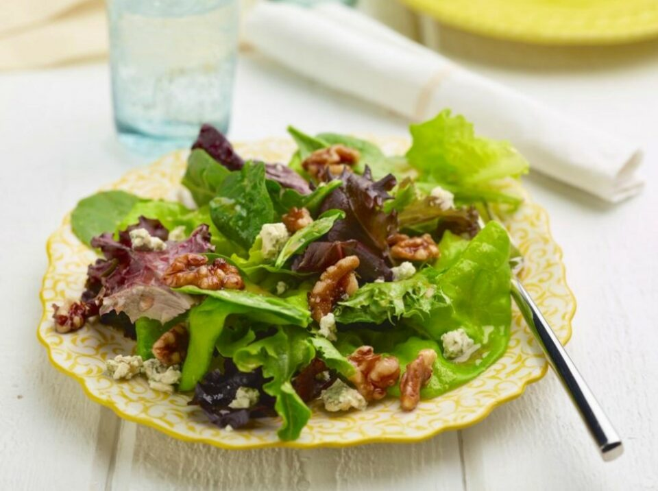

A brown-butter salad with walnuts, garlic, and rosemary can spruce up mixed greens. You can make this lovely and tasty healthy dish with just a few simple, healthy ingredients, such as fruit and vegetables. Add a small amount of blue cheese crumbles to the salad to finish. 

Get the recipe: [Green Salad with Brown Butter Walnut Vinaigrette](https://www.foodnetwork.com/recipes/amy-thielen/green-salad-with-brown-butter-walnut-vinaigrette-2216149)

### Country Ham Biscuits and Scallion-Pimento Cheese

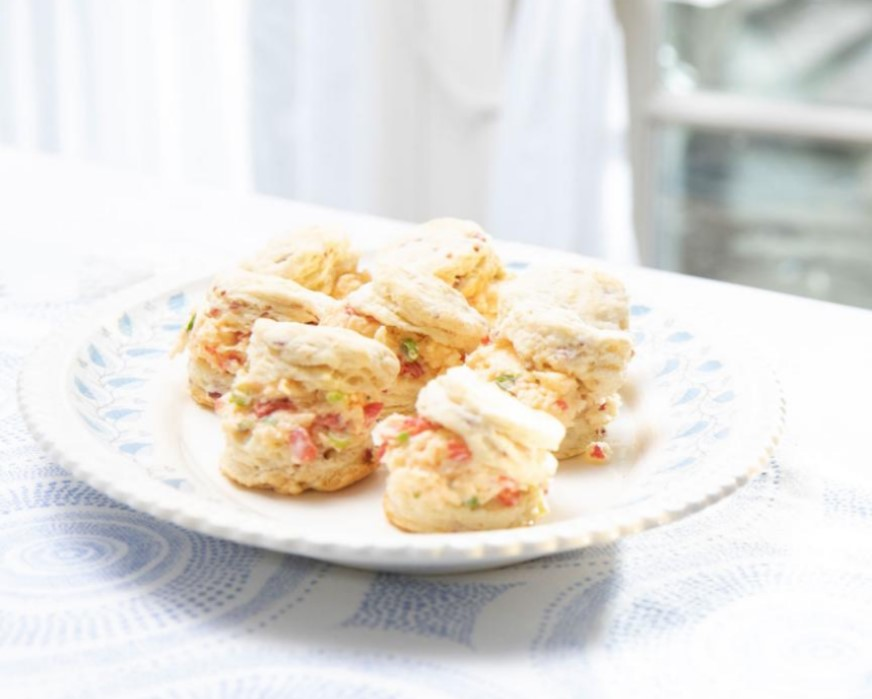

The foods that blur the distinction between meals of the day, like these soft biscuits packed with ham and flavorful pimento cheese, are always the greatest part of brunch. It can be served as a delicious brunch dish or as a dessert following brunch. Mom will certainly approve of this masterpiece with a lot of applause and gratitude!

Get the recipe: [Country Ham Biscuits and Scallion-Pimento Cheese](https://www.foodnetwork.com/recipes/trisha-yearwood/country-ham-biscuits-and-scallion-pimento-cheese-7943395)

### Shrikhand and Pooris

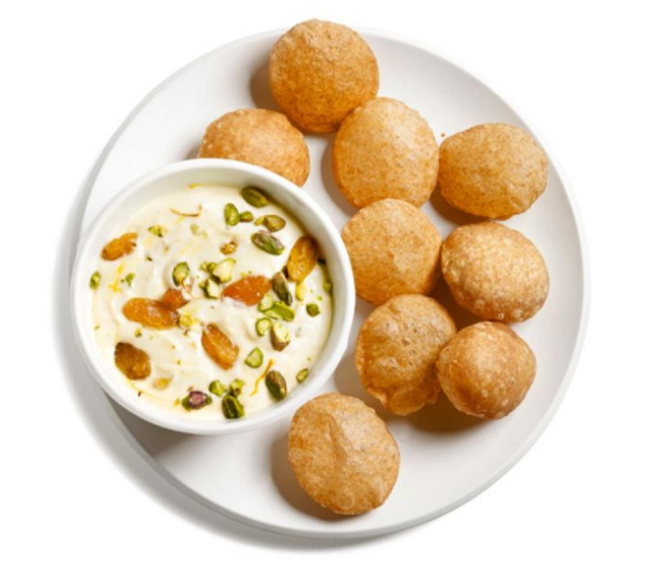

Aarti claims that Rose, her mother, was particular about the breakfasts she served her three daughters. The puffy Indian fried flatbread known as pooris was a rare delicacy. Aarti would, however, occasionally get a whiff of the distinct perfume of dough contacting heated oil and become so enthused that she would run around the house yelling, “Pooooris.” Rose serves hers alongside a yogurt dessert called shrikhand; a mouthful of the two tastes like a doughnut with cream inside.

Get the recipe: [Shrikhand and Pooris](https://www.foodnetwork.com/recipes/aarti-sequeira/shrikhand-and-pooris-recipe-1973680)

### Almond Flour Buckwheat Waffles

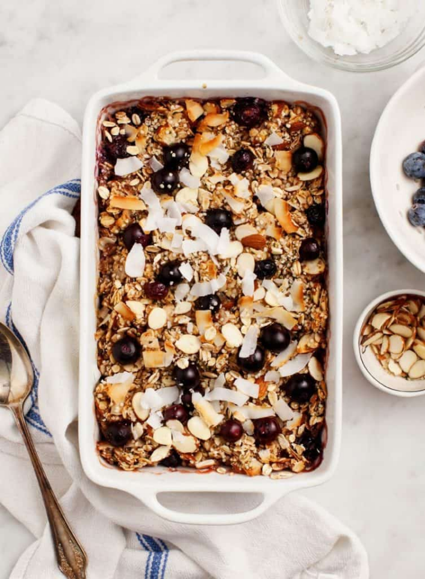

These waffles must be offered if you or a guest needs to avoid gluten. They have a wonderful nutty flavor from the buckwheat and almond flours, and they are crunchy to perfection. Add some fresh fruit and maple syrup on top for the ultimate waffle experience, and this dish is ready to be served more than ever!

Get the recipe: [Almond Flour Buckwheat Waffles](https://amzn.to/2vADHY2)

### Green Healthy Frittata

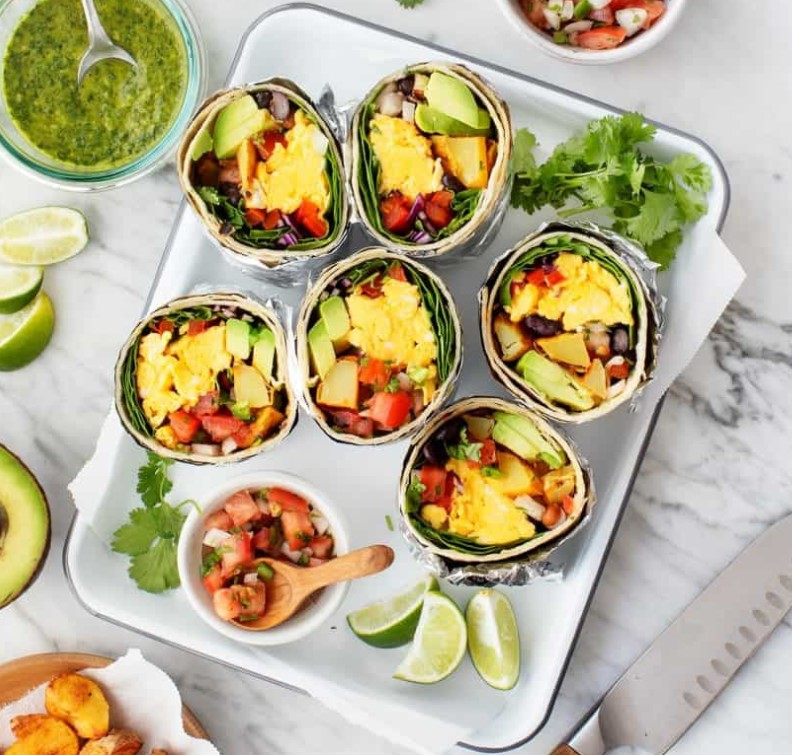

The best brunch recipes are, without a doubt, frittatas. They’re fantastic for feeding a crowd because they’re incredibly adaptable and quick to put together. Use the most attractive vegetables you can find, or get ideas from the recipe’s list of my preferred veggie, herb, and cheese pairings!

Get the recipe: [Green Healthy Frittata](https://www.loveandlemons.com/frittata-recipe/)

### Healthy Breakfast Casserole

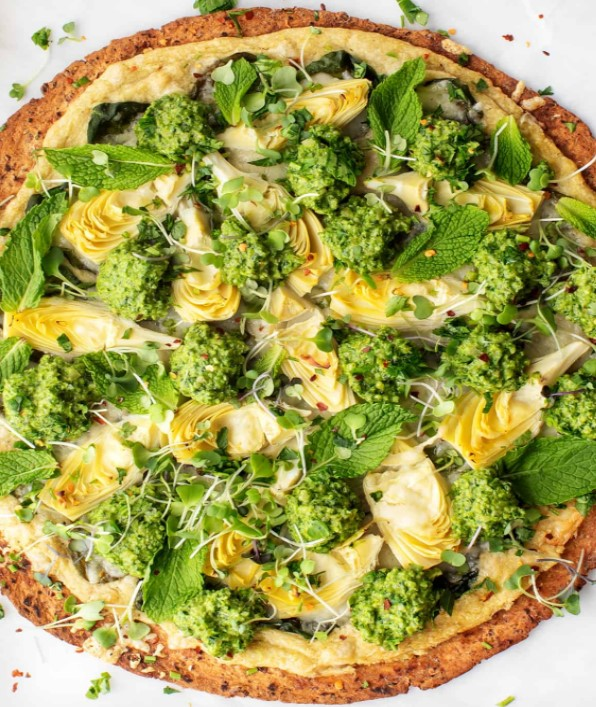

This veggie-filled egg casserole is naturally a mainstay on our brunch table because it was inspired by the recipe for the mom’s breakfast casserole. The hidden middle layer of baked sweet potatoes tucked down at the bottom makes it the best portion despite being fresh and loaded with vegetables!

Get the recipe: [Healthy Breakfast Casserole](https://www.loveandlemons.com/breakfast-casserole/)

### Healthy Egg Salad

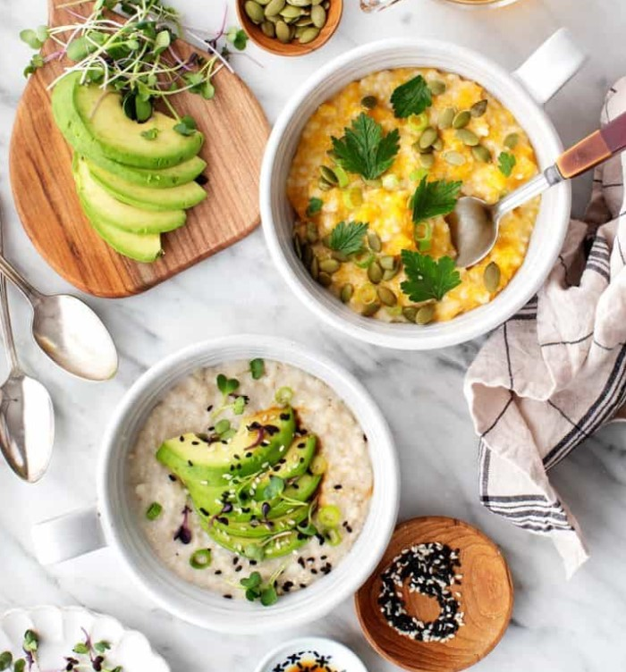

What brunch dish could be more adorable than mini egg salad sandwiches (or egg salad crostini)? Even if you’ve never been a fan of egg salad, we implore you to try this incredibly cherry, fresh recipe that also comes with a delicious vegan alternative.

Get the recipe: [Healthy Egg Salad](https://www.loveandlemons.com/egg-salad-sandwich/)

### Rainbow Kale Salad with Carrot Ginger Dressing

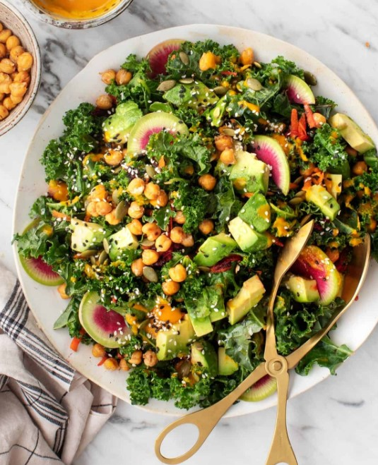

It’s always nice to have a large green salad on the breakfast table, and this one has it all: crispy roasted chickpeas, crunchy spring radishes, smooth avocado, toasty seeds, and cranberries that have been dried for a touch of sweetness. The finishing touch is a freshly made carrot ginger dressing.

Get the recipe: [Rainbow Kale Salad with Carrot Ginger Dressing](https://www.loveandlemons.com/rainbow-kale-salad-carrot-ginger-dressing/)

**_Related_**: Top 10 [Flowers for Mother’s Day](https://avada.io/loveable/best-mothers-day-flowers/) to Express Your Love

## Conclusion

Hosting a memorable Mother’s Day brunch for the first time may be difficult, and you do not know what to do when you are a host. Just with some of our background knowledge about this topic and several tips with recipes that have been investigated thoroughly, we believe that you have found your own answers for all your stuff about a **Mother’s Day brunch** after this article.

Additionally, you do not have to worry about dressing up; simply enjoy your mother’s company while tucking into some delectable handmade cinnamon buns. You will know how to organize a memorable **Mother’s Day brunch** if you adhere to these delectable, simple-to-cook foods that are essential for your upcoming brunch.

- [Tips for Hosting a Mother’s Day Brunch](https://avada.io/loveable/blog/memorable-mother-day-brunch/#wp-block-heading-2-3)
    - [Prepare in advance](https://avada.io/loveable/blog/memorable-mother-day-brunch/#wp-block-heading-3-4)
    - [Set the table](https://avada.io/loveable/blog/memorable-mother-day-brunch/#wp-block-heading-3-7)
    - [Plan a varied menu](https://avada.io/loveable/blog/memorable-mother-day-brunch/#wp-block-heading-3-10) 
    - [Keep the basic dish](https://avada.io/loveable/blog/memorable-mother-day-brunch/#wp-block-heading-3-13)
    - [Don’t forget the beverage](https://avada.io/loveable/blog/memorable-mother-day-brunch/#wp-block-heading-3-16)
    - [Make it decorative](https://avada.io/loveable/blog/memorable-mother-day-brunch/#wp-block-heading-3-19)
    - [Finish with the sweet](https://avada.io/loveable/blog/memorable-mother-day-brunch/#wp-block-heading-3-22)
- [Delicious Brunch Recipe Ideas for Mother’s Day](https://avada.io/loveable/blog/memorable-mother-day-brunch/#wp-block-heading-2-25)
    - [Bacon, Egg and Cheese Toast Bowls](https://avada.io/loveable/blog/memorable-mother-day-brunch/#wp-block-heading-3-26)
    - [Pancake Cake with Berries](https://avada.io/loveable/blog/memorable-mother-day-brunch/#wp-block-heading-3-30)
    - [Italian Cinnamon Rolls](https://avada.io/loveable/blog/memorable-mother-day-brunch/#wp-block-heading-3-34)
    - [Strawberry Corn Cakes](https://avada.io/loveable/blog/memorable-mother-day-brunch/#wp-block-heading-3-38)
    - [Sheet Pan Mother’s Day Brunch](https://avada.io/loveable/blog/memorable-mother-day-brunch/#wp-block-heading-3-42)
    - [French Toast](https://avada.io/loveable/blog/memorable-mother-day-brunch/#wp-block-heading-3-46)
    - [Special Banana Cake](https://avada.io/loveable/blog/memorable-mother-day-brunch/#wp-block-heading-3-50)
    - [Peach Ginger Bellini](https://avada.io/loveable/blog/memorable-mother-day-brunch/#wp-block-heading-3-54)
    - [Baked Challah French Toast](https://avada.io/loveable/blog/memorable-mother-day-brunch/#wp-block-heading-3-58)
    - [Dutch Baby Pancake with Raspberry-Orange Coulis](https://avada.io/loveable/blog/memorable-mother-day-brunch/#wp-block-heading-3-62)
    - [Green Salad with Brown Butter Walnut Vinaigrette](https://avada.io/loveable/blog/memorable-mother-day-brunch/#wp-block-heading-3-66)
    - [Country Ham Biscuits and Scallion-Pimento Cheese](https://avada.io/loveable/blog/memorable-mother-day-brunch/#wp-block-heading-3-70)
    - [Shrikhand and Pooris](https://avada.io/loveable/blog/memorable-mother-day-brunch/#wp-block-heading-3-74)
    - [Almond Flour Buckwheat Waffles](https://avada.io/loveable/blog/memorable-mother-day-brunch/#wp-block-heading-3-78)
    - [Green Healthy Frittata](https://avada.io/loveable/blog/memorable-mother-day-brunch/#wp-block-heading-3-82)
    - [Healthy Breakfast Casserole](https://avada.io/loveable/blog/memorable-mother-day-brunch/#wp-block-heading-3-86)
    - [Healthy Egg Salad](https://avada.io/loveable/blog/memorable-mother-day-brunch/#wp-block-heading-3-90)
    - [Rainbow Kale Salad with Carrot Ginger Dressing](https://avada.io/loveable/blog/memorable-mother-day-brunch/#wp-block-heading-3-94)
- [Conclusion](https://avada.io/loveable/blog/memorable-mother-day-brunch/#wp-block-heading-2-99)

### [Blake Simpson](https://avada.io/loveable/author/blake/)

Hi, I'm Blake from Loveable. I help people find perfect gifts for occasions like anniversaries and weddings. I also write a blog about holidays, sharing insights to make them more meaningful. Let's create unforgettable moments together!

- [Twitter](https://twitter.com/intent/tweet)
- [Facebook](https://www.facebook.com/sharer/sharer.php)
- [instagram](https://avada.io/loveable/blog/memorable-mother-day-brunch/)
- [pinterest](https://www.pinterest.com/loveablellc/)

## Related Posts

[### 120+ Christian Birthday Wishes To Spread Your Love](https://avada.io/loveable/blog/christian-birthday-wishes/) 

[

### 35 Best 70th Birthday Ideas To Celebrate The Special Milestone

](https://avada.io/loveable/blog/70th-birthday-ideas/)

[

### 50 Best 30th Birthday Decorations for a Remarkable Birthday Bash

](https://avada.io/loveable/blog/30th-birthday-decorations/)

[

### 40 Delicious Vegan Christmas Desserts to Delight Your Palate

](https://avada.io/loveable/blog/vegan-christmas-desserts/)

[

### 60 Christmas Team Building Activities to Boost Workplace Spirit

](https://avada.io/loveable/blog/christmas-team-building-activities/)
