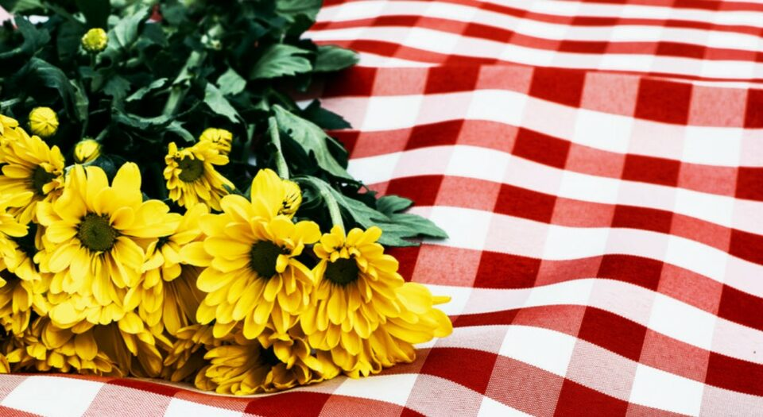
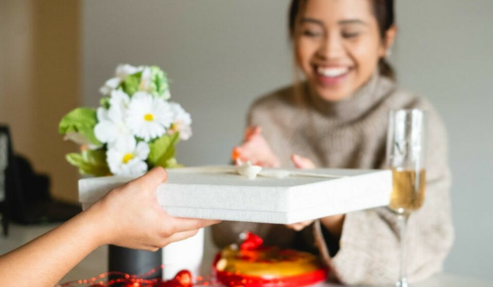
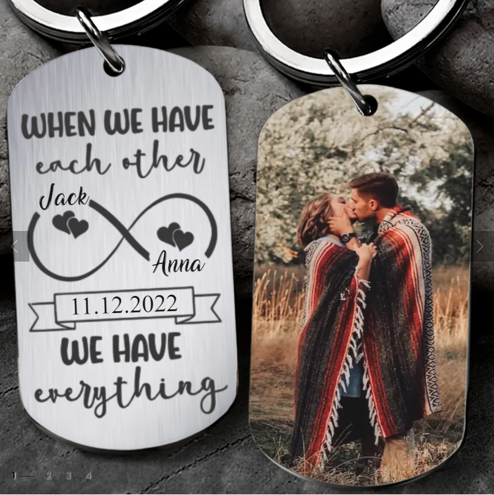
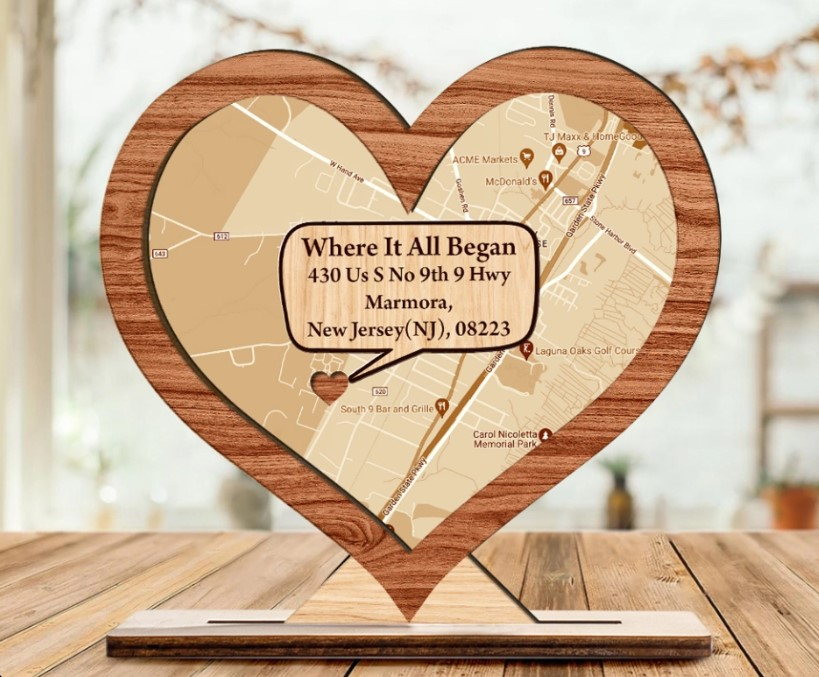
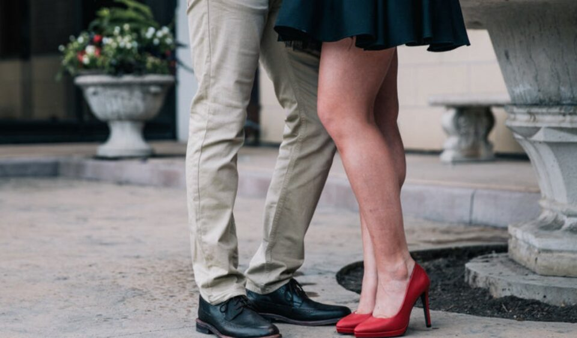

This article has been written and researched by our expert Loveable through a precise methodology. [Learn more about our methodology](https://avada.io/loveable/our-methodological.html)

[Loveable](https://avada.io/loveable/) > [Blog](https://avada.io/loveable/blog/) > [Holiday](https://avada.io/loveable/holiday/)

# How To Ask Someone To Be Your Valentine – 20 Ways

Written by [Blake Simpson](https://avada.io/loveable/author/blake/) Last Updated on August 17, 2023

- [Melt Their Heart With a Flower Bouquet](https://avada.io/loveable/blog/ask-someone-to-be-your-valentine/#wp-block-heading-2-3)
- [Give them a romantic gift](https://avada.io/loveable/blog/ask-someone-to-be-your-valentine/#wp-block-heading-2-10)
- [Make a special valentine’s gift for them on your own](https://avada.io/loveable/blog/ask-someone-to-be-your-valentine/#wp-block-heading-2-14) 
- [Ask your loved one on a date](https://avada.io/loveable/blog/ask-someone-to-be-your-valentine/#wp-block-heading-2-25)
- [Write them a love letter](https://avada.io/loveable/blog/ask-someone-to-be-your-valentine/#wp-block-heading-2-29) 
- [Romantic And Funny Text Message](https://avada.io/loveable/blog/ask-someone-to-be-your-valentine/#wp-block-heading-2-32)
- [3 Tips To Make Your Valentines Date Memorable](https://avada.io/loveable/blog/ask-someone-to-be-your-valentine/#wp-block-heading-2-42) 
    - [Make Eye contact](https://avada.io/loveable/blog/ask-someone-to-be-your-valentine/#wp-block-heading-3-45)
    - [Make an effort!](https://avada.io/loveable/blog/ask-someone-to-be-your-valentine/#wp-block-heading-3-47)
    - [Make it simple](https://avada.io/loveable/blog/ask-someone-to-be-your-valentine/#wp-block-heading-3-51) 
- [Bottom line](https://avada.io/loveable/blog/ask-someone-to-be-your-valentine/#wp-block-heading-2-54) 

The feeling of falling in love with someone is always a wonderful experience from the time we are children to adulthood. 

When in love, you always look for a thousand ways to confess your feelings to your significant other. Valentine’s Day is an excellent occasion for you to do so, but if you still struggle to find a romantic way or even just a simple confession to ask them, then this article is for you.   
We’ve gone through a thousand ways for you to **ask someone to be your Valentine,** from just a simple but meaningful [love letter](https://avada.io/loveable/write-a-love-letter/) to something unique that they heart-melted; keep watching the list to prepare your best on February 14!

## Melt Their Heart With a Flower Bouquet

Roses always symbolize beautiful love, so don’t hesitate to surprise your lover with these romantic flowers for Valentine’s Day. Besides flower items, you can also check out the list of [Valentine’s best sexy gifts](https://avada.io/loveable/sexy-valentines-day-gifts/) from loveable. Time is fast; life is short; let’s gifting!

Here are some of the most loved flowers on Valentine’s Day; exploring the meaning of each flower will give you ideas to give it to your loved one. 

**White lilies** – Represent devotion, purity, and elegance, making them ideal for expressing love. The red lily symbolizes passion. They look lovely alone or even better with some roses. 

**Sunflowers** – [Sunflower](https://avada.io/loveable/sunflower-gifts-her/) is the best way to tell your lover, “You are my sunshine.” She will burst into tears.

**Red roses** – These are considered the symbol of love and adoration.

## Give them a romantic gift

Sweet gifts can be considered the language of love. Consider their personality and your partner’s preferences to choose a gift they will appreciate forever. 

If you are still pondering over thousands of gifts out there and still don’t know which one to choose. Loveable can help you! We have already created a list of many adorable gifts with different price ranges that fit your budget. Check out loveable [lovely personalized gifts for valentine’s day](https://avada.io/loveable/personalised-valentines-gifts-for-him/)!

## Make a special valentine’s gift for them on your own 

Choosing meaningful gifts at stores is a good idea. But it’s even better to make your significant other a gift yourself. That gift doesn’t need to be too expensive or fussy; you only need to put your love and effort into it, and we are sure they will appreciate it.

Here are some lovely handmade gift ideas that you may love

- **A homemade keychain:** A keychain is a daily reminder of your love. You can find cute keychain photo frames and craft ideas for creating a one-of-a-kind heart keychain for your valentine. Here are some adorable keychains from loveable that you can consider.

[When We Have Each Other We Have Everything – Personalized Steeless Keychain – Best Gift for Her Him](https://loveable.ai/products/when-we-have-each-other-we-have-everything-personalized-steeless-keychain-best-gift-for-her-him-on-anniversaries-birthday-valentine-212ihpvspkc617?variant=44160613810408)

You can buy this keychain bracelet for yourself or for a friend, family member, or coworker. It’s a beautiful and useful gift that she can use every day. A great gift idea for anyone at any time.

- **Heart-shaped gift:** Make a canvas for your sweetheart’s home. Make a heart out of anything else you can think of. They’ll enjoy it for years to come—and remember your generosity. 

[Where It All Began Personalized Map – Wooden Plaque – Heart-shape Plaque – Custom Address – Anniversary Gift](https://loveable.ai/products/where-it-all-began-personalized-map-wooden-plaque-heart-shape-plaque-custom-address-anniversary-gift-valentine-gift-for-her-him-husband-wife-301icnlnwp086?_pos=1&_sid=a721a5a4b&_ss=r&variant=44266015031528)

- A homemade love album: This album will synthesize photos of your love memories. Undoubtedly when you both review the album together, your feelings will be connected. Remember to decorate the album with typical valentine’s motifs such as hearts, flowers, and your photo.

## Ask your loved one on a date

If you have a crush on someone, be prepared to ask them out. You can prepare the gifts as we mentioned above, explain why you are giving them this gift, and ask for a date out. When speaking with them, be gentle and calm. Aside from that, you can pay for their drink at the coffee shop or bar where you met and became interested in them. You can also prepare extra chocolate and proactively schedule your date. If you’re the introvert type and are afraid to confess in person, you can also politely invite them via text. Below we have listed many “how to ask someone to be your valentine” from funny to romantic text messages, so keep reading.

**Ask in person:** Dragging someone into a new position is never easy, especially when that person becomes your lover. Unfortunately, there are no specific examples of saying to your crush from general advice on asking someone to be your Valentine. Instead, waiting for an appropriate opportunity to express yourself would be best.

## Write them a love letter 

Meeting directly is difficult to express what you want, so make a card or write your thoughts on white paper. In today’s texting world, handwritten letters mean more. Send a personal note on unique stationery with a special touch, such as a wax seal or a spritz of your favorite perfume or cologne. You can bet they come across something like that infrequently. Please don’t make it so complex or lengthy that the main point becomes misplaced. You can draw cute pictures and decorate, but words are the most important to take care of. 

Begin with a compliment on their looks, then make some sweet hints like “I’m not sure if…” before signing off. It’s a classical and lovely way of expressing yourself. A letter can warm her heart and show her that you are serious about this confession. Sending a love email to someone who lives far away means a lot to them. It’s a helpful tip for asking someone to be your Valentine online.

## Romantic And Funny Text Message

Did you know you can text your way into someone’s heart? This Valentine’s Day, we’ve offered some advice on texting the people who mean the most to you. Here are some funny and romantic [Valentine quotes](https://avada.io/loveable/valentines-day-quotes/) and message 

- Girl: What is worse than a swarm of starry-eyed people crushing on each other and running around the streets? Guy: What do you mean? Nothing…  will you be my Valentine?
- Because it’s Valentine’s Day, I just wanted you to know that if you called me, I wouldn’t ignore you.
- If I don’t meet your expectations for Valentine’s date, please lower them.
- To one of my favorite people, I wish you a very happy Valentine’s Day. If I made phone calls, you’d be on my speed dial.
- Lemons are yellow; Roses are red; I consider myself a lucky fellow! 
- I want to LOL with you all night long. Happy V-day stud!
- V-Day? Let’s Try Me+U Day!

## 3 Tips To Make Your Valentines Date Memorable 

Is it a first date or a tenth anniversary? It makes no difference. Let’s be honest here. We are all a mystery to one another. So take your curiosity for a ride and discover the unexplored sides of your loved ones. Here are six suggestions for a memorable Valentine’s Day!

### **Make Eye contact**

As you’ve already known, “The eyes are the soul’s mirror,” and so on. But did you know that just 4 minutes of eye contact is enough to activate the hormones adrenaline and oxytocin? Yes, you guessed correctly. These are the same hormones that make our bodies samba when we’re in love. More extended periods of eye contact result in a stronger bond between us. And doesn’t that sound wonderful? So, on February 14th, will it be your ace in the hole?

### **Make an effort!**

One simple ice-breaker tip is to put all of your heart into making the moment incredible and thoughtful. Then, even if your crush refuses to be your Valentine, they can still see your true nature and remain your friend. But, of course, everything must be genuine and unambiguous.

Tell them how much you adore them and plan a perfect day to let them know you are ready to be their sweetheart. Everything must be done perfectly, whether your preparation is a casual conversation or a surprising moment.

### **Make it simple** 

People like to feel special, which can sometimes complicate matters. If you overthink and become stressed about approaching their love, you may miss an opportunity to come to them before someone else.

You must also have faith in yourself. They will not like anyone who loses confidence and starts sweating when they are around them. Being shaky and timid would have a negative outcome. This is just a confession, not a limb for future marriage. Stop overthinking and start acting right away.

## Bottom line 

There are various lovely ways to **ask someone to be your valentine**, but you should pick the one your crush or partner prefers. They are more likely to say yes if you consider what they like.

Take charge of your romantic life. And, if everything goes as planned, you should have a fantastic Valentine’s Day with the one you love.

- [Melt Their Heart With a Flower Bouquet](https://avada.io/loveable/blog/ask-someone-to-be-your-valentine/#wp-block-heading-2-3)
- [Give them a romantic gift](https://avada.io/loveable/blog/ask-someone-to-be-your-valentine/#wp-block-heading-2-10)
- [Make a special valentine’s gift for them on your own](https://avada.io/loveable/blog/ask-someone-to-be-your-valentine/#wp-block-heading-2-14) 
- [Ask your loved one on a date](https://avada.io/loveable/blog/ask-someone-to-be-your-valentine/#wp-block-heading-2-25)
- [Write them a love letter](https://avada.io/loveable/blog/ask-someone-to-be-your-valentine/#wp-block-heading-2-29) 
- [Romantic And Funny Text Message](https://avada.io/loveable/blog/ask-someone-to-be-your-valentine/#wp-block-heading-2-32)
- [3 Tips To Make Your Valentines Date Memorable](https://avada.io/loveable/blog/ask-someone-to-be-your-valentine/#wp-block-heading-2-42) 
    - [Make Eye contact](https://avada.io/loveable/blog/ask-someone-to-be-your-valentine/#wp-block-heading-3-45)
    - [Make an effort!](https://avada.io/loveable/blog/ask-someone-to-be-your-valentine/#wp-block-heading-3-47)
    - [Make it simple](https://avada.io/loveable/blog/ask-someone-to-be-your-valentine/#wp-block-heading-3-51) 
- [Bottom line](https://avada.io/loveable/blog/ask-someone-to-be-your-valentine/#wp-block-heading-2-54) 

### [Blake Simpson](https://avada.io/loveable/author/blake/)

Hi, I'm Blake from Loveable. I help people find perfect gifts for occasions like anniversaries and weddings. I also write a blog about holidays, sharing insights to make them more meaningful. Let's create unforgettable moments together!

- [Twitter](https://twitter.com/intent/tweet)
- [Facebook](https://www.facebook.com/sharer/sharer.php)
- [instagram](https://avada.io/loveable/blog/ask-someone-to-be-your-valentine/)
- [pinterest](https://www.pinterest.com/loveablellc/)

## Related Posts

[### 120+ Christian Birthday Wishes To Spread Your Love](https://avada.io/loveable/blog/christian-birthday-wishes/) 

[

### 35 Best 70th Birthday Ideas To Celebrate The Special Milestone

](https://avada.io/loveable/blog/70th-birthday-ideas/)

[

### 50 Best 30th Birthday Decorations for a Remarkable Birthday Bash

](https://avada.io/loveable/blog/30th-birthday-decorations/)

[

### 40 Delicious Vegan Christmas Desserts to Delight Your Palate

](https://avada.io/loveable/blog/vegan-christmas-desserts/)

[

### 60 Christmas Team Building Activities to Boost Workplace Spirit

](https://avada.io/loveable/blog/christmas-team-building-activities/)
