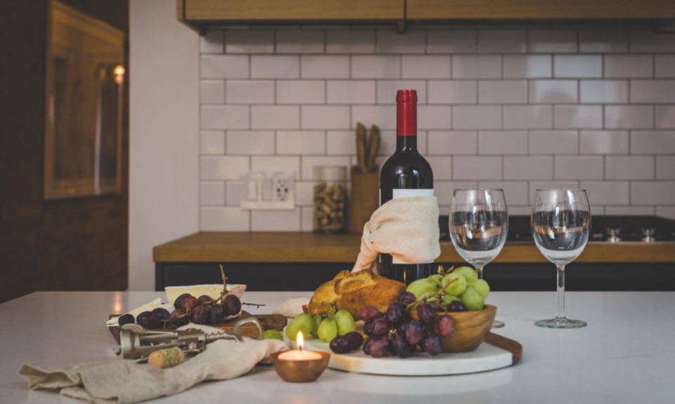
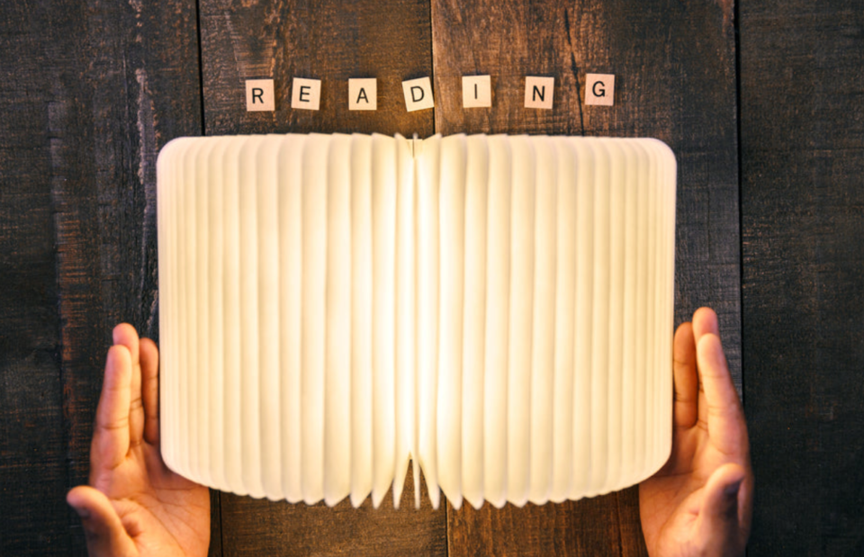
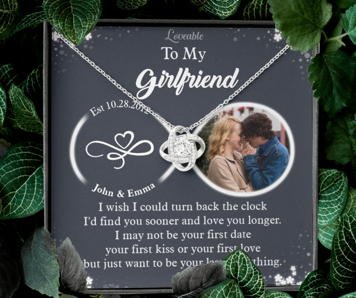
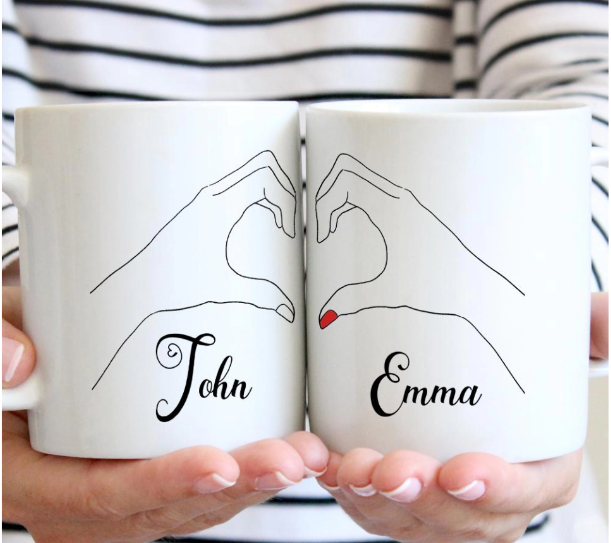
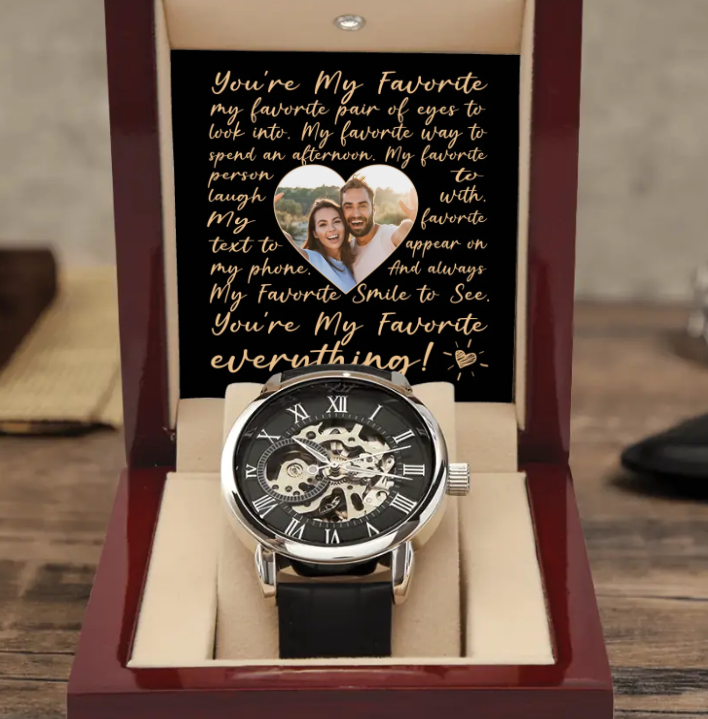
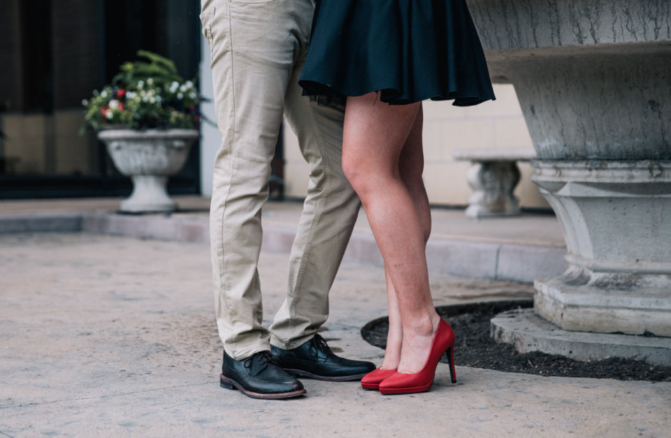
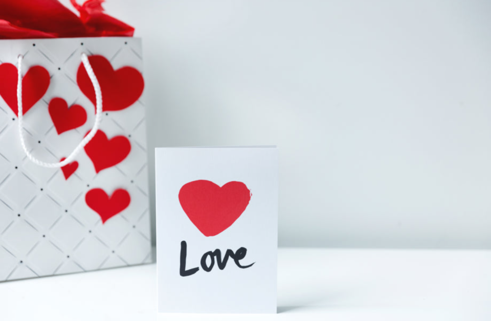

This article has been written and researched by our expert Loveable through a precise methodology. [Learn more about our methodology](https://avada.io/loveable/our-methodological.html)

[Loveable](https://avada.io/loveable/) > [Blog](https://avada.io/loveable/blog/) > [Holiday](https://avada.io/loveable/holiday/)

# How To Celebrate Valentines Day: 18 Romantic Ways For Couples

Written by [Blake Simpson](https://avada.io/loveable/author/blake/) Last Updated on August 17, 2023

- [Make your lover surprised with a special breakfast in bed](https://avada.io/loveable/blog/romantic-ways-to-celebrate-valentines-day/#wp-block-heading-2-3)
- [Experience Something New And Exciting Together](https://avada.io/loveable/blog/romantic-ways-to-celebrate-valentines-day/#wp-block-heading-2-5)
- [Netflix and Chill](https://avada.io/loveable/blog/romantic-ways-to-celebrate-valentines-day/#wp-block-heading-2-7)
- [Have A Great Night Together At A Fancy Restaurant](https://avada.io/loveable/blog/romantic-ways-to-celebrate-valentines-day/#wp-block-heading-2-9) 
- [Plan a romantic dinner at home](https://avada.io/loveable/blog/romantic-ways-to-celebrate-valentines-day/#wp-block-heading-2-11)
- [Make a homemade card tailored for your lover](https://avada.io/loveable/blog/romantic-ways-to-celebrate-valentines-day/#wp-block-heading-2-14)
- [Make a lovely scrapbook of your relationship.](https://avada.io/loveable/blog/romantic-ways-to-celebrate-valentines-day/#wp-block-heading-2-16)
- [Enjoy wine and chocolate together](https://avada.io/loveable/blog/romantic-ways-to-celebrate-valentines-day/#wp-block-heading-2-20)
- [Write love letters to each other.](https://avada.io/loveable/blog/romantic-ways-to-celebrate-valentines-day/#wp-block-heading-2-22)
- [Exchange heartfelt gifts with each other](https://avada.io/loveable/blog/romantic-ways-to-celebrate-valentines-day/#wp-block-heading-2-25) 
- [Have A Bath Together](https://avada.io/loveable/blog/romantic-ways-to-celebrate-valentines-day/#wp-block-heading-2-38) 
- [Have A Long Trip Together](https://avada.io/loveable/blog/romantic-ways-to-celebrate-valentines-day/#wp-block-heading-2-40) 
- [Celebrate Valentines Day By Giving your lover a massage.](https://avada.io/loveable/blog/romantic-ways-to-celebrate-valentines-day/#wp-block-heading-2-42)
- [Remind Your First Date](https://avada.io/loveable/blog/romantic-ways-to-celebrate-valentines-day/#wp-block-heading-2-44)
- [Play Hooky](https://avada.io/loveable/blog/romantic-ways-to-celebrate-valentines-day/#wp-block-heading-2-48)
- [Craft something together.](https://avada.io/loveable/blog/romantic-ways-to-celebrate-valentines-day/#wp-block-heading-2-50)
- [Hosting a Valentine’s Day party For your family and friends](https://avada.io/loveable/blog/romantic-ways-to-celebrate-valentines-day/#wp-block-heading-2-52)
- [Give your lover a classic gift of flowers and chocolate.](https://avada.io/loveable/blog/romantic-ways-to-celebrate-valentines-day/#wp-block-heading-2-55)
- [Bottom line](https://avada.io/loveable/blog/romantic-ways-to-celebrate-valentines-day/#wp-block-heading-2-62) 

Valentine’s day is approaching, and you probably have difficulty figuring out ways to make your loved one happy on this special day. However, there are hundreds of ways you can do it correctly, from giving them meaningful valentine’s gifts such as a flower bouquet or a [box of chocolates](https://avada.io/loveable/valentines-day-chocolate-gifts/), etc., to organizing a trip to celebrate your great love or simply something lovely that you two can do together right at your sweet home.

We have compiled 18 tips and activities specifically [for couples for Valentine’s Day](https://avada.io/loveable/valentines-day-gifts-couples/) to give you more ideas. Some are low-cost, while others are entirely free. Some are formal, while others are casual and comfortable. Of course, February 14 is a day to celebrate all types of love, not just romantic love, so platonic hangs or self-love dates are acceptable. So, regardless of your current relationship status, keep reading for our favorite ways to **celebrate Valentine’s Day** this year.

## Make your lover surprised with a special breakfast in bed

Surprise your partner with a special breakfast served in bed. Prepare a variety of dishes your loved one enjoys, such as bacon, scrambled eggs, pancakes, or waffles. Serve the meal on a tray with a glass of orange juice or coffee. Your loved ones will appreciate your thoughtfulness.

## Experience Something New And Exciting Together

If you are too bored with [traditional activities on Valentine’s Day](https://avada.io/loveable/things-to-do-on-valentine-day/), you may not want to wait an hour for a reservation in a restaurant or go to places that are all too familiar for couples. Then this is the time for you two to try something new. Spend some time planning a fun and daring adventure with your lover. Find an activity you have always wanted to do and enjoy experiencing together. It could be hiking together, exploring some weird place, or Immersing yourself in nature by visiting a nearby national park. 

## Netflix and Chill

Make some cheesy snacks, prepare popcorn, light a mood-setting candle, crack open a bottle of wine, and snuggle under a blanket in your home to watch a Valentine’s Day movie. But would you like to make it extra memorable? Make a paper heart wreath, an origami bouquet, and a love letter banner to decorate your space.

## Have A Great Night Together At A Fancy Restaurant 

The restaurant’s fancy food and atmosphere will be a special memory for you and your loved one. First, make reservations at a fine dining establishment to celebrate the evening in public. Then, treat yourself and your partner to a romantic dinner at a nearby restaurant. Choose a few restaurants within your price range and call to see if Valentine’s Day reservations are available.

## Plan a romantic dinner at home

Prepare a romantic dinner at home for two. To make it more romantic, you can decorate the dining table with red tablecloths, [personalized candles](https://avada.io/loveable/personalized-candles/), wine, and maybe some valentine’s cards if you like. Regarding the menu, there is no need to be too fussy if you are not good at cooking. It would help if you prioritized the dishes that they like. All in all, a romantic home-cooked meal doesn’t have to be a restaurant’s 5-star standard.

## Make a homemade card tailored for your lover

Instead of buying a ready-made card from the store and she might feel nothing special, you can prepare a [valentine’s card](https://avada.io/loveable/what-to-write-in-valentines-card/) about her. Remember to prepare some good poems and romantic valentine’s quotes to put on the card. Bring your style into the sentence, and she will surely love it. 

## Make a lovely scrapbook of your relationship.

Even partners who aren’t into crafts will enjoy this pleasurable activity. Make a beautiful book with photos of your relationship, old ticket stubs, and meaningful receipts that you’ll cherish forever!

**Check out:** _[Best Valentine Crafts Ideas For Kids And Adults](https://avada.io/loveable/valentine-crafts-ideas/)_

## Enjoy wine and chocolate together

Wine and chocolate are great treats and suitable for valentine, but have you ever enjoyed these two together? If not, this February 14, you should try this combination with your lover to celebrate your relationship. 

## Write love letters to each other.

If you’ve never done it before, now is the time to write your feelings for your partner through [romantic love letter](https://avada.io/loveable/write-a-love-letter/). Tell them which of their aspects you admire the most, how they make you feel, and how you fell in love with them. 

## Exchange heartfelt gifts with each other 

Take advantage of this opportunity to give your loved one a great gift on this special day. It’s fun to give and receive small tokens of affection. Consider buying something your loved one has always wanted or making a homemade Valentine’s Day card.

If you are still struggling to find out meaningful gifts for the one you love, don’t hesitate to visit Loveable. Here we’ve listed out the [best seller Valentine’s Day gifts](https://loveable.ai/collections/valentine-gifts) from many different price ranges that will definitely fit your pocket. Believe it or not, your significant other will be speechless!

1. [Custom Photo I Wish I Could Turn Back The Clock – Personalized Necklace Jewelry](https://loveable.ai/products/custom-photo-i-wish-i-could-turn-back-the-clock-personalized-necklace-jewelry-gifts-for-her-209ihpthje330?variant=43922298405096)

The beautiful Forever Love Necklace will melt her heart. This necklace has a beautiful 6.5mm CZ crystal in the middle of a polished heart pendant that has smaller crystals on it to make it sparkle and shine even more. Give her a classic gift that is well-made and has a white gold finish so she can use it every day.

[2\. Custom Couple Mug 3 Styles – Personalized White Mug](https://loveable.ai/collections/mug/products/custom-couple-mug-3-styles-personalized-white-mug-set-gifts-for-valentines-day-anniversaries-birthdays-special-occasions-209ihpthmu124?variant=43807862096104)

Grab it and take a sip. You can put a picture of your choice on an 11-ounce or 15-ounce white mug. One product has the ability to print in full color, is made of strong ceramic, and is easy to use every day.

[3\. You’re My Favorite Everything My Favorite Pair Of Eyes To Look Into – Upload Photo Men’s Watch](https://loveable.ai/products/youre-my-favorite-everything-my-favorite-pair-of-eyes-to-look-into-upload-photo-mens-watch-best-gift-for-him-for-husbandboyfriend-best-anniversary-gift-valentines-gift-301icnnpwa045?variant=44263268155624)

Give this handsome and daring watch to your Lover as a gift of luxury to add a stylish touch to his wardrobe. The genuine leather band on this watch is splash-proof, and the hardened mineral glass makes it last longer. With our unique skeleton dial, you can see right through your watch to see how it works. This watch is beautifully made to run independently, so it doesn’t need batteries. You can tell the exact time by wearing it; you don’t have to wind it.

**_Related_**: [36 Best Valentine Card Ideas To Show Your Wonderful Love](https://avada.io/loveable/valentine-card-ideas/)

## Have A Bath Together 

Surround the tub with candles, sprinkle rose petals in the water, and keep a tray of chocolate-covered strawberries and a bottle of Champagne nearby for a honeymoon-worthy bubble bath. This surprised them.

## Have A Long Trip Together 

Where are you going? No worries. This fun Valentine’s Day activity requires only a sense of adventure and a full gas tank! You’ll both be pushed out of your comfort zones as you explore a new land. You never know what you might come across.

## Celebrate Valentines Day By Giving your lover a massage.

Grab a bottle of body oil, light some candles, and put on some relaxing music before giving your partner at least 30 minutes of massage therapy. Then, they can show their appreciation by returning the favor.

## Remind Your First Date

Valentine First Date

You put in the most effort to show her your romantic side at the start of your relationship, so why not go back in time and remind her how charming you were when you were wooing her?

Women appreciate it when men recall the minor things from when you two got to know each other. Consider your first date, take her to the same destination, eat the same dishes, and do the same activities that sparked your romance.

## Play Hooky

Take the day off from work and relax—in-bed breakfast, a crossword puzzle, and binge-watching your favorite shows. Recall how and why you and your partner first fell in love. Those sweet memories will heal you both, indeed.

## Craft something together.

Make some homemade Valentine’s Day crafts at home. Consider creating an art project to hang somewhere in the house or making creative picture frames for your favorite photos. You two will have a creative time together.

## Hosting a Valentine’s Day party For your family and friends

Host a Valentine’s Day party to bring your [family](https://avada.io/loveable/valentines-gifts-family/) and friends together. Plan a Valentine’s Day party to give your loved ones a reason to get together during the holiday. Decorate your home with red, pink, and white balloons, streamers, and cutout hearts. Line a table with an assortment of sweets and finger foods, and set the mood with upbeat music. 

Valentine’s day is a holiday that some enjoy. Choose a different theme instead of a Valentine’s Day-themed party to avoid any Valentine’s Day reservations your friends may have. Make the party “Anti-Day” Valentine’s themed, or pick a random theme everyone will enjoy.

## Give your lover a classic gift of flowers and chocolate.

Valentine Gift

To celebrate Valentine’s Day:

1. Buy a bouquet of your loved one’s favorite flowers, or go with classic red roses.
2. Combine the flowers with a box of chocolates or other confections.
3. Give the gift to your loved one in person or have it delivered to their home as a surprise. 

If you don’t mind spending extra money, pair the flowers and chocolate with a special gift to commemorate the occasion. This could be a nice piece of jewelry, such as a watch or necklace, or something more personal, such as your significant other’s favorite book or video game.

## Bottom line 

The list above includes excellent tips to **celebrate Valentine’s Day**. What a memorable holiday for couples, so do whatever is the minor thing to make the person you love happy. 

- [Make your lover surprised with a special breakfast in bed](https://avada.io/loveable/blog/romantic-ways-to-celebrate-valentines-day/#wp-block-heading-2-3)
- [Experience Something New And Exciting Together](https://avada.io/loveable/blog/romantic-ways-to-celebrate-valentines-day/#wp-block-heading-2-5)
- [Netflix and Chill](https://avada.io/loveable/blog/romantic-ways-to-celebrate-valentines-day/#wp-block-heading-2-7)
- [Have A Great Night Together At A Fancy Restaurant](https://avada.io/loveable/blog/romantic-ways-to-celebrate-valentines-day/#wp-block-heading-2-9) 
- [Plan a romantic dinner at home](https://avada.io/loveable/blog/romantic-ways-to-celebrate-valentines-day/#wp-block-heading-2-11)
- [Make a homemade card tailored for your lover](https://avada.io/loveable/blog/romantic-ways-to-celebrate-valentines-day/#wp-block-heading-2-14)
- [Make a lovely scrapbook of your relationship.](https://avada.io/loveable/blog/romantic-ways-to-celebrate-valentines-day/#wp-block-heading-2-16)
- [Enjoy wine and chocolate together](https://avada.io/loveable/blog/romantic-ways-to-celebrate-valentines-day/#wp-block-heading-2-20)
- [Write love letters to each other.](https://avada.io/loveable/blog/romantic-ways-to-celebrate-valentines-day/#wp-block-heading-2-22)
- [Exchange heartfelt gifts with each other](https://avada.io/loveable/blog/romantic-ways-to-celebrate-valentines-day/#wp-block-heading-2-25) 
- [Have A Bath Together](https://avada.io/loveable/blog/romantic-ways-to-celebrate-valentines-day/#wp-block-heading-2-38) 
- [Have A Long Trip Together](https://avada.io/loveable/blog/romantic-ways-to-celebrate-valentines-day/#wp-block-heading-2-40) 
- [Celebrate Valentines Day By Giving your lover a massage.](https://avada.io/loveable/blog/romantic-ways-to-celebrate-valentines-day/#wp-block-heading-2-42)
- [Remind Your First Date](https://avada.io/loveable/blog/romantic-ways-to-celebrate-valentines-day/#wp-block-heading-2-44)
- [Play Hooky](https://avada.io/loveable/blog/romantic-ways-to-celebrate-valentines-day/#wp-block-heading-2-48)
- [Craft something together.](https://avada.io/loveable/blog/romantic-ways-to-celebrate-valentines-day/#wp-block-heading-2-50)
- [Hosting a Valentine’s Day party For your family and friends](https://avada.io/loveable/blog/romantic-ways-to-celebrate-valentines-day/#wp-block-heading-2-52)
- [Give your lover a classic gift of flowers and chocolate.](https://avada.io/loveable/blog/romantic-ways-to-celebrate-valentines-day/#wp-block-heading-2-55)
- [Bottom line](https://avada.io/loveable/blog/romantic-ways-to-celebrate-valentines-day/#wp-block-heading-2-62) 

### [Blake Simpson](https://avada.io/loveable/author/blake/)

Hi, I'm Blake from Loveable. I help people find perfect gifts for occasions like anniversaries and weddings. I also write a blog about holidays, sharing insights to make them more meaningful. Let's create unforgettable moments together!

- [Twitter](https://twitter.com/intent/tweet)
- [Facebook](https://www.facebook.com/sharer/sharer.php)
- [instagram](https://avada.io/loveable/blog/romantic-ways-to-celebrate-valentines-day/)
- [pinterest](https://www.pinterest.com/loveablellc/)

## Related Posts

[### 120+ Christian Birthday Wishes To Spread Your Love](https://avada.io/loveable/blog/christian-birthday-wishes/) 

[

### 35 Best 70th Birthday Ideas To Celebrate The Special Milestone

](https://avada.io/loveable/blog/70th-birthday-ideas/)

[

### 50 Best 30th Birthday Decorations for a Remarkable Birthday Bash

](https://avada.io/loveable/blog/30th-birthday-decorations/)

[

### 40 Delicious Vegan Christmas Desserts to Delight Your Palate

](https://avada.io/loveable/blog/vegan-christmas-desserts/)

[

### 60 Christmas Team Building Activities to Boost Workplace Spirit

](https://avada.io/loveable/blog/christmas-team-building-activities/)
