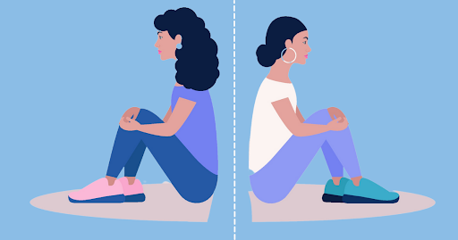
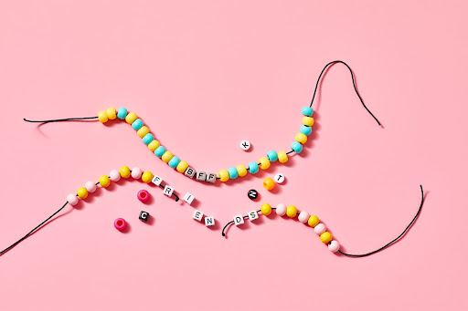

This article has been written and researched by our expert Loveable through a precise methodology. [Learn more about our methodology](https://avada.io/loveable/our-methodological.html)

[Loveable](https://avada.io/loveable/) > [Blog](https://avada.io/loveable/blog/) > [Relationship](https://avada.io/loveable/relationship/)

# How to End A Friendship: 6 Best Ways without Hurting Their Feelings

Written by [Luna Miller](https://avada.io/loveable/author/luna/) Last Updated on August 18, 2023

- [Some reasons for ending with a friend](https://avada.io/loveable/blog/how-to-end-a-friendship/#wp-block-heading-2-3) 
- [6 Best Ways to End a Friendship without hurting their feelings](https://avada.io/loveable/blog/how-to-end-a-friendship/#wp-block-heading-2-11)
    - [1\. Avoid spending time together](https://avada.io/loveable/blog/how-to-end-a-friendship/#wp-block-heading-3-13)
    - [2\. Directly and personally break up the friendship](https://avada.io/loveable/blog/how-to-end-a-friendship/#wp-block-heading-3-16)
    - [3\. Having a Talk](https://avada.io/loveable/blog/how-to-end-a-friendship/#wp-block-heading-3-19)
    - [4\. Express your concerns to them swiftly, forcefully, and nicely.](https://avada.io/loveable/blog/how-to-end-a-friendship/#wp-block-heading-3-23)
    - [5\. Allow the other person to speak](https://avada.io/loveable/blog/how-to-end-a-friendship/#wp-block-heading-3-25)
    - [6\. Set up definite boundaries for when the relationship ends.](https://avada.io/loveable/blog/how-to-end-a-friendship/#wp-block-heading-3-28)
- [How to deal with the repercussions](https://avada.io/loveable/blog/how-to-end-a-friendship/#wp-block-heading-2-31)
    - [1\. Prepare yourself for the heartbreak of a broken friendship.](https://avada.io/loveable/blog/how-to-end-a-friendship/#wp-block-heading-3-34)
    - [2\. Control angry feelings](https://avada.io/loveable/blog/how-to-end-a-friendship/#wp-block-heading-3-37)
    - [3\. Accept the friends who don’t take your side](https://avada.io/loveable/blog/how-to-end-a-friendship/#wp-block-heading-3-40)
- [Final Thoughts](https://avada.io/loveable/blog/how-to-end-a-friendship/#wp-block-heading-2-45)

Life is so long, you have much time for experience, and you have much time for new things. Friendship is an example of a dispensable part of every individual. It is a spice of life to make it more vivid and meaningful. Each other will have many opportunities to meet others in their life, and they will probably be long-lasting life partners.

However, some are not; you are not responsible for remaining in unexpected relationships just because you don’t want to hurt them. Nevertheless, it is inevitable. Real life has many pressures, so you shouldn’t put up with things you don’t think are necessary. You and they used to have beautiful moments together, so this post about “**how to end a friendship in 6 best ways without hurting their feelings”** is essential to you before action.

## **Some reasons for ending with a friend** 

As you know, some toxic relationships need to be skipped in case you get stressed about them. Just only maintain the ones you get a happy feeling when beside them. Don’t have to make them your obligation. There are some factors you should consider to end a friendship.

- Location: you and your friend do not stay close
- Faithful: it is difficult to remain in a relationship with a liar
- Toxicity: your friend makes everything become worse
- Compulsory: you don’t have responsibility for anyone except for your family
- Respectation: you don’t feel respected

More and more aspects else you can realize to end the friendship. Let’s eliminate them as long as you feel uncomfortable and meaningless. So, How to end a friendship?

## **6 Best Ways to End a Friendship without hurting their feelings**

### 1\. **Avoid spending time together**

Your relationship will gradually fade if you reject all their invitations to meet each other. If you are not a neighbor, not same school, and have different ideas, there are no reasons for you to accept this bond. So for a long time do not contact each other, you and they will soon forget about this friendship. 

Except for emergencies, don’t make a call first, and be ready to skip several phone calls from them if it is not necessary. After a few rejections, they will gradually understand your intention. They will no longer try to contact you anymore. This solution is the most common way to break up a relationship.

### 2\. **Directly and personally break up the friendship**

For some people, this is the best polite way to end up a friendship. The first tip in some cases will not be effective because it takes time to consider why you continuously avoid their invitations. The questions that keep swirling around in their heads make them feel uncomfortable and deeply hurt. 

Therefore, arrange a short time to reveal your opinion seriously to them directly. Telling them to know the reasons and hoping for their respect are the most effective ways to break up this friendship. If you get nothing, you must be brave enough to ask for a relationship cut-off.

### 3\. **Having a Talk**

You can actively make an appointment with them to talk directly that you want to end up the friendship. However, this way is difficult because your words would make them surprised and disappointed immediately. 

For a moment, they would show their unexpected facial expression, or even worse, angry. How to duel with this case? First, you should carefully select a suitable location for this announcement. Some public areas are good choices for the worst circumstance to limit their hot-tempered behavior. 

### 4\. **Express your concerns to them swiftly, forcefully, and nicely.**

Do it as soon as possible to cut off this friendship. Don’t lengthen the conversation if you have already broken up with them. That can mislead them that you guys get along very well and will be shocked if you say something unexpected. Therefore, showing them immediately when catching their eyes.

### 5\. **Allow the other person to speak**

If you still think these are unkind and find out how to end a friendship more politely, you must learn to listen to others’ confide. Of course, it will not change your decision, but at least it can make your friends feel better than a frank farewell. 

Let them a last time. Whether good or bad, benefit or drawback, you and your friends have already had moments together. So, be respected; everyone needs to know that. Respecting others is respecting yourself. Patiently listen to their talk.

### 6\. **Set up definite boundaries for when the relationship ends.**

It doesn’t make sense how you end a friendship if your friend still wants to keep in touch with you. They will try to annoy you several times. You have to be strict to cut off this relationship because you can’t ultimately end the relationship yet if you make concessions.

You should once more time seriously talk to them to stop or block all communication ways with them. In that way, you reject their requirement entirely. 

## **How to deal with the repercussions**

Your behavior would leave some trouble that needed to solve carefully. You may consider them before you certainly want to end a friendship. 

### 1\. **Prepare yourself for the heartbreak of a broken friendship.**

Prepare yourself for the heartbreak of a broken friendship. You two could not get along even if you used to have beautiful moments together. The break of friendship is unpredicted, but it is inevitable. When you and them don’t have any chance to enjoy each other company, it is deeply hurtful.

You or them or the two will have to face the worst times. It will be hard to recover the wound in the heart. About your side,  you will feel guilty, although it is not anyone’s fault. However, you have broken this bond, so you always blame yourself.

### 2\. **Control angry feelings**

No one can be normal when facing this situation when a friend tells another that they want **to** end this [toxic friendship](https://avada.io/loveable/navigating-toxic-friendships/). It can be a nightmare for both of them. The feeling of hurt and betrayal will soon turn into hatred. Losing control on both sides can lead to unexpected behavior. When you can feel hot-tempered and have hints of danger, find some ways to get away.

If your former friend tends to be aggressive, it might lead to a scuffle. So keep a cool head and behave properly when facing that situation. You should keep the best beautiful things left in your mind. 

### 3\. **Accept the friends who don’t take your side**

How to end a friendship in a team group without affecting others? The end of two members can lead to group disbandment. Then, they will be divided into two sides, you or his/her, or in some worst cases; no one takes your side. Therefore, you have to understand that your action can also negatively affect surrounding people. End up a friendship can cause a chain relationship. So you have to be responsible for your intention.

**_See More:_**

- [How to Make Friendship Bracelets](https://avada.io/loveable/how-to-make-friendship-bracelets/)

- How to [Leave An Abusive Relationsh](https://avada.io/loveable/leave-an-abusive-relationship/)

## **Final Thoughts**

As this post has mentioned above, **ending up a friendship** is an unexpected situation that no one intends to do. However, you have your own life pressure, you have your own worry, and you do not have an obligation to remain in toxic relationships. The elimination is necessary for other opportunities in life.

This is **“How to End A Friendship in 6 Best Ways without Hurting Their Feelings”** for you to make good preparation in any circumstance. Whether good or bad, you should not hurt anyone for any reason. 

- [Some reasons for ending with a friend](https://avada.io/loveable/blog/how-to-end-a-friendship/#wp-block-heading-2-3) 
- [6 Best Ways to End a Friendship without hurting their feelings](https://avada.io/loveable/blog/how-to-end-a-friendship/#wp-block-heading-2-11)
    - [1\. Avoid spending time together](https://avada.io/loveable/blog/how-to-end-a-friendship/#wp-block-heading-3-13)
    - [2\. Directly and personally break up the friendship](https://avada.io/loveable/blog/how-to-end-a-friendship/#wp-block-heading-3-16)
    - [3\. Having a Talk](https://avada.io/loveable/blog/how-to-end-a-friendship/#wp-block-heading-3-19)
    - [4\. Express your concerns to them swiftly, forcefully, and nicely.](https://avada.io/loveable/blog/how-to-end-a-friendship/#wp-block-heading-3-23)
    - [5\. Allow the other person to speak](https://avada.io/loveable/blog/how-to-end-a-friendship/#wp-block-heading-3-25)
    - [6\. Set up definite boundaries for when the relationship ends.](https://avada.io/loveable/blog/how-to-end-a-friendship/#wp-block-heading-3-28)
- [How to deal with the repercussions](https://avada.io/loveable/blog/how-to-end-a-friendship/#wp-block-heading-2-31)
    - [1\. Prepare yourself for the heartbreak of a broken friendship.](https://avada.io/loveable/blog/how-to-end-a-friendship/#wp-block-heading-3-34)
    - [2\. Control angry feelings](https://avada.io/loveable/blog/how-to-end-a-friendship/#wp-block-heading-3-37)
    - [3\. Accept the friends who don’t take your side](https://avada.io/loveable/blog/how-to-end-a-friendship/#wp-block-heading-3-40)
- [Final Thoughts](https://avada.io/loveable/blog/how-to-end-a-friendship/#wp-block-heading-2-45)

### [Luna Miller](https://avada.io/loveable/author/luna/)

I'm Luna Miller, a helpful employee at Loveable. I excel at giving great advice on birthday gifts. I love suggesting memorable experiences like concerts, spas, and getaways. As a reliable and supportive colleague, I'm always there to assist.

- [Twitter](https://twitter.com/intent/tweet)
- [Facebook](https://www.facebook.com/sharer/sharer.php)
- [instagram](https://avada.io/loveable/blog/how-to-end-a-friendship/)
- [pinterest](https://www.pinterest.com/loveablellc/)

## Related Posts

[

### 35 Unforgettable Exciting Adult Birthday Party Ideas

](https://avada.io/loveable/blog/adult-birthday-party-ideas/)

[

### 42 Best 21st Birthday Outfits to Rock the Party

](https://avada.io/loveable/blog/21st-birthday-outfits/)

[

### 50+ Happy 40th Anniversary Quotes, Messages, and Wishes

](https://avada.io/loveable/blog/happy-40th-anniversary-quotes/)

[

### 100+ Heartwarming Happy 30th Anniversary Quotes, Messages, and Wishes

](https://avada.io/loveable/blog/happy-30th-anniversary-quotes/)

[

### 120+ Heartfelt Thank You Messages for The Birthday Wishes

](https://avada.io/loveable/blog/thank-you-messages-birthday-wishes/)
