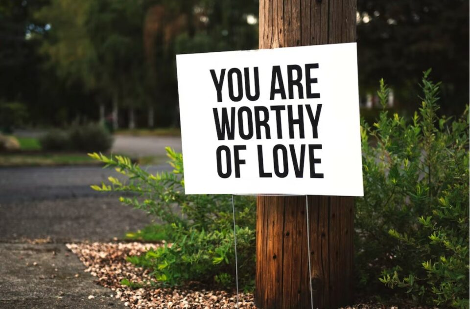

This article has been written and researched by our expert Loveable through a precise methodology. [Learn more about our methodology](https://avada.io/loveable/our-methodological.html)

[Loveable](https://avada.io/loveable/) > [Blog](https://avada.io/loveable/blog/) > [Relationship](https://avada.io/loveable/relationship/)

# How To Heal From A Breakup: 11 Ways To Recover

Written by [Luna Miller](https://avada.io/loveable/author/luna/) Last Updated on August 18, 2023

- [Recognize that “failing” is normal for many relationships](https://avada.io/loveable/blog/heal-from-a-breakup/#wp-block-heading-2-4)
- [Understand that it takes time to move on](https://avada.io/loveable/blog/heal-from-a-breakup/#wp-block-heading-2-9)
- [Try to remember the good things in mind](https://avada.io/loveable/blog/heal-from-a-breakup/#wp-block-heading-2-13)
- [Allow yourself to relax and take a break](https://avada.io/loveable/blog/heal-from-a-breakup/#wp-block-heading-2-18)
- [Listen to sad and deep music](https://avada.io/loveable/blog/heal-from-a-breakup/#wp-block-heading-2-22)
- [Speak to those who will be helpful](https://avada.io/loveable/blog/heal-from-a-breakup/#wp-block-heading-2-27)
- [Read novels about breakups](https://avada.io/loveable/blog/heal-from-a-breakup/#wp-block-heading-2-31)
- [Sleep, eat, exercise](https://avada.io/loveable/blog/heal-from-a-breakup/#wp-block-heading-2-35)
- [Be kind to yourself](https://avada.io/loveable/blog/heal-from-a-breakup/#wp-block-heading-2-38)
- [Meet some new people](https://avada.io/loveable/blog/heal-from-a-breakup/#wp-block-heading-2-42)
- [Set clear limits](https://avada.io/loveable/blog/heal-from-a-breakup/#wp-block-heading-2-45)
- [The importance of healing after a breakup](https://avada.io/loveable/blog/heal-from-a-breakup/#wp-block-heading-2-48)
- [The Bottom Line](https://avada.io/loveable/blog/heal-from-a-breakup/#wp-block-heading-2-56)

The greatest happiness someone can hope for is to love and be loved. Hence, when it breaks—when you split from your ex—it hurts the most. You become emotionally drained after a breakup, filled with grief, regret, remorse, wrath, hostility… You could feel helpless to survive this breakup at times when you experience terror.

And at that moment, what do you want the most? It is the way to **recover and heal from a breakup**, for getting over a breakup, let go of an ex, and shake off unfavorable feelings so that you can embrace a new chapter in your life. To accomplish that, you must learn how to move on after a relationship ends – not just for your feelings, but also so that you will be prepared and receptive to meeting someone better suited in the future.

Numerous relationship gurus and therapists have discussed healthy strategies to move on after a breakup, as well as decisions and actions to prevent “sliding in the wrong direction” with an ex-lover. That can be discovered in this article, which provides **11 ways to recover**, the answer for the question: **How to heal from a breakup**.

## **Recognize that “failing” is normal for many relationships**

There will always be an end if there is a beginning. Every relationship in our life will occasionally come and go. We also need to recognize that “failing” is just a normal thing for many relationships.

In maturity, some of our relationships will fall apart. It doesn’t matter if it happened because we didn’t act appropriately, because we failed to find the perfect partner, or because we drifted apart. Many of the relationships in our lives end, which is quite acceptable. It is not shameful that it is occurring to you right now; we all have to accept the truth that it will happen to us at some moment or another.

That doesn’t change the fact that a breakup is a highly painful experience—by breakup, we mean any form of separation, the end of a partnership, or a divorce. It is followed by a tough, protracted, and equally painful process called healing. You can think of breaking up with your ex as the beginning of your search for another lovely relationship. Opportunities may come themselves sooner or later; you simply need to accept the “fail” in one relationship in order to reach the “peak” in another. 

“Failing” is normal

## **Understand that it takes time to move on**

No matter how long or brief a relationship is, we all have happy memories and moments with that person, and it can be difficult to move on from those amazing times. Yet you should be aware that moving on takes time.

It takes however long it needs to heal. The length of the mending process will vary depending on the individual in each relationship. One thing you must remember is that the period following a breakup should not be rushed since your hearts require time to heal after the period in which you begin to love yourself more, and this cannot be done quickly.

Don’t put pressure on yourself because you feel you are still dealing with your ex-hurt partner’s feelings after six months or a year has passed. Everyone processes a breakup in their own special way. Simply said, just let it be what it is. When you feel you are done and are ready to find another relationship or to know that you have totally gotten out of that stuff, that is the time you have moved on.

## **Try to remember the good things in mind**

When a relationship ends, we frequently focus on the negative aspects, such as how the other person wounded us or how they didn’t make us happy in the first place. We usually place the blame for our conflicts on one another, but we seldom acknowledge that those occurrences were what ultimately led to our separation.

We ought to consider that period to be our happiest memory instead. You should make an effort to recognize the positive aspects of that relationship in order to come to a healthy conclusion and prevent resentment-inducing thoughts like, “How can I spend my time with that type of person,” or something like that. Don’t regret the enjoyable times you had together. Recognize that despite the connection not developing as you had anticipated, you still learned something useful from it and did not waste your time by doing nothing.

Being in a relationship—more or less—will always help you learn something new or take a step toward developing yourself. You’ve at least gained some insight into who you are, and you can now use that information to advance yourself.

Remember good things

## **Allow yourself to relax and take a break**

Take your time to unwind and relax. You struggle with negative thoughts and feelings that sometimes can even be toxic, and you’re sick of always thinking about them. So disregard everything and indulge in your favorite activities while taking the best break ever. You, more than anyone else, deserve those things. One of the finest ways to deal with your breakup and a nice method to heal yourself may be to take some time off.

Also, it’s usually preferable to let one’s emotions flow naturally, especially right after a split. But sometimes the feelings are so strong that they might not be suitable for public exhibition.

So take a break, find a quiet place, and cry it out. Scream it out or yell it out. It’s acceptable to vent and release all of your negative energy. That is what you should do in order to unwind and take a rest.

## **Listen to sad and deep music**

The ideal love companion for each of us is always music. Only music that has beautiful melodies and tender, loving lyrics may speak to a person’s heart on a deep level. In order to be able to relate to every word and melody of the song, most people would opt to listen to sad music even when they are breaking up.

To be really honest, in the short term, it might serve to remind you of unpleasant memories or trigger them, bringing back everything you went through with your ex. It seems like time is passing quickly and that every wonderful moment flashes before your eyes. Nevertheless, it also normalizes your grieving so that you know you’re not alone at the end of the day. You may ponder and cry a lot while listening to depressing music, so don’t be afraid to let your bad thoughts show through your tears.

Just immerse yourself in music and feel a sense of comfort when you have nothing to offer or do; music won’t let you go as your ex did.

Listen to sad songs

## **Speak to those who will be helpful**

Speaking and expressing are undoubtedly the best ways to release your negative thought and receive words of encouragement. You just need to find the right person ‘s shoulder to cry on, and you will surely be relieved. Sharing with your best another has no doubt been one of the most chosen ways of people nowadays, so do not keep it inside and take it on your own. Let it out and have a close talk with your beloved one.

Relatives and friends can be helpful, but be aware of their limitations as well. Not all friends will be able to relate to your experiences and provide you uplifting advice, so you can look for friends who specialize in healing at that point.

You can decide that getting expert advice from therapists is more useful or appropriate because it can provide you a neutral viewpoint that will last for a long time. In order to make future relationships healthier and happier, they can also highlight deeper patterns of behavior or thinking that a failed relationship may be symptomatic of. In conclusion, find someone that you feel that they may be helpful and you are comfortable to talk with.

## **Read novels about breakups**

Try reading books or novels about breakups if you don’t prefer sound like listening to music or conversing with people and just want to do something by yourself in a quiet and tranquil setting so that you may gradually heal yourself.

Something about reading silent words on a paper that express what you are feeling can be soothing in a way that little else can. Rebooting your brain’s logic regions, which may have been inundated or turned off by your emotional state, also helps. There are many different categories of books, but novels tend to be one of the most popular. Even straightforward self-help books can give your racing mind the proper jolt it need.

Read novels about breakup

## **Sleep, eat, exercise**

Perhaps you forget about yourself and the necessities of daily life when you are too preoccupied with your failed relationships and entirely focused on them. Sleeping, eating, and exercising regularly are everyday activities that can occasionally help you heal. Give it a try and they will never let you down since, as normal as it may seem, if you don’t do these acts for a while, you might notice a change in your mood.

Even while it may be tempting to break your usual routine, this is the time when adherence to it is really necessary. As much as possible, adhere to your regular sleeping and eating schedules (and portions), and leave the house.

## **Be kind to yourself**

When was the last time you gave yourself the greatest possible care? It is true that you have lost yourself for a very long time and seldom ever take the time to do the things you enjoy or show yourself love. Even though your relationship may end in this way, you can still forgive others, love someone else, and sacrifice everything for someone else. So keep in mind that you are the most important person, and now is the time to treat yourself nicely.

It’s okay to practice self-care habits now that you might otherwise view as superfluous indulgences. Get a new haircut, go shopping for clothing, accessories, or makeup, indulge in some chocolate,… Just do anything that strengthens your perception of oneself as a confident, comforting person. You are your main priority right now, so stop worrying about anything or anyone else and give yourself the finest care possible.

Be kind to yourself

## **Meet some new people**

Try to build [new relationships](https://avada.io/loveable/questions-new-relationship/) with some new people if you’re feeling lost or lonely. Rebounding can be perilous, but it is acceptable when a person feels ready to test the dating waters (this often takes three to six months). In fact, doing this is probably the quickest way to feel like a potential mate again. The secret is to move slowly and steadily.

Do not rush into a relationship for which you are not prepared or ready, do not force yourself into one, and do not use someone else to make up for your broken and missing heart. That new person could be a confidant with whom you feel comfortable sharing, an acquaintance, or another person you believe you could go on a date with. Just try, but don’t let yourself get lost again, and be careful with strangers.

## **Set clear limits**

A relationship that is on-again, off-again and unclear is one of the worst outcomes of a breakup since it nearly always results in misery that only gets worse. This is not to indicate that you shouldn’t tie up loose ends or bring up significant unanswered concerns and issues with an ex; it also does not imply that reconciliations never take place. Yet after a breakup, you should try to avoid speaking to that individual as much as you can. It is similar to going through drug detoxification in that there is a challenging withdrawal period, but it is necessary in order to go on and heal.

That can only be the person you’ve met and enjoyed your interactions with; that cannot be the person you may turn to once again or with whom you can rekindle your relationship. If you part ways amicably with your sweetheart, it is best to stay friends and support one another in times of need. Keep your distance and establish firm boundaries, but never fall in love again.

## **The importance of healing after a breakup**

Although recovering from a breakup can be a difficult process, it is crucial to our development and the possibility of a more successful partnership in the near future.

The greatest aspect of mending is realizing how valuable you truly are. Relationships do not establish your value; rather, your value is based on how well you know and value yourself and how you hold other people accountable for living up to their standards. Once you realize your worth, you’ll be sending out a lot of rejection letters because most individuals don’t deserve to interact with you.

Healing is a journey, not a destination. No one can fill your love cup up like you, so be kind to this process and get used to loving yourself more.

You are worthy of love.

**_See More:_**

- [How To Break Up With A Girl](https://avada.io/loveable/break-up-with-a-girl/) Without Hurting Her
- [How To Get Turned On](https://avada.io/loveable/how-to-get-turned-on/) Fast

## **The Bottom Line**

Nobody ever finds it simple to recover from a breakup, and not everyone in the world is adept at doing so. If you are a person that just had a sad breakup, you will find “**How to heal from breakup**” with our **11 ways to recover**.

Although it could be difficult at first, if you take our advice, you will undoubtedly feel better after a split. The good news is that the clouds typically clear after the awful downpour. Thus, give it a try, and these suggestions won’t let you down.

- [Recognize that “failing” is normal for many relationships](https://avada.io/loveable/blog/heal-from-a-breakup/#wp-block-heading-2-4)
- [Understand that it takes time to move on](https://avada.io/loveable/blog/heal-from-a-breakup/#wp-block-heading-2-9)
- [Try to remember the good things in mind](https://avada.io/loveable/blog/heal-from-a-breakup/#wp-block-heading-2-13)
- [Allow yourself to relax and take a break](https://avada.io/loveable/blog/heal-from-a-breakup/#wp-block-heading-2-18)
- [Listen to sad and deep music](https://avada.io/loveable/blog/heal-from-a-breakup/#wp-block-heading-2-22)
- [Speak to those who will be helpful](https://avada.io/loveable/blog/heal-from-a-breakup/#wp-block-heading-2-27)
- [Read novels about breakups](https://avada.io/loveable/blog/heal-from-a-breakup/#wp-block-heading-2-31)
- [Sleep, eat, exercise](https://avada.io/loveable/blog/heal-from-a-breakup/#wp-block-heading-2-35)
- [Be kind to yourself](https://avada.io/loveable/blog/heal-from-a-breakup/#wp-block-heading-2-38)
- [Meet some new people](https://avada.io/loveable/blog/heal-from-a-breakup/#wp-block-heading-2-42)
- [Set clear limits](https://avada.io/loveable/blog/heal-from-a-breakup/#wp-block-heading-2-45)
- [The importance of healing after a breakup](https://avada.io/loveable/blog/heal-from-a-breakup/#wp-block-heading-2-48)
- [The Bottom Line](https://avada.io/loveable/blog/heal-from-a-breakup/#wp-block-heading-2-56)

### [Luna Miller](https://avada.io/loveable/author/luna/)

I'm Luna Miller, a helpful employee at Loveable. I excel at giving great advice on birthday gifts. I love suggesting memorable experiences like concerts, spas, and getaways. As a reliable and supportive colleague, I'm always there to assist.

- [Twitter](https://twitter.com/intent/tweet)
- [Facebook](https://www.facebook.com/sharer/sharer.php)
- [instagram](https://avada.io/loveable/blog/heal-from-a-breakup/)
- [pinterest](https://www.pinterest.com/loveablellc/)

## Related Posts

[

### 35 Unforgettable Exciting Adult Birthday Party Ideas

](https://avada.io/loveable/blog/adult-birthday-party-ideas/)

[

### 42 Best 21st Birthday Outfits to Rock the Party

](https://avada.io/loveable/blog/21st-birthday-outfits/)

[

### 50+ Happy 40th Anniversary Quotes, Messages, and Wishes

](https://avada.io/loveable/blog/happy-40th-anniversary-quotes/)

[

### 100+ Heartwarming Happy 30th Anniversary Quotes, Messages, and Wishes

](https://avada.io/loveable/blog/happy-30th-anniversary-quotes/)

[

### 120+ Heartfelt Thank You Messages for The Birthday Wishes

](https://avada.io/loveable/blog/thank-you-messages-birthday-wishes/)
