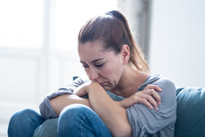
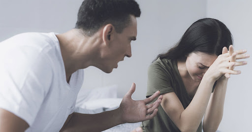

This article has been written and researched by our expert Loveable through a precise methodology. [Learn more about our methodology](https://avada.io/loveable/our-methodological.html)

[Loveable](https://avada.io/loveable/) > [Blog](https://avada.io/loveable/blog/) > [Relationship](https://avada.io/loveable/relationship/)

# How to Leave An Abusive Relationship And Not Bother About It Anymore

Written by [Luna Miller](https://avada.io/loveable/author/luna/) Last Updated on August 18, 2023

- [The token of an abusive relationship](https://avada.io/loveable/blog/leave-an-abusive-relationship/#wp-block-heading-2-3)
- [How to Leave An Abusive Relationship](https://avada.io/loveable/blog/leave-an-abusive-relationship/#wp-block-heading-2-12)
    - [Prepare yourself emotionally](https://avada.io/loveable/blog/leave-an-abusive-relationship/#wp-block-heading-3-14)
    - [Make a safety plan](https://avada.io/loveable/blog/leave-an-abusive-relationship/#wp-block-heading-3-17)
    - [Keep in mind why you left](https://avada.io/loveable/blog/leave-an-abusive-relationship/#wp-block-heading-3-20)
    - [Prioritize yourself first](https://avada.io/loveable/blog/leave-an-abusive-relationship/#wp-block-heading-3-24)
    - [Develop your independence](https://avada.io/loveable/blog/leave-an-abusive-relationship/#wp-block-heading-3-27)
- [Where to find support](https://avada.io/loveable/blog/leave-an-abusive-relationship/#wp-block-heading-2-29)
    - [Hotlines](https://avada.io/loveable/blog/leave-an-abusive-relationship/#wp-block-heading-3-32)
    - [Support groups and organizations](https://avada.io/loveable/blog/leave-an-abusive-relationship/#wp-block-heading-3-34)
    - [Therapy](https://avada.io/loveable/blog/leave-an-abusive-relationship/#wp-block-heading-3-36)
- [The bottom line](https://avada.io/loveable/blog/leave-an-abusive-relationship/#wp-block-heading-2-41)

Abusive relationships can be tough to leave, especially if you have been with your partner for a long time. Leaving an abusive relationship is incredibly brave, and ensuring you are safe and supported throughout the process can be essential. No matter how difficult the situation may seem, there are effective ways to find support and create a better future for yourself. You are not responsible for everyone in life, so being considered to disconnect to unnecessary relationships. 

This article will provide some practical advice on **how to leave an abusive relationship** in a safe way. It will cover topics such as understanding abuse, recognizing signs of an abusive partner, getting support from family and friends, making a safety plan, and legal options for protecting yourself.

## **The token of an abusive relationship**

There are many signs for you to recognize a toxic relationship that you must spend time thinking about. If you realize some red flags below, you should rethink the good or bad relationship. They are all bad signs of behavior that need to be strongly rejected. 

- Alienate you from your family and friends
- Want to know where you are and what you’re doing all the time
- Assume control of your finances, and plans without discussion
- Rarely do people accept responsibility or admit fault.
- Manipulate your behaviors and thoughts
- Exhibit strong emotions and behavior, such as obsession and possessiveness
- Commit acts of physical, emotional, or sexual violence

## **How to Leave An Abusive Relationship**

How to Leave An Abusive Relationship

### **Prepare yourself emotionally**

Before doing anything, to get a good result, you have to make good preparation. The more prepared you are, the less risk you will encounter, especially emotions first. Consider how to leave an abusive relationship after your mind has already been nerves of steel. 

Ending a relationship is over physical behavior, but afterward, facing its consequences in mental health is more serious. It would take time to recover; besides, just by confidence and determination, you can eliminate this toxic relationship.

### **Make a safety plan**

As mentioned above, careful preparation is extremely necessary in any case. Let’s make a draft of your plan. What are you going to do, what is the tool, who will involve in it, and what are the consequences? With the detailed outline, you can limit the risks as much as possible. 

But notice that your aim is an abusive relationship that needs to be left. It would be more dangerous than you have estimated. In the worst case, you need someone who calls for an emergency as everything gets out of control.

### **Keep in mind why you left**

Keep in mind why you left

You must leave this abusive relationship and consider it carefully after action. It is important that you are not responsible for keeping in touch with anyone without your family. However, your decision is based on you, and yours is on your side, too; your partner could reject it.

You want to get out of this abusive bond, but he/her don’t. It would be a shock for your partner. Your partner desperately begs you to stay. In this circumstance, you will be very hesitant and not ruthless enough to continue to hurt them. As a consequence, the abusive relationship is still retained, and you are getting more and more stress. So remember why you want to cut off this connection and how carefully you have thought to take a firm stance.

### **Prioritize yourself first**

It’s normal to wonder how your partner would react if you leave, particularly if they are verbally or emotionally abusive. But it’s also crucial to consider how you’re feeling, and you should put your own needs first. Remember that you have to prioritize yourself first; only when you love yourself can you love others. 

Don’t put too much burden on yourself what that person will be like. Recall what you had to suffer from him/her for a long time. Remember how painfully you had to fight with yourself to make this decision? So leave this offensive relationship out to welcome beautiful things more.

### **Develop your independence**

“Don’t depend on anyone” is one of the main living principles. How do you leave an abusive relationship if you depend too much on your partner in finance and mentality? It’s very difficult because you cannot do anything without money. Therefore, you must have your own source of income to do something after leaving. Don’t let yourself be in a passive position. Be independent soon and find a way to get out of this bond. Prepare for your own source of income, savings”; otherwise, you will forever stick to the person who makes you feel wretched.

## **Where to find support**

Where to find support

In some dangerous cases where you cannot do it yourself, calling for help is compulsory and safest. There are some available supports when you want to leave out an abusive relationship.

### **Hotlines**

Contact your local domestic abuse hotline, the [National Domestic Violence Hotline](https://www.thehotline.org/), or dial 211 for additional information on domestic violence and support in developing a safety plan. They will arrange to assist you as soon as possible **to** leave this malicious mistreatment.

### **Support groups and organizations**

Many groups are involved in supporting emergency conditions like that on the Internet. You can ask for help through social media platforms like Facebook, Instagram, Twitter, etc. Leave your brief information and condition for them to have a good rescue plan.

### **Therapy**

You have to be equipped with sufficient knowledge by a professional doctor. They will give you some valuable tips to overcome this nightmare before and after being rescued. Moreover, they will help you build good health and start a new life.

**_See More:_**

- [How to Get Over A Guy](https://avada.io/loveable/how-to-get-over-a-guy/)
- [My Husband Yells At Me](https://avada.io/loveable/my-husband-yells-at-me/): 11 Best Ways To Make Him Stop

## **The bottom line**

This article is some essential consultations for **how to leave an abusive relationship and not bother about it anymore**. It is really necessary for you to escape an abusive relationship permanently. Every situation is dissimilar, but developing a safety plan, forming a support network, prioritizing self-care, and being self-sufficient may all be required to bring you out.

Be active in calling for help. “No one ever deserves to experience abuse, and many resources available can help you heal,” according to Back. If you aren’t responsible for yourself, don’t hope for anyone to be responsible for you.

Life is a vivid experience, a gift from God, so don’t mistreat it. This is an award for enjoying, not for suffering. So don’t let this bad situation last any longer; love yourself more.

- [The token of an abusive relationship](https://avada.io/loveable/blog/leave-an-abusive-relationship/#wp-block-heading-2-3)
- [How to Leave An Abusive Relationship](https://avada.io/loveable/blog/leave-an-abusive-relationship/#wp-block-heading-2-12)
    - [Prepare yourself emotionally](https://avada.io/loveable/blog/leave-an-abusive-relationship/#wp-block-heading-3-14)
    - [Make a safety plan](https://avada.io/loveable/blog/leave-an-abusive-relationship/#wp-block-heading-3-17)
    - [Keep in mind why you left](https://avada.io/loveable/blog/leave-an-abusive-relationship/#wp-block-heading-3-20)
    - [Prioritize yourself first](https://avada.io/loveable/blog/leave-an-abusive-relationship/#wp-block-heading-3-24)
    - [Develop your independence](https://avada.io/loveable/blog/leave-an-abusive-relationship/#wp-block-heading-3-27)
- [Where to find support](https://avada.io/loveable/blog/leave-an-abusive-relationship/#wp-block-heading-2-29)
    - [Hotlines](https://avada.io/loveable/blog/leave-an-abusive-relationship/#wp-block-heading-3-32)
    - [Support groups and organizations](https://avada.io/loveable/blog/leave-an-abusive-relationship/#wp-block-heading-3-34)
    - [Therapy](https://avada.io/loveable/blog/leave-an-abusive-relationship/#wp-block-heading-3-36)
- [The bottom line](https://avada.io/loveable/blog/leave-an-abusive-relationship/#wp-block-heading-2-41)

### [Luna Miller](https://avada.io/loveable/author/luna/)

I'm Luna Miller, a helpful employee at Loveable. I excel at giving great advice on birthday gifts. I love suggesting memorable experiences like concerts, spas, and getaways. As a reliable and supportive colleague, I'm always there to assist.

- [Twitter](https://twitter.com/intent/tweet)
- [Facebook](https://www.facebook.com/sharer/sharer.php)
- [instagram](https://avada.io/loveable/blog/leave-an-abusive-relationship/)
- [pinterest](https://www.pinterest.com/loveablellc/)

## Related Posts

[

### 35 Unforgettable Exciting Adult Birthday Party Ideas

](https://avada.io/loveable/blog/adult-birthday-party-ideas/)

[

### 42 Best 21st Birthday Outfits to Rock the Party

](https://avada.io/loveable/blog/21st-birthday-outfits/)

[

### 50+ Happy 40th Anniversary Quotes, Messages, and Wishes

](https://avada.io/loveable/blog/happy-40th-anniversary-quotes/)

[

### 100+ Heartwarming Happy 30th Anniversary Quotes, Messages, and Wishes

](https://avada.io/loveable/blog/happy-30th-anniversary-quotes/)

[

### 120+ Heartfelt Thank You Messages for The Birthday Wishes

](https://avada.io/loveable/blog/thank-you-messages-birthday-wishes/)
