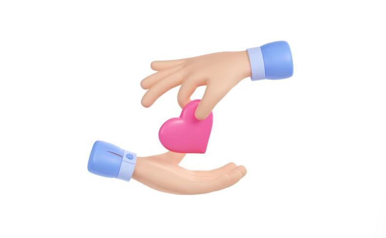
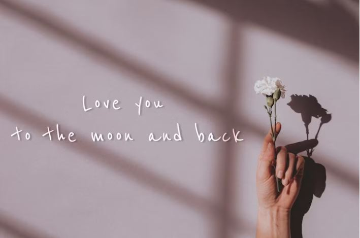
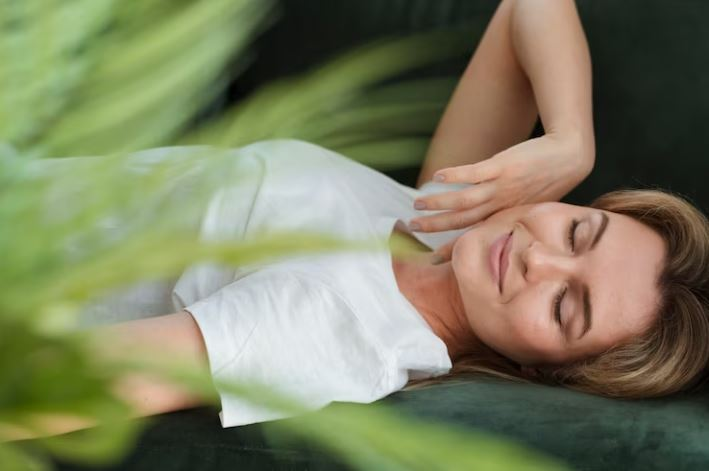

This article has been written and researched by our expert Loveable through a precise methodology. [Learn more about our methodology](https://avada.io/loveable/our-methodological.html)

[Loveable](https://avada.io/loveable/) > [Blog](https://avada.io/loveable/blog/) > [Relationship](https://avada.io/loveable/relationship/)

# How To Love Yourself: 15 Useful Ways to Increase Your Self-love

Written by [Luna Miller](https://avada.io/loveable/author/luna/) Last Updated on August 18, 2023

- [Why do you need to love yourself?](https://avada.io/loveable/blog/how-to-love-yourself/#wp-block-heading-2-3)
- [15 Useful Ways To Love Yourself](https://avada.io/loveable/blog/how-to-love-yourself/#wp-block-heading-2-15)
    - [1\. Understand yourself](https://avada.io/loveable/blog/how-to-love-yourself/#wp-block-heading-3-16)
    - [2\. You should not compare yourself to others](https://avada.io/loveable/blog/how-to-love-yourself/#wp-block-heading-3-20)
    - [3\. Say “no” when necessary](https://avada.io/loveable/blog/how-to-love-yourself/#wp-block-heading-3-22)
    - [4\. Permit yourself to make mistakes](https://avada.io/loveable/blog/how-to-love-yourself/#wp-block-heading-3-27)
    - [5\. Keep in mind that your worth is not dependent on how you look](https://avada.io/loveable/blog/how-to-love-yourself/#wp-block-heading-3-31)
    - [6\. Don’t be afraid to let go of poisonous people](https://avada.io/loveable/blog/how-to-love-yourself/#wp-block-heading-3-34)
    - [7\. Deal with fears](https://avada.io/loveable/blog/how-to-love-yourself/#wp-block-heading-3-38)
    - [8\. Believe in your ability to decide well for yourself](https://avada.io/loveable/blog/how-to-love-yourself/#wp-block-heading-3-40)
    - [9\. Embrace every chance life offers you or make your own](https://avada.io/loveable/blog/how-to-love-yourself/#wp-block-heading-3-44)
    - [10\. Feel everything you can, including joy and pain](https://avada.io/loveable/blog/how-to-love-yourself/#wp-block-heading-3-46)
    - [11\. Look for beauty in the little things](https://avada.io/loveable/blog/how-to-love-yourself/#wp-block-heading-3-48)
    - [12\. Take care of yourself](https://avada.io/loveable/blog/how-to-love-yourself/#wp-block-heading-3-50)
    - [13\. Make a treat for yourself](https://avada.io/loveable/blog/how-to-love-yourself/#wp-block-heading-3-53)
    - [14\. Be sincere with yourself](https://avada.io/loveable/blog/how-to-love-yourself/#wp-block-heading-3-57)
    - [15\. Let yourself off the hook for your shortcomings and faults](https://avada.io/loveable/blog/how-to-love-yourself/#wp-block-heading-3-61)
- [How to love yourself: The bottom line](https://avada.io/loveable/blog/how-to-love-yourself/#wp-block-heading-2-68)

In a world that often comes down hard on us and tells us who we should be instead of celebrating our unique quirks, it can be easy to fall into the trap of self-doubt and disappointment. But these feelings don’t have to become your norm; if you’re willing to put in the work, learning **how to love yourself** is totally achievable!

Here are 15 practical tips for honing your sense of self-love so that you can feel empowered and confident about who you are. With dedication and care, you’ll soon find yourself falling head over heels for YOU—for real.

## Why do you need to love yourself?

You gain self-worth, self-confidence, and an overall sense of happiness when you love yourself. So if you can learn to love yourself, you’ll feel happier and take better care of yourself.

When looking in the mirror, most of us see a variety of imperfections and recall far too many negative events and failures to love ourselves. The less you love, listen to, and comprehend yourself, the more confused, dissatisfied, and disappointed you will be in life. 

When you start to love yourself and continue to love yourself more and more each day, things will gradually improve in every manner.

Why do you need to love yourself?

Before we go into how to love yourself, let’s see some main reasons why you need to love yourself:

- Self-loathing and self-criticism are ineffective methods of self-motivation. They always backfire in the end.
- Loving and embracing yourself is the most effective method to affect long-term change in your life.
- It enables you to love others more deeply.
- Loving yourself relieves you of the burden of worrying about what others think of you.
- You may heal with the past by loving yourself.
- You can only allow people to love themselves if you first do it.

## 15 Useful Ways To Love Yourself

### 1\. Understand yourself

Understand yourself

In case you don’t know who you are, it’s difficult to love yourself. Invest in learning what you believe, value, and like when it comes to how to love yourself.

Seeking self-awareness is both normal and necessary. To embrace ourselves and have a feeling of belonging, we must first comprehend who we are. A strong sense of self guides us through life and gives significance to our experiences.

### 2\. You should not compare yourself to others

Because we are socialized to be competitive, comparing ourselves to others is natural. However, it can be harmful. It’s pointless to compare yourself to anyone else on the earth since there is only one of you. Instead, concentrate on yourself and your path. Simply shifting your energy can help you feel released.

### 3\. Say “no” when necessary

Boundaries are restrictions we establish to defend our time, energy, and physical and emotional well-being. Boundaries help us communicate to others what we expect and how we want to be treated.

Boundaries distinguish one person from another. When we lack boundaries, we are more prone to become trapped by people. We lose our feeling of identity. We become people-pleasers, preoccupied with satisfying the expectations of others rather than being ourselves. 

And if you’re entangled, you might not realize you have the right to make your own decisions or establish limits. Boundaries are an important kind of self-care because they communicate to others that you deserve and demand respect.

Say “no” when necessary

### 4\. Permit yourself to make mistakes

We’re told from an early age that “nobody’s perfect, and everyone makes errors.” However, the older you become, the more pressure you feel to never fail. Give yourself some tolerance! 

Make mistakes so as to learn and develop from them. Accept your past. You are continually evolving from who you were to who you are today and who you will be a day.

So ignore that voice in your brain that tells you you have to be flawless. Make plenty of failures! The lessons you’ll learn will be invaluable.

### 5\. Keep in mind that your worth is not dependent on how you look

This is key! So many things in the world seek to divert your attention away from this strong reality. Even your own internalized sexism might support your feelings of inadequacy. You are significant because you are unique, not because of your physical appearance.

So, how to love yourself is to wear whatever makes you happy. Wear whatever makes you feel confident, comfortable, and joyful, whether it’s a lot or a little.

### 6\. Don’t be afraid to let go of poisonous people

Don’t be afraid to let go of poisonous people

Not everyone accepts responsibility for the energy they emit into the universe. If someone is bringing toxicity into your life and refuses to accept responsibility, you may need to distance yourself from them. Don’t be frightened to try it. Even though it’s difficult, it’s freeing and necessary.

Remember to protect your energy. It is neither impolite or bad to withdraw oneself from situations or the presence of individuals that exhaust you.

### 7\. Deal with fears

Fear, like err, is a normal and human emotion. Understand your worries rather than ignoring them. This healthful workout can significantly improve your mental health. Interrogating and examining your concerns might help you get insight and uncover issues in your life that have been causing you distress. This, in turn, can help relieve some, if not all, of your tension.

### 8\. Believe in your ability to decide well for yourself

From a young age, we are taught that “nobody’s perfect, and everyone makes mistakes.” But as you get older, you feel more pressure to behave flawlessly. 

You haven’t lost touch with reality. You are the best advocate for yourself because you know yourself better than anybody else.

Believe in your ability to decide well for yourself

### 9\. Embrace every chance life offers you or make your own

The time for your next significant step in life will never be ideal. The setup may not be ideal, but it should not prevent you from pursuing your objectives and dreams. Instead, seize the moment since it may never be repeated.

### 10\. Feel everything you can, including joy and pain

Allow yourself to feel everything completely. Lean into your suffering, delight in your joy, and don’t limit your emotions. Fear, pain, and delight, for example, are emotions that will help you understand yourself and, eventually, recognize that you are not your feelings.

### 11\. Look for beauty in the little things

Every day, try to notice at least one wonderful, tiny item around you. Make a mental note of it and be thankful for it. Gratitude not only provides perspective, but it is also necessary for finding joy.

### 12\. Take care of yourself

Take care of yourself

Don’t add your criticism or nasty comments to the growing list of them around the globe. Don’t be harsh to yourself; instead, be good to yourself. Learning how to love yourself and be confident means gratifying yourself. You’ve grown a lot and come a long way. Remember to celebrate yourself throughout the year, not just on your [birthday](https://avada.io/loveable/birthday/)!

### 13\. Make a treat for yourself

It is usually simpler to relax tight limits than to tense up loose ones. A lot of people make this error. Naturally, you want to appear kind, nice, and like you belong when you meet new people or begin a new job. You’re more prone to overcommit, accept obligations, or adopt opinions that don’t sit well with you as a consequence.

People-pleasing leads to weak or flexible boundaries that are challenging to enforce afterward. For instance, when your ex returns the kids, you clearly state that you don’t want her to enter your home. 

It’s simple to later extend an invitation to her if you decide it’s suitable from this strong limit. Given that you first granted her full access to your house, it is considerably tougher to inform her afterward that she cannot enter.

### 14\. Be sincere with yourself

Smaller issues are always simpler to handle. Don’t wait to speak out until someone has crossed your boundaries a dozen times. It is unfair to presume that people are aware of your boundaries before you have explicitly stated them. 

Furthermore, it is unfair to “alter the rules” and tell your cousin that you will no longer assist her in paying her rent after doing so cheerfully for the previous three months.

Be sincere with yourself

### 15\. Let yourself off the hook for your shortcomings and faults

Forgiveness is sometimes characterized as a conscious decision to release sentiments of rage, wrath, and vengeance toward someone who you believe has harmed you. However, while you may be fairly forgiving towards others, you may be much harsher on yourself.

Everyone makes mistakes, but it’s crucial for mental health and wellbeing to know how to grow from them, let go, move on, and forgive oneself.

Learn more about why self-forgiveness is good and examine some techniques that may assist you in becoming more proficient at forgiving your own faults.

**_See More:_**

- How To [Heal From A Breakup](https://avada.io/loveable/heal-from-a-breakup/)

- [How To Be More Social](https://avada.io/loveable/how-to-be-more-social/) – Anyone Can Try

## How to love yourself: The bottom line

Loving yourself is essential in life as it builds confidence, encourages positive self-talk, and helps you to make healthier decisions. As you work through the **15 key pieces of advice on how to love yourself more**, remember that this journey doesn’t happen overnight, and it’s OK if you take baby steps along the way. Self-love requires patience and determination. 

Most important of all, be kind and loving towards yourself. Acknowledge each step you take as progress, even if it feels small or insignificant. Believe in yourself and trust that will help you find your own personal sense of worthiness as well as recognize your true self-worth for who you are today. 

Although it may not always be easy to love ourselves, focusing on our efforts instead of the end goal can give us a greater appreciation for the strength and courage we possess within us to keep going even when times get tough. We can begin unlocking our capacities for true joy and inner peace by focusing on one day at a time—it’s all part of the incredible adventure that is to learn how to love yourself again fully.

- [Why do you need to love yourself?](https://avada.io/loveable/blog/how-to-love-yourself/#wp-block-heading-2-3)
- [15 Useful Ways To Love Yourself](https://avada.io/loveable/blog/how-to-love-yourself/#wp-block-heading-2-15)
    - [1\. Understand yourself](https://avada.io/loveable/blog/how-to-love-yourself/#wp-block-heading-3-16)
    - [2\. You should not compare yourself to others](https://avada.io/loveable/blog/how-to-love-yourself/#wp-block-heading-3-20)
    - [3\. Say “no” when necessary](https://avada.io/loveable/blog/how-to-love-yourself/#wp-block-heading-3-22)
    - [4\. Permit yourself to make mistakes](https://avada.io/loveable/blog/how-to-love-yourself/#wp-block-heading-3-27)
    - [5\. Keep in mind that your worth is not dependent on how you look](https://avada.io/loveable/blog/how-to-love-yourself/#wp-block-heading-3-31)
    - [6\. Don’t be afraid to let go of poisonous people](https://avada.io/loveable/blog/how-to-love-yourself/#wp-block-heading-3-34)
    - [7\. Deal with fears](https://avada.io/loveable/blog/how-to-love-yourself/#wp-block-heading-3-38)
    - [8\. Believe in your ability to decide well for yourself](https://avada.io/loveable/blog/how-to-love-yourself/#wp-block-heading-3-40)
    - [9\. Embrace every chance life offers you or make your own](https://avada.io/loveable/blog/how-to-love-yourself/#wp-block-heading-3-44)
    - [10\. Feel everything you can, including joy and pain](https://avada.io/loveable/blog/how-to-love-yourself/#wp-block-heading-3-46)
    - [11\. Look for beauty in the little things](https://avada.io/loveable/blog/how-to-love-yourself/#wp-block-heading-3-48)
    - [12\. Take care of yourself](https://avada.io/loveable/blog/how-to-love-yourself/#wp-block-heading-3-50)
    - [13\. Make a treat for yourself](https://avada.io/loveable/blog/how-to-love-yourself/#wp-block-heading-3-53)
    - [14\. Be sincere with yourself](https://avada.io/loveable/blog/how-to-love-yourself/#wp-block-heading-3-57)
    - [15\. Let yourself off the hook for your shortcomings and faults](https://avada.io/loveable/blog/how-to-love-yourself/#wp-block-heading-3-61)
- [How to love yourself: The bottom line](https://avada.io/loveable/blog/how-to-love-yourself/#wp-block-heading-2-68)

### [Luna Miller](https://avada.io/loveable/author/luna/)

I'm Luna Miller, a helpful employee at Loveable. I excel at giving great advice on birthday gifts. I love suggesting memorable experiences like concerts, spas, and getaways. As a reliable and supportive colleague, I'm always there to assist.

- [Twitter](https://twitter.com/intent/tweet)
- [Facebook](https://www.facebook.com/sharer/sharer.php)
- [instagram](https://avada.io/loveable/blog/how-to-love-yourself/)
- [pinterest](https://www.pinterest.com/loveablellc/)

## Related Posts

[

### 35 Unforgettable Exciting Adult Birthday Party Ideas

](https://avada.io/loveable/blog/adult-birthday-party-ideas/)

[

### 42 Best 21st Birthday Outfits to Rock the Party

](https://avada.io/loveable/blog/21st-birthday-outfits/)

[

### 50+ Happy 40th Anniversary Quotes, Messages, and Wishes

](https://avada.io/loveable/blog/happy-40th-anniversary-quotes/)

[

### 100+ Heartwarming Happy 30th Anniversary Quotes, Messages, and Wishes

](https://avada.io/loveable/blog/happy-30th-anniversary-quotes/)

[

### 120+ Heartfelt Thank You Messages for The Birthday Wishes

](https://avada.io/loveable/blog/thank-you-messages-birthday-wishes/)
