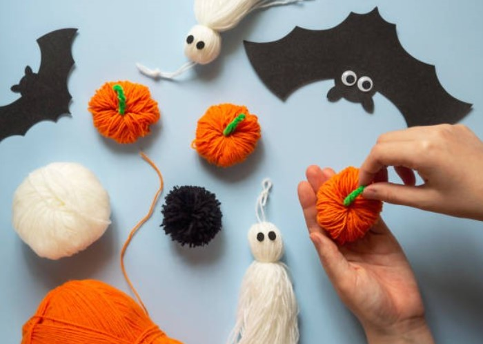
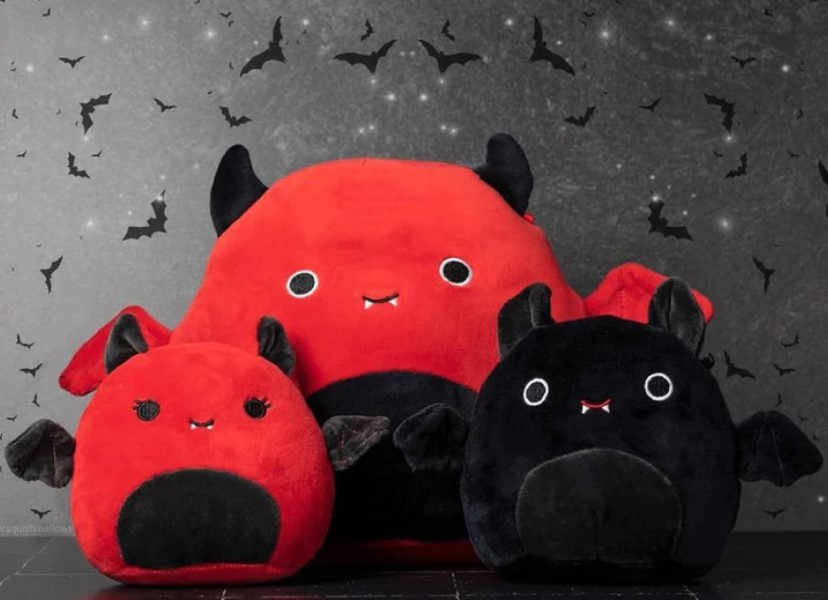
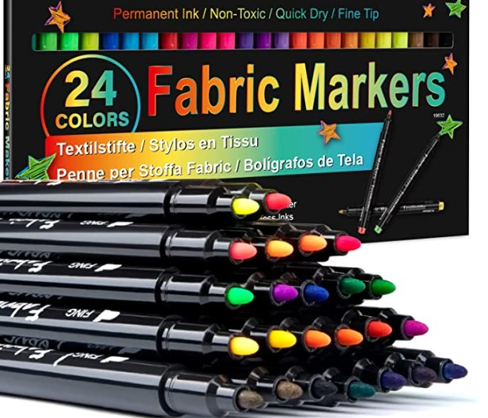
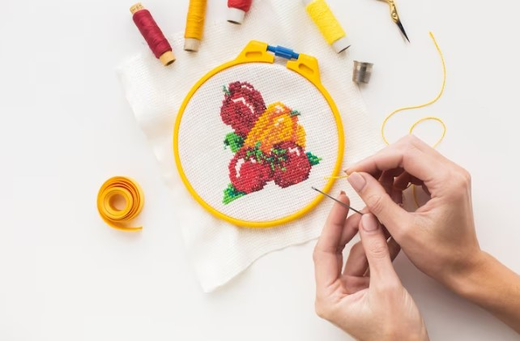
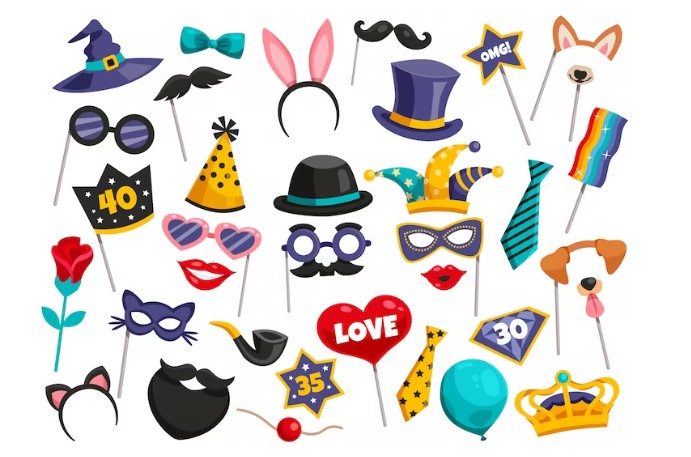
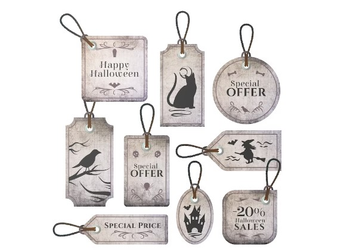
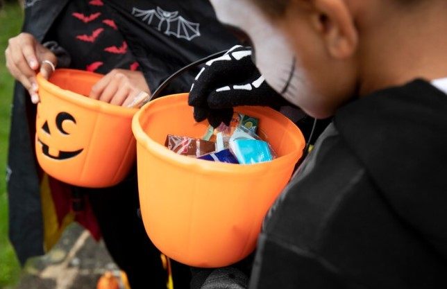
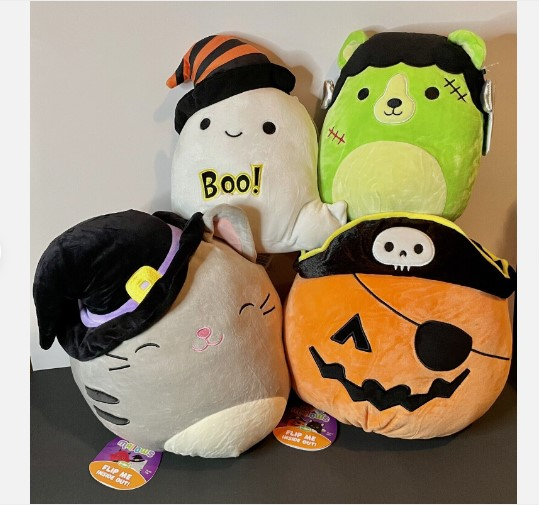

This article has been written and researched by our expert Loveable through a precise methodology. [Learn more about our methodology](https://avada.io/loveable/our-methodological.html)

[Loveable](https://avada.io/loveable/) > [Blog](https://avada.io/loveable/blog/) > [Holiday](https://avada.io/loveable/holiday/)

# How to Make a Personal Halloween Squishmallow

Written by [Blake Simpson](https://avada.io/loveable/author/blake/) Last Updated on October 03, 2023

- [What is a Halloween squishmallow?](https://avada.io/loveable/blog/make-personal-halloween-squishmallow/#wp-block-heading-2-3)
- [4 ways to make personal Halloween squishmallow](https://avada.io/loveable/blog/make-personal-halloween-squishmallow/#wp-block-heading-2-9)
    - [Adding Colorful Details to Your Halloween Squishmallow with Markers and Fabric Paint](https://avada.io/loveable/blog/make-personal-halloween-squishmallow/#wp-block-heading-3-13)
        - [Step 1: Collect your materials](https://avada.io/loveable/blog/make-personal-halloween-squishmallow/#wp-block-heading-4-15) 
        - [Step 2: Plan your design.](https://avada.io/loveable/blog/make-personal-halloween-squishmallow/#wp-block-heading-4-17) 
        - [Step 3: Commence the painting process.](https://avada.io/loveable/blog/make-personal-halloween-squishmallow/#wp-block-heading-4-20) 
        - [Step 4: Personalize with names or messages.](https://avada.io/loveable/blog/make-personal-halloween-squishmallow/#wp-block-heading-4-22) 
    - [Adding Dimension and Texture to Halloween Squishmallow with Embroidery](https://avada.io/loveable/blog/make-personal-halloween-squishmallow/#wp-block-heading-3-25)
        - [Step 1: Prepare your embroidery supplies.](https://avada.io/loveable/blog/make-personal-halloween-squishmallow/#wp-block-heading-4-27) 
        - [Step 2: Select your embroidery design.](https://avada.io/loveable/blog/make-personal-halloween-squishmallow/#wp-block-heading-4-29) 
        - [Step 3: Ready your Squishmallows.](https://avada.io/loveable/blog/make-personal-halloween-squishmallow/#wp-block-heading-4-31) 
        - [Step 4: Commence the embroidery process.](https://avada.io/loveable/blog/make-personal-halloween-squishmallow/#wp-block-heading-4-34) 
        - [Step 5: Explore diverse embroidery techniques.](https://avada.io/loveable/blog/make-personal-halloween-squishmallow/#wp-block-heading-4-36) 
    - [Making personalized Halloween squishmallow with Accessories and Costumes](https://avada.io/loveable/blog/make-personal-halloween-squishmallow/#wp-block-heading-3-39)
        - [Step 1: Collect costume supplies.](https://avada.io/loveable/blog/make-personal-halloween-squishmallow/#wp-block-heading-4-41) 
        - [Step 2: Choose a theme or character.](https://avada.io/loveable/blog/make-personal-halloween-squishmallow/#wp-block-heading-4-43) 
        - [Step 3: Fabricate the costumes.](https://avada.io/loveable/blog/make-personal-halloween-squishmallow/#wp-block-heading-4-45) 
        - [Step 4: Explore various accessories.](https://avada.io/loveable/blog/make-personal-halloween-squishmallow/#wp-block-heading-4-48) 
        - [Step 5: Rotate costumes and accessories.](https://avada.io/loveable/blog/make-personal-halloween-squishmallow/#wp-block-heading-4-50) 
- [Creating personal Halloween squishmallow with Customized Tags](https://avada.io/loveable/blog/make-personal-halloween-squishmallow/#wp-block-heading-2-53)
    - [Step 1: Assemble tag-making supplies.](https://avada.io/loveable/blog/make-personal-halloween-squishmallow/#wp-block-heading-4-55) 
    - [Step 2: Cut out the tags.](https://avada.io/loveable/blog/make-personal-halloween-squishmallow/#wp-block-heading-4-58) 
    - [Step 3: Embellish the tags.](https://avada.io/loveable/blog/make-personal-halloween-squishmallow/#wp-block-heading-4-60)
    - [Step 4: Create a hole in the tags.](https://avada.io/loveable/blog/make-personal-halloween-squishmallow/#wp-block-heading-4-62) 
    - [Step 5: Attach the tags.](https://avada.io/loveable/blog/make-personal-halloween-squishmallow/#wp-block-heading-4-64) 

- [Caring for Your Personalized Halloween Squishmallow](https://avada.io/loveable/blog/make-personal-halloween-squishmallow/#wp-block-heading-2-67)
    - [Cleaning and maintaining your Halloween Squishmallow’s design](https://avada.io/loveable/blog/make-personal-halloween-squishmallow/#wp-block-heading-3-69)
    - [Tips for preserving the colors and details of Halloween squishmallow over time](https://avada.io/loveable/blog/make-personal-halloween-squishmallow/#wp-block-heading-3-78)
- [Conclusion](https://avada.io/loveable/blog/make-personal-halloween-squishmallow/#wp-block-heading-2-88)

Are you ready to take your Halloween celebrations to the next level of cuteness? Look no further than the adorable world of **Halloween Squishmallows**! These irresistibly soft and [huggable plush toys](https://avada.io/loveable/best-squishmallows/) are perfect for your spooky season. In this guide, we’ll explore how you can get your hands on a personal Halloween Squishmallow that matches your unique vision and satisfies your craving for both comfort and Halloween spirit.

Halloween Squishmallows have quickly become a must-have item for collectors and enthusiasts alike. With their charming designs and vibrant colors, these squishy companions capture the season’s essence most adorably.

## **What is a Halloween squishmallow?**

Halloween Squishmallow, which is one of the adorable plush toys, is a delightful collection of huggable and squishy companions that capture the essence of the spooky season. With their funny and amazing designs, these plushies have become a favorite among kids and adults alike.

Halloween Squishmallows come in a variety of characters, ranging from friendly ghosts and goofy monsters to adorable [Halloween pumpkins](https://avada.io/loveable/blog/halloween-pumpkin/) and cute witches. Each one is crafted with incredible attention to detail, featuring vibrant colors, soft textures, and irresistibly squishy bodies. Whether you’re looking for a funny Halloween Squishmallow to bring a smile to your face or an amazing one to add a touch of magic to your collection, there is a wide array of options to choose from.

What sets Halloween Squishmallows apart is their ability to become personal companions. You can find personalized Halloween Squishmallows that are customized to reflect your unique style and preferences. From selecting the design and colors to adding personal touches like names or initials, you can make your Halloween Squishmallow truly one-of-a-kind. These personal Halloween Squishmallows make great gifts or cherished keepsakes that bring joy and comfort throughout the year.

So, whether you’re starting your collection or adding to an existing one, Halloween Squishmallows are a must-have for any Halloween enthusiast. Get ready to snuggle up with these lovable plushies and let them bring a touch of whimsy and delight to your Halloween festivities.

## **4 ways to make personal Halloween squishmallow**

As Halloween Squishmallow gain popularity as companions during the eerie time of year, imagine the possibility of infusing them with a personal touch. By tapping into your creativity and utilizing straightforward DIY methods, you can modify and personalize these charming plush toys, enhancing their individuality and significance. 

Within this article, we will delve into a range of DIY concepts and provide clear, step-by-step guidance on how to metamorphose your Squishmallows into extraordinary creations that mirror your unique style and persona.

### **Adding Colorful Details to Your Halloween Squishmallow with Markers and Fabric Paint**

One of the simplest methods to personalize your Halloween Squishmallow is by utilizing fabric paint and markers to introduce vibrant and detailed elements. You have the option to enhance the existing design or craft entirely new patterns and motifs. Here’s a step-by-step guide:

#### **Step 1: Collect your materials** 

Ensure you have a variety of fabric paint colors, fabric markers, paintbrushes, and a palette.

#### **Step 2: Plan your design.** 

Consider the theme or concept you wish to incorporate into your Halloween Squishmallows. Whether it involves adding spiderwebs, bats, or vivid Halloween hues, sketch out your ideas beforehand.

#### **Step 3: Commence the painting process.** 

Use a fine-tipped brush to meticulously apply fabric paint onto the plush surface. Take your time and allow each layer to dry before adding further details. For smaller designs and intricate patterns, fabric markers can be utilized.

#### **Step 4: Personalize with names or messages.** 

Utilize fabric markers to inscribe names, initials, or spooky messages onto your Squishmallows. This imparts a personal touch and elevates their uniqueness.

With these straightforward techniques, you can transform your Halloween Squishmallow into personalized masterpieces that truly reflect your creative vision.

### **Adding Dimension and Texture to Halloween Squishmallow with Embroidery**

Adding texture and depth to your Halloween Squishmallow 2023 through embroidery is an exceptional technique that allows for customization. Regardless of your embroidery skill level, follow these steps to begin:

#### **Step 1: Prepare your embroidery supplies.** 

Ensure you have a collection of embroidery floss in diverse colors, embroidery needles, an embroidery hoop, and a pair of scissors.

#### **Step 2: Select your embroidery design.** 

Determine the patterns or images you wish to embroider onto your Squishmallows. Options can include spooky elements such as ghosts, pumpkins, or witches.

#### **Step 3: Ready your Squishmallows.** 

Place your Squishmallows into the embroidery hoop, securing the fabric tautly.

#### **Step 4: Commence the embroidery process.** 

Thread your needle with the desired embroidery floss color and initiate stitching your chosen design onto the plush surface. Utilize various stitches like backstitch, satin stitch, or French knots to incorporate texture and intricate details.

#### **Step 5: Explore diverse embroidery techniques.** 

Feel free to experiment by combining different colors, attempting various stitch combinations, or even integrating beads or sequins to introduce a touch of shimmer.

Through the art of embroidery, you can elevate your Halloween Squishmallows with captivating textures and visually stunning embellishments, making them truly unique and eye-catching.

### **Making personalized Halloween squishmallow with Accessories and Costumes**

Elevate the creativity of your DIY Halloween Squishmallow by embellishing them with accessories and costumes, effectively transforming them into distinct [Halloween characters](https://avada.io/loveable/blog/famous-halloween-cartoon-characters/) and creatures. Here’s a step-by-step guide on how to achieve this:

#### **Step 1: Collect costume supplies.** 

Seek out miniature Halloween costumes, small hats, ribbons, or fabric remnants that can be repurposed as attire for your Squishmallow.

#### **Step 2: Choose a theme or character.** 

Determine the desired appearance you wish to achieve. It could entail a vampire, a mummy, a witch, or any other Halloween-inspired character.

#### **Step 3: Fabricate the costumes.** 

Cut and sew fabric remnants to create miniature outfits that fit your Squishmallows. Employ hot glue or hand stitching to securely affix the costume pieces. Additionally, you can attach ribbons, bows, or tiny accessories such as miniature brooms or pumpkins to enhance the overall aesthetic.

#### **Step 4: Explore various accessories.** 

Don’t restrict yourself solely to costumes. Venture into additional accessories such as hats, capes, or even miniature props that can be incorporated to further amplify the Halloween spirit of your Squishmallows.

#### **Step 5: Rotate costumes and accessories.** 

Extend the enjoyment by crafting multiple costumes and accessories for your Squishmallows. You can interchange them based on your mood or the specific Halloween event you are celebrating.

With these steps, you can unleash your imagination and bring your Halloween Squishmallows to life, creating a diverse ensemble of characters that embody the spirit of the season.

## **Creating personal Halloween squishmallow with Customized Tags**

Personalize your DIY Halloween Squishmallow by crafting custom tags that provide a unique and intimate touch. These tags can feature your name, a heartfelt message, or even a distinct design. Here’s a step-by-step guide to creating customized tags:

#### **Step 1: Assemble tag-making supplies.** 

Prepare cardstock or thick paper, scissors, a hole punch, and markers or pens for writing.

#### **Step 2: Cut out the tags.** 

Utilize the cardstock or thick paper to cut small rectangular or shaped tags. Ensure they are large enough for writing, yet not overwhelming in size compared to your Squishmallows.

#### **Step 3: Embellish the tags.**

Enhance the tags with Halloween-themed drawings, patterns, or colors using markers or pens. You can also inscribe your name or a personalized message.

#### **Step 4: Create a hole in the tags.** 

Utilize the hole punch to make a small hole near the top of each tag. This will allow for easy attachment to your Squishmallows at a later stage.

#### **Step 5: Attach the tags.** 

Using string, ribbon, or small elastic bands, fasten the customized tags to your Squishmallows. You can tie them around their arms, tails, or necks, infusing a delightful and charming touch.

By following these steps, you can add a personal flair to your Halloween Squishmallows with customized tags, making them even more endearing and unique to you.

## **Caring for Your Personalized Halloween Squishmallow**

Your personalized Halloween Squishmallow is not only a cherished companion but also a unique representation of your creativity and style. Proper care is essential to ensure its longevity and keep it in the best possible condition. Below are some tips for caring for your funny, amazing, and personal Halloween Squishmallow.

### **Cleaning and maintaining your Halloween Squishmallow’s design**

Keeping your funny, amazing, and personal Halloween Squishmallow clean and maintaining its design is essential to preserve its charm and extend its lifespan. Here are some tips on how to effectively clean and care for your beloved Halloween Squishmallow:

- **Spot Cleaning:** Attend to any stains or spills promptly by gently spot-cleaning the affected area using a mild detergent and a soft cloth or sponge. Avoid saturating the plush material excessively, as it may affect the stuffing.

- **Air Drying:** After spot cleaning, allow your Halloween Squishmallow to air dry completely. Avoid using heat sources such as dryers or direct sunlight, as they can cause discoloration or damage to the fabric.
- **Brushing and Fluffing**: Periodically brush and fluff your Squishmallow to maintain its fluffy appearance. Use a soft-bristled brush or your hands to gently fluff the fur and remove any dust or debris.
- **Avoid Harsh Chemicals:** Refrain from using harsh chemicals, bleach, or abrasive cleaning agents, as they can damage the fabric or fade the colors of your Squishmallow.
- **Preventive Measures:** To protect the design of your Halloween Squishmallow, avoid exposing it to sharp objects, rough surfaces, or excessive friction that could potentially damage or alter its appearance.

By following these cleaning and maintenance guidelines, you can ensure that your Halloween Squishmallow retains its original vibrancy and remains a delightful companion for years to come. Treat your personal Squishmallow with care and enjoy the cuddles and joy it brings during the Halloween season and beyond.

### **Tips for preserving the colors and details of Halloween squishmallow over time**

Your funny, amazing, and personal Halloween Squishmallow is a delightful companion that brings joy and adds a touch of whimsy to the spooky season. To ensure that it’s vibrant colors and intricate details remain intact over time, here are some essential tips for preserving the beauty of your Squishmallow:

- **Display with Care:** When showcasing your Halloween Squishmallow, choose a location away from direct sunlight. Prolonged exposure to sunlight can cause colors to fade and fabric to deteriorate.

- **Avoid Harsh Cleaning Methods:** Use gentle cleaning techniques to prevent any damage to the colors and details of your Squishmallow. Spot clean with a mild detergent and a soft cloth, avoiding abrasive cleaners or excessive rubbing.
- **Store Properly:** When not in use, store your Halloween Squishmallow in a clean and dry environment. Consider placing it in a sealed container or airtight bag to protect it from dust, dirt, and moisture.
- **Gentle Handling**: Handle your Squishmallow with care, especially when moving or repositioning it. Avoid pulling on delicate embellishments or tugging forcefully, as this may cause damage to the design.
- **Rotate Displayed Squishmallows**: If you have multiple Halloween Squishmallows, periodically rotate them in your display to minimize any fading that may occur from prolonged exposure to light.

By following these tips, you can help preserve the colors and details of your Halloween Squishmallows, ensuring that they remain vibrant and captivating for years to come. Embrace the whimsy of these personal Squishmallows and let their charm shine through the ages.

_**Check Out**: [Halloween Perler Beads](https://avada.io/loveable/halloween-perler-beads/) – Spooky Crafts for a Festive Celebration_

## **Conclusion**

With every stroke of the brush, every carefully placed stitch, and every thoughtfully crafted costume, your Squishmallows will come alive, embodying your unique Halloween style. These personalized creations will not only serve as delightful decorations but also hold sentimental value as cherished keepsakes that evoke joy and fond memories for years to come.

So, gather your supplies, create a sacred space for your artistic endeavors, and immerse yourself in the enchanting process of customizing your very own DIY **Halloween Squishmallows.** Let the creative energy flow as you bring your imaginative visions to life, adding your personal touch to these lovable plush companions. Happy crafting, and may your Halloween be filled with magic, creativity, and endless smiles!

- [What is a Halloween squishmallow?](https://avada.io/loveable/blog/make-personal-halloween-squishmallow/#wp-block-heading-2-3)
- [4 ways to make personal Halloween squishmallow](https://avada.io/loveable/blog/make-personal-halloween-squishmallow/#wp-block-heading-2-9)
    - [Adding Colorful Details to Your Halloween Squishmallow with Markers and Fabric Paint](https://avada.io/loveable/blog/make-personal-halloween-squishmallow/#wp-block-heading-3-13)
        - [Step 1: Collect your materials](https://avada.io/loveable/blog/make-personal-halloween-squishmallow/#wp-block-heading-4-15) 
        - [Step 2: Plan your design.](https://avada.io/loveable/blog/make-personal-halloween-squishmallow/#wp-block-heading-4-17) 
        - [Step 3: Commence the painting process.](https://avada.io/loveable/blog/make-personal-halloween-squishmallow/#wp-block-heading-4-20) 
        - [Step 4: Personalize with names or messages.](https://avada.io/loveable/blog/make-personal-halloween-squishmallow/#wp-block-heading-4-22) 
    - [Adding Dimension and Texture to Halloween Squishmallow with Embroidery](https://avada.io/loveable/blog/make-personal-halloween-squishmallow/#wp-block-heading-3-25)
        - [Step 1: Prepare your embroidery supplies.](https://avada.io/loveable/blog/make-personal-halloween-squishmallow/#wp-block-heading-4-27) 
        - [Step 2: Select your embroidery design.](https://avada.io/loveable/blog/make-personal-halloween-squishmallow/#wp-block-heading-4-29) 
        - [Step 3: Ready your Squishmallows.](https://avada.io/loveable/blog/make-personal-halloween-squishmallow/#wp-block-heading-4-31) 
        - [Step 4: Commence the embroidery process.](https://avada.io/loveable/blog/make-personal-halloween-squishmallow/#wp-block-heading-4-34) 
        - [Step 5: Explore diverse embroidery techniques.](https://avada.io/loveable/blog/make-personal-halloween-squishmallow/#wp-block-heading-4-36) 
    - [Making personalized Halloween squishmallow with Accessories and Costumes](https://avada.io/loveable/blog/make-personal-halloween-squishmallow/#wp-block-heading-3-39)
        - [Step 1: Collect costume supplies.](https://avada.io/loveable/blog/make-personal-halloween-squishmallow/#wp-block-heading-4-41) 
        - [Step 2: Choose a theme or character.](https://avada.io/loveable/blog/make-personal-halloween-squishmallow/#wp-block-heading-4-43) 
        - [Step 3: Fabricate the costumes.](https://avada.io/loveable/blog/make-personal-halloween-squishmallow/#wp-block-heading-4-45) 
        - [Step 4: Explore various accessories.](https://avada.io/loveable/blog/make-personal-halloween-squishmallow/#wp-block-heading-4-48) 
        - [Step 5: Rotate costumes and accessories.](https://avada.io/loveable/blog/make-personal-halloween-squishmallow/#wp-block-heading-4-50) 
- [Creating personal Halloween squishmallow with Customized Tags](https://avada.io/loveable/blog/make-personal-halloween-squishmallow/#wp-block-heading-2-53)
    - [Step 1: Assemble tag-making supplies.](https://avada.io/loveable/blog/make-personal-halloween-squishmallow/#wp-block-heading-4-55) 
    - [Step 2: Cut out the tags.](https://avada.io/loveable/blog/make-personal-halloween-squishmallow/#wp-block-heading-4-58) 
    - [Step 3: Embellish the tags.](https://avada.io/loveable/blog/make-personal-halloween-squishmallow/#wp-block-heading-4-60)
    - [Step 4: Create a hole in the tags.](https://avada.io/loveable/blog/make-personal-halloween-squishmallow/#wp-block-heading-4-62) 
    - [Step 5: Attach the tags.](https://avada.io/loveable/blog/make-personal-halloween-squishmallow/#wp-block-heading-4-64) 

- [Caring for Your Personalized Halloween Squishmallow](https://avada.io/loveable/blog/make-personal-halloween-squishmallow/#wp-block-heading-2-67)
    - [Cleaning and maintaining your Halloween Squishmallow’s design](https://avada.io/loveable/blog/make-personal-halloween-squishmallow/#wp-block-heading-3-69)
    - [Tips for preserving the colors and details of Halloween squishmallow over time](https://avada.io/loveable/blog/make-personal-halloween-squishmallow/#wp-block-heading-3-78)
- [Conclusion](https://avada.io/loveable/blog/make-personal-halloween-squishmallow/#wp-block-heading-2-88)

### [Blake Simpson](https://avada.io/loveable/author/blake/)

Hi, I'm Blake from Loveable. I help people find perfect gifts for occasions like anniversaries and weddings. I also write a blog about holidays, sharing insights to make them more meaningful. Let's create unforgettable moments together!

- [Twitter](https://twitter.com/intent/tweet)
- [Facebook](https://www.facebook.com/sharer/sharer.php)
- [instagram](https://avada.io/loveable/blog/make-personal-halloween-squishmallow/)
- [pinterest](https://www.pinterest.com/loveablellc/)

## Related Posts

[### 120+ Christian Birthday Wishes To Spread Your Love](https://avada.io/loveable/blog/christian-birthday-wishes/) 

[

### 35 Best 70th Birthday Ideas To Celebrate The Special Milestone

](https://avada.io/loveable/blog/70th-birthday-ideas/)

[

### 50 Best 30th Birthday Decorations for a Remarkable Birthday Bash

](https://avada.io/loveable/blog/30th-birthday-decorations/)

[

### 40 Delicious Vegan Christmas Desserts to Delight Your Palate

](https://avada.io/loveable/blog/vegan-christmas-desserts/)

[

### 60 Christmas Team Building Activities to Boost Workplace Spirit

](https://avada.io/loveable/blog/christmas-team-building-activities/)
