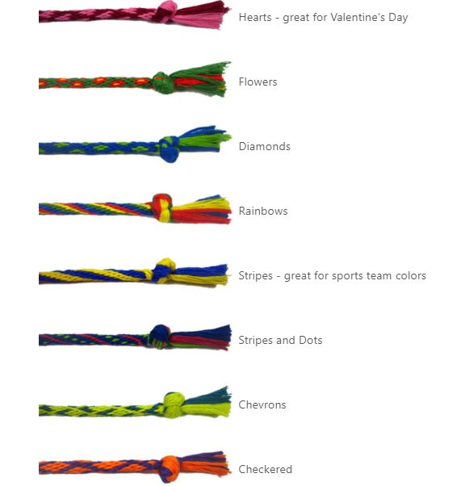
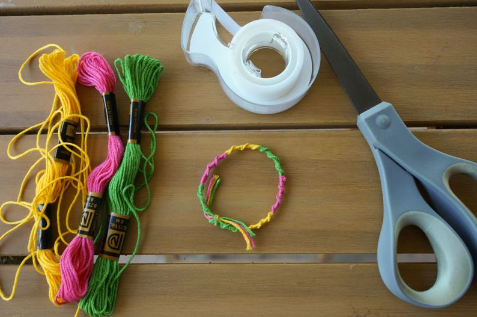
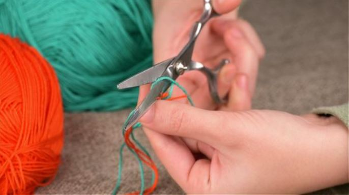
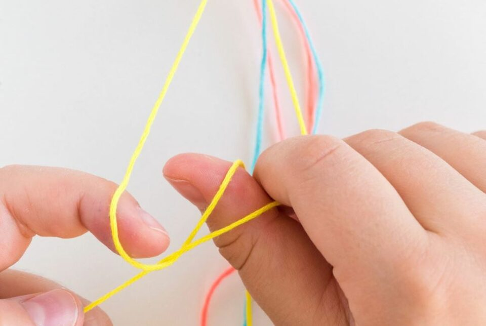
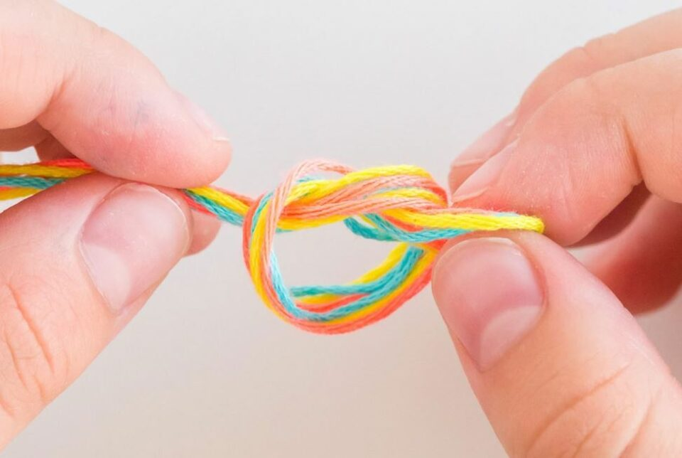
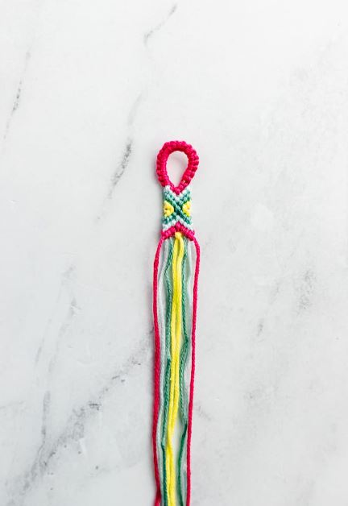
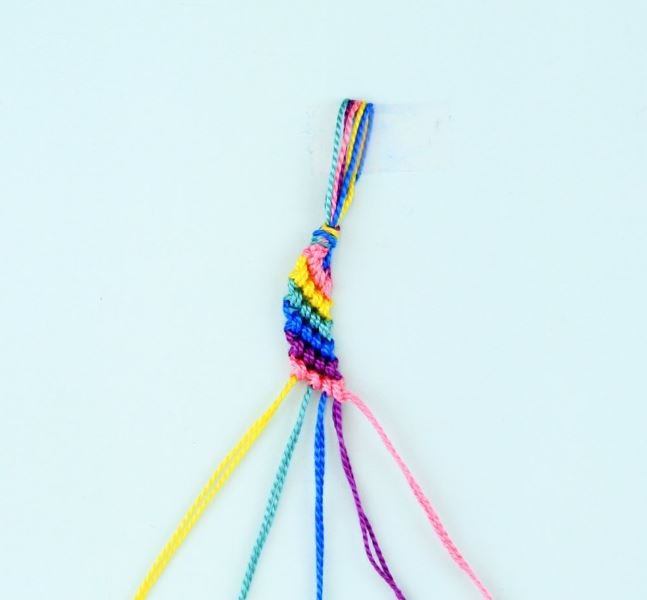
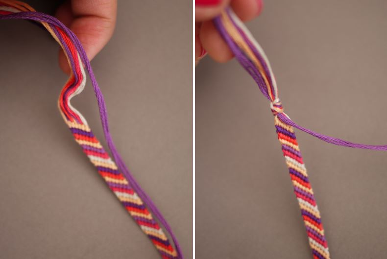
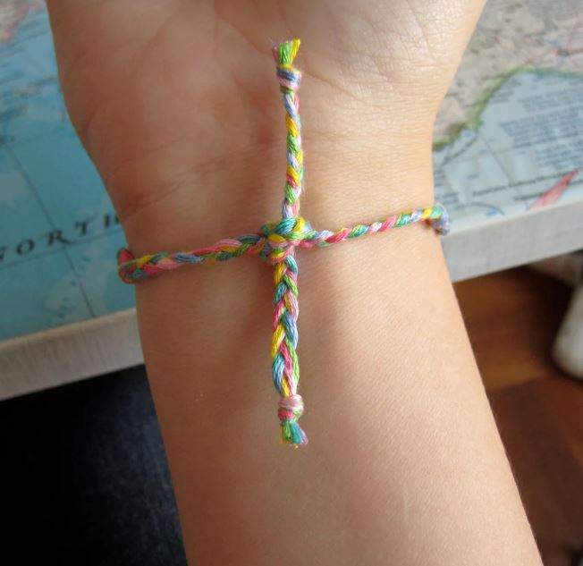

This article has been written and researched by our expert Loveable through a precise methodology. [Learn more about our methodology](https://avada.io/loveable/our-methodological.html)

[Loveable](https://avada.io/loveable/) > [Blog](https://avada.io/loveable/blog/) > [Relationship](https://avada.io/loveable/relationship/)

# How to Make Friendship Bracelets in 8 Simple Steps

Written by [Luna Miller](https://avada.io/loveable/author/luna/) Last Updated on August 18, 2023

- [The list of friendship bracelet designs](https://avada.io/loveable/blog/how-to-make-friendship-bracelets/#wp-block-heading-2-3)
- [How to make friendship bracelets in 8 simple steps](https://avada.io/loveable/blog/how-to-make-friendship-bracelets/#wp-block-heading-2-7)
    - [Step 1: Things you need to prepare](https://avada.io/loveable/blog/how-to-make-friendship-bracelets/#wp-block-heading-3-8)
    - [Step 2: Measuring and Cutting](https://avada.io/loveable/blog/how-to-make-friendship-bracelets/#wp-block-heading-3-14)
    - [Step 3: Determining the Number of Strands](https://avada.io/loveable/blog/how-to-make-friendship-bracelets/#wp-block-heading-3-19)
    - [Step 4: How to Start the Bracelet](https://avada.io/loveable/blog/how-to-make-friendship-bracelets/#wp-block-heading-3-25)
    - [Step 5: Create the knotting](https://avada.io/loveable/blog/how-to-make-friendship-bracelets/#wp-block-heading-3-31)
    - [Step 6: How it will look as you go](https://avada.io/loveable/blog/how-to-make-friendship-bracelets/#wp-block-heading-3-42)
    - [Step 7: Complete the bracelet](https://avada.io/loveable/blog/how-to-make-friendship-bracelets/#wp-block-heading-3-47)
    - [Step 8: Tie it on!](https://avada.io/loveable/blog/how-to-make-friendship-bracelets/#wp-block-heading-3-52)
- [Final Words](https://avada.io/loveable/blog/how-to-make-friendship-bracelets/#wp-block-heading-2-60)

We have all been there: as kids, making our first friendship bracelets for ourselves or friends was a rite of passage. Although not as popular today, these colorful [jewelry pieces](https://avada.io/loveable/personalized-jewelry/) are still around and can add an extra layer of beauty to your everyday wardrobe. 

Today’s article is here to tell you **how to make friendship bracelets** easy in 8 simple steps—no prior crafting experience is needed! Whether you are looking to create the perfect gift for a friend or want something fun and creative to do on your own during quarantine, this craft can be enjoyed by both young adults and adults alike. So get out those old spools of thread (or pick some up!) and let’s get started!

## The list of friendship bracelet designs

Making friendship bracelets with lovely, sophisticated designs is something that everyone can learn to do. However, if you’re a total newbie, you can still create a lovely bracelet like one of these:

_The list of friendship bracelet designs_

No extra tools or books are required to produce the bracelets on this page. With simply the directions on how to make friendship bracelets for beginners on this page, you’ll be able to create best friend bracelets, heart bracelets, and more.

## How to make friendship bracelets in 8 simple steps

### Step 1: Things you need to prepare

_Things you need to prepare_

First, you need to prepare embroidery floss/thin yarn, scissors, tape, or pins/safety pins.

The embroidery floss may be inexpensive and be sold in large quantities. You don’t require anything complicated. As long as it is six-stranded, it will be thick enough to form a lovely bracelet.

These adorable small skeins of yarn from Lion Brand called Bonbons are also available. Lordy, they are adorable.

As you braid or tie the friendship bracelet, the tape or pins will hold it in place.

### Step 2: Measuring and Cutting

_Measuring and Cutting_

As a general rule, you should cut floss pieces around 30 inches long, which is the distance between your fingertips and shoulder. With the first one, people often try 25, and it is often quite close.

My wrists are about 6 inches long, so just go ahead and double your wrist measurement by 5 to be safe. After all that knotting, you don’t want to run out of floss and be unable to complete it.

It could be a good idea to add extra 6 inches if your bracelet has more than six strands. Every row will result in more knots, which will speed up the process of using up each color.

### Step 3: Determining the Number of Strands

_Determining the Number of Strands_

Eight is the most strands others have ever worked with. It typically measures between 1/4 to 1/3 of an inch, is six, and is delicate but detailed.

You’ll need to block the bracelet if you want it to lay straight because additional strands make it difficult to keep track of them and cause them to become somewhat twisted.

Additionally, you may use two alternating colors or make each strand a different color, depending on the pattern you want to create. With very little effort, you can create a ton of lovely designs!

To help you visualize, there is a photo of an eight-strand bracelet opposite a six-strand bracelet.

### Step 4: How to Start the Bracelet

_How to Start the Bracelet_

Take your cut embroidery floss strands and tie an overhand knot at one end to start the bracelet.

Braid three inches down from this knot while attaching it to a surface like a table, your jeans, or a cushion. Make a second overhand knot at the bottom of the braid once you’ve completed it.

We’ll now get to the exciting part!

Just so everyone is aware, each final bracelet will include three inches of braiding on each end (for a total of six inches) and three to four inches of knotting that forms the bracelet itself.

### Step 5: Create the knotting

Making a number of tiny knots gives the surface of a friendship bracelet its ridged, woven-like appearance.

You must first choose the sequence in which you want your strands to appear. This will influence the arrangement of your rows’ colors.

_Create the knotting_

Take the first two strands once they are arranged in sequence. Your first row will be formed using the strand that is furthest to the left. To do this, you’ll be knotting it around the other strands of floss or yarn.

- Take the first strand and cross it over the second strand before passing it behind. It’s crucial to knot OVER the second strand since it will give it the proper appearance.
- Now bring the first strand up and toward the big knot while maintaining tension on the second strand. Do not pull any harder once you encounter resistance. A little knot will be formed on the second thread as a result.
- Make another knot by re-tying the first thread around the second strand – just do it again!
- Continue working across to the right, making two knots on each strand of floss/yarn in the bracelet with the first strand.
- When you’ve knotted all the way across to the right and reached the end of the floss/yarn, start over with the first strand on the left. Make careful to tie TWO knots on each thread.
- Continue until you have 3-4 inches of knotting completed.

### Step 6: How it will look as you go

_How it will look as you go_

This is a helpful method for understanding what you’re doing on how to make friendship bracelets.

You’re simply working your way across with whichever color is on the left, forming two knots on each strand to the right. The color you just finished bringing all the way to the right will always dangle to the side, letting you know when you’ve completed a row.

It should be simple to detect if you skip a strand or neglect to finish a row. It’s a good idea to keep a needle nearby to assist you in picking out any knots if you make a mistake – they’re so little that it’s difficult to complete with your fingers!

### Step 7: Complete the bracelet

_Complete the bracelet_

When it comes to how to make friendship bracelets adjustable, you’re good to finish your bracelet once you’ve completed 3–4 inches of knotting.

At the very end of the bracelet’s main section, tie another overhand knot. Braid three inches from that knot, then tie another knot.

Now trim the excess yarn or floss from the bracelet’s ends. You’re done now!

### Step 8: Tie it on!

Tie it on!

It will be very simple to tie and untie because of the manner we braided it, so you will be able to do it on your own.

They can no longer be worn into the shower and then dripping wet for hours afterward. They could not be removed. Either you wore them, or you severed them and damaged them.

Your bracelet could twist up a little if you tied it in a rage. You may pin it or glue it to a flat surface to assist in fighting this and make sure it is pulled very tightly.

**_See More:_**

- [Best Friend Poems](https://avada.io/loveable/best-friend-poems/)

- What Is A [Platonic Friendship](https://avada.io/loveable/platonic-friendship/)

## Final Words

Creating [personalized bracelets](https://avada.io/loveable/personalized-bracelets/) may seem overwhelming, but it can actually be quite enjoyable and easy—especially with a few helpful tips! From the initial step of deciding what type of bracelet you are going to make and what materials you need, all the way through to tying the knot at the end, these 8 easy steps on **how to make friendship bracelets** with thread will ensure that your vision comes to fruition. 

Although time-consuming and detailed, making friendship bracelets is an experience worth trying. Not only will you improve your knots skills, but also have something unique that you can show off or even give as a gift. So take this journey one step at a time and soon enough, you’ll see how amazing the finished product will turn out! So don’t wait any longer, get started on making your own custom friendship bracelet today!

- [The list of friendship bracelet designs](https://avada.io/loveable/blog/how-to-make-friendship-bracelets/#wp-block-heading-2-3)
- [How to make friendship bracelets in 8 simple steps](https://avada.io/loveable/blog/how-to-make-friendship-bracelets/#wp-block-heading-2-7)
    - [Step 1: Things you need to prepare](https://avada.io/loveable/blog/how-to-make-friendship-bracelets/#wp-block-heading-3-8)
    - [Step 2: Measuring and Cutting](https://avada.io/loveable/blog/how-to-make-friendship-bracelets/#wp-block-heading-3-14)
    - [Step 3: Determining the Number of Strands](https://avada.io/loveable/blog/how-to-make-friendship-bracelets/#wp-block-heading-3-19)
    - [Step 4: How to Start the Bracelet](https://avada.io/loveable/blog/how-to-make-friendship-bracelets/#wp-block-heading-3-25)
    - [Step 5: Create the knotting](https://avada.io/loveable/blog/how-to-make-friendship-bracelets/#wp-block-heading-3-31)
    - [Step 6: How it will look as you go](https://avada.io/loveable/blog/how-to-make-friendship-bracelets/#wp-block-heading-3-42)
    - [Step 7: Complete the bracelet](https://avada.io/loveable/blog/how-to-make-friendship-bracelets/#wp-block-heading-3-47)
    - [Step 8: Tie it on!](https://avada.io/loveable/blog/how-to-make-friendship-bracelets/#wp-block-heading-3-52)
- [Final Words](https://avada.io/loveable/blog/how-to-make-friendship-bracelets/#wp-block-heading-2-60)

### [Luna Miller](https://avada.io/loveable/author/luna/)

I'm Luna Miller, a helpful employee at Loveable. I excel at giving great advice on birthday gifts. I love suggesting memorable experiences like concerts, spas, and getaways. As a reliable and supportive colleague, I'm always there to assist.

- [Twitter](https://twitter.com/intent/tweet)
- [Facebook](https://www.facebook.com/sharer/sharer.php)
- [instagram](https://avada.io/loveable/blog/how-to-make-friendship-bracelets/)
- [pinterest](https://www.pinterest.com/loveablellc/)

## Related Posts

[

### 35 Unforgettable Exciting Adult Birthday Party Ideas

](https://avada.io/loveable/blog/adult-birthday-party-ideas/)

[

### 42 Best 21st Birthday Outfits to Rock the Party

](https://avada.io/loveable/blog/21st-birthday-outfits/)

[

### 50+ Happy 40th Anniversary Quotes, Messages, and Wishes

](https://avada.io/loveable/blog/happy-40th-anniversary-quotes/)

[

### 100+ Heartwarming Happy 30th Anniversary Quotes, Messages, and Wishes

](https://avada.io/loveable/blog/happy-30th-anniversary-quotes/)

[

### 120+ Heartfelt Thank You Messages for The Birthday Wishes

](https://avada.io/loveable/blog/thank-you-messages-birthday-wishes/)
