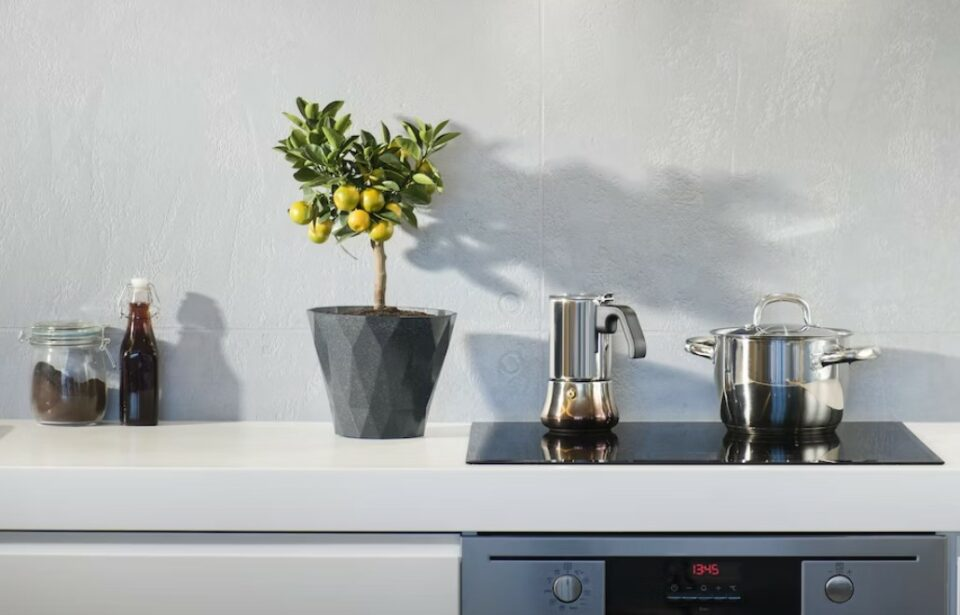
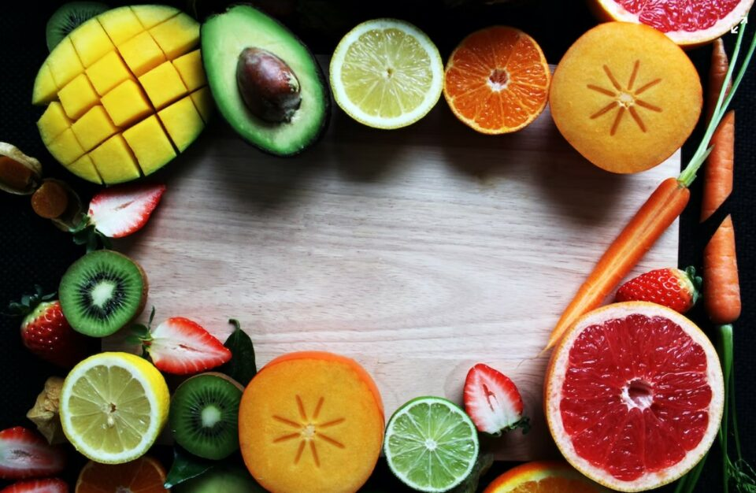
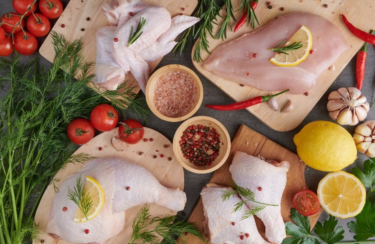
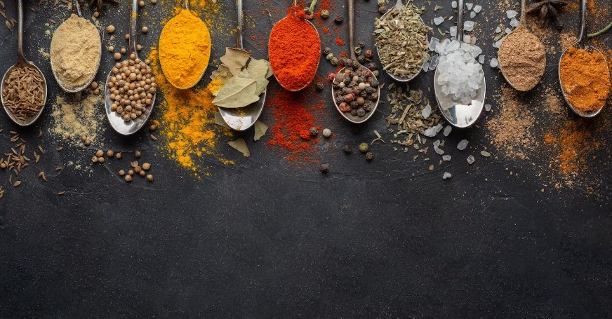
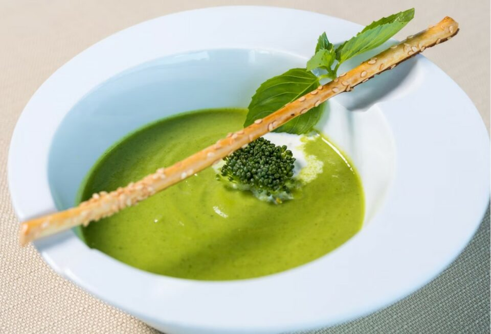
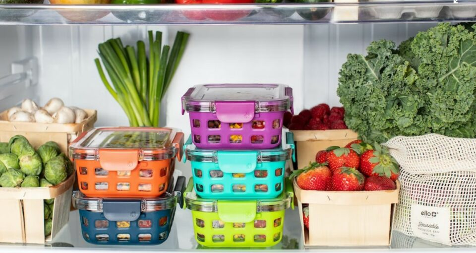

This article has been written and researched by our expert Loveable through a precise methodology. [Learn more about our methodology](https://avada.io/loveable/our-methodological.html)

[Loveable](https://avada.io/loveable/) > [Blog](https://avada.io/loveable/blog/) > [Family](https://avada.io/loveable/family/)

# How To Make Your Baby Food Easily

Written by [Rose Bryne](https://avada.io/loveable/author/rose/) Last Updated on August 16, 2023

- [Something you need to Prepare Homemade Baby Food](https://avada.io/loveable/blog/how-to-make-baby-food/#wp-block-heading-2-3)
- [How to make your baby food](https://avada.io/loveable/blog/how-to-make-baby-food/#wp-block-heading-2-6)
    - [Tidy up your workspace](https://avada.io/loveable/blog/how-to-make-baby-food/#wp-block-heading-3-7)
    - [Prepare the ingredient carefully](https://avada.io/loveable/blog/how-to-make-baby-food/#wp-block-heading-3-11)
        - [Grains and cereals](https://avada.io/loveable/blog/how-to-make-baby-food/#wp-block-heading-4-12)
        - [Fruits and vegetables](https://avada.io/loveable/blog/how-to-make-baby-food/#wp-block-heading-4-15)
        - [Meats and poultry](https://avada.io/loveable/blog/how-to-make-baby-food/#wp-block-heading-4-19)
    - [Add flavor while staying healthy](https://avada.io/loveable/blog/how-to-make-baby-food/#wp-block-heading-3-23)
    - [Fed and served safely](https://avada.io/loveable/blog/how-to-make-baby-food/#wp-block-heading-3-26)
- [How to preserve homemade baby food](https://avada.io/loveable/blog/how-to-make-baby-food/#wp-block-heading-2-30)
- [The Bottom Line](https://avada.io/loveable/blog/how-to-make-baby-food/#wp-block-heading-2-34)

Cooking for babies is much more difficult for those of us who are not culinary masters. But hard work pays off; the delectable meals you purchase from the grocery store will never satisfy your demands since only you are aware of what your child needs. Also, although **the process of making homemade baby food** can be difficult, it has much better flavor than store-bought options, and it is also significantly less expensive.

  
Today, we’re here to show you **How To Make Your Baby Food Easily** without any prior cooking knowledge. These ideas can be helpful for all mothers if you are having trouble preparing a great meal for your cherished infant at home and all the components and instructions are simply too difficult to follow. Now throw away all the confusing instructions you have found and check these useful tips for better experience!

## **Something you need to Prepare Homemade Baby Food**

You will need to get certain equipment ready before preparing food for your infant. If you are introducing solids in the form of purées, it is crucial to have a tool to crush or purée your baby’s food to the proper consistency. 

You can begin by using the simple kitchenware you probably already have at home, such as a spoon, fork, or masher, or if your financial situation allows, you can locate to use more sophisticated and contemporary equipment to utilize and save time. They include a blender, food processor, or powerful immersion blender, as well as storage containers for baby food, a steamer basket, Produce knife, freezer bags for storing, and water, formula, or breastmilk to thin as necessary

## **How to make your baby food**

### Tidy up your workspace

The most crucial thing for your infant is safety. Neatly rearranging the utensils in your kitchen is also a way to help you focus more and have more interest in [cooking](https://avada.io/loveable/cooking-gifts/).

Remember to wash your hands with water and soap before preparing baby food at any cost.  If you have touched raw meat, fish, or eggs (all of which can cause bacteria), you have to wash your hands with soap to prevent all diseases. Use clean work surfaces and utensils at all times. Moreover, if you’re tasting the food as you prepare it, wash your spoon after each sample or use a new one.

Tidy up your workplace

### Prepare the ingredient carefully

#### Grains and cereals

There are plenty of grains that are perfect choices for your baby, including single-grain, whole-grain types with added iron, such as whole-grain oats and whole-grain barley.  All the grains have thorough instructions on the package for you to follow and purée or grind. As grains and cereals can be hard to process, you should read the instructions carefully so that you will not miss any important steps.

For your baby, there can be multiple ways to mix other fruits with cereals as they can be a perfect combination to boost the health of your child. You can offer cereals and grains to your infant with breast milk or formula to thin out the consistency when you first introduce them to them.

#### Fruits and vegetables

Vegetables should be categorized so that they can be used with various processing techniques. For instance, before puréeing or grinding vegetables and hard fruits like apples, they should be roasted or boiled. Mild yellow or orange vegetables are also an excellent option because they have enough vitamins for the well-being of your infant. 

Also, the methods for preparing veggies can vary based on age. Therefore, you totally can offer chunkier textures as your child gets older and gains greater eating comfort.

Fruits and vegetables

#### Meats and poultry

Young children’s development is greatly influenced by the food they eat, and meat has become an essential nutrient in every meal. All meats and animals, such as pork, beef, chicken, etc., are advised, but not all of us are familiar with the correct and safe methods of preparation and cooking them properly.

Meats and Poultry

Meat should be pureed and cooked with vegetables or soups for children because their jaw muscles and teeth are still forming. To ensure that your child can readily absorb it, be sure to cut it very little and steam it extremely soft.

### Add flavor while staying healthy

Add flavor while staying healthy

It is common knowledge that children’s and especially infants’ palates are not as developed as [adults in order to fully appreciate all food flavors and tastes](https://avada.io/loveable/gifts-foodies/). Decide on flavors that are straightforward, nutritious, and simple to eat. Children benefit from this by developing their taste buds more quickly and avoiding infections at an early age.

### Fed and served safely

No matter how the food is served, it must be served in the best condition with the cleanest hand. We often forget to wash our hands after preparing raw foods for children, such as meat, fish, or other vegetables. This inadvertently attracts bacteria and parasites into your food plate, causing intestinal diseases for children if not carefully observed. To conclude, double-check the food to ensure that the food is not raw anymore, as raw or undercooked food can harbor bacteria.

You should also make sure that the food is not too cold or too hot so that your child can take it in the most delightful way. Checking the temperature of food can also positively influence whether your child eats well and enjoys the food.

Food served safely

## **How to preserve homemade baby food**

Baby food is best consumed the same day or within one to two hours of preparing. Refrigeration is a fantastic alternative for storing leftover food, however, moderation is advised as doing so risks losing nutrients.

Moreover, if you wish to reheat leftovers, do so on the stove. Before serving your child, stir, let the food stand for 30 seconds, and check the temperature. Purées should not be hot, but rather lukewarm.

Preserve in refrigerator

## **The Bottom Line**

Here are some tips for you to **make your baby food at home easily**. All the steps above have been consulted by a number of experts to ensure both food hygiene and safety, while being safe and suitable for babies. Don’t hesitate if cooking for kids is still difficult for you, just follow our instructions to serve the best meals ever and be a confident chef in your own house.

When you first approach cooking for your baby, you may find it difficult but don’t worry, your baby will receive the best quality meals and then you will feel proud of yourself. Follow these useful tips at a time, and you’ll soon discover how incredible the finished meals will be! So stop waiting and start preparing your baby’s food right away!

- [Something you need to Prepare Homemade Baby Food](https://avada.io/loveable/blog/how-to-make-baby-food/#wp-block-heading-2-3)
- [How to make your baby food](https://avada.io/loveable/blog/how-to-make-baby-food/#wp-block-heading-2-6)
    - [Tidy up your workspace](https://avada.io/loveable/blog/how-to-make-baby-food/#wp-block-heading-3-7)
    - [Prepare the ingredient carefully](https://avada.io/loveable/blog/how-to-make-baby-food/#wp-block-heading-3-11)
        - [Grains and cereals](https://avada.io/loveable/blog/how-to-make-baby-food/#wp-block-heading-4-12)
        - [Fruits and vegetables](https://avada.io/loveable/blog/how-to-make-baby-food/#wp-block-heading-4-15)
        - [Meats and poultry](https://avada.io/loveable/blog/how-to-make-baby-food/#wp-block-heading-4-19)
    - [Add flavor while staying healthy](https://avada.io/loveable/blog/how-to-make-baby-food/#wp-block-heading-3-23)
    - [Fed and served safely](https://avada.io/loveable/blog/how-to-make-baby-food/#wp-block-heading-3-26)
- [How to preserve homemade baby food](https://avada.io/loveable/blog/how-to-make-baby-food/#wp-block-heading-2-30)
- [The Bottom Line](https://avada.io/loveable/blog/how-to-make-baby-food/#wp-block-heading-2-34)

### [Rose Bryne](https://avada.io/loveable/author/rose/)

Hi, I'm Rose! I love animals and spending time with kids. At Loveable, I help people find unique gifts for special occasions like Valentine's Day, housewarmings, and graduations. I enjoy finding gifts for kids, teens, and animal lovers that match their interests and personalities. Making gift-giving a pleasant experience is my priority. Let me assist you in finding the perfect gift!

- [Twitter](https://twitter.com/intent/tweet)
- [Facebook](https://www.facebook.com/sharer/sharer.php)
- [instagram](https://avada.io/loveable/blog/how-to-make-baby-food/)
- [pinterest](https://www.pinterest.com/loveablellc/)

## Related Posts

[### 30 Best 4 Year Old Birthday Party Ideas For A Memorable Celebration](https://avada.io/loveable/blog/4-year-old-birthday-party-ideas/) 

[

### 16th Birthday Party Ideas to Make an Unforgettable Day

](https://avada.io/loveable/blog/16th-birthday-party-ideas/)

[

### 150+ Inspirational Birthday Quotes to Spread Joy on Special Day

](https://avada.io/loveable/blog/inspirational-birthday-quotes/)

[

### 160+ Birthday Wishes for Wife to Express Eternal Love

](https://avada.io/loveable/blog/birthday-wishes-for-wife/)

[### 90+ Heart Touching Birthday Wishes for Niece to Make Her Day Extra Special](https://avada.io/loveable/blog/birthday-wishes-for-niece/)
