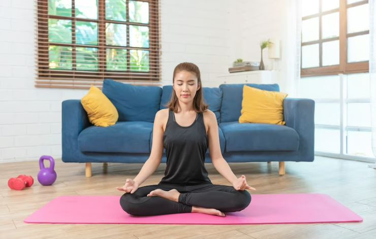
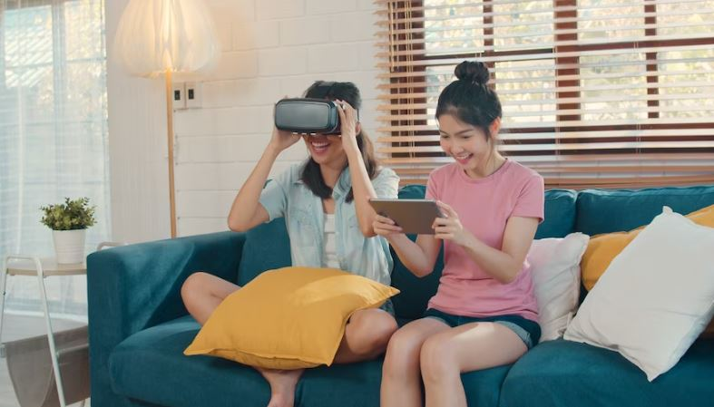
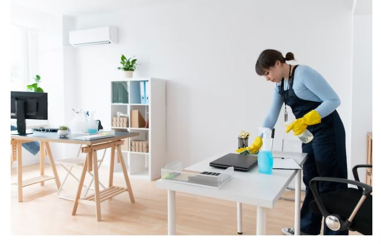
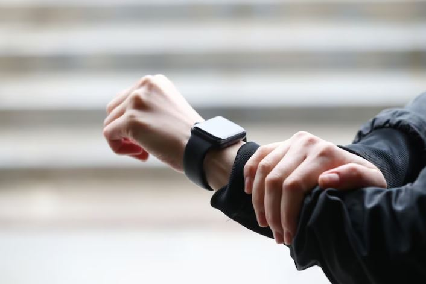
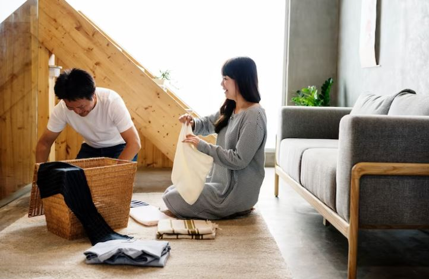

This article has been written and researched by our expert Loveable through a precise methodology. [Learn more about our methodology](https://avada.io/loveable/our-methodological.html)

[Loveable](https://avada.io/loveable/) > [Blog](https://avada.io/loveable/blog/) > [Family](https://avada.io/loveable/family/)

# How To Pass Time At Home? 21 Easy Ways To Pass Time At Home

Written by [Rose Bryne](https://avada.io/loveable/author/rose/) Last Updated on June 12, 2023

- [How To Pass Time At Home? 21 Easy Ways To Pass Time At Home](https://avada.io/loveable/blog/pass-time-at-home/#wp-block-heading-2-3)
    - [1\. Reading](https://avada.io/loveable/blog/pass-time-at-home/#wp-block-heading-3-4)
    - [2\. Listening to music](https://avada.io/loveable/blog/pass-time-at-home/#wp-block-heading-3-8)
    - [3\. Meditate alone](https://avada.io/loveable/blog/pass-time-at-home/#wp-block-heading-3-11)
    - [4\. Workout](https://avada.io/loveable/blog/pass-time-at-home/#wp-block-heading-3-16)
    - [5\. Shopping](https://avada.io/loveable/blog/pass-time-at-home/#wp-block-heading-3-18)
    - [6\. Playing Sudoku](https://avada.io/loveable/blog/pass-time-at-home/#wp-block-heading-3-20)
    - [7\. Meet some stranger](https://avada.io/loveable/blog/pass-time-at-home/#wp-block-heading-3-23)
    - [8\. Playing game](https://avada.io/loveable/blog/pass-time-at-home/#wp-block-heading-3-25)
    - [9\. Drawing](https://avada.io/loveable/blog/pass-time-at-home/#wp-block-heading-3-29)
    - [10\. Taking selfies](https://avada.io/loveable/blog/pass-time-at-home/#wp-block-heading-3-32)
    - [11\. Clean up](https://avada.io/loveable/blog/pass-time-at-home/#wp-block-heading-3-34)
    - [12\. Playing Nintendo](https://avada.io/loveable/blog/pass-time-at-home/#wp-block-heading-3-37)
    - [13\. Keep a journal](https://avada.io/loveable/blog/pass-time-at-home/#wp-block-heading-3-40)
    - [14\. Frequently glance at your watch](https://avada.io/loveable/blog/pass-time-at-home/#wp-block-heading-3-42)
    - [15\. Phone your mother](https://avada.io/loveable/blog/pass-time-at-home/#wp-block-heading-3-45)
    - [16\. Make a study project for yourself](https://avada.io/loveable/blog/pass-time-at-home/#wp-block-heading-3-48)
    - [17\. Gain new knowledge](https://avada.io/loveable/blog/pass-time-at-home/#wp-block-heading-3-51)
    - [18\. Cooking time](https://avada.io/loveable/blog/pass-time-at-home/#wp-block-heading-3-55)
    - [19\. Watch some must-see movies](https://avada.io/loveable/blog/pass-time-at-home/#wp-block-heading-3-58)
    - [20\. Tidy up your house](https://avada.io/loveable/blog/pass-time-at-home/#wp-block-heading-3-61)
    - [21\. Reorganize your room](https://avada.io/loveable/blog/pass-time-at-home/#wp-block-heading-3-65)
- [To conclude](https://avada.io/loveable/blog/pass-time-at-home/#wp-block-heading-2-67)

Do you feel like there’s nothing to do? During times like these, when all your favorite activities seem out of reach, it can be hard to find ways past the boredom. So while staying inside might not always be fun, we want to make it more bearable by introducing 21 easy and enjoyable activities you can do at home that will help pass time! 

Whether it’s creative ideas or active ones, from jigsaw puzzles and reading books to exercising in the comfort of your own home – here we will present you **how to pass time at home** alone in lockdown so you will have great ways to have fun while still keeping safe indoors.

## How To Pass Time At Home? 21 Easy Ways To Pass Time At Home

### 1\. Reading

[Books](https://avada.io/loveable/adult-coloring-books/), magazines, and newspapers are all great. You should take a test to see how fast you can read. Also, it’s easy to locate free options online. If you’re anything like the typical American, you’ll be able to read at a rate of 200 words per minute.

Next, calculate the amount of time you waste each day waiting. You may spend more than 30 minutes every day waiting around between the time you wait for your commute, lunch, and [coffee](https://avada.io/loveable/gifts-coffee-lovers/). Rather, use that opportunity to push through some prose.

_Books, magazines, and newspapers are all great_

### 2\. Listening to music

It’s hard to imagine, but people used to download music before Spotify and Apple [Music](https://avada.io/loveable/music-gifts/) completely changed the music industry. But, the fact is, it’s still probable. 

To stream your preferred music, you don’t need an internet connection. In fact, you can spend less than $5 on an excellent little MP3 player!

### 3\. Meditate alone

_Meditate alone_

Stress can be reduced by meditation, which can also increase blood flow and general pleasure. And although most images of meditation show individuals sitting in crisscross applesauce, you could also concentrate while standing.

In reality, teachers of the Chinese martial art Yi Quan instruct their students on how to meditate while standing up using a simple technique. 

Start by separating your arms from your body by roughly the width of a tennis ball. The next step is to clasp your hands together below the naval. If you feel like you’re holding a beach ball, you’re doing it correctly.

### 4\. Workout

You can schedule a workout if you have 15 minutes to kill and the space, of course. Compared to swiping right (or left), it is considerably better for you. Think about simple exercises like pushups, lunges, and squats. This is how to pass time at home usefully that you must try!

### 5\. Shopping

Although point-of-sale items might be gimmicky, a close eye can also spot treasures. Did you know, for instance, that [Starbucks](https://avada.io/loveable/starbucks-gifts/) alters its menu according to the season? So you might watch for the absolutely delicious pumpkin madeleines in the autumn. Or that the checkout line at H&M is the only place to buy colorful ankle socks, a necessity on hot summer days?

### 6\. Playing Sudoku

_Playing Sudoku_

Pick up a Sudoku book that fits in your back pocket and keep it there. By the way, you gain extra points if you do this mathematical puzzle in pen because there is no option to go back and change your decisions, ensuring high accuracy.

### 7\. Meet some stranger

You have the ideal opportunity to practice your social skills while you wait. Talk to a complete stranger. A fascinating chat could leave you pleasantly surprised. Or you can become bored, and you only wasted a little bit.

### 8\. Playing game

There are a ton of time-killing [games](https://avada.io/loveable/gifts-gamers/) you can play in a group. The finest game, though, in our opinion, is nameless. The rules are as follows: Choose a stranger or a group of strangers and create a tale about them. 

Keep it realistic and speculate as to their purpose. Or have fun and see them as a traveling MI6 spy. Whatever! Your decision is yours.

_There are a ton of time-killing games you can play in a group_

### 9\. Drawing

Doodling, according to the Harvard Health Letter, can lessen “psychological anguish” in the near term and enhance memory and focus over time.

 Additionally, drawing is a presidential pastime; according to reports, 26 U.S. presidents have enjoyed the activity, including Ronald Reagan, who particularly enjoyed drawing cowboys.

### 10\. Taking selfies

Everyone appears better in a Polaroid; it is a fact. So take your selfies with a Polaroid instead of using the camera on your smartphone since some lenses, like the one on the LG G5, are fish-eyed and quite unattractive. The best part is that waiting for spontaneous blooming may be entertaining in and of itself.

### 11\. Clean up

_Clean up_

Make sure your makeup and hair are fixed. Keep in mind your shirt is truly tucked in, or straighten your tie. Making sure you appear great is the best thing you can do while you wait. In fact, according to history, mirrors were added to elevators for the first time in the 1940s just to pass the time for passengers.

### 12\. Playing Nintendo

Your grandmother may refer to playing video games in general by saying, “Play Nintendo.” But it’s not wholly inaccurate anymore. From the Wii U to the New 3DS to the popular Switch from last year, Nintendo makes by far the greatest portable gaming devices available. 

You’ll never get bored with Super Mario Odyssey, Legend of Zelda: Breath of the Wild, the 2017 Game of the Year, and an amazing collection of remastered games, including DOOM and Shovel Knight.

### 13\. Keep a journal

This is another excellent way how to pass time at home without a phone. By merely writing down your ideas, you can learn more than a penny’s worth of the inner workings of your mind. Many authors have said that keeping a diary has helped them discover insights and memories from their daily lives that may have otherwise been lost in the cloud.

### 14\. Frequently glance at your watch

_Frequently glance at your watch_

And tap your toes and fingers in a fast manner. Because if besuited males in the Financial District are any indicator, time passes more quickly the more obvious your impatience and boredom are.

### 15\. Phone your mother

Even if it’s technically giving up, at least you’re utilizing your phone for something positive. Furthermore, hearing your mother’s voice activates your oxytocin receptors, which are responsible for the hormone that helps reduce stress, according to research published in the Proceedings of the Royal Society B: Biological Sciences. 

Therefore, pay attention to what your mother says. More often. Even without a smartphone, you can do it.

### 16\. Make a study project for yourself

Go in-depth on a topic you’re curious about but don’t know much about. If you have any free time, invest it in learning something new. Do a search for the subject you are interested in online. 

You can start reading any articles you come across or watching videos about the topic. Browse a variety of sources at your convenience. Try something else if a paper or film doesn’t grab your attention.

### 17\. Gain new knowledge

_Gain new knowledge – How to pass time at home_

If you are looking for how to pass time at home, why not learn a new skill if you have some free time? You may start learning a new language or practice origami by following some internet instructions. You can pass some time by learning a magic trick, and the next time you visit your pals, you’ll be able to wow them! 

Alternatives include setting up a carpentry station in the garage or watching a video to learn how to replace a tire finally.

### 18\. Cooking time

Find something fun to make to break the pattern of takeaway. Look through your cupboard and refrigerator to see what you currently have. Many chicken breasts do you want to get rid of? Look up fresh chicken recipes online. 

About to expire tortillas? Seek out fresh Mexican dishes to try. To keep yourself busy and pass the time, utilize your creativity to create something you’ve never done before.

### 19\. Watch some must-see movies

A terrific approach to pass two to three hours of your day is with a movie. You could watch a classic movie you’ve never seen or the most current [Netflix](https://avada.io/loveable/netflix-gifts/) original that everyone is crazy about. 

If you have a watchlist for a movie on your preferred streaming service, scroll through the titles to locate the one that has been there the longest. If you’d want, you could simply just randomly browse movie channels.

### 20\. Tidy up your house

Bring out the cleaning tools and renovate your home. Start by adding a load of laundry, then start tossing stuff away and cleaning up the floor. Arrange your desk, sweep the floor, and wash the windows. 

Take on those cleaning duties that you usually avoid during regular cleaning sessions. This is a fantastic way to kill a few minutes.

_This is a fantastic way to kill a few minutes_

### 21\. Reorganize your room

Redecorating will transform the look of your living area. Try moving your bed to a new position if you’re having trouble falling asleep at night. Rearrange your furniture so that your workspace is in front of that bright window if you’ve been craving for more intriguing workplace space. This is a fantastic way to bring new life and vibrations into your house!

## To conclude

Spending time at home can be a great way to relax and reconnect with yourself. From reading to playing video games, there are plenty of ways to enjoy your time at home and, interestingly pass the hours. 

Whether you’re a nature lover spending time on outdoor activities, or an artist creating something special, there’s something for everyone. So take the time to appreciate what makes you special—you’ll never regret it! 

So the next time life gets tough or boring, and finding **how to pass time at home** alone, step out of your comfort zone and try one of these 21 easy ways to pass time at home! Most importantly, focus on things that bring you joy and make this period as productive and fun as possible.

- [How To Pass Time At Home? 21 Easy Ways To Pass Time At Home](https://avada.io/loveable/blog/pass-time-at-home/#wp-block-heading-2-3)
    - [1\. Reading](https://avada.io/loveable/blog/pass-time-at-home/#wp-block-heading-3-4)
    - [2\. Listening to music](https://avada.io/loveable/blog/pass-time-at-home/#wp-block-heading-3-8)
    - [3\. Meditate alone](https://avada.io/loveable/blog/pass-time-at-home/#wp-block-heading-3-11)
    - [4\. Workout](https://avada.io/loveable/blog/pass-time-at-home/#wp-block-heading-3-16)
    - [5\. Shopping](https://avada.io/loveable/blog/pass-time-at-home/#wp-block-heading-3-18)
    - [6\. Playing Sudoku](https://avada.io/loveable/blog/pass-time-at-home/#wp-block-heading-3-20)
    - [7\. Meet some stranger](https://avada.io/loveable/blog/pass-time-at-home/#wp-block-heading-3-23)
    - [8\. Playing game](https://avada.io/loveable/blog/pass-time-at-home/#wp-block-heading-3-25)
    - [9\. Drawing](https://avada.io/loveable/blog/pass-time-at-home/#wp-block-heading-3-29)
    - [10\. Taking selfies](https://avada.io/loveable/blog/pass-time-at-home/#wp-block-heading-3-32)
    - [11\. Clean up](https://avada.io/loveable/blog/pass-time-at-home/#wp-block-heading-3-34)
    - [12\. Playing Nintendo](https://avada.io/loveable/blog/pass-time-at-home/#wp-block-heading-3-37)
    - [13\. Keep a journal](https://avada.io/loveable/blog/pass-time-at-home/#wp-block-heading-3-40)
    - [14\. Frequently glance at your watch](https://avada.io/loveable/blog/pass-time-at-home/#wp-block-heading-3-42)
    - [15\. Phone your mother](https://avada.io/loveable/blog/pass-time-at-home/#wp-block-heading-3-45)
    - [16\. Make a study project for yourself](https://avada.io/loveable/blog/pass-time-at-home/#wp-block-heading-3-48)
    - [17\. Gain new knowledge](https://avada.io/loveable/blog/pass-time-at-home/#wp-block-heading-3-51)
    - [18\. Cooking time](https://avada.io/loveable/blog/pass-time-at-home/#wp-block-heading-3-55)
    - [19\. Watch some must-see movies](https://avada.io/loveable/blog/pass-time-at-home/#wp-block-heading-3-58)
    - [20\. Tidy up your house](https://avada.io/loveable/blog/pass-time-at-home/#wp-block-heading-3-61)
    - [21\. Reorganize your room](https://avada.io/loveable/blog/pass-time-at-home/#wp-block-heading-3-65)
- [To conclude](https://avada.io/loveable/blog/pass-time-at-home/#wp-block-heading-2-67)

### [Rose Bryne](https://avada.io/loveable/author/rose/)

Hi, I'm Rose! I love animals and spending time with kids. At Loveable, I help people find unique gifts for special occasions like Valentine's Day, housewarmings, and graduations. I enjoy finding gifts for kids, teens, and animal lovers that match their interests and personalities. Making gift-giving a pleasant experience is my priority. Let me assist you in finding the perfect gift!

- [Twitter](https://twitter.com/intent/tweet)
- [Facebook](https://www.facebook.com/sharer/sharer.php)
- [instagram](https://avada.io/loveable/blog/pass-time-at-home/)
- [pinterest](https://www.pinterest.com/loveablellc/)

## Related Posts

[### 30 Best 4 Year Old Birthday Party Ideas For A Memorable Celebration](https://avada.io/loveable/blog/4-year-old-birthday-party-ideas/) 

[

### 16th Birthday Party Ideas to Make an Unforgettable Day

](https://avada.io/loveable/blog/16th-birthday-party-ideas/)

[

### 150+ Inspirational Birthday Quotes to Spread Joy on Special Day

](https://avada.io/loveable/blog/inspirational-birthday-quotes/)

[

### 160+ Birthday Wishes for Wife to Express Eternal Love

](https://avada.io/loveable/blog/birthday-wishes-for-wife/)

[### 90+ Heart Touching Birthday Wishes for Niece to Make Her Day Extra Special](https://avada.io/loveable/blog/birthday-wishes-for-niece/)
