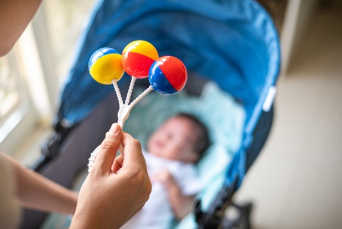
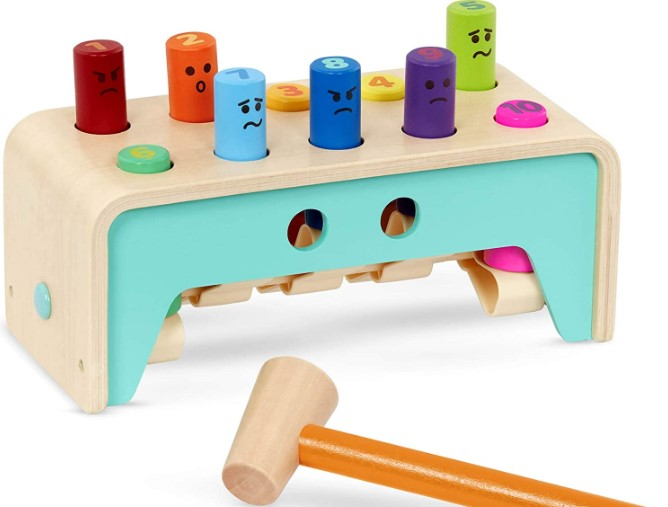
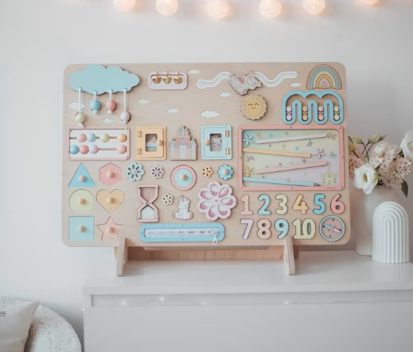
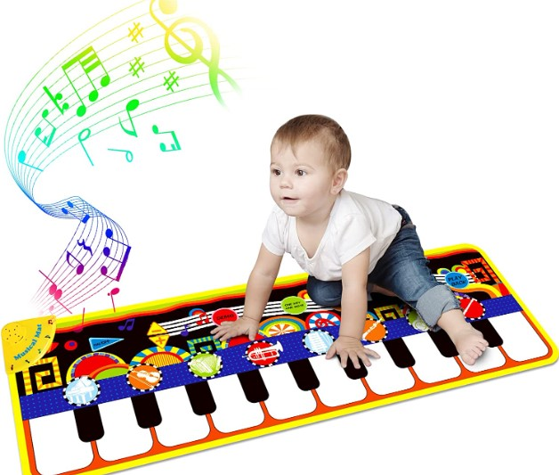
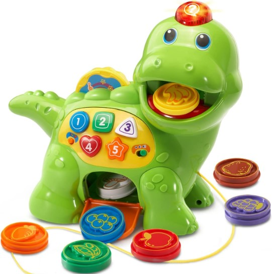
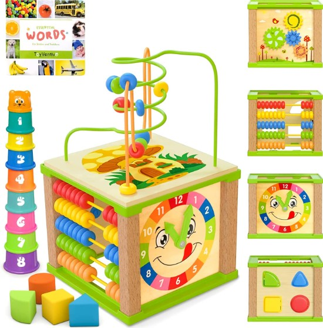

This article has been written and researched by our expert Loveable through a precise methodology. [Learn more about our methodology](https://avada.io/loveable/our-methodological.html)

[Loveable](https://avada.io/loveable/) > [Blog](https://avada.io/loveable/blog/) > [Parenting](https://avada.io/loveable/parenting/)

# How to Play with a Newborn – 14 Tips and Ideas

Written by [Benjamin Collins](https://avada.io/loveable/author/benjamin/) Last Updated on August 28, 2023

- [When should you start playing with a newborn?](https://avada.io/loveable/blog/how-to-play-with-newborn/#wp-block-heading-2-3)
- [Why it’s Important to Play with a Newborn](https://avada.io/loveable/blog/how-to-play-with-newborn/#wp-block-heading-2-6) 
- [How to Play with a Newborn – 14 Best Tips](https://avada.io/loveable/blog/how-to-play-with-newborn/#wp-block-heading-2-15) 
    - [1\. Tummy Time](https://avada.io/loveable/blog/how-to-play-with-newborn/#wp-block-heading-3-16)
    - [2\. Face To Face](https://avada.io/loveable/blog/how-to-play-with-newborn/#wp-block-heading-3-19)
    - [3\. Sit Newborn Up](https://avada.io/loveable/blog/how-to-play-with-newborn/#wp-block-heading-3-23)
    - [4\. Let Them Play with Toys of Different Textures and Sounds.](https://avada.io/loveable/blog/how-to-play-with-newborn/#wp-block-heading-3-26)
    - [5\. Put Them on Their Backs and Put Toys over Their Heads.](https://avada.io/loveable/blog/how-to-play-with-newborn/#wp-block-heading-3-30)
    - [6\. Talk to Newborn](https://avada.io/loveable/blog/how-to-play-with-newborn/#wp-block-heading-3-33)
    - [7\. Snuggles & Kisses the Baby](https://avada.io/loveable/blog/how-to-play-with-newborn/#wp-block-heading-3-37) 
    - [8\. Peek-a-Boo](https://avada.io/loveable/blog/how-to-play-with-newborn/#wp-block-heading-3-40)
    - [9\. Sing a Song](https://avada.io/loveable/blog/how-to-play-with-newborn/#wp-block-heading-3-43) 
    - [10\. Fingers and Toes](https://avada.io/loveable/blog/how-to-play-with-newborn/#wp-block-heading-3-47)
    - [11\. Copy their Sounds and Mirror their Facial Expressions](https://avada.io/loveable/blog/how-to-play-with-newborn/#wp-block-heading-3-50)
    - [12\. Encourage Your Baby to Explore their Body](https://avada.io/loveable/blog/how-to-play-with-newborn/#wp-block-heading-3-54)
    - [13\. Try Different Positions](https://avada.io/loveable/blog/how-to-play-with-newborn/#wp-block-heading-3-57)
    - [14\. Read for Your Baby](https://avada.io/loveable/blog/how-to-play-with-newborn/#wp-block-heading-3-60) 
- [5 Best Developmental Toys For 1-Year-Old](https://avada.io/loveable/blog/how-to-play-with-newborn/#wp-block-heading-2-64)
    - [1\. Battat – Wooden Hammer Toy for Kids](https://avada.io/loveable/blog/how-to-play-with-newborn/#wp-block-heading-3-66)
    - [2\. Baby Girl Gift Montessori Board](https://avada.io/loveable/blog/how-to-play-with-newborn/#wp-block-heading-3-69)
    - [3\. Kids Musical Mat with 25 Music Sounds](https://avada.io/loveable/blog/how-to-play-with-newborn/#wp-block-heading-3-72)
    - [4\. Chomp and Count Dino](https://avada.io/loveable/blog/how-to-play-with-newborn/#wp-block-heading-3-75)
    - [5\. Wooden Kids Baby Activity Cube](https://avada.io/loveable/blog/how-to-play-with-newborn/#wp-block-heading-3-78)
- [Bottom Line](https://avada.io/loveable/blog/how-to-play-with-newborn/#wp-block-heading-2-82) 

Did you know that activities may help even newborns? Many parents are shocked to hear that several methods exist to involve their children at such an early age. Playing with your newborn might be a difficult undertaking for a new parent. You might be wondering how to engage with your baby or if playing with a newborn who can’t yet sit up or crawl is feasible. However, numerous easy and delightful activities for newborns may help you bond with your baby and boost their growth.

**Activities for newborns** do not have to be difficult or costly. In reality, many of the great activities for your child may be done using stuff you most likely already have about the house. There are several methods to connect with your infant and help them learn and grow, ranging from tummy time to singing lullabies. You may make the most of those early months by developing a close bond with your infant. Even if newborns can’t do much, it doesn’t mean they can’t have fun! 

## **When should you start playing with a newborn?**

Welcoming a newborn into the world is a fantastic event, especially for first-time parents. Playing with your infant is an important part of their development. Parents may frequently ask when it is appropriate to begin engaging in leisure activities with their children. There is a widespread misperception that babies are too young to engage in such activities. However, parents may start playing with their children as soon as they are born!

## **Why it’s Important to Play with a Newborn** 

Playing with a newborn is essential for their early growth. Kids will soon become more curious about the world around them.

- Promotes overall development, learning, and wellbeing
- Helps parts of the brain connect and grow
- Builds muscle strength, gross motor skills, and fine motor skills
- Provides opportunities for language development and conversation
- Helps you and your baby bond and get to know each other better
- Encourages exploration and curiosity

## **How to Play with a Newborn – 14 Best Tips** 

### **1\. Tummy Time**

This activity needs to do soon for a baby because it develops their neck muscles, improves motor abilities, and offers sensory stimulation. As soon as possible, when they are growing, use a Boppy or a blanket to support them up. 

You can help your children with a few minutes and progressively increase to 5 minutes, 5-8 times each day. Place bright toys or things within reach of your baby to assist in engaging their senses and make tummy time more fun. Always keep an eye on your infant during tummy time.

### **2\. Face To Face**

Face-to-face engagement with your infant is a simple exercise that will teach your child about social communication and expressions. Babies are drawn to familiar faces, particularly those of their parents, so take advantage of this chance to spend quality time with your child. 

Sit up with your knees bowed and the baby propped up against your legs. This position allows you to be 1 foot apart and face-to-face. During this period, your baby will begin to identify your characteristics.

### **3\. Sit Newborn Up**

Sitting up is one of the essential activities for newborns because it strengthens their neck and trunk muscles and minimizes the amount of time they spend lying on their backs. This can also help to avoid the formation of a flat head. 

When your baby is roughly 2-2.5 months old and has neck control, you can use a Boppy or a cushion to offer back support. Hold their hands and gently swing back and forth while seating them up to activate their senses and exercise their muscles. 

### **4\. Let Them Play with Toys of Different Textures and Sounds.**

When your baby interacts with multi-sensory toys, they explore different textures and sounds, stimulating their senses and promoting cognitive development. 

To offer your infant different textures and sensations, you can use toys like the Donkey Plush Toy or household objects. Encourage your baby to touch and feel the things, and place them on various sides of their head to watch how they react. 

### **5\. Put Them on Their Backs and Put Toys over Their Heads.**

Placing toys over your baby’s head and putting them on their back can also help with visual stimulation and tracking. You may use a play gym with hanging toys or lift a toy over your head.

It helps them improve their visual tracking abilities as they follow the toy’s movement with their eyes. This is a terrific exercise to help your infant become acquainted with their surroundings and begin exploring the world around them.

### **6\. Talk to Newborn**

Talking to your baby may appear to be a great passion, but it is one of the most basic methods to play with your child. Even if they don’t understand what you’re saying, they’ll become acclimated to your voice and the new noises. 

Using their name when you chat with them, read books, or sing songs to them will help them recognize it even if they don’t completely comprehend what it means until later. Talking to your kid will help enhance their language abilities.

### **7\. Snuggles & Kisses the Baby** 

Skin-to-skin contact with your infant is one of the most effective methods to establish a love attachment. Although you’re probably doing it now, make time to hug and kiss them when they’re simply wearing diapers and covered in a warm blanket.

Skin-to-skin contact is not only pleasurable for you both, but it may also assist in regulating your baby’s temperature, heart rate, and respiration. It’s a simple yet effective way to soothe and comfort your child while building your relationship.

### **8\. Peek-a-Boo**

Your little one is already starting to develop a sense of patterns, and playing peek-a-boo is a great way to introduce them to this concept. Covering your face with your hands, then showing it and saying “peek-a-boo!” can delight your infant.

As you cover and uncover your face, you show your baby that things can happen in a predictable pattern. This helps develop their sense of cause and effect and promotes cognitive development.

### **9\. Sing a Song** 

By presenting your infant to music, you help develop their auditory senses and build the groundwork for language development.

You don’t have to have a flawless voice to sing to your kid; they just like hearing your voice. Sing lullabies, nursery rhymes, or any other music you choose. Making up goofy tunes about your kid or your regular activities may also be entertaining.

### **10\. Fingers and Toes**

Engaging your baby’s brain with new concepts as they begin to explore the world is important. Even if kids don’t comprehend the idea of counting yet, it’s never too soon to start. 

Counting their fingers and toes is an excellent approach to accomplish this. Wiggle their toes while counting aloud and repeat with their fingers. 

### **11\. Copy their Sounds and Mirror their Facial Expressions**

When they begin to make sounds and noises, take the time to repeat them back to them. This makes them realize their voice is being heard and allows them to grow more acquainted with the sound of your voice.

Imitating your newborn’s facial expressions (yawn, grimace, grin, or open their eyes wide) is another approach to assist them in development. Most newborns begin to grin between the ages of 7 and 10 weeks. If your kid hasn’t started to grin, show them your huge smile.

### **12\. Encourage Your Baby to Explore their Body**

Newborns will soon gain awareness of things surrounding them, including their bodies. They might think about and be curious to explore them. “Who are they, and what do they look like?” can be what comes up in their mind.

As a parent, you can support them to do that. Let their hands touch their body parts such as eyes, nose, mouth, ears, etc., and see how their expression is. Otherwise, put them in front of the mirror and they will realize how they look. 

### **13\. Try Different Positions**

Your baby may spend the majority of the day in a swing, bouncer, or newborn lounger. While these gadgets provide comfort and familiarity, it is critical to rotate their places to encourage healthy growth. Remember to watch your baby and ensure they are comfortable and secure in each position.

### **14\. Read for Your Baby** 

Even if they don’t comprehend the narrative, they’ll enjoy the sound of your voice.

Look for books with basic graphics or high-contrast black-and-white illustrations when shopping for your infant. These books are simpler for kids to view and can aid in developing their eyesight. To keep kids interested, point to the photos and use varied accents.

**_Related_**: [How To Make Your Baby Food Easily](https://avada.io/loveable/how-to-make-baby-food/)

## **5 Best Developmental Toys For 1-Year-Old**

To have a perfect time together, you shouldn’t ignore some toys that can support you to have fun. There are many Best Developmental [Toys For 1-Year-Old](https://avada.io/loveable/educational-toys-1-year-olds/) to consider for your newborn; some of them are indispensable for particular activities. Let’s see 5 popular suggestions.

### [**1\. Battat – Wooden Hammer Toy for Kids**](https://www.amazon.com/Battat-Toddlers-Pounding-Colorful-Developmental/dp/B08NT2J2T6/)

Are you searching for an educational and entertaining toy for your little one? Look no further than the Battat Wooden Hammer Toy for Kids! Made from durable, high-quality materials, the Battat Wooden Hammer Toy features four colorful balls that can be hammered through the holes in the wooden platform. 

### [**2\. Baby Girl Gift Montessori Board**](https://www.etsy.com/listing/1334264350/busy-board-baby-girl-gift-montessori)

This busy board is designed to promote sensory play and fine motor skills development in infants and toddlers. With its colorful and interactive design, this Montessori board features various locks, latches, buttons, and knobs for children to explore. The board also has a variety of textures and shapes to encourage sensory development and hand-eye coordination.

### [**3\. Kids Musical Mat with 25 Music Sounds**](https://www.amazon.com/RenFox-Musical-Keyboard-Education-43-3x14-2in/dp/B07MBDZCXT)

RenFox Kids Musical Mat with 25 Music Sounds is a fantastic addition to any child’s playroom. This melodic mat is ideal for children who like dancing along to their favorite songs. The mat has 25 sounds, such as piano, saxophone, trumpet, guitar, and others, allowing youngsters to experiment with various musical genres.

### [**4\. Chomp and Count Dino**](https://www.amazon.com/VTech-Chomp-and-Count-Dino/dp/B00K89KFX0)

VTech Chomp and Count Dino is an excellent educational toy for young children. Why is that? The charming dinosaur design, with the bright colors, makes it appealing to youngsters. The Its unique blend of teaching and enjoyment makes it an excellent investment for any parent or caregiver.

### [**5\. Wooden Kids Baby Activity Cube**](https://www.amazon.com/Spunky-Kinder-Wooden-Kids-Activity/dp/B07NCQ1Z1C)

Thanks to its impressive and creative design, this activity cube is a must-have for any child’s toy collection. Each side of the cube is meant to engage and encourage a child’s growing motor and cognitive skills, making it a perfect choice for parents searching for a toy that is both entertaining and educational.

**_See More:_** [Sleep Training For Newborns Guide](https://avada.io/loveable/blog/sleep-training-for-newborns-guide/): Every Parent Should Know

## **Bottom Line** 

Playing with your newborn is essential to bonding and aiding their development. However, many parents may feel unsure how to play with their newborn and what activities are appropriate for their age. In this guide, we’ve provided **How to Play with a Newborn – 14 Tips and Ideas**

Remember that newborns have limited vision and mobility, so sensory stimulation and gentle movement activities are best. Participate in activities for newborns that include singing, chatting, and making funny expressions. Toys with varied textures and noises can also be introduced. Simple activities like peekaboo, belly time, and copying noises and facial expressions may be both entertaining and educational for your infant.

Always keep in mind that what works for one may not work for another. Pay attention to your baby’s cues and preferences and adjust the activities accordingly. The most vital thing is to enjoy the time spent with your little one and create a positive and nurturing environment for their growth and development.

- [When should you start playing with a newborn?](https://avada.io/loveable/blog/how-to-play-with-newborn/#wp-block-heading-2-3)
- [Why it’s Important to Play with a Newborn](https://avada.io/loveable/blog/how-to-play-with-newborn/#wp-block-heading-2-6) 
- [How to Play with a Newborn – 14 Best Tips](https://avada.io/loveable/blog/how-to-play-with-newborn/#wp-block-heading-2-15) 
    - [1\. Tummy Time](https://avada.io/loveable/blog/how-to-play-with-newborn/#wp-block-heading-3-16)
    - [2\. Face To Face](https://avada.io/loveable/blog/how-to-play-with-newborn/#wp-block-heading-3-19)
    - [3\. Sit Newborn Up](https://avada.io/loveable/blog/how-to-play-with-newborn/#wp-block-heading-3-23)
    - [4\. Let Them Play with Toys of Different Textures and Sounds.](https://avada.io/loveable/blog/how-to-play-with-newborn/#wp-block-heading-3-26)
    - [5\. Put Them on Their Backs and Put Toys over Their Heads.](https://avada.io/loveable/blog/how-to-play-with-newborn/#wp-block-heading-3-30)
    - [6\. Talk to Newborn](https://avada.io/loveable/blog/how-to-play-with-newborn/#wp-block-heading-3-33)
    - [7\. Snuggles & Kisses the Baby](https://avada.io/loveable/blog/how-to-play-with-newborn/#wp-block-heading-3-37) 
    - [8\. Peek-a-Boo](https://avada.io/loveable/blog/how-to-play-with-newborn/#wp-block-heading-3-40)
    - [9\. Sing a Song](https://avada.io/loveable/blog/how-to-play-with-newborn/#wp-block-heading-3-43) 
    - [10\. Fingers and Toes](https://avada.io/loveable/blog/how-to-play-with-newborn/#wp-block-heading-3-47)
    - [11\. Copy their Sounds and Mirror their Facial Expressions](https://avada.io/loveable/blog/how-to-play-with-newborn/#wp-block-heading-3-50)
    - [12\. Encourage Your Baby to Explore their Body](https://avada.io/loveable/blog/how-to-play-with-newborn/#wp-block-heading-3-54)
    - [13\. Try Different Positions](https://avada.io/loveable/blog/how-to-play-with-newborn/#wp-block-heading-3-57)
    - [14\. Read for Your Baby](https://avada.io/loveable/blog/how-to-play-with-newborn/#wp-block-heading-3-60) 
- [5 Best Developmental Toys For 1-Year-Old](https://avada.io/loveable/blog/how-to-play-with-newborn/#wp-block-heading-2-64)
    - [1\. Battat – Wooden Hammer Toy for Kids](https://avada.io/loveable/blog/how-to-play-with-newborn/#wp-block-heading-3-66)
    - [2\. Baby Girl Gift Montessori Board](https://avada.io/loveable/blog/how-to-play-with-newborn/#wp-block-heading-3-69)
    - [3\. Kids Musical Mat with 25 Music Sounds](https://avada.io/loveable/blog/how-to-play-with-newborn/#wp-block-heading-3-72)
    - [4\. Chomp and Count Dino](https://avada.io/loveable/blog/how-to-play-with-newborn/#wp-block-heading-3-75)
    - [5\. Wooden Kids Baby Activity Cube](https://avada.io/loveable/blog/how-to-play-with-newborn/#wp-block-heading-3-78)
- [Bottom Line](https://avada.io/loveable/blog/how-to-play-with-newborn/#wp-block-heading-2-82) 

### [Benjamin Collins](https://avada.io/loveable/author/benjamin/)

I'm Benjamin Collins, a gift ideas creator at Loveable. We specialize in unique and personalized gifts for any occasion. With my honed skills, I recommend gifts tailored to the recipient's personality and interests, whether it's Halloween, Christmas, or any other celebration.

- [Twitter](https://twitter.com/intent/tweet)
- [Facebook](https://www.facebook.com/sharer/sharer.php)
- [instagram](https://avada.io/loveable/blog/how-to-play-with-newborn/)
- [pinterest](https://www.pinterest.com/loveablellc/)

## Related Posts

[

### 79 Heartfelt Missing Mom Quotes for Expressing Love and Longing

](https://avada.io/loveable/blog/missing-mom-quotes/)

[

### Parenting with Depression: Strategies for Coping, Seeking Help, and Building Resilience

](https://avada.io/loveable/blog/parenting-with-depression/)

[

### 100 Empowering Single Mom Quotes: Inspirational Words for Strong Mothers

](https://avada.io/loveable/blog/single-mom-quotes/)

[

### 99+ Heartfelt Quotes And Wishes: Happy Anniversary to Mom and Dad!

](https://avada.io/loveable/blog/quotes-happy-anniversary-mom-dad/)

[

### 5 Ways to Foster a Positive Parent-Teacher Relationship

](https://avada.io/loveable/blog/parent-teacher-relationship/)
