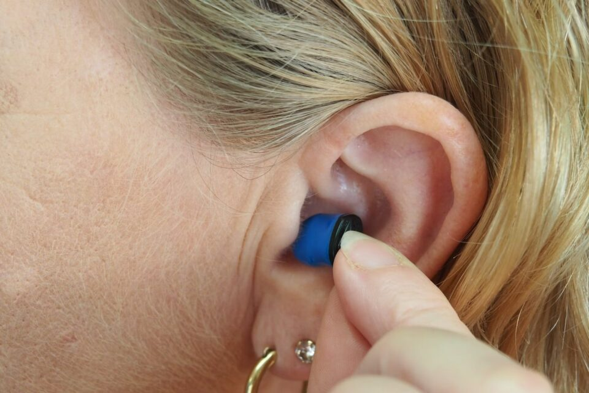
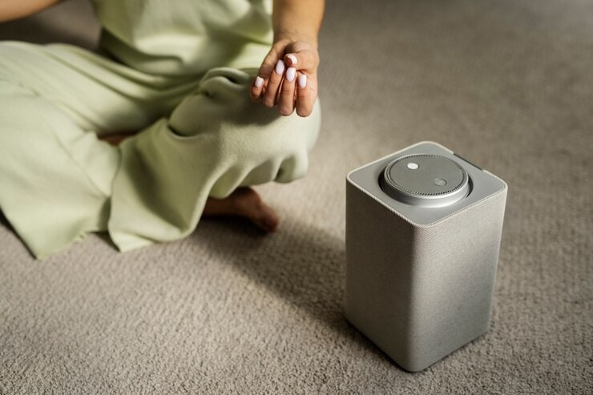
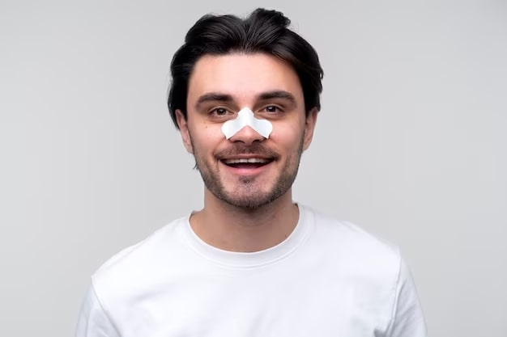

This article has been written and researched by our expert Loveable through a precise methodology. [Learn more about our methodology](https://avada.io/loveable/our-methodological.html)

[Loveable](https://avada.io/loveable/) > [Blog](https://avada.io/loveable/blog/) > [Family](https://avada.io/loveable/family/)

# How to Sleep with Someone Who Snores: 8 Best Ways You Can Try

Written by [Rose Bryne](https://avada.io/loveable/author/rose/) Last Updated on September 18, 2023

- [8 Best Ways to Sleep with Someone Who Snores](https://avada.io/loveable/blog/sleep-with-someone-who-snores/#wp-block-heading-2-3)
    - [1) Wear Earplugs](https://avada.io/loveable/blog/sleep-with-someone-who-snores/#wp-block-heading-3-4)
    - [2) White noise machines](https://avada.io/loveable/blog/sleep-with-someone-who-snores/#wp-block-heading-3-7)
    - [3) Adjust sleep positions](https://avada.io/loveable/blog/sleep-with-someone-who-snores/#wp-block-heading-3-11)
    - [4) Try nasal strips](https://avada.io/loveable/blog/sleep-with-someone-who-snores/#wp-block-heading-3-14)
    - [5) Elevate the head](https://avada.io/loveable/blog/sleep-with-someone-who-snores/#wp-block-heading-3-17)
    - [6) Sleep in another room](https://avada.io/loveable/blog/sleep-with-someone-who-snores/#wp-block-heading-3-20)
    - [7) Go to sleep before the snorer](https://avada.io/loveable/blog/sleep-with-someone-who-snores/#wp-block-heading-3-23)
    - [8) Wake them up](https://avada.io/loveable/blog/sleep-with-someone-who-snores/#wp-block-heading-3-26)
- [FAQs](https://avada.io/loveable/blog/sleep-with-someone-who-snores/#wp-block-heading-2-30)
    - [Q1: Can snoring be a sign of a more serious condition?](https://avada.io/loveable/blog/sleep-with-someone-who-snores/#wp-block-heading-3-31)
    - [Q2: What are some communication tips for addressing snoring with a partner?](https://avada.io/loveable/blog/sleep-with-someone-who-snores/#wp-block-heading-3-33) 

Embracing the warmth of a shared bed with your lover is a lovely experience that fosters a sense of togetherness that words cannot adequately describe. Despite the closeness, the midnight music of snoring might occasionally add a note of difficulty. But don’t worry, since this guide has the ideal harmony of remedies that combine to produce a peaceful symphony of slumber.

Let’s look at the “10 Best Ways to Sleep with Someone Who Snores,” a terrific find that offers pleasant sleep for you and your snoring buddy. Say goodbye to sleepless evenings and welcome to a decent night’s sleep.

## **8 Best Ways to Sleep with Someone Who Snores**

### **1) Wear Earplugs**

Wearing earplugs reduced reported snoring severity and sleep-related quality of life in a small trial of couples where one spouse snored. You can use affordable soft foam earplugs purchased at a drugstore. You may also buy silicone noise-canceling earplugs intended to be used by people who spend a lot of time in loud places. It might be hard to identify the proper earphones, so you may need to buy many sets until you find the one that works for you.

### **2) White noise machines**

Snoring can be muted by white noise. A white noise machine or headphones put next to the bed may mask the sound of someone snoring. There are also white noise applications for smartphones. By broadcasting a gentle static sound into the room, you will be less inclined to focus on anything around you.

These gadgets are far more expensive than foam earplugs. However, applications on your phone can play white noise, so it could be worth trying that before taking the leap.

### **3) Adjust sleep positions**

Sleeping flat on your back means your tongue is more likely to fall back and block your airway. That’s why you will typically hear a vibrating noise during sleep. Sometimes, with a nudge or a slight push, you can ensure that your partner returns to a side sleeping position and their airway is more open. It doesn’t matter their place; the snoring will continue.

### **4) Try nasal strips**

Nasal strips keep the nostrils open by embedding little springs in the strips, which cling to each side of the nose. This broadening of the nostrils has the potential to reverse or reduce resistance while increasing airflow. When a nasal strip is placed correctly, it should softly pull outward on both nostrils.

### **5) Elevate the head**

Snoring can be reduced by raising the head of your bed four inches. Lift the head of an adjustable bed frame or use extra pillows to prop the snorer’s head up.

### **6) Sleep in another room**

If white noise or earplugs are not an option or do not assist, a person may prefer to sleep in a different room than the snoring spouse. You might also try sleeping on the couch for the night. If you’re in a romantic relationship with someone who snores, try sleeping in different rooms at least several evenings a week. Snoring may be embarrassing, so be patient with your partner or anybody else in the room.

### **7) Go to sleep before the snorer**

While it has not been examined, someone in a deeper state of sleep may not be as quickly aroused by noises like snoring. Those whose sleep is affected by snoring may try falling asleep before the snorer arrives at bed.

### **8) Wake them up**

If someone’s snoring is loud enough to disturb their own sleep or the sleep of others, it might be a good idea to wake them so they can adjust their sleeping position and potentially reduce their snoring.

Waking someone up to address their snoring can also open up a conversation about potential solutions. They might not be aware of their snoring or its impact on others, so discussing it can lead to finding ways to mitigate the issue.

## **FAQs**

### **Q1: Can snoring be a sign of a more serious condition?**

Answer: Yes, in some cases, snoring can be a symptom of sleep apnea, a serious sleep disorder. If the snoring is accompanied by breathing, gasping, or choking pauses, consulting a medical professional is essential.

### **Q2: What are some communication tips for addressing snoring with a partner?** 

Answer: Approach the topic with empathy and understanding. Discuss how snoring affects your sleep and explore solutions together, such as seeking medical advice or trying snoring aids.

**_See More:_**

- Top 14 [Tips For Better Sleep](https://avada.io/loveable/blog/tips-better-sleep/)

- Best [Sleep Gifts](https://avada.io/loveable/sleep-gifts/) to Improve Your Slumber

# **To wrap up,**

To conclude, **sleeping with someone who snores** can be challenging for those sensitive to noise. Luckily, some strategies and approaches can help improve their sleep quality. It’s essential to approach the situation with empathy, open communication, and a willingness to collaborate on finding solutions. 

With the suggested methods for you, there’s no one-size-fits-all solution. The key is to prioritize both your partner’s well-being and your restful sleep. By working together and understanding, you can create a sleep-friendly environment that allows you and your partner to rest peacefully. Remember, addressing snoring is about finding a balance that ensures a peaceful night’s sleep for everyone involved.

- [8 Best Ways to Sleep with Someone Who Snores](https://avada.io/loveable/blog/sleep-with-someone-who-snores/#wp-block-heading-2-3)
    - [1) Wear Earplugs](https://avada.io/loveable/blog/sleep-with-someone-who-snores/#wp-block-heading-3-4)
    - [2) White noise machines](https://avada.io/loveable/blog/sleep-with-someone-who-snores/#wp-block-heading-3-7)
    - [3) Adjust sleep positions](https://avada.io/loveable/blog/sleep-with-someone-who-snores/#wp-block-heading-3-11)
    - [4) Try nasal strips](https://avada.io/loveable/blog/sleep-with-someone-who-snores/#wp-block-heading-3-14)
    - [5) Elevate the head](https://avada.io/loveable/blog/sleep-with-someone-who-snores/#wp-block-heading-3-17)
    - [6) Sleep in another room](https://avada.io/loveable/blog/sleep-with-someone-who-snores/#wp-block-heading-3-20)
    - [7) Go to sleep before the snorer](https://avada.io/loveable/blog/sleep-with-someone-who-snores/#wp-block-heading-3-23)
    - [8) Wake them up](https://avada.io/loveable/blog/sleep-with-someone-who-snores/#wp-block-heading-3-26)
- [FAQs](https://avada.io/loveable/blog/sleep-with-someone-who-snores/#wp-block-heading-2-30)
    - [Q1: Can snoring be a sign of a more serious condition?](https://avada.io/loveable/blog/sleep-with-someone-who-snores/#wp-block-heading-3-31)
    - [Q2: What are some communication tips for addressing snoring with a partner?](https://avada.io/loveable/blog/sleep-with-someone-who-snores/#wp-block-heading-3-33) 

### [Rose Bryne](https://avada.io/loveable/author/rose/)

Hi, I'm Rose! I love animals and spending time with kids. At Loveable, I help people find unique gifts for special occasions like Valentine's Day, housewarmings, and graduations. I enjoy finding gifts for kids, teens, and animal lovers that match their interests and personalities. Making gift-giving a pleasant experience is my priority. Let me assist you in finding the perfect gift!

- [Twitter](https://twitter.com/intent/tweet)
- [Facebook](https://www.facebook.com/sharer/sharer.php)
- [instagram](https://avada.io/loveable/blog/sleep-with-someone-who-snores/)
- [pinterest](https://www.pinterest.com/loveablellc/)

## Related Posts

[### 30 Best 4 Year Old Birthday Party Ideas For A Memorable Celebration](https://avada.io/loveable/blog/4-year-old-birthday-party-ideas/) 

[

### 16th Birthday Party Ideas to Make an Unforgettable Day

](https://avada.io/loveable/blog/16th-birthday-party-ideas/)

[

### 150+ Inspirational Birthday Quotes to Spread Joy on Special Day

](https://avada.io/loveable/blog/inspirational-birthday-quotes/)

[

### 160+ Birthday Wishes for Wife to Express Eternal Love

](https://avada.io/loveable/blog/birthday-wishes-for-wife/)

[### 90+ Heart Touching Birthday Wishes for Niece to Make Her Day Extra Special](https://avada.io/loveable/blog/birthday-wishes-for-niece/)
