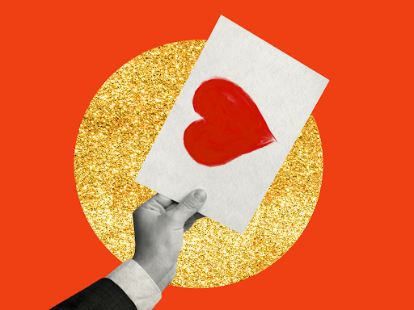
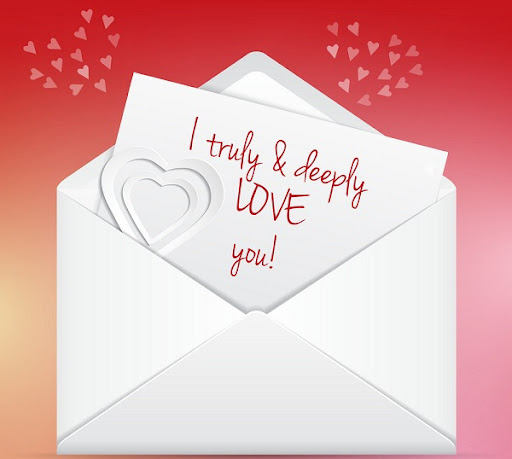
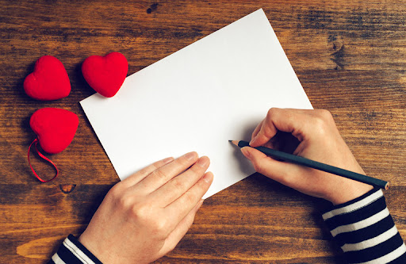
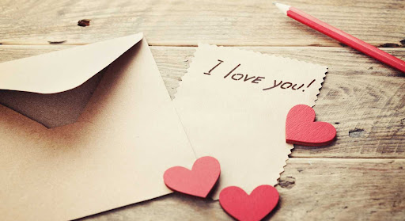

This article has been written and researched by our expert Loveable through a precise methodology. [Learn more about our methodology](https://avada.io/loveable/our-methodological.html)

[Loveable](https://avada.io/loveable/) > [Blog](https://avada.io/loveable/blog/) > [Relationship](https://avada.io/loveable/relationship/)

# How To Write A Love Letter to Your Crush

Written by [Luna Miller](https://avada.io/loveable/author/luna/) Last Updated on August 21, 2023

- [The Purpose of a Love Letter](https://avada.io/loveable/blog/write-a-love-letter/#wp-block-heading-2-3)
- [How to write a love letter for your crush](https://avada.io/loveable/blog/write-a-love-letter/#wp-block-heading-2-8)
    - [Starting off by writing a salutation holding your crush’s attention](https://avada.io/loveable/blog/write-a-love-letter/#wp-block-heading-3-11)
    - [Writing an in-depth introduction](https://avada.io/loveable/blog/write-a-love-letter/#wp-block-heading-3-21)
    - [Transition to a body paragraph describing how you feel](https://avada.io/loveable/blog/write-a-love-letter/#wp-block-heading-3-31)
    - [Conclusion the love letter with your expectations](https://avada.io/loveable/blog/write-a-love-letter/#wp-block-heading-3-34)
- [Some examples of a love letter helping express feelings to your crush](https://avada.io/loveable/blog/write-a-love-letter/#wp-block-heading-2-42)
- [Sum Up](https://avada.io/loveable/blog/write-a-love-letter/#wp-block-heading-2-52)

Nowadays, thanks to the improvement of the high-tech Internet, people take advantage of expressing their hearts with their lovers through text, which is useful but not most romantic. So they gradually forget that the best way to show sincerity, besides verbal, is through a letter. 

Writing a love letter requires thoughtfulness, empathy, and understanding of the person you will send a love message to. It’s important to keep in mind that it is a personal message to someone you care about and should be approached with care. Whether you’re writing a love letter for the first time or want to revive your relationship, there are tips for **how to write a love letter** **to your crush** that will make an impact.

## **The Purpose of a Love Letter**

The Purpose of a Love Letter

The love letter is quite popular to show off your love in the past. You can easily catch in old movies that couples give each other love letters to their sweeties. They don’t use words because of shyness when they meet each other. Hands and feet shaking and losing themselves, the anxiety of confessing makes letters become effective assistants replace for what they want to say. 

Why is handwriting more romantic than text? It’s unique, for sure. Text is designed to have a basic form, and it cannot show sincerity through short messages. Do you tend to text her/him that “I really love you, please be my lover”? It is extremely boring and has no feelings.

On the other hand, a handwritten love letter is tangible to be a keepsake that consists of your handwriting. Your feelings of suspense and romance can be put into this letter. Your lover can keep it as a [gift of love](https://avada.io/loveable/cute-valentines-day-gift-ideas/) to reflect on how lovely he/she was. Something that no other type of email can do.

## **How to write a love letter for your crush**

How to write a love letter effectively? Realize the importance of a handwritten love letter, and there are some tips for writing a meaningful letter for your crush if you want to find the best way to express love. Read this article before preparing for pen and paper to start.

How to write a love letter for your crush

### **Starting off by writing a salutation holding your crush’s attention**

“A good book needs to be wrapped with a beautiful cover.” If you want your crush to read the content, you should prepare an attractive salutation first.  Begin a love letter with an attention-grabbing salutation to make a lasting impression. Don’t undervalue the power of his or her name.

Some outstanding examples: 

- To my darling…
- To my soul mate…
- To my forever love…
- To my best friend…

You can investigate your crush’s name or nickname first to attract that you are concerned about him/her.

Your salutation should be heart-warming and welcoming to persuade your crush to read the letter.

You can consider adding some lovely symbols and heart-shaped signs to make it adorable. 

### **Writing an in-depth introduction**

Writing an in-depth introduction

No matter what you write, an article, [novel](https://avada.io/loveable/funny-novelty-gifts/), love story, or even write a love letter. The introduction is always considered one of the most important parts because it decides whether the reader continues to read or not. So how to write a love letter with a touching introduction?

You have to catch your crush’s interest in the first paragraph. It can be a summarization or a beautiful memory as long as it links to the main body.

There are some strategies to have a perfect introduction when writing a love letter:

- Make a draft before writing
- End with a Call to action (CTA) to arouse curiosity about the body of the letter
- Use common words instead of academic ones
- Use romantic words to express your love
- You can remind her of the first time meeting each other

### **Transition to a body paragraph describing how you feel**

Let’s show her your sincerity with several sentences to express your feelings about him/her. Why did he/she make you fall in love? Show your embarrassment whenever seeing her. Show your concern and romance, and this is the part that contains all your heart. I know that you have many things to tell her, but please keep it clear and brief in this part. Select short and concise words to jot down your love messages.

You may ask for an appointment somewhere she loves, a restaurant, cafeteria, or park. Let’s arrange the time first if she replies to your requirement whether she is busy or not. You still get an announcement.

### **Conclusion the love letter with your expectations**

The closing paragraph should be brief and mention your expectation. After asking her for a date, leave your hope to get her response to this handwritten love letter as soon as possible. 

You start writing the introduction with full love, so you also end the conclusion with hope. Show your honesty that you will wait for a response from him/her.

Examples of what to write: 

- I await you
- See you soon
- Cannot do without you
- Always on my mind

## **Some examples of a love letter helping express feelings to your crush**

Some examples of a love letter helping express feelings to your crush

There is a sample for you to reference on how to write a love letter.

To my forever love, (name),

We may have only recently met, and you may be astonished to get this message from me. I recognize that this might cause us both shame, but I’m prepared to take the chance. I simply wanted you to know that I’ve been drawn to you since our first meeting.

You surprised me by stealing my heart. I had never seriously contemplated dating or relationships at this stage in my life, but you have completely altered my perspective. When I look at you, my heart skips a beat. I wish I could stop my heart racing and be myself when chatting with you.

I think about you all time. You have occupied my mind. I’m not sure what will happen to my wish, but I know I have to tell you what I’m thinking if it’s gonna come true.

I await you. Hope to see your lovely face and angel voice.

(Name of the writer)

**_See More:_** [What To Write In Valentines Card](https://avada.io/loveable/what-to-write-in-valentines-card/): 20 Best Ideas

## **Sum Up**

Advanced technology supports people with an easy way to text a message fastly, but there are more effective ways for the sender in case you want to express love. Don’t make it look like a joke. Let’s show your sincerity with a handwritten love letter. It is the best way to show off your love so that the receiver can feel your sincerity through your handwriting on the paper. 

This is the purpose of this post for helping you **how to write a love letter to your crush**. There are many tips along with a sample for you to have a perfect handwritten love message letter. Remember to check it carefully before giving it to your crush.

- [The Purpose of a Love Letter](https://avada.io/loveable/blog/write-a-love-letter/#wp-block-heading-2-3)
- [How to write a love letter for your crush](https://avada.io/loveable/blog/write-a-love-letter/#wp-block-heading-2-8)
    - [Starting off by writing a salutation holding your crush’s attention](https://avada.io/loveable/blog/write-a-love-letter/#wp-block-heading-3-11)
    - [Writing an in-depth introduction](https://avada.io/loveable/blog/write-a-love-letter/#wp-block-heading-3-21)
    - [Transition to a body paragraph describing how you feel](https://avada.io/loveable/blog/write-a-love-letter/#wp-block-heading-3-31)
    - [Conclusion the love letter with your expectations](https://avada.io/loveable/blog/write-a-love-letter/#wp-block-heading-3-34)
- [Some examples of a love letter helping express feelings to your crush](https://avada.io/loveable/blog/write-a-love-letter/#wp-block-heading-2-42)
- [Sum Up](https://avada.io/loveable/blog/write-a-love-letter/#wp-block-heading-2-52)

### [Luna Miller](https://avada.io/loveable/author/luna/)

I'm Luna Miller, a helpful employee at Loveable. I excel at giving great advice on birthday gifts. I love suggesting memorable experiences like concerts, spas, and getaways. As a reliable and supportive colleague, I'm always there to assist.

- [Twitter](https://twitter.com/intent/tweet)
- [Facebook](https://www.facebook.com/sharer/sharer.php)
- [instagram](https://avada.io/loveable/blog/write-a-love-letter/)
- [pinterest](https://www.pinterest.com/loveablellc/)

## Related Posts

[

### 35 Unforgettable Exciting Adult Birthday Party Ideas

](https://avada.io/loveable/blog/adult-birthday-party-ideas/)

[

### 42 Best 21st Birthday Outfits to Rock the Party

](https://avada.io/loveable/blog/21st-birthday-outfits/)

[

### 50+ Happy 40th Anniversary Quotes, Messages, and Wishes

](https://avada.io/loveable/blog/happy-40th-anniversary-quotes/)

[

### 100+ Heartwarming Happy 30th Anniversary Quotes, Messages, and Wishes

](https://avada.io/loveable/blog/happy-30th-anniversary-quotes/)

[

### 120+ Heartfelt Thank You Messages for The Birthday Wishes

](https://avada.io/loveable/blog/thank-you-messages-birthday-wishes/)
