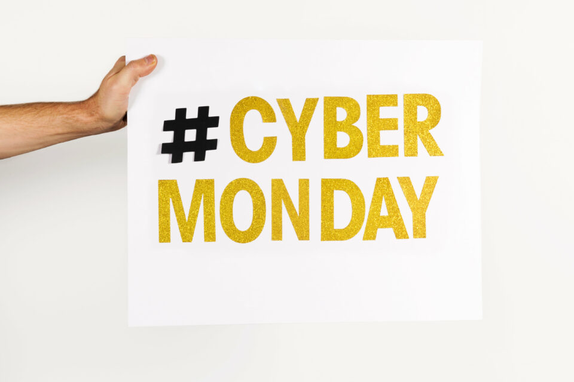

This article has been written and researched by our expert Loveable through a precise methodology. [Learn more about our methodology](https://avada.io/loveable/our-methodological.html)

[Loveable](https://avada.io/loveable/) > [Blog](https://avada.io/loveable/blog/) > [Holiday](https://avada.io/loveable/holiday/)

# Is Cyber Monday Better Than Black Friday? – Unmasking the Hidden Factors that Crown the Champion

Written by [Blake Simpson](https://avada.io/loveable/author/blake/) Last Updated on September 07, 2023

- [Black Friday and Cyber Monday Terms Explained](https://avada.io/loveable/blog/cyber-monday-vs-black-friday/#wp-block-heading-2-2)
    - [Black Friday](https://avada.io/loveable/blog/cyber-monday-vs-black-friday/#wp-block-heading-3-3)
    - [Cyber Monday](https://avada.io/loveable/blog/cyber-monday-vs-black-friday/#wp-block-heading-3-7)
- [Is Cyber Monday Better Than Black Friday? Pros and Cons of Each](https://avada.io/loveable/blog/cyber-monday-vs-black-friday/#wp-block-heading-2-10)
    - [Cyber Monday](https://avada.io/loveable/blog/cyber-monday-vs-black-friday/#wp-block-heading-3-13)
        - [5 Upsides of Shopping on Cyber Monday Instead of Black Friday Sales](https://avada.io/loveable/blog/cyber-monday-vs-black-friday/#wp-block-heading-4-15)
        - [5 Downsides of Cyber Monday](https://avada.io/loveable/blog/cyber-monday-vs-black-friday/#wp-block-heading-4-27)
    - [Black Friday](https://avada.io/loveable/blog/cyber-monday-vs-black-friday/#wp-block-heading-3-39)
        - [5 Pros: Reasons to Shop Black Friday Rather than Cyber Monday](https://avada.io/loveable/blog/cyber-monday-vs-black-friday/#wp-block-heading-4-41)
        - [5 Cons of Black Friday](https://avada.io/loveable/blog/cyber-monday-vs-black-friday/#wp-block-heading-4-52)
- [Comparing Cyber Monday and Black Friday](https://avada.io/loveable/blog/cyber-monday-vs-black-friday/#wp-block-heading-2-64)
    - [Value of discounts and potential savings](https://avada.io/loveable/blog/cyber-monday-vs-black-friday/#wp-block-heading-3-65)
    - [Matching shopping style preferences](https://avada.io/loveable/blog/cyber-monday-vs-black-friday/#wp-block-heading-3-70)
    - [Convenience and shopping experience](https://avada.io/loveable/blog/cyber-monday-vs-black-friday/#wp-block-heading-3-74)
    - [Considerations for smart shopping and decision-making](https://avada.io/loveable/blog/cyber-monday-vs-black-friday/#wp-block-heading-3-79)
- [Final words](https://avada.io/loveable/blog/cyber-monday-vs-black-friday/#wp-block-heading-2-85)

Thanksgiving marks the day that most family gatherings and celebrations for the end of the year begin, and it also marks the day when customers can take advantage of the biggest discounts and special deals in-store or online. In the thrilling saga of retail showdowns, two titans have emerged as the reigning champions – Cyber Monday and Black Friday. While Black Friday was considered the best day to shop for deals for a long time, Cyber Monday has taken over as the most fabulous yearly shopping day in the US in the last few years. So the question is: **Is Cyber Monday Better Than Black Friday**? Let’s embark on a journey to unmask the hidden factors that ultimately crown the champion of the shopping realm.

## **Black Friday and Cyber Monday Terms Explained**

### **Black Friday**

“Black Friday” was coined in 1869, but the most recent interpretation dates from the 1980s. Some say that “Black Friday” was chosen as a nod to the “black” for profitability, which comes from the old bookkeeping custom of recording profits in black ink and losses in red ink. The plan is for retail establishments to make enough sales this Friday (and the following weekend) to put them “in the black” for the rest of the year. 

After that, Black Friday began to gain public recognition as the period between Thanksgiving and the weekend. Nowadays, that day seems to apply to the majority of November because sales at stores begin the day after Halloween.

### **Cyber Monday**

In contrast to the bustling stores of Black Friday, Cyber Monday embraces the digital realm. This term was made in 2005 by the National Retail Federation to mark the surge in online shopping activity on the Monday following Thanksgiving. With the rise of e-commerce, Cyber Monday celebrates the convenience of online shopping and the allure of virtual deals. Even though it was initially created to encourage more people to shop online, it has since become one of the year’s busiest shopping days.

## **Is Cyber Monday Better Than Black Friday? Pros and Cons of Each**

Whether Cyber Monday surpasses Black Friday hinges on weighing the pros and cons of each.  Black Friday offers immediate in-store engagement and spirited deals but with potential crowds and limited hours. In contrast, Cyber Monday’s convenience lies in online browsing, price comparisons, and easy purchases while lacking the tactile store experience. 

The choice depends on individual preferences: Black Friday for in-person excitement and Cyber Monday for hassle-free online shopping. Both events have distinct advantages and drawbacks, allowing shoppers to align their choice with their priorities and shopping style. And right now, we’ll explore the pros and cons of each type.

### **Cyber Monday**

#### **5 Upsides of Shopping on Cyber Monday Instead of Black Friday Sales**

**1\. Convenience at Your Fingertips**

Gone are the days of braving long lines and crowded stores. Cyber Monday offers the unparalleled convenience of shopping from the comfort of your home, office, or even while sipping your morning coffee. With just a few clicks, you can explore many deals, compare prices, and purchase without stepping outside. Say goodbye to the hassle and stress of in-store shopping – Cyber Monday brings the shopping spree to your fingertips.

**2\. Exclusive Online-Only Deals**

Cyber Monday is renowned for its online exclusivity. Retailers roll out a red carpet of digital deals often unavailable in physical stores. From limited-time offers to web-exclusive discounts, the virtual world becomes a treasure trove of savings. With just a few clicks, shoppers can browse a wide range of products and compare prices from various online retailers. Let’s enjoy the thrill of shopping for one-of-a-kind bargains on this digital platform!

**3\. Tech Enthusiast’s Paradise**

If you’re a tech lover, Cyber Monday is your paradise. The digital realm becomes a playground for discovering jaw-dropping discounts on gadgets, electronics, and tech innovations. Cyber Monday delivers unbeatable deals on cutting-edge technology, whether you’re eyeing the latest smartphone, upgrading your laptop, or delving into the world of smart home devices.

**4\. No Crowds, No Stress**

Bid farewell to the chaos and frenzy often accompanying in-store Black Friday shopping. Cyber Monday offers a serene and stress-free shopping experience. Say goodbye to jostling through crowds, searching for parking spots, and enduring long checkout lines. Instead, relish the tranquility of browsing online catalogs, adding items to your cart easily, and enjoying a seamless checkout process.

**5\. Extended Shopping Window**

While Black Friday is often confined to a single day, Cyber Monday extends the shopping window, granting you more time to explore deals and make informed decisions. You can take your time, compare options, read reviews, and ensure you’re making the right purchases. Cyber Monday alleviates time pressure, allowing for a more relaxed and enjoyable shopping experience.

#### **5 Downsides of Cyber Monday**

**1\. Impersonal Shopping Experience**

The convenience of shopping online comes at a cost – the lack of personal interaction. Cyber Monday eliminates the tactile engagement and face-to-face interactions that in-store shopping provides. Without the ability to physically touch, feel, and try on products, shoppers might miss out on the sensory joy of traditional shopping.

**2\. Delayed Gratification**

Unlike the instant satisfaction of leaving a store with purchases in hand on Black Friday, Cyber Monday often entails waiting for items to be shipped. This delay in gratification can lessen the excitement of scoring a great deal, especially if you’re eagerly anticipating your new purchases.

**3\. Overwhelming Choices**

The vast array of online deals during Cyber Monday can lead to decision fatigue. With numerous retailers offering countless discounts, shoppers may find themselves overwhelmed and struggling to make informed choices among the sea of options.

**4\. Shipping Costs and Delays**

While some Cyber Monday deals come with free shipping, others may require additional fees. Moreover, shipping delays or issues can arise, potentially affecting the timing of your purchases, especially during the busy holiday season.

**5\. Security Concerns**

The digital landscape is not without its risks. Cyber Monday can expose shoppers to potential security breaches, including identity theft, fraudulent websites, and phishing scams. Ensuring a safe online shopping experience requires vigilance and cautious navigation. 

### **Black Friday**

#### **5 Pros: Reasons to Shop Black Friday Rather than Cyber Monday**

**1\. Thrilling In-Store Experience**

Black Friday is synonymous with the excitement of bustling stores, eager shoppers, and an electrifying atmosphere. The sensory engagement of physically being present in a store, trying on clothes, and exploring products adds a thrilling dimension to the shopping spree that online experiences can’t replicate.

**2\. Instant Gratification**

Leaving a store with your purchases in hand provides immediate satisfaction that online shopping often lacks. The joy of holding your new items and taking them home right away adds a sense of accomplishment that can’t be matched in the digital realm.

**3\. In-Store Exclusives**

While Cyber Monday offers its share of online exclusives, Black Friday is known for its in-store-only deals and doorbusters. These exclusive offerings can incentivize shoppers to venture out and explore the unique discounts available solely within physical retail spaces.

**4\. Communal Excitement**

Black Friday creates a sense of intimacy among shoppers on a similar mission – to find the best deals. Sharing the excitement, stories, and camaraderie with fellow shoppers adds a social dimension to the shopping experience that can’t be replicated online shopping.

**5\. Unique Bargains**

The dynamic nature of in-store shopping on Black Friday often leads to unexpected discoveries. The thrill of stumbling upon hidden gems and unadvertised bargains adds an element of surprise and adventure to the experience, making each purchase feel like a treasure hunt.

#### **5 Cons of Black Friday**

**1\. Crowded Stores**

The allure of Black Friday’s deals often leads to overcrowded stores and long lines. Navigating through bustling aisles and waiting in extended queues can be overwhelming and time-consuming, potentially dampening the excitement of the shopping experience.

**2\. Limited Availability**

Some of the most enticing Black Friday deals are available in limited quantities, leading to the phenomenon of “deal-hunting.” Shoppers may find themselves racing against time and other shoppers to secure these deals before they run out of stock.

**3\. Time Sensitivity**

Black Friday deals are typically time-sensitive, requiring shoppers to make quick decisions to take advantage of discounts. This time pressure can lead to impulse purchases that may not align with your needs or preferences.

**4\. Increased Stress**

The competitive nature of Black Friday shopping can heighten stress levels as shoppers strive to secure the best deals. From navigating traffic to jostling through crowds, pursuing bargains may inadvertently contribute to elevated stress and anxiety.

**5\. Early Wake-Up Calls**

Many Black Friday deals start in the early morning or even at midnight, requiring shoppers to wake up at unconventional times. This disruption of sleep schedules can lead to fatigue and a less enjoyable shopping experience.

## **Comparing Cyber Monday and Black Friday**

### **Value of discounts and potential savings**

When comparing Cyber Monday and Black Friday regarding the value of discounts and potential savings, it’s evident that both days offer substantial opportunities for consumers to snag great deals. However, each type has its own unique features and associated benefits. So, consider for the best shopping experience!

Black Friday, traditionally occurring in physical retail stores the day after Thanksgiving, has long been associated with doorbuster sales and significant product price reductions. Shoppers can find discounts on everything from electronics to clothing, often with the potential to save a considerable amount of money.

On the other hand, Cyber Monday takes the deals online, offering enticing discounts and savings on various e-commerce platforms. This digital shopping extravaganza allows consumers to shop from the comfort of their homes and take advantage of exclusive online-only deals. While the overall value of discounts may vary between the two days, Cyber Monday often focuses on electronics, gadgets, and tech-related items, presenting an opportunity for tech-savvy shoppers to find exceptional bargains.

### **Matching shopping style preferences**

These two significant shopping days cater to different consumer inclinations when comparing Cyber Monday and Black Friday about matching shopping preferences. Black Friday, traditionally held in brick-and-mortar stores, appeals to those who enjoy the excitement of early morning crowds, bustling aisles, and the thrill of finding deals in a physical shopping environment. Shoppers who relish the tactile experience of browsing through merchandise, trying products firsthand, and engaging in in-person interactions may find Black Friday their preferred shopping day.

On the contrary, Cyber Monday has gained popularity as a digital counterpart, enticing those who appreciate the convenience and ease of online shopping. This virtual shopping spree allows individuals to peruse various products from the comfort of their homes, avoiding the hustle and bustle of crowded stores. Shoppers who value the ability to quickly compare prices read reviews, and effortlessly make purchases with a few clicks may gravitate toward Cyber Monday.

### **Convenience and shopping experience**

Regarding convenience and shopping experience, a comparison between Cyber Monday and Black Friday reveals how each event addresses consumer preferences. Black Friday, a long-standing tradition, offers an in-person shopping extravaganza with a bustling atmosphere and communal excitement. Shoppers who thrive on the physicality of browsing through stores, touching products, and engaging in face-to-face interactions often find Black Friday to be a refreshing experience.

Cyber Monday presents a convenient alternative by bringing the shopping spree to the digital realm. This online event appeals to individuals who value the ease of browsing and purchasing from the comfort of their own homes. Online shoppers can effortlessly compare prices, read reviews, and swiftly finalize transactions, making it an attractive option for those seeking efficiency and a stress-free experience.

The convenience of Cyber Monday also extends to its accessibility, as shoppers can participate from virtually anywhere with an internet connection. This is especially suitable for people with busy schedules who have no time to shop or prefer a quieter shopping environment. Since it can eliminate the need to wait in long lines, be crowded at the store, or even be inconvenient in terms of transportation.

### **Considerations for smart shopping and decision-making**

Ultimately, the decision between Cyber Monday and Black Friday boils down to your personal preferences and priorities.

<table><tbody><tr><td><strong>Choose Cyber Monday If:</strong></td><td><strong>Choose Black Friday If:</strong></td></tr><tr><td>– You value convenience and prefer shopping from the comfort of your home. – Exclusive online deals and tech discounts pique your interest. – The allure of exploring virtual catalogs resonates with you.</td><td>– You thrive on the in-store experience, bustling crowds, and tactile engagement. – Instant gratification and the thrill of in-person shopping excite you. – You’re ready to brave the crowds for potential in-store exclusives.</td></tr></tbody></table>

**_See More:_**

- [What Is Black Friday?](https://avada.io/loveable/blog/what-is-black-friday/) Everything You Need to Know

- [Why Black Friday is Bad?](https://avada.io/loveable/blog/why-black-friday-bad/) 15 Reasons Behind You Must Know 

## **Final words**

In the grand debate on the question: **Is Cyber Monday better than Black Friday**? There’s no definitive answer. Each event offers a unique shopping experience with its own set of pros and cons. Whether you lean toward the digital delights of Cyber Monday or the in-store frenzy of Black Friday, rest assured that both events cater to diverse shopping preferences.

Whether clicking through virtual aisles or exploring brick-and-mortar stores, the choice between Cyber Monday and Black Friday ultimately rests in your hands. Happy shopping!

- [Black Friday and Cyber Monday Terms Explained](https://avada.io/loveable/blog/cyber-monday-vs-black-friday/#wp-block-heading-2-2)
    - [Black Friday](https://avada.io/loveable/blog/cyber-monday-vs-black-friday/#wp-block-heading-3-3)
    - [Cyber Monday](https://avada.io/loveable/blog/cyber-monday-vs-black-friday/#wp-block-heading-3-7)
- [Is Cyber Monday Better Than Black Friday? Pros and Cons of Each](https://avada.io/loveable/blog/cyber-monday-vs-black-friday/#wp-block-heading-2-10)
    - [Cyber Monday](https://avada.io/loveable/blog/cyber-monday-vs-black-friday/#wp-block-heading-3-13)
        - [5 Upsides of Shopping on Cyber Monday Instead of Black Friday Sales](https://avada.io/loveable/blog/cyber-monday-vs-black-friday/#wp-block-heading-4-15)
        - [5 Downsides of Cyber Monday](https://avada.io/loveable/blog/cyber-monday-vs-black-friday/#wp-block-heading-4-27)
    - [Black Friday](https://avada.io/loveable/blog/cyber-monday-vs-black-friday/#wp-block-heading-3-39)
        - [5 Pros: Reasons to Shop Black Friday Rather than Cyber Monday](https://avada.io/loveable/blog/cyber-monday-vs-black-friday/#wp-block-heading-4-41)
        - [5 Cons of Black Friday](https://avada.io/loveable/blog/cyber-monday-vs-black-friday/#wp-block-heading-4-52)
- [Comparing Cyber Monday and Black Friday](https://avada.io/loveable/blog/cyber-monday-vs-black-friday/#wp-block-heading-2-64)
    - [Value of discounts and potential savings](https://avada.io/loveable/blog/cyber-monday-vs-black-friday/#wp-block-heading-3-65)
    - [Matching shopping style preferences](https://avada.io/loveable/blog/cyber-monday-vs-black-friday/#wp-block-heading-3-70)
    - [Convenience and shopping experience](https://avada.io/loveable/blog/cyber-monday-vs-black-friday/#wp-block-heading-3-74)
    - [Considerations for smart shopping and decision-making](https://avada.io/loveable/blog/cyber-monday-vs-black-friday/#wp-block-heading-3-79)
- [Final words](https://avada.io/loveable/blog/cyber-monday-vs-black-friday/#wp-block-heading-2-85)

### [Blake Simpson](https://avada.io/loveable/author/blake/)

Hi, I'm Blake from Loveable. I help people find perfect gifts for occasions like anniversaries and weddings. I also write a blog about holidays, sharing insights to make them more meaningful. Let's create unforgettable moments together!

- [Twitter](https://twitter.com/intent/tweet)
- [Facebook](https://www.facebook.com/sharer/sharer.php)
- [instagram](https://avada.io/loveable/blog/cyber-monday-vs-black-friday/)
- [pinterest](https://www.pinterest.com/loveablellc/)

## Related Posts

[### 120+ Christian Birthday Wishes To Spread Your Love](https://avada.io/loveable/blog/christian-birthday-wishes/) 

[

### 35 Best 70th Birthday Ideas To Celebrate The Special Milestone

](https://avada.io/loveable/blog/70th-birthday-ideas/)

[

### 50 Best 30th Birthday Decorations for a Remarkable Birthday Bash

](https://avada.io/loveable/blog/30th-birthday-decorations/)

[

### 40 Delicious Vegan Christmas Desserts to Delight Your Palate

](https://avada.io/loveable/blog/vegan-christmas-desserts/)

[

### 60 Christmas Team Building Activities to Boost Workplace Spirit

](https://avada.io/loveable/blog/christmas-team-building-activities/)
