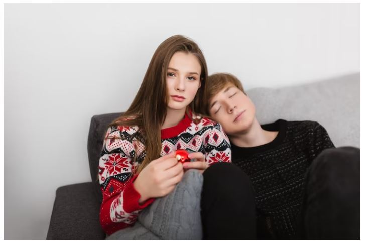
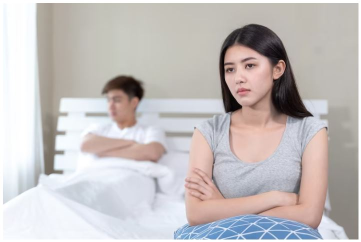
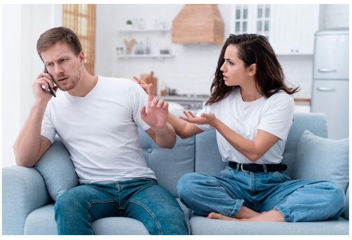
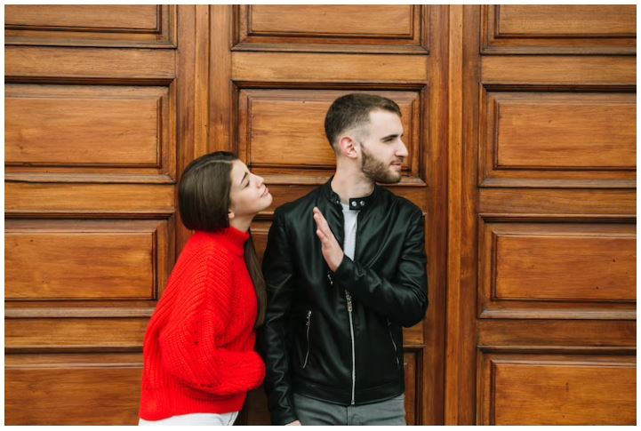

This article has been written and researched by our expert Loveable through a precise methodology. [Learn more about our methodology](https://avada.io/loveable/our-methodological.html)

[Loveable](https://avada.io/loveable/) > [Blog](https://avada.io/loveable/blog/) > [Relationship](https://avada.io/loveable/relationship/)

# Is My Boyfriend Cheating On Me? 21 Warning Signs To Be Aware Of

Written by [Luna Miller](https://avada.io/loveable/author/luna/) Last Updated on August 22, 2023

- [What is considered to be cheating?](https://avada.io/loveable/blog/is-my-boyfriend-cheating/#wp-block-heading-2-4)
- [21 Signs Your Boyfriend Cheating](https://avada.io/loveable/blog/is-my-boyfriend-cheating/#wp-block-heading-2-8)
    - [1\. Huge Changes in the Way Boyfriend Talks](https://avada.io/loveable/blog/is-my-boyfriend-cheating/#wp-block-heading-3-10)
    - [2\. He doesn’t seem to care about you](https://avada.io/loveable/blog/is-my-boyfriend-cheating/#wp-block-heading-3-13)
    - [3\. His habits are becoming different now](https://avada.io/loveable/blog/is-my-boyfriend-cheating/#wp-block-heading-3-16)
    - [4\. He takes better care of himself](https://avada.io/loveable/blog/is-my-boyfriend-cheating/#wp-block-heading-3-19)
    - [5\. He starts to criticize you more](https://avada.io/loveable/blog/is-my-boyfriend-cheating/#wp-block-heading-3-23)
    - [6\. He Feels Distant](https://avada.io/loveable/blog/is-my-boyfriend-cheating/#wp-block-heading-3-25)
    - [7\. He doesn’t ask you out as often as he used to do](https://avada.io/loveable/blog/is-my-boyfriend-cheating/#wp-block-heading-3-29)
    - [8\. He is keeping things to himself](https://avada.io/loveable/blog/is-my-boyfriend-cheating/#wp-block-heading-3-31)
    - [9\. He is now impossible to reach](https://avada.io/loveable/blog/is-my-boyfriend-cheating/#wp-block-heading-3-33)
    - [10\. He doesn’t like being asked things](https://avada.io/loveable/blog/is-my-boyfriend-cheating/#wp-block-heading-3-36)
    - [11\. His phone habits have changed](https://avada.io/loveable/blog/is-my-boyfriend-cheating/#wp-block-heading-3-38)
    - [12\. His Libido Has Changed](https://avada.io/loveable/blog/is-my-boyfriend-cheating/#wp-block-heading-3-41)
    - [13\. He spends more time with his “Friends”](https://avada.io/loveable/blog/is-my-boyfriend-cheating/#wp-block-heading-3-49)
    - [14\. His reasons don’t make sense](https://avada.io/loveable/blog/is-my-boyfriend-cheating/#wp-block-heading-3-52)
    - [15\. He has trouble with intimacy](https://avada.io/loveable/blog/is-my-boyfriend-cheating/#wp-block-heading-3-56)
    - [16\. He is distracted](https://avada.io/loveable/blog/is-my-boyfriend-cheating/#wp-block-heading-3-59)
    - [17\. He buys new clothes and perfume](https://avada.io/loveable/blog/is-my-boyfriend-cheating/#wp-block-heading-3-63)
    - [18\. He starts to get irritated](https://avada.io/loveable/blog/is-my-boyfriend-cheating/#wp-block-heading-3-66)
    - [19\. You’ve noticed that his moods are always changing](https://avada.io/loveable/blog/is-my-boyfriend-cheating/#wp-block-heading-3-69)
    - [20\. He suddenly likes doing overtime](https://avada.io/loveable/blog/is-my-boyfriend-cheating/#wp-block-heading-3-73)
    - [21\. You talk less than you used to](https://avada.io/loveable/blog/is-my-boyfriend-cheating/#wp-block-heading-3-77)
- [Final Thoughts,](https://avada.io/loveable/blog/is-my-boyfriend-cheating/#wp-block-heading-2-82)

There are universal symptoms that point to a boyfriend’s cheating behaviors, even if cheating in a relationship is frequently arbitrary. They include, among other things, a shift in mood, an increase in distraction, a decrease in the value placed on the relationship, and an increase in screen time. 

But, you may take steps to decide whether to address the problems and attempt a settlement or end the relationship.

Is my boyfriend cheating? And what are signs my boyfriend is cheating? We don’t want to ask ourselves these questions. But what if there are already minute signs of cheating?

## What is considered to be cheating?

In a monogamous relationship, the act of being emotionally or physically disloyal to your partner is referred to as cheating. Physical, virtual, financial, or emotional affairs are just a few examples of cheating. Cheating can be classified as a grey zone that, if not addressed, frequently has a negative impact on the relationship.

The regulations against cheating vary since each relationship is unique. Much of this relies on what was agreed upon regarding relationship boundaries and what happens when these boundaries are crossed. What one person might consider cheating might not be the same in another relationship.

_**Related**_: [Why Do Men Cheat?](https://avada.io/loveable/why-do-men-cheat/) 20 Possible Reasons + Advices

## 21 Signs Your Boyfriend Cheating

### 1\. Huge Changes in the Way Boyfriend Talks

Everybody occasionally gets busy and forgets to check in with their companion. Ultimately, the conversation changes and begins to sound different. The lack of communication is now an issue. 

He used to talk to you and discuss your day, but he no longer does. He now checks his phone, uses the restroom more frequently, or just “checking out.” And your boyfriend would rather concentrate on other things because the desire to connect is weakening.

### 2\. He doesn’t seem to care about you

He doesn’t seem to care about you

Your relationship may suffer as a result of life’s challenges, like responsibilities at work or feeling overburdened. Furthermore, a relationship’s initial stages may see a difference in the level of interest. This behavior, however, may be a symptom of cheating if you start to discover a pattern.

### 3\. His habits are becoming different now

Every one of us follows a schedule in order to live the lifestyle we choose. You become accustomed to certain routines while you are in a relationship. When they change, you have to take a step back and question what is going on.

Is my boyfriend cheating? Ask yourself, “Has his routine changed in any way?” If so, what altered and how severe was the transformation? Sometimes the modifications are minor, so at first glance, they might not be apparent. Nevertheless, paying attention to any changes and how they can be explained is important.

### 4\. He takes better care of himself

He takes better care of himself

The majority of people prioritize self-care activities like exercising at the start of the year or as the summer months approach. This is comprehensible. 

But if your partner starts dressing differently, applying cologne, or being more conscious of his looks, it might be time to ask them about it or give it some thought.

### 5\. He starts to criticize you more

We all have quirks that need to be worked on, but if your boyfriend begins to be harsh with things that were not bothering him before, this could be an indication that he is cheating. When compared to the ‘other person,’ a partner will always fall short.

### 6\. He Feels Distant

He **Feels** Distant

Have you ever had the impression that he is distant? Does he become defensive or deny that he is this way when you bring it up? We can detect when our partner begins to withdraw. Naturally, this could be due to work or family stress. 

These issues, however, are frequently discussed between partners. The relationship changes when they become more physically and emotionally distant.

### 7\. He doesn’t ask you out as often as he used to do

Do you ever wonder why you aren’t invited out more often? This change is also a sign that your boyfriend is possibly cheating. A partner will notice any changes in a relationship’s energy, so it’s important to pay attention to how much time you spend together.

### 8\. He is keeping things to himself

His current whereabouts are no longer open info. His schedule and phone are both hidden. He has gotten more secretive in his time and life and doesn’t want to incorporate you as much. Perhaps he’s keeping some of his clothes, his wallet, or other items of personal property hidden.

### 9\. He is now impossible to reach

He is now impossible to reach

You suddenly can’t get to him. You won’t be able to reach him for extended periods of time, whereas you could before if he is having an affair. For instance, a partner who has to “work late” without a good cause can be a sign of infidelity.

### 10\. He doesn’t like being asked things

With their spouse, people frequently discuss their day’s events, what transpired, or personal issues. It is also OK to let your spouse know where you are going and who you will be with, even if they don’t ask. Your guy might be sharing this with someone else if he starts talking less and less.

### 11\. His phone habits have changed

Is my boyfriend cheating on me online? Many partners in a committed and honest relationship know their partner’s phone or computer passwords. It’s not a big deal. People who are not cheating leave their phones around and are unconcerned if they pick it up or see when it rings. 

Is my boyfriend cheating? When you ask him about his smartphones, if your guy gets furious, defensive, or possessive, he might be hiding something.

### 12\. His Libido Has Changed

His Libido Has Changed

In relationships, libido tends to rise and fall. This is quite common. However, if you notice a significant difference in this, it could indicate infidelity.

If your boyfriend is cheating, you may notice a change in his libido as follows:

- He may desire more sex at home in order to mask his actions and relieve his guilt.
- He may initiate sex so that you do not request it later when he is unavailable or unable to have sex.
- He will have less sex since he has it with someone else.
- He wants to try out a new sexual position or move in bed, and he’s pretty good at it.

### 13\. He spends more time with his “Friends”

At first, simply being together was enough for both of you. As he spends more time with ‘friends,’ you find yourself moving down his priority list. You’ve become less important to him, and he’s started to look elsewhere or is already interested in someone else. 

He may claim to be with friends when, in fact, he is spending time with someone else. Finally, less time with you means that the relationship is changing.

### 14\. His reasons don’t make sense

His reasons don’t make sense

He makes up justifications for why he can’t accomplish something or for where he was or who he was with. The plot shifts, and things become confusing. When someone is telling the truth, their story is consistent. He wouldn’t be able to recall what he said at first if he was lying to you. 

When explaining himself, he may say different things or his timeline may shift. The more you confront him, the more likely it is that he will gaslight you, claiming that you are being nosy or asking too many questions.

### 15\. He has trouble with intimacy

In many cases, intimacy problems stem from a person’s attachment style. Intimacy is difficult for people who have an insecure/avoidant attachment style. They will approach someone but begin to withdraw when things become serious. 

A lot of this stems from anxiety about being vulnerable or emotionally available to a partner. When a boyfriend has intimacy issues, he may withdraw from the relationship and begin seeing someone else.

### 16\. He is distracted

He is distracted

You’re all under one roof, but he doesn’t appear to be there. He’s not ‘present’ with you. You must repeat what you just said or call his name more than twice.

It’s okay to be this way from time to time; perhaps your boyfriend is thinking about work. But what if he’s preoccupied with someone else?

### 17\. He buys new clothes and perfume

Is my boyfriend cheating? Another obvious warning sign of being aware of: Is your boyfriend suddenly self-conscious about his appearance?

We’re all familiar with the desire to look your best when you’re attracted to someone, just like a teenager in love. Buying new clothes, changing his hairstyle, and purchasing new perfume may be a way for him to regain his self-esteem, or he may be attempting to impress a new girl.

### 18\. He starts to get irritated

When you become clingy to him, your boyfriend becomes irritated. He suddenly becomes irritated when you sing to him. Isn’t it strange? 

Maybe it’s because he used to appreciate all the odd things you do for him, but now it’s the exact opposite. The change in his behavior could indicate that he is dealing with issues or that he is having an affair.

### 19\. You’ve noticed that his moods are always changing

You’ve noticed that his moods are always changing

It’s sad to see him become irritated with you, but what if he returns to his old self and becomes that super-sweet partner? What exactly is going on?

This is one of the most common indications that he is unfaithful to you. When a man sees someone else, he feels guilty, angry, and confused, which is why he constantly lashes out. Then he feels bad and tries to make something up. We see it as frequent mood swings, but your boyfriend is dealing with a lot.

### 20\. He suddenly likes doing overtime

What if your boyfriend suddenly became vibrant and appeared to want to be the “employee of the month”? He was always late because he was working overtime.

It’s possible that he’s trying to get promoted, but if you get the impression that it’s not about the promotion, you should be suspicious. Nobody would work extra hours just because they enjoy their job.

Also, be wary if your boyfriend suddenly becomes obsessed with a new hobby and spends his days off doing nothing but that. Another woman could be a new hobby or promotion.

### 21\. You talk less than you used to

You talk less than you used to

He is so tired or busy when he gets home that he forgets to ask about your day. Even on his day off, he needs to go somewhere or unwind from time to time. Instead, he constantly looks at his phone or spends extra time in the bathroom.

When left alone, he would rather sleep than cuddle and talk. These changes would be felt because they are so obvious. However, some signs need not be stated aloud because your heart already knows.

_**Related**_: [How to Get Over A Guy](https://avada.io/loveable/how-to-get-over-a-guy/): 13 Effective Ways to Help You Feel Better

## Final Thoughts,

Is my boyfriend cheating? When you think your boyfriend is cheating, planning your course of action is harder. These signs could be useful if you initially need to confirm your suspicion. Several of these signs may be visible to an individual who is not a cheater. For example, he might be unable to speak because of his workload or an issue at work. As a result, jumping to conclusions too soon is not a good idea.

The following step is all about communication if everything checks out and you’ve verified your suspicion. Prioritize your own wellness and recovery. Don’t rush to seek assistance when you can get advice from a friend, family member, or therapist. So keep in mind to first love yourself before letting go.

- [What is considered to be cheating?](https://avada.io/loveable/blog/is-my-boyfriend-cheating/#wp-block-heading-2-4)
- [21 Signs Your Boyfriend Cheating](https://avada.io/loveable/blog/is-my-boyfriend-cheating/#wp-block-heading-2-8)
    - [1\. Huge Changes in the Way Boyfriend Talks](https://avada.io/loveable/blog/is-my-boyfriend-cheating/#wp-block-heading-3-10)
    - [2\. He doesn’t seem to care about you](https://avada.io/loveable/blog/is-my-boyfriend-cheating/#wp-block-heading-3-13)
    - [3\. His habits are becoming different now](https://avada.io/loveable/blog/is-my-boyfriend-cheating/#wp-block-heading-3-16)
    - [4\. He takes better care of himself](https://avada.io/loveable/blog/is-my-boyfriend-cheating/#wp-block-heading-3-19)
    - [5\. He starts to criticize you more](https://avada.io/loveable/blog/is-my-boyfriend-cheating/#wp-block-heading-3-23)
    - [6\. He Feels Distant](https://avada.io/loveable/blog/is-my-boyfriend-cheating/#wp-block-heading-3-25)
    - [7\. He doesn’t ask you out as often as he used to do](https://avada.io/loveable/blog/is-my-boyfriend-cheating/#wp-block-heading-3-29)
    - [8\. He is keeping things to himself](https://avada.io/loveable/blog/is-my-boyfriend-cheating/#wp-block-heading-3-31)
    - [9\. He is now impossible to reach](https://avada.io/loveable/blog/is-my-boyfriend-cheating/#wp-block-heading-3-33)
    - [10\. He doesn’t like being asked things](https://avada.io/loveable/blog/is-my-boyfriend-cheating/#wp-block-heading-3-36)
    - [11\. His phone habits have changed](https://avada.io/loveable/blog/is-my-boyfriend-cheating/#wp-block-heading-3-38)
    - [12\. His Libido Has Changed](https://avada.io/loveable/blog/is-my-boyfriend-cheating/#wp-block-heading-3-41)
    - [13\. He spends more time with his “Friends”](https://avada.io/loveable/blog/is-my-boyfriend-cheating/#wp-block-heading-3-49)
    - [14\. His reasons don’t make sense](https://avada.io/loveable/blog/is-my-boyfriend-cheating/#wp-block-heading-3-52)
    - [15\. He has trouble with intimacy](https://avada.io/loveable/blog/is-my-boyfriend-cheating/#wp-block-heading-3-56)
    - [16\. He is distracted](https://avada.io/loveable/blog/is-my-boyfriend-cheating/#wp-block-heading-3-59)
    - [17\. He buys new clothes and perfume](https://avada.io/loveable/blog/is-my-boyfriend-cheating/#wp-block-heading-3-63)
    - [18\. He starts to get irritated](https://avada.io/loveable/blog/is-my-boyfriend-cheating/#wp-block-heading-3-66)
    - [19\. You’ve noticed that his moods are always changing](https://avada.io/loveable/blog/is-my-boyfriend-cheating/#wp-block-heading-3-69)
    - [20\. He suddenly likes doing overtime](https://avada.io/loveable/blog/is-my-boyfriend-cheating/#wp-block-heading-3-73)
    - [21\. You talk less than you used to](https://avada.io/loveable/blog/is-my-boyfriend-cheating/#wp-block-heading-3-77)
- [Final Thoughts,](https://avada.io/loveable/blog/is-my-boyfriend-cheating/#wp-block-heading-2-82)

### [Luna Miller](https://avada.io/loveable/author/luna/)

I'm Luna Miller, a helpful employee at Loveable. I excel at giving great advice on birthday gifts. I love suggesting memorable experiences like concerts, spas, and getaways. As a reliable and supportive colleague, I'm always there to assist.

- [Twitter](https://twitter.com/intent/tweet)
- [Facebook](https://www.facebook.com/sharer/sharer.php)
- [instagram](https://avada.io/loveable/blog/is-my-boyfriend-cheating/)
- [pinterest](https://www.pinterest.com/loveablellc/)

## Related Posts

[

### 35 Unforgettable Exciting Adult Birthday Party Ideas

](https://avada.io/loveable/blog/adult-birthday-party-ideas/)

[

### 42 Best 21st Birthday Outfits to Rock the Party

](https://avada.io/loveable/blog/21st-birthday-outfits/)

[

### 50+ Happy 40th Anniversary Quotes, Messages, and Wishes

](https://avada.io/loveable/blog/happy-40th-anniversary-quotes/)

[

### 100+ Heartwarming Happy 30th Anniversary Quotes, Messages, and Wishes

](https://avada.io/loveable/blog/happy-30th-anniversary-quotes/)

[

### 120+ Heartfelt Thank You Messages for The Birthday Wishes

](https://avada.io/loveable/blog/thank-you-messages-birthday-wishes/)
