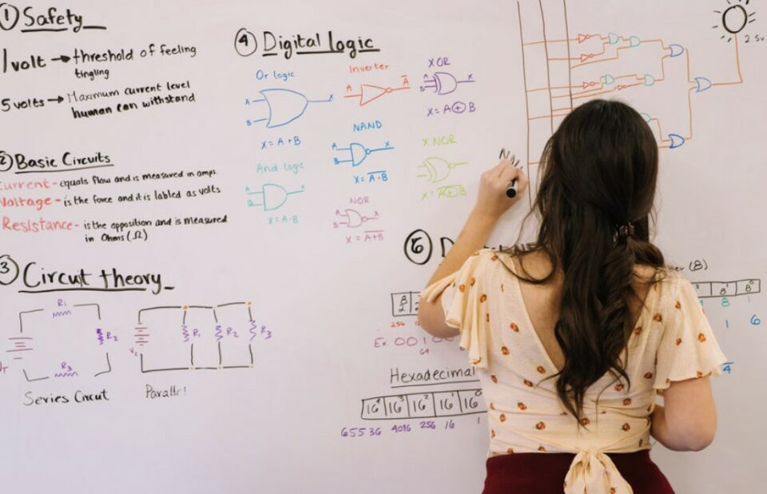
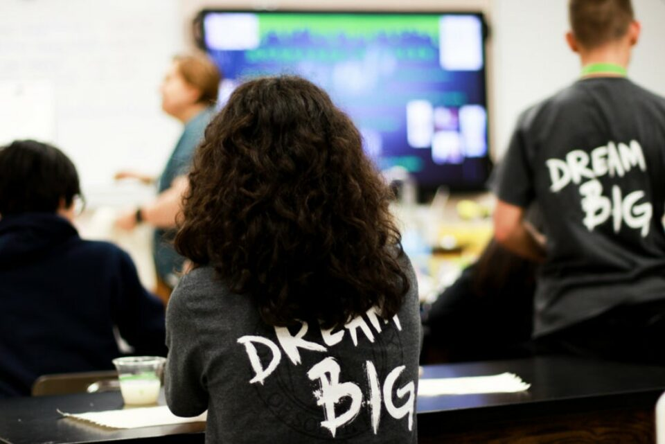
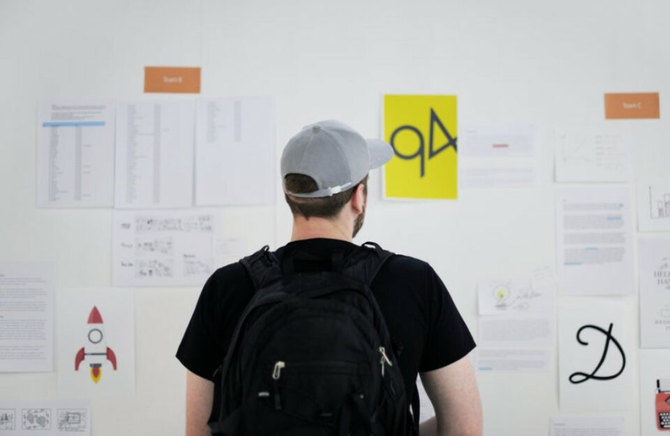
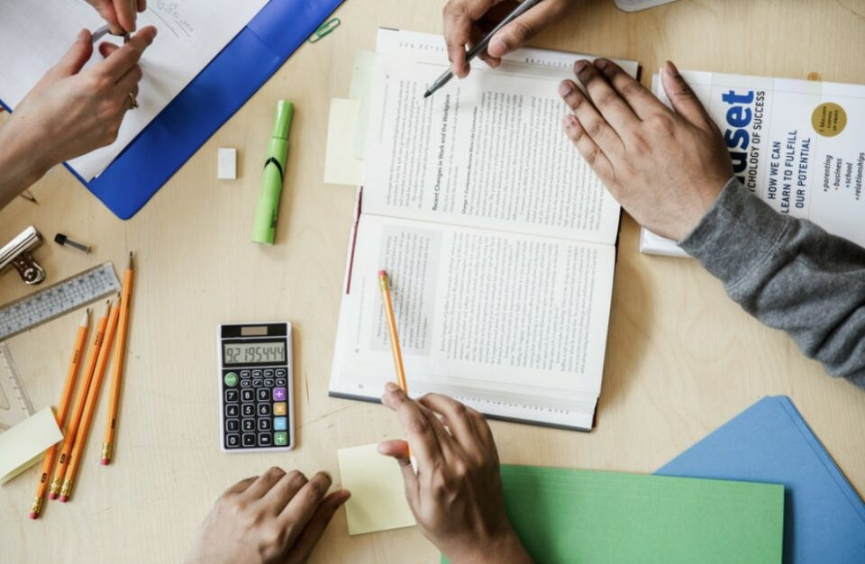

This article has been written and researched by our expert Loveable through a precise methodology. [Learn more about our methodology](https://avada.io/loveable/our-methodological.html)

[Loveable](https://avada.io/loveable/) > [Blog](https://avada.io/loveable/blog/) > [Family](https://avada.io/loveable/family/)

# Learning New Skill: 17 Tips and Strategies for Effective Learning

Written by [Rose Bryne](https://avada.io/loveable/author/rose/) Last Updated on August 22, 2023

- [Why Is Learning New Skills Important?](https://avada.io/loveable/blog/learning-new-skill/#wp-block-heading-2-5)
- [10 Steps for Learning New Skills Effectively](https://avada.io/loveable/blog/learning-new-skill/#wp-block-heading-2-15)
    - [Step 1: Set a “SMART” Objective](https://avada.io/loveable/blog/learning-new-skill/#wp-block-heading-3-16) 
    - [Step 2: Break It Down Into Small Skills](https://avada.io/loveable/blog/learning-new-skill/#wp-block-heading-3-19)
    - [Step 3: Identify Difficulties](https://avada.io/loveable/blog/learning-new-skill/#wp-block-heading-3-23)
    - [Step 4: Using the “80/20” rule](https://avada.io/loveable/blog/learning-new-skill/#wp-block-heading-3-26)
    - [Step 5: Focus on Only One Skill at a Time](https://avada.io/loveable/blog/learning-new-skill/#wp-block-heading-3-31) 
    - [Step 6: Focus on Personal Development](https://avada.io/loveable/blog/learning-new-skill/#wp-block-heading-3-33) 
    - [Step 7: Determine the Long-Term Goal](https://avada.io/loveable/blog/learning-new-skill/#wp-block-heading-3-36)
    - [Step 8: Looking for Opportunities to Practice](https://avada.io/loveable/blog/learning-new-skill/#wp-block-heading-3-39)
    - [Step 9: Find Out-Side Support](https://avada.io/loveable/blog/learning-new-skill/#wp-block-heading-3-43)
    - [Step 10: See Mistakes as an Opportunity to Improve](https://avada.io/loveable/blog/learning-new-skill/#wp-block-heading-3-46)
- [5 Reliable Tips When It Comes To Learning New Skills](https://avada.io/loveable/blog/learning-new-skill/#wp-block-heading-2-49)
    - [Teach What You Learn](https://avada.io/loveable/blog/learning-new-skill/#wp-block-heading-3-50)
    - [Takes a Break](https://avada.io/loveable/blog/learning-new-skill/#wp-block-heading-3-53)
    - [Be Curious](https://avada.io/loveable/blog/learning-new-skill/#wp-block-heading-3-57)
    - [Test Yourself](https://avada.io/loveable/blog/learning-new-skill/#wp-block-heading-3-59)
    - [Make It More Important for You](https://avada.io/loveable/blog/learning-new-skill/#wp-block-heading-3-62)
- [Bottom Line](https://avada.io/loveable/blog/learning-new-skill/#wp-block-heading-2-64) 

We all strive to improve ourselves in some way or another. Whether you’re trying to learn a new language, acquire a new hobby, or develop a new professional skill, the process of effective learning can seem overwhelming at times.

In addition, when we’ve identified an area for improvement – be it public speaking, social media proficiency, or data analysis – the question arises: where do we start? While the learning methods may differ based on the skill and individual, there are some overarching principles to adhere to. 

In this article, we’ve compiled 17 tips and strategies to help you **learn a new skill** effectively. From setting achievable goals to seeking feedback and staying motivated, these tips will guide you on your journey to becoming a master and confident learner. So, Join us as we uncover the key rules to follow for effective skill enhancement.

> “The only skill that will be important in the 21st century is the skill of learning new skills. Everything else will become obsolete over time.”
> 
> Peter Drucker

## Why Is Learning New Skills Important?

As an individual, mastering new skills can prove to be a game-changer for your career. By acquiring fresh knowledge and expertise, you can position yourself to undertake new projects and enhance your value in the job market. Not only for your career, but your personal life can be beneficial too. Here are some undeniable advantages of learning a new skill: 

- **Career advancement:** Acquiring new skills can help you qualify for higher-level positions and promotions within your current organization.
- **Increased marketability**: New skills and knowledge can make you more attractive to potential employers, expanding your job opportunities.
- **Personal growth**: Learning a new skill can help you develop as an individual, increasing your confidence and expanding your perspective.
- **Improved cognitive function**: Learning stimulates the brain and improves memory, concentration, and problem-solving abilities.
- **Keeping up with industry trends**: Learning new skills helps you stay up-to-date with advancements in your industry and remain competitive.
- **Creative outlet**: Learning a new skill can provide an enjoyable creative outlet, giving you an opportunity to express yourself and relieve stress.
- **Improved social connections**: Learning a new skill can connect you with like-minded individuals and provide networking opportunities.

## 10 Steps for Learning New Skills Effectively

### **Step 1: Set a “SMART” Objective** 

When it comes to learning new skills in a short amount of time, the key is to establish a clear objective. For example, if you aspire to improve your public speaking abilities, your objective may be to master the fundamental techniques for delivering a powerful speech. Defining your learning goal can serve as a solid foundation for determining the most effective strategies for acquiring new skills.  

As a side note, these goals need to be [SMART criteria](https://en.wikipedia.org/wiki/SMART_criteria) meaning that they’re both realistic and clear. You should also set a timebound and a specific place to learn this new skill.

### **Step 2: Break It Down Into Small Skills**

When it comes to skill learning, breaking down your skill set is a must-have step toward achieving success. By identifying and breaking down the larger skill into smaller sub-skills, you can create a roadmap for learning and development that will make the entire process more manageable.

For example, when you want to learn graphic design, you should break down the skill set into several smaller sub-skills, such as learning design software, color theory, layout design, typography, and image manipulation. This approach will help to focus on each sub-skill individually, ensuring that you will build a strong foundation before moving on to the next one.

### **Step 3: Identify Difficulties**

By anticipating challenges or obstacles that may arise during the learning process, you can prepare strategies to overcome them, stay motivated, and avoid frustration.

For example, when you decide to learn a new language, there may be potential barriers such as lack of motivation, time constraints, and difficulty retaining new vocabulary. After that, with each of the difficulties, you can prepare strategies to overcome those by setting a realistic study schedule, using language-learning apps, and practicing conversation with native speakers.

### **Step 4: Using the “80/20” rule**

The “80/20” rule is a helpful concept to keep in mind when acquiring new skills. It suggests that focusing on the most critical learning approaches can lead to achieving a significant portion of your learning goal. 

For instance, if your aim is to improve your communication skills, you can identify and master 20% of the essential communication sub-skills (such as improving tone, using professional vocabulary in written messages, or interpreting body language) to acquire 80% of your overall communication skills. 

**Learn more about the “80/20” rule at** [**Investopedia**](https://www.investopedia.com/terms/1/80-20-rule.asp).

### **Step 5: Focus on Only One Skill at a Time** 

After you have broken down the skill you want to learn, like in step 2, remember that when you start learning, you should only focus on one specific sub-skill, don’t try to learn it all at once if you don’t want to get crazy. Pick an important sub-skill to learn, then figure out specific tasks to do, and do everything in the right order.

### **Step 6: Focus on Personal Development** 

Prioritizing personal growth can help you overcome challenges when acquiring new skills. This involves dedicating time to practice and study the skill, as well as seeking out opportunities to advance your progress. When placing personal development at the forefront, you can enhance your learning experience and tackle any obstacles that arise. 

### **Step 7: Determine the Long-Term Goal**

Learning a new skill requires a strategic mindset, one that prioritizes long-term goals over short-term objectives. While short-term objectives provide a way to measure progress, setting your sights on long-term goals can unlock new ways of approaching challenges and sustain motivation in the face of obstacles. 

Tips: When it comes to long-term goals, you should think of them as your priority. Print a big [personalized poster](https://loveable.us/collections/canvas) with a motivational image and your goal on it, look at it every day, and stick it in your mind whenever you continue your learning process. 

### **Step 8: Looking for Opportunities to Practice**

Finding opportunities to practice is crucial to mastering a new skill. When you learn a language, you can look for opportunities to practice in everyday situations, such as incorporating new vocabulary words into your conversations or practicing your presentation skills during team meetings. Or, if you’re learning to play an instrument, you can look for open mic nights at local bars or join a group of musicians to practice together. 

Practicing regularly can help you refine your technique, and that’s the only way to success!

### **Step 9: Find Out-Side Support**

Think outside the box and search for tools that complement your learning style. For example, if you’re learning a new language, you could watch foreign movies or listen to podcasts to improve your pronunciation and vocabulary. 

You can join [online groups or forums](https://www.reddit.com/r/languagelearning/) to get advice from experienced practitioners and engage in practice sessions. By exploring additional resources, you’ll be able to overcome challenges and make steady progress toward your skill mastery.

### **Step 10: See Mistakes as an Opportunity to Improve**

When you are practicing a skill, making mistakes can actually help you learn. Even though you might make mistakes along the way, identifying what not to do the next time brings you closer to achieving your desired outcome.

## 5 Reliable Tips When It Comes To Learning New Skills

### **Teach What You Learn**

Learning new skills can be a challenging yet rewarding experience. As a person who has gone through the process of acquiring new skills, I have discovered that a way to solidify my understanding of a skill is by teaching it to others. 

When I teach someone else what I have learned, I am forced to articulate my thoughts clearly and in a way that the other person can understand. This process helps me to identify any gaps in my understanding of the skill, and it also reinforces what I have learned in my own mind.

### **Takes a Break**

When you’re in a state of focused mode, you can delve into the details of a problem and learn all its intricacies. However, when you switch to diffused mode, you can better grasp the bigger picture and connect all the pieces together. 

You may have experienced this phenomenon while taking a shower or doing a mindless activity, where your mind wanders freely, and suddenly, you recall a fact that was previously evading you, or the solution to a problem pops into your head.

### **Be Curious**

Instead of relying solely on a textbook to guide your learning, take control and lead the way. Look for answers from various sources and don’t just memorize theories and techniques, but question them every step of the way. Consider why they are important and relevant. Experiment with the tools and knowledge at your disposal. Who knows what you might uncover? You might even surprise yourself.

### **Test Yourself**

According to a study by [Elevate Education](https://us.elevateeducation.com/) that examined the study habits of high-achieving students, testing is a more effective method for retaining knowledge than re-reading notes. The study found that the most successful students spend their time practicing problem-solving and taking practice exams rather than simply reviewing their notes.

### **Make It More Important for You**

In our academic years, we were bestowed with an abundance of facts and figures to memorize. Yet, how much of that knowledge lingers within us to this day? Merely the bits that held personal significance, the pieces we could attach to our own existence and encounters. It is also true when you are learning a new skill. 

## Bottom Line 

**Learning a new skill** can be your lifetime opportunity. Following the tips and steps outlined in this article, you can improve your learning effectiveness and achieve your goals more efficiently. With dedication and persistence, you can acquire new skills and knowledge that will benefit you both personally and professionally. Keep learning, growing, and exploring new opportunities!

- [Why Is Learning New Skills Important?](https://avada.io/loveable/blog/learning-new-skill/#wp-block-heading-2-5)
- [10 Steps for Learning New Skills Effectively](https://avada.io/loveable/blog/learning-new-skill/#wp-block-heading-2-15)
    - [Step 1: Set a “SMART” Objective](https://avada.io/loveable/blog/learning-new-skill/#wp-block-heading-3-16) 
    - [Step 2: Break It Down Into Small Skills](https://avada.io/loveable/blog/learning-new-skill/#wp-block-heading-3-19)
    - [Step 3: Identify Difficulties](https://avada.io/loveable/blog/learning-new-skill/#wp-block-heading-3-23)
    - [Step 4: Using the “80/20” rule](https://avada.io/loveable/blog/learning-new-skill/#wp-block-heading-3-26)
    - [Step 5: Focus on Only One Skill at a Time](https://avada.io/loveable/blog/learning-new-skill/#wp-block-heading-3-31) 
    - [Step 6: Focus on Personal Development](https://avada.io/loveable/blog/learning-new-skill/#wp-block-heading-3-33) 
    - [Step 7: Determine the Long-Term Goal](https://avada.io/loveable/blog/learning-new-skill/#wp-block-heading-3-36)
    - [Step 8: Looking for Opportunities to Practice](https://avada.io/loveable/blog/learning-new-skill/#wp-block-heading-3-39)
    - [Step 9: Find Out-Side Support](https://avada.io/loveable/blog/learning-new-skill/#wp-block-heading-3-43)
    - [Step 10: See Mistakes as an Opportunity to Improve](https://avada.io/loveable/blog/learning-new-skill/#wp-block-heading-3-46)
- [5 Reliable Tips When It Comes To Learning New Skills](https://avada.io/loveable/blog/learning-new-skill/#wp-block-heading-2-49)
    - [Teach What You Learn](https://avada.io/loveable/blog/learning-new-skill/#wp-block-heading-3-50)
    - [Takes a Break](https://avada.io/loveable/blog/learning-new-skill/#wp-block-heading-3-53)
    - [Be Curious](https://avada.io/loveable/blog/learning-new-skill/#wp-block-heading-3-57)
    - [Test Yourself](https://avada.io/loveable/blog/learning-new-skill/#wp-block-heading-3-59)
    - [Make It More Important for You](https://avada.io/loveable/blog/learning-new-skill/#wp-block-heading-3-62)
- [Bottom Line](https://avada.io/loveable/blog/learning-new-skill/#wp-block-heading-2-64) 

### [Rose Bryne](https://avada.io/loveable/author/rose/)

Hi, I'm Rose! I love animals and spending time with kids. At Loveable, I help people find unique gifts for special occasions like Valentine's Day, housewarmings, and graduations. I enjoy finding gifts for kids, teens, and animal lovers that match their interests and personalities. Making gift-giving a pleasant experience is my priority. Let me assist you in finding the perfect gift!

- [Twitter](https://twitter.com/intent/tweet)
- [Facebook](https://www.facebook.com/sharer/sharer.php)
- [instagram](https://avada.io/loveable/blog/learning-new-skill/)
- [pinterest](https://www.pinterest.com/loveablellc/)

## Related Posts

[### 30 Best 4 Year Old Birthday Party Ideas For A Memorable Celebration](https://avada.io/loveable/blog/4-year-old-birthday-party-ideas/) 

[

### 16th Birthday Party Ideas to Make an Unforgettable Day

](https://avada.io/loveable/blog/16th-birthday-party-ideas/)

[

### 150+ Inspirational Birthday Quotes to Spread Joy on Special Day

](https://avada.io/loveable/blog/inspirational-birthday-quotes/)

[

### 160+ Birthday Wishes for Wife to Express Eternal Love

](https://avada.io/loveable/blog/birthday-wishes-for-wife/)

[### 90+ Heart Touching Birthday Wishes for Niece to Make Her Day Extra Special](https://avada.io/loveable/blog/birthday-wishes-for-niece/)
