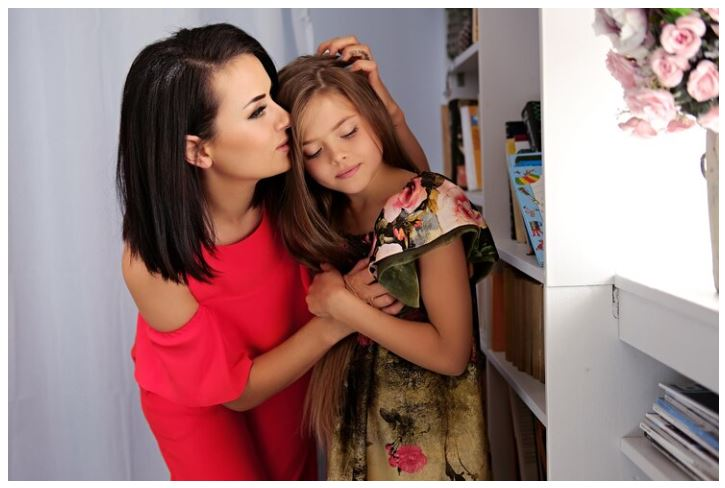
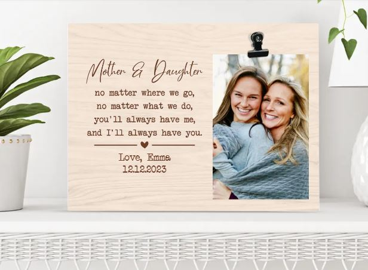
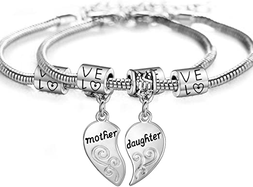
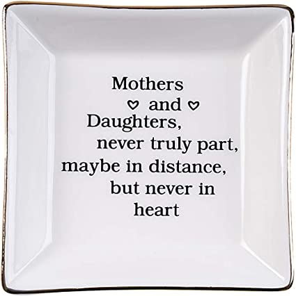
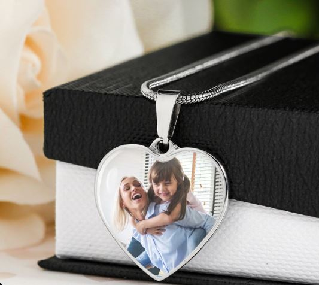
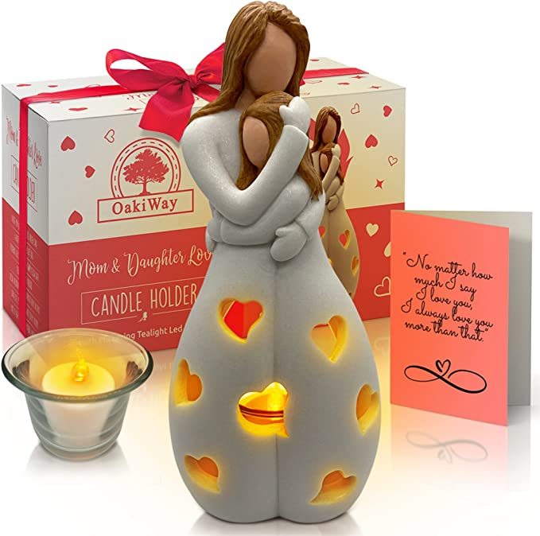
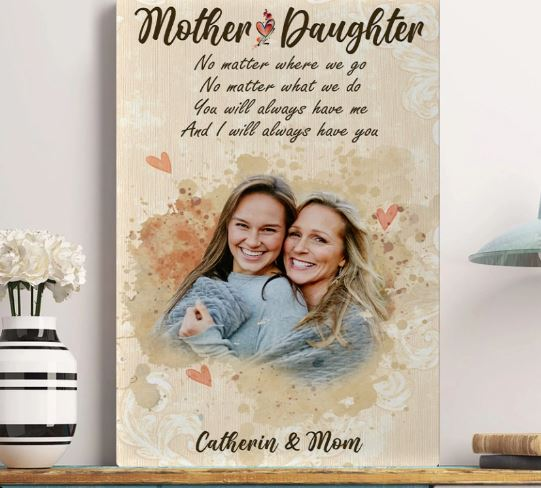

This article has been written and researched by our expert Loveable through a precise methodology. [Learn more about our methodology](https://avada.io/loveable/our-methodological.html)

[Loveable](https://avada.io/loveable/) > [Blog](https://avada.io/loveable/blog/) > [Family](https://avada.io/loveable/family/)

# Mother-Daughter Relationships: Everything You Need To Know

Written by [Rose Bryne](https://avada.io/loveable/author/rose/) Last Updated on August 25, 2023

- [Why Is A Mother Important In A Daughter’s Life?](https://avada.io/loveable/blog/mother-daughter-relationships/#wp-block-heading-2-4)
- [Why Are Some Mother-Daughter Relationships Difficult?](https://avada.io/loveable/blog/mother-daughter-relationships/#wp-block-heading-2-9)
    - [Emotional Dependence](https://avada.io/loveable/blog/mother-daughter-relationships/#wp-block-heading-3-11)
    - [Intervening Deeply In Daughter’s Decisions](https://avada.io/loveable/blog/mother-daughter-relationships/#wp-block-heading-3-15)
    - [Favoritism](https://avada.io/loveable/blog/mother-daughter-relationships/#wp-block-heading-3-18)
    - [Interfere Daughter In Choosing Partner](https://avada.io/loveable/blog/mother-daughter-relationships/#wp-block-heading-3-23)
    - [Emotionally disconnect](https://avada.io/loveable/blog/mother-daughter-relationships/#wp-block-heading-3-27)
    - [Trophy child](https://avada.io/loveable/blog/mother-daughter-relationships/#wp-block-heading-3-30)
    - [Too Indulgent](https://avada.io/loveable/blog/mother-daughter-relationships/#wp-block-heading-3-35)
- [7 Ways to Strengthen the Mother-Daughter Relationship](https://avada.io/loveable/blog/mother-daughter-relationships/#wp-block-heading-2-38)
    - [Express your feelings directly](https://avada.io/loveable/blog/mother-daughter-relationships/#wp-block-heading-3-40)
    - [Always by your daughter’s side](https://avada.io/loveable/blog/mother-daughter-relationships/#wp-block-heading-3-45)
    - [Efficiently Communicate](https://avada.io/loveable/blog/mother-daughter-relationships/#wp-block-heading-3-48)
    - [Realistic Expectations](https://avada.io/loveable/blog/mother-daughter-relationships/#wp-block-heading-3-52)
    - [20-Second Rule](https://avada.io/loveable/blog/mother-daughter-relationships/#wp-block-heading-3-55)
    - [Set Up Mother-Daughter Traditions](https://avada.io/loveable/blog/mother-daughter-relationships/#wp-block-heading-3-57)
    - [Accept The Downside](https://avada.io/loveable/blog/mother-daughter-relationships/#wp-block-heading-3-61) 
- [7 Best Gifts for Mothers That Strengthen Mother-Daughter Relationships](https://avada.io/loveable/blog/mother-daughter-relationships/#wp-block-heading-2-63)
    - [Personalized Photo Clip Frame](https://avada.io/loveable/blog/mother-daughter-relationships/#wp-block-heading-3-64)
    - [Matching Heart Mother Daughter Bracelets](https://avada.io/loveable/blog/mother-daughter-relationships/#wp-block-heading-3-68)
    - [3D Moon Lamp](https://avada.io/loveable/blog/mother-daughter-relationships/#wp-block-heading-3-72)
    - [Ring Dish Decorative Jewelry Tray](https://avada.io/loveable/blog/mother-daughter-relationships/#wp-block-heading-3-76)
    - [Personalized Heart Silver Necklace](https://avada.io/loveable/blog/mother-daughter-relationships/#wp-block-heading-3-80)
    - [Candle Holder Statue](https://avada.io/loveable/blog/mother-daughter-relationships/#wp-block-heading-3-84)
    - [Personalized Upload Photo Poster/Canvas](https://avada.io/loveable/blog/mother-daughter-relationships/#wp-block-heading-3-88)
- [Bottom Line](https://avada.io/loveable/blog/mother-daughter-relationships/#wp-block-heading-2-92) 

**Mother-daughter relationships** are one of the most complex and dynamic relationships out there. When a daughter is born, a unique connection starts to develop between her and her parents, especially her mother. As time passes, this bond grows stronger and becomes an [unbreakable bond](https://avada.io/loveable/unbreakable-bond-quotes/). 

However, as much as this bond can be incredibly nurturing and fulfilling, it can also be fraught with challenges, misunderstandings, and conflicts. That’s why in this article, we’ll be delving into everything you need to know about mother-daughter relationships. 

So, whether you’re looking to strengthen your bond with your mother or daughter or simply seeking some insights into this unique relationship, keep reading to discover all you need to know.

## **Why Is A Mother Important In A Daughter’s Life?**

A mother is the main caregiver who offers the necessary love, support, and direction for a child to flourish. From teaching life skills to offering emotional support, a mother is essential to a daughter’s life. A mother’s influence is far-reaching and long-lasting, as she impacts her daughter’s personality, values, and beliefs. 

A mother’s love is unconditional, and she is always there to celebrate her daughter’s triumphs and console her during her failures. A mom represents a role model for her daughter, and her actions shape her daughter’s perception of herself and the world around her. 

The presence in her daughter’s life helps her build a strong sense of self and confidence, which is crucial for success in all aspects of life. In short, a mother is important in a daughter’s life because she provides the foundation for her daughter’s growth and development, and her influence is felt for a lifetime.

## **Why Are Some Mother-Daughter Relationships Difficult?**

What are the common causes of conflict between mothers and daughters, and why is this relationship more challenging for some individuals?

### **Emotional Dependence**

In situations where a spouse is absent, some mothers may turn to their daughters for emotional or practical assistance. However, this heavy reliance on their daughters as a crutch or primary confidante can leave them feeling overwhelmed, uneasy, and burdened. 

In some cases, the mother may even unintentionally force her daughter into a caretaking role, which can create feelings of responsibility or cause the daughter to withdraw emotionally to avoid stress.

### **Intervening Deeply In Daughter’s Decisions**

As daughters grow into adulthood, some mothers may struggle with trusting their decisions and choices. This can lead to unintentional or intentional behaviors such as criticism, interference, or undermining. 

Such behavior may stem from the mother’s own insecurities and the desire to protect and rescue her daughter. While a parent’s actions may be motivated by love and concern, they can have a negative impact on their daughter. These actions can make the daughter feel disempowered and doubt her abilities, leading to frustration and anger.

### **Favoritism**

In dysfunctional families, siblings are assigned specific roles during childhood to manage issues such as drug or alcohol abuse. These roles, such as the Golden Child or Scapegoat, may persist into adulthood and can cause resentment and anger between siblings and also between mothers and daughters. It’s possible for adult daughters to only realize the imbalance later in life, which can lead to strained relationships with their mothers.

Historically, daughters were expected to follow in their mother’s footsteps, but this is no longer the case. Mothers may feel a sense of loss or anger when they see their daughters living different and more fulfilling lives. This can ultimately lead to sadness and tension in the mother-daughter relationships.

Today, women have more opportunities to work in professional roles, where they can express their opinions and contribute to society. As they balance their work and motherhood responsibilities, societal expectations of them are evolving. However, this shift in women’s roles may lead to conflict in the relationships between mothers and daughters.

### **Interfere Daughter In Choosing Partner**

At times, mothers may not approve of their daughter’s choice of a partner or spouse. However, it’s crucial to understand that mothers cannot dictate who their daughters should love or select as their life partners. 

This may stem from a fear of losing their daughter or being left behind. It could also stem from jealousy in some cases. It’s essential to respect your daughter’s adult choices and decisions.

### Emotionally disconnect

When daughters experience emotional disturbances, they typically turn to their mothers for support. However, if the mother is unavailable, the daughter may experience feelings of loneliness or seek comfort from another family member, such as a grandparent, father, uncle, or aunt. 

When a mother distances herself from her daughter, it can lead to a breakdown in their relationship and cause emotional scars. This type of mother-daughter dynamic is often referred to as dysfunctional. Additionally, some relationships may lack physical and emotional connection, resulting in a ghost relationship.

### **Trophy child**

When it comes to this type of dynamic, the mother tends to utilize her daughter solely to flaunt her own positive attributes and accomplishments without taking into account her daughter’s individual preferences and tastes. 

This often results in the daughter feeling discontented, as her mother’s agenda takes precedence over her own desires and needs, leaving her feeling as though her life is being utilized solely for the purpose of garnering attention from others.

Sometimes, in mother-daughter relationships, the mother may resort to different forms of communication, like physical aggression or verbal insults. On the other hand, the daughter may yearn for her mother’s affection and support despite her mother’s unrealistic expectations. When such a dynamic exists between a mother and her daughter, it is a completely unhealthy and toxic relationship.

### **Too Indulgent**

A popular type of bond between mothers and daughters is referred to as an enmeshed relationship. This relationship is identified by a strong and affectionate bond, where the mother frequently considers her daughter as her most trusted confidante. The two share many common interests, feelings, and other aspects of their lives.

When adopting such a parenting style, the mother may unintentionally neglect the important task of instilling the concept of healthy boundaries in her daughter. This could ultimately hinder the daughter’s growth and her ability to form meaningful relationships and pursue her interests.

## **7 Ways to Strengthen the Mother-Daughter Relationship**

The following suggestions can assist you in enhancing the relationship between you and your daughter. It is important to consider these options to cultivate a stronger bond.

### **Express your feelings directly**

It is important to express your love and affection openly to your daughter. Expressing your admiration and appreciation is important when she achieves something commendable. This will strengthen your bond with her and show her how much you care. 

You can nurture your mother-daughter relationships further by sharing hugs, cuddles, and kisses. For instance, you can make cuddling a part of your bedtime routine. These displays of physical affection can help your daughter learn to express and receive love comfortably.

**_Related_**: [Mother’s Day Quotes From Daughter](https://avada.io/loveable/mothers-day-quotes-from-daughter/)

### **Always by your daughter’s side**

As your daughter enters adolescence, she may encounter challenges as she navigates the physical and emotional changes that come with this phase of life. It’s important to be there for her, providing guidance and support while also listening to her concerns. 

It’s important to avoid being too commanding, as this can lead to rebellion. Instead, try to channel her stress or anger in a positive direction by truly hearing her out and finding ways to help her cope.

### **Efficiently Communicate**

Engage your daughter in conversations about a range of global topics. You could take advantage of shopping trips or cooking meals together to share valuable insights. During her teenage years, she may struggle with body insecurity, so it’s important to encourage her to accept and feel proud of her body. 

Discuss relationships and important character traits such as faith, integrity, perseverance, and courage. Let her know that these values will be crucial to her success in life. Share your life experiences and wisdom with her to empower and prepare her for the future.

### **Realistic Expectations**

As parents, it’s natural to have expectations for your children, but it’s essential to be reasonable and considerate. Remember that your daughter is a unique individual with her own aspirations and goals. Provide her the space, support, and love to flourish and grow. 

A mother plays a crucial role in educating her daughter about the world and how to interact with different people. A mother serves as her daughter’s first friend and lifelong guide. If you have a daughter, being there for her and supporting her throughout her life’s journey is crucial.

### **20-Second Rule**

When facing a conflict, share your viewpoint within 20 seconds and then give the other party a chance to express their experience within the same timeframe. This approach helps you remain focused on the issue and avoid veering off-topic. It’s an effective way to engage in conflict resolution.

### **Set Up Mother-Daughter Traditions**

These are the moments that strengthen your bond. It’s important to commit to preserving your shared rituals every year. These traditions could be as simple as taking leisurely strolls, dining at a beloved eatery, indulging in a joint manicure, embarking on an annual trip, or going out for lunch and shopping together. 

Whatever you choose to do and enjoy as a pair can become a cherished tradition. Anticipating these occasions will bring you both great joy.

### **Accept The Downside** 

It’s important for mothers and daughters to emphasize the good things about their bond and put effort into nurturing it. Let’s make sure we invest our time and energy into strengthening this special relationship.

## **7 Best Gifts for Mothers That Strengthen Mother-Daughter Relationships**

### **[Personalized Photo Clip Frame](https://loveable.ai/products/no-matter-where-we-go-no-matter-what-we-do-personalized-photo-clip-frame-best-gift-for-mom-daughter-mother-in-law-daughter-in-law-303ihpnppt329)**

If you’re searching for a unique present for your cherished mother or daughter, or just want to indulge yourself with a delightful treat, then frames are an excellent option to consider. We’re more than happy to customize and personalize each frame to your exact specifications, so you can be sure you’re getting a truly unique piece.

Each and every frame is handmade with love and care, ensuring that the special moments in your mother-daughter relationships are displayed in the best possible way. 

### **[Matching Heart Mother Daughter Bracelets](https://www.amazon.com/Matching-Mother-Daughter-Bracelets-Jewelry/dp/B06XDMNCSS)**

These stunning bracelets are designed to symbolize special mother-daughter relationships and are the perfect way to show off your love and affection for one another.

Crafted from high-quality materials, these awesome bracelets are perfect for wearing on your wrist, and feature a beautiful matching heart design that is sure to turn heads wherever you go. With one bracelet for mom and one for daughter, you’ll always have a reminder of the special bond you share, whether you’re together or apart.

### **[3D Moon Lamp](https://loveable.ai/products/mother-and-daughter-not-always-eye-to-eye-but-always-heart-to-heart-message-from-daughter-to-mom-3d-moon-lamp-night-light-mothers-day-gift-gift-for-mommy-on-special-day-birthday-gift-for-mom-303icnlnll287)**

Crafted from high-quality PLA using professional 3D printing technology, this stunning lamp is sure to light up any room with its ethereal glow. And best of all, it won’t fade or scratch, ensuring it will remain a cherished family heirloom for years.

Our 3D Moon Lamp is ideal if you want to express your affection to your mom or daughter or commemorate a remarkable event.

### **[Ring Dish Decorative Jewelry Tray](https://www.amazon.com/Ueerdand-Ceramic-Decorative-Trinket-Daughters/dp/B07Q3CX1GX/)**

This tray is the ideal decorative piece for any home or office made from premium-quality ceramic. It’s the perfect choice for a daughter’s birthday gift, a girl’s graduation gift from mom, or even just a special surprise to show your appreciation.

With its sleek design and well-packed styrofoam and white box, this Ceramic Ring Dish is a true standout when it comes to both style and presentation.

### **[Personalized Heart Silver Necklace](https://loveable.ai/products/custom-photo-personalized-heart-silver-necklace-graphic-keychain-best-gift-for-family-mom-dad-children-302ihpvsje247)**

Crafted with high-quality surgical steel and a shatterproof liquid glass coating, this necklace is as durable as it is beautiful. Plus, with the option to choose an 18K gold finish, it’s sure to match any style. 

This Personalized Heart Silver Necklace is the best gift for family and friends alike. It’s a thoughtful and unique way to show how much you care about your relationships. 

### **[Candle Holder Statue](https://www.amazon.com/OakiWay-Gifts-Mom-Daughter-Grandmother/dp/B096PKF9B1/)**

If you want to convey your affection more impactfully, consider gifting this unique candle holder figurine, an exceptional way to express love and attachment. This gift is extremely special and will hold great significance for any mother or daughter, as it conveys emotions that cannot be expressed through mere words. 

The artificial light shines through the heart-shaped holes in the dresses of the Mom and Daughter figures, creating a beautiful and tranquil atmosphere.

### **[Personalized Upload Photo Poster/Canvas](https://loveable.ai/products/mother-and-daughter-no-matter-where-we-go-personalized-upload-photo-postercanvas-best-gift-for-mom-and-daughter-for-her-anniversary-211icnvsca257)**

Made from high-quality 10 mils, 260 gsm resin-coated poster paper, this poster or canvas is perfect for displaying your favorite photos in stunning clarity and detail.

Hang it up with tape or tacks, or attach it with clamps – whatever your preference, this poster or canvas is sure to make a statement in any room. And with its impressive longevity, you can enjoy your personalized artwork for years to come – up to 200 years in full color and 400 years in black and white!

## **Bottom Line** 

The **mother-daughter relationships** are important not only because they influence each other’s lives but also because they can serve as a model for other relationships. Women who grow up in supportive, healthy families with mothers who love and provide for them are more likely to feel confident and successful as adults. 

They are also more likely to have better relationships with men, find success in their careers, and have a closer connection with their children. The relationship between women who grow up in similar households can provide a good example for girls and women who feel they need more love and support from their parents.

- [Why Is A Mother Important In A Daughter’s Life?](https://avada.io/loveable/blog/mother-daughter-relationships/#wp-block-heading-2-4)
- [Why Are Some Mother-Daughter Relationships Difficult?](https://avada.io/loveable/blog/mother-daughter-relationships/#wp-block-heading-2-9)
    - [Emotional Dependence](https://avada.io/loveable/blog/mother-daughter-relationships/#wp-block-heading-3-11)
    - [Intervening Deeply In Daughter’s Decisions](https://avada.io/loveable/blog/mother-daughter-relationships/#wp-block-heading-3-15)
    - [Favoritism](https://avada.io/loveable/blog/mother-daughter-relationships/#wp-block-heading-3-18)
    - [Interfere Daughter In Choosing Partner](https://avada.io/loveable/blog/mother-daughter-relationships/#wp-block-heading-3-23)
    - [Emotionally disconnect](https://avada.io/loveable/blog/mother-daughter-relationships/#wp-block-heading-3-27)
    - [Trophy child](https://avada.io/loveable/blog/mother-daughter-relationships/#wp-block-heading-3-30)
    - [Too Indulgent](https://avada.io/loveable/blog/mother-daughter-relationships/#wp-block-heading-3-35)
- [7 Ways to Strengthen the Mother-Daughter Relationship](https://avada.io/loveable/blog/mother-daughter-relationships/#wp-block-heading-2-38)
    - [Express your feelings directly](https://avada.io/loveable/blog/mother-daughter-relationships/#wp-block-heading-3-40)
    - [Always by your daughter’s side](https://avada.io/loveable/blog/mother-daughter-relationships/#wp-block-heading-3-45)
    - [Efficiently Communicate](https://avada.io/loveable/blog/mother-daughter-relationships/#wp-block-heading-3-48)
    - [Realistic Expectations](https://avada.io/loveable/blog/mother-daughter-relationships/#wp-block-heading-3-52)
    - [20-Second Rule](https://avada.io/loveable/blog/mother-daughter-relationships/#wp-block-heading-3-55)
    - [Set Up Mother-Daughter Traditions](https://avada.io/loveable/blog/mother-daughter-relationships/#wp-block-heading-3-57)
    - [Accept The Downside](https://avada.io/loveable/blog/mother-daughter-relationships/#wp-block-heading-3-61) 
- [7 Best Gifts for Mothers That Strengthen Mother-Daughter Relationships](https://avada.io/loveable/blog/mother-daughter-relationships/#wp-block-heading-2-63)
    - [Personalized Photo Clip Frame](https://avada.io/loveable/blog/mother-daughter-relationships/#wp-block-heading-3-64)
    - [Matching Heart Mother Daughter Bracelets](https://avada.io/loveable/blog/mother-daughter-relationships/#wp-block-heading-3-68)
    - [3D Moon Lamp](https://avada.io/loveable/blog/mother-daughter-relationships/#wp-block-heading-3-72)
    - [Ring Dish Decorative Jewelry Tray](https://avada.io/loveable/blog/mother-daughter-relationships/#wp-block-heading-3-76)
    - [Personalized Heart Silver Necklace](https://avada.io/loveable/blog/mother-daughter-relationships/#wp-block-heading-3-80)
    - [Candle Holder Statue](https://avada.io/loveable/blog/mother-daughter-relationships/#wp-block-heading-3-84)
    - [Personalized Upload Photo Poster/Canvas](https://avada.io/loveable/blog/mother-daughter-relationships/#wp-block-heading-3-88)
- [Bottom Line](https://avada.io/loveable/blog/mother-daughter-relationships/#wp-block-heading-2-92) 

### [Rose Bryne](https://avada.io/loveable/author/rose/)

Hi, I'm Rose! I love animals and spending time with kids. At Loveable, I help people find unique gifts for special occasions like Valentine's Day, housewarmings, and graduations. I enjoy finding gifts for kids, teens, and animal lovers that match their interests and personalities. Making gift-giving a pleasant experience is my priority. Let me assist you in finding the perfect gift!

- [Twitter](https://twitter.com/intent/tweet)
- [Facebook](https://www.facebook.com/sharer/sharer.php)
- [instagram](https://avada.io/loveable/blog/mother-daughter-relationships/)
- [pinterest](https://www.pinterest.com/loveablellc/)

## Related Posts

[### 30 Best 4 Year Old Birthday Party Ideas For A Memorable Celebration](https://avada.io/loveable/blog/4-year-old-birthday-party-ideas/) 

[

### 16th Birthday Party Ideas to Make an Unforgettable Day

](https://avada.io/loveable/blog/16th-birthday-party-ideas/)

[

### 150+ Inspirational Birthday Quotes to Spread Joy on Special Day

](https://avada.io/loveable/blog/inspirational-birthday-quotes/)

[

### 160+ Birthday Wishes for Wife to Express Eternal Love

](https://avada.io/loveable/blog/birthday-wishes-for-wife/)

[### 90+ Heart Touching Birthday Wishes for Niece to Make Her Day Extra Special](https://avada.io/loveable/blog/birthday-wishes-for-niece/)
