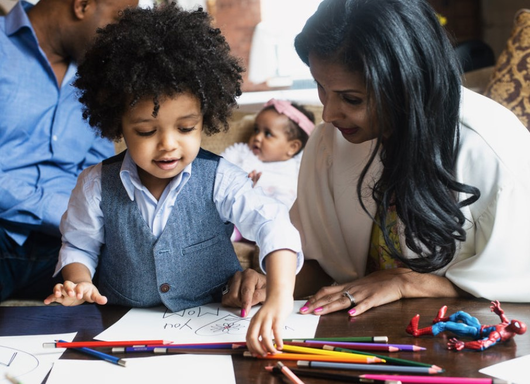
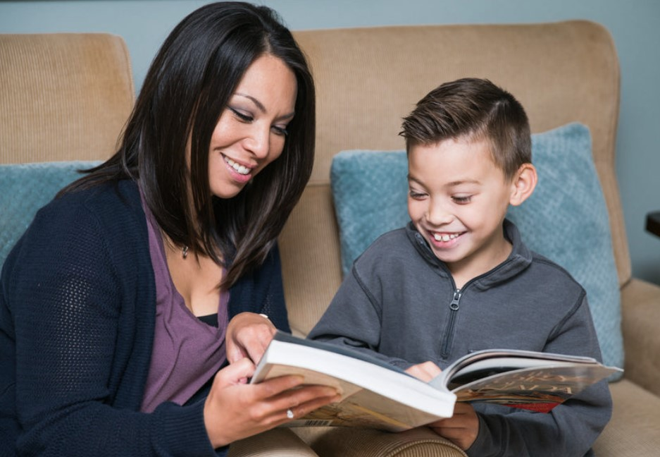
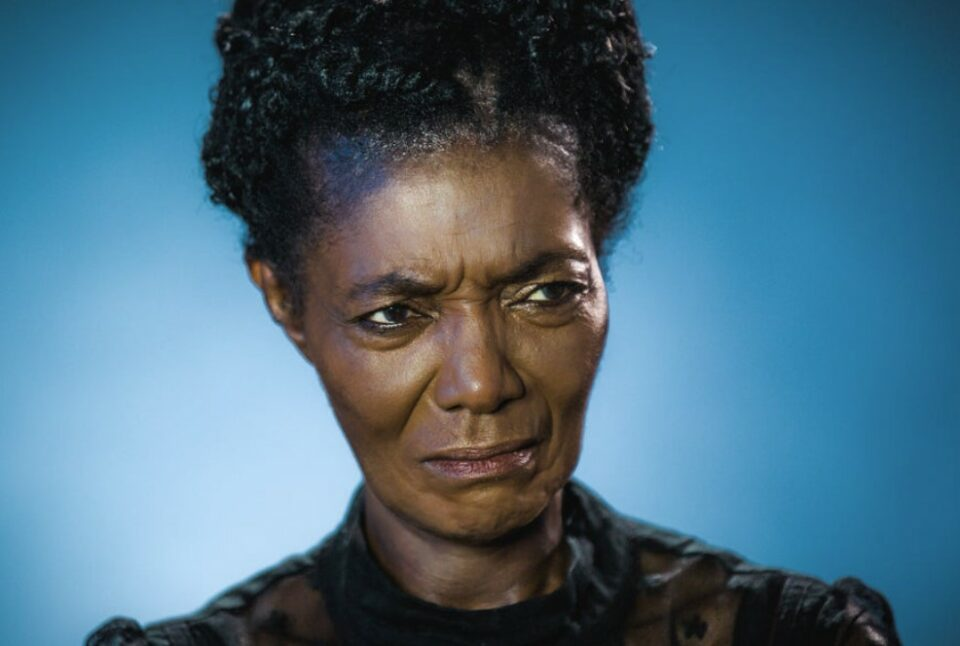
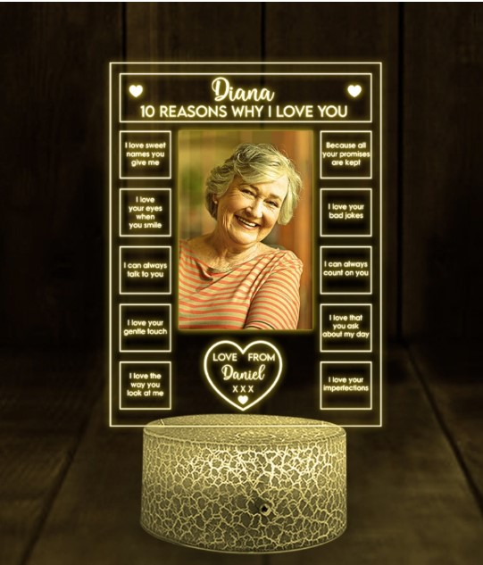
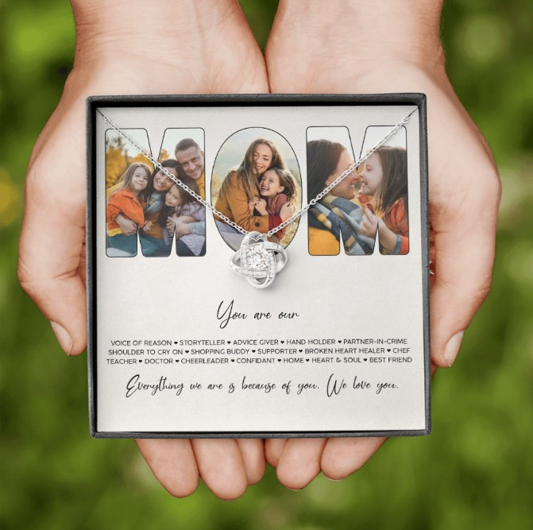
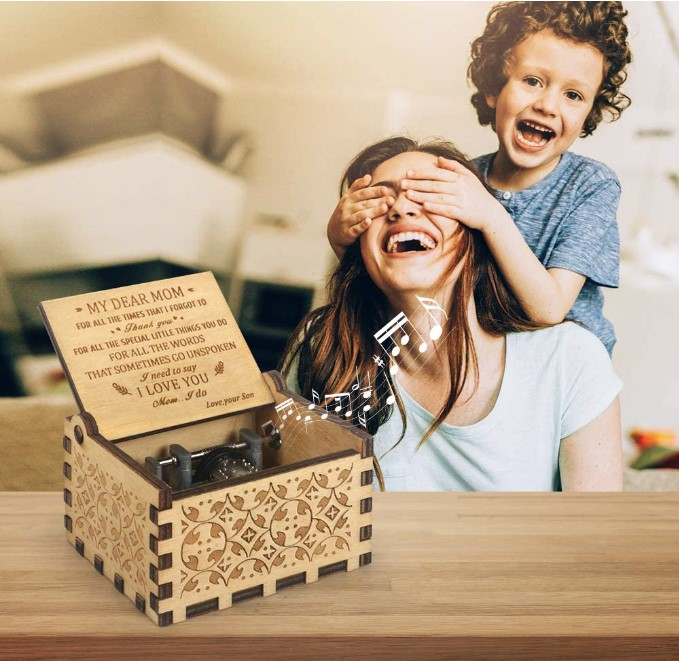
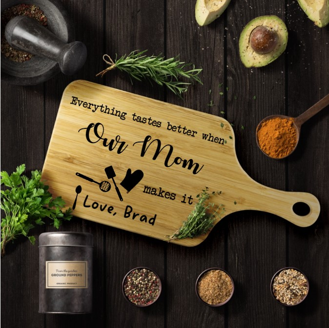
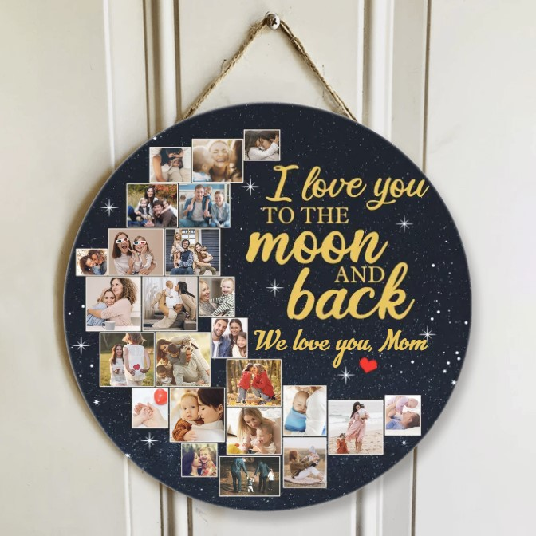
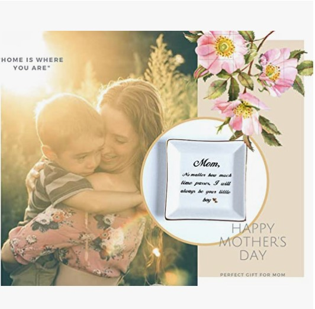

This article has been written and researched by our expert Loveable through a precise methodology. [Learn more about our methodology](https://avada.io/loveable/our-methodological.html)

[Loveable](https://avada.io/loveable/) > [Blog](https://avada.io/loveable/blog/) > [Family](https://avada.io/loveable/family/)

# Mother-Son Relationships: The Complex and Enduring Bond

Written by [Rose Bryne](https://avada.io/loveable/author/rose/) Last Updated on August 21, 2023

- [Why is a mother-son relationship so strong?](https://avada.io/loveable/blog/mother-son-relationships/#wp-block-heading-2-5)
    - [1\. Mother Is Always A Source Of Encouragement And Comfort For Her Son](https://avada.io/loveable/blog/mother-son-relationships/#wp-block-heading-3-7) 
    - [2\. Mother Is The Teacher Who Will Follow Son For The Rest Of His Life](https://avada.io/loveable/blog/mother-son-relationships/#wp-block-heading-3-10)
    - [3\. Mom Is A Great Communicator To Their Son](https://avada.io/loveable/blog/mother-son-relationships/#wp-block-heading-3-12) 
    - [4\. A Mother Is Someone Who Is Willing To Sacrifice Everything For Her Son](https://avada.io/loveable/blog/mother-son-relationships/#wp-block-heading-3-15)
    - [5\. Mom Teaches Her Son How To Respect Women](https://avada.io/loveable/blog/mother-son-relationships/#wp-block-heading-3-17) 
- [Mother-Son Relationship Evolution](https://avada.io/loveable/blog/mother-son-relationships/#wp-block-heading-2-19)
- [Toxic Mother-Son Relationship](https://avada.io/loveable/blog/mother-son-relationships/#wp-block-heading-2-26)
    - [Meddling](https://avada.io/loveable/blog/mother-son-relationships/#wp-block-heading-3-33) 
    - [Abuse](https://avada.io/loveable/blog/mother-son-relationships/#wp-block-heading-3-35)
    - [Blaming](https://avada.io/loveable/blog/mother-son-relationships/#wp-block-heading-3-37)
    - [Exploitation](https://avada.io/loveable/blog/mother-son-relationships/#wp-block-heading-3-40)
    - [She doesn’t respect your privacy](https://avada.io/loveable/blog/mother-son-relationships/#wp-block-heading-3-42)
- [How to Improve a Mother-Son Relationship?](https://avada.io/loveable/blog/mother-son-relationships/#wp-block-heading-2-44)
    - [7 Things Moms Can Do To Make The Mother-Son Relationship Better](https://avada.io/loveable/blog/mother-son-relationships/#wp-block-heading-3-45)
    - [1\. Keep in mind that boys have different tastes.](https://avada.io/loveable/blog/mother-son-relationships/#wp-block-heading-3-46)
    - [2\. Always Listening](https://avada.io/loveable/blog/mother-son-relationships/#wp-block-heading-3-49)
    - [3\. Share Your Interest](https://avada.io/loveable/blog/mother-son-relationships/#wp-block-heading-3-51)
    - [4\. Apologize](https://avada.io/loveable/blog/mother-son-relationships/#wp-block-heading-3-53)
    - [5\. Teach Your Son How To Be A Good Man](https://avada.io/loveable/blog/mother-son-relationships/#wp-block-heading-3-56) 
    - [6\. Respect His Space](https://avada.io/loveable/blog/mother-son-relationships/#wp-block-heading-3-58) 
    - [7\. Cooking at home more often](https://avada.io/loveable/blog/mother-son-relationships/#wp-block-heading-3-60)
    - [10 Things Sons Can Do To Make The Mother-Son Relationship Better](https://avada.io/loveable/blog/mother-son-relationships/#wp-block-heading-3-63) 
    - [1\. Talk To Her More Often](https://avada.io/loveable/blog/mother-son-relationships/#wp-block-heading-3-64) 
    - [2\. Always appreciate what mother does](https://avada.io/loveable/blog/mother-son-relationships/#wp-block-heading-3-67)
    - [3\. Don’t Be Too Dependent](https://avada.io/loveable/blog/mother-son-relationships/#wp-block-heading-3-69)
    - [4\. “Thanks Mom”](https://avada.io/loveable/blog/mother-son-relationships/#wp-block-heading-3-71)
    - [5\. Introduce her to your friends.](https://avada.io/loveable/blog/mother-son-relationships/#wp-block-heading-3-74)
    - [6\. Actively Reconcile After Every Argue](https://avada.io/loveable/blog/mother-son-relationships/#wp-block-heading-3-76) 
    - [7\. Don’t Ever Forget Mom Special Days](https://avada.io/loveable/blog/mother-son-relationships/#wp-block-heading-3-78)
    - [8\. Realistic Expectations.](https://avada.io/loveable/blog/mother-son-relationships/#wp-block-heading-3-81) 
    - [9\. Do Your Best To Understand Her](https://avada.io/loveable/blog/mother-son-relationships/#wp-block-heading-3-84)
    - [10\. Make An Effort](https://avada.io/loveable/blog/mother-son-relationships/#wp-block-heading-3-86) 
- [Famous Quotes For Mother Son Relationship](https://avada.io/loveable/blog/mother-son-relationships/#wp-block-heading-2-89)
- [7 Best Gifts for Mother To Strengthen Mother-Son Relationship](https://avada.io/loveable/blog/mother-son-relationships/#wp-block-heading-2-100)
    - [1\. Personalized Led Light For Mom](https://avada.io/loveable/blog/mother-son-relationships/#wp-block-heading-3-103)
    - [2\. Shoulder and Neck Massager For Mother](https://avada.io/loveable/blog/mother-son-relationships/#wp-block-heading-3-106) 
    - [3\. Beautiful Message for Mom Necklace From son](https://avada.io/loveable/blog/mother-son-relationships/#wp-block-heading-3-110) 
    - [4\. Music Box for Mother From Son](https://avada.io/loveable/blog/mother-son-relationships/#wp-block-heading-3-113) 
    - [5\. For Best Mom Wooden Board](https://avada.io/loveable/blog/mother-son-relationships/#wp-block-heading-3-117) 
    - [6\. Beautiful Wooden Signs for Mom](https://avada.io/loveable/blog/mother-son-relationships/#wp-block-heading-3-121) 
    - [7\. Ceramic Ring Dish for Mom](https://avada.io/loveable/blog/mother-son-relationships/#wp-block-heading-3-124)
- [Final Thoughts](https://avada.io/loveable/blog/mother-son-relationships/#wp-block-heading-2-127)
    -   

People often say that guys are mama’s boys, but where does the word come from? Why do people say that? Is it a negative word, or it shows a special bond of creation: Mother and son?

The relationship between a woman and her son is a unique and complex bond that has been studied and analyzed by psychologists, sociologists, and anthropologists for decades. From birth, the mother-son relationship begins to form and can evolve over time, influenced by various factors such as personality, culture, and life experiences. 

This enduring bond is shaped by a range of emotions, including love, affection, trust, and sometimes conflict, which can affect the son’s development and life trajectory. Understanding the intricacies of the **mother-son relationship** can provide insight into the roles that mothers play in shaping their sons’ identities and the impact this bond can have on their lives.

**Read More:** [Mother-Daughter Relationships: Everything You Need To Know](https://avada.io/loveable/mother-daughter-relationships/)

## Why is a mother-son relationship so strong?

While relatives, friends, and other [family members](https://avada.io/loveable/relationships-with-family-members/) may be able to differentiate between two siblings, a mother never will. To her, all of her children are equal, and she strives to love and nurture each one of them equally. She distributes her anger and affection equally among them. However, there is a common belief that daughters tend to be closer to their fathers while sons are more likely to be closer to their mothers. And here is five reasons why a mother-son relationship is so strong.

### 1\. Mother Is Always A Source Of Encouragement And Comfort For Her Son 

Mothers explain to their sons that it is natural to experience overwhelming emotions at times, and they guide their sons in developing strategies to cope with these negative feelings. Men who share a strong bond with their mothers are aware that they can always reach out to her for support. Whether or not she can offer a solution, a mother’s active listening, and encouragement can instill in her son the confidence to face whatever challenges may arise.

### 2\. Mother Is The Teacher Who Will Follow Son For The Rest Of His Life

Mothers not only provide emotional nurturing to their children, but they also oversee their academic tasks, playtime, and other responsibilities. Studies show that boys who share a strong bond with their mothers tend to perform better in school, largely due to the emotional intelligence that mothers cultivate in their sons. Mothers teach their sons to be expressive, empathetic, and attuned to their surroundings and the emotions of those around them. This [emotional intelligence](https://avada.io/loveable/engaging-educational-activities/) can enhance their communication skills, which in turn, can bolster their reading and writing abilities, paving the way for greater success in life.

### 3\. Mom Is A Great Communicator To Their Son 

Females are typically known for their expressive, caring, and sensitive nature toward the emotions of others. They value open expression and do not become annoyed by it. Their ability to express their own emotions and build trust with others makes them excellent communicators. Mothers particularly encourage their sons to be expressive and are often quite patient in their interactions with them. In comparison to [fathers](https://avada.io/loveable/father-son-relationship/), mothers are generally soft-spoken and skilled listeners.

### 4\. A Mother Is Someone Who Is Willing To Sacrifice Everything For Her Son

A mother’s love for her son has no bounds, and she is willing to make any sacrifice necessary for his well-being. She puts her son’s needs before her own, whether it be sacrificing her time, career, or personal aspirations to ensure that he receives the best possible care and guidance. A mother’s love is unconditional, and she stands by her son through thick and thin, offering unwavering support and encouragement. For a mother, seeing her son happy and successful is the ultimate reward, and she will stop at nothing to make that a reality.

### 5\. Mom Teaches Her Son How To Respect Women 

Mothers is very important in shaping their sons’ attitudes towards women and instilling in them a sense of respect for the opposite gender. They teach their sons to treat all women with dignity and kindness, emphasizing the importance of consent and boundaries. Mothers model respectful behavior towards their partners and other women, teaching their sons through their actions as well as their words. By imparting these values early on, mothers equip their sons with the tools to form healthy relationships with women, paving the way for positive social interactions and a brighter future for all.

## Mother-Son Relationship Evolution

The mother-son relationship is a complex and dynamic bond that evolves over time. In the early years, a mother is her son’s primary caregiver, providing him with nurturing and protection. As he grows, their relationship changes, with the mother becoming more of a guide and mentor to her son. She encourages him to explore the world around him and supports him in his pursuit of independence.

As a son enters adolescence and young adulthood, his relationship with his mother may become more complicated. He may assert his independence and push back against his mother’s guidance. However, a [mother’s love](https://avada.io/loveable/birthday-quotes-for-mom/) and support remain a constant throughout this period of transition as she continues to provide emotional support and guidance to her son.

As a son matures into adulthood, his relationship with his mother can take on new dimensions. He may develop a deeper appreciation for the sacrifices she made for him and seek her guidance and support in his own life. He may become a caregiver to his mother as she ages, taking on the role of protector and nurturer in return.

Throughout all stages of life, the mother-son relationship continues to evolve and change. Still, the enduring bond between a mother and her son remains a powerful force that shapes the trajectory of their lives.

**_Check Out_**: [14 Mother’s Day Activities You Should Do With Your Mom](https://avada.io/loveable/mothers-day-activities/)

## Toxic Mother-Son Relationship

A toxic mother-son relationship is a dysfunctional relationship between a mother and her son, characterized by emotional manipulation, control, abuse, and unhealthy patterns of communication. This type of relationship can have a lasting impact on the son’s emotional and mental health and can affect his relationships and self-esteem.

In a toxic mother-son relationship, the mother may use guilt, fear, or other forms of emotional manipulation to control her son’s behavior, often to meet her needs or fulfill her expectations. The son may feel trapped, powerless, or unable to escape the relationship.

The son may also experience emotional or physical abuse, such as verbal insults, physical punishment, or neglect. The mother may also belittle or criticize the son, making him feel inadequate or unworthy.

In addition, the mother may try to control the son’s relationships with others, including friends, romantic partners, and family members. This can lead to isolation, loneliness, and difficulty forming healthy relationships.

Here are some popular signs of a toxic mother-son relationship

### Meddling 

When a mother interferes with her son’s choice of spouse and continues to meddle in their marriage, it clearly indicates a toxic mother-son relationship. This interference can result in marital problems and, in some cases, irreparable damage to the relationship between the son and his wife.

### Abuse

Insecure mothers often exhibit verbally and physically abusive behavior, which can manifest in various forms, such as giving silent treatment, name-calling, making unfavorable comparisons, intentionally using hurtful words, and meting out punishments for minor mistakes. These behaviors are clear indications of an unhealthy and toxic relationship.

### Blaming

It is common for toxic parents to shift blame onto their children for their own problems. For instance, if a parent is consistently upset about the state of an untidy house, they are likely to hold their child responsible for the mess, irrespective of whether the child was involved in creating it.

### Exploitation

Toxic parents have high expectations of their children but fail to reciprocate with similar efforts. For instance, they may expect their child to overlook their own negative behavior while simultaneously refusing to extend the same courtesy towards the child.

### She doesn’t respect your privacy

A failure to respect boundaries is a prominent trait observed in toxic mothers. If you have attempted to establish limits in your relationship with her, but they were disregarded, it clearly indicates this behavior. For instance, you may have requested her to respect your privacy, only to find out later that she had read your journal or invaded your social media. In such situations, you are likely to feel violated and powerless. It may even lead to a belief that others will follow suit and not respect your boundaries, similar to your mother.

## How to Improve a Mother-Son Relationship?

### 7 Things Moms Can Do To Make The Mother-Son Relationship Better

### 1\. Keep in mind that boys have different tastes.

When it comes to communication, boys generally tend to prefer practical, nonverbal, and action-oriented methods compared to girls. For instance, a tired [six-year-old girl](https://avada.io/loveable/6-year-old-birthday-gifts/) may communicate directly to her mother that she needs to go to bed, whereas a boy may become hyperactive and difficult to manage. Mothers can foster a stronger connection with their sons by learning to understand and interpret these nonverbal cues.

### 2\. Always Listening

You can learn a lot about your son’s needs and emotions by observing his behavior, whether it be silence, avoidance, anger, or other signs. By actively listening with your ears, eyes, and maternal instincts, you can strengthen your bond with your son and provide him with the support he needs.

### 3\. Share Your Interest

It may not be realistic to assume that your son will have the same level of interest as you do in your favorite hobby. Nonetheless, you can attempt to find a new activity that you and your son can enjoy together. Sharing common interests can bring you closer and strengthen your relationship.

### 4\. Apologize

Offering an apology can be a powerful tool for repairing a strained relationship with your son. It is also a way of reaching out to someone who may be unwilling to communicate due to past hurt. No one is infallible, and we all make mistakes. Therefore, starting with a genuine apology and committing to avoiding the behaviors that led to your son’s distance can help mend the relationship.

### 5\. Teach Your Son How To Be A Good Man 

Even in today’s society, it is still common for women to bear the majority of household responsibilities in approximately half of all households. To raise a son who does not expect women to serve him, one approach is to disregard the gender-based division of labor imposed by society. You can involve your son in every household chore and task, resulting in a more competent and capable child who recognizes women as his equals. As you teach your son valuable skills, you can also develop a closer relationship with him. Studies suggest that families that perform chores together maintain stronger bonds.

### 6\. Respect His Space 

Respecting one’s privacy is essential for everyone. Regardless of whether it is your son’s personal or professional life, it is crucial to honor his privacy. Continually probing for updates on his day, dating, work, etc., can be invasive and unwelcome. Such behavior may only annoy and push him further away from you.

### 7\. Cooking at home more often

Numerous studies have found that children who eat most of their meals at home tend to experience a boost in self-esteem and confidence, leading to better outcomes in life. Although it may require some effort to ensure that the entire family eats together at least once a day, the rewards can be significant.

**_Related_**: [34 Cooking Gifts for Home Cook That Your Mom Will Adore](https://avada.io/loveable/cooking-gifts/)

### 10 Things Sons Can Do To Make The Mother-Son Relationship Better 

### 1\. Talk To Her More Often 

Regularly staying in touch with your mother through calls or visits can bring her a sense of security and happiness. To ensure this, make it a habit to call her once a week to update her about your life and inquire about hers. During holidays, make an effort to spend at least one dinner or a full day with her, allowing her to feel included in your life.

### 2\. Always appreciate what mother does

It is important to show gratitude and acknowledge the efforts and sacrifices made by your mother for you. Taking the time to express appreciation for her love, care, and support can strengthen your relationship and make her feel valued and appreciated.

### 3\. Don’t Be Too Dependent

Early financial independence is crucial as it grants you the freedom to make choices about your education, career, home, vehicle, and partner. While taking a break is acceptable, you should avoid relying on your parents for your essential requirements. Consider obtaining a part-time job to gain knowledge and use your time effectively.

### 4\. “Thanks Mom”

Expressing gratitude towards our mothers is crucial as they do so much for us. Neglecting to acknowledge their efforts can make them feel undervalued and unimportant. Therefore, it is essential to show appreciation for everything they do. The next time your mother does something kind for you, whether you request it or not, make sure to [express your gratitude](https://avada.io/loveable/thank-you-gifts-ideas/). A simple thank you can make a significant difference in her day and show her that her efforts are recognized and appreciated.

### 5\. Introduce her to your friends.

Introducing your mother to your close friends is a good way to make her feel more connected to your life and ease any anxieties she may have about your safety and social circle. Your friends can become an extension of your family, providing additional support and care; fostering these relationships is important.

### 6\. Actively Reconcile After Every Argue 

Making a conscious effort to reconcile with your mother after every argument can strengthen your relationship. Instead of holding grudges and letting the negative emotions fester, try to have an open and honest conversation to resolve the issue. This can show your mother that you value the relationship and are willing to work through conflicts together.

### 7\. Don’t Ever Forget Mom Special Days

It’s important to remember the special days of your mom, such as her birthday, Mother’s Day, and any other significant occasions. Forgetting these days can make your mother feel unimportant and unappreciated. Make an effort to plan ahead and celebrate these occasions to show your love and gratitude for all she has done for you. And don’t forget to show her your love by giving a [meaningful gift for mother.](https://avada.io/loveable/kids-gifts-moms/) 

### 8\. Realistic Expectations. 

Many individuals hold romanticized ideals about their mothers and the mother-child bond. However, if neither party can meet these expectations, it may result in disagreement and even bitterness. According to Hendel, having more modest and practical expectations is crucial to prevent frustration and animosity.

It is essential to avoid comparing your relationship with your mother to depictions on TV, your friends’ experiences, or others’ relationships. Every parent-child relationship is distinct, so concentrate on enhancing your bond with your mother.

### 9\. Do Your Best To Understand Her

Perfection is unattainable, and everyone, including your mother, makes errors. When facing strife or confusion, remember that you can opt to forgive. Attempt to comprehend your mother’s actions by delving into the reasoning behind them. Request divine assistance in gaining the ability to perceive beyond discrepancies and perceive your mother through a compassionate perspective.

### 10\. Make An Effort 

Maintaining a wholesome bond with your mother requires mutual effort. Relationships may falter not because of a dearth of affection but because of a lack of endeavor. Fortunately, several methods can enhance the parent-child relationship, enabling you to display love and gratitude towards your mother continuously.

## Famous Quotes For Mother Son Relationship

1. “A man loves his sweetheart the most, his wife the best, but his mother the longest.” Irish Proverb
2. “A mother’s arms are made of tenderness, and children sleep soundly in them.” by Victor Hugo.
3. “My mother is my root, my foundation. She planted the seed that I base my life on, and that is the belief that the ability to achieve starts in your mind.” by Michael Jordan.
4. “If a man has been his mother’s undisputed darling he retains throughout life the triumphant feeling, the confidence in success, which not seldom brings actual success along with it.” by Sigmund Freud
5. “A mother is the truest friend we have, when trials, heavy and sudden, fall upon us.” by Washington Irving.
6. “Let France have good mothers, and she will have good sons.” by Napoleon Bonaparte.
7. “When you look into your mother’s eyes, you know that is the purest love you can find on this Earth” by Mitch Albom.
8. “More than in any other human relationship, overwhelmingly more, motherhood means being instantly interruptible, responsive and responsible.” by Tillie Olsen.
9. A woman is not able to re-educate any man. But she is able to bring up her son to be a real man.
10. “Raising boys has made me a more generous woman than I really am.” by Mary Kay Blakely.

## 7 Best Gifts for Mother To Strengthen Mother-Son Relationship

As you can see, the relationship between a mother and her son is unique and special. It is a bond that evolves over time and requires effort and dedication to maintain. Giving a gift to your mother can be a great way to strengthen your relationship and show her how much you care. These are 7 of the best gifts you can give your mother to strengthen your mother-son relationship. Whether it’s spending quality time together or getting her a personalized gift, these ideas will help you create memories and deepen your bond with your mother.

But If you are a mother looking for a way to cheer your lovely son up, you should check out [Best Gifts For Son On Special Days](https://avada.io/loveable/gifts-for-son/).

### 1\. [Personalized Led Light For Mom](https://loveable.ai/products/10-reasons-why-i-love-you-custom-your-own-unique-reasons-3d-led-light-best-gift-for-family-couple-birthday-303ihpnpll314?variant=44336837132520)

This led light will be a great gift for moms on any occasion or holiday. Or right now, you can buy it instead of saying how much you love your mother. Made of acrylic with a modern print, the images printed on the panel will last a long time with vibrant colors. With this gift, every time she goes to bed, this is a reminder of your boundless love for her. 

### 2\. [Shoulder and Neck Massager For Mother](https://www.amazon.com/Shiatsu-Back-Shoulder-Neck-Massager/dp/B07G142F9Z/) 

The Shiatsu Massager with Heat is an electric massager that uses deep tissue 4D kneading massage to relieve pain and tension in the shoulders, back and neck. This is a practical gift for your mom after a long and tiring day at work. This item will help her relax after just a few minutes of use. 

This is also an ideal option for those who are looking for a deep tissue kneading pillow massage that can be used on any part of the body. It is a highly recommended product for people who want to enjoy the benefits of a professional massage in the comfort of their own homes.

### 3\. [Beautiful Message for Mom Necklace From son](https://loveable.ai/products/message-for-mom-from-daughter-son-you-are-voice-of-reason-storyteller-hand-holder-partner-in-crime-everything-we-are-because-of-you-personalized-photo-custom-image-necklace-jewelry-mothers-day-gift-mommy-mama-mamaw-302icnnpje249) 

The Message for Mom from Son Necklace is a beautiful and personalized piece of jewelry that makes for a thoughtful and heartfelt gift for any mother. It features a customizable photo and message that highlights all the wonderful qualities that make moms so special – from being the voice of reason and storyteller to being a hand holder and partner in crime. This necklace is a touching tribute to the vital role that mothers play in our lives and serves as a reminder of how much they mean to us. The necklace is well-made and of high quality, making it a wonderful choice for anyone looking for a meaningful and lasting gift for their mom.

### 4\. [Music Box for Mother From Son](https://www.amazon.com/Engraved-Sunshine-Mechanism-Personalizable-Birthday/dp/B07W65KFG6) 

The Engraved Music Box with the tune “You Are My Sunshine” is a beautiful and charming gift that is perfect for mom on any occasion. The vintage design of the music box is woody, and the exquisite surface is carved by hand, giving it the appearance of an ancient artifact. 

The music box is hand-cranked, which adds to its nostalgic charm, and the melody of “You Are My Sunshine” is both timeless and heartwarming. This item is also personalizable, making it an ideal gift for the best woman in your life. 

### 5\. [For Best Mom Wooden Board](https://loveable.ai/products/211ihpnpwb486-everything-tastes-better-when-you-make-it-personalized-name-and-titles-best-gifts-for-mom-aunt-grandma-dad?variant=44075093524712) 

With classic colors combined with extremely loving motifs a great gift for all moms who love to cook. With this product helps, every dish will be more delicious when it’s cooked in your mother’s hands. 

The product is made of high-quality bamboo wood, ensuring safety with high temperatures. In addition, this cutting board can also customize every detail to your liking. You just need to choose a meaningful saying specifically for your mother, and we will print it for you. 

### 6\. [Beautiful Wooden Signs for Mom](https://loveable.ai/products/love-you-to-the-moon-and-back-moon-shape-round-wood-sign-custom-photo-gifts-for-mom-dad-grandparents-couple-209ihpthrw204?variant=43850866491624) 

If you are trying to find a practical gift for your mother to use daily, check out this beautiful I Love You to the Moon wooden board. It is a very practical gift because it can be used as a decoration item for any space in your house. With commemorative photos of your mother and you printed on them, this is sure to remind you of your boundless love for your mother every time she looks at it. 

### 7\. [Ceramic Ring Dish for Mom](https://www.amazon.com/HOME-SMILE-Trinket-Dish-Mom-Matter/dp/B07YDTBKLQ/)

This Trinket Dish for Mom is a perfect gift idea for celebrating the loving relationships we share with our moms. Crafted from high-quality glazed ceramic, this dish is both durable and stylish. It comes well-packed in a styrofoam box with a gift box, making it an easy and convenient gift option. The sentiment written on the plate is a beautiful reminder of the special bond between a mother and her child. This trinket dish is a great choice for anyone looking for a thoughtful and unique gift to give to their mom on special occasions. 

## Final Thoughts

In conclusion, **mother-son relationships** are dynamic and lasting bond that undergoes various stages of development. While it is not always perfect, this relationship can be a significant source of comfort, support, and guidance for both the mother and son. As both parties navigate through the ups and downs of life, it is essential to recognize the complexity of this relationship and the need for open communication, understanding, and forgiveness. Ultimately, a healthy mother-son relationship can enrich the lives of both individuals and leave a lasting positive impact for generations to come.

- [Why is a mother-son relationship so strong?](https://avada.io/loveable/blog/mother-son-relationships/#wp-block-heading-2-5)
    - [1\. Mother Is Always A Source Of Encouragement And Comfort For Her Son](https://avada.io/loveable/blog/mother-son-relationships/#wp-block-heading-3-7) 
    - [2\. Mother Is The Teacher Who Will Follow Son For The Rest Of His Life](https://avada.io/loveable/blog/mother-son-relationships/#wp-block-heading-3-10)
    - [3\. Mom Is A Great Communicator To Their Son](https://avada.io/loveable/blog/mother-son-relationships/#wp-block-heading-3-12) 
    - [4\. A Mother Is Someone Who Is Willing To Sacrifice Everything For Her Son](https://avada.io/loveable/blog/mother-son-relationships/#wp-block-heading-3-15)
    - [5\. Mom Teaches Her Son How To Respect Women](https://avada.io/loveable/blog/mother-son-relationships/#wp-block-heading-3-17) 
- [Mother-Son Relationship Evolution](https://avada.io/loveable/blog/mother-son-relationships/#wp-block-heading-2-19)
- [Toxic Mother-Son Relationship](https://avada.io/loveable/blog/mother-son-relationships/#wp-block-heading-2-26)
    - [Meddling](https://avada.io/loveable/blog/mother-son-relationships/#wp-block-heading-3-33) 
    - [Abuse](https://avada.io/loveable/blog/mother-son-relationships/#wp-block-heading-3-35)
    - [Blaming](https://avada.io/loveable/blog/mother-son-relationships/#wp-block-heading-3-37)
    - [Exploitation](https://avada.io/loveable/blog/mother-son-relationships/#wp-block-heading-3-40)
    - [She doesn’t respect your privacy](https://avada.io/loveable/blog/mother-son-relationships/#wp-block-heading-3-42)
- [How to Improve a Mother-Son Relationship?](https://avada.io/loveable/blog/mother-son-relationships/#wp-block-heading-2-44)
    - [7 Things Moms Can Do To Make The Mother-Son Relationship Better](https://avada.io/loveable/blog/mother-son-relationships/#wp-block-heading-3-45)
    - [1\. Keep in mind that boys have different tastes.](https://avada.io/loveable/blog/mother-son-relationships/#wp-block-heading-3-46)
    - [2\. Always Listening](https://avada.io/loveable/blog/mother-son-relationships/#wp-block-heading-3-49)
    - [3\. Share Your Interest](https://avada.io/loveable/blog/mother-son-relationships/#wp-block-heading-3-51)
    - [4\. Apologize](https://avada.io/loveable/blog/mother-son-relationships/#wp-block-heading-3-53)
    - [5\. Teach Your Son How To Be A Good Man](https://avada.io/loveable/blog/mother-son-relationships/#wp-block-heading-3-56) 
    - [6\. Respect His Space](https://avada.io/loveable/blog/mother-son-relationships/#wp-block-heading-3-58) 
    - [7\. Cooking at home more often](https://avada.io/loveable/blog/mother-son-relationships/#wp-block-heading-3-60)
    - [10 Things Sons Can Do To Make The Mother-Son Relationship Better](https://avada.io/loveable/blog/mother-son-relationships/#wp-block-heading-3-63) 
    - [1\. Talk To Her More Often](https://avada.io/loveable/blog/mother-son-relationships/#wp-block-heading-3-64) 
    - [2\. Always appreciate what mother does](https://avada.io/loveable/blog/mother-son-relationships/#wp-block-heading-3-67)
    - [3\. Don’t Be Too Dependent](https://avada.io/loveable/blog/mother-son-relationships/#wp-block-heading-3-69)
    - [4\. “Thanks Mom”](https://avada.io/loveable/blog/mother-son-relationships/#wp-block-heading-3-71)
    - [5\. Introduce her to your friends.](https://avada.io/loveable/blog/mother-son-relationships/#wp-block-heading-3-74)
    - [6\. Actively Reconcile After Every Argue](https://avada.io/loveable/blog/mother-son-relationships/#wp-block-heading-3-76) 
    - [7\. Don’t Ever Forget Mom Special Days](https://avada.io/loveable/blog/mother-son-relationships/#wp-block-heading-3-78)
    - [8\. Realistic Expectations.](https://avada.io/loveable/blog/mother-son-relationships/#wp-block-heading-3-81) 
    - [9\. Do Your Best To Understand Her](https://avada.io/loveable/blog/mother-son-relationships/#wp-block-heading-3-84)
    - [10\. Make An Effort](https://avada.io/loveable/blog/mother-son-relationships/#wp-block-heading-3-86) 
- [Famous Quotes For Mother Son Relationship](https://avada.io/loveable/blog/mother-son-relationships/#wp-block-heading-2-89)
- [7 Best Gifts for Mother To Strengthen Mother-Son Relationship](https://avada.io/loveable/blog/mother-son-relationships/#wp-block-heading-2-100)
    - [1\. Personalized Led Light For Mom](https://avada.io/loveable/blog/mother-son-relationships/#wp-block-heading-3-103)
    - [2\. Shoulder and Neck Massager For Mother](https://avada.io/loveable/blog/mother-son-relationships/#wp-block-heading-3-106) 
    - [3\. Beautiful Message for Mom Necklace From son](https://avada.io/loveable/blog/mother-son-relationships/#wp-block-heading-3-110) 
    - [4\. Music Box for Mother From Son](https://avada.io/loveable/blog/mother-son-relationships/#wp-block-heading-3-113) 
    - [5\. For Best Mom Wooden Board](https://avada.io/loveable/blog/mother-son-relationships/#wp-block-heading-3-117) 
    - [6\. Beautiful Wooden Signs for Mom](https://avada.io/loveable/blog/mother-son-relationships/#wp-block-heading-3-121) 
    - [7\. Ceramic Ring Dish for Mom](https://avada.io/loveable/blog/mother-son-relationships/#wp-block-heading-3-124)
- [Final Thoughts](https://avada.io/loveable/blog/mother-son-relationships/#wp-block-heading-2-127)
    -  

### [Rose Bryne](https://avada.io/loveable/author/rose/)

Hi, I'm Rose! I love animals and spending time with kids. At Loveable, I help people find unique gifts for special occasions like Valentine's Day, housewarmings, and graduations. I enjoy finding gifts for kids, teens, and animal lovers that match their interests and personalities. Making gift-giving a pleasant experience is my priority. Let me assist you in finding the perfect gift!

- [Twitter](https://twitter.com/intent/tweet)
- [Facebook](https://www.facebook.com/sharer/sharer.php)
- [instagram](https://avada.io/loveable/blog/mother-son-relationships/)
- [pinterest](https://www.pinterest.com/loveablellc/)

## Related Posts

[### 30 Best 4 Year Old Birthday Party Ideas For A Memorable Celebration](https://avada.io/loveable/blog/4-year-old-birthday-party-ideas/) 

[

### 16th Birthday Party Ideas to Make an Unforgettable Day

](https://avada.io/loveable/blog/16th-birthday-party-ideas/)

[

### 150+ Inspirational Birthday Quotes to Spread Joy on Special Day

](https://avada.io/loveable/blog/inspirational-birthday-quotes/)

[

### 160+ Birthday Wishes for Wife to Express Eternal Love

](https://avada.io/loveable/blog/birthday-wishes-for-wife/)

[### 90+ Heart Touching Birthday Wishes for Niece to Make Her Day Extra Special](https://avada.io/loveable/blog/birthday-wishes-for-niece/)
