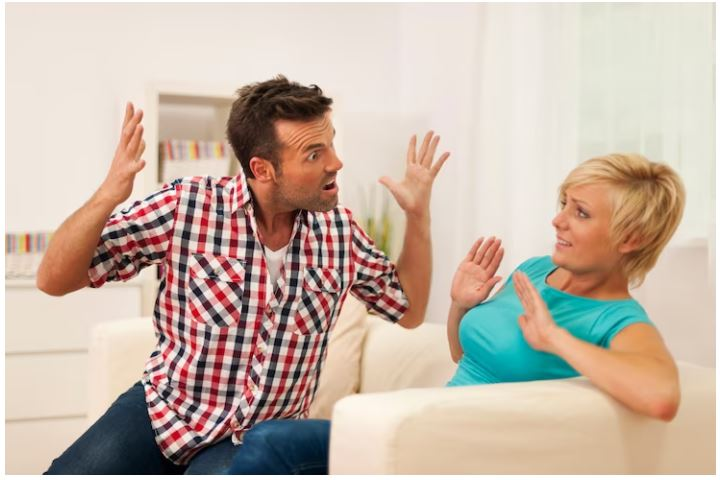
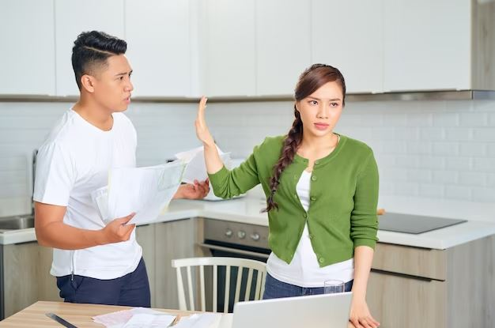
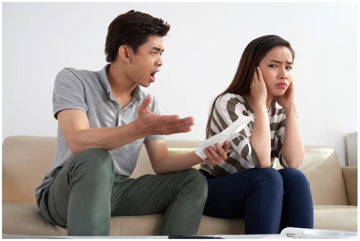

This article has been written and researched by our expert Loveable through a precise methodology. [Learn more about our methodology](https://avada.io/loveable/our-methodological.html)

[Loveable](https://avada.io/loveable/) > [Blog](https://avada.io/loveable/blog/) > [Family](https://avada.io/loveable/family/)

# My Husband Yells At Me: 11 Best Ways To Make Him Stop

Written by [Rose Bryne](https://avada.io/loveable/author/rose/) Last Updated on August 17, 2023

- [Why do some husbands yell at their wives?](https://avada.io/loveable/blog/my-husband-yells-at-me/#wp-block-heading-2-4)
- [11 Best Ways To Make Him Stop Yells At Me](https://avada.io/loveable/blog/my-husband-yells-at-me/#wp-block-heading-2-11)
    - [1\. Stay calm](https://avada.io/loveable/blog/my-husband-yells-at-me/#wp-block-heading-3-12)
    - [2\. Look at the different ways you could handle the situation](https://avada.io/loveable/blog/my-husband-yells-at-me/#wp-block-heading-3-16)
    - [3\. Think about what’s going on](https://avada.io/loveable/blog/my-husband-yells-at-me/#wp-block-heading-3-20)
    - [4\. Don’t always agree with what he says](https://avada.io/loveable/blog/my-husband-yells-at-me/#wp-block-heading-3-25)
    - [5\. Try to make him feel better](https://avada.io/loveable/blog/my-husband-yells-at-me/#wp-block-heading-3-29)
    - [6\. Draw a line](https://avada.io/loveable/blog/my-husband-yells-at-me/#wp-block-heading-3-33)
    - [7\. Pause the conversation](https://avada.io/loveable/blog/my-husband-yells-at-me/#wp-block-heading-3-38)
    - [8\. Say what you want calmly and firmly](https://avada.io/loveable/blog/my-husband-yells-at-me/#wp-block-heading-3-42)
    - [9\. Make him realize how this affects your family](https://avada.io/loveable/blog/my-husband-yells-at-me/#wp-block-heading-3-47)
    - [10\. Consult a therapist or counselor for help](https://avada.io/loveable/blog/my-husband-yells-at-me/#wp-block-heading-3-51)
    - [11\. Be patient with him](https://avada.io/loveable/blog/my-husband-yells-at-me/#wp-block-heading-3-55)
- [My husband yells at me – Final Words](https://avada.io/loveable/blog/my-husband-yells-at-me/#wp-block-heading-2-60)

Only under unusual circumstances, such as when one of you is in danger and requires immediate assistance, may yelling be allowed. Outside of those circumstances, he ought to be informed that what he’s doing is improper and must cease.

Here are some ideas that have been successful for many spouses with ‘**my husband yells at me**’, including girlfriends.

You have the option of being direct with him about the issue while also being sensitive to his sentiments. In the end, how you address the situation will rely on the dynamics of your relationship and how well you know one other’s communication preferences.

## Why do some husbands yell at their wives?

Why do some husbands yell at their wives?

There are a plethora of reasons why someone becomes angry so rapidly. Work stress or the [pressure to be perfect](https://avada.io/loveable/how-to-love-yourself/) and a better person, or even the [pressures of a competitive society](https://avada.io/loveable/how-to-be-more-social/), can cause a person to lose their temper rapidly and explode in rage.

Among all of these, the following are some of the most prevalent and genuine reasons why ‘my husband yells at me’ and lose their cool so rapidly.

- **Under stress** – A person under stress experiences many different things. People frequently are unable to understand the impact of their acts. They struggle to regulate their emotions and frequently lose their temper at random times.
- **[Physical transformation](https://avada.io/loveable/healthy-lifestyle-habits/)** – A spouse may be experiencing a chemical alteration in his body if he screams at his wife. Maybe his testosterone levels are low or he isn’t getting enough sleep, which is why his mental health is suffering.
- **Pressure from society and family** – In such a situation, a spouse would be under a great deal of stress as he tried to live up to the unrealistic macho ideal of society. This may also frustrate him to the point where he yells at his wife.

## 11 Best Ways To Make Him Stop Yells At Me

### 1\. Stay calm

‘My husband yells at me’. Actually, you don’t have to respond by yelling back. Offending someone and launching a counter-attack can easily grow into a full-fledged quarrel. Let common sense prevail by exercising emotion regulation. 

Before you say anything, take a moment to count, breathe, and think. You might alternatively opt to be calm and silent until things calm down.

Remaining cool is the most important option if you want to keep things under control and get him to calm down. Responding to his ranting with your yelling will exacerbate the situation. Therefore, keep your cool.

### 2\. Look at the different ways you could handle the situation

Shouting at your spouse is obviously a bad action, but it does not mean there is no other way to handle the situation. And there should be several choices that might calm your spouse down. 

Instead, think about your possibilities for dealing with the problem since you know your husband better than anybody else. Investigating the situation’s root cause might provide important information that you would have otherwise overlooked. Everyone has specific situations or emotions that set off particular reactions in them.

Look at the different ways you could handle the situation

### 3\. Think about what’s going on

Even if you love your spouse dearly, you must put your own needs first by acknowledging that his actions are negatively affecting you. Acknowledging the issue puts you in the appropriate frame of mind to look for answers and is the first step in bringing about change.

Maybe it has deeper implications as well. Analyze the circumstances if you want to know how to stop your spouse from yelling at you.

Anything may have provoked his annoyance, resulting in the ranting. You must determine what prompted this incident. You can take care of it the following time after you’ve worked it out.

What happens if my husband yells at me? Getting to the base of the problem will lead to a more peaceful and joyful presence.

### 4\. Don’t always agree with what he says

Your spouse may probably accuse you of a lot of things when he yells at you.

To agree with what the yeller is saying is the most typical way to get them to stop screaming. To be honest, this isn’t the finest option ever.

By accepting his accusations, you are proving his point and giving him fuel to rage at you more. Just attempt to calm him down and don’t address his claim.

### 5\. Try to make him feel better

Your husband is likely to have forgotten the circumstance and location where he is screaming at you when he is doing so. Try to explain your situation to him so you don’t disgrace yourself.

Assure him that you sympathize with his anger, whether it is related to his job or family matters. Although it doesn’t seem like the right moment, let him know that you’re there to listen when he’s ready to speak.

Bring him to his senses. He will gradually become quiet as a result of this. You may calmly talk about the problem and resolve things afterward.

### 6\. Draw a line

Draw a line

At the time, it’s acceptable to scream or become agitated, but don’t allow your husband to generate a bad habit out of it.

He could become a habit of doing it after he realizes that you’re alright and can handle it. Draw a line, then let him know that you won’t put up with this kind of action all the time.

Setting ground rules or limits might help keep things from escalating. Inform your husband that if he chooses to shout his point, you will check out of the argument and walk away. He may not agree with your viewpoint and may even accuse you of being unreasonable, but stand firm.

### 7\. Pause the conversation

What to do if my husband yells at me? Take a break from the talk if it becomes too heated. That gives you both time to cool off and consider your solutions.

Once he’s in a better frame of mind, he’ll probably be able to carry on a constructive conversation with the appropriate tone of voice. During the calm-down period, you’ll also have time to digest your emotions and restore your composure.

“I believe we should move on from this subject,” you might say. “We’ll discuss this when we have calmed down for a while”. You two may talk again and, ideally, have a more effective conversation once you’ve both had a chance to cool off.

### 8\. Say what you want calmly and firmly

In a relationship, it’s critical to express your wants, but it’s also crucial to do so without escalating the conflict. Be strong and demanding while maintaining your temper.

If your spouse is yelling at you, attempt to quietly, plainly, and clearly communicate what you need from him. Help him comprehend what you’re saying so that he won’t yell again in the future.

You can go on to say that you feel like you’re walking on eggshells around him and that you’re doing everything possible to avoid sparking a shouting spell. Perhaps you are feeling unwanted, afraid, threatened, frightened, or withdrawn. Tell him how you really feel.

Be strong and demanding while maintaining your temper.

### 9\. Make him realize how this affects your family

You and the kids might suffer consequences for shouting. Also, it may make you feel alone, afraid, or even in danger.

The children, meanwhile, can think that they are the ones being shouted at. They could develop anxiety, withdraw, and have a hard time falling asleep.

Your husband could be more inclined to quit yelling if he understands how it’s bothering you and the kids.

### 10\. Consult a therapist or counselor for help

My husband yells at me when I ask him questions. It might be time to look for outside assistance if you and your spouse are having trouble getting along or if you can’t seem to stop him from screaming. You and your husband can discover the underlying issue and come up with solutions with the aid of a therapist or counselor.

You two might even go to therapy sessions together if your spouse is receptive to the concept. This may be a terrific method to enhance communication and teach him how to communicate in a more positive way. It can also teach you how to handle his emotions more effectively.

**_Related_**: [How to Get Over A Guy: 13 Effective Ways to Help You Feel Better](https://avada.io/loveable/how-to-get-over-a-guy/)

### 11\. Be patient with him

Being patient with your partner while he learns to control his anger more effectively is crucial since changing behavior is not always simple.

It can take him some time to learn how to express himself in a different way if he is used to shouting to convey his emotions.

And it can help him improve his behavior a lot if you’re patient and understanding. He will be inspired to change by it, and it will also demonstrate to him that you are devoted to the relationship.

Be patient with him

## My husband yells at me – Final Words

Husbands shout at their wives for a variety of reasons, but it’s not a healthy way of communicating. While your spouse has the right to be upset, lashing out at you is neither a solution nor a healthy coping mechanism.

A man who is emotionally knowledgeable and self-aware would react differently. To avoid upsetting you, he would more likely communicate his feelings and make efforts to moderate his emotions. He’s concerned about your well-being, which indicates empathy.

You’ll have to call out the attitude and urge him to stop because you’re probably dealing with an emotionally immature and unaware man. Perhaps, he appreciates your marriage enough to put forth the effort to work on himself and improve his communication skills. And you don’t have to claim again that my husband yells at me!

- [Why do some husbands yell at their wives?](https://avada.io/loveable/blog/my-husband-yells-at-me/#wp-block-heading-2-4)
- [11 Best Ways To Make Him Stop Yells At Me](https://avada.io/loveable/blog/my-husband-yells-at-me/#wp-block-heading-2-11)
    - [1\. Stay calm](https://avada.io/loveable/blog/my-husband-yells-at-me/#wp-block-heading-3-12)
    - [2\. Look at the different ways you could handle the situation](https://avada.io/loveable/blog/my-husband-yells-at-me/#wp-block-heading-3-16)
    - [3\. Think about what’s going on](https://avada.io/loveable/blog/my-husband-yells-at-me/#wp-block-heading-3-20)
    - [4\. Don’t always agree with what he says](https://avada.io/loveable/blog/my-husband-yells-at-me/#wp-block-heading-3-25)
    - [5\. Try to make him feel better](https://avada.io/loveable/blog/my-husband-yells-at-me/#wp-block-heading-3-29)
    - [6\. Draw a line](https://avada.io/loveable/blog/my-husband-yells-at-me/#wp-block-heading-3-33)
    - [7\. Pause the conversation](https://avada.io/loveable/blog/my-husband-yells-at-me/#wp-block-heading-3-38)
    - [8\. Say what you want calmly and firmly](https://avada.io/loveable/blog/my-husband-yells-at-me/#wp-block-heading-3-42)
    - [9\. Make him realize how this affects your family](https://avada.io/loveable/blog/my-husband-yells-at-me/#wp-block-heading-3-47)
    - [10\. Consult a therapist or counselor for help](https://avada.io/loveable/blog/my-husband-yells-at-me/#wp-block-heading-3-51)
    - [11\. Be patient with him](https://avada.io/loveable/blog/my-husband-yells-at-me/#wp-block-heading-3-55)
- [My husband yells at me – Final Words](https://avada.io/loveable/blog/my-husband-yells-at-me/#wp-block-heading-2-60)

### [Rose Bryne](https://avada.io/loveable/author/rose/)

Hi, I'm Rose! I love animals and spending time with kids. At Loveable, I help people find unique gifts for special occasions like Valentine's Day, housewarmings, and graduations. I enjoy finding gifts for kids, teens, and animal lovers that match their interests and personalities. Making gift-giving a pleasant experience is my priority. Let me assist you in finding the perfect gift!

- [Twitter](https://twitter.com/intent/tweet)
- [Facebook](https://www.facebook.com/sharer/sharer.php)
- [instagram](https://avada.io/loveable/blog/my-husband-yells-at-me/)
- [pinterest](https://www.pinterest.com/loveablellc/)

## Related Posts

[### 30 Best 4 Year Old Birthday Party Ideas For A Memorable Celebration](https://avada.io/loveable/blog/4-year-old-birthday-party-ideas/) 

[

### 16th Birthday Party Ideas to Make an Unforgettable Day

](https://avada.io/loveable/blog/16th-birthday-party-ideas/)

[

### 150+ Inspirational Birthday Quotes to Spread Joy on Special Day

](https://avada.io/loveable/blog/inspirational-birthday-quotes/)

[

### 160+ Birthday Wishes for Wife to Express Eternal Love

](https://avada.io/loveable/blog/birthday-wishes-for-wife/)

[### 90+ Heart Touching Birthday Wishes for Niece to Make Her Day Extra Special](https://avada.io/loveable/blog/birthday-wishes-for-niece/)
