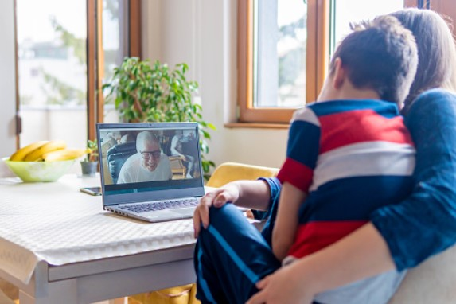

This article has been written and researched by our expert Loveable through a precise methodology. [Learn more about our methodology](https://avada.io/loveable/our-methodological.html)

[Loveable](https://avada.io/loveable/) > [Blog](https://avada.io/loveable/blog/) > [Parenting](https://avada.io/loveable/parenting/)

# Navigating Long-Distance Parenting: Tips for Staying Connected with Your Child

Written by [Rose Bryne](https://avada.io/loveable/author/rose/) Last Updated on August 28, 2023

- [How Does Long Distance Parenting Affect Children?](https://avada.io/loveable/blog/navigating-long-distance-parenting/#wp-block-heading-2-3)
- [10 Long-Distance Parenting Tips to Stay Connected with Children](https://avada.io/loveable/blog/navigating-long-distance-parenting/#wp-block-heading-2-9)
    - [1\. Spend Time with Your Children](https://avada.io/loveable/blog/navigating-long-distance-parenting/#wp-block-heading-3-10)  
    - [2\. Be Compassionate](https://avada.io/loveable/blog/navigating-long-distance-parenting/#wp-block-heading-3-14)
    - [3\. Associated With Other Adults In The Children’s Lives](https://avada.io/loveable/blog/navigating-long-distance-parenting/#wp-block-heading-3-17)
    - [4\. Provide Complete Emotional Security](https://avada.io/loveable/blog/navigating-long-distance-parenting/#wp-block-heading-3-20)
    - [5\. Set a Fix Visiting Schedule That You Can Follow](https://avada.io/loveable/blog/navigating-long-distance-parenting/#wp-block-heading-3-23) 
    - [6\. Finds Ways to Surprise Your Children](https://avada.io/loveable/blog/navigating-long-distance-parenting/#wp-block-heading-3-26)  
    - [7\. Focus on Communication](https://avada.io/loveable/blog/navigating-long-distance-parenting/#wp-block-heading-3-30)
    - [8\. Surprise Them With a Gift Package](https://avada.io/loveable/blog/navigating-long-distance-parenting/#wp-block-heading-3-33)
    - [9\. Don’t Expect Your Child To Answer You All The Time.](https://avada.io/loveable/blog/navigating-long-distance-parenting/#wp-block-heading-3-36)
    - [10\. Always Keep The Memories](https://avada.io/loveable/blog/navigating-long-distance-parenting/#wp-block-heading-3-40)
- [Final Thoughts](https://avada.io/loveable/blog/navigating-long-distance-parenting/#wp-block-heading-2-45)

**Long-distance parenting** can be a challenging experience for both parents and children. The physical distance between a parent and child can cause feelings of loneliness and disconnection. It is very implied that the sense of love will gradually fade if we don’t have interaction through face-to-face contact or touching. However, with the rise of technology and the internet, staying connected with a child from afar has become much easier than before.

Working away from home is no longer so new in today’s society that parents can no longer accompany their children all day long as before. It is crucial to maintain a strong and healthy relationship with your child, regardless of the distance. This can be achieved by implementing a variety of communication strategies focusing on both quality and quantity. A quick call or a greeting message in the morning is a good idea to remind your children of you. 

## **How Does Long Distance Parenting Affect Children?**

Two long-distance parenting studies were examined: a 2012 [IZA](https://www.iza.org/) report by Rasmussen and Stratton and a 2009 research by Kalil et al.

According to the IZA report, there is no evidence to support the idea that children who live away from their non-residential parents have poorer results. 

Meanwhile, the Kalil et al. study focused primarily on dads and discovered that when non-custodial fathers lived closer to their children, their results were lower. 

The study highlighted, however, that this does not imply that parenting interactions are irrelevant, but rather that being in close proximity to a non-resident parent does not promote excellent child outcomes

## **10 Long-Distance Parenting Tips to Stay Connected with Children**

### **1\. Spend Time with Your Children**  

Most individuals must balance a busy job schedule with family tasks and other responsibilities. Children will feel like being abandoned if their parents do not spend time with them. 

To avoid such situations, it’s important to show how much you are concerned about your children. Rearrange the schedule to enjoy some activities with them, such as camping or any other extracurriculars.

### **2\. Be Compassionate**

For children, parental divorce is regarded as a terrible experience. Children who have many mental pains are more prone to develop health issues, including drug misuse or suicide. 

Your youngster is attempting to comprehend the changes in their surroundings and requires your assistance. Remember to keep your children out of disagreements. Your child requires your love and care regardless of where you are.

### **3\. Associated With Other Adults In The Children’s Lives**

When parents co-parent peacefully, joint physical custody becomes more doable. However, in high-conflict scenarios, this level of collaboration is not always possible. 

Parallel parenting is an alternative to typical co-parenting in which each parent has authority over their parental obligations, and disagreements are avoided in front of the children. 

### **4\. Provide Complete Emotional Security**

During a significant transition, children may become overly sensitive. To address these issues, parents should be open and sensitive about their own feelings, as well as provide an atmosphere of safety for their children to express themselves. Being emotionally open is essential in both joyful and sad times, and it can have long-term advantages for children.

### **5\. Set a Fix Visiting Schedule That You Can Follow** 

You don’t want to be a liar to your child, do you? Remember that keeping one’s word and following through on pledges is the cornerstone of emotional availability. 

Although being emotionally accessible might be difficult, the long-term advantages children receive make it worthwhile. To soothe your children, arrive on time and prepare thoroughly for each Visitation.

### **6\. Finds Ways to Surprise Your Children**  

When dealing with the hardships of long-distance parenting, having fun and sharing moments of joy are important. 

Some suggestions include writing down significant dates to remember, sending cards or little presents, sharing humorous videos, starting long-distance rituals, and recognizing that it is the simple things that your children will remember. Who doesn’t enjoy surprises, right?

### **7\. Focus on Communication**

Encourage your kid to express their thoughts, feelings, and questions, and make yourself accessible to discuss. Your child’s friends, school performance, activities, concerns, and needs should be the topics. 

It’s important to realize that they have their own life, so don’t make it an investigation. Maintaining open communication can help all parties involved develop great connections.

### **8\. Surprise Them With a Gift Package**

Sending mail might be an excellent method to stay in touch with your long-distance child. Children generally appreciate receiving letters because it is something they do not regularly receive. 

Leave a handcrafted present inside as a token of your affection. And, of course, sending a card message or a [long distance relationship gift](https://avada.io/loveable/long-distance-relationship-gifts/) to express how much you love and miss them.

### **9\. Don’t Expect Your Child To Answer You All The Time.**

Don’t expect your child to respond to your messages or phone calls as frequently as you do. This does not suggest that they are unconcerned with your care. Kids are often shy.

Children may not be socially aware enough to respond as regularly as adults. So, instead of taking their lack of response personally, keep trying to connect with them.

### **10\. Always Keep The Memories**

One important thing is that remembering each other is inevitable. If you are a long-distance parent, remember to take photographs and videos of your time with your child so that the two can take it out whenever thinking about the other half. The photos will be a repository of the best memories for both, marking important events together.

**_See More:_**

- Best [Easy Drawing Ideas for Kids](https://avada.io/loveable/blog/drawing-ideas-for-kids/)

- Easy [Science Experiments for Kids](https://avada.io/loveable/blog/science-experiments-kids/)

## **Final Thoughts**

Being separated from your kid, whether due to a divorce, a work move, or other reasons, may be difficult, especially when it comes to being connected and active in their life. There are, however, methods to negotiate this circumstance while still maintaining a close relationship with your child. 

It’s known that long-distance parenting might be difficult, but you still have to remain optimistic and proactive. This Blog: **Navigating Long-Distance Parenting: Tips for Staying Connected with Your Child,** is some useful advice for any parents. You may still be a significant part of your child’s life by keeping constant contact, being available and understanding, and finding innovative ways to stay connected.

- [How Does Long Distance Parenting Affect Children?](https://avada.io/loveable/blog/navigating-long-distance-parenting/#wp-block-heading-2-3)
- [10 Long-Distance Parenting Tips to Stay Connected with Children](https://avada.io/loveable/blog/navigating-long-distance-parenting/#wp-block-heading-2-9)
    - [1\. Spend Time with Your Children](https://avada.io/loveable/blog/navigating-long-distance-parenting/#wp-block-heading-3-10)  
    - [2\. Be Compassionate](https://avada.io/loveable/blog/navigating-long-distance-parenting/#wp-block-heading-3-14)
    - [3\. Associated With Other Adults In The Children’s Lives](https://avada.io/loveable/blog/navigating-long-distance-parenting/#wp-block-heading-3-17)
    - [4\. Provide Complete Emotional Security](https://avada.io/loveable/blog/navigating-long-distance-parenting/#wp-block-heading-3-20)
    - [5\. Set a Fix Visiting Schedule That You Can Follow](https://avada.io/loveable/blog/navigating-long-distance-parenting/#wp-block-heading-3-23) 
    - [6\. Finds Ways to Surprise Your Children](https://avada.io/loveable/blog/navigating-long-distance-parenting/#wp-block-heading-3-26)  
    - [7\. Focus on Communication](https://avada.io/loveable/blog/navigating-long-distance-parenting/#wp-block-heading-3-30)
    - [8\. Surprise Them With a Gift Package](https://avada.io/loveable/blog/navigating-long-distance-parenting/#wp-block-heading-3-33)
    - [9\. Don’t Expect Your Child To Answer You All The Time.](https://avada.io/loveable/blog/navigating-long-distance-parenting/#wp-block-heading-3-36)
    - [10\. Always Keep The Memories](https://avada.io/loveable/blog/navigating-long-distance-parenting/#wp-block-heading-3-40)
- [Final Thoughts](https://avada.io/loveable/blog/navigating-long-distance-parenting/#wp-block-heading-2-45)

### [Rose Bryne](https://avada.io/loveable/author/rose/)

Hi, I'm Rose! I love animals and spending time with kids. At Loveable, I help people find unique gifts for special occasions like Valentine's Day, housewarmings, and graduations. I enjoy finding gifts for kids, teens, and animal lovers that match their interests and personalities. Making gift-giving a pleasant experience is my priority. Let me assist you in finding the perfect gift!

- [Twitter](https://twitter.com/intent/tweet)
- [Facebook](https://www.facebook.com/sharer/sharer.php)
- [instagram](https://avada.io/loveable/blog/navigating-long-distance-parenting/)
- [pinterest](https://www.pinterest.com/loveablellc/)

## Related Posts

[

### 79 Heartfelt Missing Mom Quotes for Expressing Love and Longing

](https://avada.io/loveable/blog/missing-mom-quotes/)

[

### Parenting with Depression: Strategies for Coping, Seeking Help, and Building Resilience

](https://avada.io/loveable/blog/parenting-with-depression/)

[

### 100 Empowering Single Mom Quotes: Inspirational Words for Strong Mothers

](https://avada.io/loveable/blog/single-mom-quotes/)

[

### 99+ Heartfelt Quotes And Wishes: Happy Anniversary to Mom and Dad!

](https://avada.io/loveable/blog/quotes-happy-anniversary-mom-dad/)

[

### 5 Ways to Foster a Positive Parent-Teacher Relationship

](https://avada.io/loveable/blog/parent-teacher-relationship/)
