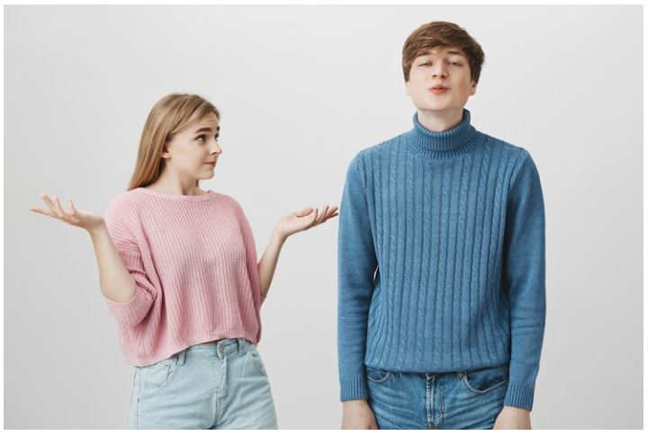
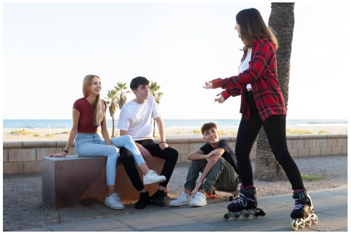
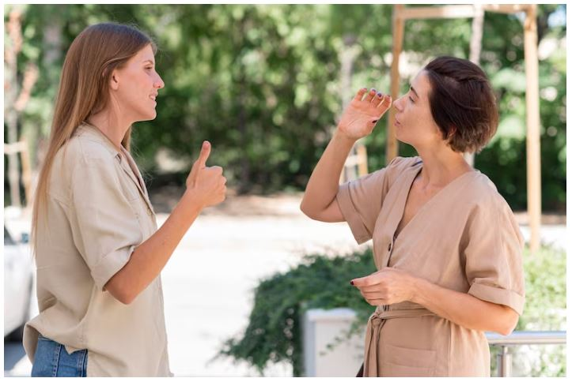

This article has been written and researched by our expert Loveable through a precise methodology. [Learn more about our methodology](https://avada.io/loveable/our-methodological.html)

[Loveable](https://avada.io/loveable/) > [Blog](https://avada.io/loveable/blog/) > [Relationship](https://avada.io/loveable/relationship/)

# Navigating Toxic Friendships: 12 Signs, Impacts, and Strategies for Coping

Written by [Luna Miller](https://avada.io/loveable/author/luna/) Last Updated on August 22, 2023

- [What are the signs of a toxic friendship?](https://avada.io/loveable/blog/navigating-toxic-friendships/#wp-block-heading-2-4)
    - [1\. Gossip](https://avada.io/loveable/blog/navigating-toxic-friendships/#wp-block-heading-3-6)
    - [2\. Make You Feel Nervous](https://avada.io/loveable/blog/navigating-toxic-friendships/#wp-block-heading-3-8)
    - [3\. They Tend to Compare You to Other People](https://avada.io/loveable/blog/navigating-toxic-friendships/#wp-block-heading-3-11)
    - [4\. They Try to Change You](https://avada.io/loveable/blog/navigating-toxic-friendships/#wp-block-heading-3-15)
    - [5\. They Put You Down](https://avada.io/loveable/blog/navigating-toxic-friendships/#wp-block-heading-3-18)
    - [6\. Fake Apology](https://avada.io/loveable/blog/navigating-toxic-friendships/#wp-block-heading-3-21)
    - [7\. They Leave you Unsettled](https://avada.io/loveable/blog/navigating-toxic-friendships/#wp-block-heading-3-24)
    - [8\. They always value themselves more than you](https://avada.io/loveable/blog/navigating-toxic-friendships/#wp-block-heading-3-27)
    - [9\. They Don’t Respect Your Boundaries](https://avada.io/loveable/blog/navigating-toxic-friendships/#wp-block-heading-3-31)
    - [10\. They Always Blame You](https://avada.io/loveable/blog/navigating-toxic-friendships/#wp-block-heading-3-34)
    - [11\. Lies](https://avada.io/loveable/blog/navigating-toxic-friendships/#wp-block-heading-3-37) 
    - [12\. They Never Seem Happy for You](https://avada.io/loveable/blog/navigating-toxic-friendships/#wp-block-heading-3-39)
- [What are the Effects of Toxic Friendships?](https://avada.io/loveable/blog/navigating-toxic-friendships/#wp-block-heading-2-42)
- [How Do You Get Over a Toxic Friendship?](https://avada.io/loveable/blog/navigating-toxic-friendships/#wp-block-heading-2-52)
    - [1\. Concentrate on Cultivating Healthy Relationships](https://avada.io/loveable/blog/navigating-toxic-friendships/#wp-block-heading-3-54)
    - [2\. Don’t Wait For an Apology](https://avada.io/loveable/blog/navigating-toxic-friendships/#wp-block-heading-3-57)
    - [3\. Keep Moving Forward](https://avada.io/loveable/blog/navigating-toxic-friendships/#wp-block-heading-3-60)
    - [4\. Have Less Contact](https://avada.io/loveable/blog/navigating-toxic-friendships/#wp-block-heading-3-65)
    - [5\. Write a Letter](https://avada.io/loveable/blog/navigating-toxic-friendships/#wp-block-heading-3-68)
    - [6\. It’s Still Okay to Step by Your Own](https://avada.io/loveable/blog/navigating-toxic-friendships/#wp-block-heading-3-73) 
    - [7\. Avoid Dwelling In Bitterness](https://avada.io/loveable/blog/navigating-toxic-friendships/#wp-block-heading-3-76)
    - [8\. Gather The Help of Other Friends](https://avada.io/loveable/blog/navigating-toxic-friendships/#wp-block-heading-3-79)
    - [9\. Give Yourself Permission to Feel Sad](https://avada.io/loveable/blog/navigating-toxic-friendships/#wp-block-heading-3-84)
    - [10\. Keep Your Last Convo Brief](https://avada.io/loveable/blog/navigating-toxic-friendships/#wp-block-heading-3-86)
- [Bottom Lines](https://avada.io/loveable/blog/navigating-toxic-friendships/#wp-block-heading-2-93)

Friendships are essential for our well-being and happiness, but they can also be causes of stress and negativity. Toxic friendships, in particular, can have severe impacts on our mental health and overall well-being. 

Navigating toxic friendships can be challenging, especially when you’ve spent a lot of time and energy in the relationship. However, it’s crucial to identify the signs of a toxic friendship and understand its impacts to take the necessary actions to cope with it. 

This article will explore **12 signs of a toxic friendship** and discuss its impacts on mental health and well-being. We’ll also provide you with practical strategies for coping with toxic friendships and maintaining healthy relationships with those around you. So, let’s dive in!

## **What are the signs of a toxic friendship?**

### **1\. Gossip**

It seems like you confided in a friend, but now it seems like everyone knows what you shared. It’s natural to make mistakes and accidentally let something slip, but when someone repeatedly shares your secrets, it can be a sign of a toxic friendship. This behavior shows a lack of concern for your feelings and can be damaging to the relationship.

### **2\. Make You Feel Nervous**

When someone’s behavior is unpredictable, it does not always mean they are toxic. However, if their actions have the potential to cause harm or feel abusive, it’s best to be cautious. 

For instance, if they tend to get extremely angry over trivial matters like leaving the TV on or not returning a borrowed jacket, and then act as if nothing happened the next minute, it can make you feel uncomfortable around them. In such cases, it’s important to be aware of their actions and take necessary precautions to protect yourself.

### **3\. They Tend to Compare You to Other People**

Do you have a friend who always compares you to their other friends? The size of your apartment or how you dress makes them feel like hanging out with you is less fun. 

However, every person has unique traits and differences, and a true friend will be able to appreciate this. They won’t compare you to others or make you feel inferior to someone else. In addition, they won’t pressure you into doing something you don’t want.

### **4\. They Try to Change You**

It’s important to have friends who accept you for who you are. It’s important to consider whether someone attempting to alter aspects of your personality or behavior is a good friend. A genuine friend will offer assistance and motivation if you seek their advice on changes you wish to make.

For instance, if you struggle in social settings, a good friend might invite you to their game night to introduce you to some new people in a relaxed environment.

### **5\. They Put You Down**

It’s not uncommon for friends to tease each other playfully, and this kind of behavior is usually harmless, as long as both parties are having a good time. However, if a friend consistently puts you down and makes you feel terrible, whether through subtle negging or outright insults, then it’s likely that your friendship is not a positive or healthy one.

### **6\. Fake Apology**

When you confront them about their conduct, they dismiss your concerns with a casual “sorry” or “I’m sorry you feel that way” without genuinely reflecting on your viewpoint. 

Moreover, they may even defend themselves with a “but” clause after apologizing, as in “I’m sorry I offended you, but it was only a joke.” These types of non-apologies imply that the person is indifferent to how their actions impact her.

### **7\. They Leave you Unsettled**

Spending time with a close friend should typically bring about positive feelings. However, you might experience uneasiness or discomfort when spending time with a specific friend without being able to pinpoint the reason. 

If you find yourself feeling relieved instead of disappointed after spending time with them and don’t look forward to seeing them again, it’s worth examining your friendship for other signs that something isn’t quite right.

### **8\. They always value themselves more than you**

Have you ever come across a friend who seems to be there for you only in good times? They appear out of nowhere when everything is going smoothly or when they require something from you, but when you’re going through tough times, they’re nowhere to be found. 

Additionally, some friends may ramble for an extended period about their problems. After they’ve finished, they may ask how you’re doing before rapidly changing the subject back to themselves.

### **9\. They Don’t Respect Your Boundaries**

In order to maintain healthy relationships, it’s important to establish and respect boundaries with your friends. If someone consistently disregards the boundaries you set, it could be a sign of toxicity. 

Keep in mind that a lack of boundaries can also be a characteristic of codependent friendships, where individuals become too intertwined and lack independence. If boundaries are not properly maintained, the bond between friends can become uncomfortably intense and unhealthy. Remember to prioritize your well-being by setting and enforcing clear boundaries in your friendships.

### **10\. They Always Blame You**

Individuals who exhibit toxic behavior often struggle with accepting responsibility for their actions and acknowledging their mistakes. As a result, they may resort to blaming others, including their partners, for any shortcomings or issues within the relationship. It’s important to recognize and address these patterns healthily and constructively.

### **11\. Lies** 

In any healthy relationship, trust plays a vital role. If you have doubts about your friend’s trustworthiness, it’s likely because you sense something toxic in your friendship. Loyalty is a significant factor, and it’s a sign of toxicity if you can’t rely on your friend for support or confidentiality. Recognizing these warning signs and avoiding toxic friendships is essential to maintain healthy relationships.

### **12\. They Never Seem Happy for You**

A true friend will always be happy with your accomplishments and celebrate those wins with you. However, with fake friends, there is often a hidden feeling of jealousy that they try to suppress, as they do not want you to outshine them. 

In some cases, a toxic friend may even deliberately sabotage your success due to this sense of competition and envy. They may continuously try to bring you down or discourage you from doing things that are beneficial for your growth.

## **What are the Effects of Toxic Friendships?**

When we surround ourselves with toxic friends, it can take a toll on our well-being, and unfortunately, the impact is often negative. If we spend time with individuals who disregard our emotions, it can eventually have an adverse effect on our emotional and physical health.

- You might feel neglected and ignored if you are in a toxic friendship. Despite your efforts to plan outings together, you are often excluded from group activities, and your messages are left unanswered.
- If you find yourself dwelling on negative interactions, it can be challenging to shake off those unpleasant feelings, even when you’re not around the person. This can leave you feeling tense, irritable, and not your best self. 
- You may not experience the support and empathy that you need. You might feel unimportant when your concerns are dismissed or completely disregarded when your attempts to reach out for assistance are ignored.
- If someone consistently belittles and mistreats you, you may unknowingly become accustomed to this conduct and lower your expectations.
- If someone lashes out at you, it’s natural to question your actions and assume you deserve it. You may also feel they don’t support you because you ask for help too frequently.
- It’s common for them to use manipulation tactics to achieve their goals. This behavior can leave you feeling uneasy but unable to pinpoint the exact issue. Their extreme reactions can also throw you off balance, whether it’s through laughter or yelling.
- If you begin to doubt yourself, you may feel like you’re not being a good friend to yourself. And even if you don’t start doubting, trusting others might become challenging. You might question if everyone perceives you as inadequate, uninteresting, or unhelpful, which might lead you to avoid socializing.

## **How Do You Get Over a Toxic Friendship?**

### **1\. Concentrate on Cultivating Healthy Relationships**

Being stuck in a harmful friendship can cause you to feel ashamed, uncertain, or suspicious of others. If you’ve cut yourself off from other companions, you may struggle to reconnect with them.

However, you likely have some dependable friends willing to assist. Reaching out to them and sharing your circumstances can assist you in reestablishing those healthy friendships, which can contribute to your recovery.

### **2\. Don’t Wait For an Apology**

Toxic people often do not take responsibility for their actions. Even if they realize they have hurt you, they may not be willing to apologize or change their behavior. This can leave you feeling frustrated and powerless.

Waiting for an apology can keep you stuck in a negative cycle. You may find yourself replaying the hurtful words or actions repeatedly, which can lead to resentment and anger. It can also prevent you from moving on and finding more positive relationships.

### **3\. Keep Moving Forward**

It is important to remember that a toxic friendship is not healthy for you, and it is better to move forward. It can be helpful to practice self-care in order to heal from the hurt and pain of the situation. 

Take time for yourself and do special activities you enjoy, such as taking a walk, reading a book, or watching your favorite movie. Surround yourself with people and friends who make you feel supported and loved. Consider confiding in your closest friends or family members whom you trust. Share your experience with them and seek their support as you continue to move forward.

Lastly, don’t forget to forgive yourself for allowing yourself to be in the situation in the first place. This will help you learn from the experience and have a more positive view of life going forward.

### **4\. Have Less Contact**

If you find yourself constantly wishing your friend would treat you better, it may be worth taking a break from the friendship for a while. This can give you the opportunity to sort through your feelings and gain clarity on what to do next. 

Additionally, taking time apart can allow you to see how your life looks without those people. If you notice significant improvement and feel better without the worry of seeing them, it may be a sign that ending the friendship is the best option.

### **5\. Write a Letter**

Writing a letter can be a helpful way to process your feelings and emotions when ending a toxic friendship. It is okay to feel hurt, angry, or sad about the end of the friendship. Write down your emotions and let yourself feel them.

Be honest about the reasons for ending the friendship. Explain why the relationship has become toxic and how it has affected you. Be clear and specific about the behaviors or actions that have hurt you.

Consider whether or not you want to send the letter. Depending on the situation, you may send the letter or keep it for yourself as a way of processing your emotions. Either way, writing the letter can be a helpful step in moving on from toxic friendships.

### **6\. It’s Still Okay to Step by Your Own** 

If you have identified that a friendship has become toxic, it is okay to step away. This may mean reducing contact or ending the friendship altogether. It can be difficult, but remember that you deserve to be in relationships that are healthy and uplifting.

Stepping away from a toxic friendship may also involve setting boundaries for yourself. This could include limiting contact with the friend, avoiding certain topics of conversation, or being clear about what behaviors are not acceptable to you. It can be helpful to communicate these boundaries respectfully and firmly.

### **7\. Avoid Dwelling In Bitterness**

When a friendship becomes toxic, it is natural to feel hurt, angry, or resentful toward the other person. However, dwelling in bitterness can ultimately be harmful to your own well-being. To avoid dwelling in bitterness in a toxic friendship, practice forgiveness. 

Forgiveness is not equivalent to overlooking or justifying the other person’s conduct. Rather, it’s about freeing yourself from the negative emotions like anger and bitterness that are hindering your progress. Forgiveness is a process, and it may take time to work through your emotions.

### **8\. Gather The Help of Other Friends**

Getting over toxic friendships can be a difficult and emotional process, but reaching out to other friends for support can be helpful.

When seeking support from other friends, it is important to choose people who are supportive and uplifting. These may be friends who have been through similar experiences, or who simply have your best interests at heart.

Let your friends know what you are going through and what kind of support you need. This may involve venting your feelings, asking for advice, or simply spending time with someone who makes you feel good.

### **9\. Give Yourself Permission to Feel Sad**

Losing a close friend can be a challenging and emotional experience. It is crucial to acknowledge and accept your feelings of sorrow and grief. You should give yourself enough time to process your emotions and cope with the reality of the situation. Remember that it is common to feel upset after losing a friend, and you are not alone.

### **10\. Keep Your Last Convo Brief**

You may want to avoid any potential hurt feelings or awkwardness, so the best approach is often to keep your last conversation brief. It’s crucial to communicate to your friend that you cherish the quality time you’ve spent together and acknowledge their friendship, but it’s time for both of you to part ways. It can help to remind them of all the good times you shared and how much you learned from each other. 

Make sure your tone is respectful and understanding so that your friend feels heard and respected as well. Ending a friendship doesn’t have to be an ugly process; use this opportunity to reflect on all the positive moments you shared and wish them well in their future endeavors.

**_See More_**:

- [How to End A Friendship](https://avada.io/loveable/how-to-end-a-friendship/): 6 Best Ways without Hurting Their Feelings

- [What Is A Platonic Friendship](https://avada.io/loveable/platonic-friendship/) | The Benefits & Drawbacks of having it

## **Bottom Lines**

**Toxic friendships** are relationships that are harmful and unhealthy for you. Toxic friendships come in many forms and can cause feelings of embarrassment and shame. They may have taken a toll on you, your body, and your mental health.

It’s important to define toxic friendships for yourself because there are various ways in which toxic friendships can be harmful to you. Toxic friendships can include unhealthy interactions, emotional abuse, and social isolation.

Once you have identified the friendship as toxic, taking time for yourself and distancing yourself from the other person is important. This can be difficult if you have been friends for a long time, but it will help you process your emotions and heal.

- [What are the signs of a toxic friendship?](https://avada.io/loveable/blog/navigating-toxic-friendships/#wp-block-heading-2-4)
    - [1\. Gossip](https://avada.io/loveable/blog/navigating-toxic-friendships/#wp-block-heading-3-6)
    - [2\. Make You Feel Nervous](https://avada.io/loveable/blog/navigating-toxic-friendships/#wp-block-heading-3-8)
    - [3\. They Tend to Compare You to Other People](https://avada.io/loveable/blog/navigating-toxic-friendships/#wp-block-heading-3-11)
    - [4\. They Try to Change You](https://avada.io/loveable/blog/navigating-toxic-friendships/#wp-block-heading-3-15)
    - [5\. They Put You Down](https://avada.io/loveable/blog/navigating-toxic-friendships/#wp-block-heading-3-18)
    - [6\. Fake Apology](https://avada.io/loveable/blog/navigating-toxic-friendships/#wp-block-heading-3-21)
    - [7\. They Leave you Unsettled](https://avada.io/loveable/blog/navigating-toxic-friendships/#wp-block-heading-3-24)
    - [8\. They always value themselves more than you](https://avada.io/loveable/blog/navigating-toxic-friendships/#wp-block-heading-3-27)
    - [9\. They Don’t Respect Your Boundaries](https://avada.io/loveable/blog/navigating-toxic-friendships/#wp-block-heading-3-31)
    - [10\. They Always Blame You](https://avada.io/loveable/blog/navigating-toxic-friendships/#wp-block-heading-3-34)
    - [11\. Lies](https://avada.io/loveable/blog/navigating-toxic-friendships/#wp-block-heading-3-37) 
    - [12\. They Never Seem Happy for You](https://avada.io/loveable/blog/navigating-toxic-friendships/#wp-block-heading-3-39)
- [What are the Effects of Toxic Friendships?](https://avada.io/loveable/blog/navigating-toxic-friendships/#wp-block-heading-2-42)
- [How Do You Get Over a Toxic Friendship?](https://avada.io/loveable/blog/navigating-toxic-friendships/#wp-block-heading-2-52)
    - [1\. Concentrate on Cultivating Healthy Relationships](https://avada.io/loveable/blog/navigating-toxic-friendships/#wp-block-heading-3-54)
    - [2\. Don’t Wait For an Apology](https://avada.io/loveable/blog/navigating-toxic-friendships/#wp-block-heading-3-57)
    - [3\. Keep Moving Forward](https://avada.io/loveable/blog/navigating-toxic-friendships/#wp-block-heading-3-60)
    - [4\. Have Less Contact](https://avada.io/loveable/blog/navigating-toxic-friendships/#wp-block-heading-3-65)
    - [5\. Write a Letter](https://avada.io/loveable/blog/navigating-toxic-friendships/#wp-block-heading-3-68)
    - [6\. It’s Still Okay to Step by Your Own](https://avada.io/loveable/blog/navigating-toxic-friendships/#wp-block-heading-3-73) 
    - [7\. Avoid Dwelling In Bitterness](https://avada.io/loveable/blog/navigating-toxic-friendships/#wp-block-heading-3-76)
    - [8\. Gather The Help of Other Friends](https://avada.io/loveable/blog/navigating-toxic-friendships/#wp-block-heading-3-79)
    - [9\. Give Yourself Permission to Feel Sad](https://avada.io/loveable/blog/navigating-toxic-friendships/#wp-block-heading-3-84)
    - [10\. Keep Your Last Convo Brief](https://avada.io/loveable/blog/navigating-toxic-friendships/#wp-block-heading-3-86)
- [Bottom Lines](https://avada.io/loveable/blog/navigating-toxic-friendships/#wp-block-heading-2-93)

### [Luna Miller](https://avada.io/loveable/author/luna/)

I'm Luna Miller, a helpful employee at Loveable. I excel at giving great advice on birthday gifts. I love suggesting memorable experiences like concerts, spas, and getaways. As a reliable and supportive colleague, I'm always there to assist.

- [Twitter](https://twitter.com/intent/tweet)
- [Facebook](https://www.facebook.com/sharer/sharer.php)
- [instagram](https://avada.io/loveable/blog/navigating-toxic-friendships/)
- [pinterest](https://www.pinterest.com/loveablellc/)

## Related Posts

[

### 35 Unforgettable Exciting Adult Birthday Party Ideas

](https://avada.io/loveable/blog/adult-birthday-party-ideas/)

[

### 42 Best 21st Birthday Outfits to Rock the Party

](https://avada.io/loveable/blog/21st-birthday-outfits/)

[

### 50+ Happy 40th Anniversary Quotes, Messages, and Wishes

](https://avada.io/loveable/blog/happy-40th-anniversary-quotes/)

[

### 100+ Heartwarming Happy 30th Anniversary Quotes, Messages, and Wishes

](https://avada.io/loveable/blog/happy-30th-anniversary-quotes/)

[

### 120+ Heartfelt Thank You Messages for The Birthday Wishes

](https://avada.io/loveable/blog/thank-you-messages-birthday-wishes/)
