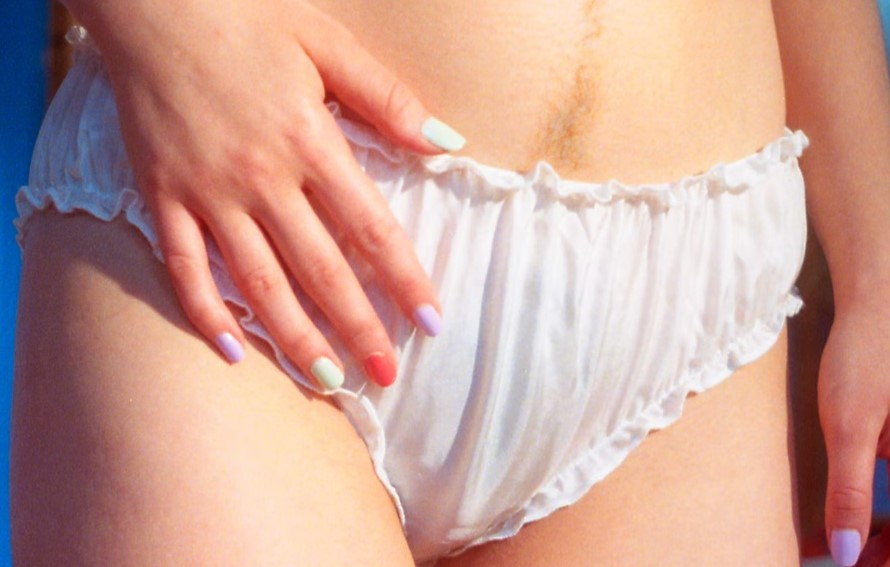
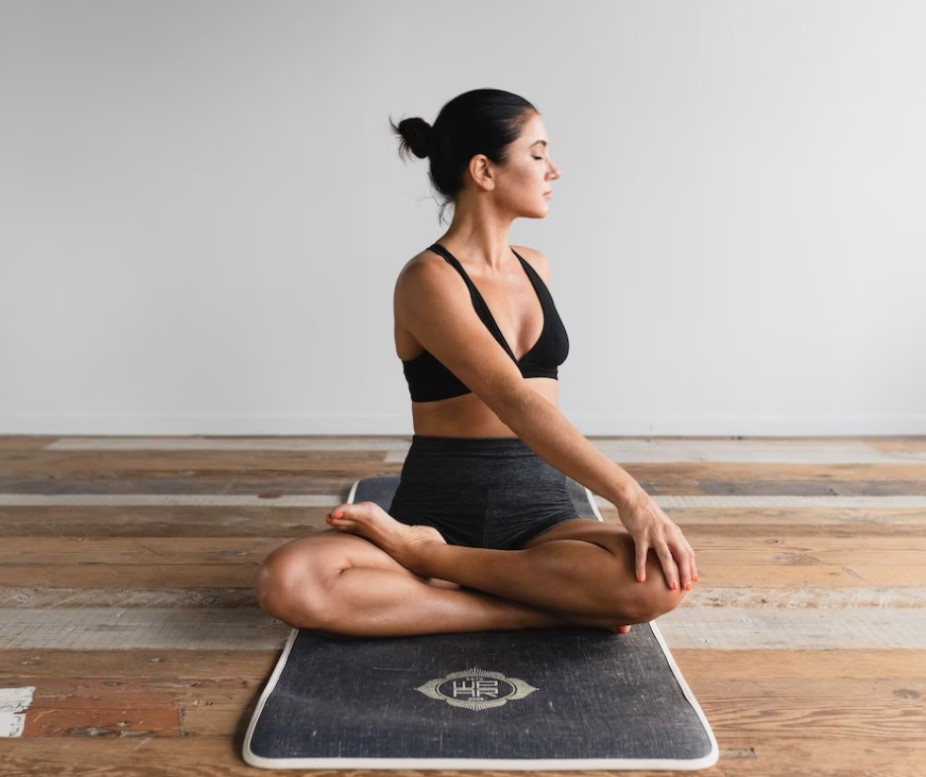

This article has been written and researched by our expert Loveable through a precise methodology. [Learn more about our methodology](https://avada.io/loveable/our-methodological.html)

[Loveable](https://avada.io/loveable/) > [Blog](https://avada.io/loveable/blog/) > [Parenting](https://avada.io/loveable/parenting/)

# Postpartum Recovery: Everything you should know

Written by [Benjamin Collins](https://avada.io/loveable/author/benjamin/) Last Updated on August 25, 2023

- [Physical recovery](https://avada.io/loveable/blog/postpartum-recovery-tips/#wp-block-heading-2-3)
    - [Changes happen to the postpartum body](https://avada.io/loveable/blog/postpartum-recovery-tips/#wp-block-heading-3-4)
        - [Bleeding and vag discharge](https://avada.io/loveable/blog/postpartum-recovery-tips/#wp-block-heading-4-5)
        - [Vagin soreness](https://avada.io/loveable/blog/postpartum-recovery-tips/#wp-block-heading-4-8)
        - [Aching breasts](https://avada.io/loveable/blog/postpartum-recovery-tips/#wp-block-heading-4-10)
        - [Postpartum contractions](https://avada.io/loveable/blog/postpartum-recovery-tips/#wp-block-heading-4-13)
    - [Frequent symptoms and ways to control](https://avada.io/loveable/blog/postpartum-recovery-tips/#wp-block-heading-3-15)
        - [Hormone changes after childbirth](https://avada.io/loveable/blog/postpartum-recovery-tips/#wp-block-heading-4-16)
        - [Tiredness](https://avada.io/loveable/blog/postpartum-recovery-tips/#wp-block-heading-4-18)
        - [Sweat dreams](https://avada.io/loveable/blog/postpartum-recovery-tips/#wp-block-heading-4-20)
    - [Tips for health recovering](https://avada.io/loveable/blog/postpartum-recovery-tips/#wp-block-heading-3-23)
        - [Ask for help whenever needed](https://avada.io/loveable/blog/postpartum-recovery-tips/#wp-block-heading-4-24)
        - [Use 100% cotton underwear](https://avada.io/loveable/blog/postpartum-recovery-tips/#wp-block-heading-4-26) 
        - [Soothe by the ice pack](https://avada.io/loveable/blog/postpartum-recovery-tips/#wp-block-heading-4-29)
        - [Shower with a sitz bath](https://avada.io/loveable/blog/postpartum-recovery-tips/#wp-block-heading-4-31)
        - [Use nursing products](https://avada.io/loveable/blog/postpartum-recovery-tips/#wp-block-heading-4-34)
- [Emotional Well Being](https://avada.io/loveable/blog/postpartum-recovery-tips/#wp-block-heading-2-36)
    - [Definition and symptoms of postpartum depression](https://avada.io/loveable/blog/postpartum-recovery-tips/#wp-block-heading-4-37)
    - [Tips to avoid postpartum depression](https://avada.io/loveable/blog/postpartum-recovery-tips/#wp-block-heading-4-41)

- [Nutrition and exercise](https://avada.io/loveable/blog/postpartum-recovery-tips/#wp-block-heading-2-44)
    - [Postpartum nutrition](https://avada.io/loveable/blog/postpartum-recovery-tips/#wp-block-heading-4-46)
    - [Postpartum exercise](https://avada.io/loveable/blog/postpartum-recovery-tips/#wp-block-heading-4-49)
    - [Tips to keep fit after birth](https://avada.io/loveable/blog/postpartum-recovery-tips/#wp-block-heading-4-52)
- [Sexuality and birth control](https://avada.io/loveable/blog/postpartum-recovery-tips/#wp-block-heading-2-55)
    - [Have sex after birth](https://avada.io/loveable/blog/postpartum-recovery-tips/#wp-block-heading-4-56)
    - [Birth control postpartum](https://avada.io/loveable/blog/postpartum-recovery-tips/#wp-block-heading-4-60) 
- [Conclusion](https://avada.io/loveable/blog/postpartum-recovery-tips/#wp-block-heading-2-64)

The long-awaited moment has arrived. You’re undoubtedly thrilled to be back with your new baby within a period of 9 months of waiting. In the weeks and days following childbirth, your health and emotions will undergo significant changes. Most of your attention and energy will be focused on your baby in the coming weeks and months, but remember that you must also take care of yourself by postpartum recovery. 

To successfully have Postpartum Recovery, you must acknowledge and follow many steps to bring your health and body back to normal. This “**Postpartum Recovery: Everything you should know**” article will not let you down. First of all, it is your body; you will have to know what is going on with your weight and your whole body as well in order to control all of the symptoms. Then you will have to heal your mind to prevent postpartum depression, take some proper exercise and nutritious meals, and have sex and birth control to protect yourself. Read this consciously, as you may need all of this information.

## Physical recovery

### Changes happen to the postpartum body

#### Bleeding and vag discharge

You may experience mild vaginal bleeding and discharge, also referred to as lochia, when your uterus sheds the thick lining it maintained throughout your [pregnancy](https://avada.io/loveable/congratulation-gifts-for-pregnancy/). The color of Lochia will initially be bright red for one or two days before fading over time to pink, light pink, light brown, or light yellow. After having your baby, bleeding and discharge will occur at their heaviest for the first few days before becoming lighter. Lochia typically lasts 4-6 weeks, with output gradually getting smaller.

#### Vagin soreness

The strain of childbirth will cause your vagina and groin area (the area between your vaginal and scrotum) to become exceedingly sensitive and sore. If you gave vaginal childbirth, you’ll most likely need a few weeks of recuperation, particularly if your pelvic floor began to tear or you had an endoscopy. If you did not labor or push at all but gave delivery via C-section, you will almost certainly be sore.

#### Aching breasts

During the start of your pregnancy, your breasts have changed. Your breasts will begin to fill with milk from around the third or fourth days following giving birth, which will be the next significant change you’ll notice. It’s possible for your breasts to engorge and feel stiff, puffy, and sore. And if your next treatment is a little delayed, you might feel that sensitive, heavy feeling more intensely.

#### Postpartum contractions

Contractions after birth, often known as after-birth pains, may be difficult at times, but they are nothing like the pain you might have felt during labor. Contractions after birth, on the other hand, are a healthy sign. After-birth contractions help to minimize uterine bleeding and return your uterus to its pre-baby size. If you nurse, you may experience the most after-birth pains. This is due to the fact that breastfeeding induces the production of dopamine, a hormone that stimulates uterine contractions.

### Frequent symptoms and ways to control

#### Hormone changes after childbirth

Your body uses hormones as chemical messengers to instruct it on what to do and when to do it. Your hormones are altered during pregnancy to promote your unborn child’s development and prepare your body for labor. Your hormones are now on a special assignment to aid in your recovery, foster a bond with your newborn, and, if you so want, aid in breastfeeding. But you do not have to do it all the time, as hormones can change more positively by your positive thought. Enjoy your [relaxing after birth](https://avada.io/loveable/relaxing-gifts-mom/) time and your mental health will definitely get better.

#### Tiredness

Another very typical postpartum sensation is fatigue. Again, getting the rest you require is critical because your body has recently undergone (and is still undergoing) a lot. Many healthcare professionals advise sleeping whenever your infant does. Right now, your well-being and that of your infant are of utmost importance. Over time, eating well and drinking plenty of water will also aid in energy restoration and maintenance.

#### Sweat dreams

Numerous people report having night sweats after giving birth because of their hormones shifting. However uncomfortable they may be, they are nothing to be concerned about. Just be careful to have enough water, and try to keep cool. In a few weeks, night sweats ought to stop. Just keep being positive and have nutritious meals and your sweaty dreams will disappear in a short period of time.

### Tips for health recovering

#### Ask for help whenever needed

As you accomplished a significant feat that not everyone can. Everyone close to you, including your family, friends, and other relatives, will be concerned for you no matter what. Particularly your partner can be a helpful resource for you while you heal. Be prepared to ask for and receive support with tasks, meals, and anything else because you have a big job to perform. When you need assistance, don’t be afraid to ask; you’ll find that everyone is willing to assist you.

#### Use 100% cotton underwear 

Cotton can wick moisture away and is breathable. Choose underwear you’ll be happy to toss away if it gets stained because you’ll be bleeding intermittently for several weeks and heavier at first. Also, you can purchase disposable cotton underwear that is comparable to what the doctor will provide you. Don’t forget to ask the hospital for a few different pairs of disposable underwear. Many people discover them to be quite cozy, especially in the initial days following childbirth.

#### Soothe by the ice pack

Several types of ice packs will work well to reduce pain and inflammation. Even wearable ice pads are available for the vaginal and perineal regions. Yet, the tried-and-true ice pack in a towel would still work miracles. Furthermore, ice packs help ease the pain of uncomfortable or engorged breasts.

#### Shower with a sitz bath

You can also calm discomfort and clean your groin area by taking a sitz bath, which is a simple procedure that involves sitting in warm, shallow water. You can get a package with a plastic container that attaches to your toilet or have a sitz bath in the bathtub. You can make use of the witch hazel pads – which can be used to relieve perineal discomfort as well as postpartum hemorrhoids.

#### Use nursing products

For the best experience as a postpartum mother, use breastfeeding products. Nursing bras are made to provide you with support and ease of use without rubbing against delicate skin. Also, they have flaps that extend to make it simple for your baby to eat while you wear a bra. Moreover, nursing pads sit comfortably within your bra to catch leaks and stop a wet shirt from happening. If you prefer, you can buy either disposable or reusable pads. Throughout the day, both must be replaced.

## Emotional Well Being

#### Definition and symptoms of postpartum depression

Even though you might still feel pleased with the home, you might also start to experience overwhelming, unsure, frustrated, or nervous feelings. Depression can interfere with how you take care of yourself and your child if it is not treated. This can exacerbate depression by causing guilt- and low self-esteem-related feelings.

Postpartum depression affects new mothers in varying degrees in about one out of every five cases. This commonly appears during the fourth week of birth. It can also start right after weaning, right before your period comes back, or at any point in the first year. These symptoms, such as nervousness, worry, panic, etc., may be present in one or more of you; they might be moderate or so intense that you may feel as if you’re “going insane.”

#### Tips to avoid postpartum depression

You could experience “good” and “poor” days when you have depression. You must seek assistance and support since these emotions won’t go away on their own. This adjustment period might be made simpler by decreasing other engagements and welcoming offers of assistance.

It is possible to manage symptoms with medication, talk therapy, or both. Discuss your feelings with your healthcare practitioner. You should also get as much sleep as you can. Don’t put yourself under unnecessary stress by enlisting aid for household duties and nighttime feedings. Talking with relatives and close companions about the way you’re feeling can be quite beneficial since you can describe exactly how you feel and they’ll be able to tell you anything.

## Nutrition and exercise

Your path to recuperation after being pregnant or giving birth is influenced by a number of factors. Nutrition and exercise are two of these elements. Although it could take longer or shorter than anticipated to recover completely, adhering to these postpartum nutrition and exercise recommendations will hasten your recovery. Your total wellness, in addition to your mental and physical well-being, might be enhanced by it.

#### Postpartum nutrition

As essential to how you fueled your health throughout your first three trimesters is how you fed it during the fourth. If you’re nursing, a good diet is crucial for your baby’s development and health and also for your own physical and mental well-being. A balanced diet provides all of the nutrients you need through a range of meals.

But bear in mind that you don’t have to acquire a calorie tracker and log every calorie you consume. It is just beneficial to be aware of your daily caloric intake in general. So be sure to include nutritious snacks in your postpartum diet in addition to your regular daily meals.

#### Postpartum exercise

To maintain the best possible physical and mental health, you must engage in appropriate exercise each day. You can take it simply by starting to walk out with your partner. In order to obtain extra activity minutes, you could also take a 10-minute walk on each of the seven days and then intersperse that with postnatal yoga. Because walking is easy on the body, it makes for a fantastic postpartum workout. Most new mothers are able to walk immediately after giving childbirth. Also, walking is healthy for both you and your infant. It enables you to move around, breathe some fresh air, and take your new baby carrier or stroller to good use!

#### Tips to keep fit after birth

You should benefit from at-home workouts if you want a good figure after giving birth to a baby. The best method to gradually return to fitness after having birth is with at-home routines. Because you don’t have to be concerned with leaving your home or your infant, it’s also the more practical approach to exercise. You can even work out at home while your child is with you. You only need a baby carrier and an open space for several of these activities. Others might require a yoga mat, a stability ball, or dumbbells.

After having a baby, the first few workouts can be challenging and difficult. But that doesn’t imply you will give up just because something is challenging or uncomfortable for you. Despite the fact that it takes you longer than you anticipated, finish the first few postpartum workouts. You might want to drink more water and take more pauses. Yet, remember that discomfort and pain are two distinct things. Be aware of your body. If you have discomfort while exercising, stop immediately, and don’t wait to consult a physician or midwife to confirm whether your symptoms are typical or not.

## Sexuality and birth control

#### Have sex after birth

Whether you’ve had a traumatic pregnancy, have painful sutures, or have spent numerous sleepless nights, sex might be the final thing on your mind. But after your body recovers and caring for your child becomes less difficult, you’ll probably feel more prepared for sex.

Normal sexual preferences and behaviors may alter in the period of time following birth. After birth, you could feel so attached to your partner that you’d like to engage in sex soon. Postpartum sex could be difficult for some people. Sexual relationships frequently develop over the course of parenting’s highs and lows. As a result, it is wise to hold off till bright red vaginal bleeding has ended. Ask your healthcare professional if you are unclear about what is best for you or whether it is acceptable to have sex after giving birth.

#### Birth control postpartum 

The fact that it’s possible to become pregnant before your period resumes is the most crucial fact to understand regarding postpartum sex. The body returns to its usual reproductive processes after giving birth. To avoid problems, you should be aware of your alternatives for contraceptive methods after giving birth before engaging in sexual activity again.

There are numerous birth control methods available to prevent postpartum pregnancies. Your healthcare practitioner can assist you in locating one that suits your health and your needs. This may be a significant subject for discussion throughout your postpartum sessions. Barrier treatments, hormonal approaches, non-hormonal intrauterine devices (IUDs), lactational amenorrhea (LAM), and surgical sterilization are some of the options. It’s crucial to keep in mind that only condoms offer protection against STDs 

**_Check Out_**: Best [Postpartum Gifts for New Moms](https://avada.io/loveable/gifts-new-moms-after-birth/) After Birth

## Conclusion

You have gone through one of your life’s most difficult yet unforgettable experiences, and you will now have to endure several changes you have never experienced before. No matter how well-prepared you are, you may be surprised by some of the physical and mental changes you go through throughout your **postpartum recovery** phase. 

We have listed some of the most pronounced things to be noticed in your postpartum period that you should take a close look at in order not to miss any key information. We, therefore, hope that you recognize the significance of postpartum recovery and have an understanding of it after reading this article. 

- [Physical recovery](https://avada.io/loveable/blog/postpartum-recovery-tips/#wp-block-heading-2-3)
    - [Changes happen to the postpartum body](https://avada.io/loveable/blog/postpartum-recovery-tips/#wp-block-heading-3-4)
        - [Bleeding and vag discharge](https://avada.io/loveable/blog/postpartum-recovery-tips/#wp-block-heading-4-5)
        - [Vagin soreness](https://avada.io/loveable/blog/postpartum-recovery-tips/#wp-block-heading-4-8)
        - [Aching breasts](https://avada.io/loveable/blog/postpartum-recovery-tips/#wp-block-heading-4-10)
        - [Postpartum contractions](https://avada.io/loveable/blog/postpartum-recovery-tips/#wp-block-heading-4-13)
    - [Frequent symptoms and ways to control](https://avada.io/loveable/blog/postpartum-recovery-tips/#wp-block-heading-3-15)
        - [Hormone changes after childbirth](https://avada.io/loveable/blog/postpartum-recovery-tips/#wp-block-heading-4-16)
        - [Tiredness](https://avada.io/loveable/blog/postpartum-recovery-tips/#wp-block-heading-4-18)
        - [Sweat dreams](https://avada.io/loveable/blog/postpartum-recovery-tips/#wp-block-heading-4-20)
    - [Tips for health recovering](https://avada.io/loveable/blog/postpartum-recovery-tips/#wp-block-heading-3-23)
        - [Ask for help whenever needed](https://avada.io/loveable/blog/postpartum-recovery-tips/#wp-block-heading-4-24)
        - [Use 100% cotton underwear](https://avada.io/loveable/blog/postpartum-recovery-tips/#wp-block-heading-4-26) 
        - [Soothe by the ice pack](https://avada.io/loveable/blog/postpartum-recovery-tips/#wp-block-heading-4-29)
        - [Shower with a sitz bath](https://avada.io/loveable/blog/postpartum-recovery-tips/#wp-block-heading-4-31)
        - [Use nursing products](https://avada.io/loveable/blog/postpartum-recovery-tips/#wp-block-heading-4-34)
- [Emotional Well Being](https://avada.io/loveable/blog/postpartum-recovery-tips/#wp-block-heading-2-36)
    - [Definition and symptoms of postpartum depression](https://avada.io/loveable/blog/postpartum-recovery-tips/#wp-block-heading-4-37)
    - [Tips to avoid postpartum depression](https://avada.io/loveable/blog/postpartum-recovery-tips/#wp-block-heading-4-41)

- [Nutrition and exercise](https://avada.io/loveable/blog/postpartum-recovery-tips/#wp-block-heading-2-44)
    - [Postpartum nutrition](https://avada.io/loveable/blog/postpartum-recovery-tips/#wp-block-heading-4-46)
    - [Postpartum exercise](https://avada.io/loveable/blog/postpartum-recovery-tips/#wp-block-heading-4-49)
    - [Tips to keep fit after birth](https://avada.io/loveable/blog/postpartum-recovery-tips/#wp-block-heading-4-52)
- [Sexuality and birth control](https://avada.io/loveable/blog/postpartum-recovery-tips/#wp-block-heading-2-55)
    - [Have sex after birth](https://avada.io/loveable/blog/postpartum-recovery-tips/#wp-block-heading-4-56)
    - [Birth control postpartum](https://avada.io/loveable/blog/postpartum-recovery-tips/#wp-block-heading-4-60) 
- [Conclusion](https://avada.io/loveable/blog/postpartum-recovery-tips/#wp-block-heading-2-64)

### [Benjamin Collins](https://avada.io/loveable/author/benjamin/)

I'm Benjamin Collins, a gift ideas creator at Loveable. We specialize in unique and personalized gifts for any occasion. With my honed skills, I recommend gifts tailored to the recipient's personality and interests, whether it's Halloween, Christmas, or any other celebration.

- [Twitter](https://twitter.com/intent/tweet)
- [Facebook](https://www.facebook.com/sharer/sharer.php)
- [instagram](https://avada.io/loveable/blog/postpartum-recovery-tips/)
- [pinterest](https://www.pinterest.com/loveablellc/)

## Related Posts

[

### 79 Heartfelt Missing Mom Quotes for Expressing Love and Longing

](https://avada.io/loveable/blog/missing-mom-quotes/)

[

### Parenting with Depression: Strategies for Coping, Seeking Help, and Building Resilience

](https://avada.io/loveable/blog/parenting-with-depression/)

[

### 100 Empowering Single Mom Quotes: Inspirational Words for Strong Mothers

](https://avada.io/loveable/blog/single-mom-quotes/)

[

### 99+ Heartfelt Quotes And Wishes: Happy Anniversary to Mom and Dad!

](https://avada.io/loveable/blog/quotes-happy-anniversary-mom-dad/)

[

### 5 Ways to Foster a Positive Parent-Teacher Relationship

](https://avada.io/loveable/blog/parent-teacher-relationship/)
