This article has been written and researched by our expert Loveable through a precise methodology. [Learn more about our methodology](https://avada.io/loveable/our-methodological.html)

[Loveable](https://avada.io/loveable/) > [Blog](https://avada.io/loveable/blog/) > [Holiday](https://avada.io/loveable/holiday/)

# Quick and Easy Halloween Eyeliner Ideas In 2023

Written by [Blake Simpson](https://avada.io/loveable/author/blake/) Last Updated on September 25, 2023

- [The Role of Eyeliner in Creating Halloween Looks](https://avada.io/loveable/blog/halloween-eyeliner/#wp-block-heading-2-3)
- [Ideas for Halloween Looks Using Eyeliner](https://avada.io/loveable/blog/halloween-eyeliner/#wp-block-heading-2-8)
    - [1\. Lace](https://avada.io/loveable/blog/halloween-eyeliner/#wp-block-heading-3-9)
    - [2\. Batwing](https://avada.io/loveable/blog/halloween-eyeliner/#wp-block-heading-3-18)
    - [3\. Ghost liner](https://avada.io/loveable/blog/halloween-eyeliner/#wp-block-heading-3-27)
    - [4\. Cobweb eye](https://avada.io/loveable/blog/halloween-eyeliner/#wp-block-heading-3-36)
    - [5\. Classic cat](https://avada.io/loveable/blog/halloween-eyeliner/#wp-block-heading-3-45)
    - [6\. Jack Skellington](https://avada.io/loveable/blog/halloween-eyeliner/#wp-block-heading-3-54)
    - [7\. Retro Pop Art Filer](https://avada.io/loveable/blog/halloween-eyeliner/#wp-block-heading-3-63)
    - [8\. Wonderwoman](https://avada.io/loveable/blog/halloween-eyeliner/#wp-block-heading-3-71)
- [Tips for Achieving Flawless Halloween Eyeliner Looks](https://avada.io/loveable/blog/halloween-eyeliner/#wp-block-heading-2-80)
    - [1\. Choosing the right type of eyeliner (liquid, pencil, gel)](https://avada.io/loveable/blog/halloween-eyeliner/#wp-block-heading-3-81)
    - [2\. Practicing precision and control in the application](https://avada.io/loveable/blog/halloween-eyeliner/#wp-block-heading-3-85)
    - [3\. Utilizing makeup brushes or cotton swabs for touch-ups and clean lines](https://avada.io/loveable/blog/halloween-eyeliner/#wp-block-heading-3-88)
- [Removing Halloween Eyeliner](https://avada.io/loveable/blog/halloween-eyeliner/#wp-block-heading-2-91)
    - [1\. Gentle makeup removal techniques for sensitive eye areas](https://avada.io/loveable/blog/halloween-eyeliner/#wp-block-heading-3-92)
    - [2\. Avoiding smudging and smearing during the removal](https://avada.io/loveable/blog/halloween-eyeliner/#wp-block-heading-3-95)
    - [3\. Recommended makeup removers for a waterproof or long-lasting eyeliner](https://avada.io/loveable/blog/halloween-eyeliner/#wp-block-heading-3-97)
- [To Conclude,](https://avada.io/loveable/blog/halloween-eyeliner/#wp-block-heading-2-102)

Get ready to elevate your Halloween makeup game with the power of eyeliner! In this post, we’ll delve into the world of Halloween eyeliner and discover how this versatile tool can help you create effortless and stunning Halloween looks. Whether you’re aiming for a bewitching cat-eye, a creepy spiderweb design, or intricate geometric patterns, eyeliner is your secret weapon. 

We’ll explore various techniques, tips, and tricks to make the most of this magical tool, allowing you to transform your eyes into mesmerizing works of art. With the simplicity and precision of eyeliner, you can achieve incredible effects and bring your Halloween costume to life. So, grab your favorite eyeliner and get ready to unlock the potential of this makeup essential. Let’s dive into the realm of **Halloween eyeliner** and unleash your creativity!

## **The Role of Eyeliner in Creating Halloween Looks**

Eyeliner plays a pivotal role in creating captivating and transformative Halloween looks. With its precise application and versatility, this magical tool can enhance any costume and bring out the essence of [Halloween characters.](https://avada.io/loveable/blog/famous-halloween-cartoon-characters/)

First and foremost, eyeliner allows for the creation of bold and dramatic eyes. Whether it’s a seductive cat eye for a feline-inspired look or dark, smoky eyes for a witch or vampire, eyeliner adds depth and intensity to the overall aesthetic. It defines the eyes, making them the focal point of the costume.

Moreover, eyeliner enables the incorporation of intricate details and designs. From spiderwebs to intricate geometric patterns, eyeliner’s fine tip allows for precise lines and shapes, creating stunning effects that elevate the [Halloween photos](https://avada.io/loveable/blog/halloween-photoshoot-ideas/) to a whole new level. The possibilities are endless, limited only by one’s imagination.

Additionally, eyeliner can be used to evoke specific characters or themes. Whether it’s the iconic stitches of Frankenstein’s monster or the haunting tears of a broken doll, eyeliner helps to bring these elements to life, adding authenticity and flair to the overall ensemble.

## **Ideas for Halloween Looks Using Eyeliner**

### **1\. Lace**

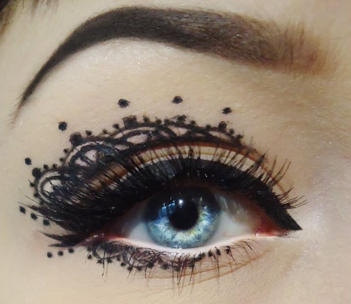

If you’re looking for the perfect Halloween eyeliner, why not try out the lace eyeliner makeup technique? It may require a very steady hand, but the results are worth it! You can pair this gothic look with your favorite little black dress for a spooky and stylish Halloween outfit. 

To achieve this look, you can watch renowned makeup artist Hindash create a step-by-step tutorial on how to create the perfect lace eyeliner. Don’t be afraid to experiment with different colors and designs to make this Halloween eyeliner look all your own!

Take a look:

[Maybelline New York Hyper Precise Eyeliner](https://www.amazon.com/Maybelline-eyeliner-master-precise-matita/dp/B07DS6HBGT)

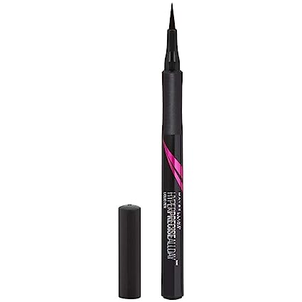

This ultra-thin, 0.4 mm felt-tip liquid eyeliner is the perfect tool to help you create the spookiest of looks. With its black pigment, it’s easy to create a bold and dramatic look that will leave everyone in awe. 

The long-lasting formula won’t smudge or fade, so you can party all night long without worrying about touch-ups. Whether you’re going for a classic cat-eye or a more intricate design, this black eyeliner is a must-have for any Halloween look. Get yours now and make heads turn!

### **2\. Batwing**

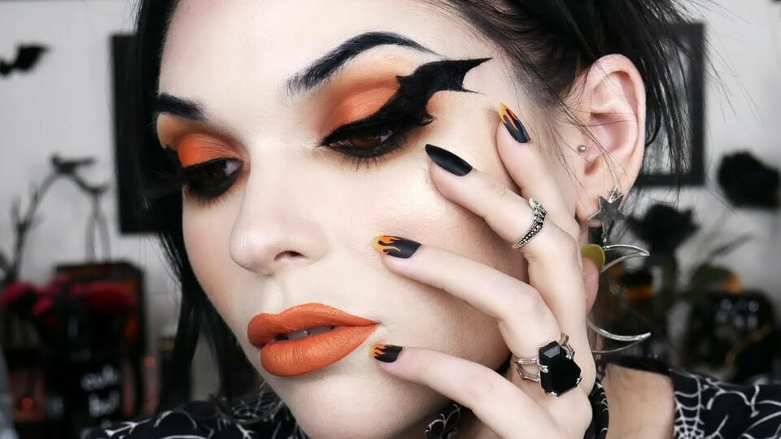

Halloween is all about going all out with your makeup game, and what better way to up the ante than with some Batwing eyeliner? This edgy and dramatic look is perfect for those who want to make a statement this spooky season. 

To achieve this look, start by perfecting your winged liner game and then add a few more steps to create the desired effect. Whether you’re going for a lowkey Halloween look or want to take your makeup from zero to hero, the Batwing eyeliner is definitely something worth considering this holiday season.

Take a look:

[Stila Stay All Day Waterproof Liquid Eyeliner](https://www.amazon.com/stila-Stay-Waterproof-Liquid-Liner/dp/B0781VL1G4)

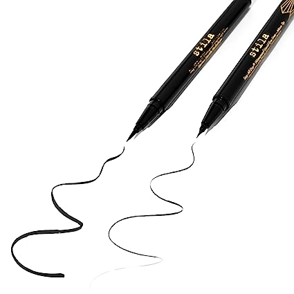

This intense black eyeliner will give you the perfect cat-eye or dramatic wing that will last day into night. With its micro tip, the formula glides on with ease, making it perfect for precise application. 

And the best part? It won’t smudge, no matter how much you dance or sweat. Transform your look into something spooky and mysterious with this Halloween eyeliner that will leave everyone in awe. Don’t settle for anything less than the best – grab your Stila Stay All Day Waterproof Liquid Eyeliner now and get ready to turn heads!

### **3\. Ghost liner**

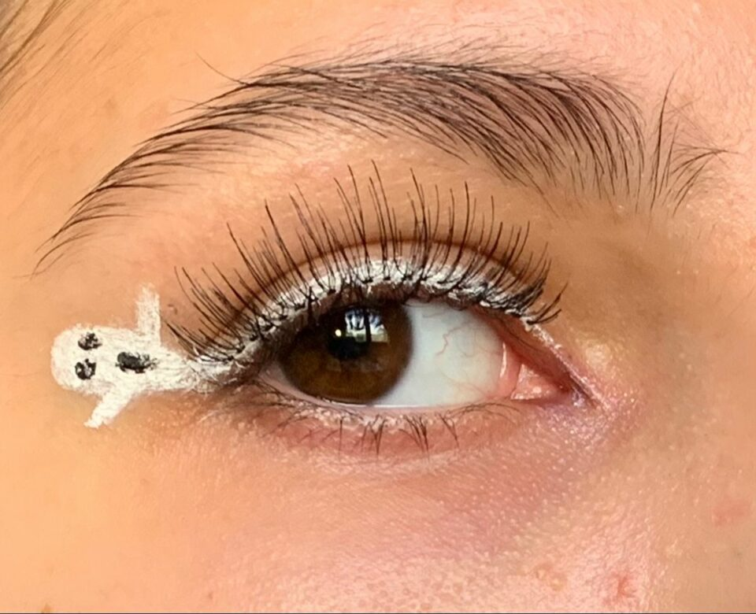

Looking for an easy yet impressive Halloween [makeup idea](https://avada.io/loveable/makeup-gifts/)? Try out the Ghost Liner makeup! It is a fun and unique way to elevate your everyday cat eye and is perfect for the spooky season. 

All you need is a white liquid eyeliner and a steady hand to create a teeny tiny ghost graphic that will surely turn heads. This Halloween eyeliner will take your Instagram grid to the next level!

Take a look:

[Pencil Eyeliner by Revlon](https://www.amazon.com/REVLON-Waterproof-Smudgeproof-Longwearing-Ultra-Fine/dp/B000H3EO3O)

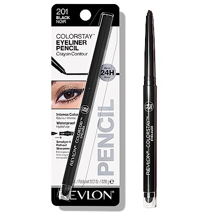

It’s time to unleash your inner artist with Revlon’s Pencil Eyeliner! This ColorStay Eye Makeup is the perfect addition to your Halloween makeup kit. Its ultra-fine tip makes it easy to create intricate designs and the waterproof, smudge-proof, and long-wearing formula ensures your look stays put all night long. 

With a built-in sharpener, you can create sharp lines or bold strokes effortlessly. And the intense black shade of 201 Black will make your eyes pop! Whether you’re going for a spooky look or a dramatic cat-eye, this Halloween eyeliner is a must-have.

### **4\. Cobweb eye**

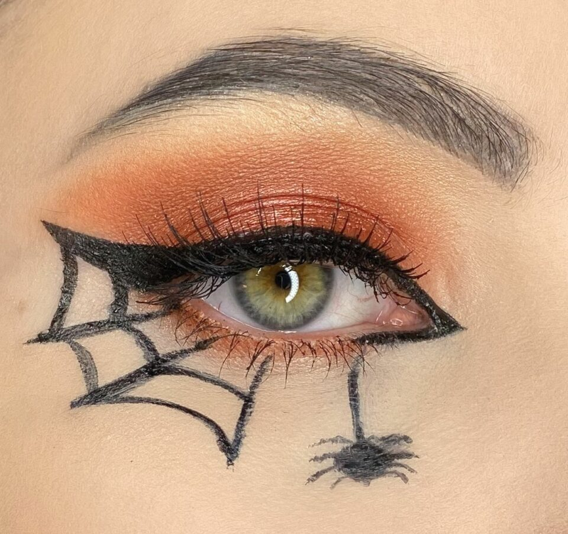

If you’re looking for an easy and spooky makeup look for Halloween, the cobweb eye is an excellent choice. This dramatic look is perfect for those who want to channel their inner ghoul without going overboard. With just a few carefully applied strokes of your liquid eyeliner, you can create a web-like effect around your eye that will have everyone at the party talking. 

And if you really want to take this look to the next level, pair it with a set of dramatic false lashes for added drama and impact. So this Halloween, why not try something different and experiment with this creepy yet chic Halloween eyeliner trend.

Take a look:

[FENTY BEAUTY Flyliner Longwear Liquid Eyeliner](https://www.amazon.com/BEAUTY-RIHANNA-Flyliner-Longwear-Eyeliner/dp/B07FBB4F6H)

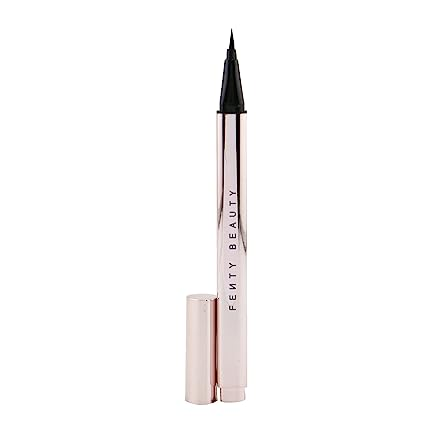

Get ready to slay this Halloween season with the FENTY BEAUTY Flyliner Longwear Liquid Eyeliner! This paraben-free, phthalate-free, and sulfate-free eyeliner is a must-have for your spooky looks. The matte finish will give your eyes an eerie allure, and the travel size makes it perfect for on-the-go touch-ups. 

Whether you’re going for a sultry cat-eye or a bold graphic design, this Halloween eyeliner will keep your look fierce and flawless all night long. Don’t let your makeup fade away before the witching hour – grab your FENTY BEAUTY Flyliner Longwear Liquid Eyeliner now!

### **5\. Classic cat**

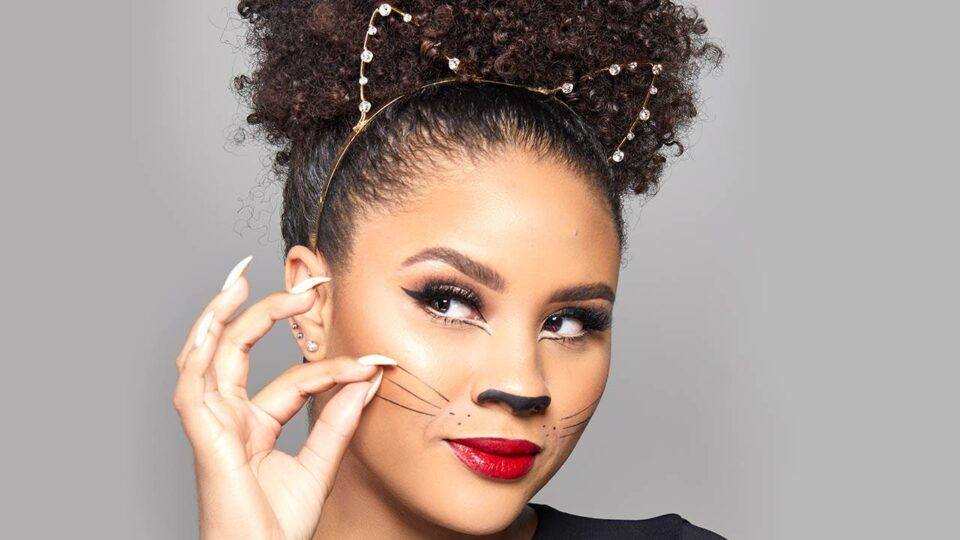

The classic cat look is a Halloween favorite that never goes out of style. To achieve this cute/[sexy style](https://avada.io/loveable/sexy-halloween-costumes/), all you need is a steady hand and some eyeliner! 

Using black eyeliner, draw a line from the inner corner of your eye to the outer corner, flicking it outwards to create a wing. Then, draw a small triangle on your nose and add some whiskers on each cheek. With these simple steps, you’ll be able to rock the classic cat look with ease while saving some money.

Take a look:

[Benefit Roller Liner True Matte Liquid Eyeliner](https://www.amazon.com/Benefit-Roller-Liner-Eyeliner-Black/dp/B07NPSLCK2)

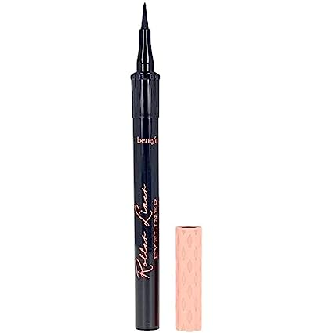

This quick-drying, waterproof formula will last for 24 hours, ensuring your makeup stays put through all the spooky festivities. The natural matte finish will give you a sultry and mysterious look that will make you stand out from the crowd. 

Don’t worry about fading, flaking, bleeding, or smudging, this eyeliner is designed to stay put no matter what. Get your Halloween eyeliner game on point with the Benefit Roller Liner True Matte Liquid Eyeliner and let the good times roll! Get yours now and be the talk of the town!

### **6\. Jack Skellington**

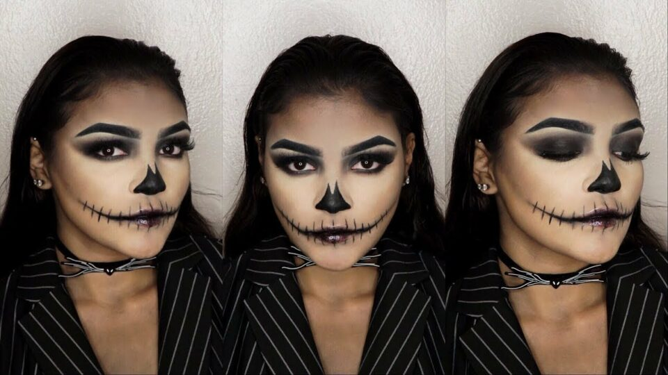

To enhance your Halloween look with a touch of spooky charm, black eyeliner is a must-have addition. And if you really want to up your game, make sure to add a generous amount of black eyeshadow to the mix. 

Blending the two will give you the perfect smoky eye effect that’s sure to terrify your friends. However, be warned that licking your lips is a big no-no, as it can ruin the whole look.

Take a look:

[L.A. Girl Gel Liner Kit](https://www.amazon.com/L-Girl-Gel-Liner/dp/B0084EC5CU)

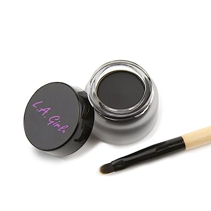

The very black, 0.10-ounce gel liner comes with a professional-grade brush applicator for smooth and precise application. The long-lasting, smudge-resistant formula ensures that your liner stays put all night long while you party the night away. 

Create dramatic cat-eye looks or go for a sexy smoky eye with this versatile kit. Don’t miss out on the chance to elevate your Halloween makeup game – get your L.A. Girl Gel Liner Kit today!

### **7\. Retro Pop Art Filer**

If you want to add a unique touch to your Halloween makeup, then you should definitely try the retro pop art filer. This look is not for the faint of heart, but it’s worth the effort if you’re up for the challenge. With this eye-catching style, you can channel your inner pop art icon and make a statement at any Halloween party. 

To achieve this look, start by applying a bold and vibrant eyeshadow. Next, use a steady hand to create an exaggerated cat-eye with black eyeliner. Finally, add some white dots to the eyeliner to complete the pop art effect. With this look, you’ll be sure to turn heads and make a memorable impression!

Take a look:

[L.A. Girl Shockwave Neon Eyeliner](https://www.amazon.com/L-Girls-Shockwave-Eyeliner-Electric/dp/B07HHJV4NK)

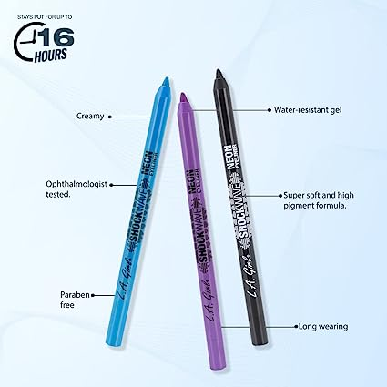

Get ready to electrify your look with the L.A. Girl Shockwave Neon Eyeliner! The smooth formula glides on effortlessly, providing a rich color payout that lasts all day and night. Whether you’re hitting the club or running errands, our water-resistant formula will keep your eyes looking bold and beautiful. With a range of vibrant neon shades, you’ll be sure to turn heads wherever you go!

### **8\. Wonderwoman**

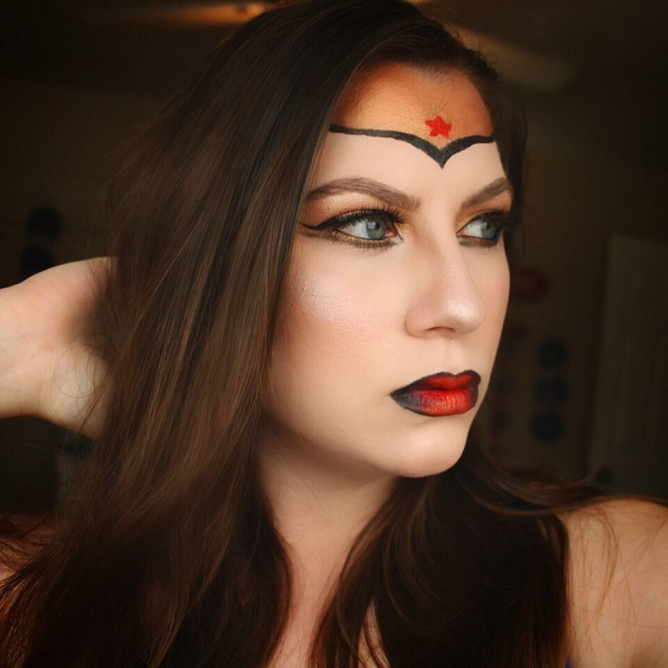

If you’re looking to create a unique Halloween makeup look, why not try the Wonder Woman comic book look? With the right products and a bit of practice, you can turn heads and impress your friends. 

To achieve this stunning look, you’ll need to focus on the eyes. Use bold eyeliner to create dramatic lines and make your eyes pop. And don’t worry if you don’t quite match up to NikkieTutorials’ level – with a bit of effort, you can still slay this look!

Take a look:

[Highliner – Gel Crayon Marc Jacobs](https://www.amazon.com/Highliner-Crayon-Jacobs-Beauty-Blacquer/dp/B01EQFOSAW)

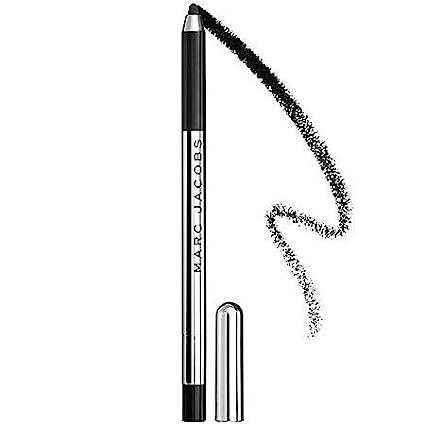

This waterproof gel crayon is perfect for creating dramatic, shimmery eyes that last all day. With its smooth, gel-like texture, you can easily glide it on for a bold and precise finish. The black color is intense and perfect for any occasion, whether you’re going for a subtle daytime look or a bold nighttime statement. 

As a trusted brand, Marc Jacobs has created an exceptional product that will take your look to the next level. Don’t wait to enhance your beauty routine with Highliner – Gel Crayon Marc Jacobs Beauty 0.1 Oz Blacquer – Black.

## **Tips for Achieving Flawless Halloween Eyeliner Looks**

### **1\. Choosing the right type of eyeliner (liquid, pencil, gel)**

Choosing the right type of eyeliner is a crucial step in achieving flawless Halloween looks. Each type – liquid, pencil, and gel – offers unique advantages. 

Liquid eyeliners provide intense pigmentation and precise lines, perfect for creating intricate designs or dramatic cat eyes. Pencil eyeliners offer versatility and ease of application, allowing for both soft and bold looks. Gel eyeliners, with their creamy texture, provide the smoothness needed for precise lines and are great for creating smoky or graphic effects. 

By selecting the appropriate eyeliner type based on your desired effect and personal preference, you’ll have the right tool to bring your Halloween look to life with seamless precision.

### **2\. Practicing precision and control in the application**

Practicing precision and control during application is key to achieving flawless Halloween eyeliner looks. Start with thin lines and gradually build up thickness, ensuring evenness in both eyes. Remember to steady your hand and apply gentle strokes, as rushing can lead to uneven lines or mistakes. 

When creating intricate designs, take your time and use small, deliberate movements for precise detailing. Practicing your technique beforehand will help you gain confidence and improve your precision, resulting in impeccable Halloween eyeliner looks.

### **3\. Utilizing makeup brushes or cotton swabs for touch-ups and clean lines**

A fine-tipped brush can be used for touch-ups and refining edges, allowing for precise corrections and adding finer details to your design. Makeup brushes provide control and accuracy, enabling you to perfect your lines and achieve a professional finish. 

Additionally, cotton swabs dipped in makeup remover can be used to clean up any smudges or mistakes, ensuring clean lines and a polished appearance. These tools offer flexibility and the ability to refine your Halloween eyeliner look, guaranteeing a flawless result.

## **Removing Halloween Eyeliner**

### **1\. Gentle makeup removal techniques for sensitive eye areas**

When it comes to removing Halloween eyeliner, it’s essential to employ gentle makeup removal techniques that are suitable for sensitive eye areas. The skin around the eyes is delicate, so using harsh rubbing or tugging motions can cause irritation. 

Instead, opt for gentle techniques like soaking a cotton pad with a mild eye makeup remover and placing it over the closed eye for a few seconds to allow the product to dissolve the eyeliner. Then, gently swipe the cotton pad across the eyelid, working from the inner to the outer corner, ensuring thorough removal without excessive friction.

### **2\. Avoiding smudging and smearing during the removal**

To avoid smudging and smearing during removal, it’s crucial to be cautious and take your time. Avoid rubbing the eyeliner vigorously, as this can lead to smearing and spreading the product onto other areas of the face. Patience and a gentle touch will help to remove the eyeliner without compromising the overall look.

### **3\. Recommended makeup removers for a waterproof or long-lasting eyeliner**

When dealing with waterproof or long-lasting eyeliner, it’s best to choose a makeup remover specifically formulated for such products. Look for oil-based or dual-phase makeup removers that effectively break down the waterproof formula without excessive rubbing. These removers often contain gentle oils that help to dissolve and lift the eyeliner, making removal easier and more efficient.

**_Related_**:

- Best [Makeup Gifts](https://avada.io/loveable/makeup-gifts/) Are Sure To Please
- 35 [Easy Halloween Makeup Ideas](https://avada.io/loveable/easy-halloween-makeup-ideas/) For A Perfect DIY Costume This October

## **To Conclude,**

The power of eyeliner lies in its ability to define and enhance the eyes, adding depth and intensity to your Halloween costume. With a steady hand and a touch of imagination, you can transform your eyes into mesmerizing works of art that captivate and impress.

So, embrace the magic of **Halloween eyeliner** and let your creativity soar. Whether you’re channeling supernatural creatures, embodying iconic characters, or creating your own unique Halloween persona, eyeliner is there to bring your vision to life.

This Halloween, unlock the potential of eyeliner, experiment with different styles and techniques, and allow your eyes to become the focal point of your enchanting Halloween look. With the right techniques and a dash of creativity, you can effortlessly transform yourself into a Halloween masterpiece that will leave a lasting impression.

- [The Role of Eyeliner in Creating Halloween Looks](https://avada.io/loveable/blog/halloween-eyeliner/#wp-block-heading-2-3)
- [Ideas for Halloween Looks Using Eyeliner](https://avada.io/loveable/blog/halloween-eyeliner/#wp-block-heading-2-8)
    - [1\. Lace](https://avada.io/loveable/blog/halloween-eyeliner/#wp-block-heading-3-9)
    - [2\. Batwing](https://avada.io/loveable/blog/halloween-eyeliner/#wp-block-heading-3-18)
    - [3\. Ghost liner](https://avada.io/loveable/blog/halloween-eyeliner/#wp-block-heading-3-27)
    - [4\. Cobweb eye](https://avada.io/loveable/blog/halloween-eyeliner/#wp-block-heading-3-36)
    - [5\. Classic cat](https://avada.io/loveable/blog/halloween-eyeliner/#wp-block-heading-3-45)
    - [6\. Jack Skellington](https://avada.io/loveable/blog/halloween-eyeliner/#wp-block-heading-3-54)
    - [7\. Retro Pop Art Filer](https://avada.io/loveable/blog/halloween-eyeliner/#wp-block-heading-3-63)
    - [8\. Wonderwoman](https://avada.io/loveable/blog/halloween-eyeliner/#wp-block-heading-3-71)
- [Tips for Achieving Flawless Halloween Eyeliner Looks](https://avada.io/loveable/blog/halloween-eyeliner/#wp-block-heading-2-80)
    - [1\. Choosing the right type of eyeliner (liquid, pencil, gel)](https://avada.io/loveable/blog/halloween-eyeliner/#wp-block-heading-3-81)
    - [2\. Practicing precision and control in the application](https://avada.io/loveable/blog/halloween-eyeliner/#wp-block-heading-3-85)
    - [3\. Utilizing makeup brushes or cotton swabs for touch-ups and clean lines](https://avada.io/loveable/blog/halloween-eyeliner/#wp-block-heading-3-88)
- [Removing Halloween Eyeliner](https://avada.io/loveable/blog/halloween-eyeliner/#wp-block-heading-2-91)
    - [1\. Gentle makeup removal techniques for sensitive eye areas](https://avada.io/loveable/blog/halloween-eyeliner/#wp-block-heading-3-92)
    - [2\. Avoiding smudging and smearing during the removal](https://avada.io/loveable/blog/halloween-eyeliner/#wp-block-heading-3-95)
    - [3\. Recommended makeup removers for a waterproof or long-lasting eyeliner](https://avada.io/loveable/blog/halloween-eyeliner/#wp-block-heading-3-97)
- [To Conclude,](https://avada.io/loveable/blog/halloween-eyeliner/#wp-block-heading-2-102)

### [Blake Simpson](https://avada.io/loveable/author/blake/)

Hi, I'm Blake from Loveable. I help people find perfect gifts for occasions like anniversaries and weddings. I also write a blog about holidays, sharing insights to make them more meaningful. Let's create unforgettable moments together!

- [Twitter](https://twitter.com/intent/tweet)
- [Facebook](https://www.facebook.com/sharer/sharer.php)
- [instagram](https://avada.io/loveable/blog/halloween-eyeliner/)
- [pinterest](https://www.pinterest.com/loveablellc/)

## Related Posts

[### 120+ Christian Birthday Wishes To Spread Your Love](https://avada.io/loveable/blog/christian-birthday-wishes/) 

[

### 35 Best 70th Birthday Ideas To Celebrate The Special Milestone

](https://avada.io/loveable/blog/70th-birthday-ideas/)

[

### 50 Best 30th Birthday Decorations for a Remarkable Birthday Bash

](https://avada.io/loveable/blog/30th-birthday-decorations/)

[

### 40 Delicious Vegan Christmas Desserts to Delight Your Palate

](https://avada.io/loveable/blog/vegan-christmas-desserts/)

[

### 60 Christmas Team Building Activities to Boost Workplace Spirit

](https://avada.io/loveable/blog/christmas-team-building-activities/)
