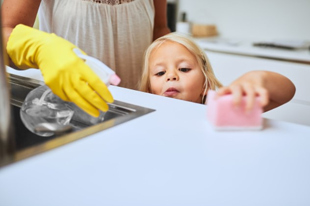
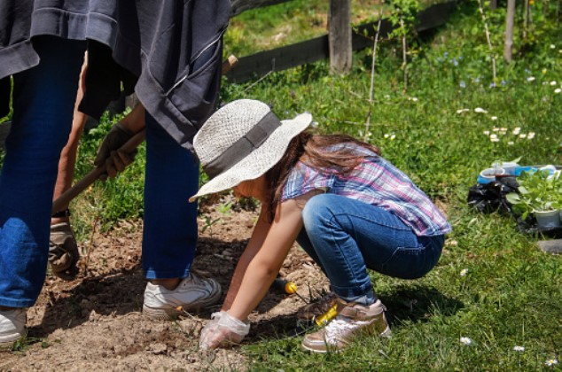
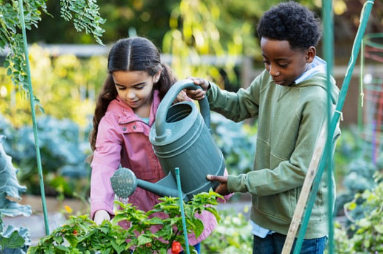
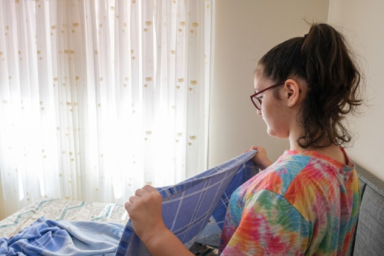
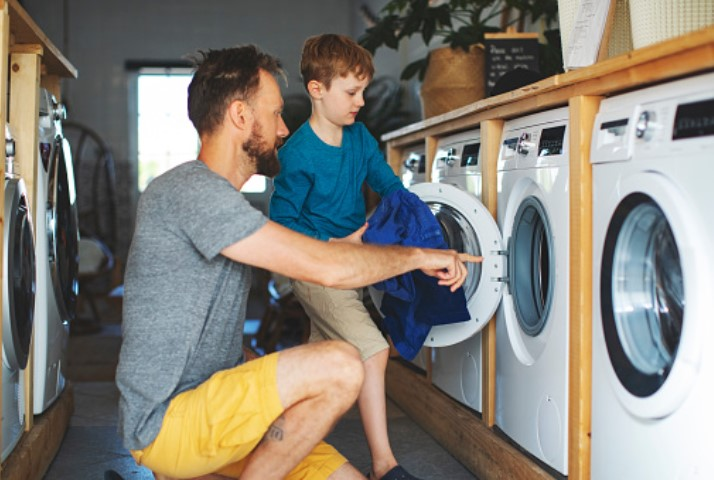
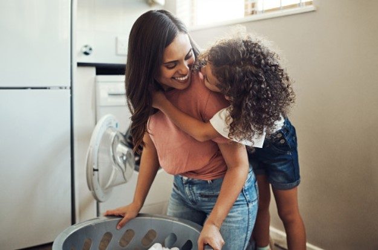

This article has been written and researched by our expert Loveable through a precise methodology. [Learn more about our methodology](https://avada.io/loveable/our-methodological.html)

[Loveable](https://avada.io/loveable/) > [Blog](https://avada.io/loveable/blog/) > [Family](https://avada.io/loveable/family/)

# Raising Responsible Kids: 13 Chores for 6-Year-Olds to Tackle

Written by [Rose Bryne](https://avada.io/loveable/author/rose/) Last Updated on August 18, 2023

- [Key Points to Consider Before Assigning Chores to Children](https://avada.io/loveable/blog/chores-for-6-year-olds/#wp-block-heading-2-3)
- [13 Chores for 6-year-olds kids to do](https://avada.io/loveable/blog/chores-for-6-year-olds/#wp-block-heading-2-8)
    - [1\. Removing dust from surfaces](https://avada.io/loveable/blog/chores-for-6-year-olds/#wp-block-heading-3-9)
    - [2\. Clean and dry dishes](https://avada.io/loveable/blog/chores-for-6-year-olds/#wp-block-heading-3-12)
    - [3\. Assist parents with preparing supper](https://avada.io/loveable/blog/chores-for-6-year-olds/#wp-block-heading-3-14)
    - [4\. Remove grass from the garden](https://avada.io/loveable/blog/chores-for-6-year-olds/#wp-block-heading-3-16)
    - [5\. Water the plants](https://avada.io/loveable/blog/chores-for-6-year-olds/#wp-block-heading-3-19)
    - [6\. Collect the mail](https://avada.io/loveable/blog/chores-for-6-year-olds/#wp-block-heading-3-22)
    - [7\. Tidy their own room](https://avada.io/loveable/blog/chores-for-6-year-olds/#wp-block-heading-3-24)
    - [8\. Assist with feeding younger siblings](https://avada.io/loveable/blog/chores-for-6-year-olds/#wp-block-heading-3-27) 
    - [9\. Arranging books/magazines](https://avada.io/loveable/blog/chores-for-6-year-olds/#wp-block-heading-3-29)
    - [10\. Fold clean clothes](https://avada.io/loveable/blog/chores-for-6-year-olds/#wp-block-heading-3-32)
    - [11\. Assisting with grocery carrying](https://avada.io/loveable/blog/chores-for-6-year-olds/#wp-block-heading-3-34)
    - [12\. Place soiled clothing in the laundry basket](https://avada.io/loveable/blog/chores-for-6-year-olds/#wp-block-heading-3-37)
    - [13\. Hang coats on hooks or a coat rack](https://avada.io/loveable/blog/chores-for-6-year-olds/#wp-block-heading-3-40)
- [Tips to Assign Chores to Kids](https://avada.io/loveable/blog/chores-for-6-year-olds/#wp-block-heading-2-42)
- [The bottom line](https://avada.io/loveable/blog/chores-for-6-year-olds/#wp-block-heading-2-51)

Are you weary of doing all of the housekeeping while your children are hooked to their screens? Do you wish to raise self-sufficient, responsible children? As [parents](https://avada.io/loveable/types-of-parenting-styles/), we all want to raise responsible children who will mature into self-sufficient individuals. One method to do this is to give our children age-appropriate chores. It will not only relieve some of your burdens, but it will also help your children develop a feeling of ownership and pride in their house. Yet the question is, what sorts of duties are appropriate for young children, and how can we encourage them to accept these responsibilities?

Keep reading to see how giving **chores to 6-year-olds** may help them in the long term, as well as how to make it a joyful and pleasurable experience for the entire family. This guide compiles real expertise to assist parents in efficiently assigning tasks that helps both them and their children. Make chores a fun family activity by involving your children in the decision-making process and incorporating them into your routine. This will help create a positive environment and encourage them to take ownership of their responsibilities. Let’s see how your babies are gradually nourished by the practical knowledge that they learn to be well-behaved children. 

## **Key Points to Consider Before Assigning Chores to Children**

- Don’t put too much pressure on your youngster: It’s important to keep in mind that your youngster is still growing and improving their skills. Overburdening them with too many responsibilities or unreasonable expectations might result in dissatisfaction and a lack of desire. 
- Have patience when the kids are in the process of getting acquainted: Children may require additional time to master new chores and acquire used to their responsibilities. So, you need to be patient and give instruction and support while they do their responsibilities. Acknowledge their accomplishments and encourage them to persevere, even if they make mistakes along the road.
- Give your youngster lots of compliments: Positive reinforcement is an extremely effective motivator for youngsters. When kids finish a chore effectively or take the initiative to help around the house, make sure to lavish them with praise and credit. This will not only increase their self-esteem but will also motivate them to continue accepting responsibility for their actions.

## **13 Chores for 6-year-olds kids to do**

### **1\. Removing dust from surfaces**

This is the easiest work to assign for your babies to think about first because of its safety. It not only keeps the house clean, but it also teaches them the importance of cleanliness. Wipe off surfaces such as tables and cabinets with a microfiber cloth or feather duster. Teach your youngster to reach high and low points, as well as to remove any things from the surface before dusting.

### **2\. Clean and dry dishes**

Consider supplying your 6-year-old with bright and amusing dishwashing gloves and a little stool to stand on to make this work more pleasurable. Begin by showing them how to scrape any residual food from the dishes before rinsing them with water. You may next show them how to use dish soap and a sponge to clean the dishes completely. Then, show them how to dry the dishes with a towel and put them away in their proper places.

### **3\. Assist parents with preparing supper**

Children may do simple tasks like washing fruits and vegetables or preparing the table. As kids get used to it, they will be able to assist with increasingly sophisticated chores, including calculating ingredients and cooking simple recipes under supervision. This activity motivates them to be self-sufficient and responsible. Furthermore, by collaborating with their parents in the kitchen, children may have more meaningful time with their families.

### **4\. Remove grass from the garden**

You can call for the help of your baby as one of the best chores for 6-Year-Olds. It’s necessary because grass may compete with plants for nutrients and water. Let’s show them how to separate the grass from the root while taking out as much of the root as possible. Supervise your child during [this activity](https://avada.io/loveable/gardening-activities-ideas/) in his/her first tries to ensure that they are plucking out the correct grass and not injuring any of the plants in the garden.

### **5\. Water the plants**

Watering plants is also an excellent chore for 6-year-olds since it teaches children responsibility and respect for nature. Give your youngster a little watering can and show them how to water the plants carefully. You should leave them to practice with easy-care plants first to fundamentally understand how a plant is growing before coming to more difficult ones. This will teach your youngster to care for living things and give him or her a sense of success.

### **6\. Collect the mail**

Letting your baby make a little movement to take items on is easy. Kids can feel important and eager to help out, much like they do when they pick up the newspaper. To avoid misplacing any critical letters or documents, provide them a specific spot to put the mail once they’ve gathered it. Teach kids how to sort through mail and identify who each piece is for so they may learn to take charge of vital home responsibilities.

### **7\. Tidy their own room**

This is a must-do work for any child, no matter how old they are. Teach them to keep clean everywhere they go, not just their room, but their room might be the first place to try to learn this lesson. Six-year-olds can easily undertake the responsibility of cleaning their own room. Encourage them to put their toys and clothing away, make their bed, and ensure everything is in its proper place. Teaching kids how to clean up can help them build excellent habits and organizational abilities that will come in handy later in life.

### **8\. Assist with feeding younger siblings** 

Taking care of newborn infants is not difficult, but you must always be there with them. Your older child might be asked to hold the baby bottle while you feed the baby or to feed the baby while you are watching. Ask your child to be nice and patient with their smaller sibling during the feeding, but keep an eye on them to avoid any mishaps. Through this activity, your youngster can acquire essential skills and feel a sense of success while bonding with their younger siblings.

### **9\. Arranging books/magazines**

Arranging books and magazines can be a fun chore for a 6-year-old. Teach your youngster how to organize [books](https://avada.io/loveable/personalized-children-books/) by author or genre, or for a fun twist, by color. Let your kid to pick where the books and magazines will be stored once they have been sorted, such as on a bookshelf or in a basket. This will not only help children keep their reading materials organized, but it will also help them learn organizational skills.

### **10\. Fold clean clothes**

Teaching your children how to fold clean clothing is an important life skill. Begin by showing children how to fold simple objects such as socks, hand towels, and washcloths. As they improve, you may progressively on to more difficult things such as shirts and trousers. Be careful to show them how to fold each item correctly and assist them if they are confused. 

### **11\. Assisting with grocery carrying**

Children between the ages of 6 may be great assistants when it comes to lugging in bags of goods while shopping and pulling stuff out of bags. As physical health training, you should just provide them with light bags or objects that are easy to carry. This not only assists parents in their food storage work, but it also teaches youngsters organizing skills and encourages them to be more responsible.

### **12\. Place soiled clothing in the laundry basket**

Set up a timetable for them to follow and to do it on their own without reminders. You might put the laundry basket in a convenient position for them and explain that doing so will help keep the house clean and organized. It is not a difficult task, but it does take a high level of self-discipline; therefore, it is thought to establish a good habit for them.

### **13\. Hang coats on hooks or a coat rack**

Certainly! You are establishing a feeling of responsibility and organization in your child by teaching them to hang their outerwear on the rack. Make it a fun activity by enabling your youngster to choose and create their own hanger or rack. So, if they forget or leave their coat lying about, remind them to hang it up as soon as they get inside. This not only keeps the house neat but also helps to prevent objects from being misplaced.

## **Tips to Assign Chores to Kids**

There are some tips to follow when assigning chores for 6-year-olds to comfortably and readily do:

- Assign tasks based on skill and ability: works have to be suitable for their age and not too hard
- Explain expectations clearly: give them instruction carefully before setting up work
- Set deadlines for completion: list works that have to be done before curfew
- Provide positive encouragement: Give compliments, for example, to push up their energy and confidence 
- Keep things fair and interesting: make it a game or competition to be more exciting, or play some music to turn the house into a dance club.

**_Check Out_**: [6 Years Old Birthday Gifts](https://avada.io/loveable/6-year-old-birthday-gifts/)

## **The bottom line**

Every parent’s goal is to raise a responsible and self-sufficient child. One of the best methods to teach these values to your children is to assign them age-appropriate chores. While some children may not enjoy completing chores, including them in their regular routine may provide several benefits. Chores for kids not only teach children responsibility but also help them recognize their worth and contribution to their family.

This blog is the best guide to **Raising Responsible Kids: 13 Chores for 6-Year-Olds to Tackle.** Kids as young as six may do a variety of tasks. Children get a sense of independence and success by performing these duties. It also relieves parental stress, providing them with more time to spend with their children. It is critical to acknowledge and appreciate children’s results as they finish assignments. Even simple chores may be done into a pleasant pastime, and this positive association can help youngsters develop a lifetime love of housekeeping and home care.

- [Key Points to Consider Before Assigning Chores to Children](https://avada.io/loveable/blog/chores-for-6-year-olds/#wp-block-heading-2-3)
- [13 Chores for 6-year-olds kids to do](https://avada.io/loveable/blog/chores-for-6-year-olds/#wp-block-heading-2-8)
    - [1\. Removing dust from surfaces](https://avada.io/loveable/blog/chores-for-6-year-olds/#wp-block-heading-3-9)
    - [2\. Clean and dry dishes](https://avada.io/loveable/blog/chores-for-6-year-olds/#wp-block-heading-3-12)
    - [3\. Assist parents with preparing supper](https://avada.io/loveable/blog/chores-for-6-year-olds/#wp-block-heading-3-14)
    - [4\. Remove grass from the garden](https://avada.io/loveable/blog/chores-for-6-year-olds/#wp-block-heading-3-16)
    - [5\. Water the plants](https://avada.io/loveable/blog/chores-for-6-year-olds/#wp-block-heading-3-19)
    - [6\. Collect the mail](https://avada.io/loveable/blog/chores-for-6-year-olds/#wp-block-heading-3-22)
    - [7\. Tidy their own room](https://avada.io/loveable/blog/chores-for-6-year-olds/#wp-block-heading-3-24)
    - [8\. Assist with feeding younger siblings](https://avada.io/loveable/blog/chores-for-6-year-olds/#wp-block-heading-3-27) 
    - [9\. Arranging books/magazines](https://avada.io/loveable/blog/chores-for-6-year-olds/#wp-block-heading-3-29)
    - [10\. Fold clean clothes](https://avada.io/loveable/blog/chores-for-6-year-olds/#wp-block-heading-3-32)
    - [11\. Assisting with grocery carrying](https://avada.io/loveable/blog/chores-for-6-year-olds/#wp-block-heading-3-34)
    - [12\. Place soiled clothing in the laundry basket](https://avada.io/loveable/blog/chores-for-6-year-olds/#wp-block-heading-3-37)
    - [13\. Hang coats on hooks or a coat rack](https://avada.io/loveable/blog/chores-for-6-year-olds/#wp-block-heading-3-40)
- [Tips to Assign Chores to Kids](https://avada.io/loveable/blog/chores-for-6-year-olds/#wp-block-heading-2-42)
- [The bottom line](https://avada.io/loveable/blog/chores-for-6-year-olds/#wp-block-heading-2-51)

### [Rose Bryne](https://avada.io/loveable/author/rose/)

Hi, I'm Rose! I love animals and spending time with kids. At Loveable, I help people find unique gifts for special occasions like Valentine's Day, housewarmings, and graduations. I enjoy finding gifts for kids, teens, and animal lovers that match their interests and personalities. Making gift-giving a pleasant experience is my priority. Let me assist you in finding the perfect gift!

- [Twitter](https://twitter.com/intent/tweet)
- [Facebook](https://www.facebook.com/sharer/sharer.php)
- [instagram](https://avada.io/loveable/blog/chores-for-6-year-olds/)
- [pinterest](https://www.pinterest.com/loveablellc/)

## Related Posts

[### 30 Best 4 Year Old Birthday Party Ideas For A Memorable Celebration](https://avada.io/loveable/blog/4-year-old-birthday-party-ideas/) 

[

### 16th Birthday Party Ideas to Make an Unforgettable Day

](https://avada.io/loveable/blog/16th-birthday-party-ideas/)

[

### 150+ Inspirational Birthday Quotes to Spread Joy on Special Day

](https://avada.io/loveable/blog/inspirational-birthday-quotes/)

[

### 160+ Birthday Wishes for Wife to Express Eternal Love

](https://avada.io/loveable/blog/birthday-wishes-for-wife/)

[### 90+ Heart Touching Birthday Wishes for Niece to Make Her Day Extra Special](https://avada.io/loveable/blog/birthday-wishes-for-niece/)
