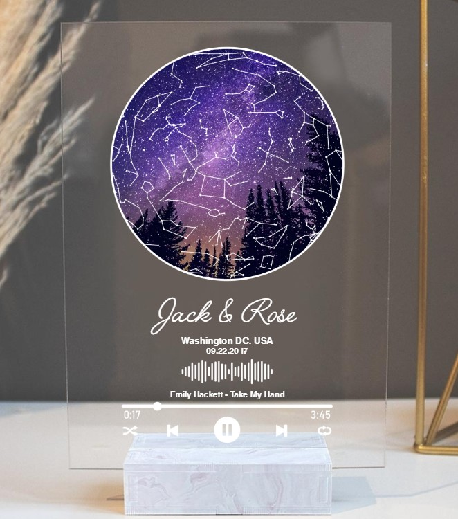

This article has been written and researched by our expert Loveable through a precise methodology. [Learn more about our methodology](https://avada.io/loveable/our-methodological.html)

[Loveable](https://avada.io/loveable/) > [Blog](https://avada.io/loveable/blog/) > [Relationship](https://avada.io/loveable/relationship/)

# Romantic 10 Year Anniversary Ideas To Keep The Spark Alive

Written by [Luna Miller](https://avada.io/loveable/author/luna/) Last Updated on October 03, 2023

- [Best 10-Year Anniversary Ideas For Him and Her](https://avada.io/loveable/blog/10-year-anniversary-ideas/#wp-block-heading-2-3)
    - [Arrange a Romantic Dinner](https://avada.io/loveable/blog/10-year-anniversary-ideas/#wp-block-heading-3-4)
    - [Go on a Vacation](https://avada.io/loveable/blog/10-year-anniversary-ideas/#wp-block-heading-3-7)
    - [Celebrate with Family and Friends](https://avada.io/loveable/blog/10-year-anniversary-ideas/#wp-block-heading-3-9)
    - [Spend Time Together](https://avada.io/loveable/blog/10-year-anniversary-ideas/#wp-block-heading-3-11)
    - [Take a Boat Ride](https://avada.io/loveable/blog/10-year-anniversary-ideas/#wp-block-heading-3-14)
    - [Renew Your Wedding Vows](https://avada.io/loveable/blog/10-year-anniversary-ideas/#wp-block-heading-3-16)
    - [Plan a Picnic at the Park](https://avada.io/loveable/blog/10-year-anniversary-ideas/#wp-block-heading-3-19)
    - [Embark on a Nature Walk](https://avada.io/loveable/blog/10-year-anniversary-ideas/#wp-block-heading-3-22)
    - [Go Camping](https://avada.io/loveable/blog/10-year-anniversary-ideas/#wp-block-heading-3-24)
    - [Enjoy A Wine Walk](https://avada.io/loveable/blog/10-year-anniversary-ideas/#wp-block-heading-3-27)
    - [Have a Rooftop Picnic At Night](https://avada.io/loveable/blog/10-year-anniversary-ideas/#wp-block-heading-3-29)
    - [Host a Cocktail Party](https://avada.io/loveable/blog/10-year-anniversary-ideas/#wp-block-heading-3-31)
    - [Relax at a Spa](https://avada.io/loveable/blog/10-year-anniversary-ideas/#wp-block-heading-3-34)
    - [Go Hiking](https://avada.io/loveable/blog/10-year-anniversary-ideas/#wp-block-heading-3-36)
    - [Get Adventurous](https://avada.io/loveable/blog/10-year-anniversary-ideas/#wp-block-heading-3-38) 
    - [Go to a Concert](https://avada.io/loveable/blog/10-year-anniversary-ideas/#wp-block-heading-3-41)
    - [Book a Romantic Hotel](https://avada.io/loveable/blog/10-year-anniversary-ideas/#wp-block-heading-3-43)
    - [Go on a Hot Air Balloon Ride](https://avada.io/loveable/blog/10-year-anniversary-ideas/#wp-block-heading-3-45)
- [Unique 10-Year Anniversary Gifts in 2023](https://avada.io/loveable/blog/10-year-anniversary-ideas/#wp-block-heading-2-48)
    - [The Day That Two Become One – Personalized Canvas Poster](https://avada.io/loveable/blog/10-year-anniversary-ideas/#wp-block-heading-3-49)
    - [Star Map With Favorite Song – Personalized Acrylic Plaque](https://avada.io/loveable/blog/10-year-anniversary-ideas/#wp-block-heading-3-52)
    - [Personalized Husband and Wife Pillows](https://avada.io/loveable/blog/10-year-anniversary-ideas/#wp-block-heading-3-55)
    - [Personalized Milestone Anniversary Cut Metal Sign](https://avada.io/loveable/blog/10-year-anniversary-ideas/#wp-block-heading-3-58)
    - [Customized Round Wood Sign Wall Art](https://avada.io/loveable/blog/10-year-anniversary-ideas/#wp-block-heading-3-61)
- [Bottom Line](https://avada.io/loveable/blog/10-year-anniversary-ideas/#wp-block-heading-2-65)

After ten years of shared memories and cherished moments, it’s time to honor your journey as a couple in a truly special way. From romantic getaways to heartfelt gestures, this curated list offers a plethora of delightful options to reignite the spark and create lasting memories. Explore breathtaking destinations hand in hand, indulge in intimate dinners, or embark on exhilarating adventures that will strengthen your bond even further.

Whether you’re seeking quiet moments of reflection or thrilling escapades that push the boundaries of your comfort zone, these **10-year anniversary ideas** are designed to make your milestone celebration one to remember. Embrace this opportunity to honor the past while eagerly stepping into a future filled with love, laughter, and a decade’s worth of shared dreams.

## **Best 10-Year Anniversary Ideas For Him and Her**

### **Arrange a Romantic Dinner**

A classic way for couples to celebrate their tenth anniversary. You can prepare a candlelit dinner for your partner at home with their favorite dishes, drinks, and decoration. Adding soft music and dimming the lights will also help create an intimate atmosphere. Creating a menu with your partner’s favorite dishes or trying a new recipe together can be a fun way to show your love and appreciation.

### **Go on a Vacation**

Going on a romantic vacation with your partner is a wonderful 10-year anniversary idea and the perfect gift to mark this special time. Traveling for leisure allows you to escape from everyday responsibilities and distractions, allowing you to focus on each other. There’s nothing better than rekindling the sparks while being surrounded by breathtaking scenery and feeling like newlyweds again!

### **Celebrate with Family and Friends**

Planning an anniversary celebration for a special 10-year milestone should be extra special. Gather family and friends with DIY or picture anniversary invitations, and pick the best anniversary party theme to bring it all together. For example, go vintage, pick a color scheme, or surprise your significant other with a secret party! To make it extra memorable, why not return to the place of your honeymoon for old times’ sake? Whichever way you decide to commemorate this momentous occasion, make sure to have fun and create memories that will last forever!

### **Spend Time Together**

It may seem simple, but spending time together is the most important thing. If you can’t get away or plan an out-of-the-box trip, a movie night or intimate dinner at home is just as meaningful. Setting aside time for you and your spouse to celebrate and reminisce about the milestones of your marriage is always an excellent idea. You can hire a babysitter, cook your favorite meal together, and watch a movie to finish off the night.

### **Take a Boat Ride**

Going on a boat ride with your spouse is a beautiful tenth-anniversary idea. If you live in a city with beautiful lakes, you should rent a boat. A boat ride offers delicious seafood and drinks, as well as a unique perspective on the city. Plus, if you want to try something different, you can paddle and canoe on a local lake. While on the boat, you can even make your partner feel extra special by giving them gifts.

### **Renew Your Wedding Vows**

Renewing your vows is an excellent way to express your commitment and love, as well as a great opportunity to make the 10th anniversary memorable. Doing so allows you to surround yourselves with friends and family, both old and new, like the ones that have come into your life since you’ve been married. If you’re feeling extra special about the occasion and want a big celebration that’s on par with your wedding, go ahead!

On the other hand, if you just want something small and intimate for the two of you, then plan an amazing trip to Vegas and exchange those sacred vows in one of its famous chapels. Whichever route you choose will be sure to make your 10th anniversary an unforgettable one!

### **Plan a Picnic at the Park**

An excellent 10-year anniversary idea is to celebrate your wedding anniversary outside while the weather is pleasant. Go to a park and breathe in the fresh air while you are there. If you’re out relaxing, you can bring food, drinks, a blanket, and also your phone for some good music. A timeless way to spend time with a loved one is to lie in the sun and add your personal touch to an old-fashioned date concept.

### **Embark on a Nature Walk**

Walking hand-in-hand with your spouse, reminiscing about the good old times, and falling in love all over again is one of the interesting tenth-wedding anniversary ideas. Alternatively, you can just take a stroll around the city or town and visit places you haven’t been to before. Don’t forget to take lots of photos to cherish the special moment!

### **Go Camping**

What could be more romantic than spending time in a tent with your partner under the stars? Make the night more romantic by decorating the tent with lanterns. Put cozy cushions inside the tent and serve dinner with tealights to set the mood. Make your significant other feel warm with a glass of red wine. Pack a blanket for a romantic evening.

### **Enjoy A Wine Walk**

Wine hopping is the perfect activity for couples looking to reconnect and celebrate special moments. Look for a winery or wine shop that offers lots of wine-tasting opportunities and take a romantic stroll together while savoring the delicious liquid treats! Wine tasting isn’t just about sampling different flavors – it’s also an opportunity to fully immerse yourself in the atmosphere, enjoying each other’s company while sipping on your favorite wines. With its deep and romantic flavor, let wine be the one that brings out all the love between you and your beloved!

### **Have a Rooftop Picnic At Night**

Take your partner on a rooftop picnic at night under the stars and the soft glow of surrounding houses for a romantic evening. It’s always a winning combination of an amazing view and delicious food. Pack blankets, wine, glasses, and candles for the ultimate roof picnic experience, and enjoy the view while listening to romantic music in the background. Raise a toast under the stars and enjoy the evening.

### **Host a Cocktail Party**

On your 10-year anniversary, what better way to celebrate than being surrounded by those nearest and dearest to you? Throw a special dinner or cocktail party for a few of your closest friends and family. Make sure to create a fun and festive atmosphere with personalized decorations, delicious appetizers, and drinks that you both enjoy. If you need help in planning the event, look online for ideas over the weekend. This ten-year milestone is something special – make it memorable for your partner, as they will feel cherished and appreciated.

### **Relax at a Spa**

Massages and body treatments might not seem like something you want to do with your partner on your 10th anniversary, but you can turn it into something you and your partner will never forget. After all, many spas offer couples’ packages. For an extra special treat, book a couples massage and let yourselves be pampered. Enjoy some refreshments and snacks afterward to complete your relaxing experience.

### **Go Hiking**

Hiking can be an exciting 10-year anniversary idea, especially if you pack a picnic for yourself. You can read old photos or love letters together, or sing a love song together, from a nice viewpoint. Make sure to take some photos together as a memory of the day. When you get home, frame the best one as a reminder of your love.

### **Get Adventurous** 

Your tenth anniversary should be filled with adventure and excitement if that’s what makes your relationship truly special. If you and your partner are adrenaline junkies, you and your partner may want to consider surfing, paragliding, parachute jumping, or undersea diving. You will want to capture your adventures with a camera, so be sure to bring one.

### **Go to a Concert**

If both of you enjoy musical concerts, book tickets in advance and go watch the show. Have fun singing and dancing with each other. If you and your partner enjoy live music or entertainment, why not go to a concert or theater performance to celebrate your special event? You can also buy your partner concert tickets for a concert in another city if their favorite band is about to go on tour. It’s a mini-vacation and a concert all in one!

### **Book a Romantic Hotel**

Your tenth wedding anniversary is the perfect time to ignite sparks with romantic lodging. If you and your partner are both outgoing, you should go to a bustling city. If you two are a little laid back, choose a secluded location where you can simply enjoy one another’s company. You may get a complimentary glass of wine or other perks during your stay if you inform the hotel staff that you are celebrating your tenth anniversary.

### **Go on a Hot Air Balloon Ride**

Taking a hot air balloon trip together sounds like an awesome 10-year anniversary idea. Experience the breathtaking views from a hot air balloon at sunrise or sunset. Be sure to dress appropriately and bring a camera to capture the stunning scenery. Take this opportunity to try something new together and step out of your comfort zone.

## **Unique 10-Year Anniversary Gifts in 2023**

### **[The Day That Two Become One – Personalized Canvas Poster](https://loveable.ai/products/the-day-that-two-become-one-personalized-canvas-poster-home-wall-art-decor-custom-star-map-and-photo-anniversary-gifts-for-couple-209ihpthca149)**

This exquisite home wall art decor is the perfect 10-year anniversary gift for couples who cherish their journey under the stars. The canvas features a custom star map that beautifully depicts the night sky exactly as it was on a special day they said “I do”. To add a touch of sentimentality, the poster includes a cherished photo of the couple, symbolizing the milestones they’ve achieved together. A heartfelt way to reminisce about the magical moment when their lives merged!

### [Star Map With Favorite Song – Personalized Acrylic Plaque](https://loveable.ai/products/custom-star-map-with-favorite-song-best-personalized-acrylic-plaque-gift-for-anniversary-209ihpbnap156?variant=43814786334952)

Celebrate a decade of cherished memories with the perfect [10-year anniversary gift](https://avada.io/loveable/10-years-anniversary-gifts-for-him/) – the Custom Star Map with Favorite Song Acrylic Plaque. This exquisite personalized masterpiece beautifully combines the night sky’s celestial beauty with the melody that defines your love story. To add an extra touch of sentimentality, the plaque incorporates the soundwaves of your favorite song, evoking emotions and nostalgia with every glance.

### **[Personalized Husband and Wife Pillows](https://loveable.us/products/wedding-anniversary-husband-and-wife-wedding-anniversary-presents-personalised-husband-and-wife-pillows-couple-gifts-personalised-wedding-square-linen-pillow-home-decor-304ihpnppi440?variant=44442124976360)**

This personalized pillow is a perfect choice for a heartwarming and thoughtful 10-year anniversary gift for couples. The pillow can be customized with the couple’s names or initials, making it a truly unique and sentimental present. Whether placed on their bed or displayed in their living room, these pillows will add a touch of warmth and love to their home, symbolizing their love for each other.

### **[Personalized Milestone Anniversary Cut Metal Sign](https://loveable.ai/products/custom-years-of-love-personalized-names-cut-metal-sign-anniversary-gift-10th-15th-25th-50th-anniversary-wall-hanging-302icnnpmt187)**

The Personalized Milestone Anniversary Cut Metal Sign is a timeless gift that will forever remind them of their special day. It is customized with the couple’s names and the number of years they’ve been together, making it a truly unique keepsake for their enduring love. It is also perfect for hanging indoors or outdoors, making it the perfect gift for any couple.

### **[Customized Round Wood Sign Wall Art](https://loveable.ai/products/custom-song-name-upload-photo-customizable-text-vinyl-record-round-wood-sign-wall-art-gifts-for-your-love-209ihpthrw317)**

As a gift for a 10-year couple, this round wood sign carries even more significance as it symbolizes their enduring relationship and journey together. It not only adds a charming touch to their home decoration but also serves as a beautiful reminder of their love and commitment to each other. The warm memories it evokes will bind them together for the years to come.

**_Related:_** [Happy 10-Year Anniversary](https://avada.io/loveable/blog/happy-10-year-anniversary/) Wishes, Messages, And Quotes For Your Loved Ones

## **Bottom Line**

Celebrating a decade of love and togetherness deserves nothing short of remarkable festivities, and **these 10-year anniversary ideas** offer a plethora of unforgettable options. As you embark on this meaningful occasion, let the spirit of love and appreciation guide your choices, creating treasured moments that will carry you through the next decade and beyond. Here’s to the past ten years and the limitless possibilities that the future holds for your enduring love story. Happy anniversary!

- [Best 10-Year Anniversary Ideas For Him and Her](https://avada.io/loveable/blog/10-year-anniversary-ideas/#wp-block-heading-2-3)
    - [Arrange a Romantic Dinner](https://avada.io/loveable/blog/10-year-anniversary-ideas/#wp-block-heading-3-4)
    - [Go on a Vacation](https://avada.io/loveable/blog/10-year-anniversary-ideas/#wp-block-heading-3-7)
    - [Celebrate with Family and Friends](https://avada.io/loveable/blog/10-year-anniversary-ideas/#wp-block-heading-3-9)
    - [Spend Time Together](https://avada.io/loveable/blog/10-year-anniversary-ideas/#wp-block-heading-3-11)
    - [Take a Boat Ride](https://avada.io/loveable/blog/10-year-anniversary-ideas/#wp-block-heading-3-14)
    - [Renew Your Wedding Vows](https://avada.io/loveable/blog/10-year-anniversary-ideas/#wp-block-heading-3-16)
    - [Plan a Picnic at the Park](https://avada.io/loveable/blog/10-year-anniversary-ideas/#wp-block-heading-3-19)
    - [Embark on a Nature Walk](https://avada.io/loveable/blog/10-year-anniversary-ideas/#wp-block-heading-3-22)
    - [Go Camping](https://avada.io/loveable/blog/10-year-anniversary-ideas/#wp-block-heading-3-24)
    - [Enjoy A Wine Walk](https://avada.io/loveable/blog/10-year-anniversary-ideas/#wp-block-heading-3-27)
    - [Have a Rooftop Picnic At Night](https://avada.io/loveable/blog/10-year-anniversary-ideas/#wp-block-heading-3-29)
    - [Host a Cocktail Party](https://avada.io/loveable/blog/10-year-anniversary-ideas/#wp-block-heading-3-31)
    - [Relax at a Spa](https://avada.io/loveable/blog/10-year-anniversary-ideas/#wp-block-heading-3-34)
    - [Go Hiking](https://avada.io/loveable/blog/10-year-anniversary-ideas/#wp-block-heading-3-36)
    - [Get Adventurous](https://avada.io/loveable/blog/10-year-anniversary-ideas/#wp-block-heading-3-38) 
    - [Go to a Concert](https://avada.io/loveable/blog/10-year-anniversary-ideas/#wp-block-heading-3-41)
    - [Book a Romantic Hotel](https://avada.io/loveable/blog/10-year-anniversary-ideas/#wp-block-heading-3-43)
    - [Go on a Hot Air Balloon Ride](https://avada.io/loveable/blog/10-year-anniversary-ideas/#wp-block-heading-3-45)
- [Unique 10-Year Anniversary Gifts in 2023](https://avada.io/loveable/blog/10-year-anniversary-ideas/#wp-block-heading-2-48)
    - [The Day That Two Become One – Personalized Canvas Poster](https://avada.io/loveable/blog/10-year-anniversary-ideas/#wp-block-heading-3-49)
    - [Star Map With Favorite Song – Personalized Acrylic Plaque](https://avada.io/loveable/blog/10-year-anniversary-ideas/#wp-block-heading-3-52)
    - [Personalized Husband and Wife Pillows](https://avada.io/loveable/blog/10-year-anniversary-ideas/#wp-block-heading-3-55)
    - [Personalized Milestone Anniversary Cut Metal Sign](https://avada.io/loveable/blog/10-year-anniversary-ideas/#wp-block-heading-3-58)
    - [Customized Round Wood Sign Wall Art](https://avada.io/loveable/blog/10-year-anniversary-ideas/#wp-block-heading-3-61)
- [Bottom Line](https://avada.io/loveable/blog/10-year-anniversary-ideas/#wp-block-heading-2-65)

### [Luna Miller](https://avada.io/loveable/author/luna/)

I'm Luna Miller, a helpful employee at Loveable. I excel at giving great advice on birthday gifts. I love suggesting memorable experiences like concerts, spas, and getaways. As a reliable and supportive colleague, I'm always there to assist.

- [Twitter](https://twitter.com/intent/tweet)
- [Facebook](https://www.facebook.com/sharer/sharer.php)
- [instagram](https://avada.io/loveable/blog/10-year-anniversary-ideas/)
- [pinterest](https://www.pinterest.com/loveablellc/)

## Related Posts

[

### 35 Unforgettable Exciting Adult Birthday Party Ideas

](https://avada.io/loveable/blog/adult-birthday-party-ideas/)

[

### 42 Best 21st Birthday Outfits to Rock the Party

](https://avada.io/loveable/blog/21st-birthday-outfits/)

[

### 50+ Happy 40th Anniversary Quotes, Messages, and Wishes

](https://avada.io/loveable/blog/happy-40th-anniversary-quotes/)

[

### 100+ Heartwarming Happy 30th Anniversary Quotes, Messages, and Wishes

](https://avada.io/loveable/blog/happy-30th-anniversary-quotes/)

[

### 120+ Heartfelt Thank You Messages for The Birthday Wishes

](https://avada.io/loveable/blog/thank-you-messages-birthday-wishes/)
