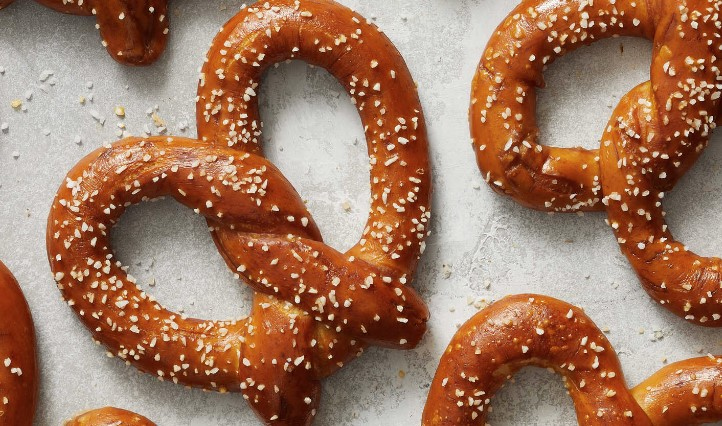
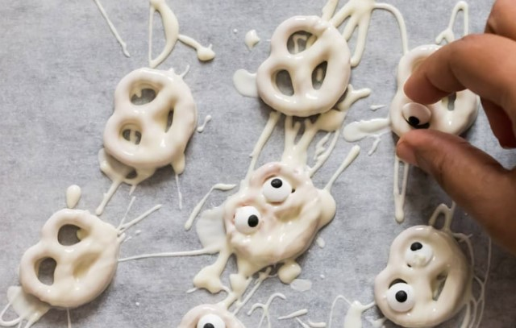
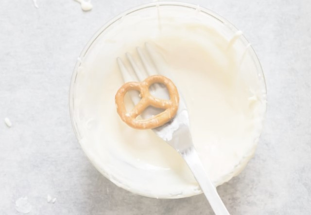
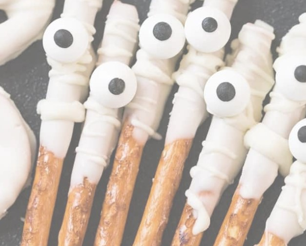
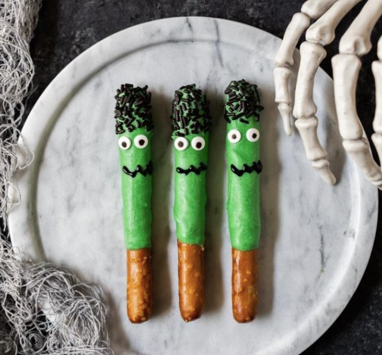
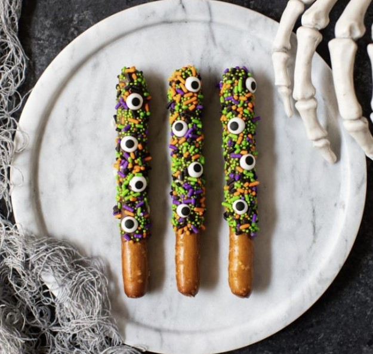
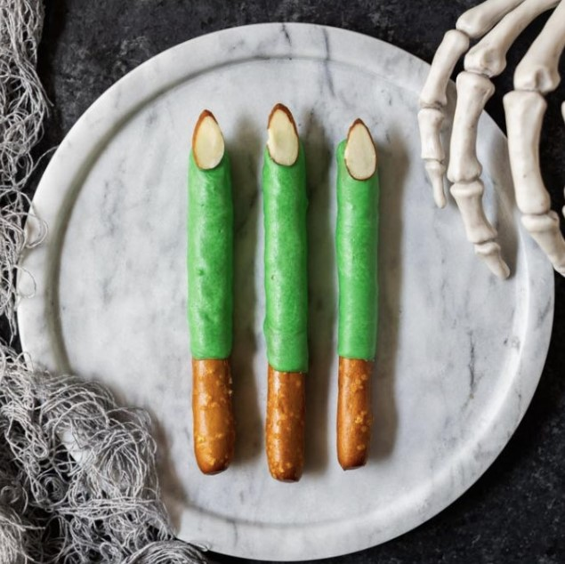
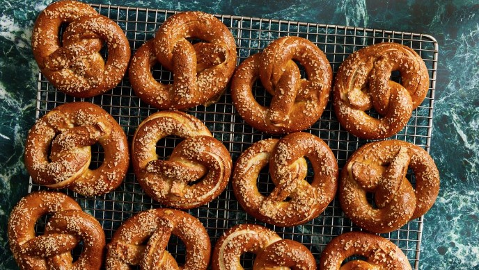
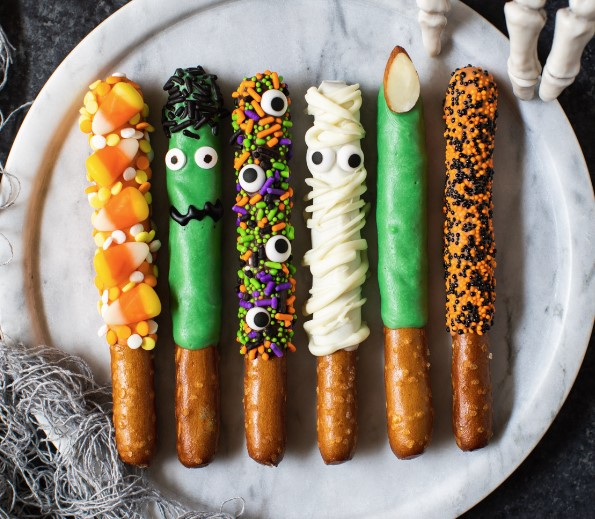

This article has been written and researched by our expert Loveable through a precise methodology. [Learn more about our methodology](https://avada.io/loveable/our-methodological.html)

[Loveable](https://avada.io/loveable/) > [Blog](https://avada.io/loveable/blog/) > [Holiday](https://avada.io/loveable/holiday/)

# Spooky Halloween Pretzels Recipe For Halloween 2023

Written by [Blake Simpson](https://avada.io/loveable/author/blake/) Last Updated on August 25, 2023

- [6-Steps to Make Perfect Pretzels](https://avada.io/loveable/blog/halloween-pretzels/#wp-block-heading-2-3) 
    - [Ingredients](https://avada.io/loveable/blog/halloween-pretzels/#wp-block-heading-3-6)
    - [11-Steps Instructions](https://avada.io/loveable/blog/halloween-pretzels/#wp-block-heading-3-15)
- [Spooky Theme Haloween Pretzel](https://avada.io/loveable/blog/halloween-pretzels/#wp-block-heading-2-27) 
    - [Ghost Halloween Pretzel](https://avada.io/loveable/blog/halloween-pretzels/#wp-block-heading-3-28) 
    - [Mummy Halloween Rod](https://avada.io/loveable/blog/halloween-pretzels/#wp-block-heading-3-49)
    - [Frankenstein Pretzels](https://avada.io/loveable/blog/halloween-pretzels/#wp-block-heading-3-55)
    - [Monster Sprinkles Pretzel Rods](https://avada.io/loveable/blog/halloween-pretzels/#wp-block-heading-3-62)
    - [Green Witch Finger Pretzel Rods](https://avada.io/loveable/blog/halloween-pretzels/#wp-block-heading-3-65)
- [Extra Tips to Make Spooky Halloween Pretzel](https://avada.io/loveable/blog/halloween-pretzels/#wp-block-heading-2-69) 
    - [Experiment with different colored candy melts](https://avada.io/loveable/blog/halloween-pretzels/#wp-block-heading-3-71) 
    - [Use food coloring](https://avada.io/loveable/blog/halloween-pretzels/#wp-block-heading-3-73) 
    - [Get creative with decorations](https://avada.io/loveable/blog/halloween-pretzels/#wp-block-heading-3-75) 
    - [Add flavor](https://avada.io/loveable/blog/halloween-pretzels/#wp-block-heading-3-77)
    - [Try different pretzel shapes](https://avada.io/loveable/blog/halloween-pretzels/#wp-block-heading-3-79) 
- [Spooky Halloween Pretzels Recipe Q&A](https://avada.io/loveable/blog/halloween-pretzels/#wp-block-heading-2-82)
    - [Q: Can I use regular chocolate instead of candy melts for Halloween pretzels?](https://avada.io/loveable/blog/halloween-pretzels/#wp-block-heading-3-84)
    - [Q: How long do Halloween pretzels stay fresh?](https://avada.io/loveable/blog/halloween-pretzels/#wp-block-heading-3-86)
    - [Q: Can I make Halloween pretzels in advance?](https://avada.io/loveable/blog/halloween-pretzels/#wp-block-heading-3-88)
    - [Q: Can I use gluten-free pretzels for Halloween pretzels?](https://avada.io/loveable/blog/halloween-pretzels/#wp-block-heading-3-90)
- [Bottom Line](https://avada.io/loveable/blog/halloween-pretzels/#wp-block-heading-2-92) 

Welcome to our Spooky **Halloween Pretzels** Recipe for Halloween 2023! Get ready to add some frightful fun to your Halloween celebrations with this delicious and easy-to-make treat. Whether you’re hosting a Halloween party or simply looking for a festive snack, these spooky pretzels are sure to impress both kids and adults alike. With just a few simple ingredients and a touch of creativity, you can transform ordinary pretzels into ghostly specters and mummified delights. 

Follow our step-by-step instructions to create these eerie yet tasty treats that will leave everyone craving more. Let’s dive into the world of Halloween culinary delight and make your Halloween celebration a memorable one!

## **6-Steps to Make Perfect Pretzels** 

Before we step into the Pretzel Spooky theme for Halloween, we need to know the standard recipe to make the perfect simple pretzels.

### **Ingredients**

- 2 ½ cups all-purpose flour
- 1 teaspoon salt
- 1 teaspoon sugar
- 2 ¼ teaspoons active dry yeast
- 1 cup warm water (around 110°F/43°C)
- 2 tablespoons baking soda
- Coarse salt (for sprinkling)
- 3 tablespoons unsalted butter, melted

### **11-Steps Instructions**

- **Step 1**: In a large mixing bowl, combine the warm water and sugar. Sprinkle the yeast over the water and let it sit for about 5 minutes until the yeast becomes foamy.

- **Step 2**: In a separate bowl, whisk together the flour and salt. Gradually add the flour mixture to the yeast mixture, stirring with a wooden spoon until a dough forms.

- **Step 3**: Transfer the dough to a floured surface and knead for about 5-7 minutes until the dough becomes smooth and elastic. If the dough is too sticky, add a little more flour, but be careful not to add too much.

- **Step 4**: Shape the dough into a ball and place it in a greased bowl. Cover the bowl with a clean kitchen towel and let the dough rise in a warm place for about 1 hour or until it doubles in size.

- **Step 5**: Preheat your oven to 425°F (220°C). Line a baking sheet with parchment paper or lightly grease it.

- **Step 6**: Punch down the risen dough to remove any air bubbles. Divide the dough into smaller portions, depending on how large you want your pretzels. Roll each portion into a long rope, about 20-22 inches in length.

- **Step 7**: To shape the pretzels, form each rope into a U-shape. Cross the ends of the U over each other twice, then fold the twisted portion down to the bottom of the U, forming the classic pretzel shape. Press the ends lightly to secure.

- **Step 8**: In a large pot, bring water to a boil. Add the baking soda (be careful, it will bubble up) and reduce the heat to a simmer. Gently place each pretzel into the simmering water for about 30 seconds, then remove using a slotted spoon and place them on the prepared baking sheet.

- **Step 9**: Sprinkle the pretzels with coarse salt, then bake in the preheated oven for about 12-15 minutes or until they turn golden brown.

- **Step 10**: Remove the pretzels from the oven and brush them with melted butter while they are still hot. This will give them a nice shine.

- **Step 11**: Allow the pretzels to cool slightly before serving. They are best enjoyed fresh and warm.

## **Spooky Theme Haloween Pretzel** 

### **Ghost Halloween Pretzel** 

**You will need the following:** 

- ½ teaspoon of coconut oil
- Edible eye candies
- A bag of mini pretzels
- A bag of pretzel rods
- 2 packs of white candy melt

**Melts the Chocolate in the microwave** 

- Place the white chocolate and ½ teaspoon of coconut oil in a microwave-safe bowl.
- Set the microwave to 50% power to avoid overheating the chocolate.
- Heat the chocolate in 30-second intervals, pausing to stir well after each interval.
- If the chocolate is not fully melted, return the bowl to the microwave and continue heating for 20 seconds more.
- Repeat the process until approximately 90% of the chocolate is melted, stirring in between.
- Remove the bowl from the microwave and whisk the mixture thoroughly. The residual heat in the bowl will help melt any remaining chocolate.

It’s important to note that [chocolate food](https://avada.io/loveable/chocolate-day-gifts/) can sometimes appear unmelted, leading to the mistake of reheating it unnecessarily. This can cause the chocolate to burn and harden at the bottom. Remember to stir every 20 to 30 seconds to ensure even melting. When melting a small quantity of chocolate, start with shorter intervals, such as 10 seconds, and continue stirring frequently. Keep in mind that microwave settings may vary, so adjust the timing according to your microwave’s power.

**Create Ghost Halloween pretzels** 

- Simply dip mini pretzels into melted white chocolate using a fork, making sure they are fully coated. Shake off any extra chocolate and place the pretzels on a baking sheet lined with parchment paper. 
- Repeat this process until all the mini pretzels in the bag are coated. In no time, you’ll have a delightful batch of Ghost Halloween pretzels ready to savor. (If the melted chocolate for pretzel coating hardens while you’re working, simply return the bowl to the microwave for 10 to 20 seconds to reheat it lightly. Afterward, give it a good stir before using it again. This will help loosen the chocolate and make it easier to work with.)
- Allow the dipped pretzels to set. If desired, drizzle additional chocolate over the set of pretzels. Next, promptly press eye candies onto the pretzels. Let them set completely until the chocolate is firm.

### **Mummy Halloween Rod**

- Pour melted chocolate into a tall glass that suits the length of your pretzel rods.
- Dip each pretzel rod into the chocolate, one at a time, and place them on a baking sheet lined with parchment paper.
- Let the chocolate set on the pretzels, then drizzle additional chocolate over them. Add one medium-sized eye candy or two mini eye candies.
- Allow the pretzels to set completely. Once the chocolate is firm, you can wrap them in mini pretzel bags, tie them up with [Halloween ribbons](https://avada.io/loveable/halloween-ribbon/), and they’re ready for individual gifting.

### **Frankenstein Pretzels**

- Follow the instructions on the package to melt the green wafers. Dip the pretzels about ¾ of the way into the melted green wafers.
- Shake off any excess coating and then add black jimmies to create the hair and attach candy eyes.
- Allow the chocolate to set and harden before moving on to the next step.
- Once the chocolate is set, use black icing to decorate the mouth.

That’s it! Now you have fun and spooky pretzels ready to enjoy.

### **Monster Sprinkles Pretzel Rods**

Simply dip the pretzels into melted chocolate, ensuring they are fully coated. Then, add candy eyes and Halloween sprinkles to decorate them. Enjoy your deliciously festive treats!

### **Green Witch Finger Pretzel Rods**

Begin by dipping the pretzel into green candy melts, making sure it is completely covered. Then, carefully place a slivered almond on the top end of the pretzel to resemble a fingernail. If desired, you can optionally paint the almond with red or black icing to create the illusion of nail polish. Get creative and enjoy your spooky and delicious Halloween snack!

**_Check out_**: Best [Halloween Candy Gifts](https://avada.io/loveable/halloween-candy-gifts/) For Everyone Who You Love

## **Extra Tips to Make Spooky Halloween Pretzel** 

### **Experiment with different colored candy melts** 

Don’t limit yourself to just one color. Try using various colored candy melts to create a vibrant and eye-catching assortment of pretzels.

### **Use food coloring** 

If you can’t find candy melts in the desired color, you can add a few drops of food coloring to white chocolate or white candy melts to achieve the desired spooky hues.

### **Get creative with decorations** 

Besides candy eyes and sprinkles, consider using other [Halloween-themed decorations](https://avada.io/loveable/cool-halloween-decorations/) such as edible glitter, miniature bats, spiders, or even tiny skeleton-shaped candies to enhance the spooky factor.

### **Add flavor**

Infuse your melted chocolate or candy melts with a touch of flavor by adding a few drops of extract, such as vanilla or almond, to give your pretzels an extra delicious twist.

### **Try different pretzel shapes** 

While mini pretzels are commonly used, feel free to experiment with different pretzel shapes, such as twists or rods, to add variety and visual interest to your Halloween treats.

Remember to let your imagination run wild and have fun while creating your spooky Halloween pretzels. Happy decorating!

## **Spooky Halloween Pretzels Recipe Q&A**

### **Q: Can I use regular chocolate instead of candy melts for Halloween pretzels?**

A: Yes, you can definitely use regular chocolate instead of candy melts for your Halloween pretzels. Just make sure to melt the chocolate using a double boiler or microwave, and follow the same steps for dipping and decorating your pretzels.

### **Q: How long do Halloween pretzels stay fresh?**

A: Properly stored, Halloween pretzels can stay fresh for about 1 to 2 weeks. It’s best to store them in an airtight container at room temperature, away from direct sunlight and moisture.

### **Q: Can I make Halloween pretzels in advance?**

A: Yes, you can make Halloween pretzels in advance. Once they are fully set and decorated, store them in an airtight container or wrap them individually in plastic wrap. This will help maintain their freshness until you’re ready to serve or gift them.

### **Q: Can I use gluten-free pretzels for Halloween pretzels?**

A: Absolutely! If you or someone you’re preparing the Halloween pretzels for requires a gluten-free diet, you can use gluten-free pretzels as a substitute. Just ensure that all the other ingredients and decorations you use are also gluten-free.

## **Bottom Line** 

This Spooky **Halloween Pretzels** recipe offers a fun and delicious way to celebrate Halloween 2023. With a few simple steps, you can transform ordinary pretzels into frightfully delightful treats that will impress kids and adults alike. Whether you dip them in colored candy melts, add spooky decorations, or get creative with flavors, these Halloween pretzels are perfect for parties, gifting, or simply enjoying with your loved ones. Let your imagination run wild and create a memorable Halloween experience with these tasty and festive treats. Happy Halloween!

- [6-Steps to Make Perfect Pretzels](https://avada.io/loveable/blog/halloween-pretzels/#wp-block-heading-2-3) 
    - [Ingredients](https://avada.io/loveable/blog/halloween-pretzels/#wp-block-heading-3-6)
    - [11-Steps Instructions](https://avada.io/loveable/blog/halloween-pretzels/#wp-block-heading-3-15)
- [Spooky Theme Haloween Pretzel](https://avada.io/loveable/blog/halloween-pretzels/#wp-block-heading-2-27) 
    - [Ghost Halloween Pretzel](https://avada.io/loveable/blog/halloween-pretzels/#wp-block-heading-3-28) 
    - [Mummy Halloween Rod](https://avada.io/loveable/blog/halloween-pretzels/#wp-block-heading-3-49)
    - [Frankenstein Pretzels](https://avada.io/loveable/blog/halloween-pretzels/#wp-block-heading-3-55)
    - [Monster Sprinkles Pretzel Rods](https://avada.io/loveable/blog/halloween-pretzels/#wp-block-heading-3-62)
    - [Green Witch Finger Pretzel Rods](https://avada.io/loveable/blog/halloween-pretzels/#wp-block-heading-3-65)
- [Extra Tips to Make Spooky Halloween Pretzel](https://avada.io/loveable/blog/halloween-pretzels/#wp-block-heading-2-69) 
    - [Experiment with different colored candy melts](https://avada.io/loveable/blog/halloween-pretzels/#wp-block-heading-3-71) 
    - [Use food coloring](https://avada.io/loveable/blog/halloween-pretzels/#wp-block-heading-3-73) 
    - [Get creative with decorations](https://avada.io/loveable/blog/halloween-pretzels/#wp-block-heading-3-75) 
    - [Add flavor](https://avada.io/loveable/blog/halloween-pretzels/#wp-block-heading-3-77)
    - [Try different pretzel shapes](https://avada.io/loveable/blog/halloween-pretzels/#wp-block-heading-3-79) 
- [Spooky Halloween Pretzels Recipe Q&A](https://avada.io/loveable/blog/halloween-pretzels/#wp-block-heading-2-82)
    - [Q: Can I use regular chocolate instead of candy melts for Halloween pretzels?](https://avada.io/loveable/blog/halloween-pretzels/#wp-block-heading-3-84)
    - [Q: How long do Halloween pretzels stay fresh?](https://avada.io/loveable/blog/halloween-pretzels/#wp-block-heading-3-86)
    - [Q: Can I make Halloween pretzels in advance?](https://avada.io/loveable/blog/halloween-pretzels/#wp-block-heading-3-88)
    - [Q: Can I use gluten-free pretzels for Halloween pretzels?](https://avada.io/loveable/blog/halloween-pretzels/#wp-block-heading-3-90)
- [Bottom Line](https://avada.io/loveable/blog/halloween-pretzels/#wp-block-heading-2-92) 

### [Blake Simpson](https://avada.io/loveable/author/blake/)

Hi, I'm Blake from Loveable. I help people find perfect gifts for occasions like anniversaries and weddings. I also write a blog about holidays, sharing insights to make them more meaningful. Let's create unforgettable moments together!

- [Twitter](https://twitter.com/intent/tweet)
- [Facebook](https://www.facebook.com/sharer/sharer.php)
- [instagram](https://avada.io/loveable/blog/halloween-pretzels/)
- [pinterest](https://www.pinterest.com/loveablellc/)

## Related Posts

[### 120+ Christian Birthday Wishes To Spread Your Love](https://avada.io/loveable/blog/christian-birthday-wishes/) 

[

### 35 Best 70th Birthday Ideas To Celebrate The Special Milestone

](https://avada.io/loveable/blog/70th-birthday-ideas/)

[

### 50 Best 30th Birthday Decorations for a Remarkable Birthday Bash

](https://avada.io/loveable/blog/30th-birthday-decorations/)

[

### 40 Delicious Vegan Christmas Desserts to Delight Your Palate

](https://avada.io/loveable/blog/vegan-christmas-desserts/)

[

### 60 Christmas Team Building Activities to Boost Workplace Spirit

](https://avada.io/loveable/blog/christmas-team-building-activities/)
