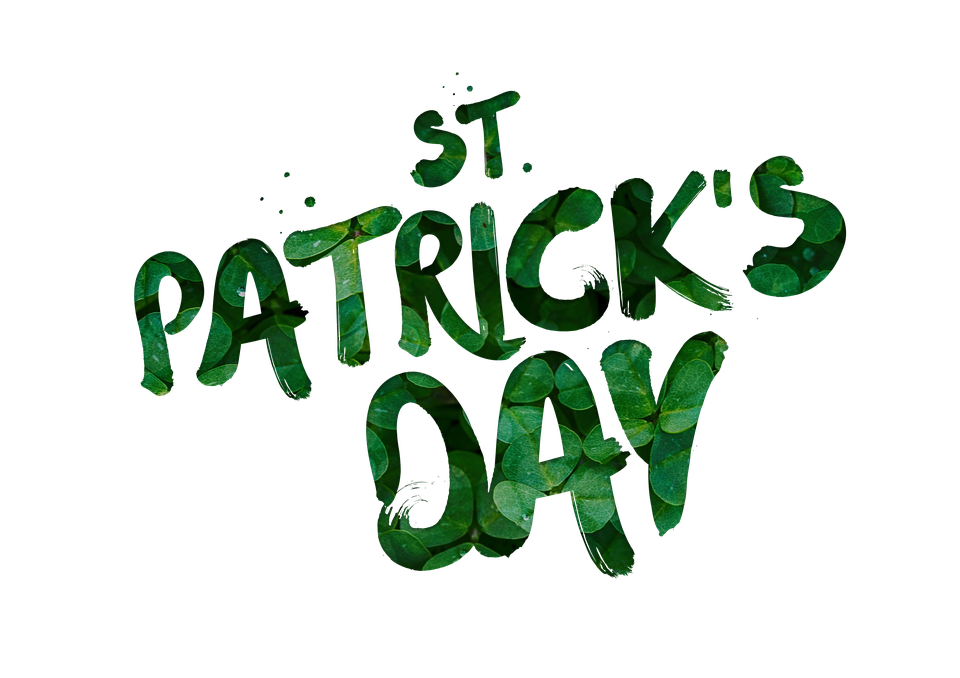
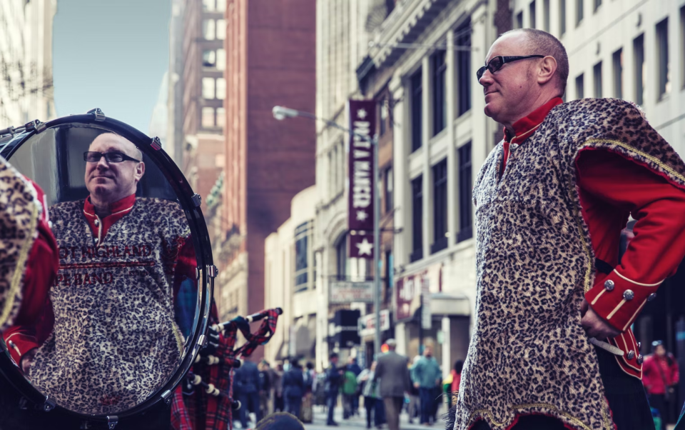

This article has been written and researched by our expert Loveable through a precise methodology. [Learn more about our methodology](https://avada.io/loveable/our-methodological.html)

[Loveable](https://avada.io/loveable/) > [Blog](https://avada.io/loveable/blog/) > [Holiday](https://avada.io/loveable/holiday/)

# St. Patrick’s Day: Facts, Meaning & History

Written by [Blake Simpson](https://avada.io/loveable/author/blake/) Last Updated on August 17, 2023

- [The Origins Of Saint Patrick](https://avada.io/loveable/blog/st-patricks-day/#wp-block-heading-2-2)
    - [1\. Who Was St. Patrick?](https://avada.io/loveable/blog/st-patricks-day/#wp-block-heading-3-3)
    - [2\. Interesting Facts about St. Patrick](https://avada.io/loveable/blog/st-patricks-day/#wp-block-heading-3-6) 
    - [3\. St. Patrick’s Three-leaf clover – The Symbol of Hope and Wish](https://avada.io/loveable/blog/st-patricks-day/#wp-block-heading-3-12)
- [The First St. Patrick’s Day in History](https://avada.io/loveable/blog/st-patricks-day/#wp-block-heading-2-15) 
- [The Growth of St. Patrick’s Day Throughout the History](https://avada.io/loveable/blog/st-patricks-day/#wp-block-heading-2-20) 
- [Festivities Honoring St. Patrick’s Day in Different Parts of the World](https://avada.io/loveable/blog/st-patricks-day/#wp-block-heading-2-30)
- [St. Patrick’s Parade FAQ](https://avada.io/loveable/blog/st-patricks-day/#wp-block-heading-2-38)
    - [When attending the St. Patrick’s Day parade, can I expect to find something to eat?](https://avada.io/loveable/blog/st-patricks-day/#wp-block-heading-3-39)
    - [I’d like to set up a party tent and a barbecue pit, is that okay?](https://avada.io/loveable/blog/st-patricks-day/#wp-block-heading-3-41)
    - [Is there a place where disabled people can view the event?](https://avada.io/loveable/blog/st-patricks-day/#wp-block-heading-3-44)
    - [If I’m not Irish, can I still go to the parade?](https://avada.io/loveable/blog/st-patricks-day/#wp-block-heading-3-46)
- [Bottom Line](https://avada.io/loveable/blog/st-patricks-day/#wp-block-heading-2-48) 

March has the most important holidays for the Irish community in the country and worldwide. It’s **St. Patrick’s Day**, March 17–Ireland’s Independence Day. It is a religious holiday in Ireland that has been celebrated for over a thousand years. This is also the anniversary of Saint Patrick’s death in the fifth century to commemorate the patron saint of this country. Throughout the week, many cultural activities occur not only in Ireland but all over the world, where there is a large Irish community, especially in the Northeastern region of the Americas. Let’s find out interesting things about this unique festival of the land of Clover!

## **The Origins Of Saint Patrick**

### **1\. Who Was St. Patrick?**

Saint Patrick, whose real name is Patricius Magonus Sucatus. He was born around 389 in an English family of Roman origin. At 16, while living in Wales, he was enslaved by pirates and sold to a landowner in Ireland. Six years later, he escaped and began his career as a Christian by studying for 12 years. Saint Patrick became a priest in 417; in 432 was ordained a bishop by the Pope and sent to Ireland, where he is credited with introducing [Christianity](https://en.wikipedia.org/wiki/Christianity) to the locals.

At that time, the Irish religion was run by shamans, and rituals were considered pagan. Therefore, he was arrested many times for many years traveling throughout Ireland to preach, build churches, and have a strong belief in God. Still, later, he eventually escaped continuing his work. He died on March 17, 461, at Downpatrick, at the age of 72. His dedication to the religions was honored by the Irish and recognized by the Church. He was canonized, and Ireland chose the day he passed away – March 17 – as a national holiday: St. Patrick’s Day.

### **2\. Interesting Facts about St. Patrick** 

**Saint Patrick used to have a dark secret**. St. Patrick saw his missionary work in Ireland as an act of penance for a sin he committed as a young man. He was often imprisoned for traveling the country preaching the gospel, but that never deterred him. Someone had told the other bishops about his past mistakes, he said in his writing. Finally, after thirty years, they used a confession of mine against me: a few of the things I did in a single day—or, more accurately, a single hour—when I was a young man,” Patrick wrote.

He never gave any details about the act, leaving us to speculate about his possible misdeeds as a youth. But that only adds to his charisma; it’s nice to know that not even Saints are without flaws.

**Patrick was plagued by apparitions and voices.** It is said that Patrick prayed to God while he was tending sheep in Co. Antrim. A voice told him, “Your ship is ready!” his faith grew stronger, and he began to experience other supernatural phenomena. Time to make his break, he realized.

After returning to safety, he was contacted by an angel who asked him to rescue the people of Ireland again. He said she pleaded with him, “Holy Boy, come and walk again among us.”

### **3\. St. Patrick’s Three-leaf clover – The Symbol of Hope and Wish**

three-leaf clover

It is said that when preaching, Saint Patrick often used the three leaves of a native Irish clover to explain the meaning of the Trinity (Father, Son, and Holy Spirit). That’s why we can see the image of clover everywhere when coming to Ireland. In addition, for the Irish people, clover also means fortune. People paint St Patrick’s Day clover on their faces, clothes, and objects. Everything is about clover. Green also became the symbolic color for the Emerald island. In the Irish language, the phrase “wearing of the green” became very popular, which expresses the Irish spirit: “Irish green” and clover have become a unique cultural imprint, the symbol of Ireland on St. Patrick’s Day around the world.

## **The First St. Patrick’s Day in History** 

St. Patrick’s Day was first celebrated by the Irish in the 10th century, but it wasn’t until 1631 that it was declared a national holiday. You will be surprised when knowing that the first St. Patrick’s Day parades were held in the United States, not Ireland. On March 17, 1601, a Spanish colony in the area that is now St. Augustine, Florida, celebrated St. Patrick’s Day with a parade.

**The first St. Patrick’s Day parade in New York City took place in 1762.**

Irish soldiers serving in the British army marched down the streets of New York in 1762. Despite being far from home, the parade helped them feel connected to their Irish roots, and it quickly became a tradition.

## **The Growth of St. Patrick’s Day Throughout the History** 

The modern-day celebration of St. Patrick’s Day began in the 1700s. [Time](https://time.com/4261456/st-patrick-day-2016-history-real-saint/) reports that the holiday was originally seen as a way to relieve the strict discipline of the weeks leading up to Easter.

**Growing numbers of Irish immigrants flourish St. Patrick’s Day parades and parties across the United States.**

The Protestant majority in the United States despised the immigrants for their foreign religions and dialects, making it difficult for Irish people to find even low-paying work. Newspaper cartoonists caricatured Irish Americans who celebrated their culture by taking to the streets on St. Patrick’s Day as drunk, violent apes.

But everything is getting better in the early 1900s. According to historians, Irish Americans’ rise to prominence as a voting bloc in the United States helped shift public opinion in their favor. And as a positive sign, President Truman marched in the New York St. Patrick’s Day parade in 1948.

**In 1991, the United States declared March as Irish American Heritage Month.**

Because of its proximity to St. Patrick’s Day, March was chosen as Irish American Heritage Month. In the United States, the official recognition only added to the excitement of the holiday celebrations.

In the twentieth century, the holiday of St. Patrick’s Day began to be celebrated for many reasons other than religion in Ireland.

But for now, St. Patrick’s Day is widely recognized and celebrated in many countries in the world.

## **Festivities Honoring St. Patrick’s Day in Different Parts of the World**

</figure>

St. Patrick’s Day is now widely celebrated around the world, but especially in the United States, Canada, and Australia. St. Patrick’s Day is even celebrated in countries far from Ireland, such as Japan, Singapore, and Russia, even though most productions occur in North America.

On the special national day and the most significant cultural festival of beautiful Ireland, the people of Ireland stop all work and enjoy the jubilant atmosphere of the festival together. Offices, schools… are all closed on the festival so that no one will miss this important national holiday. Saint Patrick’s Day was officially recognized as a national holiday around the seventeenth century and gradually became a worldwide representative holiday of Irish communities.

On St. Patrick’s Day, From every corner of the street, the unique architecture to the food and drinks is covered in traditional Irish green. Some people even decorate their faces, clothes, and items with clover, some choose for themselves elaborate costumes, but the prerequisite must be green. In some places, people even dye a river green. Monuments and even ski areas turn green to celebrate this solemn occasion. The festival’s highlight is a grand parade with the participation of a large number of citizens dressed up as different characters in colorful costumes. Together they eat traditional dishes, drink beer and enjoy music. Irish soda bread, corned beef, cabbage, and champ are all traditional dishes associated with the holiday.

In addition, the law required Pubs to close in Ireland from March 17 until the 1970s. However, in 1995, the Irish government launched a nationwide campaign to capitalize on international attention surrounding St. Patrick’s Day to boost tourism and promote Ireland and Irish culture abroad.

**_Related_**_: Check out_ [_37 Best St Patrick’s Day Gifts That Will Bring You Luck_](https://avada.io/loveable/st-patrick-day-gifts/)

## **St. Patrick’s Parade FAQ**

### **When attending the St. Patrick’s Day parade, can I expect to find something to eat?**

Yes. As stated on the page describing the Parade Route, downtown and St. Louis area businesses will be selling food and refreshments during the parade. In addition to snacks, novelties, and beer, they will serve soft drinks, hot dogs, burgers, bratwurst, and other foods and beverages. They can be found at a great number of our city’s intersections, parks, and entertainment districts.

### **I’d like to set up a party tent and a barbecue pit, is that okay?**

Yes, as long as you adhere to the following basic regulations: Your tent can not be larger than 10×10. There is a 20-foot minimum distance that must be maintained between your tent and the sidewalk. It is against the rules for groups to obstruct the normal flow of foot traffic on the sidewalk or to fence off a portion of the curb area.

In addition, charcoal-burning barbecues are permitted, but they must be set up behind the tent for safety reasons so that the smoke does not annoy the other people watching the event. If you have a large group, we recommend that you check out our Irish Clan Tents. Please aware! That the portion of Aloe Plaza spanning 20th to 18th streets is a no-tent and no-reserved space zone.

### **Is there a place where disabled people can view the event?**

Yes. A designated viewing area will be in the southeast corner of 8th and Market.

### **If I’m not Irish, can I still go to the parade?**

Yes, you must be Irish to enjoy St.Patrick’s Day. But you know what? On this day, everyone can be Irish! 

## **Bottom Line** 

With the above lines, hopefully, you will have more knowledge about **St. Patrick’s Day** and be ready to add it to your list of favorite holidays. This is not only a traditional religious holiday but also a very special one with many interesting activities. Let’s prepare for Patrick’s Day this March.

- [The Origins Of Saint Patrick](https://avada.io/loveable/blog/st-patricks-day/#wp-block-heading-2-2)
    - [1\. Who Was St. Patrick?](https://avada.io/loveable/blog/st-patricks-day/#wp-block-heading-3-3)
    - [2\. Interesting Facts about St. Patrick](https://avada.io/loveable/blog/st-patricks-day/#wp-block-heading-3-6) 
    - [3\. St. Patrick’s Three-leaf clover – The Symbol of Hope and Wish](https://avada.io/loveable/blog/st-patricks-day/#wp-block-heading-3-12)
- [The First St. Patrick’s Day in History](https://avada.io/loveable/blog/st-patricks-day/#wp-block-heading-2-15) 
- [The Growth of St. Patrick’s Day Throughout the History](https://avada.io/loveable/blog/st-patricks-day/#wp-block-heading-2-20) 
- [Festivities Honoring St. Patrick’s Day in Different Parts of the World](https://avada.io/loveable/blog/st-patricks-day/#wp-block-heading-2-30)
- [St. Patrick’s Parade FAQ](https://avada.io/loveable/blog/st-patricks-day/#wp-block-heading-2-38)
    - [When attending the St. Patrick’s Day parade, can I expect to find something to eat?](https://avada.io/loveable/blog/st-patricks-day/#wp-block-heading-3-39)
    - [I’d like to set up a party tent and a barbecue pit, is that okay?](https://avada.io/loveable/blog/st-patricks-day/#wp-block-heading-3-41)
    - [Is there a place where disabled people can view the event?](https://avada.io/loveable/blog/st-patricks-day/#wp-block-heading-3-44)
    - [If I’m not Irish, can I still go to the parade?](https://avada.io/loveable/blog/st-patricks-day/#wp-block-heading-3-46)
- [Bottom Line](https://avada.io/loveable/blog/st-patricks-day/#wp-block-heading-2-48) 

### [Blake Simpson](https://avada.io/loveable/author/blake/)

Hi, I'm Blake from Loveable. I help people find perfect gifts for occasions like anniversaries and weddings. I also write a blog about holidays, sharing insights to make them more meaningful. Let's create unforgettable moments together!

- [Twitter](https://twitter.com/intent/tweet)
- [Facebook](https://www.facebook.com/sharer/sharer.php)
- [instagram](https://avada.io/loveable/blog/st-patricks-day/)
- [pinterest](https://www.pinterest.com/loveablellc/)

## Related Posts

[### 120+ Christian Birthday Wishes To Spread Your Love](https://avada.io/loveable/blog/christian-birthday-wishes/) 

[

### 35 Best 70th Birthday Ideas To Celebrate The Special Milestone

](https://avada.io/loveable/blog/70th-birthday-ideas/)

[

### 50 Best 30th Birthday Decorations for a Remarkable Birthday Bash

](https://avada.io/loveable/blog/30th-birthday-decorations/)

[

### 40 Delicious Vegan Christmas Desserts to Delight Your Palate

](https://avada.io/loveable/blog/vegan-christmas-desserts/)

[

### 60 Christmas Team Building Activities to Boost Workplace Spirit

](https://avada.io/loveable/blog/christmas-team-building-activities/)
