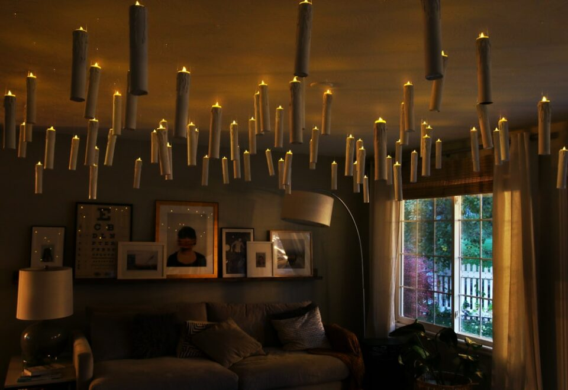
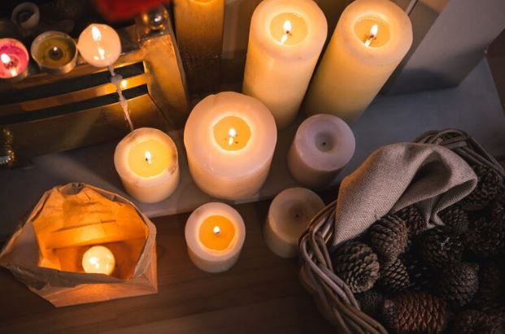
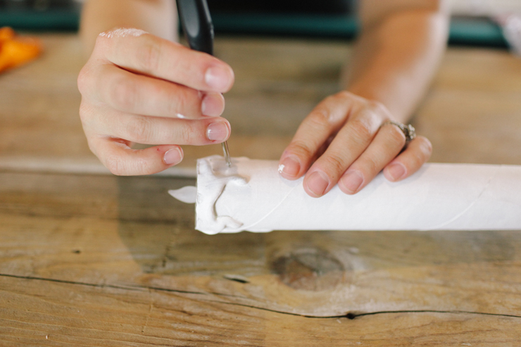
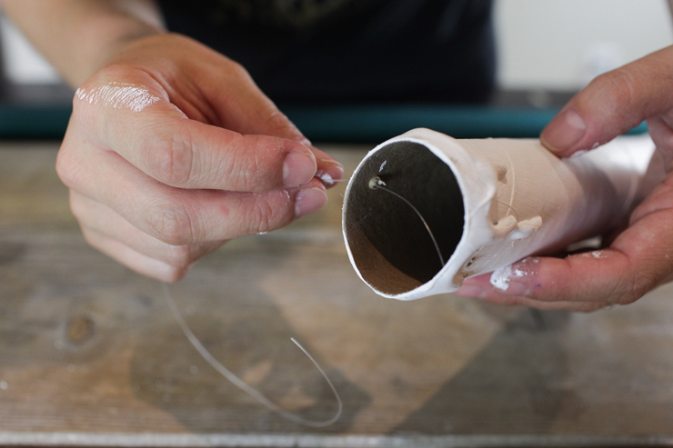
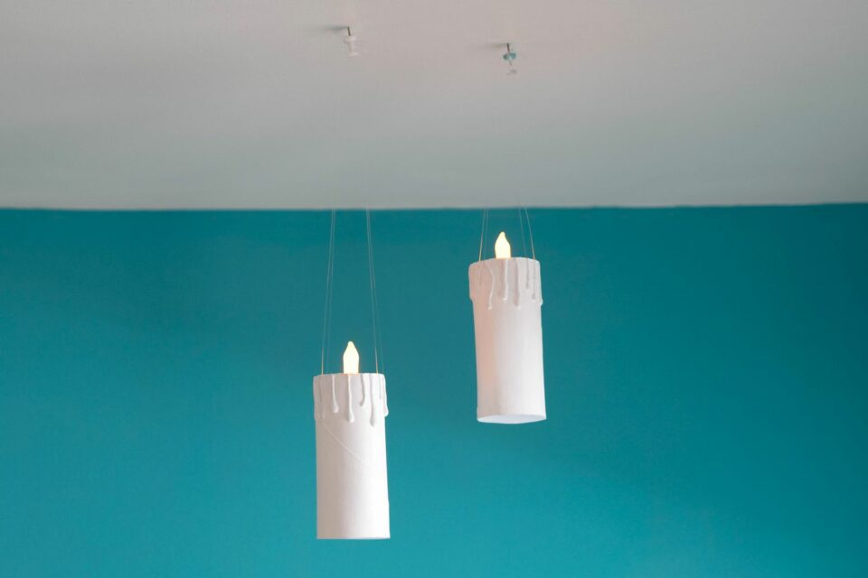
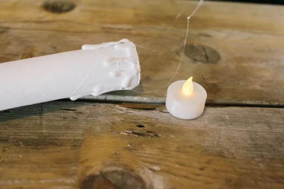
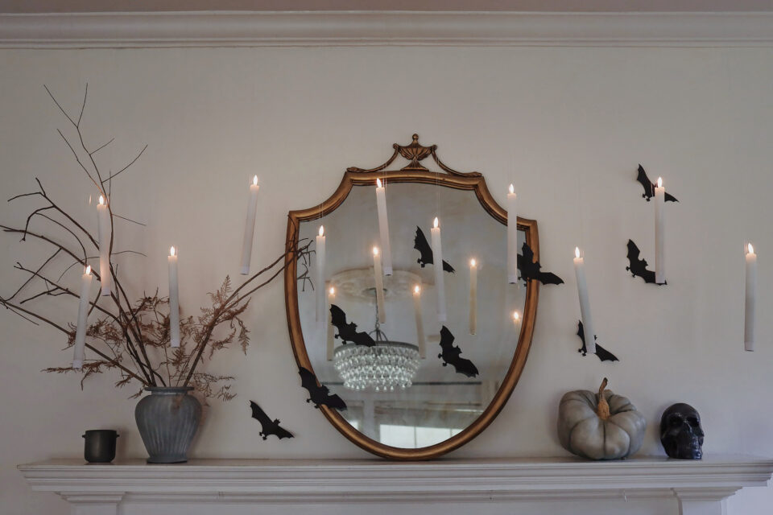

This article has been written and researched by our expert Loveable through a precise methodology. [Learn more about our methodology](https://avada.io/loveable/our-methodological.html)

[Loveable](https://avada.io/loveable/) > [Blog](https://avada.io/loveable/blog/) > [Holiday](https://avada.io/loveable/holiday/)

# Step-by-step to Make DIY Floating Candles for Halloween

Written by [Blake Simpson](https://avada.io/loveable/author/blake/) Last Updated on September 19, 2023

- [Meaning of DIY Floating Candles for Halloween](https://avada.io/loveable/blog/floating-candles-halloween/#wp-block-heading-2-4)
- [How to make DIY Floating Candles on Halloween](https://avada.io/loveable/blog/floating-candles-halloween/#wp-block-heading-2-11)
    - [Step 1 – Preparing the LED Candles](https://avada.io/loveable/blog/floating-candles-halloween/#wp-block-heading-3-12)
    - [Step 2 – Measuring and Cutting Fishing Line](https://avada.io/loveable/blog/floating-candles-halloween/#wp-block-heading-3-16)
    - [Step 3 – Attaching the Fishing Line](https://avada.io/loveable/blog/floating-candles-halloween/#wp-block-heading-3-19)
    - [Step 4 – Hanging the Candles](https://avada.io/loveable/blog/floating-candles-halloween/#wp-block-heading-3-23)
- [Safety Considerations for Floating Candles Halloween](https://avada.io/loveable/blog/floating-candles-halloween/#wp-block-heading-2-28)
    - [1\. Opt for Flameless LED Tea Lights](https://avada.io/loveable/blog/floating-candles-halloween/#wp-block-heading-3-31)
    - [2\. Ensure Stable Containers](https://avada.io/loveable/blog/floating-candles-halloween/#wp-block-heading-3-33)
    - [3\. Keep Away from Children and Flammable Materials](https://avada.io/loveable/blog/floating-candles-halloween/#wp-block-heading-3-35)
    - [4\. Never Leave Unattended](https://avada.io/loveable/blog/floating-candles-halloween/#wp-block-heading-3-38)
    - [5\. Use Command Hooks Safely](https://avada.io/loveable/blog/floating-candles-halloween/#wp-block-heading-3-40)
- [In Conclusion,](https://avada.io/loveable/blog/floating-candles-halloween/#wp-block-heading-2-43)

“Wingardium leviosa!” No need to possess the skills of a Hogwarts student to create enchanting floating candles for a Halloween display inspired by “Harry Potter.” Utilizing the mystical power of transparent fishing lines, the flameless LED candles give the illusion of defying gravity. 

With the assistance of miniature Command hooks, you can suspend these ethereal candles from the ceiling without concern for any surface damage. Combine them with eerie yet elegant embellishments such as branches, bats, and ghostly gray pumpkins, and you’ll have an exquisitely stylish [Halloween mantel](https://avada.io/loveable/halloween-mantel-decor-ideas/). 

But don’t let the magic end after All Hallows’ Eve — simply add a touch of garland and sparkling accents, and these candles effortlessly transition into a festive and cozy holiday mantel.

## **Meaning of DIY Floating Candles for Halloween**

The DIY floating candles for Halloween offer more than just a spooky decoration. They hold a deeper meaning that adds enchantment and intrigue to your festivities. Inspired by the world of “[Harry Potter](https://avada.io/loveable/harry-potter-gifts/)” and the incantation “Wingardium leviosa,” these floating candles evoke a sense of magic and wonder.

By using clear fishing lines and flameless LED candles, these ethereal creations appear to defy gravity, giving an illusion of flickering flames suspended in mid-air. The [Halloween symbolism](https://avada.io/loveable/blog/halloween-symbols-explained/) behind these floating candles is both whimsical and symbolic. They represent the supernatural, the mystical, and the unseen forces that come alive during Halloween.

These candles can transform any space into a bewitching spectacle. When paired with other [Halloween decor](https://avada.io/loveable/blog/halloween-decoration-ideas/), such as branches, bats, and ghostly gray pumpkins, they contribute to an ambiance that is simultaneously eerie and sophisticated.

Beyond Halloween, these floating candles can also be repurposed for the holiday season. With the addition of garlands and sparkling accents, they seamlessly transition into a cozy and festive mantel, illuminating the spirit of celebration.

Embrace the enchantment of DIY floating candles on Halloween, and let their magical glow ignite the imaginations of all who encounter them.

## **How to make DIY Floating Candles on Halloween**

### **Step 1 – Preparing the LED Candles**

Begin by loading batteries into all of your LED candles. Ensure that each switch is turned on to test the functionality using the remote control. We recommend selecting LED candles coated with real wax for a more authentic and visually appealing look. 

These candles often offer a choice between flickering or steady light modes, so opt for the flickering option for a spooky effect. Additionally, check if the candles have a built-in timer feature that allows them to automatically turn on and off.

### **Step 2 – Measuring and Cutting Fishing Line**

To suspend the candles from the ceiling, cut a piece of fishing line that is double the desired length for the hanging distance. For instance, if you intend to hang the candle 36 inches down from the ceiling, cut a piece of fishing line measuring 72 inches. Vary the lengths of the fishing line for each candle to achieve an intriguing staggered arrangement.

### **Step 3 – Attaching the Fishing Line**

Take the top third of the candle and position it in the middle of the fishing line segment. Wrap the fishing line tightly around the candle, crisscrossing the string as you go. Create a secure double knot tightly around the candle to keep it in place. 

Once the knot is secure, gather the two long tails of the fishing line, ensuring they are of equal length. Tie a tight double knot at the ends, forming a large hanging loop that will be used to suspend the candle.

### **Step 4 – Hanging the Candles**

Before hanging the candles, plan the spacing to achieve the desired aesthetic. Using adhesive Command hooks, attach them to the desired spots on the ceiling. For easy installation, we suggest starting from the center of the mantel or designated area and gradually working outward on each side. 

Space the candles approximately 6 inches apart for an evenly distributed and visually pleasing arrangement. Once the hooks are firmly in place, hang each candle from the loops you created earlier.

[Refer to the tutorial!](https://www.hunker.com/13768823/floating-candles-holiday-decor-diy-tutorial)

## **Safety Considerations for Floating Candles Halloween**

Remember to always prioritize safety and take necessary precautions to create a safe and enjoyable Halloween experience.

### **1\. Opt for Flameless LED Tea Lights**

When creating your DIY floating candles Halloween, it is essential to prioritize safety by using flameless [LED tea lights](https://www.amazon.com/led-tea-lights/s?k=led+tea+lights) instead of traditional candles. LED lights provide a realistic flickering effect without the risk of open flames. This eliminates the potential for accidental fires, especially in areas with flammable decorations or fabrics.

### **2\. Ensure Stable Containers**

When selecting containers or holders for floating candles, it is crucial to prioritize stability. Choose vessels that are sturdy and won’t easily tip over, ensuring that the candles remain secure and upright throughout the display. Avoid using containers that are top-heavy or prone to wobbling, as this can increase the risk of accidents or spills.

### **3\. Keep Away from Children and Flammable Materials**

Floating candles should be placed in areas that are out of reach of children to minimize the risk of accidental contact or tampering. It is also important to keep the candles away from flammable materials such as curtains, drapes, or other decorations that could potentially ignite if in close proximity to the heat generated by the candles. Ensure that there is ample space between the candles and any surrounding objects to prevent accidental fires.

### **4\. Never Leave Unattended**

It is essential to never leave floating candles unattended, even if they are flameless LED lights. While LED lights reduce the risk of fire, it is still important to exercise caution and monitor the candles periodically to ensure they are functioning properly and there are no signs of overheating or malfunctioning.

### **5\. Use Command Hooks Safely**

When hanging the floating candles from the ceiling using adhesive Command hooks, ensure that the hooks are properly secured and can support the weight of the candles. Follow the instructions provided by the manufacturer to ensure proper installation. Avoid placing hooks on surfaces that may not adhere well or can be easily damaged.

**_Check out_**: Best [Personalized Candles](https://avada.io/loveable/personalized-candles/) That’ll Be Perfect Gifts

## **In Conclusion,**

Creating DIY floating candles for Halloween can be a fun and creative project to enhance the spooky ambiance of the season. By following the step-by-step guide and considering safety precautions, you can bring a touch of magic and mystique to your Halloween decorations. 

Flameless LED tea lights ensure a safer alternative to traditional candles, eliminating the risk of fire hazards. Sturdy containers and proper placement help maintain the stability of the candles, preventing accidents and spills. Keeping the candles out of reach of children and away from flammable materials ensures a safe environment. 

By adhering to these guidelines, you can enjoy the mesmerizing effect of floating candles while ensuring the well-being of yourself and others. So, gather your materials, unleash your creativity, and embark on the journey of creating your own captivating DIY floating candles for a truly enchanting Halloween experience.

- [Meaning of DIY Floating Candles for Halloween](https://avada.io/loveable/blog/floating-candles-halloween/#wp-block-heading-2-4)
- [How to make DIY Floating Candles on Halloween](https://avada.io/loveable/blog/floating-candles-halloween/#wp-block-heading-2-11)
    - [Step 1 – Preparing the LED Candles](https://avada.io/loveable/blog/floating-candles-halloween/#wp-block-heading-3-12)
    - [Step 2 – Measuring and Cutting Fishing Line](https://avada.io/loveable/blog/floating-candles-halloween/#wp-block-heading-3-16)
    - [Step 3 – Attaching the Fishing Line](https://avada.io/loveable/blog/floating-candles-halloween/#wp-block-heading-3-19)
    - [Step 4 – Hanging the Candles](https://avada.io/loveable/blog/floating-candles-halloween/#wp-block-heading-3-23)
- [Safety Considerations for Floating Candles Halloween](https://avada.io/loveable/blog/floating-candles-halloween/#wp-block-heading-2-28)
    - [1\. Opt for Flameless LED Tea Lights](https://avada.io/loveable/blog/floating-candles-halloween/#wp-block-heading-3-31)
    - [2\. Ensure Stable Containers](https://avada.io/loveable/blog/floating-candles-halloween/#wp-block-heading-3-33)
    - [3\. Keep Away from Children and Flammable Materials](https://avada.io/loveable/blog/floating-candles-halloween/#wp-block-heading-3-35)
    - [4\. Never Leave Unattended](https://avada.io/loveable/blog/floating-candles-halloween/#wp-block-heading-3-38)
    - [5\. Use Command Hooks Safely](https://avada.io/loveable/blog/floating-candles-halloween/#wp-block-heading-3-40)
- [In Conclusion,](https://avada.io/loveable/blog/floating-candles-halloween/#wp-block-heading-2-43)

### [Blake Simpson](https://avada.io/loveable/author/blake/)

Hi, I'm Blake from Loveable. I help people find perfect gifts for occasions like anniversaries and weddings. I also write a blog about holidays, sharing insights to make them more meaningful. Let's create unforgettable moments together!

- [Twitter](https://twitter.com/intent/tweet)
- [Facebook](https://www.facebook.com/sharer/sharer.php)
- [instagram](https://avada.io/loveable/blog/floating-candles-halloween/)
- [pinterest](https://www.pinterest.com/loveablellc/)

## Related Posts

[### 120+ Christian Birthday Wishes To Spread Your Love](https://avada.io/loveable/blog/christian-birthday-wishes/) 

[

### 35 Best 70th Birthday Ideas To Celebrate The Special Milestone

](https://avada.io/loveable/blog/70th-birthday-ideas/)

[

### 50 Best 30th Birthday Decorations for a Remarkable Birthday Bash

](https://avada.io/loveable/blog/30th-birthday-decorations/)

[

### 40 Delicious Vegan Christmas Desserts to Delight Your Palate

](https://avada.io/loveable/blog/vegan-christmas-desserts/)

[

### 60 Christmas Team Building Activities to Boost Workplace Spirit

](https://avada.io/loveable/blog/christmas-team-building-activities/)
