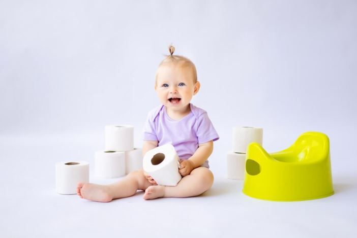
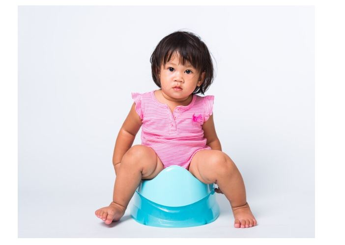

This article has been written and researched by our expert Loveable through a precise methodology. [Learn more about our methodology](https://avada.io/loveable/our-methodological.html)

[Loveable](https://avada.io/loveable/) > [Blog](https://avada.io/loveable/blog/) > [Family](https://avada.io/loveable/family/)

# The Best Potty Training Tips for Girls: What You Need To Know

Written by [Rose Bryne](https://avada.io/loveable/author/rose/) Last Updated on August 16, 2023

- [When Should a Girl Be Potty Trained?](https://avada.io/loveable/blog/potty-training-tips-for-girls/#wp-block-heading-2-4)
- [How Long Does Potty Training a Girl Take?](https://avada.io/loveable/blog/potty-training-tips-for-girls/#wp-block-heading-2-18)
- [The best potty training tips for girls](https://avada.io/loveable/blog/potty-training-tips-for-girls/#wp-block-heading-2-25)
    - [She can watch you use the potty](https://avada.io/loveable/blog/potty-training-tips-for-girls/#wp-block-heading-3-27)
    - [Make sure you have the necessary equipment](https://avada.io/loveable/blog/potty-training-tips-for-girls/#wp-block-heading-3-32)
    - [Help her feel at ease using the toilet](https://avada.io/loveable/blog/potty-training-tips-for-girls/#wp-block-heading-3-36)
    - [Create a schedule for potty training](https://avada.io/loveable/blog/potty-training-tips-for-girls/#wp-block-heading-3-42)
    - [Honor her achievements](https://avada.io/loveable/blog/potty-training-tips-for-girls/#wp-block-heading-3-49)
- [The Bottom Line](https://avada.io/loveable/blog/potty-training-tips-for-girls/#wp-block-heading-2-52)

Potty training can seem like a daunting task for even the most experienced parent. With pressures from daycare scheduling and expectations of family and friends, it’s easy to become overwhelmed with learning how to optimize your little girl’s transition out of diapers. 

The good news is that potty training doesn’t have to be a stressful experience; with some patience, understanding, and practical tips, you can make it an enjoyable one! To ease this transition in your household, look no further than **this helpful guide on the best potty training tips for girls.**

Here, we’ll share expert advice on what you need to do (and what not to do) when navigating through the steps of teaching your daughter how to use the restroom properly.

## When Should a Girl Be Potty Trained?

What’s the best age to start potty training a girl? Between 18 and 24 months, most girls start to express interest in using the potty. This is a perfect age for girls to start toilet training. They often start to talk and have the ability to recognize when they need to pee or poo.

In fact, potty training a girl has no set age, and the optimal time will depend on your child’s particular preparedness. Some girls are ready to start toilet training around 18 months, while others aren’t interested until they’re about [3 years old](https://avada.io/loveable/birthday-gifts-3-year-olds/) – both are completely fine ages to start.

When Should a Girl Be Potty Trained?

Moreover, toilet training involves a variety of physical and cognitive abilities, and potty training success is determined more by your child’s preparedness than by her age. She must not only walk and sit on the toilet, put on and take off clothing, regulate her bladder and bowel motions, and sit for at least a couple minutes at a time – but she has to communicate when she has to go and comprehend and follow directions.

It’s necessary not to put too much pressure on yourself because of your age, though. When you see these indications, your daughter is ready to start potty training.

- She sees you using the restroom or otherwise displaying interest in the toilet.
- Your girl will go without peeing for an hour or two before doing so again.
- She is yelling over a wet or soiled diaper.
- When she poos, she is hiding.
- When she needs to go pee, she lets you know.
- She is raising and lowering her pants.
- She is doing as instructed.

It’s time to start your [little girl](https://avada.io/loveable/gifts-little-girl/) on potty training when you see these signs.

## How Long Does Potty Training a Girl Take?

Girl potty training can be a little difficult. Every child is unique, and some girls could take longer to catch on than others.

Keep in mind that your child is special. When she’s ready, she’ll be entirely toilet-trained.

How long it will take to toilet-train your daughter is a question that has no definitive answer. However, a usual estimate is between three and six months.

Potty training takes significantly longer when it comes to naps and nighttime use. Up to five, some kids could have accidents while napping or sleeping. They could sleep profoundly or for a longer period if they have poor bladder control.

Fortunately, a few useful potty training tips for girls to have in mind might make the procedure go more easily. 

How Long Does Potty Training a Girl Take?

## The best potty training tips for girls

Some parents adhere to the popular tips for potty training a girl in 3 days, while others adopt a more progressive approach and introduce the ideas gradually. Whatever you decide, remember to be consistent, positive, and supportive. Continue reading for more information on tips and tricks for potty training a girl.

### **She can watch you use the potty**

Toddlers learn by imitation, and seeing you use the restroom is a natural first step in toilet training. It is critical to be precise when discussing bodies. If you educate her to refer to her vaginal area as “wee-wee” while every other part has a more formal-sounding term, she may conclude that her genitals are embarrassing.

If your kid has seen her bigger brother, father, or a preschool or daycare buddy stand tall at the toilet, she will most likely want to attempt standing up as well. Allow her to see you and explain how girls sit down to pee.

**She can watch you use the potty**

Let her know if she insists on standing up. Sure, you’ll have to clean up a few messes, but she’ll probably realize pretty soon that she lacks the necessary tools, and you won’t have to fight her in a power struggle.

### **Make sure you have the necessary equipment**

Most experts recommend purchasing a child-size potty, which your toddler will feel more confident using than a full-size toilet. Some kids are scared of falling into the toilet, and this nervousness can make potty training difficult.

If you want to buy an adaptor seat for your conventional toilet, ensure sure it is comfortable, secure, and securely attached. If you take this route, have a stool nearby as well; it’s essential that your daughter can easily get on and off the toilet whenever she has to. She must also be able to balance herself with her feet to push during bowel movements.

Bathrooms may be dangerous places for curious toddlers, so keep an eye on her as she uses the toilet. You could also get some picture books or films for your daughter to help her make sense of all this new knowledge. There are various books to select from, including downloadable applications, dolls, and small toilets.

### **Help her feel at ease using the toilet**

Early in toilet training, your child should become accustomed to the thought of using the potty. Therefore, this is one of the most useful potty training tips for a girl.

Begin by informing her that the toilet chair is hers. Make it her own by putting her name on it or allowing her to [personalize it with stickers](https://avada.io/loveable/personalized-stickers/). Then make her sit on it while wearing her clothing.

**Help her feel at ease using the toilet**

After a week or two of practice, you can propose she tries it with her trousers down. Avoid the urge to put pressure on her if she appears resistive. This will lead to a power struggle, derailing the entire process.

Use a favorite doll or stuffed animal for toilet demonstrations if your child has one. Most girls like seeing [their favorite toy](https://avada.io/loveable/toys-2-year-olds/) go through the movements, and they may learn more this way than merely hearing you tell them what to do. You could even build a toilet for the doll or plush animal. Then, while your child uses the toilet, her toy may sit on theirs.

### **Create a schedule for potty training**

These potty training tips for girls will depend on your daily schedule and if your child attends daycare or preschool. If she is, discuss and try to coordinate your toilet training method with her daycare provider or instructor.

You must choose between the back-and-forth way of moving between diapers and underwear and the cold-turkey strategy of converting to underwear full-time.

Some experts advise starting with disposable training pants, similar to diapers but can be pulled up and down like underwear. Other experts, however, disagree, recommending that your daughter immediately moves into underwear or old-fashioned cotton training pants, which will allow her to feel when she’s wet. That, of course, increases the likelihood that you’ll be cleaning up after any mishaps.

You must determine what is best for you and your child. Your child’s doctor may advise you in any direction. And your child’s daycare provider or preschool instructor may have their own ideas about when it’s OK to change into underpants at school.

For the time being, you should keep using diapers at night. Most toddlers begin nighttime toilet training after they have successfully completed daytime training.

**Create a schedule for potty training**

### Honor her achievements

 Your child will almost certainly have a few accidents as she learns to use the potty, but she will ultimately recognize the accomplishment of getting anything in the toilet. It’s OK – even recommended – to make a big deal out of this occasion. Reward her for reaching a major milestone by giving her a “big child” privilege, such as an additional bedtime story.

That being said, try not to make a huge deal out of every trip to the bathroom, or your girl may get uneasy and self-conscious in the glare of all that attention. This is one of the most difficult lessons for her early ages, even for normal or you have potty training tips for autistic girls, so be patient and optimistic with her.

## The Bottom Line

Potty training can be a tough process, especially when it comes to girls. Not only do they have to learn how to use the potty chair or toilet, but they also have to learn the social cues associated with it and know when is the right time to do their business. 

Using one of **these potty training tips for girls** that speak directly to a girl’s sense of independence, having a designated potty area for her exclusive use, as well as having age-appropriate resources like [books](https://avada.io/loveable/personalized-children-books/) and dolls, can make the process more successful. 

Having realistic expectations around toilet training is essential – it may not take just one day, so keep being patient with her while she learns. Ultimately, by responding kindly while offering reinforcement and rewards along with teaching proper bathroom etiquette, potty training your daughter will become more enjoyable. 

So don’t worry if you have a challenging time getting your daughter ready for independent toileting; just remember that by setting her up for success through preparedness and patience, you – as well as your daughter – will come out on top!

- [When Should a Girl Be Potty Trained?](https://avada.io/loveable/blog/potty-training-tips-for-girls/#wp-block-heading-2-4)
- [How Long Does Potty Training a Girl Take?](https://avada.io/loveable/blog/potty-training-tips-for-girls/#wp-block-heading-2-18)
- [The best potty training tips for girls](https://avada.io/loveable/blog/potty-training-tips-for-girls/#wp-block-heading-2-25)
    - [She can watch you use the potty](https://avada.io/loveable/blog/potty-training-tips-for-girls/#wp-block-heading-3-27)
    - [Make sure you have the necessary equipment](https://avada.io/loveable/blog/potty-training-tips-for-girls/#wp-block-heading-3-32)
    - [Help her feel at ease using the toilet](https://avada.io/loveable/blog/potty-training-tips-for-girls/#wp-block-heading-3-36)
    - [Create a schedule for potty training](https://avada.io/loveable/blog/potty-training-tips-for-girls/#wp-block-heading-3-42)
    - [Honor her achievements](https://avada.io/loveable/blog/potty-training-tips-for-girls/#wp-block-heading-3-49)
- [The Bottom Line](https://avada.io/loveable/blog/potty-training-tips-for-girls/#wp-block-heading-2-52)

### [Rose Bryne](https://avada.io/loveable/author/rose/)

Hi, I'm Rose! I love animals and spending time with kids. At Loveable, I help people find unique gifts for special occasions like Valentine's Day, housewarmings, and graduations. I enjoy finding gifts for kids, teens, and animal lovers that match their interests and personalities. Making gift-giving a pleasant experience is my priority. Let me assist you in finding the perfect gift!

- [Twitter](https://twitter.com/intent/tweet)
- [Facebook](https://www.facebook.com/sharer/sharer.php)
- [instagram](https://avada.io/loveable/blog/potty-training-tips-for-girls/)
- [pinterest](https://www.pinterest.com/loveablellc/)

## Related Posts

[### 30 Best 4 Year Old Birthday Party Ideas For A Memorable Celebration](https://avada.io/loveable/blog/4-year-old-birthday-party-ideas/) 

[

### 16th Birthday Party Ideas to Make an Unforgettable Day

](https://avada.io/loveable/blog/16th-birthday-party-ideas/)

[

### 150+ Inspirational Birthday Quotes to Spread Joy on Special Day

](https://avada.io/loveable/blog/inspirational-birthday-quotes/)

[

### 160+ Birthday Wishes for Wife to Express Eternal Love

](https://avada.io/loveable/blog/birthday-wishes-for-wife/)

[### 90+ Heart Touching Birthday Wishes for Niece to Make Her Day Extra Special](https://avada.io/loveable/blog/birthday-wishes-for-niece/)
